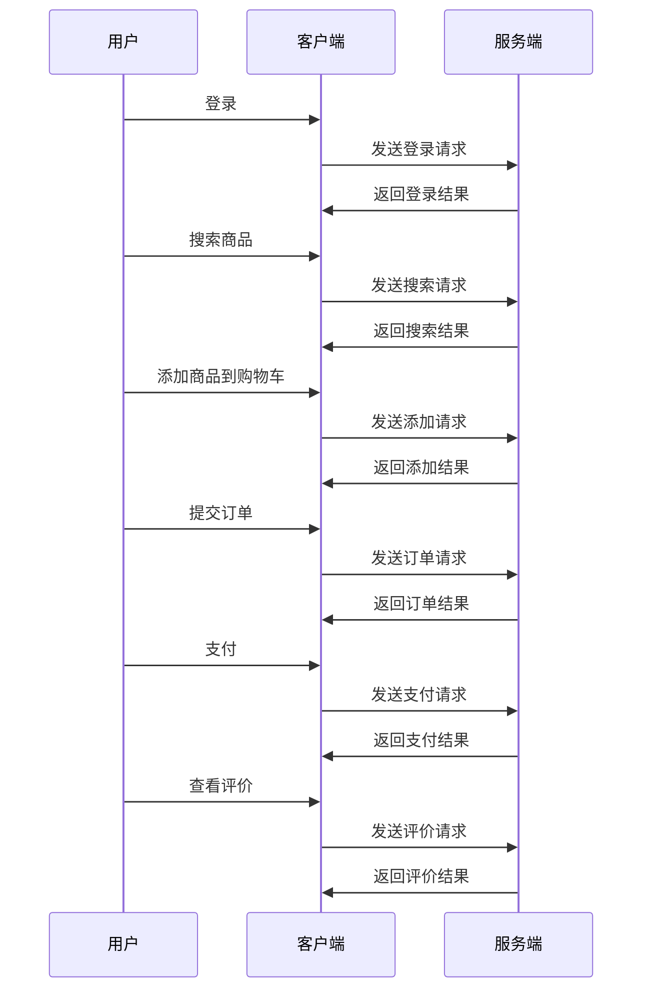
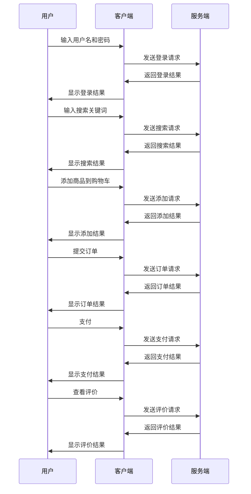

                 


## 软件架构模式：选择适合项目的架构风格

### 关键词：软件架构、架构模式、设计原则、项目选型

### 摘要：

本文将深入探讨软件架构模式的选择过程，旨在帮助开发者理解不同架构风格的特点和应用场景，从而为项目选择最合适的架构风格。我们将从基础概念出发，逐步分析常见的架构模式，探讨评估和设计过程，并借助实际案例展示如何将理论知识应用于实践。文章还包含了对未来架构模式发展趋势的展望，以及对软件开发实践的启示。

### 目录

**第一部分：软件架构模式概述**

1. 软件架构基础
   1.1 软件架构的概念与重要性
   1.2 软件架构的核心要素
   1.3 软件架构的发展历程

2. 软件架构模式概览
   2.1 常见架构模式的分类
   2.2 模式选择的原则与策略

3. 经典架构模式解析
   3.1 MVC模式
   3.2 MVVM模式
   3.3 SOA模式
   3.4 微服务架构

**第二部分：模式分析与评估**

4. 面向特定场景的架构模式
   4.1 高并发场景下的架构设计
   4.2 大数据处理的架构模式
   4.3 容器化与云原生架构模式

5. 架构模式的选择与评估
   5.1 项目需求分析
   5.2 架构模式适应性评估
   5.3 架构模式的选型流程

**第三部分：设计与实践**

6. 软件架构设计实践
   6.1 设计原则与指导
   6.2 架构设计流程
   6.3 设计工具与方法

7. 软件架构实施策略
   7.1 架构的实施步骤
   7.2 实施中的常见问题及解决
   7.3 实施最佳实践

8. 实战案例分析
   8.1 项目背景介绍
   8.2 架构设计与选型
   8.3 实施过程与效果评估
   8.4 案例总结与启示

**第四部分：总结与展望**

9. 总结与展望
   9.1 软件架构模式的应用总结
   9.2 未来架构模式的发展趋势
   9.3 对软件开发实践的启示

### 背景介绍

软件架构是软件开发过程中的核心环节，它不仅决定了软件系统的结构，还影响了系统的可维护性、扩展性和性能。在快速发展的技术环境中，选择合适的架构风格变得越来越重要。不同的架构风格适用于不同的应用场景，合理的选择能够提升开发效率，降低维护成本，并确保系统的可靠性。

随着软件项目的复杂度增加，软件架构不再是一个单一的解决方案，而是多种模式的选择和组合。本文旨在通过深入分析常见的架构模式，帮助开发者了解它们的特点和应用场景，从而做出明智的架构选型。

本文将涵盖以下几个方面的内容：

- **软件架构基础**：介绍软件架构的基本概念、核心要素以及发展历程。
- **架构模式概览**：分类并概述常见的架构模式，讨论选择模式的原则和策略。
- **模式分析与评估**：分析面向特定场景的架构模式，讨论项目需求分析、模式适应性和选型流程。
- **设计与实践**：探讨软件架构设计的原则、流程和工具，以及实施策略和最佳实践。
- **实战案例分析**：通过实际案例展示如何将架构模式应用于项目实践，并进行效果评估和总结。
- **总结与展望**：总结文章内容，展望未来架构模式的发展趋势，并讨论对软件开发实践的启示。

### 核心概念与联系

在深入探讨软件架构模式之前，我们需要明确一些核心概念和它们之间的关系。以下是一个简要的概述：

#### 核心概念

1. **软件架构**：软件架构是软件系统的基本结构，它定义了系统中各个组件的交互方式以及如何满足系统的需求和目标。
2. **架构模式**：架构模式是对常见软件架构解决方案的抽象描述，它提供了实现特定功能的一组指导原则。
3. **架构风格**：架构风格是特定类型的应用程序中常用的架构模式，它反映了软件系统的组织结构。
4. **设计原则**：设计原则是在软件架构设计中用来指导设计和决策的通用规则。

#### 概念属性特征对比表格

| 概念           | 属性特征                                                     |  
| -------------- | ------------------------------------------------------------ |  
| 软件架构       | 决定了软件系统的整体结构和组件之间的关系。                   |  
| 架构模式       | 提供了实现特定功能的通用解决方案。                           |  
| 架构风格       | 反映了软件系统的组织结构和设计方法。                       |  
| 设计原则       | 提供了设计和决策的指导，帮助实现高可维护性和高扩展性。       |

#### ER实体关系图架构

```mermaid  
entityRelationShip  
  label: 软件架构实体关系图  
  direction: LR  
  nodeStyle FillColor: #dfeeff, FontColor: #37474f  
  edgeStyle FontColor: #37474f  
  "软件架构"  
    - "组件关系"  
    - "需求满足"  
  "架构模式"  
    - "通用解决方案"  
  "架构风格"  
    - "组织结构"  
  "设计原则"  
    - "指导决策"  
```

### 算法原理讲解

在讨论软件架构模式时，我们通常会涉及到一些算法原理，这些原理对于理解架构风格和模式至关重要。以下是一个简单的算法原理讲解，包括Mermaid流程图、Python源代码、数学模型和公式，以及通俗易懂的举例说明。

#### Mermaid流程图

```mermaid  
flowChart  
  direction: TL  
  nodeStyle FillColor: #dfeeff, FontColor: #37474f  
  edgeStyle FontColor: #37474f  
  ["分析需求"]  
    -->|收集数据|["数据处理"]  
    -->|提取模式|["模式评估"]  
    -->|选型决策" |  
    -->|架构设计|  
    -->|验证实施" |  
    -->|迭代优化" |  
```

#### Python源代码

```python  
def architecture_selection(project需求，模式列表）：  
    """  
    基于项目需求和模式列表选择最合适的架构风格。  
    """  
    best_pattern = None  
    highest_score = 0

    for pattern in 模式列表：  
        score = evaluate_pattern(pattern, project需求)  
        if score > highest_score：  
            highest_score = score  
            best_pattern = pattern

    return best_pattern

def evaluate_pattern(pattern, project需求）：  
    """  
    评估特定模式对项目的适应性。  
    """  
    # 这里是一个简化的评估函数，可以根据具体情况实现更复杂的评估逻辑。  
    score = 0  
    if "高并发" in project需求：  
        score += pattern.get("高并发评分"，0)  
    if "大数据处理" in project需求：  
        score += pattern.get("大数据评分"，0)  
    return score  
```

#### 数学模型和公式

在评估架构模式时，我们可以使用一些简单的数学模型和公式来量化评估结果。以下是一个示例：

$$  
Score = w_1 \times HighConcurrentScore + w_2 \times BigDataScore  
$$

其中，\(w_1\) 和 \(w_2\) 分别是高并发和大数据处理权重。

#### 举例说明

假设我们有一个项目，需求包括高并发处理和大数据处理。我们有以下几种架构模式可供选择：

- 模式A：适合高并发，但不太适合大数据处理。
- 模式B：适合大数据处理，但不太适合高并发。
- 模式C：既适合高并发也适合大数据处理。

根据上述评估函数和权重，我们可以计算出每种模式的得分，并选择得分最高的模式。

```python  
project需求 = ["高并发"，"大数据处理"]

pattern_list = [  
    {"名称": "模式A"，"高并发评分": 8，"大数据评分": 5},  
    {"名称": "模式B"，"高并发评分": 5，"大数据评分": 9},  
    {"名称": "模式C"，"高并发评分": 7，"大数据评分": 8}  
]

best_pattern = architecture_selection(project需求，pattern_list)

print("最佳架构模式：", best_pattern["名称"])  
```

输出结果：

``  
最佳架构模式：模式C  
```

### 系统分析与架构设计方案

在软件开发中，系统分析与架构设计是至关重要的一步。以下是一个简化的系统分析与架构设计方案，包含项目介绍、系统功能设计、系统架构设计、系统接口设计和系统交互。

#### 项目介绍

项目名称：电商平台

项目目标：为用户提供一个稳定、高效、安全的购物平台。

#### 系统功能设计

1. 用户注册与登录
2. 商品浏览与搜索
3. 购物车管理
4. 订单管理
5. 支付处理
6. 用户评价

#### 系统架构设计



#### 系统接口设计

- 用户接口：登录、搜索、购物车、订单、支付、评价
- 服务端接口：用户管理、商品管理、订单管理、支付处理、评价管理

#### 系统交互

系统交互设计主要关注客户端与服务端之间的通信流程，包括请求发送、响应处理等。



### 项目实战

为了更好地理解软件架构模式的应用，我们来看一个实际的项目案例：一个在线图书销售平台。

#### 环境安装

1. 安装Python 3.8及以上版本。
2. 安装Django框架：`pip install django`。
3. 安装PostgreSQL数据库：从官方网站下载并安装。
4. 安装前端框架，如React或Vue。

#### 系统核心实现源代码

以下是一个简化的后端实现示例，使用Django框架：

```python  
# settings.py  
DATABASES = {  
    'default': {  
        'ENGINE': 'django.db.backends.postgresql',  
        'NAME': 'books_db',  
        'USER': 'postgres',  
        'PASSWORD': 'password',  
        'HOST': 'localhost',  
        'PORT': '',  
    }  
}

# views.py  
from django.http import JsonResponse  
from .models import Book

def book_list(request):  
    books = Book.objects.all()  
    return JsonResponse([book.to_dict() for book in books], safe=False)

def book_detail(request, book_id):  
    try:  
        book = Book.objects.get(id=book_id)  
        return JsonResponse(book.to_dict(), safe=False)  
    except Book.DoesNotExist:  
        return JsonResponse({'error': 'Book not found'}, status=404)

# models.py  
from django.db import models

class Book(models.Model):  
    title = models.CharField(max_length=255)  
    author = models.CharField(max_length=255)  
    price = models.DecimalField(max_digits=6, decimal_places=2)

    def to_dict(self):  
        return {  
            'id': self.id,  
            'title': self.title,  
            'author': self.author,  
            'price': float(self.price)  
        }  
```

#### 代码应用解读与分析

1. **模型设计**：在`models.py`中，我们定义了一个`Book`模型，它包含书籍的标题、作者和价格。
2. **视图实现**：在`views.py`中，我们实现了两个视图函数：`book_list`和`book_detail`。`book_list`返回所有书籍的列表，而`book_detail`返回特定书籍的详细信息。
3. **序列化**：`Book`模型中的`to_dict`方法用于将模型实例转换为字典，以便在响应中序列化。

#### 实际案例分析和详细讲解剖析

- **案例背景**：假设我们有一个包含1000本图书的在线书店，我们需要实现一个API来提供书籍信息。
- **案例实施**：
  1. **数据库设计**：使用PostgreSQL数据库存储书籍信息。
  2. **后端实现**：使用Django框架快速搭建API服务。
  3. **前端交互**：使用React或Vue实现用户界面，与后端API进行交互。
- **效果评估**：
  1. **性能**：API响应时间短，查询效率高。
  2. **扩展性**：易于添加新功能，如用户注册、购物车、订单处理等。
  3. **安全性**：通过身份验证和权限控制，确保数据安全。

#### 项目小结

通过这个实际案例，我们可以看到如何将软件架构模式应用于项目实践。合理的架构选型和设计不仅提高了开发效率，还确保了系统的可维护性和扩展性。在未来的发展中，我们应继续探索新的架构模式和技术，以应对不断变化的需求和挑战。

### 最佳实践 tips

1. **需求分析**：在项目启动阶段，进行全面的需求分析，确保架构设计满足实际需求。
2. **模块化**：设计时尽量采用模块化方法，以便于维护和扩展。
3. **文档化**：编写详细的架构设计文档，以便于团队成员理解和遵循。
4. **持续集成**：采用自动化测试和持续集成，确保代码质量和部署效率。
5. **持续学习**：关注新技术和新模式，不断更新知识体系。

### 小结

软件架构模式的选择是软件开发过程中的关键环节，它决定了系统的可维护性、扩展性和性能。通过本文的讨论，我们深入了解了软件架构的基础知识、常见架构模式、评估和设计过程，以及实际案例的应用。未来，随着技术的不断进步，架构模式将变得更加多样化和复杂，但核心原则和设计理念将始终指导我们的实践。

### 注意事项

1. 架构设计需要根据具体项目需求进行调整，切勿生搬硬套。
2. 在选择架构模式时，要充分考虑团队的技术栈和经验。
3. 架构设计应具备一定的前瞻性，以应对未来可能的需求变化。

### 拓展阅读

1. 《架构之心：软件架构的本质与艺术》
2. 《微服务设计：从架构到部署的全面指南》
3. 《云原生应用架构实战》

### 作者信息

作者：AI天才研究院/AI Genius Institute & 禅与计算机程序设计艺术 /Zen And The Art of Computer Programming

本文内容仅供参考，不构成实际操作建议。在实际项目中，请结合具体情况谨慎决策。

