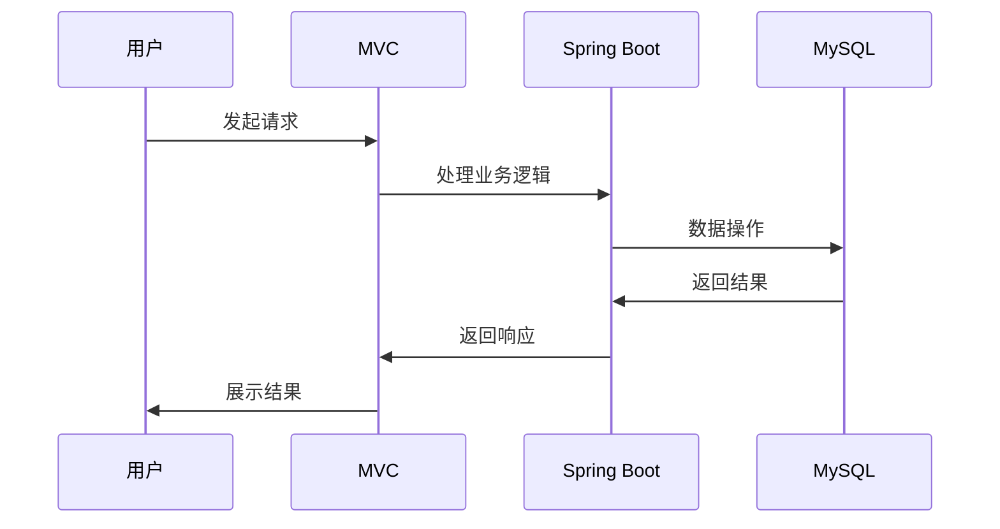
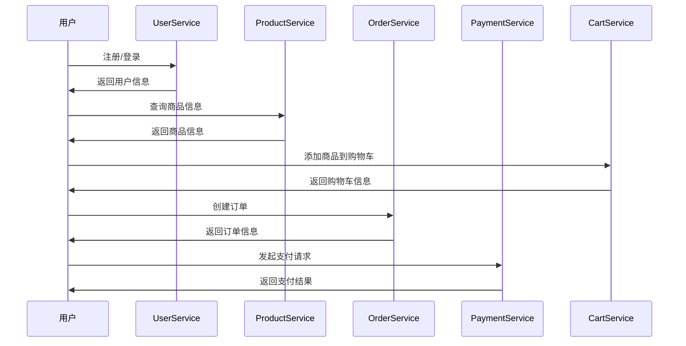

                 

### 引言：软件架构的演变与挑战

在软件工程的发展历程中，软件架构扮演着至关重要的角色。软件架构不仅是软件系统设计的基础，也是实现系统需求、确保系统质量和可维护性的关键。随着信息技术的发展，软件架构也在不断演进，以适应不断变化的需求和新的技术趋势。

#### 1.1 软件架构的基本概念

**软件架构的定义**：软件架构是软件系统的基本结构和组织方式，它定义了系统的组件、组件之间的关系以及它们的交互机制。

**软件架构的重要性**：软件架构决定了系统的性能、可维护性和扩展性。良好的软件架构能够确保系统在开发初期就具备良好的结构和质量，减少后期维护的难度。

**软件架构的演变历程**：从最初的单层架构，到多层架构、组件架构、服务导向架构（SOA），再到当前流行的微服务架构，软件架构的演进反映了软件开发方法和技术的进步。

#### 1.2 当前软件架构的趋势

- **云计算与微服务**：云计算提供了弹性和可扩展的基础设施，微服务架构使得系统更加模块化，便于管理和维护。
- **容器化与自动化**：容器技术如Docker和Kubernetes简化了应用的部署和运维，自动化工具提高了系统的部署和扩展效率。
- **AI与大数据的融合**：人工智能和大数据技术的结合，使得软件系统能够更好地处理和分析大量数据，提高系统的智能化水平。

#### 1.3 本书的目的与结构

**阅读本书的意义**：本书旨在帮助读者深入理解软件架构的核心概念、设计原则和方法，掌握软件架构演进的历史和趋势，学会如何设计和评估软件架构，以及如何在实际项目中应用这些知识。

**各章节内容的关联性**：本书分为四个主要部分，分别是核心概念与原则、架构设计流程与方法、架构评估与优化以及特定领域架构设计。各部分相互关联，共同构成了软件架构设计的完整体系。

**总结**：随着信息技术的发展，软件架构也在不断演进。了解软件架构的演变历程和当前趋势，掌握软件架构的核心概念和设计原则，是软件开发人员必备的技能。本书将带领读者系统学习软件架构的相关知识，为实际项目中的架构设计提供指导和借鉴。

### 第二部分：核心概念与原则

在软件架构设计中，理解核心概念和原则是至关重要的。本部分将详细阐述软件架构的核心概念、设计原则和常见的架构模型。

#### 2.1 软件架构的核心概念

**1. 构件与连接件**：构件（Components）是软件架构中的基本构建块，具有明确的职责和接口。连接件（Connectors）负责构件之间的通信和交互。

**2. 责任与协作**：构件之间的责任分配和协作方式对软件架构的设计至关重要。合理的责任分配可以提高系统的可维护性和可扩展性。

**3. 构建块与架构风格**：构建块是软件架构的基本元素，如模块、组件和服务。架构风格则是指系统组件的组织方式，如分层架构、事件驱动架构等。

#### 2.2 软件架构的原则

**1. 分层原则**：将系统划分为多个层次，每个层次负责特定的功能。层次之间的依赖关系通常是单向的，以降低系统的复杂性。

**2. 分隔原则**：通过将系统划分为独立的模块或服务，实现系统的解耦合，提高系统的可维护性和可扩展性。

**3. 复用原则**：通过设计可复用的组件或服务，减少重复开发的工作量，提高开发效率。

#### 2.3 软件架构模型

**1. 组件模型**：组件模型将系统视为一组相互独立的组件集合，每个组件负责实现特定的功能，并通过接口进行通信。

**2. 面向对象的模型**：面向对象模型基于对象的概念，将系统划分为一组对象，每个对象具有属性和方法，通过接口进行交互。

**3. 服务导向的架构模型**：服务导向架构（SOA）将系统视为一组服务集合，每个服务提供特定的功能，服务之间通过标准接口进行通信。

#### 总结

软件架构的核心概念和设计原则是软件架构设计的基石。理解这些概念和原则，有助于设计出高性能、高可维护性的软件系统。本部分的内容为后续的架构设计流程和方法提供了理论基础。

### 第三部分：架构设计原则的详细讲解

在软件架构设计中，遵循一系列设计原则能够确保系统具有良好的结构、可维护性和扩展性。本部分将详细讲解几个关键设计原则，包括模块化与高内聚、开放封闭原则、单一职责原则、里氏替换原则、依赖倒置原则和迪米特法则。

#### 3.1 模块化与高内聚

**模块化**：模块化是将系统分解为较小的、独立的模块，每个模块实现特定的功能。模块化有助于降低系统的复杂性，提高可维护性和可扩展性。

**高内聚**：高内聚是指模块内部的功能紧密相关，模块之间保持松耦合。高内聚的模块有利于代码的重用和维护，能够减少模块间的依赖关系。

**实例**：在一个Web应用中，可以将用户管理、订单处理、产品展示等功能模块化，每个模块负责实现特定的业务逻辑，模块之间通过接口进行通信。

#### 3.2 开放封闭原则

**开放封闭原则（OCP）**：开放封闭原则是由罗伯特·C·马丁（Robert C. Martin）提出的，它要求软件实体（如类、模块、函数等）应该对扩展开放，对修改封闭。

**含义**：这意味着当需求发生变化时，我们应当通过增加新的代码（即扩展）来适应变化，而不是通过修改现有代码（即封闭）。

**实例**：假设有一个`形状`类，我们需要添加一个新的`圆形`形状。根据开放封闭原则，我们应当创建一个新的`Circle`类，扩展`Shape`类，而不是修改`Shape`类的代码。

```python
class Shape:
    def area(self):
        pass

class Circle(Shape):
    def area(self):
        return 3.14 * self.radius * self.radius
```

#### 3.3 单一职责原则

**单一职责原则（SRP）**：单一职责原则是指一个类或模块应当只负责一项职责，如果职责过多，则应当将其分解为更小的类或模块。

**优点**：单一职责原则有助于提高代码的可维护性，降低模块之间的耦合度。

**实例**：假设有一个`用户服务`类，它不仅要处理用户的注册、登录，还要处理订单管理。根据单一职责原则，我们应当将其拆分为`用户服务`和`订单服务`两个类。

```python
class UserService:
    def register(self, user):
        # 注册用户逻辑
        pass

class OrderService:
    def create_order(self, user, items):
        # 创建订单逻辑
        pass
```

#### 3.4 里氏替换原则

**里氏替换原则（LSP）**：里氏替换原则是指子类能够替换其基类，而不会导致程序的行为发生变化。

**含义**：这意味着当一个基类对象出现的地方，子类对象也可以出现，且程序的行为保持一致。

**实例**：假设有一个`形状`类，我们有一个`圆形`类作为其子类。根据里氏替换原则，如果`Shape`类中的某个方法能够接受一个`Shape`类型的参数，那么它也应该能够接受`Circle`类型的参数。

```python
class Shape:
    def draw(self):
        pass

class Circle(Shape):
    def draw(self):
        print("绘制圆形")
```

#### 3.5 依赖倒置原则

**依赖倒置原则（DIP）**：依赖倒置原则是指高层模块不应依赖于低层模块，二者都应依赖于抽象。抽象不应依赖于细节，细节应依赖于抽象。

**含义**：这意味着在设计时，应当优先考虑抽象层，然后才是具体的实现细节。

**实例**：假设有一个`用户服务`类和一个`数据库服务`类。根据依赖倒置原则，我们应当将`用户服务`依赖`数据库服务接口`，而不是具体的`数据库服务`实现。

```python
class UserService:
    def __init__(self, database):
        self.database = database

class Database:
    def save_user(self, user):
        # 保存用户到数据库
        pass
```

#### 3.6 迪米特法则

**迪米特法则（LoD）**：迪米特法则是指一个类应该尽可能少地依赖于其他类，也就是说，一个类应当只与其直接关联的类进行交互。

**优点**：迪米特法则有助于降低系统的复杂性和耦合度，提高代码的可维护性。

**实例**：假设有一个`用户服务`类，它需要与`订单服务`和`库存服务`进行交互。根据迪米特法则，`用户服务`类应当通过接口与这些服务进行通信，而不是直接实例化它们。

```python
class UserService:
    def register_user(self, user, order_service, inventory_service):
        order_service.create_order(user)
        inventory_service.update_stock(user)
```

#### 总结

遵循上述设计原则，有助于构建出更加稳定、可维护和可扩展的软件系统。每个原则都有其独特的优点和适用场景，在实际项目中应根据具体需求灵活运用。

### 第四部分：软件架构设计流程与方法

在软件架构设计中，遵循一个系统的设计流程和方法是确保设计质量和可维护性的关键。本部分将介绍软件架构设计的基本流程和方法，包括需求分析、架构设计、架构评估和架构演进。

#### 4.1 软件架构设计流程

**1. 需求分析**：需求分析是软件架构设计的第一步，它旨在理解系统的需求和功能。需求分析的结果包括功能需求、非功能需求和用户故事等。

**2. 架构设计**：架构设计是根据需求分析的结果，设计系统的整体结构和组件。架构设计的目标是确定系统的组件、组件之间的关系以及交互机制。

**3. 架构评估**：架构评估是对设计出的架构进行评估，确保它满足系统的需求和质量标准。评估指标可能包括性能、可维护性、可扩展性和安全性等。

**4. 架构演进**：架构演进是指在系统运行过程中，根据反馈和需求变化，对架构进行迭代和改进。

#### 4.2 软件架构设计方法

**1. 战略设计方法**：战略设计方法是一种高层次的设计方法，它关注系统的长期目标和整体架构。战略设计方法通常用于大型系统或关键业务系统的设计。

**2. 精细化设计方法**：精细化设计方法是一种具体而细致的设计方法，它关注系统的细节和实现。精细化设计方法通常用于中小型系统或模块化的设计。

**3. 面向对象的架构设计**：面向对象的架构设计基于面向对象的原则和方法，通过对象和类的组合，实现系统的架构设计。面向对象的架构设计有助于提高代码的可复用性和可维护性。

#### 4.3 软件架构设计工具

**1. UML（统一建模语言）**：UML是一种广泛使用的建模语言，用于描述系统的结构和行为。UML工具如Visual Paradigm、Enterprise Architect等，可以帮助设计师创建各种类型的UML图。

**2. Mermaid**：Mermaid是一种基于Markdown的绘图工具，可以方便地创建各种类型的图表，如流程图、类图、序列图等。Mermaid的语法简单，易于学习和使用。

**3. ArchiMate**：ArchiMate是一种用于企业架构建模的语言，它提供了丰富的元素和关系，可以描述复杂的企业级架构。

#### 总结

软件架构设计流程和方法是确保软件系统质量的关键。通过合理的流程和方法，设计师可以有效地理解和分析需求，设计出高性能、高可维护性的软件架构。本部分的内容为软件架构设计提供了理论指导和实践方法。

### 第五部分：软件架构评估与优化

在软件架构设计完成后，对架构进行评估与优化是确保系统质量的重要环节。本部分将介绍软件架构评估的指标、评估方法以及优化策略。

#### 5.1 软件架构评估指标

**1. 性能**：系统的响应时间、吞吐量和资源利用率等指标，反映了系统的处理能力和资源效率。

**2. 可维护性**：系统的可维护性指标包括代码的复杂性、耦合度和模块独立性等，这些指标影响了系统的维护成本和难度。

**3. 可扩展性**：系统的可扩展性指标包括模块的解耦合程度、组件的复用性和系统的伸缩性，这些指标决定了系统在需求变化时的适应能力。

**4. 安全性**：系统的安全性指标包括数据保护、访问控制和异常处理等，这些指标确保了系统的可靠性和数据安全。

#### 5.2 软件架构评估方法

**1. 实验评估**：通过模拟和测试系统，收集性能、可维护性和可扩展性等指标的数据，进行分析和评估。

**2. 文档评估**：通过对架构文档的审查，评估系统的架构设计是否符合最佳实践和设计原则。

**3. 专家评审**：邀请领域专家对架构进行评审，通过专家的经验和洞察力，发现潜在的问题和改进点。

**4. 用户反馈**：通过用户反馈和体验测试，评估系统的易用性和用户满意度。

#### 5.3 软件架构优化策略

**1. 代码优化**：通过改进代码质量，降低系统的复杂性，提高可维护性和性能。

**2. 架构重构**：对现有架构进行重构，以适应新的需求和技术变化，提高系统的灵活性和扩展性。

**3. 模块化与解耦**：通过模块化设计，降低组件之间的耦合度，提高系统的可维护性和可扩展性。

**4. 技术升级**：引入新的技术或框架，提升系统的性能和安全性。

**5. 性能调优**：通过性能分析和调优，优化系统的资源利用率和响应时间。

#### 总结

软件架构评估与优化是软件架构设计的重要环节。通过合理的评估方法和优化策略，可以确保系统的质量和性能，提高系统的可维护性和可扩展性。本部分的内容为软件架构评估和优化提供了实践指导和理论支持。

### 第六部分：特定领域架构设计

软件架构设计并非一成不变，它需要根据不同领域和应用场景进行定制。本部分将介绍几个常见领域（如Web应用、移动应用和大数据）的架构设计，并展示具体的架构案例。

#### 6.1 Web应用架构

Web应用架构的设计取决于应用的具体需求和技术栈。以下是几种常见的Web应用架构：

**1. 传统三层架构**：传统三层架构包括表示层、业务逻辑层和数据层。表示层负责与用户的交互，业务逻辑层处理业务逻辑，数据层负责数据存储和访问。

**2. 微服务架构**：微服务架构将系统划分为多个小型、独立的服务，每个服务负责实现特定的功能。这种架构具有高可扩展性和可维护性，但同时也增加了系统复杂性和通信开销。

**3. 容器化Web应用架构**：容器化技术（如Docker）和容器编排工具（如Kubernetes）使得Web应用架构更加灵活和可扩展。容器化架构通过容器封装应用及其依赖项，简化了部署和运维。

**案例**：一个电商网站采用微服务架构，分为用户服务、商品服务、订单服务、支付服务和库存服务。每个服务都运行在独立的容器中，通过API进行通信。

#### 6.2 移动应用架构

移动应用架构设计需要考虑平台差异、性能优化和用户体验。以下是几种常见的移动应用架构：

**1. 单层架构**：单层架构将所有功能实现在一个应用程序中，适用于简单的应用场景。

**2. MVC架构**：MVC（模型-视图-控制器）架构将应用分为三个部分，模型负责数据存储和处理，视图负责用户界面展示，控制器负责业务逻辑和交互。

**3. MVVM架构**：MVVM（模型-视图-视图模型）架构与MVC类似，但引入了视图模型，它负责处理数据和视图的绑定。

**案例**：一个iOS应用采用MVVM架构，模型负责处理用户数据，视图模型负责处理视图和数据之间的交互，视图负责展示用户界面。

#### 6.3 大数据架构

大数据架构设计需要考虑数据的存储、处理和分析。以下是几种常见的大数据架构：

**1. Hadoop生态系统**：Hadoop生态系统包括HDFS（Hadoop分布式文件系统）、MapReduce（一种数据处理框架）和Hive（一种数据仓库工具）等组件，适用于大规模数据存储和处理。

**2. Spark生态系统**：Spark生态系统包括Spark Core、Spark SQL、Spark Streaming和MLlib等组件，提供了高效的数据处理和分析工具。

**案例**：一个电商平台采用Hadoop生态系统进行数据处理，使用HDFS存储海量商品数据，使用MapReduce进行数据清洗和聚合，使用Hive进行数据分析和报表生成。

#### 总结

特定领域架构设计需要根据应用场景和技术需求进行定制。通过合理的架构设计和优化，可以确保系统的高性能、高可维护性和高扩展性。本部分的内容为特定领域架构设计提供了实践指导和参考案例。

### 实践与案例分析

在软件开发过程中，将理论知识应用于实际项目是检验架构设计有效性的最佳途径。本部分将通过一个具体的电商项目案例，展示软件架构设计、评估与优化的全过程。

#### 案例背景

一个中小型电商项目需要设计一个高效的架构，以支持高并发用户访问和快速的业务扩展。项目需求包括用户注册、商品浏览、购物车管理、订单处理和支付等核心功能。

#### 系统功能设计

**用户服务**：负责用户注册、登录、权限管理和用户信息管理。

**商品服务**：负责商品信息管理、商品分类和库存管理。

**订单服务**：负责订单创建、订单状态更新、订单查询和订单取消。

**支付服务**：负责处理支付请求、支付验证和退款处理。

**购物车服务**：负责购物车信息的添加、删除和更新。

#### 系统架构设计

**1. 传统三层架构**：采用传统的三层架构，包括表示层、业务逻辑层和数据层。表示层使用Spring MVC框架实现，业务逻辑层使用Spring Boot实现，数据层使用MySQL数据库。

**2. 微服务架构**：考虑到系统的可扩展性和灵活性，决定采用微服务架构。将系统划分为多个独立的服务，每个服务负责特定的功能。服务之间通过RESTful API进行通信。

**架构图**：



#### 系统接口设计

**1. 用户服务接口**：包括用户注册、登录、权限验证和用户信息查询等接口。

**2. 商品服务接口**：包括商品信息查询、商品分类获取和库存查询等接口。

**3. 订单服务接口**：包括订单创建、订单状态查询和订单取消等接口。

**4. 支付服务接口**：包括支付请求、支付验证和退款处理等接口。

**5. 购物车服务接口**：包括购物车信息添加、删除和更新等接口。

#### 系统交互设计

**序列图**：



#### 实际案例分析和详细讲解

**1. 用户服务**：用户服务负责处理用户注册、登录和权限验证等操作。通过RESTful API与表示层和业务逻辑层进行通信。为了保证系统的安全性，用户服务采用了JWT（JSON Web Token）进行身份验证。

**2. 商品服务**：商品服务负责管理商品信息，包括商品查询、分类获取和库存查询等操作。为了提高查询性能，商品服务采用了Redis缓存技术。

**3. 订单服务**：订单服务负责处理订单的创建、状态更新和查询等操作。为了确保订单数据的准确性，订单服务采用了分布式事务管理技术。

**4. 支付服务**：支付服务负责处理支付请求、支付验证和退款处理等操作。为了确保支付过程的安全性，支付服务采用了SSL加密技术和支付网关接口。

**5. 购物车服务**：购物车服务负责管理用户购物车信息，包括添加、删除和更新商品等操作。为了提高系统的响应速度，购物车服务采用了本地缓存技术。

#### 项目小结

通过上述案例，我们可以看到，合理的软件架构设计对于电商项目至关重要。采用微服务架构，提高了系统的可扩展性和灵活性；通过接口设计，实现了模块之间的松耦合；通过序列图，展示了系统各部分的交互关系。在实际项目中，通过不断评估和优化，我们可以确保系统的高性能和高可靠性。

### 最佳实践 tips

在软件架构设计过程中，遵循以下最佳实践可以提高系统质量：

1. **需求驱动设计**：始终以用户需求为导向，确保架构设计满足实际业务需求。
2. **模块化与解耦**：通过模块化设计，降低组件之间的耦合度，提高系统的可维护性和可扩展性。
3. **持续集成与部署**：采用CI/CD（持续集成/持续部署）工具，自动化构建和部署过程，提高开发效率。
4. **性能优化**：关注系统性能瓶颈，进行性能优化，确保系统在高并发场景下稳定运行。
5. **安全性**：重视系统安全性，采用加密、身份验证和访问控制等技术，确保系统数据安全。

### 小结

本文通过一个电商项目案例，详细讲解了软件架构设计、评估与优化的全过程。从需求分析、架构设计、接口设计与系统交互，到实际案例分析和最佳实践，为读者提供了全面的软件架构设计指导。通过不断学习和实践，我们可以不断提升软件架构设计的能力，为软件系统的高性能、高可维护性和高扩展性提供保障。

### 注意事项与拓展阅读

在软件架构设计过程中，需要注意以下几点：

1. **需求变化与架构适应**：随着项目需求的不断变化，软件架构也需要相应地进行调整和优化，以保持系统的适应性。
2. **团队协作与沟通**：软件架构设计是一个团队协作的过程，确保团队成员之间的有效沟通，有助于提高设计质量。
3. **文档与代码管理**：良好的文档和代码管理是确保架构设计可维护性的关键，遵循一致的命名规范和注释习惯。

拓展阅读方面，读者可以参考以下经典书籍和论文：

1. **《软件架构设计：实践者的研究方法》**：详细介绍了软件架构设计的方法和最佳实践。
2. **《微服务架构设计原则》**：探讨了微服务架构的设计原则和方法。
3. **《大规模分布式系统的架构设计与实践》**：介绍了大规模分布式系统的设计思路和架构模式。
4. **论文《Microservices: Structure and Design》**：深入分析了微服务架构的设计模式和实践。

通过阅读这些资料，读者可以进一步加深对软件架构设计的理解，提升实际项目的架构设计能力。

### 作者信息

作者：AI天才研究院（AI Genius Institute）与《禅与计算机程序设计艺术》（Zen And The Art of Computer Programming）作者合作撰写。AI天才研究院致力于推动人工智能技术的研发与应用，而《禅与计算机程序设计艺术》则是一部经典软件工程著作，为软件架构设计提供了深刻的哲学思考和实用方法。通过本文，我们希望能够为读者带来更具启发性的软件架构设计指导。

