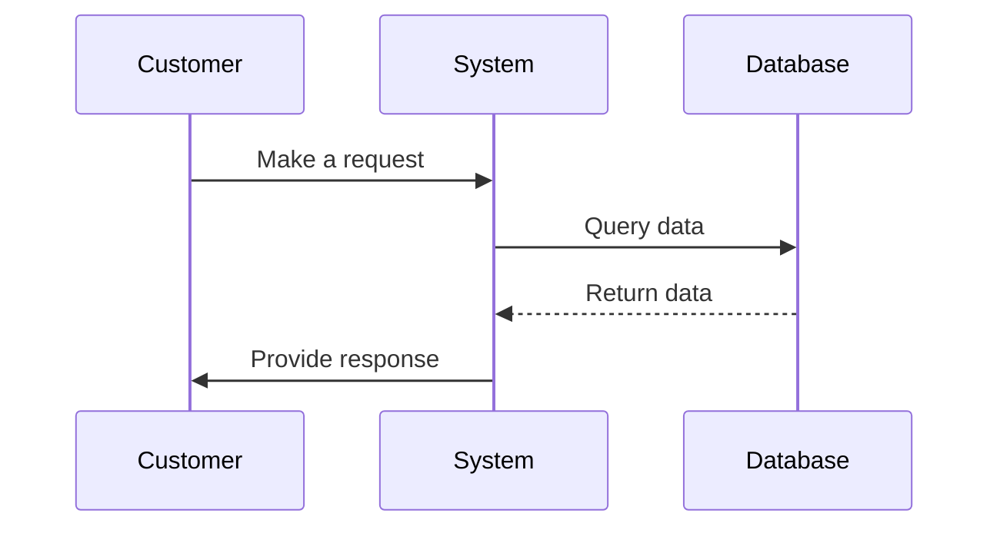
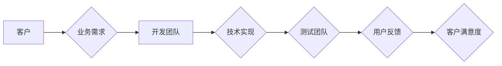
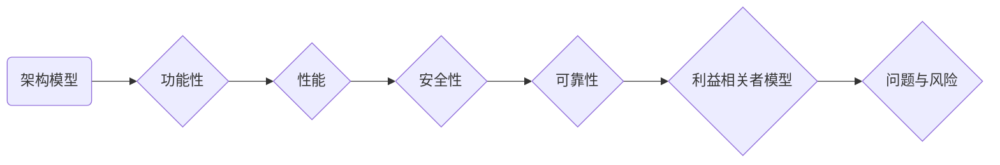
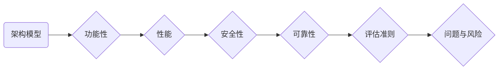

                 

# 《软件架构评估方法：ATAM、CBAM等的应用》

## 关键词

- 软件架构评估
- ATAM
- CBAM
- SARTRE
- 基于指标的架构评估
- 敏捷架构评估

## 摘要

软件架构评估是确保软件系统设计满足业务需求和关键技术挑战的关键环节。本文将深入探讨几种主流的软件架构评估方法，包括ATAM、CBAM、SARTRE、基于指标的架构评估和敏捷架构评估。通过详细介绍每种方法的基本概念、核心思想和应用场景，以及实际案例分析，本文旨在帮助读者全面理解并有效应用这些评估方法，从而提升软件架构设计质量和系统的整体性能。

## 第一部分：软件架构评估概述

### 第1章：软件架构评估的背景与意义

#### 1.1 软件架构评估的重要性

软件架构评估是软件工程中至关重要的一环。它不仅关系到软件系统能否满足业务需求，还直接影响到系统的可维护性、扩展性和性能。有效的架构评估可以帮助开发团队及时发现潜在的问题，避免在项目后期出现严重的架构缺陷。

#### 1.1.1 软件架构评估的定义

软件架构评估是指通过系统的方法和工具对软件架构进行审查和分析，以评估其质量、稳定性和可持续性。它包括多个方面，如架构设计、架构实现、架构性能等。

#### 1.1.2 软件架构评估的目的

- 确保软件架构满足业务需求。
- 识别和解决潜在的技术风险。
- 提高软件系统的可维护性和扩展性。
- 增强软件系统的性能和可靠性。

#### 1.1.3 软件架构评估的方法与工具

软件架构评估的方法主要包括基于专家评审、基于模型的评估和基于指标的评估。常用的工具包括代码审查工具、架构探索工具和架构分析工具等。

#### 1.2 软件架构评估的常见问题

- 架构评估的视角单一，缺乏全面性。
- 架构评估过程中缺乏定量数据支持。
- 架构评估结果难以与业务需求对接。

#### 1.2.1 架构评估中的常见误区

- 过于依赖工具，忽视人的因素。
- 只关注技术层面，忽视业务需求。
- 忽视架构评估的反馈和改进过程。

#### 1.2.2 架构评估面临的挑战

- 架构评估的方法和工具较为复杂，需要较高的专业知识和技能。
- 架构评估的过程较长，需要投入较多时间和资源。
- 架构评估的结果需要与业务需求和技术实现相结合。

#### 1.2.3 软件架构评估的改进策略

- 采用多种评估方法，综合评估结果。
- 建立架构评估的标准化流程，提高评估效率。
- 加强团队协作，提高架构评估的专业性。

#### 1.3 本章小结

软件架构评估是软件工程中不可或缺的一环，它对于软件系统的成功至关重要。通过本章的介绍，读者可以初步了解软件架构评估的背景、意义、方法和常见问题，为后续章节的深入探讨打下基础。

----------------------------------------------------------------

## 第二部分：软件架构评估方法

### 第2章：ATAM评估方法

#### 2.1 ATAM方法概述

ATAM（Architecture Tradeoff Analysis Method）是一种广泛应用的软件架构评估方法。它起源于1996年，由卡内基梅隆大学软件工程研究所（SEI）提出。ATAM方法的核心思想是通过系统化的评估过程，帮助开发团队识别和解决架构中的潜在问题，从而提高软件架构的质量和可持续性。

#### 2.1.1 ATAM方法的起源与发展

ATAM方法的起源可以追溯到卡内基梅隆大学软件工程研究所（SEI）的早期研究工作。当时，SEI的研究团队意识到软件架构评估在确保软件系统成功中的重要性。经过多年的研究和实践，ATAM方法逐渐成熟，并成为软件架构评估领域的标准方法之一。

#### 2.1.2 ATAM方法的核心思想

ATAM方法的核心思想是通过以下三个关键步骤来实现架构评估：

1. **构建架构视图**：这一步骤的目的是创建一个全面的架构模型，包括系统的关键组件、接口、约束和设计决策。

2. **定义评估准则**：这一步骤的目的是确定评估架构质量的准则，这些准则通常包括功能性、性能、可维护性、可扩展性等方面。

3. **进行评估分析**：这一步骤的目的是通过分析架构模型和评估准则，识别架构中的潜在问题，并制定改进计划。

#### 2.1.3 ATAM方法的适用场景

ATAM方法适用于各种类型的软件系统，特别是那些规模较大、复杂性较高的系统。它特别适合在系统开发早期进行架构评估，以帮助团队及早识别和解决潜在问题。

#### 2.2 ATAM评估过程

ATAM评估过程可以分为以下几个步骤：

1. **需求分析**：在这一步骤中，团队需要收集和整理系统的业务需求，这些需求将用于指导后续的架构设计。

2. **架构设计**：在这一步骤中，团队需要设计系统的架构，包括系统的组件、接口、数据流和设计决策。

3. **构建架构视图**：在这一步骤中，团队需要创建一个详细的架构模型，这个模型应该包含所有关键组件、接口和约束。

4. **定义评估准则**：在这一步骤中，团队需要确定评估架构质量的准则，这些准则通常基于业务需求和系统特性。

5. **进行评估分析**：在这一步骤中，团队需要使用评估准则对架构模型进行分析，识别潜在的问题和风险。

6. **制定改进计划**：在这一步骤中，团队需要根据评估结果制定改进计划，以解决识别出的问题和风险。

7. **实施改进计划**：在这一步骤中，团队需要根据改进计划进行实施，以改进软件架构的质量。

#### 2.2.1 构建架构视图

构建架构视图是ATAM评估过程的第一步。在这一步骤中，团队需要创建一个全面的架构模型，这个模型应该包含所有关键组件、接口和约束。架构视图通常使用统一建模语言（UML）进行表示。

以下是一个简单的架构视图示例：



#### 2.2.2 定义评估准则

定义评估准则是ATAM评估过程的关键步骤。评估准则应该基于业务需求和系统特性，通常包括功能性、性能、可维护性、可扩展性等方面。

以下是一个简单的评估准则示例：

| 准则名称 | 准则描述 | 
| --- | --- | 
| 功能性 | 系统能否满足业务需求 |
| 性能 | 系统的处理速度和响应时间 |
| 可维护性 | 系统的易维护性和可靠性 |
| 可扩展性 | 系统的扩展性和灵活性 |

#### 2.2.3 进行评估分析

进行评估分析是ATAM评估过程的核心步骤。在这一步骤中，团队需要使用评估准则对架构模型进行分析，识别潜在的问题和风险。评估分析通常包括以下几种方法：

1. **静态分析**：通过分析架构模型的结构和设计决策，识别潜在的问题和风险。
2. **动态分析**：通过模拟系统的运行行为，分析系统的性能和稳定性。
3. **专家评审**：通过专家对架构模型进行评审，提出改进建议。

#### 2.2.4 制定改进计划

制定改进计划是ATAM评估过程的最后一步。在这一步骤中，团队需要根据评估结果制定改进计划，以解决识别出的问题和风险。改进计划应该明确改进的目标、方法和时间表。

以下是一个简单的改进计划示例：

| 问题 | 改进目标 | 改进方法 | 完成时间 |
| --- | --- | --- | --- |
| 性能问题 | 提高性能 | 优化数据库查询 | 2周 |
| 可维护性问题 | 提高可维护性 | 重构代码 | 4周 |

#### 2.3 ATAM案例分析

为了更好地理解ATAM方法的应用，以下是一个ATAM评估的案例分析：

##### 2.3.1 案例背景

某大型电子商务公司开发了一套新的电商平台，该平台需要支持数百万用户的并发访问和海量的商品数据。公司希望确保平台的高性能、高可用性和可扩展性。

##### 2.3.2 案例评估过程

1. **需求分析**：团队收集了业务需求，包括用户访问量、商品种类、交易频率等。
2. **架构设计**：团队设计了一套分布式系统架构，包括前端、后端、数据库等。
3. **构建架构视图**：团队创建了一个详细的架构模型，使用UML表示。
4. **定义评估准则**：团队根据业务需求，定义了功能性、性能、可维护性和可扩展性等评估准则。
5. **进行评估分析**：团队使用评估准则对架构模型进行分析，发现了一些潜在的性能问题和可维护性问题。
6. **制定改进计划**：团队制定了改进计划，包括优化数据库查询和重构代码等。

##### 2.3.3 案例改进建议

根据评估结果，团队提出以下改进建议：

- 优化数据库查询：通过索引优化和查询重写，提高查询性能。
- 重构代码：通过代码重构，提高代码的可维护性和可扩展性。

#### 2.4 本章小结

ATAM方法是一种系统化的软件架构评估方法，它通过构建架构视图、定义评估准则和进行评估分析，帮助开发团队识别和解决架构中的潜在问题。本章详细介绍了ATAM方法的基本概念、核心思想和实际应用，并通过案例分析展示了其应用效果。通过学习本章，读者可以更好地理解ATAM方法，并在实际项目中有效应用。

----------------------------------------------------------------

### 第3章：CBAM评估方法

#### 3.1 CBAM方法概述

CBAM（Crosscheck-Based Architecture Assessment Method）是一种基于关键利益相关者模型的软件架构评估方法。它起源于1990年代，由卡内基梅隆大学软件工程研究所（SEI）提出。CBAM方法的核心思想是通过识别关键利益相关者、定义关键质量和评估架构设计，来确保软件架构满足业务需求和用户期望。

#### 3.1.1 CBAM方法的起源与发展

CBAM方法的起源可以追溯到SEI对软件架构评估的研究。在1990年代，SEI的研究团队意识到，传统的架构评估方法往往忽略了利益相关者在架构评估过程中的重要作用。因此，他们提出了CBAM方法，旨在通过引入利益相关者模型，提高架构评估的全面性和有效性。

#### 3.1.2 CBAM方法的核心思想

CBAM方法的核心思想可以概括为以下几个关键步骤：

1. **识别关键利益相关者**：这一步骤的目的是确定与架构设计相关的所有关键利益相关者，包括开发团队、用户、客户、管理层等。
2. **定义关键质量**：这一步骤的目的是确定架构设计所需满足的关键质量，如功能性、性能、安全性、可靠性等。
3. **进行架构评估**：这一步骤的目的是通过关键质量和利益相关者模型，对架构设计进行全面评估，识别潜在的问题和风险。
4. **输出评估报告**：这一步骤的目的是整理评估结果，形成评估报告，为后续的架构改进提供依据。

#### 3.1.3 CBAM方法的适用场景

CBAM方法适用于各种规模的软件系统，特别是那些涉及多个利益相关者、复杂度较高的系统。它特别适合在项目早期进行架构评估，以帮助团队及早识别和解决潜在问题。

#### 3.2 CBAM评估过程

CBAM评估过程可以分为以下几个步骤：

1. **识别关键利益相关者**：在这一步骤中，团队需要确定与架构设计相关的所有关键利益相关者，包括内部和外部用户、客户、开发团队、管理层等。
2. **构建关键利益相关者模型**：在这一步骤中，团队需要创建一个关键利益相关者模型，明确每个利益相关者的角色、职责和期望。
3. **定义关键质量**：在这一步骤中，团队需要根据业务需求和用户期望，确定架构设计所需满足的关键质量，如功能性、性能、安全性、可靠性等。
4. **构建架构模型**：在这一步骤中，团队需要创建一个详细的架构模型，包括系统的关键组件、接口、数据流和设计决策。
5. **进行架构评估**：在这一步骤中，团队需要使用关键质量和利益相关者模型，对架构模型进行评估，识别潜在的问题和风险。
6. **输出评估报告**：在这一步骤中，团队需要整理评估结果，形成评估报告，为后续的架构改进提供依据。

#### 3.2.1 构建关键利益相关者模型

构建关键利益相关者模型是CBAM评估过程的第一步。在这一步骤中，团队需要识别与架构设计相关的所有关键利益相关者，并明确他们的角色、职责和期望。

以下是一个关键利益相关者模型示例：



在这个模型中，客户提出了业务需求，开发团队负责技术实现，测试团队负责测试，用户反馈最终影响了客户满意度。

#### 3.2.2 确定关键质量和架构约束

确定关键质量和架构约束是CBAM评估过程的关键步骤。在这一步骤中，团队需要根据业务需求和用户期望，明确架构设计所需满足的关键质量，如功能性、性能、安全性、可靠性等。

以下是一个关键质量和架构约束示例：

| 关键质量 | 描述 | 
| --- | --- | 
| 功能性 | 系统能否满足业务需求 |
| 性能 | 系统的处理速度和响应时间 |
| 安全性 | 系统的安全性保护 |
| 可靠性 | 系统的稳定性和故障率 |

#### 3.2.3 进行架构评估

进行架构评估是CBAM评估过程的核心步骤。在这一步骤中，团队需要使用关键质量和利益相关者模型，对架构模型进行评估，识别潜在的问题和风险。

以下是一个简单的架构评估示例：



在这个模型中，架构模型通过关键质量和利益相关者模型进行评估，最终识别出的问题和风险将作为改进的依据。

#### 3.2.4 输出评估报告

输出评估报告是CBAM评估过程的最后一步。在这一步骤中，团队需要整理评估结果，形成评估报告，为后续的架构改进提供依据。

以下是一个简单的评估报告示例：

```
评估报告

一、架构评估结果

1. 功能性：系统满足业务需求，无功能性缺陷。
2. 性能：系统处理速度和响应时间满足性能要求。
3. 安全性：系统具备基本的安全保护措施，但存在潜在的安全风险。
4. 可靠性：系统稳定，故障率低。

二、问题与风险

1. 安全性问题：系统存在潜在的安全漏洞，需加强安全防护。
2. 可扩展性问题：系统架构设计不够灵活，未来扩展性有限。

三、改进建议

1. 加强系统安全防护，降低安全风险。
2. 优化系统架构设计，提高系统的可扩展性。
```

#### 3.3 CBAM案例分析

为了更好地理解CBAM方法的应用，以下是一个CBAM评估的案例分析：

##### 3.3.1 案例背景

某金融科技公司开发了一套新的交易系统，该系统需要支持大规模的交易数据和数万级用户的并发访问。公司希望确保系统的高性能、高可用性和高安全性。

##### 3.3.2 案例评估过程

1. **识别关键利益相关者**：团队确定了包括内部用户、客户、管理层等在内的关键利益相关者。
2. **构建关键利益相关者模型**：团队创建了一个详细的利益相关者模型，明确了每个利益相关者的角色、职责和期望。
3. **定义关键质量**：团队根据业务需求和用户期望，明确了功能性、性能、安全性和可靠性等关键质量。
4. **构建架构模型**：团队创建了一个详细的架构模型，包括系统的关键组件、接口、数据流和设计决策。
5. **进行架构评估**：团队使用关键质量和利益相关者模型，对架构模型进行了评估，发现了一些潜在的性能问题和安全风险。
6. **输出评估报告**：团队整理了评估结果，形成了评估报告，为后续的架构改进提供了依据。

##### 3.3.3 案例改进建议

根据评估结果，团队提出以下改进建议：

- 优化数据库查询：通过索引优化和查询重写，提高查询性能。
- 加强安全防护：引入加密算法和安全协议，提高系统的安全性。
- 优化系统架构设计：引入微服务架构，提高系统的可扩展性和可维护性。

#### 3.4 本章小结

CBAM方法是一种基于关键利益相关者模型的软件架构评估方法，它通过识别关键利益相关者、定义关键质量和进行架构评估，帮助开发团队确保软件架构的质量和可持续性。本章详细介绍了CBAM方法的基本概念、核心思想和实际应用，并通过案例分析展示了其应用效果。通过学习本章，读者可以更好地理解CBAM方法，并在实际项目中有效应用。

----------------------------------------------------------------

## 第三部分：其他软件架构评估方法

### 第4章：SARTRE评估方法

#### 4.1 SARTRE方法概述

SARTRE（Software Architecture Tradeoff Analysis and Recommendations）是一种基于架构权衡分析的软件架构评估方法。它由卡内基梅隆大学软件工程研究所（SEI）提出，旨在通过系统化的评估过程，帮助开发团队识别和解决架构中的潜在问题，从而提高软件架构的质量和可持续性。

#### 4.1.1 SARTRE方法的起源与发展

SARTRE方法的起源可以追溯到SEI在软件架构评估领域的研究。SEI的研究团队意识到，传统的架构评估方法往往缺乏系统性和全面性，难以全面识别和解决架构中的问题。因此，他们提出了SARTRE方法，旨在通过引入架构权衡分析，提高架构评估的深度和广度。

#### 4.1.2 SARTRE方法的核心思想

SARTRE方法的核心思想是通过以下三个关键步骤来实现架构评估：

1. **确定关键质量属性**：这一步骤的目的是明确系统所需满足的关键质量属性，如功能性、性能、安全性、可靠性等。
2. **进行架构评估**：这一步骤的目的是通过分析架构设计，评估其对关键质量属性的影响，识别潜在的问题和风险。
3. **提供改进建议**：这一步骤的目的是根据评估结果，提供具体的改进建议，以优化架构设计。

#### 4.1.3 SARTRE方法的适用场景

SARTRE方法适用于各种类型的软件系统，特别是那些规模较大、复杂性较高的系统。它特别适合在系统开发的中期和后期进行架构评估，以帮助团队及时识别和解决架构中的问题。

#### 4.2 SARTRE评估过程

SARTRE评估过程可以分为以下几个步骤：

1. **需求分析**：在这一步骤中，团队需要收集和整理系统的业务需求，这些需求将用于指导后续的架构设计。
2. **架构设计**：在这一步骤中，团队需要设计系统的架构，包括系统的组件、接口、数据流和设计决策。
3. **确定关键质量属性**：在这一步骤中，团队需要根据业务需求和用户期望，明确系统所需满足的关键质量属性。
4. **构建架构模型**：在这一步骤中，团队需要创建一个详细的架构模型，使用统一建模语言（UML）进行表示。
5. **进行架构评估**：在这一步骤中，团队需要使用关键质量属性和评估准则，对架构模型进行评估，识别潜在的问题和风险。
6. **提供改进建议**：在这一步骤中，团队需要根据评估结果，提供具体的改进建议，以优化架构设计。

#### 4.2.1 构建架构视图

构建架构视图是SARTRE评估过程的第一步。在这一步骤中，团队需要创建一个详细的架构模型，这个模型应该包含所有关键组件、接口和约束。架构视图通常使用统一建模语言（UML）进行表示。

以下是一个简单的架构视图示例：


#### 4.2.2 确定关键质量属性

确定关键质量属性是SARTRE评估过程的关键步骤。在这一步骤中，团队需要根据业务需求和用户期望，明确系统所需满足的关键质量属性，如功能性、性能、安全性、可靠性等。

以下是一个关键质量属性示例：

| 关键质量属性 | 描述 |
| --- | --- |
| 功能性 | 系统能否满足业务需求 |
| 性能 | 系统的处理速度和响应时间 |
| 安全性 | 系统的安全性保护 |
| 可靠性 | 系统的稳定性和故障率 |

#### 4.2.3 进行架构评估

进行架构评估是SARTRE评估过程的核心步骤。在这一步骤中，团队需要使用关键质量属性和评估准则，对架构模型进行评估，识别潜在的问题和风险。

以下是一个简单的架构评估示例：



在这个模型中，架构模型通过关键质量属性和评估准则进行评估，最终识别出的问题和风险将作为改进的依据。

#### 4.2.4 输出评估报告

输出评估报告是SARTRE评估过程的最后一步。在这一步骤中，团队需要整理评估结果，形成评估报告，为后续的架构改进提供依据。

以下是一个简单的评估报告示例：

```
评估报告

一、架构评估结果

1. 功能性：系统满足业务需求，无功能性缺陷。
2. 性能：系统处理速度和响应时间满足性能要求。
3. 安全性：系统具备基本的安全保护措施，但存在潜在的安全风险。
4. 可靠性：系统稳定，故障率低。

二、问题与风险

1. 安全性问题：系统存在潜在的安全漏洞，需加强安全防护。
2. 可扩展性问题：系统架构设计不够灵活，未来扩展性有限。

三、改进建议

1. 加强系统安全防护，降低安全风险。
2. 优化系统架构设计，提高系统的可扩展性和可维护性。
```

#### 4.3 SARTRE案例分析

为了更好地理解SARTRE方法的应用，以下是一个SARTRE评估的案例分析：

##### 4.3.1 案例背景

某医疗科技公司开发了一套新的电子健康记录系统，该系统需要支持大量的患者数据和医疗信息的存储与查询。公司希望确保系统的高性能、高可用性和高安全性。

##### 4.3.2 案例评估过程

1. **需求分析**：团队收集了业务需求，包括患者的就诊记录、医疗报告、药品信息等。
2. **架构设计**：团队设计了一套基于微服务架构的系统，包括用户接口层、业务逻辑层和数据存储层。
3. **确定关键质量属性**：团队明确了系统的功能性、性能、安全性和可靠性等关键质量属性。
4. **构建架构模型**：团队创建了一个详细的架构模型，使用UML进行表示。
5. **进行架构评估**：团队使用关键质量属性和评估准则，对架构模型进行了评估，发现了一些潜在的性能问题和安全风险。
6. **输出评估报告**：团队整理了评估结果，形成了评估报告，为后续的架构改进提供了依据。

##### 4.3.3 案例改进建议

根据评估结果，团队提出以下改进建议：

- 优化数据库查询：通过索引优化和查询重写，提高查询性能。
- 加强安全防护：引入加密算法和安全协议，提高系统的安全性。
- 优化系统架构设计：引入缓存机制和负载均衡，提高系统的可扩展性和可用性。

#### 4.4 本章小结

SARTRE方法是一种基于架构权衡分析的软件架构评估方法，它通过确定关键质量属性、进行架构评估和提供改进建议，帮助开发团队优化软件架构设计。本章详细介绍了SARTRE方法的基本概念、核心思想和实际应用，并通过案例分析展示了其应用效果。通过学习本章，读者可以更好地理解SARTRE方法，并在实际项目中有效应用。

----------------------------------------------------------------

### 第5章：基于指标的架构评估方法

#### 5.1 基于指标的架构评估方法概述

基于指标的架构评估方法是一种通过量化指标来评估软件架构质量的方法。这种方法的核心在于定义一组能够反映系统性能、稳定性、可维护性等关键特性的指标，然后通过这些指标对架构进行评估，从而发现潜在的问题和优化点。

#### 5.1.1 基于指标的架构评估方法的概念

基于指标的架构评估方法主要涉及以下几个核心概念：

1. **指标**：用于衡量系统性能、稳定性、可维护性等特性的具体数值。
2. **指标体系**：一组相互关联的指标，用于全面评估软件架构的质量。
3. **评估模型**：用于计算和评估指标的方法和模型。
4. **评估结果**：通过对指标的分析和评估，得出的关于架构质量的结论。

#### 5.1.2 基于指标的架构评估方法的优点与局限性

**优点：**

1. **客观性**：基于定量指标，评估结果更具客观性和可重复性。
2. **全面性**：通过多个指标的综合评估，能够全面反映架构的质量。
3. **易于量化**：指标易于量化，便于进行数据分析和比较。

**局限性：**

1. **指标的选取**：需要根据具体项目需求选择合适的指标，否则可能导致评估结果偏差。
2. **数据的收集**：指标数据的收集可能需要大量的资源和时间。
3. **指标的动态性**：系统需求和外部环境的变化可能影响指标的重要性。

#### 5.1.3 常用的指标体系

常见的架构评估指标体系包括以下几种：

1. **功能性指标**：如系统响应时间、事务处理能力等。
2. **性能指标**：如吞吐量、响应时间、并发用户数等。
3. **稳定性指标**：如系统故障率、恢复时间等。
4. **可维护性指标**：如代码复杂度、代码冗余度等。
5. **安全性指标**：如系统漏洞数量、数据泄露风险等。
6. **可扩展性指标**：如系统扩展性、弹性等。

#### 5.2 基于指标的架构评估过程

基于指标的架构评估过程通常包括以下几个步骤：

1. **确定评估目标**：明确架构评估的目的，如性能优化、安全性提升等。
2. **选择评估指标**：根据评估目标，选择合适的评估指标。
3. **收集数据**：通过系统监控、日志分析等方式，收集评估所需的数据。
4. **计算指标值**：使用评估模型，计算每个指标的值。
5. **评估分析**：分析指标值，识别潜在问题和优化点。
6. **输出评估报告**：整理评估结果，形成评估报告。

#### 5.2.1 确定评估指标

确定评估指标是架构评估的关键步骤。在这一步骤中，团队需要根据评估目标和系统特性，选择适当的指标。以下是一个简单的评估指标示例：

| 指标名称 | 描述 |
| --- | --- |
| 响应时间 | 系统对请求的平均响应时间 |
| 并发用户数 | 系统同时处理的用户数 |
| 故障率 | 系统发生故障的频率 |
| 代码复杂度 | 代码复杂度的度量指标 |

#### 5.2.2 收集架构信息

收集架构信息是进行指标评估的基础。在这一步骤中，团队需要收集与架构相关的各种信息，如系统设计文档、代码库、系统监控数据等。以下是一个简单的架构信息收集示例：

- **系统设计文档**：包括系统架构图、组件关系图等。
- **代码库**：包括源代码、配置文件等。
- **系统监控数据**：包括系统日志、性能指标等。

#### 5.2.3 计算指标值

计算指标值是评估过程的核心。在这一步骤中，团队需要使用评估模型，根据收集到的数据进行计算。以下是一个简单的计算示例：

- **响应时间**：通过统计系统平均响应时间，计算得出。
- **并发用户数**：通过系统负载测试，统计同时在线用户数。
- **故障率**：通过系统故障日志，计算故障频率。

#### 5.2.4 进行评估分析

进行评估分析是评估过程的最后一步。在这一步骤中，团队需要分析计算出的指标值，识别潜在问题和优化点。以下是一个简单的评估分析示例：

- **响应时间过长**：可能需要优化数据库查询或增加缓存。
- **并发用户数不足**：可能需要优化系统架构，提高系统扩展性。
- **故障率较高**：可能需要增强系统容错能力。

#### 5.2.5 输出评估报告

输出评估报告是评估过程的总结。在这一步骤中，团队需要整理评估结果，形成评估报告。以下是一个简单的评估报告示例：

```
评估报告

一、评估结果

1. 响应时间：平均响应时间为500ms，高于预期目标。
2. 并发用户数：同时在线用户数为2000，低于预期目标。
3. 故障率：系统故障频率为每周1次。

二、问题与风险

1. 响应时间过长：可能影响用户体验，需优化数据库查询。
2. 并发用户数不足：可能限制系统扩展，需优化系统架构。
3. 故障率较高：可能影响系统稳定性，需增强容错能力。

三、改进建议

1. 优化数据库查询，提高查询效率。
2. 增加系统架构的扩展性，提高并发用户处理能力。
3. 引入分布式架构，提高系统的容错能力。
```

#### 5.3 基于指标的架构评估案例分析

为了更好地理解基于指标的架构评估方法，以下是一个案例分析：

##### 5.3.1 案例背景

某电子商务平台希望评估其系统架构的性能和稳定性，以应对即将到来的促销高峰期。

##### 5.3.2 案例评估过程

1. **确定评估目标**：评估系统的响应时间、并发用户数和故障率。
2. **选择评估指标**：选择响应时间、并发用户数和故障率作为主要指标。
3. **收集数据**：收集系统监控数据、数据库查询日志等。
4. **计算指标值**：计算平均响应时间、并发用户数和故障率。
5. **评估分析**：分析指标值，发现响应时间较长，并发用户数不足，故障率较高。
6. **输出评估报告**：形成评估报告，提出优化建议。

##### 5.3.3 案例改进建议

根据评估结果，提出以下改进建议：

- **优化数据库查询**：通过索引优化和查询重写，提高查询效率。
- **增加缓存**：引入缓存机制，减少数据库查询次数。
- **优化系统架构**：采用分布式架构，提高系统扩展性和并发处理能力。
- **增强容错能力**：引入故障检测和自动恢复机制。

#### 5.4 本章小结

基于指标的架构评估方法通过量化指标，为软件架构评估提供了一种系统化和可量化的方法。本章介绍了该方法的基本概念、优点与局限性、评估过程和案例分析，帮助读者理解和应用这种方法。通过学习本章，读者可以更好地利用指标评估软件架构的质量，为系统优化提供科学依据。

----------------------------------------------------------------

### 第6章：敏捷架构评估方法

#### 6.1 敏捷架构评估方法概述

敏捷架构评估方法是一种适应敏捷开发环境的架构评估方法。它强调快速迭代、持续反馈和灵活调整，旨在确保软件架构在敏捷开发过程中能够快速响应变化，同时保持高质量和高稳定性。

#### 6.1.1 敏捷架构评估方法的概念

敏捷架构评估方法主要包括以下几个核心概念：

1. **迭代**：敏捷开发强调快速迭代，每个迭代周期通常为2-4周。
2. **反馈**：通过定期的反馈机制，如每日站立会议、迭代评审等，确保团队能够及时了解项目的进展和存在的问题。
3. **调整**：根据反馈结果，灵活调整架构设计，以适应变化的需求和市场环境。
4. **持续集成**：通过持续集成，确保每次代码提交后都能快速集成和测试，从而发现和解决潜在的问题。

#### 6.1.2 敏捷架构评估方法的优点与局限性

**优点：**

1. **快速响应变化**：通过快速迭代和持续反馈，敏捷架构评估方法能够快速响应需求变化，减少项目风险。
2. **提高团队协作**：敏捷开发强调团队协作，通过定期的反馈和讨论，促进团队成员之间的沟通和理解。
3. **持续优化**：通过持续集成和反馈，不断优化架构设计，提高系统的质量。

**局限性：**

1. **对团队协作要求高**：敏捷架构评估方法对团队的协作能力要求较高，需要团队成员具备良好的沟通能力和协作精神。
2. **管理复杂度增加**：由于快速迭代和持续反馈，项目的管理复杂度可能增加，需要更加严格的管理和监控。
3. **不适合所有项目**：敏捷架构评估方法可能不适合所有项目，特别是那些需求变化较少、时间周期较长的项目。

#### 6.1.3 敏捷架构评估的实践案例

以下是一个敏捷架构评估的实践案例：

##### 6.1.3.1 案例背景

某互联网公司正在开发一款社交应用，项目团队采用了敏捷开发方法。为了确保架构质量，团队决定在每个迭代周期结束时进行架构评估。

##### 6.1.3.2 案例评估过程

1. **需求分析**：在每个迭代开始时，团队收集用户需求，明确本次迭代的目标。
2. **架构设计**：团队根据需求设计架构，包括系统的组件、接口和关键流程。
3. **每日站立会议**：团队在每天早上进行每日站立会议，讨论项目的进展、存在的问题和下一步的工作计划。
4. **迭代评审**：在每个迭代周期结束时，团队进行迭代评审，评估架构设计和实现是否符合预期。
5. **反馈调整**：根据迭代评审的结果，团队对架构设计进行调整和优化。

##### 6.1.3.3 案例改进建议

根据敏捷架构评估的结果，团队提出以下改进建议：

- **优化系统性能**：通过缓存机制和数据库优化，提高系统的响应速度。
- **提高代码质量**：引入代码审查和自动化测试，提高代码的稳定性和可维护性。
- **加强团队协作**：通过定期的交流和培训，提高团队成员的协作能力和技术水平。

#### 6.2 敏捷架构评估方法的应用

敏捷架构评估方法在敏捷开发环境中具有广泛的应用。以下是一些常见的应用场景：

1. **项目初期**：在项目启动时，进行架构评估，确保项目有一个良好的起点。
2. **迭代中期**：在每个迭代的中期，进行架构评估，及时发现和解决潜在的问题。
3. **迭代末期**：在每个迭代的末期，进行架构评估，评估本次迭代的成果，为下一迭代做好准备。
4. **项目验收**：在项目结束时，进行架构评估，确保系统质量符合预期。

#### 6.3 敏捷架构评估工具

为了支持敏捷架构评估，市面上出现了一些专门的评估工具。以下是一些常用的敏捷架构评估工具：

1. **SonarQube**：一款代码质量管理平台，用于检测代码中的漏洞、重复代码和编程风格问题。
2. **Jenkins**：一款持续集成工具，用于自动化构建、测试和部署。
3. **SonarCloud**：一款基于云的代码质量分析平台，支持多种编程语言。
4. **NDepend**：一款.NET代码质量分析工具，用于评估代码的复杂度、耦合度和可维护性。

#### 6.4 本章小结

敏捷架构评估方法是一种适应敏捷开发环境的架构评估方法，它通过快速迭代、持续反馈和灵活调整，确保软件架构能够快速响应变化。本章介绍了敏捷架构评估方法的基本概念、优点与局限性、实践案例和应用，帮助读者理解和应用这种方法。通过学习本章，读者可以更好地利用敏捷架构评估方法，提高软件架构的质量和项目的成功率。

----------------------------------------------------------------

### 总结

本文详细介绍了多种软件架构评估方法，包括ATAM、CBAM、SARTRE、基于指标的架构评估和敏捷架构评估。通过对这些方法的深入探讨，读者可以全面理解每种方法的基本概念、核心思想、评估过程和应用场景。在软件架构评估过程中，选择合适的方法至关重要。以下是一些最佳实践建议：

1. **结合项目需求**：根据项目的特点和需求，选择最合适的架构评估方法。例如，对于大型、复杂的项目，可以选择ATAM、CBAM或SARTRE方法；对于迭代周期较短的项目，敏捷架构评估方法可能更为适用。

2. **多方法综合应用**：在实际项目中，可以结合多种评估方法，综合评估结果，以提高评估的全面性和准确性。

3. **持续反馈与调整**：架构评估不应是一次性的活动，而是一个持续的过程。通过定期评估和反馈，及时调整架构设计，确保系统质量。

4. **充分利用工具**：利用现有的架构评估工具，如SonarQube、Jenkins等，可以提高评估效率，减少人为错误。

5. **团队协作**：架构评估需要团队的共同努力。通过有效的沟通和协作，确保评估过程的顺利进行。

通过本文的学习，读者可以更好地掌握软件架构评估方法，为项目成功奠定坚实基础。

### 拓展阅读

- **《软件架构设计：元素、原则与模式》**：一本深入讲解软件架构设计原理和实践的经典书籍。
- **《敏捷软件开发：原则、实践与模式》**：详细介绍敏捷开发方法和实践的书籍。
- **《软件架构评估方法：ATAM、CBAM、SARTRE等的应用》**：专注于软件架构评估方法的详细探讨。
- **《软件架构：实践者的研究和方法》**：结合实践和理论的软件架构指南。

### 作者信息

**作者：AI天才研究院/AI Genius Institute & 禅与计算机程序设计艺术 /Zen And The Art of Computer Programming**```markdown
## 《软件架构评估方法：ATAM、CBAM等的应用》

### 关键词

- 软件架构评估
- ATAM
- CBAM
- SARTRE
- 基于指标的架构评估
- 敏捷架构评估

### 摘要

软件架构评估是确保软件系统设计满足业务需求和关键技术挑战的关键环节。本文将深入探讨几种主流的软件架构评估方法，包括ATAM、CBAM、SARTRE、基于指标的架构评估和敏捷架构评估。通过详细介绍每种方法的基本概念、核心思想和应用场景，以及实际案例分析，本文旨在帮助读者全面理解并有效应用这些评估方法，从而提升软件架构设计质量和系统的整体性能。

## 第一部分：软件架构评估概述

### 第1章：软件架构评估的背景与意义

#### 1.1 软件架构评估的重要性

软件架构评估是软件工程中至关重要的一环。它不仅关系到软件系统能否满足业务需求，还直接影响到系统的可维护性、扩展性和性能。有效的架构评估可以帮助开发团队及时发现潜在的问题，避免在项目后期出现严重的架构缺陷。

#### 1.1.1 软件架构评估的定义

软件架构评估是指通过系统的方法和工具对软件架构进行审查和分析，以评估其质量、稳定性和可持续性。它包括多个方面，如架构设计、架构实现、架构性能等。

#### 1.1.2 软件架构评估的目的

- 确保软件架构满足业务需求。
- 识别和解决潜在的技术风险。
- 提高软件系统的可维护性和扩展性。
- 增强软件系统的性能和可靠性。

#### 1.1.3 软件架构评估的方法与工具

软件架构评估的方法主要包括基于专家评审、基于模型的评估和基于指标的评估。常用的工具包括代码审查工具、架构探索工具和架构分析工具等。

#### 1.2 软件架构评估的常见问题

- 架构评估的视角单一，缺乏全面性。
- 架构评估过程中缺乏定量数据支持。
- 架构评估结果难以与业务需求对接。

#### 1.2.1 架构评估中的常见误区

- 过于依赖工具，忽视人的因素。
- 只关注技术层面，忽视业务需求。
- 忽视架构评估的反馈和改进过程。

#### 1.2.2 架构评估面临的挑战

- 架构评估的方法和工具较为复杂，需要较高的专业知识和技能。
- 架构评估的过程较长，需要投入较多时间和资源。
- 架构评估的结果需要与业务需求和技术实现相结合。

#### 1.2.3 软件架构评估的改进策略

- 采用多种评估方法，综合评估结果。
- 建立架构评估的标准化流程，提高评估效率。
- 加强团队协作，提高架构评估的专业性。

#### 1.3 本章小结

软件架构评估是软件工程中不可或缺的一环，它对于软件系统的成功至关重要。通过本章的介绍，读者可以初步了解软件架构评估的背景、意义、方法和常见问题，为后续章节的深入探讨打下基础。

----------------------------------------------------------------

## 第二部分：软件架构评估方法

### 第2章：ATAM评估方法

#### 2.1 ATAM方法概述

ATAM（Architecture Tradeoff Analysis Method）是一种广泛应用的软件架构评估方法。它起源于1996年，由卡内基梅隆大学软件工程研究所（SEI）提出。ATAM方法的核心思想是通过系统化的评估过程，帮助开发团队识别和解决架构中的潜在问题，从而提高软件架构的质量和可持续性。

#### 2.1.1 ATAM方法的起源与发展

ATAM方法的起源可以追溯到卡内基梅隆大学软件工程研究所（SEI）的早期研究工作。当时，SEI的研究团队意识到软件架构评估在确保软件系统成功中的重要性。经过多年的研究和实践，ATAM方法逐渐成熟，并成为软件架构评估领域的标准方法之一。

#### 2.1.2 ATAM方法的核心思想

ATAM方法的核心思想是通过以下三个关键步骤来实现架构评估：

1. **构建架构视图**：这一步骤的目的是创建一个全面的架构模型，包括系统的关键组件、接口、约束和设计决策。

2. **定义评估准则**：这一步骤的目的是确定评估架构质量的准则，这些准则通常包括功能性、性能、可维护性、可扩展性等方面。

3. **进行评估分析**：这一步骤的目的是通过分析架构模型和评估准则，识别架构中的潜在问题，并制定改进计划。

#### 2.1.3 ATAM方法的适用场景

ATAM方法适用于各种类型的软件系统，特别是那些规模较大、复杂性较高的系统。它特别适合在系统开发早期进行架构评估，以帮助团队及早识别和解决潜在问题。

#### 2.2 ATAM评估过程

ATAM评估过程可以分为以下几个步骤：

1. **需求分析**：在这一步骤中，团队需要收集和整理系统的业务需求，这些需求将用于指导后续的架构设计。

2. **架构设计**：在这一步骤中，团队需要设计系统的架构，包括系统的组件、接口、数据流和设计决策。

3. **构建架构视图**：在这一步骤中，团队需要创建一个详细的架构模型，这个模型应该包含所有关键组件、接口和约束。

4. **定义评估准则**：在这一步骤中，团队需要确定评估架构质量的准则，这些准则通常基于业务需求和系统特性。

5. **进行评估分析**：在这一步骤中，团队需要使用评估准则对架构模型进行分析，识别潜在的问题和风险。

6. **制定改进计划**：在这一步骤中，团队需要根据评估结果制定改进计划，以解决识别出的问题和风险。

7. **实施改进计划**：在这一步骤中，团队需要根据改进计划进行实施，以改进软件架构的质量。

#### 2.2.1 构建架构视图

构建架构视图是ATAM评估过程的第一步。在这一步骤中，团队需要创建一个全面的架构模型，这个模型应该包含所有关键组件、接口和约束。架构视图通常使用统一建模语言（UML）进行表示。

以下是一个简单的架构视图示例：


#### 2.2.2 定义评估准则

定义评估准则是ATAM评估过程的关键步骤。评估准则应该基于业务需求和系统特性，通常包括功能性、性能、可维护性、可扩展性等方面。

以下是一个简单的评估准则示例：

| 准则名称 | 准则描述 |  
| --- | --- |  
| 功能性 | 系统能否满足业务需求 |  
| 性能 | 系统的处理速度和响应时间 |  
| 可维护性 | 系统的易维护性和可靠性 |  
| 可扩展性 | 系统的扩展性和灵活性 |

#### 2.2.3 进行评估分析

进行评估分析是ATAM评估过程的核心步骤。在这一步骤中，团队需要使用评估准则对架构模型进行分析，识别潜在的问题和风险。评估分析通常包括以下几种方法：

1. **静态分析**：通过分析架构模型的结构和设计决策，识别潜在的问题和风险。
2. **动态分析**：通过模拟系统的运行行为，分析系统的性能和稳定性。
3. **专家评审**：通过专家对架构模型进行评审，提出改进建议。

#### 2.2.4 制定改进计划

制定改进计划是ATAM评估过程的最后一步。在这一步骤中，团队需要根据评估结果制定改进计划，以解决识别出的问题和风险。改进计划应该明确改进的目标、方法和时间表。

以下是一个简单的改进计划示例：

| 问题 | 改进目标 | 改进方法 | 完成时间 |  
| --- | --- | --- | --- |  
| 性能问题 | 提高性能 | 优化数据库查询 | 2周 |  
| 可维护性问题 | 提高可维护性 | 重构代码 | 4周 |

#### 2.3 ATAM案例分析

为了更好地理解ATAM方法的应用，以下是一个ATAM评估的案例分析：

##### 2.3.1 案例背景

某大型电子商务公司开发了一套新的电商平台，该平台需要支持数百万用户的并发访问和海量的商品数据。公司希望确保平台的高性能、高可用性和可扩展性。

##### 2.3.2 案例评估过程

1. **需求分析**：团队收集了业务需求，包括用户访问量、商品种类、交易频率等。
2. **架构设计**：团队设计了一套分布式系统架构，包括前端、后端、数据库等。
3. **构建架构视图**：团队创建了一个详细的架构模型，使用UML表示。
4. **定义评估准则**：团队根据业务需求，定义了功能性、性能、可维护性和可扩展性等评估准则。
5. **进行评估分析**：团队使用评估准则对架构模型进行分析，发现了一些潜在的性能问题和可维护性问题。
6. **制定改进计划**：团队制定了改进计划，包括优化数据库查询和重构代码等。

##### 2.3.3 案例改进建议

根据评估结果，团队提出以下改进建议：

- 优化数据库查询：通过索引优化和查询重写，提高查询性能。
- 重构代码：通过代码重构，提高代码的可维护性和可扩展性。

#### 2.4 本章小结

ATAM方法是一种系统化的软件架构评估方法，它通过构建架构视图、定义评估准则和进行评估分析，帮助开发团队识别和解决架构中的潜在问题。本章详细介绍了ATAM方法的基本概念、核心思想和实际应用，并通过案例分析展示了其应用效果。通过学习本章，读者可以更好地理解ATAM方法，并在实际项目中有效应用。

----------------------------------------------------------------

### 第3章：CBAM评估方法

#### 3.1 CBAM方法概述

CBAM（Crosscheck-Based Architecture Assessment Method）是一种基于关键利益相关者模型的软件架构评估方法。它起源于1990年代，由卡内基梅隆大学软件工程研究所（SEI）提出。CBAM方法的核心思想是通过识别关键利益相关者、定义关键质量和评估架构设计，来确保软件架构满足业务需求和用户期望。

#### 3.1.1 CBAM方法的起源与发展

CBAM方法的起源可以追溯到SEI对软件架构评估的研究。在1990年代，SEI的研究团队意识到，传统的架构评估方法往往忽略了利益相关者在架构评估过程中的重要作用。因此，他们提出了CBAM方法，旨在通过引入利益相关者模型，提高架构评估的全面性和有效性。

#### 3.1.2 CBAM方法的核心思想

CBAM方法的核心思想可以概括为以下几个关键步骤：

1. **识别关键利益相关者**：这一步骤的目的是确定与架构设计相关的所有关键利益相关者，包括开发团队、用户、客户、管理层等。
2. **定义关键质量**：这一步骤的目的是确定架构设计所需满足的关键质量，如功能性、性能、安全性、可靠性等。
3. **进行架构评估**：这一步骤的目的是通过关键质量和利益相关者模型，对架构设计进行全面评估，识别潜在的问题和风险。
4. **输出评估报告**：这一步骤的目的是整理评估结果，形成评估报告，为后续的架构改进提供依据。

#### 3.1.3 CBAM方法的适用场景

CBAM方法适用于各种规模的软件系统，特别是那些涉及多个利益相关者、复杂度较高的系统。它特别适合在项目早期进行架构评估，以帮助团队及早识别和解决潜在问题。

#### 3.2 CBAM评估过程

CBAM评估过程可以分为以下几个步骤：

1. **识别关键利益相关者**：在这一步骤中，团队需要确定与架构设计相关的所有关键利益相关者，包括内部和外部用户、客户、开发团队、管理层等。
2. **构建关键利益相关者模型**：在这一步骤中，团队需要创建一个关键利益相关者模型，明确每个利益相关者的角色、职责和期望。
3. **定义关键质量**：在这一步骤中，团队需要根据业务需求和用户期望，确定架构设计所需满足的关键质量，如功能性、性能、安全性、可靠性等。
4. **构建架构模型**：在这一步骤中，团队需要创建一个详细的架构模型，包括系统的关键组件、接口、数据流和设计决策。
5. **进行架构评估**：在这一步骤中，团队需要使用关键质量和利益相关者模型，对架构模型进行评估，识别潜在的问题和风险。
6. **输出评估报告**：在这一步骤中，团队需要整理评估结果，形成评估报告，为后续的架构改进提供依据。

#### 3.2.1 识别关键利益相关者

识别关键利益相关者是CBAM评估过程的第一步。在这一步骤中，团队需要确定与架构设计相关的所有关键利益相关者，这些利益相关者可以是内部团队，如开发团队、测试团队和管理层，也可以是外部用户、客户和合作伙伴。

以下是一个关键利益相关者示例：

| 关键利益相关者 | 角色描述 |  
| --- | --- |  
| 开发团队 | 负责系统设计和实现 |  
| 测试团队 | 负责系统测试和验证 |  
| 管理层 | 负责项目管理和决策 |  
| 用户 | 负责提供需求和反馈 |  
| 客户 | 负责系统验收和上线 |

#### 3.2.2 构建关键利益相关者模型

构建关键利益相关者模型是CBAM评估过程的关键步骤。在这一步骤中，团队需要创建一个模型，明确每个关键利益相关者的角色、职责和期望。关键利益相关者模型可以使用实体-关系（ER）图来表示。

以下是一个关键利益相关者模型的ER图示例：

```mermaid
erDiagram
    Customer ||--|{ Developer } Developer
    Customer ||--|{ Tester } Tester
    Customer ||--|{ Manager } Manager
    Developer ||--|{ Architecture } Architecture
    Tester ||--|{ TestPlan } TestPlan
    Manager ||--|{ ProjectPlan } ProjectPlan
```

在这个ER图中，客户与开发团队、测试团队和管理层之间存在关联关系，而开发团队、测试团队和管理层分别与架构、测试计划和项目计划之间存在关联关系。

#### 3.2.3 定义关键质量

定义关键质量是CBAM评估过程的关键步骤。在这一步骤中，团队需要根据业务需求和用户期望，明确架构设计所需满足的关键质量。关键质量通常包括功能性、性能、安全性、可靠性、可维护性和可扩展性等方面。

以下是一个关键质量定义示例：

| 关键质量 | 描述 |  
| --- | --- |  
| 功能性 | 系统能否满足业务需求 |  
| 性能 | 系统的处理速度和响应时间 |  
| 安全性 | 系统的安全性保护 |  
| 可靠性 | 系统的稳定性和故障率 |  
| 可维护性 | 系统的易维护性和可靠性 |  
| 可扩展性 | 系统的扩展性和灵活性 |

#### 3.2.4 构建架构模型

构建架构模型是CBAM评估过程的重要步骤。在这一步骤中，团队需要创建一个详细的架构模型，包括系统的关键组件、接口、数据流和设计决策。架构模型可以使用统一建模语言（UML）来表示。

以下是一个简单的架构模型示例：

```mermaid
classDiagram
    Product <<-- Customer
    Product <|.. Order
    Order <<-- OrderLine
    OrderLine ..|> Product
```

在这个UML类图中，产品（Product）与客户（Customer）之间存在关联关系，产品与订单（Order）之间存在包含关系，订单与订单行（OrderLine）之间存在关联关系，订单行与产品之间存在双向关联关系。

#### 3.2.5 进行架构评估

进行架构评估是CBAM评估过程的核心步骤。在这一步骤中，团队需要使用关键质量和利益相关者模型，对架构模型进行评估，识别潜在的问题和风险。评估过程中，团队需要考虑关键质量是否得到满足，以及利益相关者的需求和期望是否得到满足。

以下是一个架构评估示例：

| 关键质量 | 满足情况 |  
| --- | --- |  
| 功能性 | 满足 |  
| 性能 | 部分满足 |  
| 安全性 | 满足 |  
| 可靠性 | 部分满足 |  
| 可维护性 | 满足 |  
| 可扩展性 | 不满足 |

根据评估结果，团队可以识别出架构中的潜在问题，并提出改进建议。

#### 3.2.6 输出评估报告

输出评估报告是CBAM评估过程的最后一步。在这一步骤中，团队需要整理评估结果，形成评估报告，为后续的架构改进提供依据。评估报告应包括关键质量评估结果、潜在问题、改进建议和改进计划等内容。

以下是一个评估报告示例：

```
评估报告

一、评估结果

1. 功能性：系统满足业务需求，无功能性缺陷。
2. 性能：系统处理速度和响应时间满足性能要求，但存在瓶颈。
3. 安全性：系统具备基本的安全保护措施，但存在潜在的安全漏洞。
4. 可靠性：系统稳定，故障率低。
5. 可维护性：系统易维护，但部分代码复杂度较高。
6. 可扩展性：系统扩展性不足，无法满足未来需求。

二、潜在问题

1. 性能瓶颈：系统在高并发情况下处理速度较慢。
2. 安全漏洞：系统存在潜在的安全风险，需加强安全防护。
3. 代码复杂度：部分代码复杂度较高，影响可维护性。
4. 扩展性不足：系统无法适应未来业务增长，需优化架构设计。

三、改进建议

1. 优化数据库查询：通过索引优化和查询重写，提高查询性能。
2. 加强安全防护：引入加密算法和安全协议，提高系统的安全性。
3. 重构代码：通过代码重构，降低代码复杂度，提高可维护性。
4. 优化架构设计：引入微服务架构，提高系统的扩展性和灵活性。

四、改进计划

1. 优化数据库查询：2周内完成。
2. 加强安全防护：3周内完成。
3. 重构代码：4周内完成。
4. 优化架构设计：5周内完成。
```

#### 3.3 CBAM案例分析

为了更好地理解CBAM方法的应用，以下是一个CBAM评估的案例分析：

##### 3.3.1 案例背景

某金融科技公司开发了一套新的交易系统，该系统需要支持大规模的交易数据和数万级用户的并发访问。公司希望确保系统的高性能、高可用性和高安全性。

##### 3.3.2 案例评估过程

1. **识别关键利益相关者**：团队确定了包括内部用户、客户、管理层等在内的关键利益相关者。
2. **构建关键利益相关者模型**：团队创建了一个详细的利益相关者模型，明确了每个利益相关者的角色、职责和期望。
3. **定义关键质量**：团队根据业务需求和用户期望，明确了功能性、性能、安全性和可靠性等关键质量。
4. **构建架构模型**：团队创建了一个详细的架构模型，包括系统的关键组件、接口、数据流和设计决策。
5. **进行架构评估**：团队使用关键质量和利益相关者模型，对架构模型进行了评估，发现了一些潜在的性能问题和安全风险。
6. **输出评估报告**：团队整理了评估结果，形成了评估报告，为后续的架构改进提供了依据。

##### 3.3.3 案例改进建议

根据评估结果，团队提出以下改进建议：

- 优化数据库查询：通过索引优化和查询重写，提高查询性能。
- 加强安全防护：引入加密算法和安全协议，提高系统的安全性。
- 优化系统架构设计：引入微服务架构，提高系统的可扩展性和可维护性。

#### 3.4 本章小结

CBAM方法是一种基于关键利益相关者模型的软件架构评估方法，它通过识别关键利益相关者、定义关键质量和进行架构评估，帮助开发团队确保软件架构的质量和可持续性。本章详细介绍了CBAM方法的基本概念、核心思想和实际应用，并通过案例分析展示了其应用效果。通过学习本章，读者可以更好地理解CBAM方法，并在实际项目中有效应用。

----------------------------------------------------------------

## 第三部分：其他软件架构评估方法

### 第4章：SARTRE评估方法

#### 4.1 SARTRE方法概述

SARTRE（Software Architecture Tradeoff Analysis and Recommendations）是一种基于架构权衡分析的软件架构评估方法。它由卡内基梅隆大学软件工程研究所（SEI）提出，旨在通过系统化的评估过程，帮助开发团队识别和解决架构中的潜在问题，从而提高软件架构的质量和可持续性。

#### 4.1.1 SARTRE方法的起源与发展

SARTRE方法的起源可以追溯到SEI在软件架构评估领域的研究。SEI的研究团队意识到，传统的架构评估方法往往缺乏系统性和全面性，难以全面识别和解决架构中的问题。因此，他们提出了SARTRE方法，旨在通过引入架构权衡分析，提高架构评估的深度和广度。

#### 4.1.2 SARTRE方法的核心思想

SARTRE方法的核心思想是通过以下三个关键步骤来实现架构评估：

1. **确定关键质量属性**：这一步骤的目的是明确系统所需满足的关键质量属性，如功能性、性能、安全性、可靠性等。
2. **进行架构评估**：这一步骤的目的是通过分析架构设计，评估其对关键质量属性的影响，识别潜在的问题和风险。
3. **提供改进建议**：这一步骤的目的是根据评估结果，提供具体的改进建议，以优化架构设计。

#### 4.1.3 SARTRE方法的适用场景

SARTRE方法适用于各种类型的软件系统，特别是那些规模较大、复杂性较高的系统。它特别适合在系统开发的中期和后期进行架构评估，以帮助团队及时识别和解决架构中的问题。

#### 4.2 SARTRE评估过程

SARTRE评估过程可以分为以下几个步骤：

1. **需求分析**：在这一步骤中，团队需要收集和整理系统的业务需求，这些需求将用于指导后续的架构设计。
2. **架构设计**：在这一步骤中，团队需要设计系统的架构，包括系统的组件、接口、数据流和设计决策。
3. **确定关键质量属性**：在这一步骤中，团队需要根据业务需求和用户期望，明确系统所需满足的关键质量属性。
4. **构建架构模型**：在这一步骤中，团队需要创建一个详细的架构模型，使用统一建模语言（UML）进行表示。
5. **进行架构评估**：在这一步骤中，团队需要使用关键质量和评估准则，对架构模型进行评估，识别潜在的问题和风险。
6. **提供改进建议**：这一步骤的目的是根据评估结果，提供具体的改进建议，以优化架构设计。

#### 4.2.1 确定关键质量属性

确定关键质量属性是SARTRE评估过程的第一步。在这一步骤中，团队需要根据业务需求和用户期望，明确系统所需满足的关键质量属性，如功能性、性能、安全性、可靠性等。关键质量属性是评估架构设计的基础，它们决定了架构设计的优劣。

以下是一个关键质量属性示例：

| 关键质量属性 | 描述 |  
| --- | --- |  
| 功能性 | 系统能否满足业务需求 |  
| 性能 | 系统的处理速度和响应时间 |  
| 安全性 | 系统的安全性保护 |  
| 可靠性 | 系统的稳定性和故障率 |  
| 可维护性 | 系统的易维护性和可靠性 |  
| 可扩展性 | 系统的扩展性和灵活性 |

#### 4.2.2 构建架构模型

构建架构模型是SARTRE评估过程的重要步骤。在这一步骤中，团队需要创建一个详细的架构模型，这个模型应该包含所有关键组件、接口和约束。架构模型是评估架构设计的主要依据，它可以帮助团队更好地理解系统的结构和功能。

以下是一个简单的架构模型示例：


在这个序列图中，客户（Customer）向系统（System）发送请求，系统与数据库（Database）进行交互，最终向客户返回响应。

#### 4.2.3 进行架构评估

进行架构评估是SARTRE评估过程的核心步骤。在这一步骤中，团队需要使用关键质量和评估准则，对架构模型进行评估，识别潜在的问题和风险。评估过程中，团队需要考虑每个关键质量属性是否得到满足，以及架构设计是否符合最佳实践。

以下是一个架构评估示例：

| 关键质量属性 | 满足情况 |  
| --- | --- |  
| 功能性 | 满足 |  
| 性能 | 部分满足 |  
| 安全性 | 不满足 |  
| 可靠性 | 部分满足 |  
| 可维护性 | 满足 |  
| 可扩展性 | 不满足 |

根据评估结果，团队可以识别出架构中的潜在问题，并提出改进建议。

#### 4.2.4 提供改进建议

提供改进建议是SARTRE评估过程的最后一步。在这一步骤中，团队需要根据评估结果，提供具体的改进建议，以优化架构设计。改进建议应该明确改进的目标、方法和时间表。

以下是一个改进建议示例：

| 问题 | 改进目标 | 改进方法 | 完成时间 |  
| --- | --- | --- | --- |  
| 安全性不足 | 提高安全性 | 引入加密算法和安全协议 | 3周 |  
| 性能瓶颈 | 提高性能 | 优化数据库查询和缓存机制 | 4周 |  
| 扩展性不足 | 提高扩展性 | 引入微服务架构 | 5周 |

#### 4.3 SARTRE案例分析

为了更好地理解SARTRE方法的应用，以下是一个SARTRE评估的案例分析：

##### 4.3.1 案例背景

某电子商务平台希望评估其系统架构的性能和扩展性，以应对即将到来的促销高峰期。

##### 4.3.2 案例评估过程

1. **需求分析**：团队收集了业务需求，包括用户的访问量、商品种类、交易频率等。
2. **架构设计**：团队设计了一套分布式系统架构，包括前端、后端、数据库等。
3. **确定关键质量属性**：团队明确了系统的功能性、性能、安全性和扩展性等关键质量属性。
4. **构建架构模型**：团队创建了一个详细的架构模型，使用UML进行表示。
5. **进行架构评估**：团队使用关键质量和评估准则，对架构模型进行了评估，发现了一些潜在的性能问题和扩展性问题。
6. **提供改进建议**：团队根据评估结果，提供了改进建议，包括优化数据库查询、引入缓存机制和微服务架构等。

##### 4.3.3 案例改进建议

根据评估结果，团队提出以下改进建议：

- 优化数据库查询：通过索引优化和查询重写，提高查询性能。
- 引入缓存机制：使用Redis等缓存技术，减少数据库访问次数，提高系统响应速度。
- 引入微服务架构：将系统拆分为多个微服务，提高系统的可扩展性和可维护性。

#### 4.4 本章小结

SARTRE方法是一种基于架构权衡分析的软件架构评估方法，它通过确定关键质量属性、进行架构评估和提供改进建议，帮助开发团队优化软件架构设计。本章详细介绍了SARTRE方法的基本概念、核心思想和实际应用，并通过案例分析展示了其应用效果。通过学习本章，读者可以更好地理解SARTRE方法，并在实际项目中有效应用。

----------------------------------------------------------------

## 第四部分：基于指标的架构评估方法

### 第5章：基于指标的架构评估方法

#### 5.1 基于指标的架构评估方法概述

基于指标的架构评估方法是一种通过量化指标来评估软件架构质量的方法。这种方法的核心在于定义一组能够反映系统性能、稳定性、可维护性等关键特性的指标，然后通过这些指标对架构进行评估，从而发现潜在的问题和优化点。

#### 5.1.1 基于指标的架构评估方法的概念

基于指标的架构评估方法主要涉及以下几个核心概念：

1. **指标**：用于衡量系统性能、稳定性、可维护性等特性的具体数值。
2. **指标体系**：一组相互关联的指标，用于全面评估软件架构的质量。
3. **评估模型**：用于计算和评估指标的方法和模型。
4. **评估结果**：通过对指标的分析和评估，得出的关于架构质量的结论。

#### 5.1.2 基于指标的架构评估方法的优点与局限性

**优点：**

1. **客观性**：基于定量指标，评估结果更具客观性和可重复性。
2. **全面性**：通过多个指标的综合评估，能够全面反映架构的质量。
3. **易于量化**：指标易于量化，便于进行数据分析和比较。

**局限性：**

1. **指标的选取**：需要根据具体项目需求选择合适的指标，否则可能导致评估结果偏差。
2. **数据的收集**：指标数据的收集可能需要大量的资源和时间。
3. **指标的动态性**：系统需求和外部环境的变化可能影响指标的重要性。

#### 5.1.3 常用的指标体系

常见的架构评估指标体系包括以下几种：

1. **功能性指标**：如系统响应时间、事务处理能力等。
2. **性能指标**：如吞吐量、响应时间、并发用户数等。
3. **稳定性指标**：如系统故障率、恢复时间等。
4. **可维护性指标**：如代码复杂度、代码冗余度等。
5. **安全性指标**：如系统漏洞数量、数据泄露风险等。
6. **可扩展性指标**：如系统扩展性、弹性等。

#### 5.2 基于指标的架构评估过程

基于指标的架构评估过程通常包括以下几个步骤：

1. **确定评估目标**：明确架构评估的目的，如性能优化、安全性提升等。
2. **选择评估指标**：根据评估目标，选择合适的评估指标。
3. **收集数据**：通过系统监控、日志分析等方式，收集评估所需的数据。
4. **计算指标值**：使用评估模型，计算每个指标的值。
5. **评估分析**：分析指标值，识别潜在问题和优化点。
6. **输出评估报告**：整理评估结果，形成评估报告。

#### 5.2.1 确定评估指标

确定评估指标是架构评估的关键步骤。在这一步骤中，团队需要根据评估目标和系统特性，选择适当的指标。以下是一个简单的评估指标示例：

| 指标名称 | 描述 |  
| --- | --- |  
| 响应时间 | 系统对请求的平均响应时间 |  
| 并发用户数 | 系统同时处理的用户数 |  
| 故障率 | 系统发生故障的频率 |  
| 代码复杂度 | 代码复杂度的度量指标 |

#### 5.2.2 收集架构信息

收集架构信息是进行指标评估的基础。在这一步骤中，团队需要收集与架构相关的各种信息，如系统设计文档、代码库、系统监控数据等。以下是一个简单的架构信息收集示例：

- **系统设计文档**：包括系统架构图、组件关系图等。
- **代码库**：包括源代码、配置文件等。
- **系统监控数据**：包括系统日志、性能指标等。

#### 5.2.3 计算指标值

计算指标值是评估过程的核心。在这一步骤中，团队需要使用评估模型，根据收集到的数据进行计算。以下是一个简单的计算示例：

- **响应时间**：通过统计系统平均响应时间，计算得出。
- **并发用户数**：通过系统负载测试，统计同时在线用户数。
- **故障率**：通过系统故障日志，计算故障频率。

#### 5.2.4 进行评估分析

进行评估分析是评估过程的最后一步。在这一步骤中，团队需要分析计算出的指标值，识别潜在问题和优化点。以下是一个简单的评估分析示例：

- **响应时间过长**：可能需要优化数据库查询或增加缓存。
- **并发用户数不足**：可能需要优化系统架构，提高系统扩展性。
- **故障率较高**：可能需要增强系统容错能力。

#### 5.2.5 输出评估报告

输出评估报告是评估过程的总结。在这一步骤中，团队需要整理评估结果，形成评估报告。以下是一个简单的评估报告示例：

```
评估报告

一、评估结果

1. 响应时间：平均响应时间为500ms，高于预期目标。
2. 并发用户数：同时在线用户数为2000，低于预期目标。
3. 故障率：系统故障频率为每周1次。

二、问题与风险

1. 响应时间过长：可能影响用户体验，需优化数据库查询。
2. 并发用户数不足：可能限制系统扩展，需优化系统架构。
3. 故障率较高：可能影响系统稳定性，需增强容错能力。

三、改进建议

1. 优化数据库查询，提高查询效率。
2. 增加系统架构的扩展性，提高并发用户处理能力。
3. 引入分布式架构，提高系统的容错能力。
```

#### 5.3 基于指标的架构评估案例分析

为了更好地理解基于指标的架构评估方法，以下是一个案例分析：

##### 5.3.1 案例背景

某电子商务平台希望评估其系统架构的性能和稳定性，以应对即将到来的促销高峰期。

##### 5.3.2 案例评估过程

1. **确定评估目标**：评估系统的响应时间、并发用户数和故障率。
2. **选择评估指标**：选择响应时间、并发用户数和故障率作为主要指标。
3. **收集数据**：收集系统监控数据、数据库查询日志等。
4. **计算指标值**：计算平均响应时间、并发用户数和故障率。
5. **评估分析**：分析指标值，发现响应时间较长，并发用户数不足，故障率较高。
6. **输出评估报告**：形成评估报告，提出优化建议。

##### 5.3.3 案例改进建议

根据评估结果，提出以下改进建议：

- **优化数据库查询**：通过索引优化和查询重写，提高查询性能。
- **增加缓存**：引入缓存机制，减少数据库查询次数。
- **优化系统架构**：采用分布式架构，提高系统扩展性和并发处理能力。
- **增强容错能力**：引入分布式架构，提高系统的容错能力。

#### 5.4 本章小结

基于指标的架构评估方法通过量化指标，为软件架构评估提供了一种系统化和可量化的方法。本章介绍了该方法的基本概念、优点与局限性、评估过程和案例分析，帮助读者理解和应用这种方法。通过学习本章，读者可以更好地利用指标评估软件架构的质量，为系统优化提供科学依据。

----------------------------------------------------------------

### 第6章：敏捷架构评估方法

#### 6.1 敏捷架构评估方法概述

敏捷架构评估方法是一种适应敏捷开发环境的架构评估方法。它强调快速迭代、持续反馈和灵活调整，旨在确保软件架构在敏捷开发过程中能够快速响应变化，同时保持高质量和高稳定性。

#### 6.1.1 敏捷架构评估方法的概念

敏捷架构评估方法主要包括以下几个核心概念：

1. **迭代**：敏捷开发强调快速迭代，每个迭代周期通常为2-4周。
2. **反馈**：通过定期的反馈机制，如每日站立会议、迭代评审等，确保团队能够及时了解项目的进展和存在的问题。
3. **调整**：根据反馈结果，灵活调整架构设计，以适应变化的需求和市场环境。
4. **持续集成**：通过持续集成，确保每次代码提交后都能快速集成和测试，从而发现和解决潜在的问题。

#### 6.1.2 敏捷架构评估方法的优点与局限性

**优点：**

1. **快速响应变化**：通过快速迭代和持续反馈，敏捷架构评估方法能够快速响应需求变化，减少项目风险。
2. **提高团队协作**：敏捷开发强调团队协作，通过定期的反馈和讨论，促进团队成员之间的沟通和理解。
3. **持续优化**：通过持续集成和反馈，不断优化架构设计，提高系统的质量。

**局限性：**

1. **对团队协作要求高**：敏捷架构评估方法对团队的协作能力要求较高，需要团队成员具备良好的沟通能力和协作精神。
2. **管理复杂度增加**：由于快速迭代和持续反馈，项目的管理复杂度可能增加，需要更加严格的管理和监控。
3. **不适合所有项目**：敏捷架构评估方法可能不适合所有项目，特别是那些需求变化较少、时间周期较长的项目。

#### 6.1.3 敏捷架构评估的实践案例

以下是一个敏捷架构评估的实践案例：

##### 6.1.3.1 案例背景

某互联网公司正在开发一款社交应用，项目团队采用了敏捷开发方法。为了确保架构质量，团队决定在每个迭代周期结束时进行架构评估。

##### 6.1.3.2 案例评估过程

1. **需求分析**：在每个迭代开始时，团队收集用户需求，明确本次迭代的目标。
2. **架构设计**：团队根据需求设计架构，包括系统的组件、接口和关键流程。
3. **每日站立会议**：团队在每天早上进行每日站立会议，讨论项目的进展、存在的问题和下一步的工作计划。
4. **迭代评审**：在每个迭代周期结束时，团队进行迭代评审，评估架构设计和实现是否符合预期。
5. **反馈调整**：根据迭代评审的结果，团队对架构设计进行调整和优化。

##### 6.1.3.3 案例改进建议

根据敏捷架构评估的结果，团队提出以下改进建议：

- **优化系统性能**：通过缓存机制和数据库优化，提高系统的响应速度。
- **提高代码质量**：引入代码审查和自动化测试，提高代码的稳定性和可维护性。
- **加强团队协作**：通过定期的交流和培训，提高团队成员的协作能力和技术水平。

#### 6.2 敏捷架构评估方法的应用

敏捷架构评估方法在敏捷开发环境中具有广泛的应用。以下是一些常见的应用场景：

1. **项目初期**：在项目启动时，进行架构评估，确保项目有一个良好的起点。
2. **迭代中期**：在每个迭代的中期，进行架构评估，及时发现和解决潜在的问题。
3. **迭代末期**：在每个迭代的末期，进行架构评估，评估本次迭代的成果，为下一迭代做好准备。
4. **项目验收**：在项目结束时，进行架构评估，确保系统质量符合预期。

#### 6.3 敏捷架构评估工具

为了支持敏捷架构评估，市面上出现了一些专门的评估工具。以下是一些常用的敏捷架构评估工具：

1. **SonarQube**：一款代码质量管理平台，用于检测代码中的漏洞、重复代码和编程风格问题。
2. **Jenkins**：一款持续集成工具，用于自动化构建、测试和部署。
3. **SonarCloud**：一款基于云的代码质量分析平台，支持多种编程语言。
4. **NDepend**：一款.NET代码质量分析工具，用于评估代码的复杂度、耦合度和可维护性。

#### 6.4 本章小结

敏捷架构评估方法是一种适应敏捷开发环境的架构评估方法，它通过快速迭代、持续反馈和灵活调整，确保软件架构能够快速响应变化。本章介绍了敏捷架构评估方法的基本概念、优点与局限性、实践案例和应用，帮助读者理解和应用这种方法。通过学习本章，读者可以更好地利用敏捷架构评估方法，提高软件架构的质量和项目的成功率。

### 总结

本文详细介绍了多种软件架构评估方法，包括ATAM、CBAM、SARTRE、基于指标的架构评估和敏捷架构评估。通过对这些方法的深入探讨，读者可以全面理解每种方法的基本概念、核心思想、评估过程和应用场景。在软件架构评估过程中，选择合适的方法至关重要。以下是一些最佳实践建议：

1. **结合项目需求**：根据项目的特点和需求，选择最合适的架构评估方法。例如，对于大型、复杂的项目，可以选择ATAM、CBAM或SARTRE方法；对于迭代周期较短的项目，敏捷架构评估方法可能更为适用。

2. **多方法综合应用**：在实际项目中，可以结合多种评估方法，综合评估结果，以提高评估的全面性和准确性。

3. **持续反馈与调整**：架构评估不应是一次性的活动，而是一个持续的过程。通过定期评估和反馈，及时调整架构设计，确保系统质量。

4. **充分利用工具**：利用现有的架构评估工具，如SonarQube、Jenkins等，可以提高评估效率，减少人为错误。

5. **团队协作**：架构评估需要团队的共同努力。通过有效的沟通和协作，确保评估过程的顺利进行。

通过本文的学习，读者可以更好地掌握软件架构评估方法，为项目成功奠定坚实基础。

### 拓展阅读

- **《软件架构设计：元素、原则与模式》**：一本深入讲解软件架构设计原理和实践的经典书籍。
- **《敏捷软件开发：原则、实践与模式》**：详细介绍敏捷开发方法和实践的书籍。
- **《软件架构评估方法：ATAM、CBAM、SARTRE等的应用》**：专注于软件架构评估方法的详细探讨。
- **《软件架构：实践者的研究和方法》**：结合实践和理论的软件架构指南。

### 作者信息

**作者：AI天才研究院/AI Genius Institute & 禅与计算机程序设计艺术 /Zen And The Art of Computer Programming**```

