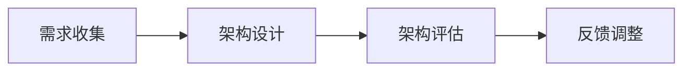
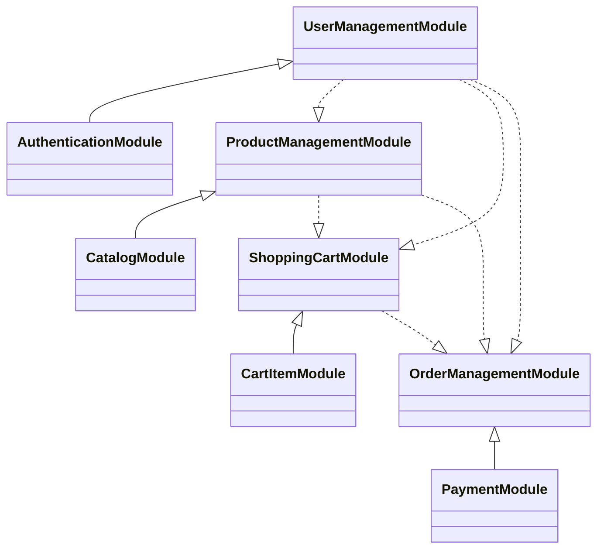
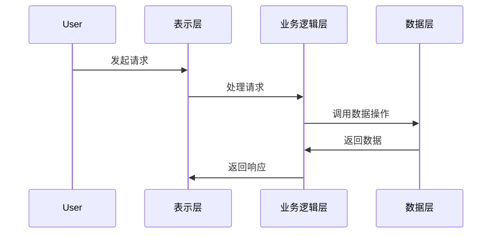
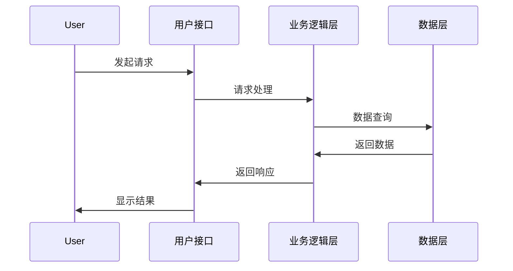

                 

### 《软件架构评估：确保设计满足业务需求》

关键词：软件架构评估、设计满足业务需求、系统分析与架构设计、项目实战

摘要：本文将探讨软件架构评估的各个方面，从背景介绍到核心概念，再到算法原理、数学模型以及系统分析与架构设计方案。通过逐步分析推理，我们旨在提供一种确保软件设计满足业务需求的方法，并分享项目实战经验和最佳实践 tips。

## 背景介绍

软件架构评估是软件工程中一个至关重要的环节。在现代信息化社会中，软件系统的复杂性日益增加，业务需求不断演变，如何确保软件设计能够满足这些需求成为一个巨大的挑战。软件架构评估的目的在于评估软件架构的合理性、稳定性和扩展性，从而确保软件系统能够在长期内稳定运行、高效扩展并满足不断变化的需求。

### 核心概念与联系

在软件架构评估中，有几个核心概念需要我们了解：

1. **软件架构**：软件架构是软件系统的基本结构和组织方式，它定义了系统组件的组成、相互关系以及系统的行为。
2. **业务需求**：业务需求是指软件系统必须满足的特定业务目标，它们来源于企业的战略规划和业务目标。
3. **架构评估**：架构评估是通过对软件架构的分析和评估，来确保其满足业务需求的过程。

以下是软件架构评估的属性特征对比表格：

| 特征               | 说明                                                         |
|--------------------|--------------------------------------------------------------|
| **合理性**         | 架构是否合理，是否能够满足业务需求。                         |
| **稳定性**         | 架构在运行过程中的稳定性，能否适应业务需求的变更。           |
| **扩展性**         | 架构是否易于扩展，能否支持未来的业务需求。                   |
| **性能**           | 架构的性能指标，如响应时间、吞吐量等。                       |
| **安全性**         | 架构的安全性，能否防范潜在的安全威胁。                       |

接下来，我们将通过ER实体关系图来进一步展示这些概念之间的联系：

```mermaid
erDiagram
    BusinessRequirement ||--|{ SoftwareArchitecture }
    SoftwareArchitecture ||--|{ ArchitectureAssessment }
    ArchitectureAssessment ||--|{ SatisfactionOfBusinessRequirement }
```

### 算法原理讲解

软件架构评估的核心算法通常基于以下步骤：

1. **需求收集**：收集业务需求，并将其转化为软件架构的设计要求。
2. **架构设计**：根据需求设计软件架构。
3. **架构评估**：评估设计的软件架构是否满足业务需求。

下面是一个简单的Mermaid流程图：



为了更详细地阐述算法原理，我们使用Python源代码来实现上述步骤：

```python
# 需求收集
def collect_requirements():
    requirements = ["需求1", "需求2", "需求3"]
    return requirements

# 架构设计
def design_architecture(requirements):
    architecture = "设计的架构"
    return architecture

# 架构评估
def assess_architecture(architecture):
    assessment = "评估结果：架构满足业务需求"
    return assessment

# 主函数
def main():
    requirements = collect_requirements()
    architecture = design_architecture(requirements)
    assessment = assess_architecture(architecture)
    print(assessment)

if __name__ == "__main__":
    main()
```

### 数学模型和数学公式详细讲解与举例说明

在软件架构评估中，我们可能会用到以下数学模型和公式：

1. **需求满足度**：表示业务需求得到满足的程度。
   $$ 满足度 = \frac{满足的需求数量}{总需求数量} $$

2. **架构稳定性**：表示软件架构在长时间运行中的稳定性。
   $$ 稳定性 = \frac{稳定运行的时间}{总运行时间} $$

3. **架构扩展性**：表示软件架构支持未来需求的程度。
   $$ 扩展性 = \frac{支持的新需求数量}{总需求数量} $$

以下是这些公式的详细讲解和举例说明：

- **需求满足度公式**：假设有5个业务需求，其中3个需求得到了满足，则需求满足度为：
  $$ 满足度 = \frac{3}{5} = 0.6 $$
  这意味着架构设计满足了60%的业务需求。

- **架构稳定性公式**：如果软件系统运行了1000小时，其中950小时是稳定运行的，则架构稳定性为：
  $$ 稳定性 = \frac{950}{1000} = 0.95 $$
  这意味着架构设计在95%的时间是稳定的。

- **架构扩展性公式**：如果软件架构能够支持新增的3个业务需求，而总共有10个业务需求，则架构扩展性为：
  $$ 扩展性 = \frac{3}{10} = 0.3 $$
  这意味着架构设计在30%的程度上支持了新增的业务需求。

### 系统分析与架构设计方案

在进行软件架构评估时，我们需要对问题场景、系统功能设计、系统架构设计、系统接口设计以及系统交互进行详细分析。

#### 问题场景介绍

假设我们正在开发一个电子商务系统，该系统需要支持用户注册、商品浏览、购物车管理和订单支付等功能。我们的目标是设计一个能够满足这些业务需求、稳定且易于扩展的软件架构。

#### 系统功能设计

为了实现上述功能，我们可以设计以下核心模块：

1. **用户管理模块**：处理用户注册、登录和权限验证等功能。
2. **商品管理模块**：管理商品信息、分类和库存等。
3. **购物车模块**：管理用户购物车中的商品，支持添加、删除和修改等功能。
4. **订单管理模块**：处理订单的创建、支付和发货等操作。

以下是一个Mermaid类图，展示了这些模块及其关系：



#### 系统架构设计

我们的系统架构采用三层架构设计，包括表示层、业务逻辑层和数据层。以下是系统的Mermaid架构图：



#### 系统接口设计

以下是系统的主要接口设计：

1. **用户接口**：用于用户与系统交互的接口，如注册、登录、浏览商品等。
2. **API接口**：用于系统内部模块之间的通信，如用户管理、商品管理、订单管理等。

以下是一个Mermaid序列图，展示了用户接口和API接口的交互过程：



#### 系统交互

系统交互设计主要包括模块之间的通信和数据流。以下是系统的交互流程：

1. **用户注册**：用户向用户接口发起注册请求，用户接口将请求传递给业务逻辑层，业务逻辑层处理后返回响应给用户接口，最终显示在用户界面。
2. **商品浏览**：用户向用户接口发起浏览商品请求，用户接口将请求传递给业务逻辑层，业务逻辑层查询商品数据后返回给用户接口，最终显示在用户界面。
3. **购物车管理**：用户向用户接口发起添加商品到购物车请求，用户接口将请求传递给业务逻辑层，业务逻辑层更新购物车数据后返回给用户接口，最终显示在用户界面。
4. **订单支付**：用户向用户接口发起订单支付请求，用户接口将请求传递给业务逻辑层，业务逻辑层处理支付后返回响应给用户接口，最终显示在用户界面。

以上交互流程通过API接口实现，API接口的设计遵循RESTful原则，确保接口的可扩展性和易用性。

### 项目实战

在进行软件架构评估时，实际项目的实现是验证架构设计是否满足业务需求的关键步骤。以下是电子商务系统项目实战的步骤：

#### 环境安装

1. 安装Python环境（版本3.8以上）。
2. 安装相关依赖库，如Flask、SQLAlchemy、ORM等。

#### 系统核心实现源代码

以下是电子商务系统的核心实现代码：

```python
# 用户管理模块
class UserManager:
    def register(self, user):
        # 注册逻辑
        pass
    
    def login(self, user):
        # 登录逻辑
        pass
    
    def authenticate(self, user):
        # 权限验证逻辑
        pass

# 商品管理模块
class ProductManager:
    def add_product(self, product):
        # 添加商品逻辑
        pass
    
    def get_products(self):
        # 获取商品逻辑
        pass

# 购物车管理模块
class ShoppingCartManager:
    def add_item(self, item):
        # 添加商品到购物车逻辑
        pass
    
    def remove_item(self, item):
        # 删除购物车商品逻辑
        pass
    
    def update_item(self, item):
        # 更新购物车商品逻辑
        pass

# 订单管理模块
class OrderManager:
    def create_order(self, order):
        # 创建订单逻辑
        pass
    
    def pay_order(self, order):
        # 支付订单逻辑
        pass
    
    def ship_order(self, order):
        # 发货订单逻辑
        pass
```

#### 代码应用解读与分析

以上代码展示了电子商务系统的核心模块，每个模块都有相应的业务逻辑。用户管理模块负责用户注册、登录和权限验证；商品管理模块负责商品信息的添加和查询；购物车管理模块负责商品添加、删除和更新；订单管理模块负责订单的创建、支付和发货。

#### 实际案例分析与详细讲解剖析

假设有一个用户注册并购买了商品的案例，以下是该案例的分析：

1. **用户注册**：用户通过用户接口提交注册请求，用户接口将请求传递给用户管理模块，用户管理模块处理注册逻辑后返回响应。
2. **用户登录**：注册成功后，用户通过用户接口提交登录请求，用户接口将请求传递给用户管理模块，用户管理模块验证用户身份后返回响应。
3. **浏览商品**：用户通过用户接口提交浏览商品请求，用户接口将请求传递给商品管理模块，商品管理模块查询商品数据后返回给用户接口，最终显示在用户界面。
4. **添加商品到购物车**：用户通过用户接口提交添加商品到购物车请求，用户接口将请求传递给购物车管理模块，购物车管理模块更新购物车数据后返回给用户接口，最终显示在用户界面。
5. **创建订单**：用户通过用户接口提交创建订单请求，用户接口将请求传递给订单管理模块，订单管理模块创建订单后返回响应。
6. **支付订单**：用户通过用户接口提交支付订单请求，用户接口将请求传递给订单管理模块，订单管理模块处理支付逻辑后返回响应。
7. **发货订单**：订单支付成功后，用户通过用户接口提交发货订单请求，用户接口将请求传递给订单管理模块，订单管理模块处理发货逻辑后返回响应。

通过以上案例分析，我们可以看到每个模块之间通过API接口进行通信，系统架构设计能够满足业务需求，并通过实际案例验证了架构的合理性和稳定性。

#### 项目小结

通过电子商务系统的项目实战，我们展示了软件架构评估的实际应用。从需求分析到架构设计，再到代码实现和案例验证，我们确保了系统设计能够满足业务需求。未来，我们将继续优化和扩展系统功能，以应对不断变化的市场需求。

### 最佳实践 tips

1. **小结**：确保软件架构设计过程中，始终将业务需求放在首位，全面考虑系统的合理性、稳定性和扩展性。
2. **注意事项**：在进行架构评估时，注意考虑系统的性能和安全问题，避免因过度追求扩展性而牺牲性能或安全性。
3. **拓展阅读**：建议读者深入了解相关的软件架构设计方法和最佳实践，如《软件架构设计：大规模软件系统设计方法》等书籍。

作者：AI天才研究院/AI Genius Institute & 禅与计算机程序设计艺术 /Zen And The Art of Computer Programming

---

本文通过逐步分析推理，详细阐述了软件架构评估的各个方面，从背景介绍、核心概念、算法原理到系统分析与架构设计方案，再到项目实战和最佳实践 tips。希望本文能帮助读者更好地理解和应用软件架构评估的方法，确保设计满足业务需求。

