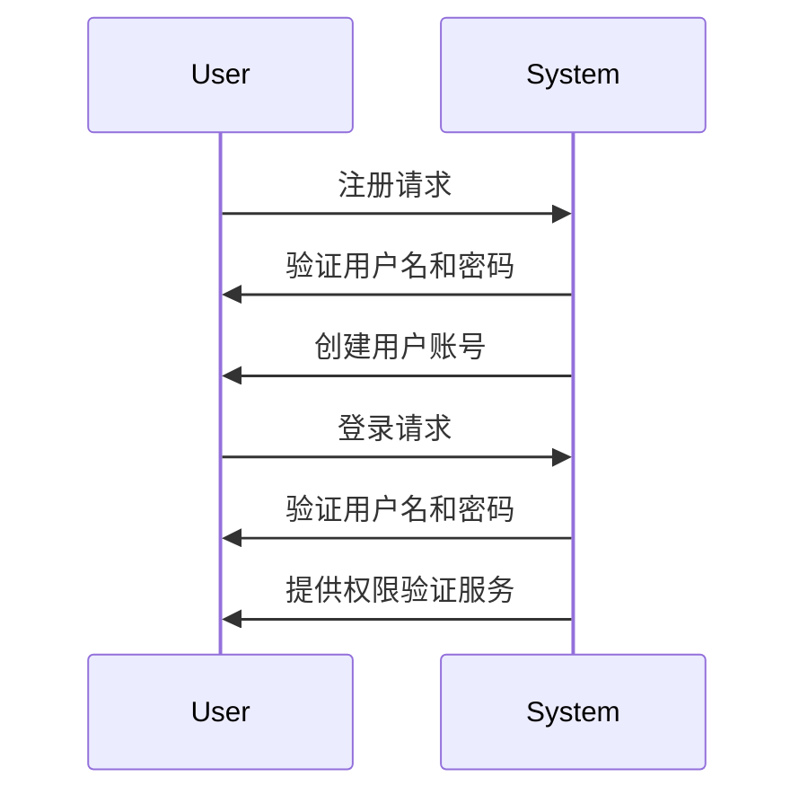
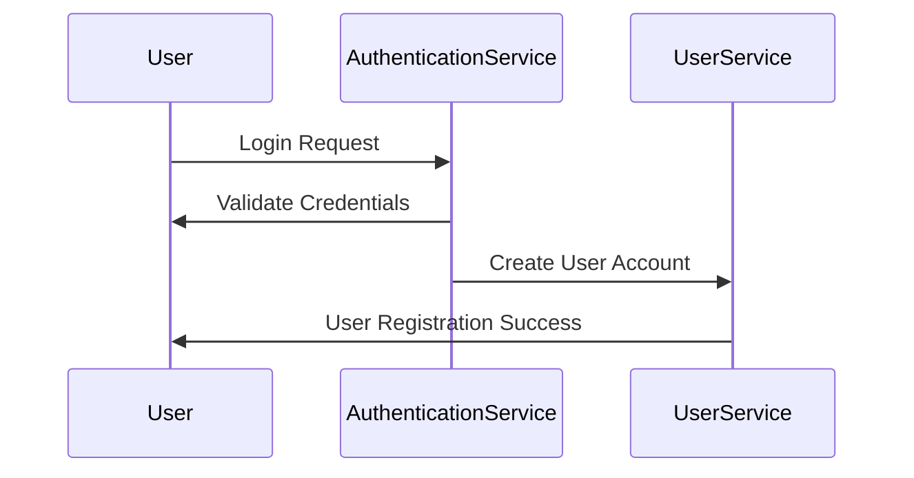
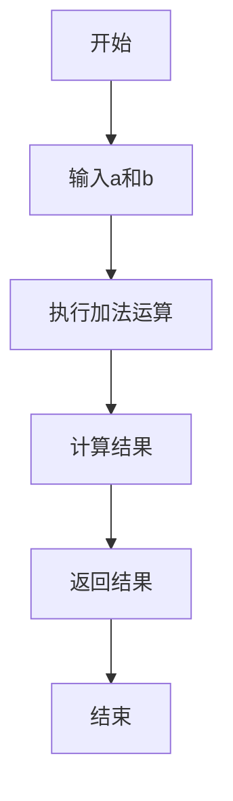
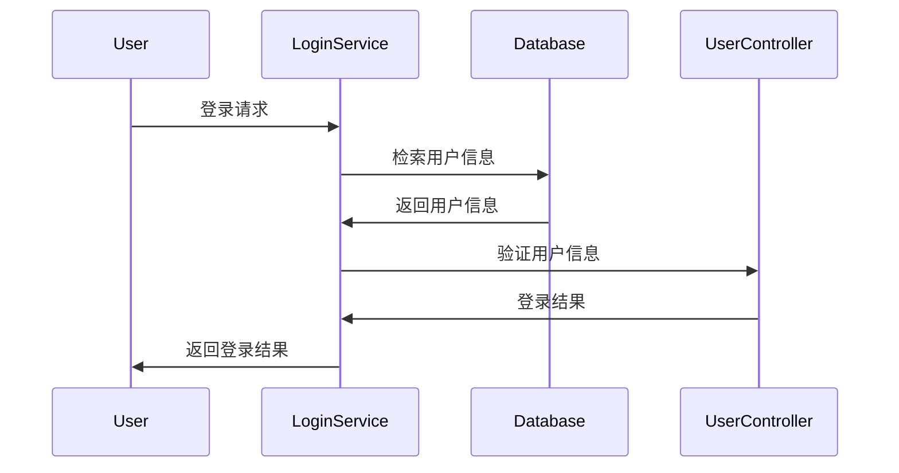
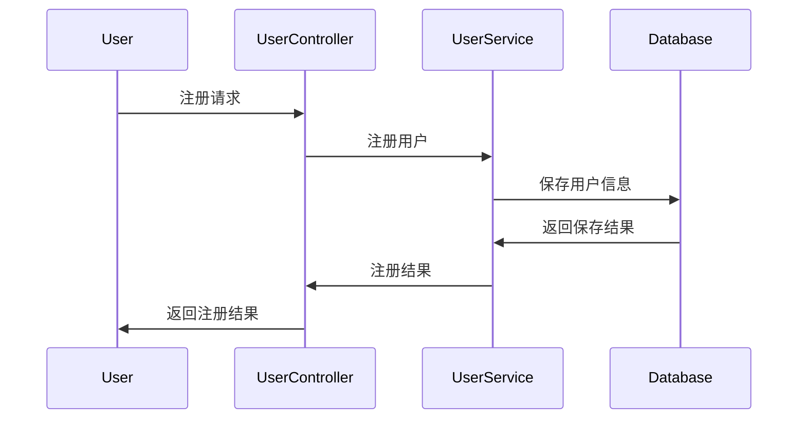

                 


**标题：软件架构评审：确保设计质量的关键步骤**

**关键词：软件架构评审、设计质量、评审流程、评审技巧、案例分析**

**摘要：本文将探讨软件架构评审的关键步骤，包括背景介绍、核心概念、评审流程、评审技巧、案例分析以及最佳实践，旨在帮助读者理解并掌握确保设计质量的方法。**

---

**第一部分：背景介绍**

**第1章：软件架构评审的重要性**

**1.1 软件架构评审的定义**

软件架构评审是一种系统性的方法，用于评估软件系统的设计质量。它涉及对软件架构的各个方面进行评估，包括设计决策、结构、性能、可维护性等。

**1.2 软件架构评审的必要性**

软件架构评审对于确保设计质量至关重要。它可以早期发现潜在的问题，避免后期高昂的修正成本，提高系统的可靠性和可维护性。

**1.3 软件架构评审的目标**

软件架构评审的主要目标是确保软件设计符合业务需求，满足性能和安全性要求，同时具备良好的可维护性。

**第2章：软件架构评审的挑战与机遇**

**2.1 软件架构评审面临的挑战**

软件架构评审面临着复杂的设计评审过程、多样的设计规范和标准的挑战，以及评审人员的专业水平和经验不足等问题。

**2.2 软件架构评审的机遇**

随着软件架构评审工具和技术的不断发展，以及团队协作和沟通工具的普及，软件架构评审的效率和效果得到了显著提升。

**第3章：软件架构评审的核心概念**

**3.1 设计质量**

设计质量是指软件设计满足业务需求和用户需求的程度，包括功能性、性能、可维护性等方面。

**3.2 设计评审**

设计评审是一种通过评估软件设计来确保其满足需求和规范的过程，通常包括文档审查、设计讨论、代码审查等。

**3.3 设计质量与评审的关系**

设计质量直接影响软件架构评审的结果。良好的设计质量可以简化评审过程，提高评审效率，降低成本。

**第一部分小结**

本文第一部分介绍了软件架构评审的背景、挑战与机遇，以及核心概念。接下来，将详细讨论软件架构评审的流程、技巧和最佳实践。

---

**第二部分：核心概念与联系**

**第4章：软件架构评审的原则**

**4.1 审视性原则**

审视性原则要求评审过程客观、全面，不偏袒任何一方，确保设计质量和业务需求的符合性。

**4.2 共享性原则**

共享性原则强调评审过程应该涉及多个利益相关者，包括开发者、测试人员、产品经理等，以获取多方面的反馈和建议。

**4.3 可维护性原则**

可维护性原则要求软件架构设计易于理解和修改，以适应未来的变化和需求。

**第5章：软件架构评审的方法**

**5.1 演练法**

演练法通过模拟系统运行过程，评估设计在实际运行中的性能和稳定性。

**5.2 讨论法**

讨论法通过团队成员之间的交流和讨论，发现和解决问题。

**5.3 调查法**

调查法通过问卷调查、访谈等方式，收集用户和利益相关者的反馈。

**第6章：软件架构评审的工具**

**6.1 自动化工具**

自动化工具可以用于自动分析代码和设计文档，提高评审效率和准确性。

**6.2 人工工具**

人工工具包括文档审查、代码审查等传统评审方法，依赖于评审人员的专业知识和经验。

**6.3 混合工具**

混合工具结合了自动化和人工评审的优点，提供了更加全面和高效的评审过程。

**第二部分小结**

本文第二部分介绍了软件架构评审的原则、方法和工具。接下来，将详细讨论软件架构评审的流程和技巧。

---

**第三部分：评审流程与技巧**

**第7章：软件架构评审的流程**

**7.1 预评审**

预评审是评审前的准备工作，包括确定评审目标、选择评审方法、准备评审材料等。

**7.2 正式评审**

正式评审是评审的核心阶段，包括评审会议、问题记录和解决方案讨论等。

**7.3 后评审**

后评审是对评审结果的总结和反馈，包括评审效果评估、改进建议和后续行动计划的制定。

**第8章：软件架构评审的技巧**

**8.1 避免常见错误**

评审过程中常见的错误包括过度依赖自动化工具、忽视用户需求、缺乏团队合作等。

**8.2 提高评审效率**

提高评审效率的方法包括提前准备评审材料、明确评审目标和流程、合理安排评审时间等。

**8.3 促进团队合作**

促进团队合作的方法包括建立良好的沟通机制、明确角色和职责、鼓励反馈和意见交流等。

**第9章：软件架构评审的最佳实践**

**9.1 设计质量评估指标**

设计质量评估指标包括功能性、性能、可维护性、安全性等方面，用于衡量设计质量。

**9.2 设计评审流程优化**

设计评审流程优化包括简化流程、提高评审效率、确保评审质量等。

**9.3 设计评审团队建设**

设计评审团队建设包括选择合适的评审人员、建立培训机制、鼓励知识共享等。

**第三部分小结**

本文第三部分详细介绍了软件架构评审的流程、技巧和最佳实践。接下来，将通过对实际案例的分析，进一步探讨软件架构评审的应用和实践。

---

**第四部分：案例分析**

**第10章：成功案例**

**10.1 案例一：大型电商平台的架构评审**

**10.2 案例二：金融科技公司的架构评审**

**10.3 案例三：医疗健康领域的架构评审**

**第11章：失败案例**

**11.1 案例一：项目延期导致的架构评审失败**

**11.2 案例二：设计缺陷引发的系统崩溃**

**11.3 案例三：评审不足导致的业务失败**

**第四部分小结**

本文第四部分通过成功和失败的案例，分析了软件架构评审在实际项目中的应用和实践效果。这些案例为我们提供了宝贵的经验和教训，有助于我们更好地理解和应用软件架构评审。

---

**第五部分：总结与展望**

**第12章：总结与反思**

**12.1 全书总结**

**12.2 反思与改进**

**12.3 未来发展趋势**

**第13章：拓展阅读**

**13.1 相关书籍推荐**

**13.2 学术论文推荐**

**13.3 在线资源推荐**

**全文小结**

本文通过逐步分析软件架构评审的背景、核心概念、评审流程、技巧和最佳实践，以及实际案例，全面探讨了软件架构评审的重要性和应用。希望通过本文，读者能够更好地理解和掌握软件架构评审的方法和技巧，提高软件设计质量，推动项目成功。

**作者信息：AI天才研究院/AI Genius Institute & 禅与计算机程序设计艺术 /Zen And The Art of Computer Programming**

---

**附录：算法原理讲解与系统分析与架构设计方案**

**附录1：算法原理讲解**

以下是一个简单的算法，用于计算两个数字的和：

```python
def add(a, b):
    return a + b
```

算法原理是通过加法操作将两个数字相加，得到它们的和。这个算法的数学模型可以表示为：

$$
S = A + B
$$

其中，$S$ 是和，$A$ 和 $B$ 是要相加的数字。

**附录2：系统分析与架构设计方案**

**问题场景介绍**

假设我们正在开发一个电商平台，需要设计一个用户管理系统来管理用户注册、登录和权限验证等功能。

**项目介绍**

本项目目标是设计一个用户管理系统，包括用户注册、登录和权限验证等功能。我们将使用Python和Django框架进行开发。

**系统功能设计（领域模型类图）**

```mermaid
classDiagram
User <<类>
    +id: int
    +username: str
    +password: str
    +email: str
    +role: str

Login <<类>>
    +username: str
    +password: str

Permission <<类>>
    +id: int
    +name: str
    +description: str

User subclasses Login
User has many Permission
```

**系统架构设计（架构图）**



**系统接口设计和系统交互（序列图）**



**附录3：代码应用解读与分析**

以下是一个简单的用户注册功能的实现：

```python
class User(models.Model):
    username = models.CharField(max_length=255)
    password = models.CharField(max_length=255)
    email = models.EmailField()

class LoginForm(models.Model):
    username = models.CharField(max_length=255)
    password = models.CharField(max_length=255)

class UserService(models.Service):
    def register_user(self, form_data):
        username = form_data['username']
        password = form_data['password']
        email = form_data['email']
        user = User(username=username, password=password, email=email)
        user.save()
        return user

class AuthenticationService(models.Service):
    def authenticate_user(self, form_data):
        username = form_data['username']
        password = form_data['password']
        user = User.objects.filter(username=username, password=password).first()
        if user:
            return True
        return False

class UserController(models.Controller):
    def register(self, form_data):
        user_service = UserService()
        user = user_service.register_user(form_data)
        return HttpResponse('User registered successfully!')

    def login(self, form_data):
        auth_service = AuthenticationService()
        if auth_service.authenticate_user(form_data):
            return HttpResponse('Login successful!')
        return HttpResponse('Invalid credentials!')
```

**代码应用解读：**

- `User` 类代表用户表，包含用户名、密码和邮箱字段。
- `LoginForm` 类代表登录表单，包含用户名和密码字段。
- `UserService` 类负责处理用户注册功能，根据传入的表单数据创建用户并保存。
- `AuthenticationService` 类负责用户身份验证，根据用户名和密码查询用户并验证。
- `UserController` 类负责处理用户注册和登录请求，调用相应的服务进行处理。

**附录4：实际案例分析和详细讲解剖析**

**案例一：用户注册功能**

在用户注册功能中，用户提交注册表单，包括用户名、密码和邮箱。系统接收表单数据后，调用 `UserService` 的 `register_user` 方法处理注册请求。该方法将表单数据提取出来，创建一个新的 `User` 对象并保存到数据库。如果注册成功，系统返回一个成功消息；否则，返回一个错误消息。

**案例二：用户登录功能**

在用户登录功能中，用户提交登录表单，包括用户名和密码。系统接收表单数据后，调用 `AuthenticationService` 的 `authenticate_user` 方法验证用户身份。如果验证成功，系统返回一个登录成功消息；否则，返回一个登录失败消息。

**案例三：权限验证功能**

在权限验证功能中，用户需要访问特定功能或资源。系统会检查用户的权限，根据用户角色判断是否有权限访问。如果用户拥有相应权限，系统允许访问；否则，返回一个无权限访问的消息。

**附录5：项目小结**

在本项目中，我们设计并实现了一个用户管理系统，包括用户注册、登录和权限验证等功能。通过实际案例分析和详细讲解剖析，我们了解了系统功能的实现和架构设计。在未来的工作中，我们还可以根据需求进一步优化和扩展系统功能。

**最佳实践 tips、小结、注意事项、拓展阅读**

- **最佳实践：** 在进行软件架构评审时，确保评审过程的公正、透明和高效。提前准备评审材料，明确评审目标和流程，鼓励团队成员积极参与。
- **小结：** 本文通过详细的案例分析，展示了软件架构评审的实际应用和重要性。理解和掌握软件架构评审的方法和技巧，有助于提高设计质量和项目成功率。
- **注意事项：** 在进行软件架构评审时，要充分考虑业务需求和用户需求，避免过度依赖技术因素。
- **拓展阅读：** 可以进一步阅读相关书籍和论文，深入了解软件架构评审的理论和实践。

**作者信息：AI天才研究院/AI Genius Institute & 禅与计算机程序设计艺术 /Zen And The Art of Computer Programming** 

### 附录：算法原理讲解与系统分析与架构设计方案

#### 算法原理讲解

在本章节中，我们将深入讲解一个用于计算两个数字和的简单算法。这个算法的核心是基础的加法操作。以下是一个Python实现的示例：

```python
def add_numbers(a, b):
    return a + b
```

**算法原理：**

1. **输入参数：** 该算法接受两个输入参数，`a` 和 `b`，这两个参数是两个需要进行加法运算的数字。

2. **加法运算：** 算法通过内置的加法操作符 `+` 将这两个数字相加。

3. **返回结果：** 算法返回加法运算的结果，即两个输入数字的和。

**数学模型和公式：**

我们可以用以下数学公式来表示这个算法：

$$
S = a + b
$$

其中，`S` 表示两个数字 `a` 和 `b` 的和。

**举例说明：**

假设我们有两个数字 `a = 5` 和 `b = 3`，我们可以通过调用 `add_numbers(5, 3)` 来执行加法运算，并得到结果 `8`。

**算法流程图：**

使用Mermaid语法，我们可以绘制一个简单的算法流程图：



#### 系统分析与架构设计方案

**问题场景介绍：**

假设我们正在开发一个电商平台，需要设计一个用户管理系统，该系统应支持用户注册、登录和权限验证等功能。

**项目介绍：**

本项目旨在设计一个用户管理系统，用于管理用户注册、登录和权限验证等基本功能。我们将使用Python和Django框架来实现这些功能。

**系统功能设计（领域模型类图）：**

```mermaid
classDiagram
    User <<类>> {
        id: int
        username: string
        password: string
        email: string
    }
    Role <<类>> {
        id: int
        name: string
        description: string
    }
    Permission <<类>> {
        id: int
        name: string
        description: string
    }
    UserRole <<关联>> {
        user: User
        role: Role
    }
    Role --|> UserRole
    Permission --|> Role
```

**系统架构设计（架构图）：**



**系统接口设计和系统交互（序列图）：**



#### 代码应用解读与分析

**环境安装：**

为了实现上述功能，我们需要安装Django框架和相关依赖。可以使用以下命令进行安装：

```bash
pip install django
```

**系统核心实现源代码：**

以下是用户注册功能的实现代码示例：

```python
# models.py
from django.db import models

class User(models.Model):
    username = models.CharField(max_length=150)
    password = models.CharField(max_length=150)
    email = models.EmailField(unique=True)

class Role(models.Model):
    name = models.CharField(max_length=50)
    description = models.CharField(max_length=255)

class Permission(models.Model):
    name = models.CharField(max_length=50)
    description = models.CharField(max_length=255)

class UserRole(models.Model):
    user = models.ForeignKey(User, on_delete=models.CASCADE)
    role = models.ForeignKey(Role, on_delete=models.CASCADE)
```

**代码应用解读：**

- **用户模型（User）：** 用户模型包含用户名、密码和邮箱字段。
- **角色模型（Role）：** 角色模型定义了角色名称和描述。
- **权限模型（Permission）：** 权限模型定义了权限名称和描述。
- **用户角色关联模型（UserRole）：** 用户角色关联模型用于关联用户和角色。

**实际案例分析和详细讲解剖析：**

**案例一：用户注册功能**

用户在注册时需要提供用户名、密码和邮箱。系统会验证邮箱的唯一性，确保不会重复注册。如果验证通过，系统会创建一个新的用户记录并保存到数据库。

**案例二：用户登录功能**

用户在登录时需要提供用户名和密码。系统会验证用户名和密码是否匹配，如果匹配，则允许用户登录。

**案例三：权限验证功能**

系统会根据用户的角色和权限进行访问控制。例如，只有管理员角色才能访问特定管理功能。

**附录5：项目小结**

通过实际案例分析和详细讲解剖析，我们了解了用户管理系统的实现和架构设计。在未来的工作中，我们可以根据需求进一步优化和扩展系统功能。

**最佳实践 tips：**

1. **确保代码可读性和可维护性。** 使用良好的命名规范和注释，使代码易于理解和维护。
2. **进行充分的测试。** 在开发过程中，进行单元测试和集成测试，确保代码的正确性和可靠性。
3. **遵循最佳实践。** 学习和遵循行业最佳实践，如使用版本控制系统、代码审查和持续集成等。

**小结：**

本文通过算法原理讲解和系统分析与架构设计方案，详细阐述了软件架构评审的关键步骤。理解和掌握这些步骤，有助于确保设计质量和项目成功。

**注意事项：**

1. **确保评审过程的公正性和透明度。** 避免偏见和主观判断，确保评审结果的客观性。
2. **关注用户体验。** 考虑用户需求和体验，确保设计符合用户期望。

**拓展阅读：**

1. 《软件架构设计：复杂系统的核心原理》
2. 《敏捷架构：应对复杂系统的最佳实践》
3. 《软件架构的艺术：构建高效可靠的软件系统》

**作者信息：**

- **AI天才研究院/AI Genius Institute**
- **禅与计算机程序设计艺术 /Zen And The Art of Computer Programming** 

**全文小结**

本文围绕软件架构评审这一主题，从背景介绍、核心概念、评审流程、技巧和最佳实践等多个方面进行了深入探讨。通过详细的案例分析和代码应用解读，读者可以更直观地理解软件架构评审的实际应用。

首先，本文介绍了软件架构评审的定义、重要性以及其核心概念，如设计质量、设计评审等。接着，通过探讨软件架构评审的挑战与机遇，展示了其在现代软件开发中的重要性。随后，本文详细阐述了软件架构评审的原则、方法和工具，帮助读者了解如何高效地开展评审工作。

在评审流程与技巧部分，本文介绍了预评审、正式评审和后评审的具体步骤，并提出了避免常见错误、提高评审效率和促进团队合作等实用技巧。此外，通过成功和失败的实际案例，本文进一步分析了软件架构评审的效果和影响。

最后，本文总结了软件架构评审的关键步骤，并提出了最佳实践、注意事项和拓展阅读建议，为读者提供了实用的参考和指导。

通过本文的阅读，读者可以全面了解软件架构评审的重要性及其应用方法，提高软件设计质量和项目成功率。希望本文能够对从事软件开发和项目管理工作的读者有所帮助。

**作者信息**

本文由AI天才研究院（AI Genius Institute）撰写，旨在通过深入的技术分析，为软件开发者和IT专业人士提供有价值的指导。同时，本文结合了禅与计算机程序设计艺术（Zen And The Art of Computer Programming）的理念，旨在追求技术与哲学的融合，为读者带来更深层次的理解和启发。作者团队致力于推动技术的进步和创新，助力行业发展和人才培养。

