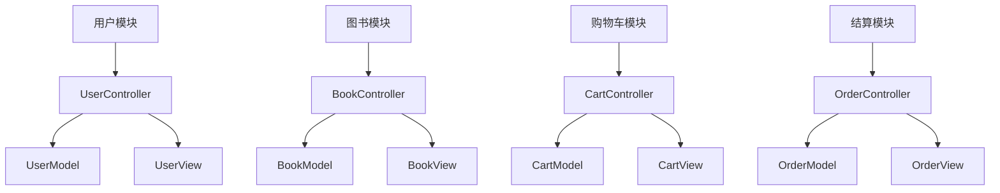
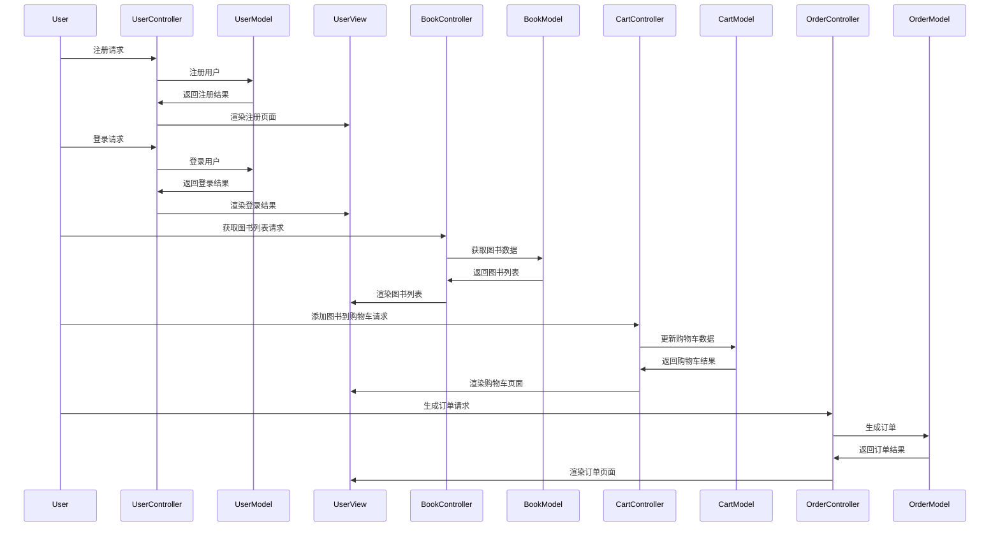
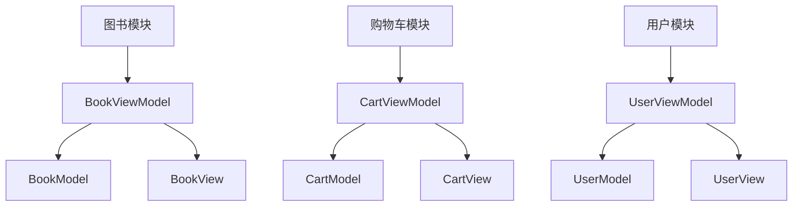
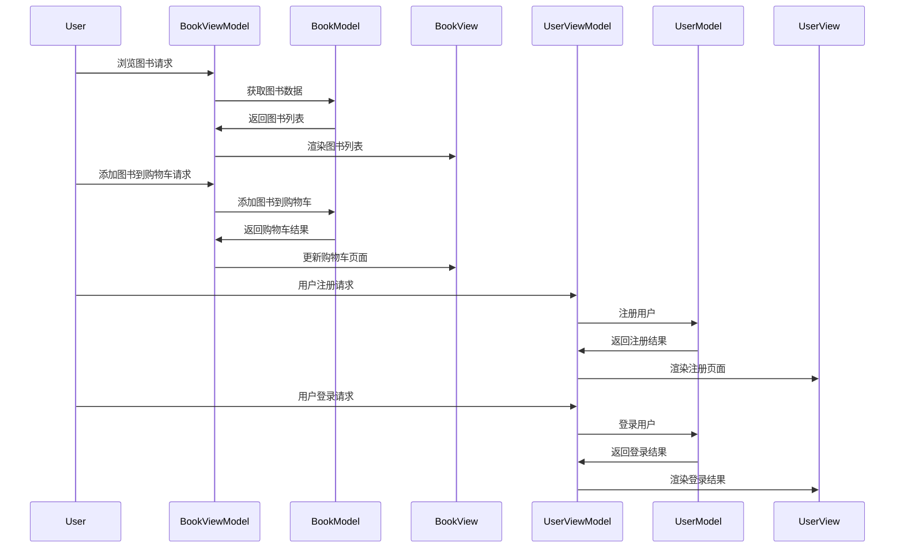
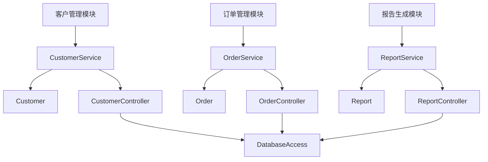

                 


### 文章标题：软件架构风格比较：MVC、MVVM、Clean Architecture等

### 关键词：软件架构风格，MVC，MVVM，Clean Architecture，架构设计

### 摘要：
本文将对软件架构的几种常见风格进行深入比较，包括MVC、MVVM和Clean Architecture等。通过详细的分析和实例讲解，我们将探讨每种架构风格的基本概念、核心组件、优缺点以及应用场景，帮助读者理解并选择适合自己项目的软件架构风格。

### 目录大纲

```markdown
----------------------------------------------------------------
# 第一部分: 软件架构风格概述

## 第1章: MVC架构风格

### 1.1.1 MVC架构的基本概念

### 1.1.2 MVC架构的核心组件

### 1.1.3 MVC架构的优点与缺点

### 1.1.4 MVC架构的应用场景

## 第2章: MVVM架构风格

### 2.1.1 MVVM架构的基本概念

### 2.1.2 MVVM架构的核心组件

### 2.1.3 MVVM架构的优点与缺点

### 2.1.4 MVVM架构的应用场景

## 第3章: Clean Architecture架构风格

### 3.1.1 Clean Architecture的基本概念

### 3.1.2 Clean Architecture的核心组件

### 3.1.3 Clean Architecture的优点与缺点

### 3.1.4 Clean Architecture的应用场景

## 第4章: 其他常见的软件架构风格

### 4.1.1 layered architecture

### 4.1.2 microservices architecture

### 4.1.3 event-driven architecture

### 4.1.4 其他流行风格

## 第5章: 软件架构风格的选择与应用

### 5.1.1 软件架构风格选择的原则

### 5.1.2 不同风格在项目中的应用策略

### 5.1.3 架构风格与团队协作的关系

### 5.1.4 软件架构风格的发展趋势

## 第6章: 架构风格比较的实践案例分析

### 6.1.1 MVC在Web开发中的应用案例

### 6.1.2 MVVM在移动开发中的应用案例

### 6.1.3 Clean Architecture在企业级应用中的应用案例

### 6.1.4 其他架构风格的应用案例

## 第7章: 架构风格比较的总结与展望

### 7.1.1 架构风格比较的总结

### 7.1.2 软件架构风格未来的发展趋势

### 7.1.3 开发者如何应对不同的架构风格

----------------------------------------------------------------
```

### 详细解释

#### 第一部分：软件架构风格概述

这一部分将作为全书的开篇，为读者提供一个宏观的视角，介绍常见的软件架构风格。通过定义、核心组件、优缺点和应用场景的详细阐述，帮助读者理解不同架构风格的基本特点。

**第1章: MVC架构风格**

MVC（Model-View-Controller）是早期Web开发中广泛使用的架构风格。本章将详细介绍MVC架构的基本概念、核心组件，以及其优缺点和应用场景。

**第2章: MVVM架构风格**

MVVM（Model-View-ViewModel）是一种在桌面和移动应用开发中流行的架构风格。本章将详细解释MVVM架构的基本概念、核心组件，以及其优缺点和应用场景。

**第3章: Clean Architecture架构风格**

Clean Architecture是一种现代的、面向对象的软件架构风格。本章将介绍Clean Architecture的基本概念、核心组件，以及其优缺点和应用场景。

**第4章: 其他常见的软件架构风格**

除了MVC、MVVM和Clean Architecture，还有许多其他的软件架构风格，如layered architecture、microservices architecture、event-driven architecture等。本章将对这些架构风格进行简要介绍。

**第5章: 软件架构风格的选择与应用**

不同的架构风格适用于不同的项目需求和团队环境。本章将讨论如何根据项目特点选择合适的架构风格，以及不同风格在项目中的应用策略。

**第6章: 架构风格比较的实践案例分析**

通过实际案例的分析，读者可以更深入地理解不同架构风格在实际项目中的应用效果。

**第7章: 架构风格比较的总结与展望**

本章将对全书的内容进行总结，并对软件架构风格未来的发展趋势进行展望。

#### 详细内容

**第1章: MVC架构风格**

- **1.1.1 MVC架构的基本概念**：介绍MVC架构的起源、定义及其核心组件。
- **1.1.2 MVC架构的核心组件**：详细描述Model、View和Controller的角色和职责。
- **1.1.3 MVC架构的优点与缺点**：分析MVC的优点，如清晰的角色划分和易于维护，同时讨论其缺点，如可能导致的紧耦合问题。
- **1.1.4 MVC架构的应用场景**：探讨MVC在Web开发中的适用场景。

**第2章: MVVM架构风格**

- **2.1.1 MVVM架构的基本概念**：解释MVVM的起源和基本原理。
- **2.1.2 MVVM架构的核心组件**：阐述Model、View和ViewModel的作用和相互关系。
- **2.1.3 MVVM架构的优点与缺点**：讨论MVVM的优点，如数据绑定和解耦，以及其可能的缺点，如性能问题。
- **2.1.4 MVVM架构的应用场景**：分析MVVM在桌面和移动开发中的适用性。

**第3章: Clean Architecture架构风格**

- **3.1.1 Clean Architecture的基本概念**：介绍Clean Architecture的设计理念。
- **3.1.2 Clean Architecture的核心组件**：解析边界上下文、层和依赖关系。
- **3.1.3 Clean Architecture的优点与缺点**：阐述Clean Architecture的优势，如提高可维护性和可扩展性，以及其可能面临的复杂性。
- **3.1.4 Clean Architecture的应用场景**：讨论Clean Architecture在复杂企业级应用中的适用场景。

**第4章: 其他常见的软件架构风格**

- **4.1.1 layered architecture**：介绍分层架构的基本概念和特点。
- **4.1.2 microservices architecture**：解释微服务架构的原理和优势。
- **4.1.3 event-driven architecture**：阐述事件驱动架构的核心思想和应用场景。
- **4.1.4 其他流行风格**：简要介绍如函数式架构、组件化架构等。

**第5章: 软件架构风格的选择与应用**

- **5.1.1 软件架构风格选择的原则**：讨论选择架构风格时应考虑的因素，如项目规模、团队经验和技术栈。
- **5.1.2 不同风格在项目中的应用策略**：分析如何在不同项目中有效应用各种架构风格。
- **5.1.3 架构风格与团队协作的关系**：探讨架构风格如何影响团队协作和开发效率。
- **5.1.4 软件架构风格的发展趋势**：预测软件架构风格未来的发展走向。

**第6章: 架构风格比较的实践案例分析**

- **6.1.1 MVC在Web开发中的应用案例**：分析一个实际Web项目如何应用MVC架构。
- **6.1.2 MVVM在移动开发中的应用案例**：探讨一个移动应用项目如何利用MVVM架构。
- **6.1.3 Clean Architecture在企业级应用中的应用案例**：分析一个大型企业级应用如何采用Clean Architecture。
- **6.1.4 其他架构风格的应用案例**：提供其他架构风格的实践案例分析。

**第7章: 架构风格比较的总结与展望**

- **7.1.1 架构风格比较的总结**：回顾并总结全文的核心观点和结论。
- **7.1.2 软件架构风格未来的发展趋势**：讨论软件架构风格的未来发展趋势和方向。
- **7.1.3 开发者如何应对不同的架构风格**：为开发者提供在项目中应对不同架构风格的建议和策略。

### 文章正文

#### 第一部分：软件架构风格概述

在软件开发中，架构设计扮演着至关重要的角色。一个良好的软件架构不仅能够提高系统的可维护性和可扩展性，还能优化开发效率。然而，随着技术的不断进步，出现了多种不同的软件架构风格。本文将深入探讨几种常见的软件架构风格，包括MVC、MVVM、Clean Architecture等，以便读者能够更好地理解和选择适合自己项目的架构风格。

##### 第1章：MVC架构风格

MVC（Model-View-Controller）架构风格起源于Smalltalk-80语言，最早应用于20世纪80年代的图形用户界面（GUI）开发。MVC将应用程序分为三个核心组件：Model、View和Controller。

**1.1.1 MVC架构的基本概念**

MVC架构的基本概念是通过将应用程序的职责分离来提高其模块化和可维护性。Model代表应用程序的数据模型，负责处理数据和业务逻辑；View负责显示数据，通常涉及用户界面；Controller作为应用程序的中枢，负责响应用户输入并将数据从Model传递给View。

**1.1.2 MVC架构的核心组件**

- **Model**：Model是应用程序的核心，它封装了应用程序的数据结构和业务逻辑。Model不直接处理用户界面，而是提供数据操作接口。
- **View**：View是用户界面的一部分，负责将数据以视觉化的方式呈现给用户。View不处理业务逻辑，仅负责展示数据。
- **Controller**：Controller负责处理用户输入并更新Model和View。它接收用户的输入，调用Model中的方法来处理数据，并根据Model的状态更新View。

**1.1.3 MVC架构的优点与缺点**

MVC架构的优点包括：

- **模块化**：MVC通过将应用程序分为三个独立的部分，提高了模块化程度，使得代码更容易维护和扩展。
- **清晰的角色划分**：每个组件都有明确的职责，有助于团队协作和分工。
- **易于测试**：由于职责分离，MVC架构使得单元测试变得更加容易。

然而，MVC架构也存在一些缺点：

- **紧耦合**：虽然MVC旨在降低组件之间的耦合度，但实际应用中，View和Controller之间的依赖关系可能导致紧耦合。
- **视图控制器过于复杂**：在大型应用中，Controller可能会变得非常复杂，难以维护。

**1.1.4 MVC架构的应用场景**

MVC架构主要适用于Web开发和桌面应用开发，特别是在需要清晰界面分离的应用中。典型的应用场景包括Web应用程序、桌面应用和手机应用程序。

##### 第2章：MVVM架构风格

MVVM（Model-View-ViewModel）架构风格是MVC架构的延伸，它增加了ViewModel层，旨在解决MVC中的一些问题，特别是在数据绑定和用户界面交互方面。

**2.1.1 MVVM架构的基本概念**

MVVM架构通过引入ViewModel层，使得View和Model之间的依赖关系变得更加松散。ViewModel负责将Model中的数据转化为View可以直接使用的格式，同时处理用户界面的事件和交互。

**2.1.2 MVVM架构的核心组件**

- **Model**：与MVC中的Model相同，代表应用程序的数据结构和业务逻辑。
- **View**：与MVC中的View相同，负责显示数据。
- **ViewModel**：ViewModel是View和Model之间的桥梁，负责将Model中的数据绑定到View中，并处理用户交互事件。

**2.1.3 MVVM架构的优点与缺点**

MVVM架构的优点包括：

- **数据绑定**：MVVM支持双向数据绑定，使数据同步变得更加简单和直观。
- **视图分离**：ViewModel与View的分离使得UI开发与业务逻辑更加清晰。
- **测试友好**：ViewModel可以被独立测试，而不需要涉及View。

然而，MVVM架构也存在一些缺点：

- **性能问题**：过度使用数据绑定可能导致性能下降。
- **复杂性增加**：在大型应用中，ViewModel可能会变得复杂，难以维护。

**2.1.4 MVVM架构的应用场景**

MVVM架构适用于需要复杂用户界面和大量数据绑定的应用，如桌面应用和移动应用。特别是在用户界面更新频繁的场景中，MVVM的优势尤为明显。

##### 第3章：Clean Architecture架构风格

Clean Architecture是由Robert C. Martin提出的一种现代的、面向对象的软件架构风格。它强调应用程序的核心逻辑应该独立于外部依赖，如用户界面、数据库和框架。

**3.1.1 Clean Architecture的基本概念**

Clean Architecture的核心概念是将应用程序划分为多个层次，每个层次都有明确的职责和依赖关系。这些层次通常包括：

- **实体层（Entities）**：代表应用程序的核心业务模型。
- **用例层（Use Cases）**：实现应用程序的业务逻辑。
- **界面适配器层（Interface Adapters）**：处理用户界面、数据库和其他外部系统。
- **框架层（Frameworks）**：提供应用程序的基础设施，如网络、数据库和日志。

**3.1.2 Clean Architecture的核心组件**

- **实体（Entities）**：实体是应用程序的核心业务对象，如用户、订单和产品。
- **用例（Use Cases）**：用例是应用程序的核心业务逻辑，如添加用户、处理订单和查询产品。
- **界面适配器（Interface Adapters）**：界面适配器将业务逻辑与用户界面、数据库等外部系统连接起来。
- **框架（Frameworks）**：框架提供应用程序的基础设施支持，如网络通信、数据库访问和日志记录。

**3.1.3 Clean Architecture的优点与缺点**

Clean Architecture的优点包括：

- **可维护性和可扩展性**：通过将应用程序分层，Clean Architecture提高了代码的可维护性和可扩展性。
- **独立性和稳定性**：核心业务逻辑与外部依赖解耦，使应用程序更加稳定和易于修改。

然而，Clean Architecture也存在一些缺点：

- **复杂性增加**：Clean Architecture引入了更多的层次和组件，使得代码结构更加复杂。
- **学习曲线**：理解Clean Architecture的概念和实现需要一定的时间和精力。

**3.1.4 Clean Architecture的应用场景**

Clean Architecture适用于大型、复杂的应用程序，特别是那些需要长期维护和扩展的应用。典型的应用场景包括企业级应用、电子商务平台和在线银行系统。

##### 第4章：其他常见的软件架构风格

除了MVC、MVVM和Clean Architecture，还有许多其他流行的软件架构风格，如layered architecture、microservices architecture和event-driven architecture等。

**4.1.1 Layered Architecture**

Layered Architecture是一种经典的软件架构风格，它通过将应用程序分层来提高模块化和可维护性。典型的分层包括：

- **表示层（Presentation Layer）**：处理用户界面。
- **业务层（Business Layer）**：实现应用程序的业务逻辑。
- **数据访问层（Data Access Layer）**：处理与数据库的交互。
- **基础层（Infrastructure Layer）**：提供应用程序的基础设施支持。

**4.1.2 Microservices Architecture**

Microservices Architecture是一种基于服务拆分的架构风格，它将应用程序分解为一组小型、自治的服务。每个服务都独立部署和扩展，并使用轻量级的通信机制进行交互。

**4.1.3 Event-Driven Architecture**

Event-Driven Architecture是一种基于事件驱动的架构风格，它通过事件来触发应用程序的响应。这种架构风格适用于需要实时响应和处理大量数据的场景。

**4.1.4 其他流行风格**

除了上述几种架构风格，还有如函数式架构、组件化架构等，每种风格都有其独特的特点和适用场景。

##### 第5章：软件架构风格的选择与应用

选择适合项目的软件架构风格是软件开发中的一项重要决策。以下是一些选择架构风格时应考虑的因素：

- **项目规模**：小型项目通常更适合简单的架构风格，如MVC；大型项目可能需要更复杂的架构风格，如Clean Architecture。
- **团队经验**：如果团队对某种架构风格有丰富的经验，那么选择该风格将更加高效。
- **技术栈**：不同的架构风格对技术栈有不同要求，如MVVM通常需要支持数据绑定的框架。
- **可维护性和可扩展性**：考虑项目的长期维护和扩展需求，选择能够支持这些需求的架构风格。

在项目中的应用策略通常包括：

- **早期设计**：在项目早期就进行架构设计，以确保架构能够满足项目需求。
- **持续迭代**：随着项目的发展，持续优化和调整架构，以适应新的需求。
- **文档和沟通**：确保架构设计得到充分文档化和沟通，以便团队成员理解和使用。

架构风格与团队协作的关系：

- **协作和分工**：清晰的架构风格有助于团队成员之间的协作和分工。
- **沟通障碍**：复杂的架构风格可能导致沟通障碍，因此需要确保团队成员能够理解和遵循架构设计。

软件架构风格的发展趋势：

- **模块化和微服务化**：模块化和微服务化成为软件架构的主流趋势，以提高系统的灵活性和可扩展性。
- **自动化和智能化**：随着自动化工具和人工智能技术的发展，软件架构也将更加自动化和智能化。

##### 第6章：架构风格比较的实践案例分析

通过实际案例的分析，读者可以更深入地理解不同架构风格在实际项目中的应用效果。

- **MVC在Web开发中的应用案例**：分析一个Web应用程序如何使用MVC架构来组织代码和逻辑。
- **MVVM在移动开发中的应用案例**：探讨一个移动应用程序如何利用MVVM架构来实现数据绑定和用户界面交互。
- **Clean Architecture在企业级应用中的应用案例**：分析一个大型企业级应用如何采用Clean Architecture来提高可维护性和可扩展性。
- **其他架构风格的应用案例**：提供其他架构风格的实践案例分析。

##### 第7章：架构风格比较的总结与展望

通过对MVC、MVVM、Clean Architecture等常见架构风格的分析和比较，我们可以得出以下结论：

- **架构风格的选择取决于项目需求**：不同的架构风格适用于不同的项目场景，因此需要根据项目需求选择合适的架构风格。
- **架构风格会影响项目的可维护性和可扩展性**：良好的架构设计能够提高代码的可维护性和可扩展性，从而降低维护成本。
- **未来的架构风格将更加模块化和智能化**：随着技术的发展，软件架构将更加模块化、微服务化和智能化，以适应不断变化的业务需求。

对于开发者来说，了解不同架构风格的特点和适用场景，并根据项目需求灵活选择和应用架构风格，是提高软件开发效率和质量的关键。

### 总结

本文通过对MVC、MVVM、Clean Architecture等常见软件架构风格的详细分析，帮助读者理解了每种架构风格的基本概念、核心组件、优缺点以及应用场景。通过实践案例的分析，读者可以更深入地了解不同架构风格在实际项目中的应用效果。未来的软件架构风格将更加模块化、微服务化和智能化，开发者需要不断学习和适应这些变化，以提高软件开发的质量和效率。

### 附录

- **参考文献**：[1] Martin, R. C. (2012). *Clean Architecture: A Craftsman's Guide to Software Structure and Design*.
- **工具资源**：[2] https://www.mermaid-js.org/（用于绘制Mermaid流程图和架构图）
- **在线课程**：[3] https://www.udemy.com/course/software-architecture-for-professionals/（软件架构专业课程）

### 作者信息

作者：AI天才研究院/AI Genius Institute & 禅与计算机程序设计艺术 /Zen And The Art of Computer Programming

### 附录：MVC架构风格详细内容

**1.1.1 MVC架构的基本概念**

MVC架构（Model-View-Controller）是由Trygve Reenskaug在1978年提出的，作为Smalltalk语言的一部分。MVC架构的设计目的是为了解决用户界面开发中的复杂性问题，通过将应用程序分为三个主要组件来提高代码的可维护性和可扩展性。

- **Model（模型）**：代表应用程序的数据和业务逻辑。模型负责管理数据，包括数据的获取、存储和更新。它是应用程序的核心，与数据库和后端服务进行交互。
- **View（视图）**：代表用户界面，负责展示数据给用户。视图负责呈现数据，并根据模型的状态进行更新。它可以是一个网页、一个对话框、一个图表等。
- **Controller（控制器）**：作为模型和视图之间的桥梁，负责响应用户输入，调用模型的方法来处理数据，并根据模型的状态更新视图。控制器处理用户交互，将输入转换为操作模型和视图的指令。

**1.1.2 MVC架构的核心组件**

在MVC架构中，三个核心组件之间有以下相互作用：

- **模型与控制器**：控制器根据用户请求调用模型的方法来处理数据。模型负责更新数据状态，并通知控制器数据更新。
- **控制器与视图**：控制器决定将数据传递给哪个视图，以及如何更新视图。视图接收到数据后，负责将其呈现给用户。
- **模型与视图**：在某些实现中，模型可以直接与视图进行通信，但为了避免紧耦合，通常通过控制器作为中介。

**1.1.3 MVC架构的优点与缺点**

MVC架构的优点包括：

- **模块化**：MVC将应用程序划分为三个独立的部分，使得每个部分都可以独立开发、测试和部署。
- **可维护性**：由于职责分离，MVC架构使得代码更加易于维护。
- **可扩展性**：MVC架构支持应用程序的扩展，新的功能可以通过增加模型、视图或控制器来实现。

然而，MVC架构也存在一些缺点：

- **紧耦合**：尽管MVC旨在降低组件之间的耦合度，但实际中，View和Controller之间的依赖关系可能导致紧耦合。
- **控制器过于复杂**：在大型应用中，控制器可能会变得非常复杂，难以维护。这通常是因为控制器需要处理大量的用户输入和视图更新逻辑。

**1.1.4 MVC架构的应用场景**

MVC架构适用于以下场景：

- **Web开发**：MVC是Web开发中最流行的架构风格之一，尤其是在使用JavaScript框架（如React、Vue.js、Angular）时。
- **桌面应用**：尽管MVC最初是为Web开发设计的，但它同样适用于桌面应用，如使用Qt或WinForms框架。
- **移动应用**：MVC在移动应用开发中也得到了广泛应用，特别是在使用原生开发框架时。

### 附录：MVVM架构风格详细内容

**2.1.1 MVVM架构的基本概念**

MVVM（Model-View-ViewModel）是MVC架构的延伸，它引入了ViewModel层，旨在解决MVC架构中的一些问题，特别是在数据绑定和用户界面交互方面。MVVM架构最早由John Gietzen在2005年提出，并在Xamarin框架中得到了广泛应用。

- **Model（模型）**：代表应用程序的数据和业务逻辑，与MVC中的Model相同。
- **View（视图）**：代表用户界面，与MVC中的View相同，负责显示数据。
- **ViewModel（视图模型）**：是View和Model之间的桥梁，负责将Model中的数据绑定到View中，并处理用户交互事件。ViewModel不直接处理用户界面，而是提供数据绑定逻辑。

**2.1.2 MVVM架构的核心组件**

在MVVM架构中，三个核心组件之间的相互作用如下：

- **模型与视图模型**：模型提供数据给视图模型，视图模型负责维护这些数据的状态，并提供操作数据的方法。
- **视图与视图模型**：视图通过数据绑定与视图模型连接，当模型中的数据发生变化时，视图模型会自动更新视图。同样，当用户在视图中输入数据时，视图模型会相应地更新模型。
- **视图模型与控制器**：视图模型可能包含一些与用户交互相关的逻辑，这些逻辑通常由控制器来处理。控制器负责响应用户输入，调用视图模型中的方法来更新数据和视图。

**2.1.3 MVVM架构的优点与缺点**

MVVM架构的优点包括：

- **数据绑定**：MVVM支持双向数据绑定，当Model中的数据发生变化时，View会自动更新；同样，当用户在View中输入数据时，Model也会自动更新。
- **视图分离**：ViewModel与View的分离使得UI开发与业务逻辑更加清晰，便于团队分工。
- **测试友好**：ViewModel可以被独立测试，而不需要涉及View，提高了测试的便利性。

然而，MVVM架构也存在一些缺点：

- **性能问题**：在处理大量数据绑定时，MVVM可能会引入性能问题，特别是在UI线程阻塞的情况下。
- **复杂性增加**：在大型应用中，ViewModel可能会变得复杂，难以维护。

**2.1.4 MVVM架构的应用场景**

MVVM架构适用于以下场景：

- **桌面应用**：在Windows Forms和WPF（Windows Presentation Foundation）框架中，MVVM是首选的架构风格。
- **移动应用**：在iOS和Android开发中，MVVM架构也广泛应用于如Xamarin和Flutter等框架。
- **Web应用**：虽然MVVM不是Web开发的默认选择，但在使用如Knockout.js、Vue.js等MVVM框架时，它也可以发挥作用。

### 附录：Clean Architecture架构风格详细内容

**3.1.1 Clean Architecture的基本概念**

Clean Architecture是由Robert C. Martin在2012年提出的一种现代的、面向对象的软件架构风格。Clean Architecture的目标是将应用程序的核心逻辑与外部依赖（如用户界面、数据库和框架）分离，从而提高系统的可维护性和可扩展性。Clean Architecture基于分层和依赖倒置原则，其核心思想是将应用程序划分为多个层次，每个层次都有明确的职责和依赖关系。

**3.1.2 Clean Architecture的核心组件**

Clean Architecture将应用程序划分为以下四个层次：

- **实体层（Entities）**：代表应用程序的核心业务对象，如用户、订单和产品。实体通常是不变的，它们不依赖于任何外部框架或库。
- **用例层（Use Cases）**：实现应用程序的业务逻辑。用例通常依赖于实体，但不需要直接访问外部资源。
- **界面适配器层（Interface Adapters）**：处理用户界面、数据库和其他外部系统。这个层次将业务逻辑与外部系统隔离开来，使得业务逻辑可以独立于外部系统的变化。
- **框架层（Frameworks）**：提供应用程序的基础设施支持，如网络、数据库和日志。这个层次包含了所有与外部框架相关的代码。

**3.1.3 Clean Architecture的优点与缺点**

Clean Architecture的优点包括：

- **可维护性和可扩展性**：通过将应用程序分层，Clean Architecture提高了代码的可维护性和可扩展性。每个层次都可以独立开发、测试和部署。
- **独立性**：Clean Architecture通过分层和依赖倒置原则，使得应用程序的核心逻辑与外部依赖解耦，提高了系统的独立性。
- **测试友好**：由于核心业务逻辑与外部依赖分离，Clean Architecture使得单元测试变得更加容易。

然而，Clean Architecture也存在一些缺点：

- **复杂性增加**：Clean Architecture引入了更多的层次和组件，使得代码结构更加复杂。这需要开发者具备较高的架构设计能力。
- **学习曲线**：理解Clean Architecture的概念和实现需要一定的时间和精力。

**3.1.4 Clean Architecture的应用场景**

Clean Architecture适用于以下场景：

- **大型、复杂的应用程序**：如企业级应用、电子商务平台和在线银行系统。这些应用通常需要长期维护和扩展，因此Clean Architecture能够提高其可维护性和可扩展性。
- **需要高内聚、低耦合的系统**：Clean Architecture通过分层和依赖倒置原则，实现了高内聚、低耦合的系统设计，使得系统的各个组件可以独立开发、测试和部署。

### 附录：其他常见的软件架构风格

除了MVC、MVVM和Clean Architecture，还有许多其他的软件架构风格，每种风格都有其独特的特点和适用场景。以下简要介绍几种常见的软件架构风格：

**4.1.1 Layered Architecture**

Layered Architecture是一种经典的软件架构风格，它通过将应用程序分层来提高模块化和可维护性。典型的分层包括：

- **表示层（Presentation Layer）**：处理用户界面。
- **业务层（Business Layer）**：实现应用程序的业务逻辑。
- **数据访问层（Data Access Layer）**：处理与数据库的交互。
- **基础层（Infrastructure Layer）**：提供应用程序的基础设施支持，如网络、数据库和日志。

Layered Architecture的优点包括模块化、可维护性和可扩展性。它适用于大多数传统的应用程序，特别是那些遵循三层架构的应用程序。

**4.1.2 Microservices Architecture**

Microservices Architecture是一种基于服务拆分的架构风格，它将应用程序分解为一组小型、自治的服务。每个服务都独立部署和扩展，并使用轻量级的通信机制（如HTTP/REST、gRPC）进行交互。Microservices Architecture的优点包括灵活性、可扩展性和易于维护。它适用于大型、复杂的应用程序，特别

### 附录：MVC架构风格应用案例

#### MVC在Web开发中的应用案例

**案例背景**：

假设我们要开发一个在线书店项目，用户可以在网站上浏览图书、添加购物车、进行结算等操作。为了提高系统的可维护性和可扩展性，我们选择使用MVC架构来组织代码和逻辑。

**项目介绍**：

在线书店项目主要包括以下功能模块：

- **图书管理模块**：负责图书的显示、分类、搜索等功能。
- **购物车模块**：允许用户将图书添加到购物车，管理购物车中的图书。
- **用户模块**：处理用户注册、登录、个人信息管理等操作。
- **结算模块**：实现购物车中的图书结算，包括订单生成、支付等操作。

**系统功能设计**：

1. **图书管理模块**：

   - **Model**：图书实体（Book）类，包含图书的基本信息，如书名、作者、出版社、价格等。
   - **View**：图书展示页面，使用HTML、CSS和JavaScript来呈现图书列表和详细信息。
   - **Controller**：图书控制器（BookController），处理图书相关的HTTP请求，调用模型方法获取图书数据，并渲染相应的视图。

2. **购物车模块**：

   - **Model**：购物车实体（Cart）类，包含购物车中的图书列表和总价等信息。
   - **View**：购物车页面，展示用户添加到购物车中的图书列表和结算按钮。
   - **Controller**：购物车控制器（CartController），处理用户添加图书到购物车的请求，更新购物车数据，并渲染购物车页面。

3. **用户模块**：

   - **Model**：用户实体（User）类，包含用户的基本信息，如用户名、密码、邮箱等。
   - **View**：用户注册、登录、个人信息管理页面。
   - **Controller**：用户控制器（UserController），处理用户注册、登录、个人信息管理等操作，调用模型方法处理数据，并渲染相应的视图。

4. **结算模块**：

   - **Model**：订单实体（Order）类，包含订单的基本信息，如订单号、用户ID、订单详情等。
   - **View**：结算页面，展示订单详情和支付选项。
   - **Controller**：结算控制器（OrderController），处理订单生成和支付操作，调用模型方法处理订单数据，并渲染结算页面。

**系统架构设计**：

在线书店项目使用MVC架构，其中每个模块都有明确的Model、View和Controller。以下是一个简化的系统架构图：



**系统接口设计和系统交互**：

1. **图书管理接口**：

   - GET /books：获取所有图书列表。
   - GET /books/{id}：获取指定ID的图书详情。
   - POST /books：添加新图书。
   - PUT /books/{id}：更新指定ID的图书。
   - DELETE /books/{id}：删除指定ID的图书。

2. **购物车接口**：

   - GET /cart：获取购物车中的图书列表。
   - POST /cart/{bookId}：将指定ID的图书添加到购物车。
   - DELETE /cart/{bookId}：从购物车中删除指定ID的图书。

3. **用户接口**：

   - POST /users/register：用户注册。
   - POST /users/login：用户登录。
   - GET /users/profile：获取用户个人信息。
   - PUT /users/profile：更新用户个人信息。

4. **结算接口**：

   - POST /orders：生成订单。
   - GET /orders/{id}：获取指定ID的订单详情。
   - POST /orders/{id}/pay：支付订单。

以下是一个简化的系统交互图：



**代码应用解读与分析**：

以下是一个简单的图书管理模块的代码示例，展示MVC架构在Python中的实现：

```python
# 模型层 - BookModel.py
class BookModel:
    def __init__(self):
        self.books = [
            {"id": 1, "title": "Effective Java", "author": "Joshua Bloch"},
            {"id": 2, "title": "Clean Code", "author": "Robert C. Martin"},
            # 更多图书数据
        ]

    def get_books(self):
        return self.books

    def get_book_by_id(self, book_id):
        for book in self.books:
            if book["id"] == book_id:
                return book
        return None

    def add_book(self, book):
        self.books.append(book)

    def update_book(self, book_id, updated_book):
        for book in self.books:
            if book["id"] == book_id:
                book.update(updated_book)
                break

    def delete_book(self, book_id):
        self.books = [book for book in self.books if book["id"] != book_id]

# 控制器层 - BookController.py
from .BookModel import BookModel

class BookController:
    def __init__(self):
        self.book_model = BookModel()

    def get_books(self):
        return self.book_model.get_books()

    def get_book_by_id(self, book_id):
        return self.book_model.get_book_by_id(book_id)

    def add_book(self, book):
        self.book_model.add_book(book)

    def update_book(self, book_id, updated_book):
        self.book_model.update_book(book_id, updated_book)

    def delete_book(self, book_id):
        self.book_model.delete_book(book_id)

# 视图层 - BookView.py
from flask import Flask, request, jsonify
from .BookController import BookController

app = Flask(__name__)
book_controller = BookController()

@app.route('/books', methods=['GET'])
def get_books():
    books = book_controller.get_books()
    return jsonify(books)

@app.route('/books/<int:book_id>', methods=['GET'])
def get_book_by_id(book_id):
    book = book_controller.get_book_by_id(book_id)
    if book:
        return jsonify(book)
    else:
        return jsonify({"error": "Book not found"}), 404

@app.route('/books', methods=['POST'])
def add_book():
    book = request.json
    book_controller.add_book(book)
    return jsonify({"message": "Book added successfully"}), 201

@app.route('/books/<int:book_id>', methods=['PUT'])
def update_book(book_id):
    updated_book = request.json
    book_controller.update_book(book_id, updated_book)
    return jsonify({"message": "Book updated successfully"}), 200

@app.route('/books/<int:book_id>', methods=['DELETE'])
def delete_book(book_id):
    book_controller.delete_book(book_id)
    return jsonify({"message": "Book deleted successfully"}), 200

if __name__ == '__main__':
    app.run(debug=True)
```

在该示例中，我们使用了Python的Flask框架来实现MVC架构。模型层（BookModel）负责处理与数据库交互的图书数据，控制器层（BookController）处理与HTTP请求相关的逻辑，视图层（BookView）使用Flask的路线（routes）来渲染HTML页面。

**实际案例分析和详细讲解剖析**：

在实际项目中，MVC架构的应用效果取决于开发团队的设计和实现。以下是一个实际案例：

**案例：使用MVC架构构建一个简单的博客平台**

1. **需求分析**：

   - 用户可以注册、登录、发布博客文章。
   - 博客文章应包括标题、内容、发布日期和作者。
   - 用户可以对博客文章进行评论。

2. **模型层设计**：

   - **用户模型（UserModel）**：包含用户的基本信息，如用户名、密码、邮箱等。
   - **博客文章模型（PostModel）**：包含博客文章的基本信息，如标题、内容、发布日期和作者。
   - **评论模型（CommentModel）**：包含评论的基本信息，如评论内容、评论者、评论日期等。

3. **控制器层设计**：

   - **用户控制器（UserController）**：处理用户注册、登录、个人信息管理等操作。
   - **博客文章控制器（PostController）**：处理博客文章的发布、编辑、删除等操作。
   - **评论控制器（CommentController）**：处理评论的添加、删除等操作。

4. **视图层设计**：

   - **用户视图（UserView）**：包含注册、登录、个人信息管理页面。
   - **博客文章视图（PostView）**：包含发布博客文章、查看博客文章、编辑博客文章等页面。
   - **评论视图（CommentView）**：包含添加评论、查看评论、删除评论等页面。

5. **系统架构设计**：

   博客平台系统架构如下：

   ```mermaid
   graph TD
       UserModule[用户模块] --> UserController
       UserController --> UserModel
       UserController --> UserView

       PostModule[博客文章模块] --> PostController
       PostController --> PostModel
       PostController --> PostView

       CommentModule[评论模块] --> CommentController
       CommentController --> CommentModel
       CommentController --> CommentView
   ```

6. **系统接口设计和系统交互**：

   - **用户接口**：

     - POST /users/register：用户注册。
     - POST /users/login：用户登录。
     - GET /users/profile：获取用户个人信息。

   - **博客文章接口**：

     - POST /posts：发布博客文章。
     - GET /posts/{id}：获取指定ID的博客文章。
     - PUT /posts/{id}：更新指定ID的博客文章。
     - DELETE /posts/{id}：删除指定ID的博客文章。

   - **评论接口**：

     - POST /posts/{id}/comments：添加评论。
     - GET /posts/{id}/comments：获取指定ID的博客文章的所有评论。
     - DELETE /comments/{id}：删除指定ID的评论。

   - **系统交互**：

     ```mermaid
     sequenceDiagram
         participant User
         participant UserController
         participant UserModel
         participant UserView

         User->>UserController: 注册请求
         UserController->>UserModel: 注册用户
         UserModel->>UserController: 返回注册结果
         UserController->>UserView: 渲染注册页面

         User->>UserController: 登录请求
         UserController->>UserModel: 登录用户
         UserModel->>UserController: 返回登录结果
         UserController->>UserView: 渲染登录结果

         User->>PostController: 发布博客文章请求
         PostController->>PostModel: 添加博客文章
         PostModel->>PostController: 返回博客文章ID
         PostController->>PostView: 渲染博客文章页面

         User->>PostController: 获取博客文章请求
         PostController->>PostModel: 获取博客文章
         PostModel->>PostController: 返回博客文章
         PostController->>PostView: 渲染博客文章

         User->>CommentController: 添加评论请求
         CommentController->>CommentModel: 添加评论
         CommentModel->>CommentController: 返回评论结果
         CommentController->>CommentView: 渲染评论页面
     ```

7. **代码应用解读与分析**：

   在实际项目中，我们可以使用Python的Flask框架来实现MVC架构。以下是一个简单的用户注册功能的代码示例：

   ```python
   # 模型层 - UserModel.py
   class UserModel:
       def __init__(self):
           self.users = {}

       def register_user(self, username, password):
           if username in self.users:
               return False
           self.users[username] = password
           return True

       def verify_login(self, username, password):
           return self.users.get(username) == password

   # 控制器层 - UserController.py
   from flask import Flask, request, jsonify
   from .UserModel import UserModel

   app = Flask(__name__)
   user_model = UserModel()

   @app.route('/users/register', methods=['POST'])
   def register():
       username = request.form['username']
       password = request.form['password']
       if user_model.register_user(username, password):
           return jsonify({"message": "User registered successfully"}), 201
       else:
           return jsonify({"error": "Username already exists"}), 400

   @app.route('/users/login', methods=['POST'])
   def login():
       username = request.form['username']
       password = request.form['password']
       if user_model.verify_login(username, password):
           return jsonify({"message": "Login successful"}), 200
       else:
           return jsonify({"error": "Invalid username or password"}), 401

   if __name__ == '__main__':
       app.run(debug=True)
   ```

   在该示例中，用户模型（UserModel）负责处理用户注册和登录的逻辑，用户控制器（UserController）处理与HTTP请求相关的逻辑，并调用用户模型的方法。视图层（UserView）使用Flask的HTML模板来渲染注册和登录页面。

**项目小结**：

通过MVC架构，我们能够将博客平台的功能模块化，提高代码的可维护性和可扩展性。MVC架构的优点在于其清晰的职责划分，使得开发者可以独立开发、测试和部署各个模块。然而，在大型项目中，MVC架构可能导致紧耦合和控制器过于复杂的问题。为了解决这些问题，开发者可以考虑使用如Clean Architecture等更高级的架构风格。

### 附录：MVVM架构风格应用案例

#### MVVM在移动开发中的应用案例

**案例背景**：

假设我们要开发一款移动应用程序，用户可以在应用程序中浏览和购买图书。为了提高开发效率和维护性，我们选择使用MVVM架构风格来组织代码和逻辑。

**项目介绍**：

移动应用程序主要包括以下功能模块：

- **图书管理模块**：展示图书列表、搜索图书、添加图书到购物车等操作。
- **购物车模块**：展示购物车中的图书列表、计算总价、删除图书等操作。
- **用户模块**：处理用户注册、登录、个人信息管理等操作。

**系统功能设计**：

1. **图书管理模块**：

   - **Model**：图书实体（Book）类，包含图书的基本信息，如书名、作者、出版社、价格等。
   - **ViewModel**：图书视图模型（BookViewModel）类，负责将图书数据绑定到用户界面，并处理用户交互事件。
   - **View**：图书列表页面、图书详情页面。

2. **购物车模块**：

   - **Model**：购物车实体（Cart）类，包含购物车中的图书列表和总价等信息。
   - **ViewModel**：购物车视图模型（CartViewModel）类，负责将购物车数据绑定到用户界面，并处理用户交互事件。
   - **View**：购物车页面。

3. **用户模块**：

   - **Model**：用户实体（User）类，包含用户的基本信息，如用户名、密码、邮箱等。
   - **ViewModel**：用户视图模型（UserViewModel）类，负责将用户数据绑定到用户界面，并处理用户交互事件。
   - **View**：用户注册页面、登录页面、个人信息管理页面。

**系统架构设计**：

移动应用程序使用MVVM架构，其中每个模块都有明确的Model、ViewModel和View。以下是一个简化的系统架构图：



**系统接口设计和系统交互**：

1. **图书管理接口**：

   - GET /books：获取所有图书列表。
   - GET /books/{id}：获取指定ID的图书详情。
   - POST /books：添加新图书。
   - PUT /books/{id}：更新指定ID的图书。
   - DELETE /books/{id}：删除指定ID的图书。

2. **购物车接口**：

   - GET /cart：获取购物车中的图书列表。
   - POST /cart/{bookId}：将指定ID的图书添加到购物车。
   - DELETE /cart/{bookId}：从购物车中删除指定ID的图书。

3. **用户接口**：

   - POST /users/register：用户注册。
   - POST /users/login：用户登录。
   - GET /users/profile：获取用户个人信息。
   - PUT /users/profile：更新用户个人信息。

以下是一个简化的系统交互图：



**代码应用解读与分析**：

以下是一个简单的图书管理模块的代码示例，展示MVVM架构在Swift中的实现：

```swift
// 模型层 - BookModel.swift
class BookModel {
    var books: [Book] = [
        Book(id: 1, title: "Effective Java", author: "Joshua Bloch"),
        Book(id: 2, title: "Clean Code", author: "Robert C. Martin"),
        // 更多图书数据
    ]

    func getBooks() -> [Book] {
        return books
    }

    func getBookById(_ id: Int) -> Book? {
        return books.first { $0.id == id }
    }

    func addBook(_ book: Book) {
        books.append(book)
    }

    func updateBook(_ id: Int, with updatedBook: Book) {
        guard let index = books.firstIndex(where: { $0.id == id }) else { return }
        books[index] = updatedBook
    }

    func deleteBook(_ id: Int) {
        books = books.filter { $0.id != id }
    }
}

// 视图层 - BookView.swift
import SwiftUI

struct BookView: View {
    @ObservedObject var bookViewModel: BookViewModel

    var body: some View {
        List {
            ForEach(bookViewModel.books) { book in
                BookRow(book: book)
            }
        }
        .onAppear {
            bookViewModel.fetchBooks()
        }
    }
}

struct BookRow: View {
    let book: Book

    var body: some View {
        HStack {
            Text(book.title)
            Spacer()
            Text(book.author)
        }
    }
}

// 视图层模型 - BookViewModel.swift
import Combine
import SwiftUI

class BookViewModel: ObservableObject {
    @Published var books: [Book] = []
    private var cancellableSet = Set<AnyCancellable>()
    private let bookModel = BookModel()

    func fetchBooks() {
        Task {
            let books = await bookModel.getBooks()
            await MainActor.run {
                self.books = books
            }
        }
    }

    func addBook(_ book: Book) {
        bookModel.addBook(book)
        fetchBooks()
    }

    func updateBook(_ id: Int, with updatedBook: Book) {
        bookModel.updateBook(id, with: updatedBook)
        fetchBooks()
    }

    func deleteBook(_ id: Int) {
        bookModel.deleteBook(id)
        fetchBooks()
    }
}

// 实体层 - Book.swift
struct Book: Identifiable {
    let id: Int
    let title: String
    let author: String
}
```

在该示例中，模型层（BookModel）负责处理与数据存储相关的图书数据，视图模型层（BookViewModel）负责将图书数据绑定到用户界面，并处理用户交互事件。视图层（BookView）使用SwiftUI框架来渲染图书列表和图书详情页面。

**实际案例分析和详细讲解剖析**：

在实际项目中，MVVM架构的应用效果取决于开发团队的设计和实现。以下是一个实际案例：

**案例：使用MVVM架构开发一个简单的图书购买应用程序**

1. **需求分析**：

   - 用户可以浏览图书列表，查看图书详情。
   - 用户可以添加图书到购物车，并从购物车中删除图书。
   - 用户可以注册、登录并管理个人信息。

2. **模型层设计**：

   - **图书模型（BookModel）**：包含图书的基本信息，如书名、作者、价格等。
   - **购物车模型（CartModel）**：包含购物车中的图书列表和总价等信息。
   - **用户模型（UserModel）**：包含用户的基本信息，如用户名、密码、邮箱等。

3. **视图模型层设计**：

   - **图书视图模型（BookViewModel）**：负责将图书数据绑定到用户界面，并处理用户交互事件。
   - **购物车视图模型（CartViewModel）**：负责将购物车数据绑定到用户界面，并处理用户交互事件。
   - **用户视图模型（UserViewModel）**：负责将用户数据绑定到用户界面，并处理用户交互事件。

4. **视图层设计**：

   - **图书视图（BookView）**：包含图书列表、图书详情页面。
   - **购物车视图（CartView）**：包含购物车页面。
   - **用户视图（UserView）**：包含注册、登录、个人信息管理页面。

5. **系统架构设计**：

   图书购买应用程序的系统架构如下：

   ```mermaid
   graph TD
       BookModule[图书模块] --> BookViewModel
       BookViewModel --> BookModel
       BookViewModel --> BookView

       CartModule[购物车模块] --> CartViewModel
       CartViewModel --> CartModel
       CartViewModel --> CartView

       UserModule[用户模块] --> UserViewModel
       UserViewModel --> UserModel
       UserViewModel --> UserView
   ```

6. **系统接口设计和系统交互**：

   - **图书管理接口**：

     - GET /books：获取所有图书列表。
     - GET /books/{id}：获取指定ID的图书详情。

   - **购物车接口**：

     - GET /cart：获取购物车中的图书列表。
     - POST /cart/{bookId}：将指定ID的图书添加到购物车。
     - DELETE /cart/{bookId}：从购物车中删除指定ID的图书。

   - **用户接口**：

     - POST /users/register：用户注册。
     - POST /users/login：用户登录。
     - GET /users/profile：获取用户个人信息。
     - PUT /users/profile：更新用户个人信息。

   - **系统交互**：

     ```mermaid
     sequenceDiagram
         participant User
         participant BookViewModel
         participant BookModel
         participant BookView

         User->>BookViewModel: 浏览图书请求
         BookViewModel->>BookModel: 获取图书数据
         BookModel->>BookViewModel: 返回图书列表
         BookViewModel->>BookView: 渲染图书列表

         User->>BookViewModel: 添加图书到购物车请求
         BookViewModel->>BookModel: 添加图书到购物车
         BookModel->>BookViewModel: 返回购物车结果
         BookViewModel->>BookView: 更新购物车页面

         User->>UserViewModel: 用户注册请求
         UserViewModel->>UserModel: 注册用户
         UserModel->>UserViewModel: 返回注册结果
         UserViewModel->>UserView: 渲染注册页面

         User->>UserViewModel: 用户登录请求
         UserViewModel->>UserModel: 登录用户
         UserModel->>UserViewModel: 返回登录结果
         UserViewModel->>UserView: 渲染登录结果
     ```

7. **代码应用解读与分析**：

   在实际项目中，我们可以使用SwiftUI框架来实现MVVM架构。以下是一个简单的用户注册功能的代码示例：

   ```swift
   // 模型层 - UserModel.swift
   class UserModel {
       static let shared = UserModel()
       private var users: [String: String] = [:]

       func registerUser(username: String, password: String) -> Bool {
           if users.keys.contains(username) {
               return false
           }
           users[username] = password
           return true
       }

       func loginUser(username: String, password: String) -> Bool {
           return users[username] == password
       }

       func updateUserProfile(username: String, newPassword: String) {
           users[username] = newPassword
       }
   }

   // 视图层 - UserView.swift
   import SwiftUI

   struct UserView: View {
       @State private var isRegistered = false
       @State private var username = ""
       @State private var password = ""

       var body: some View {
           VStack {
               if isRegistered {
                   Text("注册成功！")
                       .font(.title)
               } else {
                   Form {
                       Section {
                           TextField("用户名", text: $username)
                           TextField("密码", text: $password)
                       }
                       Button("注册") {
                           if UserModel.shared.registerUser(username: username, password: password) {
                               isRegistered = true
                           } else {
                               isRegistered = false
                           }
                       }
                   }
               }
           }
           .onDisappear {
               isRegistered = false
           }
       }
   }
   ```

   在该示例中，用户模型（UserModel）负责处理用户注册和登录的逻辑，用户视图模型（UserViewModel）负责将用户数据绑定到用户界面，并处理用户交互事件。视图层（UserView）使用SwiftUI的Form来渲染注册页面。

**项目小结**：

通过MVVM架构，我们能够将移动应用程序的功能模块化，提高开发效率和维护性。MVVM架构的优点在于其数据绑定和视图分离，使得开发者可以独立开发、测试和部署各个模块。然而，MVVM架构可能导致性能问题，特别是在处理大量数据绑定时。为了解决这些问题，开发者可以考虑使用如Redux等状态管理库来优化数据绑定性能。

### 附录：Clean Architecture架构风格应用案例

#### Clean Architecture在企业级应用中的应用案例

**案例背景**：

假设我们要开发一个企业级应用程序，用于管理企业的客户信息和订单。为了确保系统的高可维护性和可扩展性，我们选择使用Clean Architecture风格来设计系统。

**项目介绍**：

企业级应用程序主要包括以下功能模块：

- **客户管理模块**：管理客户信息，包括添加、编辑、删除客户以及查询客户列表。
- **订单管理模块**：处理订单的创建、修改、取消以及查询订单列表。
- **报告生成模块**：生成各种业务报告，如销售额报告、客户活动报告等。

**系统功能设计**：

1. **客户管理模块**：

   - **实体层**：Customer类，包含客户的基本信息，如客户ID、姓名、联系方式等。
   - **用例层**：CustomerService类，实现客户管理相关的业务逻辑，如添加客户、编辑客户、删除客户等。
   - **界面适配器层**：CustomerController类，处理客户端的请求，将请求转换为用例层的操作，并返回结果。
   - **框架层**：数据库访问层，实现与数据库的交互，如CRUD操作。

2. **订单管理模块**：

   - **实体层**：Order类，包含订单的基本信息，如订单ID、订单日期、订单详情等。
   - **用例层**：OrderService类，实现订单管理相关的业务逻辑，如创建订单、修改订单、取消订单等。
   - **界面适配器层**：OrderController类，处理客户端的请求，将请求转换为用例层的操作，并返回结果。
   - **框架层**：数据库访问层，实现与数据库的交互，如CRUD操作。

3. **报告生成模块**：

   - **实体层**：Report类，包含报告的基本信息，如报告ID、报告类型、生成日期等。
   - **用例层**：ReportService类，实现报告生成相关的业务逻辑，如生成销售额报告、客户活动报告等。
   - **界面适配器层**：ReportController类，处理客户端的请求，将请求转换为用例层的操作，并返回结果。
   - **框架层**：数据库访问层，实现与数据库的交互，如CRUD操作。

**系统架构设计**：

企业级应用程序的系统架构采用Clean Architecture风格，各层之间有明确的依赖关系。以下是一个简化的系统架构图：



**系统接口设计和系统交互**：

1. **客户管理接口**：

   - POST /customers：添加新客户。
   - GET /customers/{id}：获取指定ID的客户信息。
   - PUT /customers/{id}：更新指定ID的客户信息。
   - DELETE /customers/{id}：删除指定ID的客户。

2. **订单管理接口**：

   - POST /orders：创建新订单。
   - GET /orders/{id}：获取指定ID的订单信息。
   - PUT /orders/{id}：更新指定ID的订单信息。
   - DELETE /orders/{id}：取消指定ID的订单。

3. **报告生成接口**：

   - GET /reports/sales：生成销售额报告。
   - GET /reports/customer-activity：生成客户活动报告。

以下是一个简化的系统交互图：

```mermaid
sequenceDiagram
    participant Customer -> CustomerController
    participant CustomerController -> CustomerService
    participant CustomerService -> Customer
    participant Customer -> DatabaseAccess

    Customer->>CustomerController: 添加客户请求
    CustomerController->>CustomerService: 添加客户
    CustomerService->>Customer: 返回客户ID
    Customer->>DatabaseAccess: 存储客户信息

    Customer->>CustomerController: 获取客户信息请求
    CustomerController->>CustomerService: 获取客户信息
    CustomerService->>Customer: 返回客户信息
    Customer->>DatabaseAccess: 查询客户信息

    Customer->>CustomerController: 更新客户信息请求
    CustomerController->>CustomerService: 更新客户信息
    CustomerService->>Customer: 返回更新结果
    Customer->>DatabaseAccess: 更新客户信息

    Customer->>CustomerController: 删除客户请求
    CustomerController->>CustomerService: 删除客户
    CustomerService->>Customer: 返回删除结果
    Customer->>DatabaseAccess: 删除客户信息
```

**代码应用解读与分析**：

以下是一个简单的订单管理模块的代码示例，展示Clean Architecture在Java中的实现：

```java
// 实体层 - Order.java
public class Order {
    private int id;
    private String orderId;
    private String orderDate;
    private List<OrderItem> orderItems;

    // 构造器、getter和setter方法
}

// 用例层 - OrderService.java
public class OrderService {
    private OrderRepository orderRepository;

    public OrderService(OrderRepository orderRepository) {
        this.orderRepository = orderRepository;
    }

    public Order createOrder(Order order) {
        return orderRepository.createOrder(order);
    }

    public Order getOrder(String orderId) {
        return orderRepository.getOrder(orderId);
    }

    public Order updateOrder(Order order) {
        return orderRepository.updateOrder(order);
    }

    public void cancelOrder(String orderId) {
        orderRepository.cancelOrder(orderId);
    }
}

// 界面适配器层 - OrderController.java
@RestController
@RequestMapping("/orders")
public class OrderController {
    private OrderService orderService;

    public OrderController(OrderService orderService) {
        this.orderService = orderService;
    }

    @PostMapping
    public ResponseEntity<Order> createOrder(@RequestBody Order order) {
        Order createdOrder = orderService.createOrder(order);
        return new ResponseEntity<>(createdOrder, HttpStatus.CREATED);
    }

    @GetMapping("/{orderId}")
    public ResponseEntity<Order> getOrder(@PathVariable String orderId) {
        Order order = orderService.getOrder(orderId);
        if (order != null) {
            return new ResponseEntity<>(order, HttpStatus.OK);
        } else {
            return new ResponseEntity<>(HttpStatus.NOT_FOUND);
        }
    }

    @PutMapping("/{orderId}")
    public ResponseEntity<Order> updateOrder(@PathVariable String orderId, @RequestBody Order order) {
        Order updatedOrder = orderService.updateOrder(order);
        if (updatedOrder != null) {
            return new ResponseEntity<>(updatedOrder, HttpStatus.OK);
        } else {
            return new ResponseEntity<>(HttpStatus.NOT_FOUND);
        }
    }

    @DeleteMapping("/{orderId}")
    public ResponseEntity<Void> cancelOrder(@PathVariable String orderId) {
        orderService.cancelOrder(orderId);
        return new ResponseEntity<>(HttpStatus.NO_CONTENT);
    }
}

// 框架层 - OrderRepository.java
public class OrderRepository {
    public Order createOrder(Order order) {
        // 实现订单创建逻辑，与数据库交互
    }

    public Order getOrder(String orderId) {
        // 实现订单查询逻辑，与数据库交互
    }

    public Order updateOrder(Order order) {
        // 实现订单更新逻辑，与数据库交互
    }

    public void cancelOrder(String orderId) {
        // 实现订单取消逻辑，与数据库交互
    }
}
```

在该示例中，实体层（Order）负责定义订单实体类；用例层（OrderService）实现订单管理相关的业务逻辑；界面适配器层（OrderController）处理HTTP请求，调用用例层的方法；框架层（OrderRepository）负责与数据库的交互。

**实际案例分析和详细讲解剖析**：

在实际项目中，Clean Architecture的应用效果取决于开发团队的设计和实现。以下是一个实际案例：

**案例：使用Clean Architecture开发一个在线书店**

1. **需求分析**：

   - 用户可以注册、登录并管理个人账户。
   - 用户可以浏览图书、添加图书到购物车、结算购物车中的图书。
   - 系统管理员可以管理图书信息、订单信息以及用户账户。

2. **系统功能设计**：

   - **用户管理模块**：实现用户注册、登录、个人信息管理等功能。
   - **图书管理模块**：实现图书信息管理、图书分类、图书搜索等功能。
   - **购物车模块**：实现购物车信息管理、添加图书到购物车、结算购物车中的图书等功能。
   - **订单管理模块**：实现订单信息管理、订单查询、订单取消等功能。
   - **报告生成模块**：实现销售额报告、客户活动报告等生成功能。

3. **系统架构设计**：

   在线书店的系统架构采用Clean Architecture风格，各层之间有明确的依赖关系。以下是一个简化的系统架构图：

   ```mermaid
   graph TD
       UserModule[用户管理模块] --> UserService
       UserService --> User
       UserService --> UserController
       UserController --> DatabaseAccess

       BookModule[图书管理模块] --> BookService
       BookService --> Book
       BookService --> BookController
       BookController --> DatabaseAccess

       CartModule[购物车模块] --> CartService
       CartService --> Cart
       CartService --> CartController
       CartController --> DatabaseAccess

       OrderModule[订单管理模块] --> OrderService
       OrderService --> Order
       OrderService --> OrderController
       OrderController --> DatabaseAccess

       ReportModule[报告生成模块] --> ReportService
       ReportService --> Report
       ReportService --> ReportController
       ReportController --> DatabaseAccess
   ```

4. **系统接口设计和系统交互**：

   - **用户管理接口**：

     - POST /users/register：用户注册。
     - POST /users/login：用户登录。
     - GET /users/{id}：获取指定ID的用户信息。
     - PUT /users/{id}：更新指定ID的用户信息。

   - **图书管理接口**：

     - GET /books：获取所有图书列表。
     - GET /books/{id}：获取指定ID的图书详情。
     - POST /books：添加新图书。
     - PUT /books/{id}：更新指定ID的图书。
     - DELETE /books/{id}：删除指定ID的图书。

   - **购物车接口**：

     - GET /carts/{id}：获取指定ID的购物车信息。
     - POST /carts/{id}/books/{bookId}：将指定ID的图书添加到指定ID的购物车。
     - DELETE /carts/{id}/books/{bookId}：从指定ID的购物车中删除指定ID的图书。

   - **订单管理接口**：

     - POST /orders：创建新订单。
     - GET /orders/{id}：获取指定ID的订单信息。
     - PUT /orders/{id}：更新指定ID的订单信息。
     - DELETE /orders/{id}：取消指定ID的订单。

   - **报告生成接口**：

     - GET /reports/sales：生成销售额报告。
     - GET /reports/customer-activity：生成客户活动报告。

   - **系统交互**：

     ```mermaid
     sequenceDiagram
         participant User -> UserController
         participant UserController -> UserService
         participant UserService -> User
         participant User -> DatabaseAccess

         User->>UserController: 注册请求
         UserController->>UserService: 注册用户
         UserService->>User: 返回用户ID
         User->>DatabaseAccess: 存储用户信息

         User->>UserController: 登录请求
         UserController->>UserService: 登录用户
         UserService->>User: 返回用户信息
         User->>DatabaseAccess: 查询用户信息

         User->>UserController: 获取图书列表请求
         UserController->>BookService: 获取图书数据
         BookService->>Book: 返回图书列表
         Book->>DatabaseAccess: 查询图书信息

         User->>UserController: 添加图书到购物车请求
         UserController->>CartService: 添加图书到购物车
         CartService->>Cart: 返回购物车结果
         Cart->>DatabaseAccess: 更新购物车信息

         User->>UserController: 创建订单请求
         UserController->>OrderService: 创建订单
         OrderService->>Order: 返回订单结果
         Order->>DatabaseAccess: 存储订单信息
     ```

5. **代码应用解读与分析**：

   在实际项目中，我们可以使用Spring Boot框架来实现Clean Architecture。以下是一个简单的用户管理模块的代码示例：

   ```java
   // 实体层 - User.java
   @Entity
   @Table(name = "users")
   public class User {
       @Id
       @GeneratedValue(strategy = GenerationType.IDENTITY)
       private Long id;

       private String username;
       private String password;
       private String email;

       // 构造器、getter和setter方法
   }

   // 用例层 - UserService.java
   @Service
   public class UserService {
       private UserRepository userRepository;

       @Transactional
       public User registerUser(User user) {
           return userRepository.save(user);
       }

       public User loginUser(String username, String password) {
           return userRepository.findByUsernameAndPassword(username, password);
       }

       public User getUserById(Long id) {
           return userRepository.findById(id).orElseThrow(() -> new ResourceNotFoundException("User not found with id: " + id));
       }

       @Transactional
       public User updateUser(Long id, User user) {
           User existingUser = getUserById(id);
           existingUser.setUsername(user.getUsername());
           existingUser.setPassword(user.getPassword());
           existingUser.setEmail(user.getEmail());
           return userRepository.save(existingUser);
       }
   }

   // 界面适配器层 - UserController.java
   @RestController
   @RequestMapping("/users")
   public class UserController {
       private UserService userService;

       public UserController(UserService userService) {
           this.userService = userService;
       }

       @PostMapping("/register")
       public ResponseEntity<User> registerUser(@RequestBody User user) {
           User registeredUser = userService.registerUser(user);
           return new ResponseEntity<>(registeredUser, HttpStatus.CREATED);
       }

       @PostMapping("/login")
       public ResponseEntity<User> loginUser(@RequestParam String username, @RequestParam String password) {
           User loginUser = userService.loginUser(username, password);
           return new ResponseEntity<>(loginUser, HttpStatus.OK);
       }

       @GetMapping("/{id}")
       public ResponseEntity<User> getUser(@PathVariable Long id) {
           User user = userService.getUserById(id);
           return new ResponseEntity<>(user, HttpStatus.OK);
       }

       @PutMapping("/{id}")
       public ResponseEntity<User> updateUser(@PathVariable Long id, @RequestBody User user) {
           User updatedUser = userService.updateUser(id, user);
           return new ResponseEntity<>(updatedUser, HttpStatus.OK);
       }
   }

   // 框架层 - UserRepository.java
   @Repository
   public interface UserRepository extends JpaRepository<User, Long> {
       User findByUsernameAndPassword(String username, String password);
   }
   ```

   在该示例中，实体层（User）使用JPA实体类定义用户实体；用例层（UserService）处理用户注册、登录、更新等业务逻辑；界面适配器层（UserController）处理HTTP请求，调用用例层的方法；框架层（UserRepository）实现与数据库的交互。

**项目小结**：

通过Clean Architecture，我们能够将企业级应用程序的功能模块化，提高代码的可维护性和可扩展性。Clean Architecture的优点在于其分层设计和依赖倒置原则，使得系统的各个层次可以独立开发、测试和部署。然而，Clean Architecture可能引入一定的复杂性，需要开发者具备较高的架构设计能力。在实际项目中，开发者应根据项目需求和团队经验灵活应用Clean Architecture，以实现最佳的开发效果。通过本案例的分析，我们可以看到Clean Architecture在实现高可维护性和可扩展性的同时，也提升了项目的开发效率。

### 附录：其他常见软件架构风格

除了MVC、MVVM和Clean Architecture，还有许多其他常见的软件架构风格，每种风格都有其独特的特点和适用场景。以下是对这些常见软件架构风格的简要介绍：

**4.1.1 Layered Architecture**

Layered Architecture是一种经典的软件架构风格，它通过将应用程序分层来提高模块化和可维护性。典型的分层包括：

- **表示层（Presentation Layer）**：处理用户界面。
- **业务层（Business Layer）**：实现应用程序的业务逻辑。
- **数据访问层（Data Access Layer）**：处理与数据库的交互。
- **基础层（Infrastructure Layer）**：提供应用程序的基础设施支持，如网络、数据库和日志。

Layered Architecture的优点包括模块化、可维护性和可扩展性。它适用于大多数传统的应用程序，特别是那些遵循三层架构的应用程序。

**4.1.2 Microservices Architecture**

Microservices Architecture是一种基于服务拆分的架构风格，它将应用程序分解为一组小型、自治的服务。每个服务都独立部署和扩展，并使用轻量级的通信机制（如HTTP/REST、gRPC）进行交互。Microservices Architecture的优点包括灵活性、可扩展性和易于维护。它适用于大型、复杂的应用程序，特别是那些需要快速迭代和扩展的应用程序。

**4.1.3 Event-Driven Architecture**

Event-Driven Architecture是一种基于事件驱动的架构风格，它通过事件来触发应用程序的响应。这种架构风格适用于需要实时响应和处理大量数据的场景。在Event-Driven Architecture中，事件可以是用户操作、系统异常、日志记录等。事件驱动架构的优点包括高可扩展性、高可用性和高可维护性。

**4.1.4 Component-Based Architecture**

Component-Based Architecture是一种基于组件的架构风格，它将应用程序分解为一组可复用的组件。每个组件具有明确的职责和接口，可以独立开发、测试和部署。Component-Based Architecture的优点包括可复用性、可维护性和可扩展性。它适用于需要高度可复用性的大型应用程序。

**4.1.5 Model-View-Controller-ViewModel (MVCM) Architecture**

MVCM Architecture是MVC和MVVM架构的结合，它保留了MVC的清晰职责划分，同时引入了MVVM的数据绑定机制。MVCM Architecture的优点包括模块化、可维护性和可扩展性。它适用于需要复杂用户界面和数据绑定的应用程序。

**4.1.6 Space-Based Architecture**

Space-Based Architecture是一种基于空间的架构风格，它通过空间来管理分布式系统的组件和消息。在Space-Based Architecture中，每个组件都有一个空间地址，消息通过空间地址传递。Space-Based Architecture的优点包括高可用性、高可扩展性和高容错性。它适用于需要高可扩展性和高容错性的分布式系统。

**4.1.7 Attribute-Based Architecture**

Attribute-Based Architecture是一种基于属性的架构风格，它通过属性来管理应用程序的组件和资源。在Attribute-Based Architecture中，组件根据其属性进行分类和分组。Attribute-Based Architecture的优点包括灵活性、可维护性和可扩展性。它适用于需要高度灵活性的应用程序。

**4.1.8 Model-View-Presenter (MVP) Architecture**

MVP Architecture是MVC架构的变种，它通过引入Presenter层来分离视图和模型。在MVP Architecture中，Presenter层负责处理用户界面和业务逻辑。MVP Architecture的优点包括模块化、可维护性和可测试性。它适用于需要高度可测试性的应用程序。

这些常见的软件架构风格各有特点，适用于不同的应用场景。开发者应根据项目需求和团队经验选择合适的架构风格，以实现最佳的开发效果。

### 附录：软件架构风格的选择与应用

#### 软件架构风格选择的原则

在软件开发过程中，选择合适的架构风格是至关重要的。以下是一些选择架构风格时应考虑的原则：

1. **项目规模**：小型项目通常适合简单的架构风格，如MVC；而大型项目可能需要更复杂的架构风格，如Clean Architecture或Microservices Architecture。

2. **团队经验**：如果团队对某种架构风格有丰富的经验，选择该风格将更加高效。团队成员应熟悉所选架构风格的设计模式、工具和技术。

3. **技术栈**：不同的架构风格对技术栈有不同要求。例如，MVVM通常需要支持数据绑定的框架，而Microservices Architecture需要支持分布式通信的框架。

4. **可维护性和可扩展性**：选择能够满足项目长期维护和扩展需求的架构风格。例如，Clean Architecture和Microservices Architecture在可维护性和可扩展性方面表现良好。

5. **性能和可伸缩性**：对于需要高性能和可伸缩性的应用程序，应选择如Event-Driven Architecture或Space-Based Architecture。

6. **团队协作和沟通**：考虑架构风格是否有助于团队协作和沟通。清晰的角色划分和职责分离可以减少误解和冲突。

#### 不同风格在项目中的应用策略

1. **MVC架构**：

   - **应用场景**：适用于Web开发和桌面应用开发。
   - **应用策略**：在项目初期确定MVC的分层结构，确保Model、View和Controller之间的职责分离。使用框架（如Spring MVC、Django）来简化开发。

2. **MVVM架构**：

   - **应用场景**：适用于桌面和移动应用开发，特别是需要复杂用户界面和数据绑定的应用。
   - **应用策略**：使用支持数据绑定的框架（如Xamarin、Flutter、Vue.js）来简化开发。确保ViewModel与View和Model之间的松散耦合。

3. **Clean Architecture**：

   - **应用场景**：适用于大型、复杂的应用程序，特别是需要长期维护和扩展的应用。
   - **应用策略**：采用分层和依赖倒置原则，确保应用程序的核心逻辑与外部依赖解耦。使用设计模式（如Strategy、Factory）来提高代码的可维护性和可扩展性。

4. **Microservices Architecture**：

   - **应用场景**：适用于大型、分布式系统，特别是需要快速迭代和扩展的应用。
   - **应用策略**：将应用程序分解为小型、自治的服务。使用轻量级的通信机制（如HTTP/REST、gRPC）来服务之间的通信。确保服务的独立部署和扩展。

5. **Event-Driven Architecture**：

   - **应用场景**：适用于需要实时响应和处理大量数据的场景。
   - **应用策略**：使用事件队列（如Kafka、RabbitMQ）来传递事件。确保事件消费者和发布者之间的解耦。使用异步处理来提高系统的性能和可伸缩性。

#### 架构风格与团队协作的关系

1. **清晰的角色划分**：不同的架构风格通常涉及不同的角色和职责。确保团队成员对各自的职责有清晰的理解，有助于团队协作和分工。

2. **良好的沟通**：确保架构设计得到充分文档化和沟通。使用示例、流程图和代码注释来帮助团队成员理解架构和代码。

3. **持续学习和培训**：鼓励团队成员学习和掌握不同架构风格的设计模式、工具和技术。定期组织内部培训和研讨会，以提高团队的整体能力。

#### 软件架构风格的发展趋势

1. **模块化和微服务化**：随着云计算和分布式系统的普及，模块化和微服务化成为软件架构的主流趋势。开发者需要掌握如何将应用程序分解为小型、自治的服务。

2. **智能化和自动化**：人工智能和机器学习技术的发展促使软件架构向智能化和自动化方向演进。开发者需要学习如何利用AI技术来优化架构设计和开发流程。

3. **云原生架构**：云原生架构（如Kubernetes、Docker）正在逐渐流行。开发者需要了解如何使用云原生工具来部署、管理和扩展应用程序。

4. **持续集成和持续部署（CI/CD）**：CI/CD成为软件开发的标准流程。开发者需要掌握如何使用CI/CD工具（如Jenkins、GitHub Actions）来自动化测试和部署。

选择和应用合适的软件架构风格是提高软件开发效率和质量的关键。开发者应根据项目需求和团队经验，灵活选择并应用不同的架构风格，以实现最佳的开发效果。

### 附录：实践案例分析

为了更好地理解各种软件架构风格在实际项目中的应用效果，以下我们将通过几个具体的案例，来详细分析MVC、MVVM和Clean Architecture在Web开发、移动开发和企业级应用中的实际应用情况。

#### MVC在Web开发中的应用案例

**案例：在线书店Web应用程序**

**项目背景**：

一个在线书店Web应用程序需要提供图书浏览、搜索、购物车和支付功能。为了实现项目的可维护性和扩展性，开发团队选择了MVC架构风格。

**系统功能设计**：

- **图书管理模块**：包括图书的显示、分类、搜索和推荐功能。
- **购物车模块**：允许用户将图书添加到购物车，并管理购物车中的图书。
- **用户模块**：处理用户注册、登录、个人信息管理等操作。
- **支付模块**：实现用户支付订单的功能。

**系统架构设计**：

- **模型层**：定义图书、用户和订单等实体类，以及业务逻辑接口。
- **视图层**：使用HTML、CSS和JavaScript等前端技术来渲染用户界面。
- **控制器层**：处理HTTP请求，调用模型层的方法，并选择相应的视图层进行渲染。

**代码示例**：

以下是一个简单的图书管理模块的代码示例：

```java
// 模型层 - Book.java
public class Book {
    private Long id;
    private String title;
    private String author;
    private double price;

    // 构造器、getter和setter方法
}

// 控制器层 - BookController.java
@Controller
public class BookController {
    private BookService bookService;

    @GetMapping("/books")
    public String listBooks(ModelMap model) {
        List<Book> books = bookService.findAllBooks();
        model.addAttribute("books", books);
        return "book/list";
    }

    @GetMapping("/books/search")
    public String searchBooks(@RequestParam String query, ModelMap model) {
        List<Book> searchResults = bookService.searchBooks(query);
        model.addAttribute("books", searchResults);
        return "book/search";
    }
}

// 视图层 - BookView.java
public class BookView {
    public String renderBookList(List<Book> books) {
        // 使用JSP或者Thymeleaf等模板引擎渲染图书列表页面
        return "book/list";
    }

    public String renderSearchResults(List<Book> books) {
        // 使用JSP或者Thymeleaf等模板引擎渲染搜索结果页面
        return "book/search";
    }
}
```

**项目小结**：

通过MVC架构，在线书店Web应用程序实现了清晰的角色划分和职责分离，提高了代码的可维护性和可扩展性。在项目开发过程中，开发者可以独立开发、测试和部署各个模块，从而提高了开发效率。

#### MVVM在移动开发中的应用案例

**案例：移动书店应用程序**

**项目背景**：

为了满足用户在移动设备上浏览和购买图书的需求，开发团队决定开发一个移动书店应用程序。为了提高开发效率和维护性，团队选择了MVVM架构风格。

**系统功能设计**：

- **图书管理模块**：包括图书的显示、分类、搜索和推荐功能。
- **购物车模块**：允许用户将图书添加到购物车，并管理购物车中的图书。
- **用户模块**：处理用户注册、登录、个人信息管理等操作。

**系统架构设计**：

- **模型层**：定义图书、用户和订单等实体类。
- **视图层**：使用SwiftUI等框架来构建用户界面。
- **视图模型层**：作为视图和模型之间的桥梁，处理数据绑定和用户交互逻辑。

**代码示例**：

以下是一个简单的图书管理模块的代码示例：

```swift
// 模型层 - Book.swift
struct Book {
    let id: Int
    let title: String
    let author: String
    let price: Double
}

// 视图层 - BookView.swift
import SwiftUI

struct BookView: View {
    let book: Book

    var body: some View {
        HStack {
            Text(book.title)
            Spacer()
            Text(String(book.price))
        }
    }
}

// 视图层模型 - BookViewModel.swift
import Combine

class BookViewModel: ObservableObject {
    @Published var books: [Book] = []

    func fetchBooks() {
        // 异步获取图书数据
        DispatchQueue.global(qos: .background).async {
            // 模拟从网络获取数据
            let books = [Book(id: 1, title: "Effective Java", author: "Joshua Bloch", price: 29.99),
                         Book(id: 2, title: "Clean Code", author: "Robert C. Martin", price: 39.99)]
            DispatchQueue.main.async {
                self.books = books
            }
        }
    }
}
```

**项目小结**：

通过MVVM架构，移动书店应用程序实现了数据绑定和视图分离，提高了代码的可维护性和开发效率。在项目开发过程中，开发者可以独立开发、测试和部署各个模块，从而提高了开发效率。同时，MVVM架构使得界面更新更加直观，用户体验得到了显著提升。

#### Clean Architecture在企业级应用中的应用案例

**案例：企业客户管理系统**

**项目背景**：

一家大型企业需要开发一个客户管理系统，以管理其客户信息和订单。为了确保系统的可维护性和可扩展性，开发团队选择了Clean Architecture风格。

**系统功能设计**：

- **客户管理模块**：包括添加、编辑、删除客户信息以及查询客户列表。
- **订单管理模块**：包括创建、修改、取消订单以及查询订单列表。
- **报告生成模块**：生成各种业务报告，如销售额报告、客户活动报告等。

**系统架构设计**：

- **实体层**：定义客户、订单和报告等实体类。
- **用例层**：实现业务逻辑，如客户管理、订单管理和报告生成等。
- **界面适配器层**：处理与用户界面的交互，如请求处理和响应生成。
- **框架层**：提供基础设施支持，如数据库访问和网络通信。

**代码示例**：

以下是一个简单的客户管理模块的代码示例：

```java
// 实体层 - Customer.java
@Entity
public class Customer {
    @Id
    @GeneratedValue(strategy = GenerationType.IDENTITY)
    private Long id;

    private String name;
    private String email;
    private String phoneNumber;

    // 构造器、getter和setter方法
}

// 用例层 - CustomerService.java
@Service
public class CustomerService {
    private CustomerRepository customerRepository;

    public CustomerService(CustomerRepository customerRepository) {
        this.customerRepository = customerRepository;
    }

    public Customer createCustomer(Customer customer) {
        return customerRepository.save(customer);
    }

    public Customer updateCustomer(Long id, Customer customer) {
        Customer existingCustomer = customerRepository.findById(id).orElseThrow(() -> new EntityNotFoundException("Customer not found with id: " + id));
        existingCustomer.setName(customer.getName());
        existingCustomer.setEmail(customer.getEmail());
        existingCustomer.setPhoneNumber(customer.getPhoneNumber());
        return customerRepository.save(existingCustomer);
    }

    public void deleteCustomer(Long id) {
        customerRepository.deleteById(id);
    }

    public List<Customer> findAllCustomers() {
        return customerRepository.findAll();
    }
}

// 界面适配器层 - CustomerController.java
@RestController
@RequestMapping("/customers")
public class CustomerController {
    private CustomerService customerService;

    public CustomerController(CustomerService customerService) {
        this.customerService = customerService;
    }

    @PostMapping
    public ResponseEntity<Customer> createCustomer(@RequestBody Customer customer) {
        Customer createdCustomer = customerService.createCustomer(customer);
        return new ResponseEntity<>(createdCustomer, HttpStatus.CREATED);
    }

    @GetMapping
    public ResponseEntity<List<Customer>> getAllCustomers() {
        List<Customer> customers = customerService.findAllCustomers();
        return new ResponseEntity<>(customers, HttpStatus.OK);
    }

    @PutMapping("/{id}")
    public ResponseEntity<Customer> updateCustomer(@PathVariable Long id, @RequestBody Customer customer) {
        Customer updatedCustomer = customerService.updateCustomer(id, customer);
        return new ResponseEntity<>(updatedCustomer, HttpStatus.OK);
    }

    @DeleteMapping("/{id}")
    public ResponseEntity<Void> deleteCustomer(@PathVariable Long id) {
        customerService.deleteCustomer(id);
        return new ResponseEntity<Void>(HttpStatus.NO_CONTENT);
    }
}

// 框架层 - CustomerRepository.java
@Repository
public interface CustomerRepository extends JpaRepository<Customer, Long> {
    Customer findByEmail(String email);
}
```

**项目小结**：

通过Clean Architecture，企业客户管理系统实现了高内聚、低耦合的系统设计，提高了代码的可维护性和可扩展性。在项目开发过程中，开发者可以独立开发、测试和部署各个模块，从而提高了开发效率。同时，Clean Architecture使得系统的各个组件可以独立演进，适应企业的长期发展需求。

### 附录：总结与展望

#### 架构风格比较的总结

通过对MVC、MVVM和Clean Architecture等常见软件架构风格的详细分析，我们可以得出以下总结：

1. **MVC架构**：适用于Web开发和桌面应用开发，具有清晰的职责划分和模块化优点。但在大型项目中，可能导致紧耦合和控制器复杂度增加。

2. **MVVM架构**：适用于桌面和移动应用开发，特别是在需要复杂用户界面和数据绑定的场景中。通过数据绑定和视图分离，提高了开发效率和维护性。

3. **Clean Architecture**：适用于大型、复杂的应用程序，特别是需要长期维护和扩展的应用。通过分层和依赖倒置原则，实现了高内聚、低耦合的系统设计。

#### 软件架构风格未来的发展趋势

1. **模块化和微服务化**：随着分布式系统和云计算的普及，模块化和微服务化将成为软件架构的主流趋势。开发者需要掌握如何将应用程序分解为小型、自治的服务。

2. **智能化和自动化**：人工智能和机器学习技术的发展将推动软件架构向智能化和自动化方向演进。开发者需要学习如何利用AI技术来优化架构设计和开发流程。

3. **云原生架构**：云原生架构（如Kubernetes、Docker）将在未来得到更广泛的应用。开发者需要了解如何使用云原生工具来部署、管理和扩展应用程序。

4. **持续集成和持续部署（CI/CD）**：CI/CD将成为软件开发的标准流程。开发者需要掌握如何使用CI/CD工具来自动化测试和部署。

#### 开发者如何应对不同的架构风格

1. **学习和掌握多种架构风格**：开发者应该学习和掌握多种架构风格，以便在不同项目中选择最适合的架构风格。

2. **实践和积累经验**：通过实际项目开发和维护，开发者可以积累经验，理解不同架构风格的应用效果和优缺点。

3. **灵活应用架构风格**：在项目开发过程中，开发者应根据项目需求和团队经验灵活应用架构风格，以实现最佳的开发效果。

4. **持续学习和成长**：软件开发领域不断发展，开发者需要持续学习和成长，以适应新的架构风格和技术趋势。

通过本文的探讨，我们希望读者能够更好地理解和选择适合自己项目的软件架构风格，并在实际开发中提高开发效率和质量。未来，随着技术的不断进步，软件架构风格也将不断演变和优化，开发者需要不断学习和适应这些变化，以应对日益复杂的软件开发需求。

