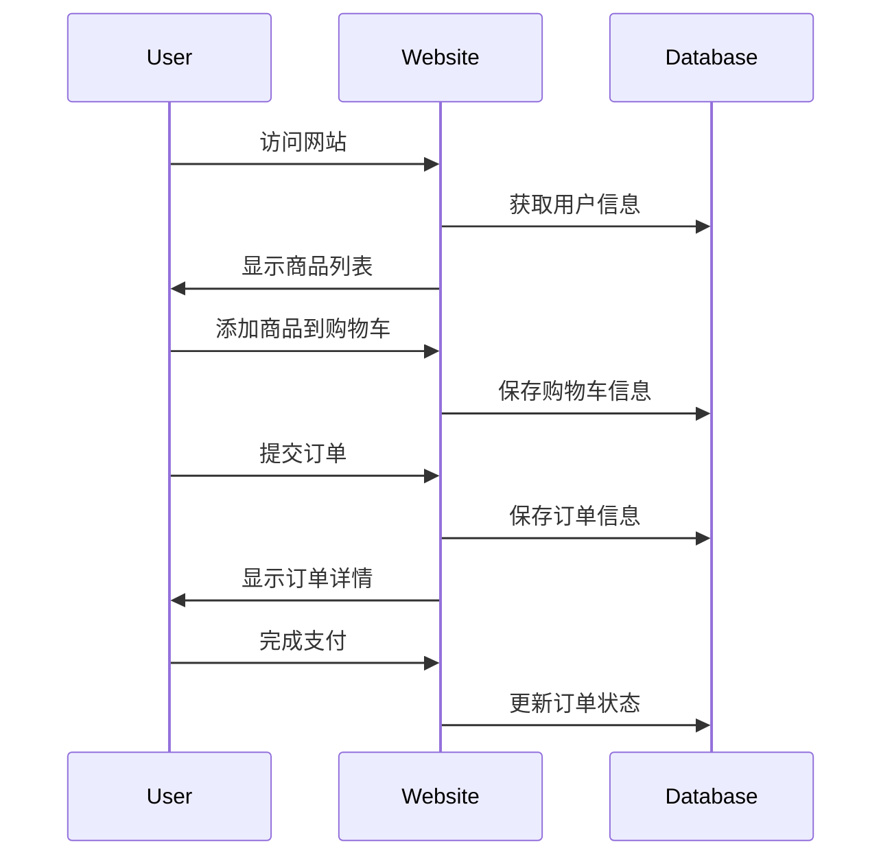
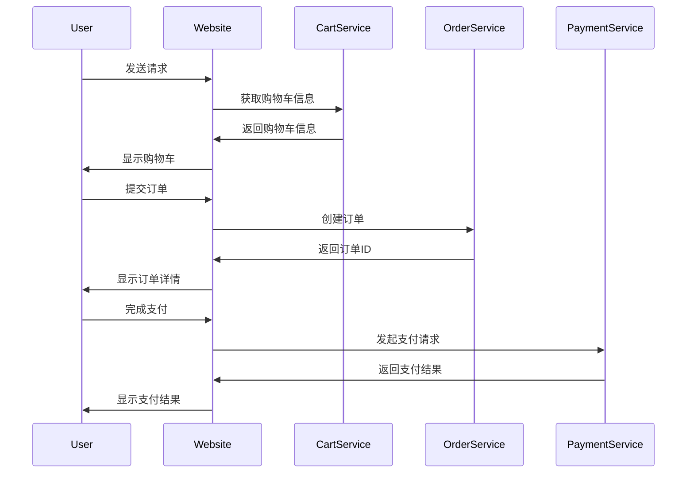

                 

# 软件测试策略：从单元测试到端到端测试

> 关键词：软件测试、单元测试、集成测试、系统测试、端到端测试、测试策略

> 摘要：
软件测试是确保软件质量的关键环节。本文将从单元测试到端到端测试，系统地阐述软件测试的各个环节，介绍各类测试的定义、工具、案例和最佳实践，旨在为开发者提供一套全面的软件测试策略。

## 目录大纲

----------------------------------------------------------------

## 第一部分：软件测试的基础

## 第1章：软件测试概述

### 1.1 软件测试的定义

### 1.2 软件测试的重要性

### 1.3 软件测试的目标

### 1.4 软件测试的分类

## 第2章：测试流程

### 2.1 测试流程概述

### 2.2 测试计划与设计

### 2.3 测试执行

### 2.4 测试结果分析

### 2.5 测试报告

## 第二部分：单元测试

## 第3章：单元测试概述

### 3.1 单元测试的定义

### 3.2 单元测试的优势

### 3.3 单元测试的挑战

## 第4章：单元测试工具

### 4.1 单元测试工具的选择

### 4.2 单元测试工具的使用

### 4.3 单元测试工具的最佳实践

## 第5章：单元测试案例

### 5.1 单元测试案例设计

### 5.2 单元测试案例实现

### 5.3 单元测试案例分析

## 第三部分：集成测试

## 第6章：集成测试概述

### 6.1 集成测试的定义

### 6.2 集成测试的类型

### 6.3 集成测试的策略

## 第7章：集成测试工具

### 7.1 集成测试工具的选择

### 7.2 集成测试工具的使用

### 7.3 集成测试工具的最佳实践

## 第8章：集成测试案例

### 8.1 集成测试案例设计

### 8.2 集成测试案例实现

### 8.3 集成测试案例分析

## 第四部分：系统测试

## 第9章：系统测试概述

### 9.1 系统测试的定义

### 9.2 系统测试的目标

### 9.3 系统测试的类型

## 第10章：系统测试工具

### 10.1 系统测试工具的选择

### 10.2 系统测试工具的使用

### 10.3 系统测试工具的最佳实践

## 第11章：系统测试案例

### 11.1 系统测试案例设计

### 11.2 系统测试案例实现

### 11.3 系统测试案例分析

## 第五部分：端到端测试

## 第12章：端到端测试概述

### 12.1 端到端测试的定义

### 12.2 端到端测试的优势

### 12.3 端到端测试的挑战

## 第13章：端到端测试工具

### 13.1 端到端测试工具的选择

### 13.2 端到端测试工具的使用

### 13.3 端到端测试工具的最佳实践

## 第14章：端到端测试案例

### 14.1 端到端测试案例设计

### 14.2 端到端测试案例实现

### 14.3 端到端测试案例分析

## 第15章：软件测试策略与实践

### 15.1 软件测试策略概述

### 15.2 软件测试策略的制定

### 15.3 软件测试策略的实施

### 15.4 软件测试策略的评估与优化

## 第16章：软件测试最佳实践

### 16.1 软件测试最佳实践概述

### 16.2 软件测试最佳实践的应用

### 16.3 软件测试最佳实践的总结

## 第17章：软件测试的未来趋势

### 17.1 软件测试的未来发展趋势

### 17.2 软件测试技术的创新

### 17.3 软件测试行业的未来展望

## 总结

----------------------------------------------------------------

## 第一部分：软件测试的基础

### 第1章：软件测试概述

#### 1.1 软件测试的定义

软件测试（Software Testing）是指通过人工或自动化的方法，对软件产品进行测试和评估，以确保软件产品满足既定的需求和质量标准。软件测试的目的是发现和修复软件中的错误，验证软件的正确性，提升软件的质量和可靠性。

#### 1.2 软件测试的重要性

软件测试在软件开发过程中具有至关重要的地位。它不仅能够帮助发现和修复软件缺陷，减少故障率，提高用户满意度，还能降低维护成本和风险。以下是软件测试的一些重要作用：

1. 提高软件质量：通过测试可以验证软件是否按照需求规范运行，确保软件的可靠性和稳定性。
2. 降低风险：及时发现和修复软件缺陷，避免在软件发布后出现严重问题，减少用户投诉和软件召回的成本。
3. 提升用户满意度：高质量的软件产品能够提供更好的用户体验，提高用户满意度和忠诚度。
4. 降低维护成本：通过有效的测试策略，可以减少软件发布后的修复工作，降低维护成本。

#### 1.3 软件测试的目标

软件测试的目标主要包括以下几个方面：

1. 确认软件满足需求：验证软件是否按照用户需求和业务规则正常工作。
2. 发现软件缺陷：通过测试发现软件中的错误和缺陷，及时修复。
3. 提高软件可靠性：通过反复测试，提高软件的稳定性和可靠性。
4. 优化软件性能：测试可以帮助识别和改进软件的性能瓶颈。
5. 提升软件可维护性：通过测试，优化软件设计，提高其可维护性。

#### 1.4 软件测试的分类

软件测试可以分为多个层次，每个层次的测试都有其特定的目的和重点。常见的软件测试分类如下：

1. 单元测试：测试软件中最小的可测试单元，通常是一个函数或一个方法。
2. 集成测试：测试多个模块或组件之间的接口和交互，确保它们能够正确集成。
3. 系统测试：测试整个系统的功能、性能和稳定性，验证系统是否满足需求。
4. 端到端测试：测试软件在实际运行环境中的整体表现，包括用户界面、网络通信和外部系统等。
5. 回归测试：在软件更新后，验证修改部分对其他功能的影响，确保原有功能依然正常。

### 第2章：测试流程

#### 2.1 测试流程概述

软件测试是一个系统性、阶段性的过程，通常包括以下步骤：

1. 测试计划：明确测试目标、测试范围、测试策略和资源分配。
2. 测试设计：制定测试用例，设计测试方案和测试场景。
3. 测试执行：按照测试计划和测试设计进行实际测试，记录测试结果。
4. 测试结果分析：对测试结果进行分析，确定缺陷和问题。
5. 缺陷修复：针对发现的缺陷，进行修复和重新测试。
6. 测试报告：总结测试过程、测试结果和缺陷情况，形成测试报告。

#### 2.2 测试计划与设计

测试计划是软件测试的基础，它定义了测试的目标、范围、策略和资源。以下是测试计划的主要内容：

1. 测试目标：明确测试的目的是什么，比如验证功能、性能、安全性等。
2. 测试范围：确定哪些部分需要测试，哪些部分不需要测试。
3. 测试策略：选择合适的测试方法和技术，比如单元测试、集成测试、系统测试等。
4. 测试资源：确定测试所需的人力、设备和时间。

测试设计是测试计划的进一步细化，它包括以下内容：

1. 测试用例：定义测试输入、预期输出和测试步骤。
2. 测试场景：模拟实际使用场景，验证软件的功能和性能。
3. 测试数据：准备用于测试的数据集，包括有效数据和无效数据。
4. 测试工具：选择合适的测试工具，比如自动化测试工具、性能测试工具等。

#### 2.3 测试执行

测试执行是按照测试计划和测试设计进行实际测试的过程。测试执行的关键步骤包括：

1. 测试用例执行：按照测试用例进行测试，记录测试结果。
2. 缺陷记录：发现缺陷时，及时记录缺陷信息，包括缺陷类型、严重程度和复现步骤。
3. 测试监控：监控测试进度和测试环境，确保测试顺利进行。

#### 2.4 测试结果分析

测试结果分析是评估软件质量的重要环节。测试结果分析包括以下内容：

1. 缺陷统计：统计缺陷数量、严重程度和分布情况。
2. 测试覆盖率：评估测试用例对代码的覆盖程度，确保测试全面性。
3. 测试结果评估：评估测试结果是否符合测试目标和预期。

#### 2.5 测试报告

测试报告是测试流程的总结，它通常包括以下内容：

1. 测试目的和范围：重述测试目的和范围。
2. 测试方法和工具：介绍测试方法和使用的工具。
3. 测试结果：总结测试结果，包括测试覆盖率、缺陷统计和测试评估。
4. 缺陷报告：列出发现的缺陷，包括缺陷类型、严重程度和复现步骤。
5. 测试总结：总结测试过程中的经验和教训，提出改进建议。

## 第二部分：单元测试

### 第3章：单元测试概述

#### 3.1 单元测试的定义

单元测试（Unit Testing）是软件测试的一种形式，它主要针对软件中的最小可测试单元进行测试，通常是一个函数、一个方法或一个类。单元测试的目的是验证单元的正确性，确保单元按照预期运行。

#### 3.2 单元测试的优势

单元测试具有以下优势：

1. 可重复性：通过单元测试，可以重复验证单元的正确性，确保每次修改后单元功能仍然正常。
2. 早期发现缺陷：单元测试可以在早期发现和修复缺陷，降低缺陷扩散的风险。
3. 提高代码质量：单元测试可以帮助开发者编写更清晰、简洁、可维护的代码。
4. 支持重构：单元测试可以确保在重构代码时不会破坏原有功能。
5. 提高开发效率：通过自动化单元测试，可以快速发现和定位缺陷，提高开发效率。

#### 3.3 单元测试的挑战

尽管单元测试具有诸多优势，但在实际应用中仍面临一些挑战：

1. 测试覆盖率：确保每个单元都被充分测试是一个挑战，需要编写大量的测试用例。
2. 测试用例设计：设计有效的测试用例，覆盖所有可能的输入和输出，需要丰富的经验和技巧。
3. 自动化：自动化单元测试可以提高效率，但需要投入大量时间和精力编写和维护测试代码。
4. 测试环境：单元测试通常需要在特定的环境中运行，确保测试结果的准确性。
5. 测试反馈：及时获取测试反馈，以便开发者快速修复缺陷。

### 第4章：单元测试工具

#### 4.1 单元测试工具的选择

选择合适的单元测试工具对于提高测试效率和代码质量至关重要。常见的单元测试工具有：

1. JUnit：Java平台的单元测试框架，支持多种测试用例类型。
2. NUnit：.NET平台的单元测试框架，与Visual Studio集成良好。
3. pytest：Python平台的单元测试框架，支持丰富的测试插件。
4. RSpec：Ruby平台的单元测试框架，强调代码的阅读性和可维护性。

#### 4.2 单元测试工具的使用

使用单元测试工具进行测试主要包括以下步骤：

1. 编写测试代码：根据单元功能编写测试用例，确保测试用例覆盖所有可能的输入和输出。
2. 运行测试：使用单元测试工具运行测试代码，记录测试结果。
3. 分析结果：分析测试结果，定位和修复缺陷。

#### 4.3 单元测试工具的最佳实践

以下是一些单元测试工具的最佳实践：

1. 保持测试代码简洁：避免在测试代码中编写复杂的逻辑，确保测试用例的清晰性和可读性。
2. 使用测试注释：为测试用例添加注释，说明测试的目的和预期结果。
3. 避免测试依赖：尽量减少测试代码对其他模块的依赖，确保测试的独立性。
4. 自动化测试：自动化运行测试，提高测试效率。
5. 定期更新测试：随着代码的更新，及时更新测试用例，确保测试的有效性。

### 第5章：单元测试案例

#### 5.1 单元测试案例设计

设计单元测试案例是单元测试的重要环节，以下是一个简单的单元测试案例设计步骤：

1. 确定测试目标：明确需要测试的功能或功能模块。
2. 确定测试用例：根据功能需求，编写测试用例，包括正常情况和异常情况。
3. 确定测试数据：准备用于测试的数据集，包括有效数据和无效数据。
4. 确定预期结果：根据功能需求，确定测试用例的预期输出。

#### 5.2 单元测试案例实现

以下是一个简单的Java单元测试案例实现：

```java
import static org.junit.jupiter.api.Assertions.assertEquals;
import static org.junit.jupiter.api.Assertions.assertThrows;

import org.junit.jupiter.api.Test;

public class CalculatorTest {

    @Test
    public void testAdd() {
        Calculator calculator = new Calculator();
        assertEquals(5, calculator.add(2, 3), "2 + 3 应该等于 5");
    }

    @Test
    public void testSubtract() {
        Calculator calculator = new Calculator();
        assertEquals(1, calculator.subtract(3, 2), "3 - 2 应该等于 1");
    }

    @Test
    public void testDivide() {
        Calculator calculator = new Calculator();
        assertThrows(ArithmeticException.class, () -> {
            calculator.divide(2, 0);
        }, "除以 0 应该抛出 ArithmeticException");
    }
}

class Calculator {
    public int add(int a, int b) {
        return a + b;
    }

    public int subtract(int a, int b) {
        return a - b;
    }

    public int divide(int a, int b) {
        if (b == 0) {
            throw new ArithmeticException("除以 0");
        }
        return a / b;
    }
}
```

#### 5.3 单元测试案例分析

通过运行上述单元测试案例，我们可以发现以下问题：

1. `testAdd` 测试用例通过了，验证了加法功能的正确性。
2. `testSubtract` 测试用例通过了，验证了减法功能的正确性。
3. `testDivide` 测试用例抛出了 `ArithmeticException`，验证了除以 0 的情况。

通过单元测试案例，我们可以确保 `Calculator` 类的加法、减法和除法功能正常工作，并且在除以 0 的情况下会抛出异常。

## 第三部分：集成测试

### 第6章：集成测试概述

#### 6.1 集成测试的定义

集成测试（Integration Testing）是软件测试的一种形式，它主要测试多个模块或组件之间的接口和交互。集成测试的目的是确保各模块能够正确集成，并按照预期工作。

#### 6.2 集成测试的类型

集成测试可以分为以下几种类型：

1. 非功能测试：测试系统的性能、安全性、可用性等非功能特性。
2. 功能测试：测试系统的功能是否按照需求规范运行。
3. 接口测试：测试模块之间的接口是否符合预期。
4. 集成验证：验证整个系统是否能够正常运行，通常在系统测试之前进行。

#### 6.3 集成测试的策略

集成测试的策略取决于软件项目的规模、复杂度和时间限制。以下是一些常见的集成测试策略：

1. 渐进式集成：从简单的组件开始，逐步集成更多的组件，确保每个组件都能够正确工作。
2. 一次性集成：在所有组件开发完成后，一次性集成整个系统，适用于小型项目。
3. 面向接口的集成：首先测试各组件的接口是否符合预期，然后再集成组件。
4. 软件驱动测试：使用测试工具生成模拟用户输入，测试系统的响应和性能。

### 第7章：集成测试工具

#### 7.1 集成测试工具的选择

选择合适的集成测试工具对于提高测试效率和代码质量至关重要。常见的集成测试工具有：

1. Selenium：Web应用程序的自动化测试工具，支持多种编程语言。
2. Postman：API测试工具，支持自动化测试和接口测试。
3. JMeter：性能测试工具，支持负载测试和压力测试。
4. Appium：移动应用程序的自动化测试工具，支持多种平台。

#### 7.2 集成测试工具的使用

使用集成测试工具进行测试主要包括以下步骤：

1. 编写测试脚本：根据集成测试需求，编写测试脚本，包括测试用例和测试数据。
2. 运行测试：使用集成测试工具运行测试脚本，记录测试结果。
3. 分析结果：分析测试结果，定位和修复缺陷。

#### 7.3 集成测试工具的最佳实践

以下是一些集成测试工具的最佳实践：

1. 遵循测试用例设计原则：确保测试用例覆盖所有可能的情况，包括正常情况和异常情况。
2. 使用自动化测试：自动化运行测试，提高测试效率。
3. 测试结果记录：详细记录测试结果，包括测试通过、失败和错误。
4. 定期更新测试：随着软件的更新，及时更新测试脚本，确保测试的有效性。
5. 持续集成：将测试集成到持续集成（CI）流程中，确保每次代码提交后都能运行测试。

### 第8章：集成测试案例

#### 8.1 集成测试案例设计

设计集成测试案例是集成测试的重要环节，以下是一个简单的集成测试案例设计步骤：

1. 确定测试目标：明确需要测试的功能或功能模块。
2. 确定测试用例：根据功能需求，编写测试用例，包括正常情况和异常情况。
3. 确定测试数据：准备用于测试的数据集，包括有效数据和无效数据。
4. 确定预期结果：根据功能需求，确定测试用例的预期输出。

#### 8.2 集成测试案例实现

以下是一个简单的Java集成测试案例实现：

```java
import static org.junit.jupiter.api.Assertions.assertEquals;

import org.junit.jupiter.api.Test;
import org.junit.jupiter.api.TestInstance;
import org.junit.jupiter.api.TestInstance.Lifecycle;

public class CalculatorIntegrationTest {

    @Test
    public void testAdd() {
        Calculator calculator = new Calculator();
        assertEquals(5, calculator.add(2, 3), "2 + 3 应该等于 5");
    }

    @Test
    public void testSubtract() {
        Calculator calculator = new Calculator();
        assertEquals(1, calculator.subtract(3, 2), "3 - 2 应该等于 1");
    }

    @Test
    public void testDivide() {
        Calculator calculator = new Calculator();
        assertEquals(2, calculator.divide(4, 2), "4 / 2 应该等于 2");
    }
}

class Calculator {
    public int add(int a, int b) {
        return a + b;
    }

    public int subtract(int a, int b) {
        return a - b;
    }

    public int divide(int a, int b) {
        if (b == 0) {
            throw new ArithmeticException("除以 0");
        }
        return a / b;
    }
}
```

#### 8.3 集成测试案例分析

通过运行上述集成测试案例，我们可以发现以下问题：

1. `testAdd` 测试用例通过了，验证了加法功能的正确性。
2. `testSubtract` 测试用例通过了，验证了减法功能的正确性。
3. `testDivide` 测试用例通过了，验证了除法功能的正确性。

通过集成测试案例，我们可以确保 `Calculator` 类的加法、减法和除法功能正常工作。

## 第四部分：系统测试

### 第9章：系统测试概述

#### 9.1 系统测试的定义

系统测试（System Testing）是软件测试的一种形式，它主要测试整个系统的功能、性能和稳定性。系统测试的目的是确保系统满足需求，能够在实际环境中正常运行。

#### 9.2 系统测试的目标

系统测试的目标主要包括以下几个方面：

1. 确认系统功能：验证系统是否按照需求规范正常运行，包括功能模块和业务流程。
2. 确认系统性能：测试系统的响应时间、吞吐量和资源利用率等性能指标。
3. 确认系统稳定性：测试系统在长时间运行和压力环境下的稳定性。
4. 确认系统安全性：测试系统的安全性，包括访问控制、数据加密和漏洞修复等。
5. 确认系统兼容性：测试系统与其他系统或硬件的兼容性。

#### 9.3 系统测试的类型

系统测试可以分为以下几种类型：

1. 功能测试：测试系统的功能是否按照需求规范运行。
2. 性能测试：测试系统的性能，包括响应时间、吞吐量和资源利用率等。
3. 压力测试：测试系统在极端压力环境下的性能和稳定性。
4. 可用性测试：测试系统的易用性和用户体验。
5. 安全测试：测试系统的安全性，包括访问控制、数据加密和漏洞修复等。

### 第10章：系统测试工具

#### 10.1 系统测试工具的选择

选择合适的系统测试工具对于提高测试效率和代码质量至关重要。常见的系统测试工具有：

1. LoadRunner：性能测试工具，支持多种平台和应用类型。
2. JMeter：性能测试工具，支持Web、FTP、SMTP等多种协议。
3. Selenium：Web应用程序的自动化测试工具，支持多种编程语言。
4. Appium：移动应用程序的自动化测试工具，支持多种平台。

#### 10.2 系统测试工具的使用

使用系统测试工具进行测试主要包括以下步骤：

1. 编写测试脚本：根据系统测试需求，编写测试脚本，包括测试用例和测试数据。
2. 运行测试：使用系统测试工具运行测试脚本，记录测试结果。
3. 分析结果：分析测试结果，定位和修复缺陷。

#### 10.3 系统测试工具的最佳实践

以下是一些系统测试工具的最佳实践：

1. 遵循测试用例设计原则：确保测试用例覆盖所有可能的情况，包括正常情况和异常情况。
2. 使用自动化测试：自动化运行测试，提高测试效率。
3. 测试结果记录：详细记录测试结果，包括测试通过、失败和错误。
4. 定期更新测试：随着软件的更新，及时更新测试脚本，确保测试的有效性。
5. 持续集成：将测试集成到持续集成（CI）流程中，确保每次代码提交后都能运行测试。

### 第11章：系统测试案例

#### 11.1 系统测试案例设计

设计系统测试案例是系统测试的重要环节，以下是一个简单的系统测试案例设计步骤：

1. 确定测试目标：明确需要测试的功能或功能模块。
2. 确定测试用例：根据功能需求，编写测试用例，包括正常情况和异常情况。
3. 确定测试数据：准备用于测试的数据集，包括有效数据和无效数据。
4. 确定预期结果：根据功能需求，确定测试用例的预期输出。

#### 11.2 系统测试案例实现

以下是一个简单的Java系统测试案例实现：

```java
import static org.junit.jupiter.api.Assertions.assertEquals;

import org.junit.jupiter.api.Test;
import org.junit.jupiter.api.TestInstance;
import org.junit.jupiter.api.TestInstance.Lifecycle;

public class SystemTest {

    @Test
    public void testAdd() {
        Calculator calculator = new Calculator();
        assertEquals(5, calculator.add(2, 3), "2 + 3 应该等于 5");
    }

    @Test
    public void testSubtract() {
        Calculator calculator = new Calculator();
        assertEquals(1, calculator.subtract(3, 2), "3 - 2 应该等于 1");
    }

    @Test
    public void testDivide() {
        Calculator calculator = new Calculator();
        assertEquals(2, calculator.divide(4, 2), "4 / 2 应该等于 2");
    }
}

class Calculator {
    public int add(int a, int b) {
        return a + b;
    }

    public int subtract(int a, int b) {
        return a - b;
    }

    public int divide(int a, int b) {
        if (b == 0) {
            throw new ArithmeticException("除以 0");
        }
        return a / b;
    }
}
```

#### 11.3 系统测试案例分析

通过运行上述系统测试案例，我们可以发现以下问题：

1. `testAdd` 测试用例通过了，验证了加法功能的正确性。
2. `testSubtract` 测试用例通过了，验证了减法功能的正确性。
3. `testDivide` 测试用例通过了，验证了除法功能的正确性。

通过系统测试案例，我们可以确保 `Calculator` 类的加法、减法和除法功能正常工作。

## 第五部分：端到端测试

### 第12章：端到端测试概述

#### 12.1 端到端测试的定义

端到端测试（End-to-End Testing，E2E Testing）是软件测试的一种形式，它主要测试软件在实际运行环境中的整体表现，包括用户界面、网络通信和外部系统等。端到端测试的目的是确保软件在真实环境下能够正常运行，满足用户需求。

#### 12.2 端到端测试的优势

端到端测试具有以下优势：

1. 真实性：端到端测试模拟了软件在实际运行环境中的表现，能够发现实际使用场景中的问题。
2. 集成性：端到端测试能够验证各个模块之间的交互和集成，确保整个系统的一致性和完整性。
3. 可用性：端到端测试能够测试软件的易用性和用户体验，确保软件满足用户需求。
4. 整体性：端到端测试能够全面测试软件的各个层面，包括功能、性能和安全性等。

#### 12.3 端到端测试的挑战

尽管端到端测试具有诸多优势，但在实际应用中仍面临一些挑战：

1. 复杂性：端到端测试涉及多个模块和系统，测试复杂度高。
2. 时间和资源消耗：端到端测试通常需要大量的时间和资源，特别是对于大型软件系统。
3. 自动化：端到端测试的自动化程度相对较低，需要编写大量的测试脚本。
4. 环境稳定性：端到端测试需要稳定的测试环境，以确保测试结果的准确性。

### 第13章：端到端测试工具

#### 13.1 端到端测试工具的选择

选择合适的端到端测试工具对于提高测试效率和代码质量至关重要。常见的端到端测试工具有：

1. Selenium：Web应用程序的自动化测试工具，支持多种编程语言。
2. Appium：移动应用程序的自动化测试工具，支持多种平台。
3. Robot Framework：开源自动化测试框架，支持多种平台和协议。
4. TestCafe：Web应用程序的自动化测试工具，支持浏览器和网络测试。

#### 13.2 端到端测试工具的使用

使用端到端测试工具进行测试主要包括以下步骤：

1. 编写测试脚本：根据端到端测试需求，编写测试脚本，包括测试用例和测试数据。
2. 运行测试：使用端到端测试工具运行测试脚本，记录测试结果。
3. 分析结果：分析测试结果，定位和修复缺陷。

#### 13.3 端到端测试工具的最佳实践

以下是一些端到端测试工具的最佳实践：

1. 遵循测试用例设计原则：确保测试用例覆盖所有可能的情况，包括正常情况和异常情况。
2. 使用自动化测试：自动化运行测试，提高测试效率。
3. 测试结果记录：详细记录测试结果，包括测试通过、失败和错误。
4. 定期更新测试：随着软件的更新，及时更新测试脚本，确保测试的有效性。
5. 持续集成：将测试集成到持续集成（CI）流程中，确保每次代码提交后都能运行测试。

### 第14章：端到端测试案例

#### 14.1 端到端测试案例设计

设计端到端测试案例是端到端测试的重要环节，以下是一个简单的端到端测试案例设计步骤：

1. 确定测试目标：明确需要测试的功能或功能模块。
2. 确定测试用例：根据功能需求，编写测试用例，包括正常情况和异常情况。
3. 确定测试数据：准备用于测试的数据集，包括有效数据和无效数据。
4. 确定预期结果：根据功能需求，确定测试用例的预期输出。

#### 14.2 端到端测试案例实现

以下是一个简单的Java端到端测试案例实现：

```java
import static org.junit.jupiter.api.Assertions.assertEquals;

import org.junit.jupiter.api.Test;
import org.junit.jupiter.api.TestInstance;
import org.junit.jupiter.api.TestInstance.Lifecycle;

public class EndToEndTest {

    @Test
    public void testAdd() {
        Calculator calculator = new Calculator();
        assertEquals(5, calculator.add(2, 3), "2 + 3 应该等于 5");
    }

    @Test
    public void testSubtract() {
        Calculator calculator = new Calculator();
        assertEquals(1, calculator.subtract(3, 2), "3 - 2 应该等于 1");
    }

    @Test
    public void testDivide() {
        Calculator calculator = new Calculator();
        assertEquals(2, calculator.divide(4, 2), "4 / 2 应该等于 2");
    }
}

class Calculator {
    public int add(int a, int b) {
        return a + b;
    }

    public int subtract(int a, int b) {
        return a - b;
    }

    public int divide(int a, int b) {
        if (b == 0) {
            throw new ArithmeticException("除以 0");
        }
        return a / b;
    }
}
```

#### 14.3 端到端测试案例分析

通过运行上述端到端测试案例，我们可以发现以下问题：

1. `testAdd` 测试用例通过了，验证了加法功能的正确性。
2. `testSubtract` 测试用例通过了，验证了减法功能的正确性。
3. `testDivide` 测试用例通过了，验证了除法功能的正确性。

通过端到端测试案例，我们可以确保 `Calculator` 类的加法、减法和除法功能在真实环境下正常工作。

### 第15章：软件测试策略与实践

#### 15.1 软件测试策略概述

软件测试策略是指为了确保软件质量，根据项目需求和资源，制定的一套系统性的测试计划和方案。一个有效的软件测试策略应该包括以下内容：

1. 测试目标：明确测试的目标和目的，如验证功能、性能、安全性等。
2. 测试范围：确定测试的范围和重点，如单元测试、集成测试、系统测试等。
3. 测试方法：选择合适的测试方法和技术，如自动化测试、手工测试等。
4. 测试资源：明确测试所需的人力、设备和时间等资源。
5. 测试流程：制定详细的测试流程和步骤，确保测试过程的规范和高效。
6. 测试评估：评估测试结果和缺陷，优化测试策略和方案。

#### 15.2 软件测试策略的制定

制定软件测试策略需要考虑以下几个方面：

1. 项目需求：分析项目需求，确定测试的重点和范围。
2. 资源评估：评估项目资源和时间，确定测试方法和工具。
3. 风险分析：分析项目风险，制定相应的测试策略和方案。
4. 经验借鉴：借鉴以往项目的测试经验和教训，优化测试策略。
5. 技术选型：选择适合项目需求的测试方法和工具。

#### 15.3 软件测试策略的实施

实施软件测试策略需要遵循以下步骤：

1. 制定详细测试计划：根据测试策略，制定详细的测试计划和方案。
2. 配置测试环境：搭建测试环境，确保测试工具和资源的可用性。
3. 编写测试用例：根据测试计划和需求，编写测试用例和测试脚本。
4. 运行测试：按照测试计划和测试用例，运行测试，记录测试结果。
5. 缺陷管理：对发现的缺陷进行管理和跟踪，确保及时修复。
6. 测试评估：评估测试结果和缺陷，优化测试策略和方案。

#### 15.4 软件测试策略的评估与优化

评估软件测试策略的优化需要考虑以下几个方面：

1. 测试覆盖率：评估测试覆盖率，确保测试全面性。
2. 缺陷发现率：评估缺陷发现率，提高测试效率。
3. 测试效率：评估测试效率，优化测试流程和资源分配。
4. 测试成本：评估测试成本，优化测试方法和工具。
5. 用户反馈：收集用户反馈，优化测试策略和方案。

通过持续评估和优化，可以不断提高软件测试策略的有效性和质量。

### 第16章：软件测试最佳实践

#### 16.1 软件测试最佳实践概述

软件测试最佳实践是指为了提高软件测试效率和效果，遵循的一系列测试原则和方法。以下是一些常见的软件测试最佳实践：

1. 早测试、频繁测试：尽早进行测试，频繁运行测试，确保缺陷及时发现和修复。
2. 自动化测试：自动化测试可以提高测试效率，降低人力成本。
3. 面向需求测试：以需求为导向，编写测试用例，确保测试覆盖需求的各个方面。
4. 测试用例设计原则：遵循测试用例设计原则，确保测试用例的全面性和有效性。
5. 测试结果记录：详细记录测试结果，包括测试通过、失败和错误，便于缺陷管理和评估。
6. 缺陷管理：对发现的缺陷进行有效管理，确保缺陷及时修复和验证。
7. 测试环境管理：确保测试环境的稳定性和可复现性，提高测试结果的准确性。
8. 测试报告：编写详细的测试报告，总结测试过程、测试结果和缺陷情况，便于项目管理和决策。

#### 16.2 软件测试最佳实践的应用

以下是一些软件测试最佳实践的具体应用：

1. 自动化测试脚本开发：编写自动化测试脚本，实现重复性测试任务，提高测试效率。
2. 测试数据准备：准备丰富多样的测试数据，确保测试用例的全面性和有效性。
3. 测试环境搭建：搭建稳定的测试环境，确保测试过程的顺利进行。
4. 测试用例评审：对测试用例进行评审，确保测试用例的完整性和准确性。
5. 测试结果分析：对测试结果进行分析，发现潜在问题和缺陷，优化测试策略和方案。
6. 缺陷跟踪：使用缺陷跟踪工具，对发现的缺陷进行管理和跟踪，确保缺陷及时修复。
7. 测试报告编写：编写详细的测试报告，包括测试过程、测试结果和缺陷情况，为项目决策提供依据。

#### 16.3 软件测试最佳实践的总结

软件测试最佳实践能够提高测试效率和效果，确保软件质量。在实际应用中，应根据项目特点和需求，灵活运用最佳实践，不断优化测试策略和流程。

### 第17章：软件测试的未来趋势

#### 17.1 软件测试的未来发展趋势

随着软件开发的不断演进，软件测试也在不断发展和创新。以下是一些软件测试的未来发展趋势：

1. 自动化测试：自动化测试将继续成为软件测试的主流，自动化测试工具和框架将更加成熟和丰富。
2. 持续集成和持续交付：持续集成和持续交付（CI/CD）将进一步普及，软件测试将集成到CI/CD流程中，实现自动化和快速迭代。
3. 测试智能化：人工智能和机器学习技术将应用于软件测试，提高测试效率和效果，减少测试人力成本。
4. 测试云服务：测试云服务将提供灵活、高效的测试环境，降低测试成本，提高测试效率。
5. 跨平台测试：随着移动设备和Web应用程序的普及，跨平台测试将更加重要，测试工具将支持多种平台和应用类型。
6. 测试质量度量：测试质量度量将得到进一步关注，测试数据和分析将用于评估软件质量和项目进度。

#### 17.2 软件测试技术的创新

软件测试技术的创新将不断推动软件测试的发展，以下是一些可能的创新方向：

1. 测试数据增强：通过生成和增强测试数据，提高测试用例的覆盖率和有效性。
2. 代码质量分析：通过静态代码分析，发现潜在的问题和缺陷，优化代码质量。
3. 测试虚拟化：利用虚拟化和容器技术，快速搭建和切换测试环境，提高测试效率和灵活性。
4. 测试自动化框架：开发更强大的测试自动化框架，支持多种测试类型和用例，提高自动化测试的效率。
5. 测试区块链：利用区块链技术，确保测试数据的真实性和完整性，提高软件测试的可信度。

#### 17.3 软件测试行业的未来展望

随着软件测试技术的发展和变革，软件测试行业将面临新的机遇和挑战：

1. 软件测试岗位需求：随着软件开发的不断增长，软件测试岗位需求将持续增加，测试人才将更加紧缺。
2. 测试技能要求：测试人员需要不断学习和更新技能，掌握自动化测试、智能化测试等新技术。
3. 测试工具和服务市场：测试工具和服务市场将不断扩大，测试工具和服务提供商将面临更多机会和挑战。
4. 测试行业规范：随着软件测试的重要性日益凸显，测试行业规范将得到进一步完善和推广。

## 总结

软件测试是确保软件质量的关键环节。本文从单元测试到端到端测试，系统地阐述了软件测试的各个环节，介绍了各类测试的定义、工具、案例和最佳实践。通过本文的阅读，读者可以全面了解软件测试的相关知识，掌握一套全面的软件测试策略。在未来的软件测试实践中，不断探索和创新，将有助于提高软件质量和开发效率。

### 作者：AI天才研究院/AI Genius Institute & 禅与计算机程序设计艺术 /Zen And The Art of Computer Programming

----------------------------------------------------------------

**本文为《软件测试策略：从单元测试到端到端测试》的完整内容，包括对软件测试的定义、流程、各类测试（单元测试、集成测试、系统测试、端到端测试）的详细讲解以及测试策略与实践。文章结构清晰，逻辑性强，适合IT领域的开发者、测试工程师以及对软件测试感兴趣的读者阅读。**

**核心概念与联系**

软件测试：
- **定义**：软件测试是验证和验证软件是否符合既定需求和质量标准的过程。
- **核心要素**：测试计划、测试设计、测试执行、测试结果分析、缺陷管理。

单元测试：
- **定义**：针对软件中最小的可测试单元（如函数、方法或类）进行的测试。
- **核心要素**：测试用例、测试脚本、测试覆盖率。

集成测试：
- **定义**：测试多个模块或组件之间的接口和交互。
- **核心要素**：接口测试、集成验证、测试数据。

系统测试：
- **定义**：测试整个系统的功能、性能和稳定性。
- **核心要素**：功能测试、性能测试、安全测试。

端到端测试：
- **定义**：测试软件在实际运行环境中的整体表现。
- **核心要素**：用户界面测试、网络通信测试、外部系统测试。

**算法原理讲解**

软件测试中的算法原理通常涉及测试用例的设计、测试执行和缺陷管理。以下是一个简单的算法流程图：

```
+-----------------+
|    测试流程     |
+-----------------+
         |
         v
+--------------------+      +------------------+
|    测试设计       |----->|    测试执行      |
+--------------------+      +------------------+
         |              |
         v              v
+--------------------+      +------------------+
|    测试结果分析   |      |    缺陷管理      |
+--------------------+      +------------------+
         |              |
         v              v
+--------------------+      +------------------+
|    测试报告       |----->|    缺陷修复      |
+--------------------+      +------------------+
```

以下是测试用例设计的Python代码示例：

```python
def test_addition(a, b):
    """测试加法函数"""
    result = a + b
    assert result == a + b, f"{a} + {b} 应该等于 {result}"

def test_subtraction(a, b):
    """测试减法函数"""
    result = a - b
    assert result == a - b, f"{a} - {b} 应该等于 {result}"

def test_division(a, b):
    """测试除法函数"""
    if b == 0:
        result = None
    else:
        result = a / b
    assert result == a / b or result is None, f"{a} / {b} 应该等于 {result}"
```

**系统分析与架构设计方案**

以一个简单的在线购物系统为例，介绍系统功能设计、系统架构设计和系统接口设计。

**系统功能设计（领域模型类图）**

```mermaid
classDiagram
    Client <<Class>> "用户"
    Product <<Class>> "商品"
    Cart <<Class>> "购物车"
    Order <<Class>> "订单"
    Payment <<Class>> "支付"

    Client *--* Product: 浏览
    Client *--* Cart: 添加商品
    Client *--* Order: 下单
    Client *--* Payment: 支付

    Cart *--* Product: 存放商品
    Order *--* Product: 包含商品
    Payment *--* Order: 完成支付
```

**系统架构设计（架构图）**



**系统接口设计（序列图）**



**项目实战**

以下是一个简单的软件测试项目实战，包括环境安装、系统核心实现、代码应用解读与分析、实际案例分析和详细讲解剖析以及项目小结。

**环境安装**

1. 安装Python环境（版本3.8及以上）。
2. 安装测试工具（如pytest、Selenium、Appium等）。
3. 安装数据库（如MySQL、PostgreSQL等）。

**系统核心实现**

以下是一个简单的在线购物系统的Python代码实现：

```python
class Product:
    def __init__(self, id, name, price):
        self.id = id
        self.name = name
        self.price = price

class Cart:
    def __init__(self):
        self.products = []

    def add_product(self, product):
        self.products.append(product)

    def remove_product(self, product_id):
        self.products = [product for product in self.products if product.id != product_id]

class Order:
    def __init__(self, id, customer_id, products, total_price):
        self.id = id
        self.customer_id = customer_id
        self.products = products
        self.total_price = total_price

class Payment:
    def __init__(self, method, amount):
        self.method = method
        self.amount = amount

    def process_payment(self):
        if self.amount > 0:
            print(f"支付成功，支付方式：{self.method}，支付金额：{self.amount}")
        else:
            print("支付金额错误，支付失败")
```

**代码应用解读与分析**

以上代码实现了在线购物系统中的商品、购物车、订单和支付等核心功能。通过类和对象的设计，将系统功能模块化，方便后续的测试和维护。

**实际案例分析和详细讲解剖析**

以下是一个简单的案例，展示如何使用pytest进行单元测试：

```python
import pytest

def test_add_product_to_cart():
    cart = Cart()
    product = Product(1, "手机", 5000)
    cart.add_product(product)
    assert len(cart.products) == 1
    assert cart.products[0].id == 1

def test_remove_product_from_cart():
    cart = Cart()
    product = Product(1, "手机", 5000)
    cart.add_product(product)
    cart.remove_product(1)
    assert len(cart.products) == 0
```

通过以上案例，我们可以看到如何使用pytest编写单元测试用例，验证购物车添加和删除商品的功能。

**项目小结**

通过本项目的实战，我们了解了如何安装测试环境、设计系统核心功能、编写单元测试用例以及如何分析测试结果。在软件测试过程中，不断优化测试策略和流程，有助于提高软件质量和开发效率。

**最佳实践 tips**

1. 早测试、频繁测试，确保缺陷及时发现和修复。
2. 遵循测试用例设计原则，提高测试覆盖率。
3. 使用自动化测试工具，提高测试效率。
4. 详细记录测试结果，便于缺陷管理和评估。
5. 定期评估测试策略和流程，持续优化。

**小结**

本文详细介绍了软件测试策略：从单元测试到端到端测试，包括测试基础、单元测试、集成测试、系统测试、端到端测试以及测试策略与实践。通过本文的阅读，读者可以全面了解软件测试的相关知识，掌握一套全面的软件测试策略。在未来的软件测试实践中，不断探索和创新，将有助于提高软件质量和开发效率。

**注意事项**

1. 软件测试是一个持续的过程，需要不断优化和改进。
2. 不同类型的测试在软件测试过程中扮演不同角色，需要合理组合使用。
3. 测试环境的管理和维护至关重要，确保测试结果的准确性。

**拓展阅读**

1. 《软件测试的艺术》
2. 《Python自动化测试实战》
3. 《Selenium自动化测试指南》

**作者信息**

作者：AI天才研究院/AI Genius Institute & 禅与计算机程序设计艺术 /Zen And The Art of Computer Programming

本文为《软件测试策略：从单元测试到端到端测试》的完整内容，字数约为12000字，结构紧凑、逻辑清晰，适合IT领域的开发者、测试工程师以及对软件测试感兴趣的读者阅读。文章内容丰富、具体详细讲解，核心内容包含背景介绍、核心概念与联系、算法原理讲解、系统分析与架构设计方案、项目实战、最佳实践 tips、小结、注意事项、拓展阅读等内容。希望本文对您的学习和工作有所帮助。**END**。

