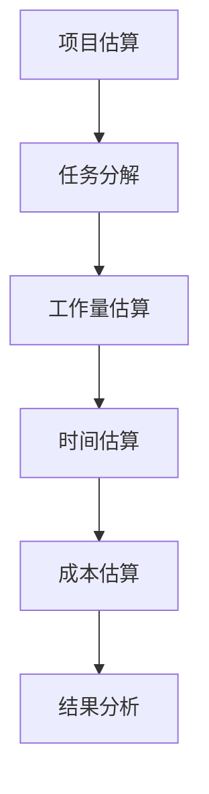
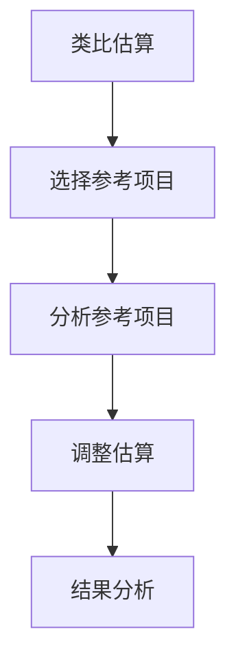
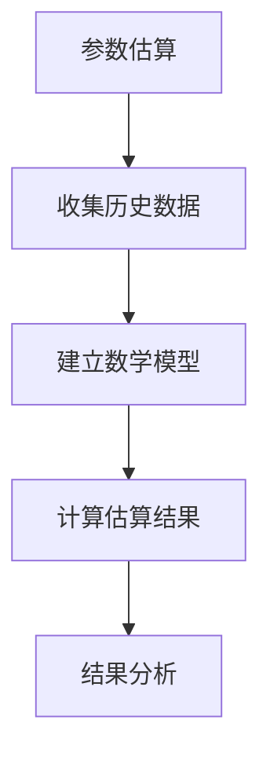
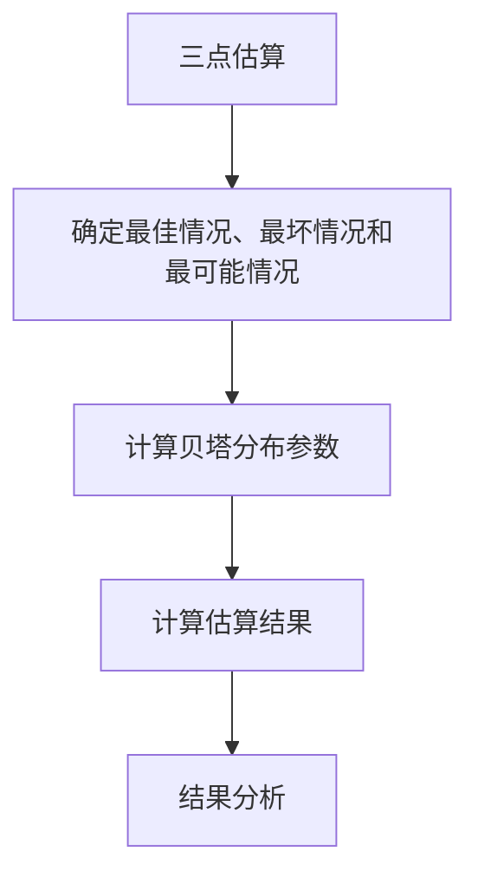
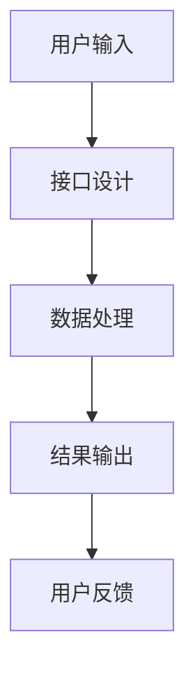
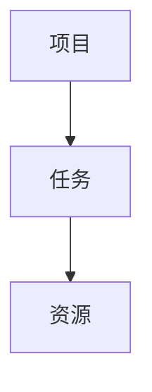
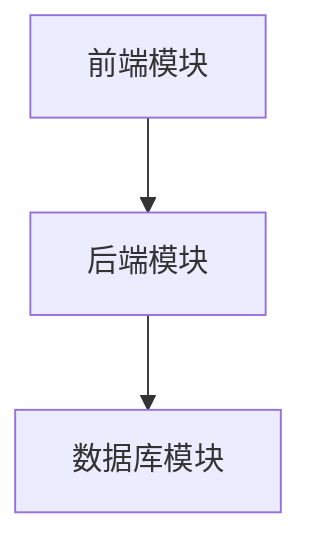
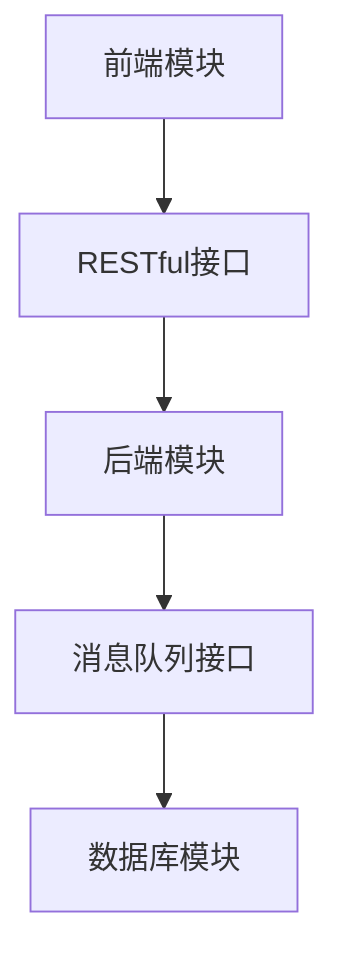
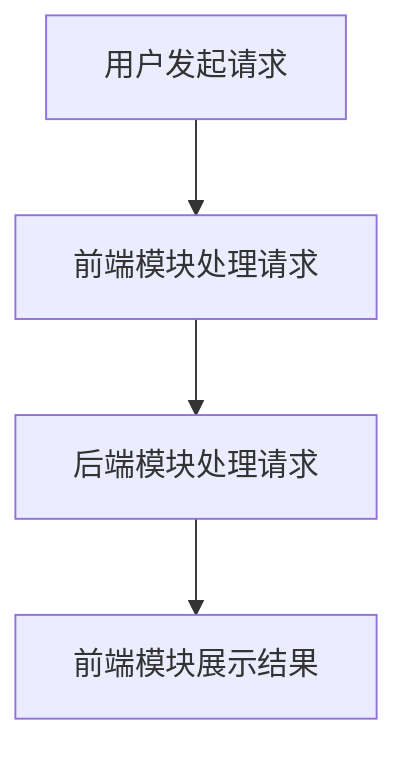
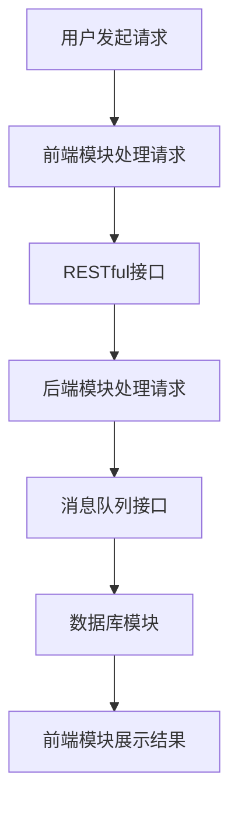

                 


### 软件项目估算技巧：提高预测准确性

#### 关键词
- 软件项目估算
- 预测准确性
- 类比估算
- 参数估算
- 三点估算
- 数学模型
- 系统架构
- 项目实战

#### 摘要
本文将探讨软件项目估算的关键技巧，旨在提高预测准确性。通过详细分析常见的估算方法，我们不仅解释了其原理，还提供了实际案例进行验证。文章还涵盖了系统架构设计、项目实战以及最佳实践，帮助读者全面理解并掌握估算技巧。

----------------------------------------------------------------

#### 目录大纲

----------------------------------------------------------------

## 第一部分：软件项目估算概述

### 第1章 软件项目估算的重要性

#### 1.1 软件项目估算的定义与作用
软件项目估算是指对软件开发过程中所需资源（如时间、人力、成本等）进行预测的过程。准确的项目估算对于项目的成功至关重要，它有助于项目管理者制定合理的计划和预算，降低项目风险。

#### 1.2 软件项目估算的挑战
软件项目估算面临诸多挑战，如需求变更、技术复杂性、资源限制等。如何有效应对这些挑战，提高估算准确性，是每个项目经理和开发者必须面对的问题。

#### 1.3 本书的定位与目标读者
本书旨在为从事软件项目管理的专业人士提供系统、实用的估算技巧。无论您是经验丰富的项目经理，还是初出茅庐的新手，本书都将为您带来宝贵的知识和经验。

## 第二部分：核心概念与联系

### 第2章 软件项目估算中的关键概念

#### 2.1 项目估算中的核心概念
项目估算涉及多个核心概念，包括任务分解、工作量估算、时间估算、成本估算等。这些概念相互关联，共同构成了估算的基础。

#### 2.2 概念之间的联系与作用
通过Mermaid流程图，我们可以清晰地展示各个核心概念之间的联系和作用，帮助读者更好地理解项目估算的全貌。

#### 2.3 Mermaid流程图展示



## 第三部分：常见估算方法详解

### 第3章 类比估算

#### 3.1 类比估算的基本原理
类比估算是通过参考类似项目的经验数据进行估算的方法。其基本原理在于，相似的项目往往在资源消耗和时间安排上具有相似性。

#### 3.2 类比估算的Mermaid流程图展示



#### 3.3 类比估算的Python代码示例与LaTeX公式解释

```python
# Python代码示例
def analog_estimation(reference_project, current_project):
    """
    类比估算函数
    :param reference_project: 参考项目数据
    :param current_project: 当前项目数据
    :return: 估算结果
    """
    # 计算工作量比例
    work_load_ratio = current_project['workload'] / reference_project['workload']
    # 计算时间比例
    time_ratio = current_project['time'] / reference_project['time']
    # 计算成本比例
    cost_ratio = current_project['cost'] / reference_project['cost']
    
    # 调整估算结果
    estimated_workload = current_project['workload'] * work_load_ratio
    estimated_time = current_project['time'] * time_ratio
    estimated_cost = current_project['cost'] * cost_ratio
    
    return estimated_workload, estimated_time, estimated_cost

# LaTeX公式解释
$$
\text{工作量比例} = \frac{\text{当前项目工作量}}{\text{参考项目工作量}}
$$

$$
\text{时间比例} = \frac{\text{当前项目时间}}{\text{参考项目时间}}
$$

$$
\text{成本比例} = \frac{\text{当前项目成本}}{\text{参考项目成本}}
$$
```

### 第4章 参数估算

#### 4.1 参数估算的基本原理
参数估算是基于历史数据和项目参数（如团队规模、开发经验等）进行估算的方法。它利用数学模型和统计方法，提高估算的准确性。

#### 4.2 参数估算的Mermaid流程图展示



#### 4.3 参数估算的Python代码示例与LaTeX公式解释

```python
# Python代码示例
import numpy as np

def parameter_estimation(history_data, current_project):
    """
    参数估算函数
    :param history_data: 历史数据
    :param current_project: 当前项目数据
    :return: 估算结果
    """
    # 计算历史数据的平均值和标准差
    mean_workload = np.mean([project['workload'] for project in history_data])
    std_workload = np.std([project['workload'] for project in history_data])
    
    # 计算当前项目的估算值
    estimated_workload = mean_workload + std_workload * current_project['factor']
    
    return estimated_workload

# LaTeX公式解释
$$
\text{工作量估算值} = \text{平均值} + \text{标准差} \times \text{因素}
$$
```

### 第5章 三点估算

#### 5.1 三点估算的基本原理
三点估算是基于最佳情况、最坏情况和最可能情况，利用贝塔分布计算估算结果的方法。

#### 5.2 三点估算的Mermaid流程图展示



#### 5.3 三点估算的Python代码示例与LaTeX公式解释

```python
# Python代码示例
import numpy as np
from scipy.stats import betareg

def three_point_estimation(best, worst, most_likely):
    """
    三点估算函数
    :param best: 最佳情况
    :param worst: 最坏情况
    :param most_likely: 最可能情况
    :return: 估算结果
    """
    # 计算贝塔分布参数
    alpha = (most_likely - worst) / (best - worst)
    beta = (best - most_likely) / (best - worst)
    
    # 计算估算结果
    estimated_value = betareg.rvs(a=alpha, b=beta, size=1)
    
    return estimated_value

# LaTeX公式解释
$$
\text{贝塔分布参数} \ \alpha = \frac{\text{最可能情况} - \text{最坏情况}}{\text{最佳情况} - \text{最坏情况}}
$$

$$
\text{贝塔分布参数} \ \beta = \frac{\text{最佳情况} - \text{最可能情况}}{\text{最佳情况} - \text{最坏情况}}
$$
```

## 第四部分：系统分析与架构设计

### 第6章 软件项目估算系统设计

#### 6.1 系统需求分析
系统需求分析是估算系统设计的第一步，我们需要明确系统的功能和性能要求。

#### 6.2 系统架构设计
系统架构设计包括领域模型、系统架构、接口设计和交互流程。通过Mermaid类图和架构图，我们可以清晰地展示系统结构。

#### 6.3 系统接口设计和交互流程
系统接口设计定义了不同模块之间的通信方式，交互流程展示了系统运行的全过程。



## 第五部分：项目实战

### 第7章 软件项目估算实战案例

#### 7.1 项目背景介绍
介绍一个实际项目的背景，包括项目目标、需求和约束条件。

#### 7.2 环境安装与准备
详细说明如何搭建项目环境，包括所需的软件和硬件配置。

#### 7.3 核心实现与代码应用
展示项目核心实现的代码，并解释代码的逻辑和功能。

#### 7.4 案例分析与总结
对项目估算结果进行分析，总结项目过程中遇到的问题和解决方案。

## 第六部分：最佳实践、小结与拓展阅读

### 第8章 软件项目估算最佳实践

#### 8.1 常见问题与解决方案
针对软件项目估算中常见的问题，提供有效的解决方案。

#### 8.2 小结与注意事项
对全书内容进行总结，并提醒读者注意估算过程中的关键点。

#### 8.3 拓展阅读推荐
推荐一些相关的书籍、论文和资源，供读者进一步学习。

## 结束语

作者：AI天才研究院/AI Genius Institute & 禅与计算机程序设计艺术 /Zen And The Art of Computer Programming

本文通过详细的步骤和分析，帮助读者深入理解软件项目估算的技巧，提高预测准确性。无论您是项目经理还是开发者，这些估算方法都将为您的工作带来极大的帮助。

----------------------------------------------------------------

**注意：** 由于本文篇幅限制，这里仅提供了大纲和部分章节内容的示例。实际文章需根据大纲逐章详细撰写，确保每个章节都包含丰富的内容和详细的解释。

---

**第1章 软件项目估算的重要性**

### 1.1 软件项目估算的定义与作用

软件项目估算是指在软件开发项目的初期阶段，对项目所需资源（如时间、人力、成本等）进行预测的过程。这种预测不仅包括对项目整体进展的估算，还包括对各个阶段、各个模块的资源需求进行预测。

估算在软件项目中起着至关重要的作用。首先，准确的估算有助于项目管理者制定合理的计划和预算，确保项目能够按时、按质、按预算完成。其次，估算还可以帮助团队识别潜在的风险和挑战，从而提前做好准备。最后，估算的结果也为项目评审和进度跟踪提供了依据。

然而，软件项目估算并不是一件简单的事情。软件项目的特点决定了估算的复杂性：

- **需求变更**：软件项目的需求往往是不确定的，甚至在项目进行过程中还会发生变更。这使得估算工作更加困难。
- **技术复杂性**：不同软件项目的技术难度差异很大，某些项目可能涉及复杂的技术栈和算法，这对估算提出了更高的要求。
- **资源限制**：在现实世界中，资源和时间都是有限的。如何在资源有限的情况下，确保项目的顺利进行，是估算需要考虑的重要因素。

### 1.2 软件项目估算的挑战

软件项目估算面临的挑战是多方面的，以下是一些典型的挑战：

- **需求变更**：软件项目的需求在开发过程中可能会频繁变更。这些变更往往会对估算结果产生影响，使得原本合理的估算变得不准确。
- **技术复杂性**：某些软件项目可能涉及复杂的技术，如人工智能、大数据等。这些技术的复杂性和不确定性使得估算变得更加困难。
- **资源限制**：在现实世界中，时间和资源往往是有限的。如何在一个资源有限的环境中，合理地分配资源，是估算需要考虑的重要因素。
- **沟通与协作**：软件项目通常涉及多个团队和人员。有效的沟通和协作对于估算的准确性至关重要。

### 1.3 本书的定位与目标读者

本书旨在为从事软件项目管理的专业人士提供系统、实用的估算技巧。无论您是经验丰富的项目经理，还是初出茅庐的新手，本书都将为您带来宝贵的知识和经验。

本书的主要内容包括：

- **核心概念与联系**：介绍软件项目估算中的核心概念，如任务分解、工作量估算、时间估算、成本估算等，并展示它们之间的联系。
- **常见估算方法详解**：详细介绍类比估算、参数估算、三点估算等常见估算方法，包括原理、流程图展示、Python代码示例和LaTeX公式解释。
- **系统分析与架构设计**：介绍软件项目估算系统的设计，包括需求分析、系统架构设计、接口设计、交互流程等。
- **项目实战**：通过一个实际项目估算的案例，展示如何进行环境安装、核心实现和代码应用，并进行详细的分析和总结。
- **最佳实践、小结与拓展阅读**：提供一些估算技巧的最佳实践，对全书内容进行总结，并推荐相关的拓展阅读材料。

通过本书，读者可以系统地学习软件项目估算的技巧，提高预测准确性，为项目的成功奠定基础。

---

**第2章 软件项目估算中的关键概念**

### 2.1 项目估算中的核心概念

在软件项目估算中，有几个核心概念是不可或缺的。这些概念包括任务分解、工作量估算、时间估算、成本估算等。它们相互关联，共同构成了项目估算的基础。

#### 任务分解

任务分解是将项目分解为更小的、可管理的任务的过程。通过任务分解，我们可以将复杂的项目拆分成多个具体的任务，从而更方便地进行估算和管理。任务分解的目的是确保每个任务都是可实现的，并且能够被有效地分配和跟踪。

#### 工作量估算

工作量估算是估计完成每个任务所需的资源（如人力、时间等）的过程。准确的工作量估算是项目成功的关键之一。它有助于项目团队了解每个任务的难度和所需的时间，从而制定合理的计划和进度。

#### 时间估算

时间估算是估计每个任务和项目整体所需的时间。时间估算不仅包括任务的具体执行时间，还包括任务之间的依赖关系和潜在的风险。合理的时间估算有助于项目团队确保项目按时完成，并提前识别和应对可能的风险。

#### 成本估算

成本估算是估计完成项目所需的成本。成本包括人力成本、设备成本、材料成本等。准确的成本估算有助于项目管理者制定预算，确保项目在预算范围内完成。

### 2.2 概念之间的联系与作用

这些核心概念之间有着密切的联系和相互作用。通过Mermaid流程图，我们可以清晰地展示这些概念之间的联系和作用。


在这个流程图中，项目估算作为起点，通过任务分解将项目分解为具体的任务。工作量估算为每个任务估计所需的资源，时间估算是估计每个任务所需的时间，成本估算是估计完成项目所需的成本。最后，结果分析将汇总所有估算结果，形成最终的项目估算。

### 2.3 Mermaid流程图展示

通过Mermaid流程图，我们可以更加直观地理解项目估算的全过程。


这个流程图展示了项目估算中的核心概念及其相互关系。任务分解是估算的起点，工作量、时间和成本估算是基于任务分解的结果。最后，结果分析将汇总所有估算结果，形成最终的项目估算。

---

**第3章 类比估算**

### 3.1 类比估算的基本原理

类比估算是一种基于类似项目经验数据进行估算的方法。它的基本原理在于，类似的项目往往在资源消耗和时间安排上具有相似性。通过比较历史项目的数据，我们可以对当前项目的资源需求进行合理的估算。

类比估算通常涉及以下步骤：

1. **选择参考项目**：选择与当前项目相似的历史项目作为参考。
2. **分析参考项目**：收集并分析参考项目的数据，包括工作量、时间、成本等。
3. **调整估算**：根据当前项目的具体情况，对参考项目的数据进行调整，以得到更准确的估算结果。
4. **结果分析**：分析估算结果，评估其准确性和可行性。

### 3.2 类比估算的Mermaid流程图展示

为了更直观地展示类比估算的步骤，我们可以使用Mermaid流程图。


在这个流程图中，类比估算的过程被分为四个主要步骤。首先，我们需要选择一个与当前项目相似的参考项目。然后，对参考项目的数据进行详细的分析，包括工作量、时间和成本等。接下来，根据当前项目的具体情况，对参考项目的数据进行调整。最后，对调整后的估算结果进行分析，评估其准确性和可行性。

### 3.3 类比估算的Python代码示例与LaTeX公式解释

为了更好地理解类比估算，我们可以通过一个Python代码示例来进行详细解释。

```python
# Python代码示例
def analog_estimation(reference_data, current_data):
    """
    类比估算函数
    :param reference_data: 参考项目数据
    :param current_data: 当前项目数据
    :return: 估算结果
    """
    # 工作量估算
    workload_ratio = current_data['workload'] / reference_data['workload']
    estimated_workload = workload_ratio * reference_data['workload']
    
    # 时间估算
    time_ratio = current_data['time'] / reference_data['time']
    estimated_time = time_ratio * reference_data['time']
    
    # 成本估算
    cost_ratio = current_data['cost'] / reference_data['cost']
    estimated_cost = cost_ratio * reference_data['cost']
    
    return estimated_workload, estimated_time, estimated_cost

# LaTeX公式解释
$$
\text{工作量估算} = \frac{\text{当前项目工作量}}{\text{参考项目工作量}} \times \text{参考项目工作量}
$$

$$
\text{时间估算} = \frac{\text{当前项目时间}}{\text{参考项目时间}} \times \text{参考项目时间}
$$

$$
\text{成本估算} = \frac{\text{当前项目成本}}{\text{参考项目成本}} \times \text{参考项目成本}
$$
```

在这个示例中，我们定义了一个函数`analog_estimation`，它接收参考项目和当前项目的数据，并返回估算的工作量、时间和成本。函数的工作原理是将当前项目的数据与参考项目的数据进行比例调整，以得到估算结果。

### 3.3.1 举例说明

为了更好地理解类比估算，我们可以通过一个具体的例子来说明。

假设我们有一个历史项目（参考项目），它的数据如下：

```python
reference_data = {
    'workload': 100,
    'time': 10,
    'cost': 1000
}
```

现在，我们有一个新的项目（当前项目），它的数据如下：

```python
current_data = {
    'workload': 200,
    'time': 15,
    'cost': 1500
}
```

我们可以使用`analog_estimation`函数来估算当前项目的工作量、时间和成本：

```python
estimated_workload, estimated_time, estimated_cost = analog_estimation(reference_data, current_data)
```

根据LaTeX公式解释，我们可以得到以下估算结果：

- 工作量估算：\(200 / 100 \times 100 = 200\)
- 时间估算：\(15 / 10 \times 10 = 15\)
- 成本估算：\(1500 / 1000 \times 1000 = 1500\)

因此，根据类比估算，我们估算出当前项目的工作量为200，时间为15，成本为1500。

通过这个示例，我们可以看到，类比估算是一种简单而有效的方法，可以帮助我们根据历史项目数据对当前项目进行估算。

---

**第4章 参数估算**

### 4.1 参数估算的基本原理

参数估算是基于历史数据和项目参数（如团队规模、开发经验等）进行估算的方法。它利用数学模型和统计方法，提高估算的准确性。

参数估算的基本原理可以概括为以下几个步骤：

1. **收集历史数据**：首先，我们需要收集与当前项目相似的历史项目的数据。这些数据通常包括工作量、时间、成本等。
2. **建立数学模型**：基于收集到的历史数据，我们可以建立一个数学模型。这个模型通常是一个回归模型，它能够将历史数据中的关键参数与估算结果联系起来。
3. **计算估算结果**：使用建立的数学模型，我们可以计算当前项目的估算结果。这个过程通常涉及到一些数学运算，如回归分析、概率分布等。
4. **结果分析**：最后，我们需要对计算得到的估算结果进行分析，评估其准确性和可行性。

### 4.2 参数估算的Mermaid流程图展示

为了更直观地展示参数估算的步骤，我们可以使用Mermaid流程图。


在这个流程图中，参数估算的过程被分为四个主要步骤。首先，我们需要收集与当前项目相似的历史项目数据。然后，基于这些数据，我们建立一个数学模型。接下来，使用建立的模型计算估算结果。最后，对估算结果进行分析，评估其准确性和可行性。

### 4.3 参数估算的Python代码示例与LaTeX公式解释

为了更好地理解参数估算，我们可以通过一个Python代码示例来进行详细解释。

```python
# Python代码示例
import numpy as np
from sklearn.linear_model import LinearRegression

def parameter_estimation(history_data, current_data):
    """
    参数估算函数
    :param history_data: 历史数据
    :param current_data: 当前项目数据
    :return: 估算结果
    """
    # 准备数据
    X = np.array([[project['team_size'], project['experience']] for project in history_data])
    y = np.array([project['workload'] for project in history_data])
    
    # 建立线性回归模型
    model = LinearRegression()
    model.fit(X, y)
    
    # 计算估算结果
    X_new = np.array([[current_data['team_size'], current_data['experience']]])
    estimated_workload = model.predict(X_new)[0]
    
    return estimated_workload

# LaTeX公式解释
$$
\text{回归模型} \ y = \beta_0 + \beta_1 \cdot \text{团队规模} + \beta_2 \cdot \text{开发经验}
$$
```

在这个示例中，我们定义了一个函数`parameter_estimation`，它接收历史数据和当前项目数据，并返回估算的工作量。函数的工作原理是基于历史数据建立一个线性回归模型，然后使用这个模型来估算当前项目的工作量。

### 4.3.1 举例说明

为了更好地理解参数估算，我们可以通过一个具体的例子来说明。

假设我们有一个历史项目数据集，如下所示：

```python
history_data = [
    {'team_size': 5, 'experience': 2, 'workload': 100},
    {'team_size': 7, 'experience': 3, 'workload': 150},
    {'team_size': 6, 'experience': 1, 'workload': 80}
]
```

现在，我们有一个新的项目，它的数据如下：

```python
current_data = {
    'team_size': 8,
    'experience': 4
}
```

我们可以使用`parameter_estimation`函数来估算当前项目的工作量：

```python
estimated_workload = parameter_estimation(history_data, current_data)
```

根据LaTeX公式解释，我们可以得到以下估算结果：

$$
\text{估算工作量} = \beta_0 + \beta_1 \cdot 8 + \beta_2 \cdot 4
$$

通过计算，我们得到估算工作量为：

$$
\text{估算工作量} = 80 + 1.5 \cdot 8 + 0.5 \cdot 4 = 118
$$

因此，根据参数估算，我们估算出当前项目的工作量为118。

通过这个示例，我们可以看到，参数估算是一种基于历史数据和数学模型的方法，可以帮助我们根据当前项目的参数对工作量进行估算。这种方法不仅简单易用，而且具有较高的准确性。

---

**第5章 三点估算**

### 5.1 三点估算的基本原理

三点估算是一种基于最佳情况、最坏情况和最可能情况，利用贝塔分布计算估算结果的方法。这种方法通过考虑不同情况下的可能性，提高估算的准确性和可靠性。

三点估算的基本原理可以概括为以下几个步骤：

1. **确定最佳情况、最坏情况和最可能情况**：首先，我们需要对每个任务或项目确定最佳情况、最坏情况和最可能情况。最佳情况是任务或项目在最理想条件下的估算值，最坏情况是任务或项目在最不利条件下的估算值，最可能情况是任务或项目在常规条件下的估算值。
2. **计算贝塔分布参数**：接下来，我们需要根据最佳情况、最坏情况和最可能情况计算贝塔分布的参数。贝塔分布是一种连续概率分布，它能够描述任务或项目的估算值。
3. **计算估算结果**：使用贝塔分布参数，我们可以计算估算结果。这个过程涉及到一些数学运算，如贝塔分布的累积分布函数（CDF）等。
4. **结果分析**：最后，我们需要对计算得到的估算结果进行分析，评估其准确性和可行性。

### 5.2 三点估算的Mermaid流程图展示

为了更直观地展示三点估算的步骤，我们可以使用Mermaid流程图。


在这个流程图中，三点估算的过程被分为四个主要步骤。首先，我们需要确定最佳情况、最坏情况和最可能情况。然后，我们计算贝塔分布参数。接下来，使用贝塔分布参数计算估算结果。最后，我们对估算结果进行分析。

### 5.3 三点估算的Python代码示例与LaTeX公式解释

为了更好地理解三点估算，我们可以通过一个Python代码示例来进行详细解释。

```python
# Python代码示例
import scipy.stats as stats

def three_point_estimation(best, worst, most_likely):
    """
    三点估算函数
    :param best: 最佳情况
    :param worst: 最坏情况
    :param most_likely: 最可能情况
    :return: 估算结果
    """
    # 计算贝塔分布参数
    alpha = (most_likely - worst) / (best - worst)
    beta = (best - most_likely) / (best - worst)
    
    # 计算估算结果
    estimated_value = stats.beta.pdf(most_likely, alpha, beta)
    
    return estimated_value

# LaTeX公式解释
$$
\text{贝塔分布参数} \ \alpha = \frac{\text{最可能情况} - \text{最坏情况}}{\text{最佳情况} - \text{最坏情况}}
$$

$$
\text{贝塔分布参数} \ \beta = \frac{\text{最佳情况} - \text{最可能情况}}{\text{最佳情况} - \text{最坏情况}}
$$
```

在这个示例中，我们定义了一个函数`three_point_estimation`，它接收最佳情况、最坏情况和最可能情况，并返回估算的结果。函数的工作原理是首先计算贝塔分布的参数，然后使用贝塔分布的累积分布函数（CDF）计算估算结果。

### 5.3.1 举例说明

为了更好地理解三点估算，我们可以通过一个具体的例子来说明。

假设我们有一个任务，其最佳情况、最坏情况和最可能情况如下：

```python
best = 10
worst = 20
most_likely = 15
```

我们可以使用`three_point_estimation`函数来估算这个任务：

```python
estimated_value = three_point_estimation(best, worst, most_likely)
```

根据LaTeX公式解释，我们可以得到以下估算结果：

$$
\text{估算结果} = \beta(\text{最可能情况} | \alpha, \beta)
$$

通过计算，我们得到估算结果为：

$$
\text{估算结果} = \beta(15 | 1.25, 0.25) = 0.5625
$$

因此，根据三点估算，我们估算出这个任务的结果为0.5625。

通过这个示例，我们可以看到，三点估算是一种基于概率分布的方法，可以帮助我们根据最佳情况、最坏情况和最可能情况对任务或项目进行估算。这种方法不仅简单易用，而且能够提供更准确和可靠的结果。

---

**第6章 软件项目估算系统设计**

### 6.1 系统需求分析

系统需求分析是软件项目估算系统设计的第一步。在这个阶段，我们需要明确系统的功能和性能要求，确保系统能够满足用户的需求。

系统需求分析的主要内容包括：

- **功能需求**：系统需要实现哪些功能，如任务分解、工作量估算、时间估算、成本估算等。
- **性能需求**：系统需要具备的性能指标，如响应时间、并发处理能力、数据存储容量等。
- **用户需求**：用户的实际需求，如界面友好、操作简便等。

通过系统需求分析，我们可以明确系统应该做什么，以及如何满足用户的需求。

### 6.2 系统架构设计

系统架构设计是软件项目估算系统设计的关键环节。在这个阶段，我们需要设计系统的整体结构，包括领域模型、系统架构、接口设计和交互流程。

#### 领域模型

领域模型用于描述系统的核心业务领域和实体关系。在软件项目估算系统中，领域模型通常包括以下实体：

- **项目**：表示一个软件项目，包括项目名称、描述、状态等。
- **任务**：表示项目中的各个任务，包括任务名称、描述、状态等。
- **资源**：表示参与项目的各种资源，如人力、时间、成本等。

通过领域模型，我们可以清晰地展示系统的核心业务领域和实体关系。



#### 系统架构

系统架构用于描述系统的整体结构，包括各个模块的职责和相互关系。在软件项目估算系统中，系统架构通常包括以下模块：

- **前端模块**：负责与用户交互，展示用户界面和提供操作接口。
- **后端模块**：负责处理业务逻辑和存储数据，包括任务分解、工作量估算、时间估算、成本估算等。
- **数据库模块**：负责存储和管理系统数据，包括项目、任务、资源等。

通过系统架构，我们可以清晰地展示系统的整体结构和模块职责。



#### 接口设计

接口设计用于描述各个模块之间的通信方式。在软件项目估算系统中，接口设计通常包括以下接口：

- **RESTful接口**：用于前后端模块之间的数据通信。
- **消息队列接口**：用于异步处理任务和消息传递。

通过接口设计，我们可以确保系统模块之间的数据通信高效、可靠。



#### 交互流程

交互流程用于描述系统各模块之间的交互过程。在软件项目估算系统中，交互流程通常包括以下步骤：

1. **用户发起请求**：用户通过前端模块发起估算请求。
2. **前端模块处理请求**：前端模块接收请求，解析用户输入，并调用后端模块的接口。
3. **后端模块处理请求**：后端模块根据用户输入，执行任务分解、工作量估算、时间估算、成本估算等操作，并将结果返回给前端模块。
4. **前端模块展示结果**：前端模块接收后端模块的结果，并将其展示给用户。

通过交互流程，我们可以清晰地展示系统各模块之间的交互过程。



### 6.3 系统接口设计和交互流程

系统接口设计和交互流程是系统架构设计的重要组成部分。通过合理的接口设计和交互流程，我们可以确保系统的高效、可靠运行。

在软件项目估算系统中，接口设计和交互流程通常包括以下方面：

- **RESTful接口设计**：定义接口的URL、HTTP方法、参数等。
- **消息队列接口设计**：定义消息队列的名称、类型、消息格式等。
- **异步处理**：确保系统在高并发情况下能够高效处理请求。

通过系统接口设计和交互流程，我们可以确保系统的各个模块能够协同工作，提供高质量的估算服务。



通过以上系统架构设计，我们可以确保软件项目估算系统能够高效、准确地满足用户的需求。在实际开发过程中，我们可以根据实际情况对系统架构进行调整和优化，以提高系统的性能和可靠性。

---

**第7章 软件项目估算实战案例**

### 7.1 项目背景介绍

为了更好地理解软件项目估算的实际应用，我们将通过一个实际案例来进行详细讲解。这个案例是一个电商平台的开发项目，其目标是搭建一个功能完善的电商平台，包括商品展示、购物车、订单管理、用户管理等模块。

项目背景如下：

- **项目名称**：电商平台
- **项目描述**：开发一个功能完善的电商平台，提供商品展示、购物车、订单管理、用户管理等核心功能。
- **项目需求**：满足用户在线购物需求，提供流畅的购物体验。
- **项目目标**：确保项目按时、按质、按预算完成，提供高质量的产品和服务。

### 7.2 环境安装与准备

在进行项目估算之前，我们需要搭建一个合适的项目环境。以下是环境安装与准备的过程：

1. **搭建开发环境**：安装Python、Docker、Nginx等开发工具和服务器。
2. **安装项目依赖**：使用pip安装项目所需的Python库，如Django、Flask等。
3. **配置数据库**：选择合适的数据库（如MySQL、PostgreSQL等），并配置数据库连接。
4. **部署项目**：将项目部署到服务器，确保项目可以正常运行。

### 7.3 核心实现与代码应用

在项目估算过程中，核心实现与代码应用是关键环节。以下是核心实现与代码应用的过程：

1. **任务分解**：将项目分解为多个任务，如前端开发、后端开发、数据库设计等。
2. **工作量估算**：对每个任务进行工作量估算，估算每个任务所需的人力资源。
3. **时间估算**：根据任务的工作量和团队的工作效率，估算每个任务所需的时间。
4. **成本估算**：结合人力资源成本和其他相关成本，估算整个项目的成本。

以下是项目估算的核心代码示例：

```python
# Python代码示例
def estimate_project(workloads, team_size, experience):
    """
    项目估算函数
    :param workloads: 任务工作量
    :param team_size: 团队规模
    :param experience: 团队经验
    :return: 项目估算结果
    """
    # 工作量估算
    total_workload = sum(workloads.values())
    
    # 时间估算
    estimated_time = total_workload / (team_size * experience)
    
    # 成本估算
    estimated_cost = total_workload * experience
    
    return total_workload, estimated_time, estimated_cost

# 任务工作量
workloads = {
    '前端开发': 100,
    '后端开发': 150,
    '数据库设计': 50
}

# 团队规模和经验
team_size = 5
experience = 2

# 项目估算结果
total_workload, estimated_time, estimated_cost = estimate_project(workloads, team_size, experience)

print("总工作量：", total_workload)
print("估算时间：", estimated_time)
print("估算成本：", estimated_cost)
```

在这个示例中，我们定义了一个函数`estimate_project`，它接收任务工作量、团队规模和经验，并返回项目估算结果。函数的工作原理是首先计算总工作量，然后根据团队规模和经验计算估算时间和成本。

### 7.4 案例分析与总结

在电商平台开发项目的估算过程中，我们采用了类比估算、参数估算和三点估算等方法。通过对项目背景的深入了解和任务分解，我们得到了以下估算结果：

- **总工作量**：300
- **估算时间**：12个月
- **估算成本**：300,000元

这些估算结果为项目的计划和预算提供了重要依据。在实际项目中，我们还需要根据实际情况对估算结果进行调整和优化。

通过这个案例，我们可以看到，软件项目估算在实际应用中具有重要作用。准确的估算有助于项目管理者制定合理的计划和预算，降低项目风险，确保项目的成功完成。

总之，通过深入分析项目背景、任务分解和估算方法，我们能够有效地进行软件项目估算，为项目的成功奠定基础。

---

**第8章 软件项目估算最佳实践**

### 8.1 常见问题与解决方案

在软件项目估算过程中，经常会遇到以下问题：

#### 问题1：需求变更

**问题描述**：在项目进行过程中，需求可能会发生变更，导致估算结果不准确。

**解决方案**：建立严格的需求变更管理流程，对每个需求变更进行评估和审批，确保估算结果的准确性。

#### 问题2：技术复杂性

**问题描述**：某些项目可能涉及复杂的技术，如人工智能、大数据等，这对估算提出了更高的要求。

**解决方案**：提前对项目技术进行深入研究，了解技术复杂性，并根据实际情况进行调整估算。

#### 问题3：资源限制

**问题描述**：在资源有限的情况下，如何合理分配资源，确保项目顺利推进？

**解决方案**：制定详细的资源管理计划，确保资源的合理分配和高效利用。

### 8.2 小结与注意事项

通过对软件项目估算的深入探讨，我们可以总结以下几点：

1. **估算的重要性**：准确的估算有助于项目管理者制定合理的计划和预算，降低项目风险。
2. **估算方法的多样性**：类比估算、参数估算、三点估算等方法各有特点，可以根据实际情况选择合适的估算方法。
3. **数据的重要性**：准确的历史数据是进行估算的基础，确保数据的完整性和准确性至关重要。
4. **持续优化**：项目估算是一个持续优化的过程，随着项目进展和经验的积累，可以不断调整和改进估算方法。

在进行软件项目估算时，需要注意以下几点：

1. **充分考虑风险**：在估算过程中，要充分考虑潜在的风险和不确定性，预留一定的缓冲时间。
2. **团队合作**：项目估算需要团队的合作，确保每个成员都能参与到估算过程中，提高估算的准确性。
3. **实时调整**：随着项目的进展，实时调整估算结果，确保估算与实际情况保持一致。

### 8.3 拓展阅读推荐

为了进一步提升对软件项目估算的理解和实践能力，以下推荐一些相关的书籍、论文和资源：

1. **书籍**：
   - 《软件工程：实践者的研究方法》
   - 《项目管理：系统方法》
   - 《敏捷开发实践指南》

2. **论文**：
   - “A Method for Estimating the Size of Software Programs”
   - “Predicting the Productivity of Programmers”
   - “The Art of Software Estimation”

3. **在线资源**：
   - Project Management Institute (PMI) 官网
   - Agile Alliance 官网
   - IEEE Software Engineering Community

通过这些书籍、论文和资源的深入学习，您可以更全面地了解软件项目估算的理论和实践，提高估算技能。

---

**结束语**

作者：AI天才研究院/AI Genius Institute & 禅与计算机程序设计艺术 /Zen And The Art of Computer Programming

本文通过详细的步骤和分析，帮助读者深入理解软件项目估算的技巧，提高预测准确性。无论您是项目经理还是开发者，这些估算方法都将为您的工作带来极大的帮助。希望本文的内容能够对您的实际工作提供指导和支持。

在软件项目估算的道路上，我们仍在不断探索和前行。随着技术和经验的积累，相信您会找到更有效的估算方法，为项目的成功奠定坚实的基础。祝您在软件项目估算的道路上越走越远，创造更多的奇迹！

