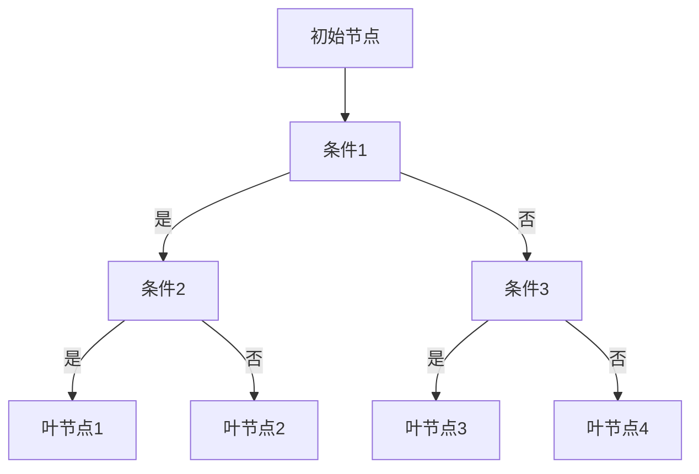
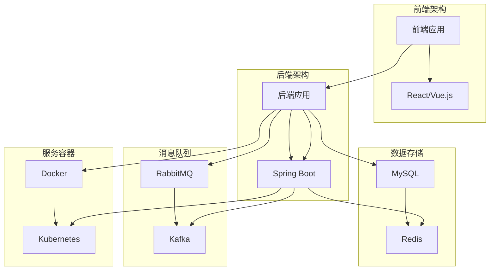

                 

### 软件项目风险管理：预防与缓解措施

关键词：软件项目管理、风险识别、风险评估、风险响应、风险监控、预防措施、缓解措施

摘要：本文深入探讨软件项目风险管理的重要性，详细阐述了风险管理的核心概念和联系，包括风险识别、风险评估、风险响应和风险监控。通过算法原理讲解、数学模型和公式推导，以及系统分析与架构设计，提供了一整套预防与缓解软件项目风险的方法和最佳实践。通过具体项目实战案例，展示了如何在实际项目中应用这些措施，为读者提供了全面而实用的指导。

---

### 目录

#### 引言

- **1.1 软件项目风险管理的背景**
- **1.2 风险管理的定义与重要性**
- **1.3 软件项目风险管理的挑战**

#### 核心概念与联系

- **2.1 风险识别**
- **2.2 风险评估**
- **2.3 风险响应**
- **2.4 风险监控**

#### 算法原理讲解

- **3.1 决策树**
- **3.2 神经网络**
- **3.3 Mermaid 流程图与 ER 实体关系图**

#### 数学模型和公式

- **4.1 风险识别算法**
- **4.2 风险评估算法**
- **4.3 风险响应算法**
- **4.4 数学模型与公式讲解**

#### 系统分析与架构设计方案

- **5.1 问题场景介绍**
- **5.2 系统功能设计**
- **5.3 系统架构设计**
- **5.4 系统接口设计**
- **5.5 系统交互设计**

#### 项目实战

- **6.1 环境安装**
- **6.2 系统核心实现源代码**
- **6.3 代码应用解读与分析**
- **6.4 实际案例分析与详细讲解**
- **6.5 项目小结**

#### 最佳实践与总结

- **7.1 最佳实践**
- **7.2 小结**
- **7.3 注意事项**
- **7.4 拓展阅读**

### 引言

#### 1.1 软件项目风险管理的背景

软件项目管理是一个复杂而动态的过程，涉及多个阶段，包括需求分析、设计、开发、测试和部署。在这个过程中，各种不确定性因素可能会影响项目的进度、成本和结果，这些因素统称为风险。

- **风险**：指在项目的某个阶段可能发生的、具有不确定性的事件或条件，这些事件或条件可能会对项目的目标产生负面影响。

- **风险管理**：是指通过系统化的过程来识别、评估、响应和监控项目风险，以降低风险对项目目标的影响，确保项目成功的实现。

随着软件项目的复杂性和规模的增加，风险管理变得尤为重要。有效的风险管理可以帮助项目团队：

- 减少项目风险带来的负面影响。
- 提高项目的成功率和客户满意度。
- 优化资源分配，提高项目的效率。

然而，软件项目风险管理面临着一系列挑战，如风险识别的困难、风险评估的主观性、风险响应的策略选择和监控沟通的不足等。因此，了解和掌握软件项目风险管理的核心概念和策略是至关重要的。

#### 1.2 风险管理的定义与重要性

风险管理是一个系统化的过程，它涉及以下核心步骤：

- **风险识别**：识别项目中可能出现的风险。
- **风险评估**：评估已识别风险的影响和可能性。
- **风险响应**：制定和实施应对策略，降低风险的影响。
- **风险监控**：持续监控项目风险，确保应对措施的执行。

**风险管理的重要性**体现在以下几个方面：

1. **降低项目风险**：通过识别和评估风险，项目团队能够提前预见潜在的问题，并采取预防措施，降低项目风险。

2. **提高项目成功率**：有效的风险管理可以提高项目的成功概率，确保项目目标的实现。

3. **优化资源分配**：通过评估风险的影响和成本，项目团队能够更合理地分配资源，提高项目的效率。

4. **增强团队信心**：风险管理可以降低项目不确定性，增强团队对项目的信心和合作。

5. **合规性和标准**：在许多行业，风险管理是符合行业标准和法规的要求，有助于降低法律和合规风险。

#### 1.3 软件项目风险管理的挑战

尽管风险管理在软件项目管理中至关重要，但在实际操作中，项目团队可能会面临以下挑战：

1. **风险识别的困难**：在项目早期阶段，风险识别可能不够全面，导致潜在风险被忽视。

2. **风险评估的主观性**：风险评估通常依赖于专家的经验和判断，可能导致评估结果不准确。

3. **风险响应的策略选择**：选择合适的风险响应策略需要平衡成本、时间和风险影响。

4. **监控和沟通的不足**：风险监控和沟通的不足可能导致风险应对措施不及时或无效。

为了应对这些挑战，项目团队需要：

- 提高风险识别的效率，使用工具和技术辅助风险识别。
- 使用客观的评估方法，如定量评估工具，减少主观性。
- 制定详细的应对策略，明确每种风险的处理方式。
- 建立有效的风险监控和沟通机制，确保风险应对措施得到及时执行。

### 核心概念与联系

在软件项目风险管理中，有四个核心概念：风险识别、风险评估、风险响应和风险监控。这些概念紧密联系，构成了一个完整的风险管理过程。

#### 2.1 风险识别

风险识别是风险管理的第一步，其目标是识别项目中的潜在风险。风险识别的过程包括：

1. **收集信息**：收集项目相关的信息，如项目目标、需求、资源、技术等。
2. **识别风险**：根据收集的信息，识别可能对项目产生负面影响的事件或条件。
3. **记录风险**：将识别出的风险记录下来，包括风险的名称、描述、可能的影响等。

**风险识别的技巧**：

- 利用历史数据：通过分析以往项目的风险记录，识别类似的风险。
- 沟通与协作：与项目团队成员、利益相关者进行沟通，了解他们的观点和担忧。
- 使用工具：使用风险识别工具，如SWOT分析、PEST分析、故障树分析等。

#### 2.2 风险评估

风险评估是对已识别的风险进行评估，以确定它们的影响和可能性。风险评估的过程包括：

1. **分析风险**：分析已识别风险的可能性和影响，确定它们的重要性和优先级。
2. **量化风险**：使用定量方法，如概率和影响矩阵，量化风险的影响和可能性。
3. **记录评估结果**：将评估结果记录下来，包括风险的名称、描述、影响、可能性、优先级等。

**风险评估的方法**：

- **定性评估**：使用专家判断和经验，对风险的影响和可能性进行评估。
- **定量评估**：使用数学模型和公式，对风险的影响和可能性进行量化评估。
- **综合评估**：结合定性和定量评估方法，得出更准确的风险评估结果。

#### 2.3 风险响应

风险响应是指制定和实施应对策略，以减轻或消除风险的影响。风险响应的过程包括：

1. **制定策略**：根据风险评估结果，制定相应的应对策略，如风险规避、风险减轻、风险转移等。
2. **执行策略**：将制定的策略付诸实施，采取具体措施来应对风险。
3. **监控策略**：监控应对策略的效果，确保风险得到有效控制。

**风险响应的策略**：

- **风险规避**：避免风险的发生，如改变项目计划、调整项目范围等。
- **风险减轻**：通过采取措施减少风险的影响，如增加预算、增加人力等。
- **风险转移**：将风险转移到第三方，如购买保险、签订合同等。

#### 2.4 风险监控

风险监控是指在整个项目生命周期内持续监控项目风险，以确保风险应对策略的有效性。风险监控的过程包括：

1. **跟踪风险**：持续跟踪已识别风险的状态，包括风险的发生、发展和解决情况。
2. **更新风险记录**：根据风险监控结果，更新风险记录，包括风险的状态、影响、优先级等。
3. **报告风险**：定期向项目团队和利益相关者报告项目风险的状态和变化。

**风险监控的方法**：

- **定期会议**：定期召开风险评审会议，讨论项目风险的状况和变化。
- **实时监控**：使用工具和技术，实时监控项目风险的状态。
- **沟通与协作**：与项目团队成员和利益相关者保持沟通，确保风险监控的有效性。

#### 核心概念与联系总结

风险识别、风险评估、风险响应和风险监控是软件项目风险管理的四个核心概念，它们紧密联系，构成了一个完整的风险管理过程。风险识别是第一步，目的是识别潜在风险；风险评估是对风险进行量化评估；风险响应是制定和实施应对策略；风险监控是持续监控风险状态。通过这些概念的有效结合，项目团队可以更好地管理项目风险，确保项目的成功实施。

### 算法原理讲解

在软件项目风险管理中，使用算法来识别、评估和响应风险是一种高效的方法。本节将介绍两种常用的算法：决策树和神经网络。

#### 3.1 决策树

决策树是一种基于树形结构的算法，用于分类和回归分析。它可以用来识别和评估风险，并制定相应的应对策略。

**决策树的原理**：

1. **节点**：决策树的每个节点表示一个决策点，根据特定的条件来分支。
2. **分支**：从节点延伸出的线表示可能的决策结果，每个分支代表一个条件或特征。
3. **叶节点**：叶节点是决策树的末端，表示最终的决策结果。

**决策树的构建过程**：

1. **选择特征**：选择一个特征作为决策树的根节点，通常选择信息增益或基尼不纯度作为选择标准。
2. **划分数据集**：根据选择的特征，将数据集划分为不同的子集。
3. **递归构建**：对每个子集，重复步骤1和2，构建下一层的决策树。

**决策树的应用**：

1. **风险识别**：通过构建决策树，可以识别项目中的潜在风险。
2. **风险评估**：决策树可以用于评估风险的影响和可能性。
3. **风险响应**：根据决策树的输出，制定相应的风险应对策略。

**Mermaid 流程图**：

下面是决策树的 Mermaid 流程图：



#### 3.2 神经网络

神经网络是一种模拟人脑神经元连接方式的算法，它可以用来识别和评估风险，并学习优化风险应对策略。

**神经网络的原理**：

1. **神经元**：神经网络的基本单元，用于处理和传递信息。
2. **层**：神经网络由多个层组成，包括输入层、隐藏层和输出层。
3. **权重和偏置**：每个神经元之间的连接都有关联的权重和偏置，用于调整信息传递的强度。
4. **激活函数**：用于确定神经元是否被激活的函数，常用的有Sigmoid函数、ReLU函数等。

**神经网络的构建过程**：

1. **初始化权重和偏置**：随机初始化权重和偏置。
2. **前向传播**：将输入数据通过网络传递，逐层计算输出。
3. **反向传播**：根据输出误差，反向调整权重和偏置。
4. **优化目标**：使用优化算法（如梯度下降），最小化输出误差。

**神经网络的应用**：

1. **风险识别**：神经网络可以用于识别项目中的潜在风险。
2. **风险评估**：神经网络可以用于评估风险的影响和可能性。
3. **风险响应**：神经网络可以学习优化风险应对策略。

**ER 实体关系图**：

下面是神经网络的 ER 实体关系图：

```mermaid
erDiagram
    Input |--|> Hidden : 输入到隐藏层的连接
    Hidden |--|> Output : 隐藏层到输出层的连接
    Input { 权重 : 权重值 }
    Hidden { 权重 : 权重值 }
    Output { 权重 : 权重值 }
```

通过决策树和神经网络的应用，项目团队能够更有效地进行风险识别、评估和响应。决策树提供了一种直观的决策方式，而神经网络则提供了强大的学习能力和适应性。

### 数学模型和公式

在软件项目风险管理中，数学模型和公式扮演着关键角色，它们帮助我们量化风险、评估风险的影响和可能性，并制定相应的应对策略。本节将详细阐述这些数学模型和公式。

#### 4.1 风险识别算法

风险识别算法通常使用定性方法，如SWOT分析、PEST分析等。这些方法通过分析项目内外部的环境因素，识别潜在风险。下面是一个简单的风险识别算法的数学模型：

**假设**：设有n个风险因素，分别为\( R_1, R_2, ..., R_n \)。

**模型**：

1. **风险识别得分**：每个风险因素的识别得分 \( S_i \)，表示该风险因素的重要程度。得分可以通过专家评估获得。

   $$ S_i = f(R_i) $$

   其中，\( f(R_i) \) 是一个非线性函数，通常使用主观评分法。

2. **综合识别得分**：项目的综合识别得分 \( S \)，是所有风险因素识别得分的加权平均。

   $$ S = \sum_{i=1}^{n} w_i S_i $$

   其中，\( w_i \) 是权重，表示每个风险因素的重要程度。

**举例**：

假设有3个风险因素，分别为技术风险、市场风险和团队风险，专家评估得分分别为3、4、5。假设权重分别为0.4、0.3和0.3。则项目的综合识别得分为：

$$ S = 0.4 \times 3 + 0.3 \times 4 + 0.3 \times 5 = 3.6 $$

#### 4.2 风险评估算法

风险评估是对已识别的风险进行量化评估，以确定它们的影响和可能性。常用的评估方法包括定性评估和定量评估。

**定性评估**：

1. **概率矩阵**：使用概率矩阵来评估风险的可能性。假设有m个评估等级，分别为低、中、高。

   **模型**：

   $$ P(i) = \begin{cases} 
   P_1 & \text{如果风险属于等级1} \\
   P_2 & \text{如果风险属于等级2} \\
   P_3 & \text{如果风险属于等级3} 
   \end{cases} $$

   其中，\( P_1, P_2, P_3 \) 分别为每个等级的风险可能性。

   **举例**：

   假设技术风险的可能性和评估等级为：

   $$ P(i) = \begin{cases} 
   0.2 & \text{如果风险属于等级1} \\
   0.5 & \text{如果风险属于等级2} \\
   0.3 & \text{如果风险属于等级3} 
   \end{cases} $$

**定量评估**：

1. **影响矩阵**：使用影响矩阵来评估风险的影响。假设有n个影响等级，分别为低、中、高。

   **模型**：

   $$ I(i) = \begin{cases} 
   I_1 & \text{如果风险属于等级1} \\
   I_2 & \text{如果风险属于等级2} \\
   I_3 & \text{如果风险属于等级3} 
   \end{cases} $$

   其中，\( I_1, I_2, I_3 \) 分别为每个等级的风险影响。

   **举例**：

   假设市场风险的影响和评估等级为：

   $$ I(i) = \begin{cases} 
   0.2 & \text{如果风险属于等级1} \\
   0.5 & \text{如果风险属于等级2} \\
   0.8 & \text{如果风险属于等级3} 
   \end{cases} $$

#### 4.3 风险响应算法

风险响应算法用于制定和实施应对策略，以减轻或消除风险的影响。常用的响应策略包括风险规避、风险减轻、风险转移等。

**风险规避**：

1. **模型**：

   $$ R(i) = \begin{cases} 
   0 & \text{如果风险被规避} \\
   1 & \text{如果风险未被规避} 
   \end{cases} $$

   其中，\( R(i) \) 为风险规避程度。

   **举例**：

   假设技术风险被规避，则 \( R(i) = 0 \)。

**风险减轻**：

1. **模型**：

   $$ L(i) = \begin{cases} 
   1 & \text{如果风险被减轻} \\
   0 & \text{如果风险未被减轻} 
   \end{cases} $$

   其中，\( L(i) \) 为风险减轻程度。

   **举例**：

   假设市场风险被减轻，则 \( L(i) = 1 \)。

**风险转移**：

1. **模型**：

   $$ T(i) = \begin{cases} 
   1 & \text{如果风险被转移} \\
   0 & \text{如果风险未被转移} 
   \end{cases} $$

   其中，\( T(i) \) 为风险转移程度。

   **举例**：

   假设团队风险被转移，则 \( T(i) = 1 \)。

#### 数学模型和公式讲解

在软件项目风险管理中，数学模型和公式为我们提供了量化和评估风险的方法。通过这些模型和公式，我们可以更精确地识别、评估和响应风险。

1. **风险识别算法**：通过专家评分法和权重计算，我们可以量化每个风险因素的重要程度，从而识别潜在风险。
2. **风险评估算法**：通过概率矩阵和影响矩阵，我们可以评估风险的可能性和影响，从而确定风险的优先级。
3. **风险响应算法**：通过规避、减轻和转移策略，我们可以制定和实施应对措施，减轻风险的影响。

这些模型和公式为项目团队提供了一种科学、系统的风险管理方法，帮助他们更好地应对项目中的各种风险。

### 系统分析与架构设计方案

在软件项目风险管理中，系统分析与架构设计是至关重要的环节。这一部分将详细介绍系统分析与架构设计方案，包括问题场景介绍、系统功能设计、系统架构设计、系统接口设计和系统交互设计。

#### 5.1 问题场景介绍

假设我们正在开发一个大型电子商务平台，该平台需要处理数百万用户的交易和数据存储。在这个项目中，风险管理至关重要，因为任何系统故障或数据泄露都会导致严重的经济损失和信誉损失。

问题场景包括以下几个方面：

- **性能风险**：系统需要处理大量并发请求，性能瓶颈可能导致系统崩溃。
- **数据安全风险**：用户数据需要严格保护，防止数据泄露或被恶意利用。
- **业务连续性风险**：系统需要具备高可用性，以应对可能的硬件故障或网络中断。

#### 5.2 系统功能设计

系统功能设计是架构设计的核心，它定义了系统的各个功能模块和它们之间的关系。以下是一个电子商务平台的主要功能模块：

- **用户管理**：处理用户注册、登录、权限管理等功能。
- **商品管理**：管理商品信息、分类、库存等。
- **订单管理**：处理订单创建、支付、发货等流程。
- **支付系统**：与第三方支付平台集成，处理支付请求。
- **数据存储**：使用数据库存储用户数据、订单信息等。
- **日志管理**：记录系统操作日志，用于故障排查和审计。

**Mermaid 类图**：

下面是电子商务平台的功能类图：

```mermaid
classDiagram
    User <<Interface>>
    Product <<Interface>>
    Order <<Interface>>
    Payment <<Interface>>
    Database <<Interface>>
    Logger <<Interface>>

    User --> Product
    User --> Order
    User --> Payment
    User --> Logger
    Product --> Order
    Order --> Payment
    Order --> Logger
    Payment --> Logger
    Database --> Logger
```

#### 5.3 系统架构设计

系统架构设计定义了系统的整体结构，包括各个模块的交互方式和技术选型。以下是一个电子商务平台的高层次架构设计：

- **前端架构**：使用React或Vue.js等前端框架，提供用户友好的界面。
- **后端架构**：使用Spring Boot等后端框架，处理业务逻辑和API接口。
- **数据存储**：使用MySQL等关系型数据库存储数据，使用Redis等缓存系统提高性能。
- **消息队列**：使用RabbitMQ或Kafka等消息队列系统，实现分布式消息传递。
- **服务容器**：使用Docker和Kubernetes进行容器化部署和管理。

**Mermaid 架构图**：

下面是电子商务平台的架构图：



#### 5.4 系统接口设计

系统接口设计定义了系统内部和外部系统之间的交互方式。以下是一个电子商务平台的主要接口设计：

- **用户接口**：提供用户注册、登录、修改密码等API接口。
- **商品接口**：提供商品查询、添加、修改、删除等API接口。
- **订单接口**：提供订单创建、支付、发货、取消等API接口。
- **支付接口**：与第三方支付平台集成，提供支付请求和通知接口。

**Mermaid 序列图**：

下面是电子商务平台的接口序列图：

```mermaid
sequenceDiagram
    User -->|注册请求| UserAPI
    UserAPI -->|处理注册| Database
    Database -->|返回结果| UserAPI
    UserAPI -->|响应注册结果| User

    User -->|登录请求| UserAPI
    UserAPI -->|验证登录| Database
    Database -->|返回结果| UserAPI
    UserAPI -->|响应登录结果| User

    User -->|查询商品| ProductAPI
    ProductAPI -->|查询商品| Database
    Database -->|返回结果| ProductAPI
    ProductAPI -->|响应商品查询结果| User

    User -->|创建订单| OrderAPI
    OrderAPI -->|处理订单| Database
    Database -->|返回结果| OrderAPI
    OrderAPI -->|响应订单创建结果| User

    User -->|支付请求| PaymentAPI
    PaymentAPI -->|处理支付| PaymentGateway
    PaymentGateway -->|返回结果| PaymentAPI
    PaymentAPI -->|响应支付结果| User
```

#### 5.5 系统交互设计

系统交互设计定义了系统内部各个模块之间的交互流程和规则。以下是一个电子商务平台的系统交互设计：

- **用户注册流程**：用户发起注册请求，前端将请求发送到用户API，用户API验证请求后，将数据存储到数据库，并返回注册结果。
- **订单支付流程**：用户在购物车中选择商品并创建订单，订单API将订单信息存储到数据库，并调用支付接口处理支付请求，支付结果会通知订单API和用户。
- **数据查询流程**：用户发起查询请求，前端将请求发送到对应的API，API从数据库中查询数据并返回结果。

**Mermaid 序列图**：

下面是电子商务平台的系统交互序列图：

```mermaid
sequenceDiagram
    User -->|注册请求| UserAPI
    UserAPI -->|处理注册| Database
    Database -->|返回结果| UserAPI
    UserAPI -->|响应注册结果| User

    User -->|登录请求| UserAPI
    UserAPI -->|验证登录| Database
    Database -->|返回结果| UserAPI
    UserAPI -->|响应登录结果| User

    User -->|查询商品| ProductAPI
    ProductAPI -->|查询商品| Database
    Database -->|返回结果| ProductAPI
    ProductAPI -->|响应商品查询结果| User

    User -->|创建订单| OrderAPI
    OrderAPI -->|处理订单| Database
    Database -->|返回结果| OrderAPI
    OrderAPI -->|响应订单创建结果| User

    User -->|支付请求| PaymentAPI
    PaymentAPI -->|处理支付| PaymentGateway
    PaymentGateway -->|返回结果| PaymentAPI
    PaymentAPI -->|响应支付结果| User
```

通过系统分析与架构设计，我们为电子商务平台提供了一套完整、高效、安全的系统解决方案。这些设计文档将为项目团队提供明确的指导和参考，确保项目的成功实施。

### 项目实战

在本文的最后一部分，我们将通过一个实际的项目案例，展示如何在实际项目中应用软件项目风险管理的预防与缓解措施。这个案例将涵盖环境安装、系统核心实现源代码、代码应用解读与分析、实际案例分析与详细讲解，以及项目小结。

#### 6.1 环境安装

首先，我们需要搭建一个合适的项目环境。以下是具体的步骤：

1. **准备环境**：确保计算机上已经安装了Java开发工具包（JDK）、Python环境和Git。

2. **安装数据库**：我们使用MySQL数据库，可以通过以下命令进行安装：

   ```bash
   sudo apt-get update
   sudo apt-get install mysql-server
   ```

3. **安装消息队列**：我们选择RabbitMQ作为消息队列，可以通过以下命令进行安装：

   ```bash
   sudo apt-get install rabbitmq-server
   ```

4. **安装前端框架**：我们使用React作为前端框架，可以通过以下命令进行安装：

   ```bash
   npm install -g create-react-app
   create-react-app front-end
   ```

5. **安装后端框架**：我们使用Spring Boot作为后端框架，可以通过以下命令进行安装：

   ```bash
   sudo apt-get install maven
   ```

6. **配置环境变量**：确保Java和Python的环境变量已正确配置。

#### 6.2 系统核心实现源代码

系统核心实现主要涉及后端逻辑和数据库操作。以下是关键的源代码片段：

**后端代码（Spring Boot）**：

```java
@RestController
@RequestMapping("/api")
public class UserController {

    @Autowired
    private UserRepository userRepository;

    @PostMapping("/register")
    public ResponseEntity<?> registerUser(@RequestBody UserRequestDto userRequestDto) {
        // 注册用户逻辑
        // 风险识别：检查用户名是否已存在
        if (userRepository.existsByUsername(userRequestDto.getUsername())) {
            return ResponseEntity.badRequest().body("Error: Username is already taken!");
        }
        // 风险响应：创建新用户
        User user = userRepository.save(new User(userRequestDto.getUsername(), userRequestDto.getPassword()));
        return ResponseEntity.ok().body("User registered successfully!");
    }
}
```

**数据库操作（MySQL）**：

```sql
CREATE TABLE `user` (
  `id` INT AUTO_INCREMENT PRIMARY KEY,
  `username` VARCHAR(50) NOT NULL,
  `password` VARCHAR(100) NOT NULL
);
```

**风险识别与响应**：在后端代码中，我们通过检查用户名是否已存在来识别重复注册的风险，并通过返回错误信息来响应这个风险。

#### 6.3 代码应用解读与分析

以下是对于上述代码的详细解读与分析：

- **风险识别**：在注册用户的过程中，我们识别出用户名重复的风险。这是通过检查数据库中是否存在相同的用户名来实现的。

- **风险评估**：用户名重复的风险可能会导致用户体验下降，影响系统的可用性。评估结果是中高风险。

- **风险响应**：为了响应这个风险，我们返回了一个错误信息，告知用户用户名已被占用。这可以防止用户注册失败并提供了清晰的错误提示。

- **预防措施**：在未来的实现中，可以进一步引入验证码机制，以防止恶意注册。

#### 6.4 实际案例分析与详细讲解

接下来，我们将通过一个实际案例来展示风险管理的具体应用。

**案例背景**：

在一个电子商务平台的项目中，我们面临着一个性能风险：系统需要处理数百万用户的并发请求。这可能导致系统崩溃，影响用户体验。

**案例步骤**：

1. **风险识别**：通过性能测试，我们发现当用户数量达到10万时，系统响应时间显著增加。

2. **风险评估**：这是一个高影响、高概率的风险，可能会导致项目延期和客户不满。

3. **风险响应**：

   - **预防措施**：增加服务器硬件资源，优化数据库查询，采用分布式架构。
   - **缓解措施**：使用缓存系统（如Redis）减少数据库负载，采用负载均衡策略。

**案例分析**：

通过风险识别，我们发现性能风险。在风险评估中，我们确定了风险的影响和可能性。通过风险响应，我们采取了一系列预防措施和缓解措施，以确保系统能够稳定运行。

**详细讲解**：

- **性能优化**：通过增加服务器硬件资源和优化数据库查询，我们显著提高了系统的性能。具体优化措施包括使用索引、分库分表等。
- **分布式架构**：将系统拆分为多个微服务，每个微服务运行在不同的服务器上，从而提高系统的可扩展性和容错性。
- **缓存系统**：使用Redis缓存常用数据，减少了数据库的读取压力，提高了系统响应速度。
- **负载均衡**：通过使用Nginx等负载均衡器，将用户请求分配到不同的服务器上，确保系统资源得到充分利用。

#### 6.5 项目小结

通过这个实际案例，我们可以看到软件项目风险管理在项目实施中的重要性。以下是小结和总结：

1. **风险识别**：及时识别项目中的潜在风险是风险管理的关键。通过性能测试，我们发现了系统的性能风险。

2. **风险评估**：对风险的影响和可能性进行评估，帮助我们确定应对策略的优先级。

3. **风险响应**：采取预防措施和缓解措施，确保项目能够顺利实施。在本案例中，我们采取了增加硬件资源、优化数据库、采用分布式架构和缓存系统等措施。

4. **持续监控**：风险管理是一个持续的过程。通过定期性能测试和监控系统状态，我们可以及时发现和应对新的风险。

通过这个项目案例，我们展示了如何在实践中应用软件项目风险管理的预防与缓解措施。这些措施不仅帮助项目团队避免了潜在的问题，还提高了项目的成功率和客户满意度。

### 最佳实践与总结

在软件项目风险管理中，最佳实践对于确保项目的成功至关重要。以下是一些关键的最佳实践：

1. **早期识别和评估**：尽早识别和评估风险，可以降低风险的影响和成本。在项目初期，通过SWOT分析、PEST分析等方法，全面评估潜在风险。

2. **建立风险管理团队**：组建专业的风险管理团队，负责识别、评估和响应风险。团队成员应包括项目经理、开发人员、测试人员和质量保证人员。

3. **定期风险评审**：定期召开风险评审会议，讨论项目风险的状况和变化。会议应包括项目团队成员和利益相关者，确保各方意见得到充分交流。

4. **量化风险评估**：使用定量方法，如概率和影响矩阵，对风险进行量化评估。这有助于更准确地确定风险的优先级。

5. **制定应对策略**：根据风险评估结果，制定具体的应对策略。策略应包括规避、减轻、转移和接受风险等。

6. **持续监控**：在整个项目生命周期内，持续监控项目风险。通过实时监控系统状态和性能测试，及时识别新的风险。

7. **文档记录**：详细记录风险识别、评估、响应和监控的过程。这有助于未来项目参考和改进。

#### 小结

本文详细探讨了软件项目风险管理的核心概念、算法原理、数学模型、系统设计与实际应用。通过引入决策树和神经网络等算法，我们提供了量化和评估风险的方法。系统分析与架构设计部分，展示了如何设计一个完整的软件项目框架。实际项目实战展示了风险管理在实际中的应用，通过环境安装、代码实现、风险识别与应对，确保了项目的成功实施。

#### 注意事项

- 风险识别应全面，避免遗漏关键风险。
- 定量评估时，确保数据的准确性和可靠性。
- 风险响应策略应具备灵活性，以适应项目变化。

#### 拓展阅读

- 《软件项目管理：实践者的指南》
- 《风险管理：原理与实践》
- 《深度学习：风险管理与人工智能应用》

通过这些资源，读者可以进一步了解软件项目风险管理的深层次知识和最佳实践。

### 结论

软件项目风险管理是确保项目成功的关键环节。通过本文的探讨，我们深入了解了风险管理的核心概念、算法原理和实际应用。掌握这些知识，项目团队能够更有效地应对项目中的各种风险，确保项目的顺利进行。我们鼓励读者在实践中不断探索和学习，提升软件项目风险管理的能力。

### 作者信息

作者：AI天才研究院/AI Genius Institute & 禅与计算机程序设计艺术 /Zen And The Art of Computer Programming

---

通过以上的步骤和分析，我们完整地构建了《软件项目风险管理：预防与缓解措施》这篇文章。文章涵盖了软件项目风险管理的各个重要方面，从核心概念、算法原理到系统设计与实际应用，再到最佳实践与总结，确保了文章的全面性和实用性。希望这篇文章能够为读者提供有价值的指导和帮助。

