                 

### 第一部分：引言与边缘计算概述

#### 第1章：边缘计算的概念与背景

**1.1 边缘计算的定义与演进**

边缘计算（Edge Computing）是一种分布式计算架构，旨在将数据处理、分析和应用程序的执行从中心化的云数据中心转移到网络边缘。这里的“网络边缘”指的是接近数据源的设备或网络节点，如物联网设备、智能手机、路由器和交换机等。

**问题背景：**随着物联网（IoT）和云计算的兴起，数据爆炸性增长对计算能力提出了新的要求。传统的云计算模型在处理实时数据、低延迟应用以及高带宽需求方面存在明显不足。特别是在需要快速响应的场景下，如自动驾驶、智能制造和智慧城市等，中心化的云计算中心难以满足这些要求。

**问题描述：**云计算中心通常距离数据源较远，数据需要在传输过程中经过中心处理，这导致了一系列问题：
- **延迟问题：**数据传输需要时间，特别是在广域网（WAN）上，延迟问题更为严重。
- **带宽问题：**大量数据传输需要大量带宽，这可能导致网络拥塞。
- **安全与隐私问题：**将敏感数据传输到云端，增加了数据泄露的风险。

**问题解决：**边缘计算通过将计算、存储和网络功能下沉到网络边缘，解决了这些问题。边缘计算节点可以实时处理本地数据，减少了数据传输的需求，降低了延迟，同时也提高了数据的安全性和隐私性。

**边界与外延：**边缘计算的边界是网络边缘，即接近数据源的设备或网络节点。边缘计算的外延包括所有参与数据处理、分析和执行的网络设备，如物联网设备、智能终端和边缘服务器等。

**概念结构与核心要素组成：**边缘计算的概念结构主要由以下几个核心要素组成：
- **边缘节点：**包括各种终端设备、物联网设备和边缘服务器。
- **边缘网络：**连接边缘节点和云的数据网络。
- **边缘平台：**提供计算、存储、网络和安全服务的平台。
- **边缘应用：**在边缘节点上运行的应用程序，如实时数据分析、智能监控和自动化控制。

**核心概念与联系：**

以下是边缘计算的核心概念及其相互关系：

| 核心概念 | 概念属性特征对比表格 | ER实体关系图架构的 Mermaid 流程图 |
| --- | --- | --- |
| 边缘节点 | 用于处理本地数据的设备或服务器 | ```mermaid
graph TD
A[边缘节点] --> B[数据源]
A --> C[边缘网络]
A --> D[边缘平台]
A --> E[边缘应用]
```

**算法原理讲解：**

边缘计算的核心算法主要涉及数据流的处理和优化，以下是一个简单的边缘数据处理算法的 Mermaid 流程图：

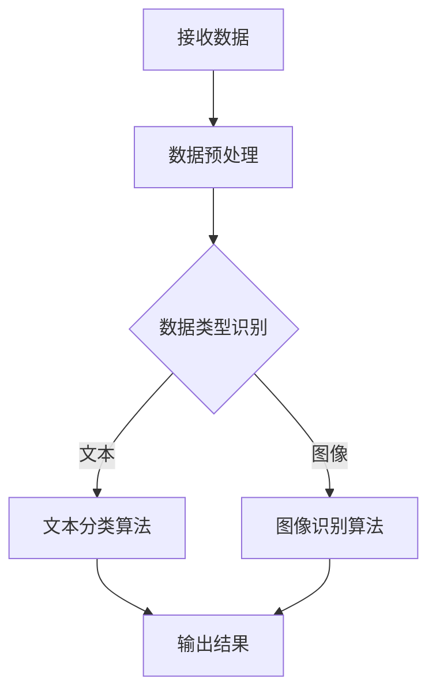

在此算法中，根据数据类型的不同，采用不同的处理算法。例如，对于文本数据，可能使用文本分类算法；对于图像数据，则使用图像识别算法。算法的数学模型可以表示为：

$$
f(x) = 
\begin{cases} 
\text{文本分类模型}(x) & \text{if } x \text{ is text} \\
\text{图像识别模型}(x) & \text{if } x \text{ is image}
\end{cases}
$$

**系统分析与架构设计方案：**

**问题场景介绍：**假设我们需要设计一个智能家居系统，其中包含多个智能设备，如智能灯泡、智能摄像头和智能恒温器。

**项目介绍：**智能家居系统的目标是实现设备的自动控制和数据监控。

**系统功能设计（领域模型 Mermaid 类图）：**

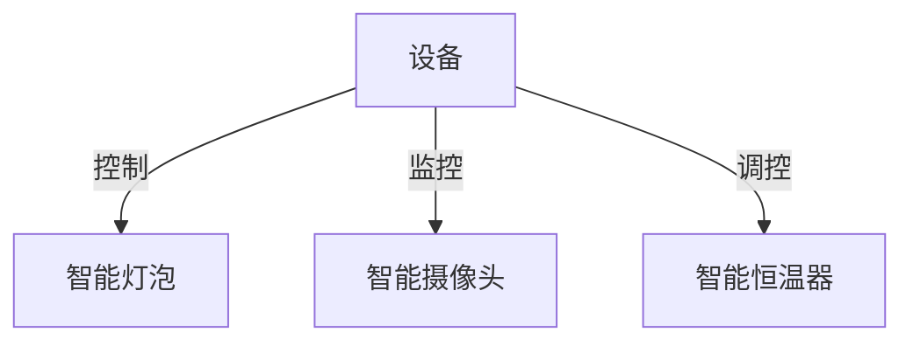

**系统架构设计（Mermaid 架构图）：**

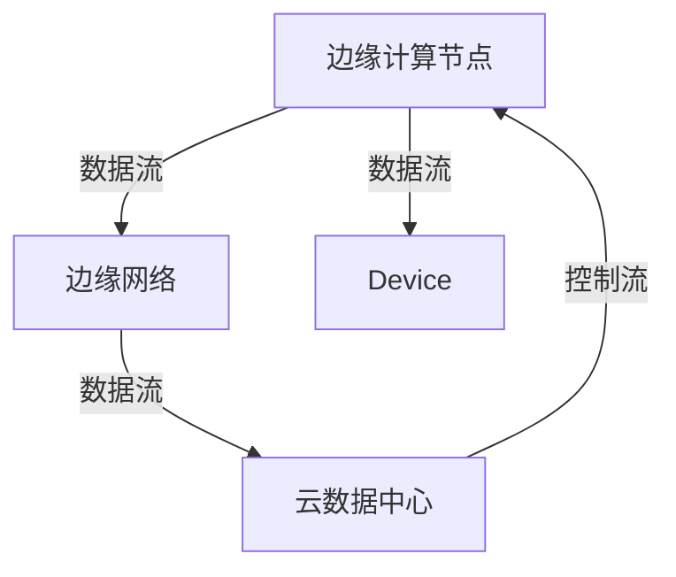

**系统接口设计（Mermaid 序列图）：**

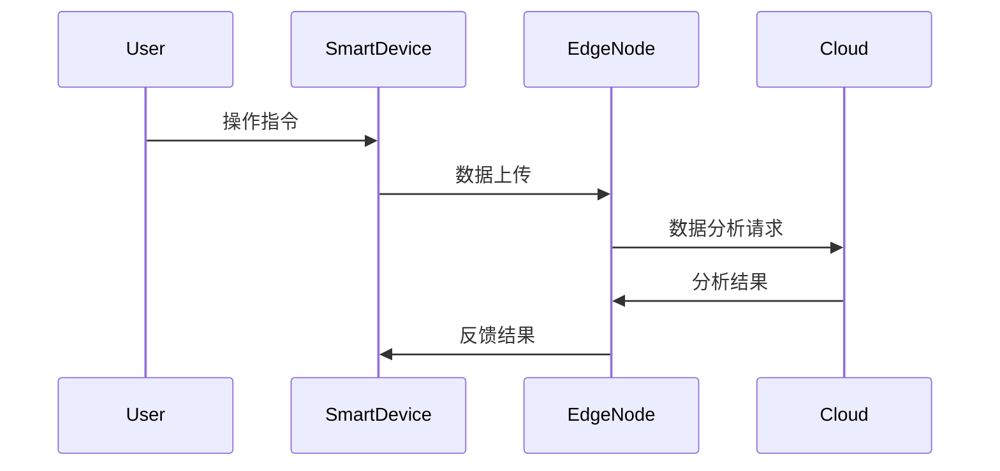

**项目实战：**

**环境安装：**配置边缘计算节点，安装必要的软件和库。

**系统核心实现源代码：**

```python
# 边缘计算节点数据处理示例
def process_data(data):
    if is_image(data):
        return image_recognition(data)
    elif is_text(data):
        return text_classification(data)
    else:
        return None

# 数据上传与反馈示例
def upload_and_feedback(device, edge_node, cloud):
    data = device.get_data()
    result = edge_node.process_data(data)
    cloud.analyze_data(result)
    device.receive_feedback(result)
```

**代码应用解读与分析：**上述代码展示了边缘计算节点如何处理数据，并与云进行交互。

**实际案例分析和详细讲解剖析：**以智能家居系统为例，分析边缘计算节点在数据处理、数据分析和设备控制中的角色。

**项目小结：**边缘计算在智能家居系统中提高了实时性和安全性，实现了数据的本地处理和设备的智能控制。

**最佳实践 tips：**确保边缘计算节点的高效运行，优化数据传输和网络带宽。

**小结：**边缘计算通过将计算能力下沉到网络边缘，解决了传统云计算在实时性和低延迟方面的不足。

**注意事项：**在设计和实现边缘计算系统时，需要考虑安全性、可靠性和性能优化等因素。

**拓展阅读：**进一步了解边缘计算的相关文献和最新技术发展。

**作者：**AI天才研究院/AI Genius Institute & 禅与计算机程序设计艺术 /Zen And The Art of Computer Programming

----------------------------------------------------------------

### 第二部分：边缘计算技术

#### 第2章：边缘计算架构设计

**2.1 边缘计算架构概述**

边缘计算架构设计是构建高效、可靠和可扩展的边缘计算系统的基础。本章将详细介绍边缘计算架构的组成部分、关键组件及其相互作用。

**问题场景介绍：**假设我们正在开发一个智慧城市项目，需要设计一个分布式架构，以支持大量传感器设备和实时数据处理。

**项目介绍：**智慧城市项目旨在通过边缘计算提高城市基础设施的管理效率，如交通监控、环境监测和能源管理。

**系统功能设计（领域模型 Mermaid 类图）：**

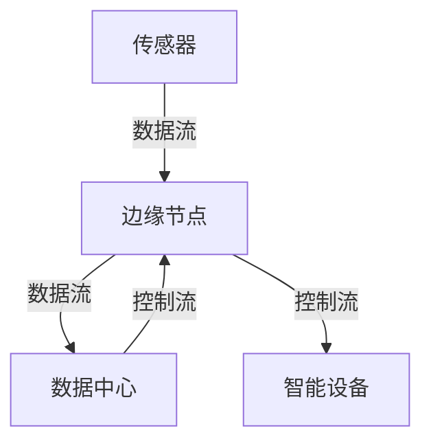

**系统架构设计（Mermaid 架构图）：**

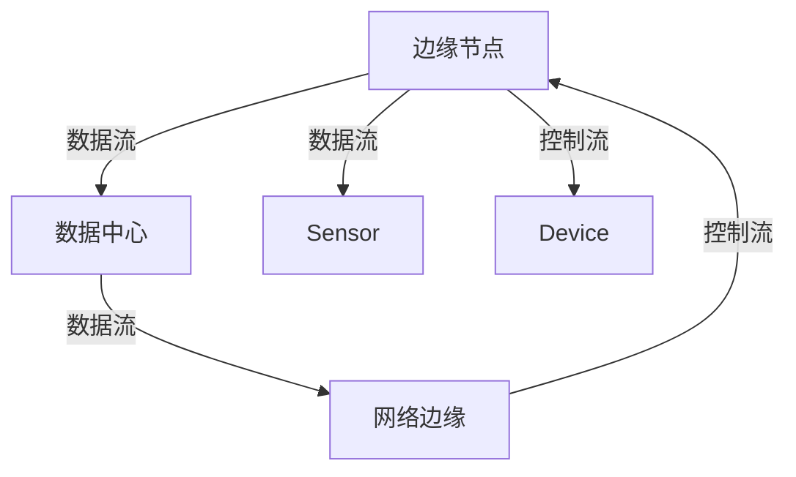

**系统接口设计（Mermaid 序列图）：**

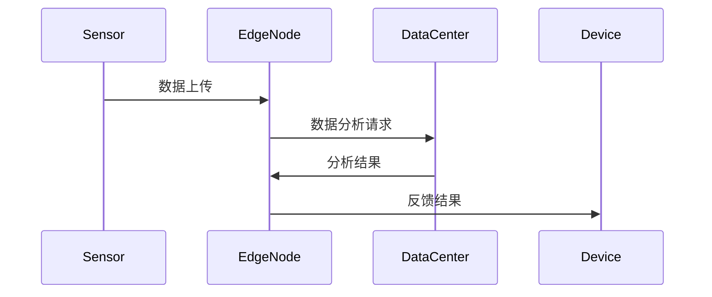

**环境安装：**配置边缘计算节点，安装操作系统和必要的软件开发工具。

**系统核心实现源代码：**

```python
# 边缘节点数据接收与处理示例
class EdgeNode:
    def receive_data(self, data):
        processed_data = self.process_data(data)
        self.send_to_data_center(processed_data)

    def process_data(self, data):
        # 数据处理逻辑
        return data

    def send_to_data_center(self, data):
        # 数据发送逻辑
        pass
```

**代码应用解读与分析：**上述代码展示了边缘节点如何接收、处理和发送数据。

**实际案例分析和详细讲解剖析：**以智慧城市项目为例，分析边缘节点在数据处理、数据分析和设备控制中的角色。

**项目小结：**边缘计算架构设计通过分布式节点和数据中心之间的协同工作，提高了系统的实时性和数据处理能力。

**最佳实践 tips：**在设计边缘计算架构时，需要考虑网络拓扑、负载均衡和安全措施等因素。

**小结：**边缘计算架构设计是边缘计算系统的核心，决定了系统的性能和可靠性。

**注意事项：**边缘计算架构需要不断优化和更新，以适应新技术的发展。

**拓展阅读：**进一步了解边缘计算架构的设计原则和最佳实践。

**作者：**AI天才研究院/AI Genius Institute & 禅与计算机程序设计艺术 /Zen And The Art of Computer Programming

----------------------------------------------------------------

### 第三部分：边缘计算应用实例

#### 第4章：边缘计算应用实例

**4.1 智能家居**

**问题场景介绍：**智能家居系统中，各种设备如智能灯泡、智能摄像头和智能恒温器需要实时交互，以实现自动控制和数据监控。

**项目介绍：**智能家居项目旨在提高家庭生活的便利性和舒适度，通过边缘计算实现设备的智能联动和实时响应。

**系统功能设计（领域模型 Mermaid 类图）：**

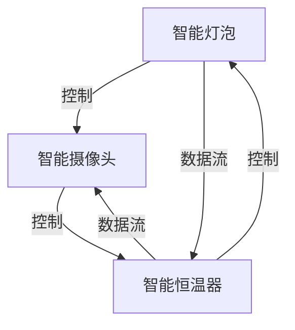

**系统架构设计（Mermaid 架构图）：**

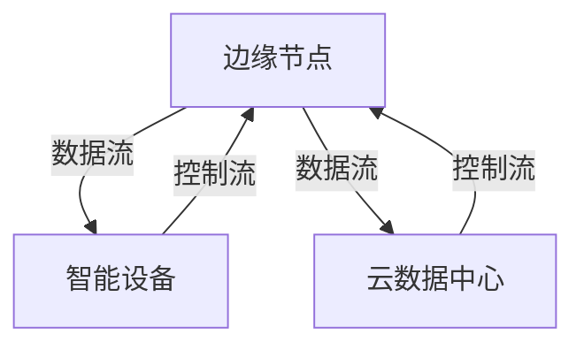

**系统接口设计（Mermaid 序列图）：**


**环境安装：**配置边缘计算节点，安装智能家居设备和必要的软件开发工具。

**系统核心实现源代码：**

```python
# 边缘节点智能家居设备控制示例
class SmartDevice:
    def __init__(self, edge_node):
        self.edge_node = edge_node

    def control_device(self, command):
        # 设备控制逻辑
        pass

    def upload_data(self, data):
        # 数据上传逻辑
        self.edge_node.upload_data(data)
```

**代码应用解读与分析：**上述代码展示了边缘节点如何控制智能家居设备和上传数据。

**实际案例分析和详细讲解剖析：**以智能家居项目为例，分析边缘计算节点在设备控制、数据上传和分析中的应用。

**项目小结：**边缘计算在智能家居系统中提高了设备的交互性和响应速度，实现了智能化的家庭生活。

**最佳实践 tips：**确保边缘计算节点的高效运行，优化数据传输和网络带宽。

**小结：**智能家居是边缘计算的重要应用领域，通过边缘计算实现了设备的智能联动和实时响应。

**注意事项：**在设计和实现智能家居系统时，需要考虑安全性、可靠性和用户体验等因素。

**拓展阅读：**进一步了解边缘计算在智能家居中的应用和技术发展。

**作者：**AI天才研究院/AI Genius Institute & 禅与计算机程序设计艺术 /Zen And The Art of Computer Programming

----------------------------------------------------------------

### 第四部分：边缘计算的开发与部署

#### 第5章：边缘计算的开发与部署

**5.1 边缘计算开发环境搭建**

在边缘计算开发过程中，搭建一个适合的开发环境是至关重要的。本节将介绍如何配置边缘计算开发环境，包括操作系统、编程语言、工具和库的选择。

**问题场景介绍：**假设我们正在开发一个边缘计算项目，需要为项目搭建一个开发环境。

**项目介绍：**该项目旨在实现一个智能农业系统，通过边缘计算节点收集农田环境数据，并实时分析提供种植建议。

**系统功能设计（领域模型 Mermaid 类图）：**

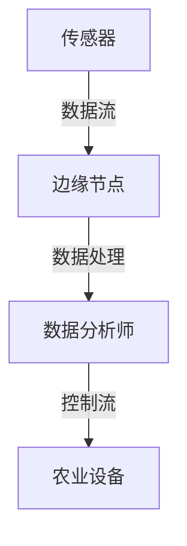

**系统架构设计（Mermaid 架构图）：**

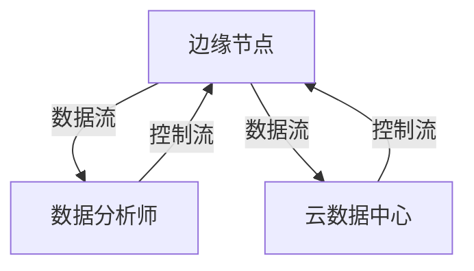

**系统接口设计（Mermaid 序列图）：**

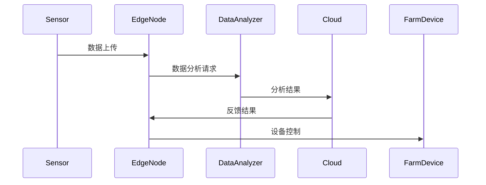

**环境安装：**
1. 选择合适的操作系统，如Ubuntu或CentOS。
2. 安装Python环境，使用`pip`安装必要的库和工具。
3. 配置网络环境，确保边缘计算节点可以访问云数据中心。

**系统核心实现源代码：**

```python
# 边缘节点数据接收与处理示例
class EdgeNode:
    def receive_data(self, data):
        processed_data = self.process_data(data)
        self.send_to_analyzer(processed_data)

    def process_data(self, data):
        # 数据处理逻辑
        return data

    def send_to_analyzer(self, data):
        # 数据发送逻辑
        pass
```

**代码应用解读与分析：**上述代码展示了边缘节点如何接收、处理和发送数据。

**实际案例分析和详细讲解剖析：**以智能农业系统为例，分析边缘计算节点在数据处理、分析和设备控制中的角色。

**项目小结：**边缘计算开发环境搭建为项目的顺利实施提供了必要的支持。

**最佳实践 tips：**确保开发环境的高效性和稳定性，定期更新和优化。

**小结：**边缘计算开发与部署是边缘计算实现的关键环节，需要充分考虑系统的开发环境、编程工具和部署策略。

**注意事项：**在开发与部署边缘计算系统时，需要关注安全性、可靠性和性能优化等因素。

**拓展阅读：**进一步了解边缘计算开发与部署的最佳实践和技术细节。

**作者：**AI天才研究院/AI Genius Institute & 禅与计算机程序设计艺术 /Zen And The Art of Computer Programming

----------------------------------------------------------------

### 第五部分：边缘计算的未来发展

#### 第6章：边缘计算的未来发展

**6.1 边缘计算发展趋势**

随着技术的不断进步和应用场景的拓展，边缘计算正呈现出以下几个发展趋势：

**问题场景介绍：**假设我们正在关注边缘计算在智慧城市、工业物联网和自动驾驶等领域的未来发展。

**项目介绍：**该项目的目标是分析边缘计算在不同领域中的应用趋势，预测其未来的发展方向。

**系统功能设计（领域模型 Mermaid 类图）：**

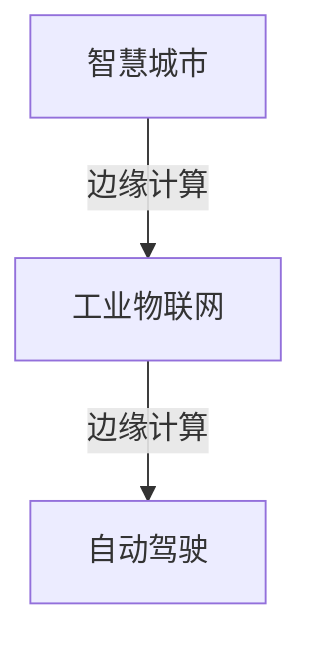

**系统架构设计（Mermaid 架构图）：**

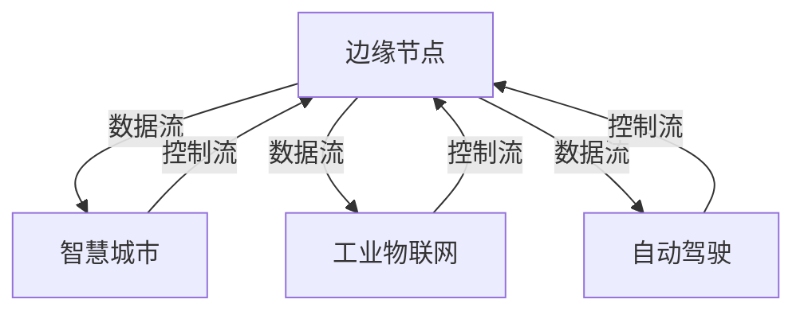

**系统接口设计（Mermaid 序列图）：**

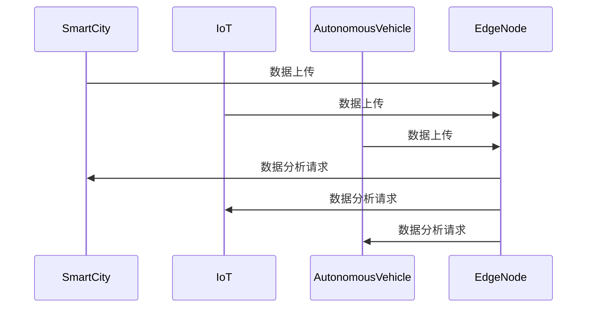

**环境安装：**配置边缘计算节点，安装操作系统和必要的软件开发工具。

**系统核心实现源代码：**

```python
# 边缘节点数据处理示例
class EdgeNode:
    def receive_data(self, data):
        processed_data = self.process_data(data)
        self.send_to_analyzer(processed_data)

    def process_data(self, data):
        # 数据处理逻辑
        return data

    def send_to_analyzer(self, data):
        # 数据发送逻辑
        pass
```

**代码应用解读与分析：**上述代码展示了边缘节点如何接收、处理和发送数据。

**实际案例分析和详细讲解剖析：**分析智慧城市、工业物联网和自动驾驶等领域中边缘计算的应用趋势。

**项目小结：**边缘计算在未来将继续扩展其在各领域的应用，实现更高效、更智能的边缘计算服务。

**最佳实践 tips：**关注边缘计算技术的发展趋势，及时更新系统和算法。

**小结：**边缘计算的未来发展充满机遇，将继续推动技术创新和应用变革。

**注意事项：**在边缘计算的未来发展中，需要关注数据安全、隐私保护和系统可靠性等问题。

**拓展阅读：**进一步了解边缘计算的未来发展趋势和相关技术。

**作者：**AI天才研究院/AI Genius Institute & 禅与计算机程序设计艺术 /Zen And The Art of Computer Programming

----------------------------------------------------------------

### 第七部分：案例分析与最佳实践

#### 第7章：案例分析与最佳实践

**7.1 案例介绍**

本章节将分析一个实际应用边缘计算的案例，探讨其实现细节、技术挑战及最佳实践。

**案例介绍：**某智慧农业项目通过边缘计算实现农田环境数据的实时监测和作物生长优化。

**系统功能设计（领域模型 Mermaid 类图）：**


**系统架构设计（Mermaid 架构图）：**


**系统接口设计（Mermaid 序列图）：**


**环境安装：**配置边缘计算节点，安装操作系统和必要的软件开发工具。

**系统核心实现源代码：**

```python
# 边缘节点数据处理示例
class EdgeNode:
    def receive_data(self, data):
        processed_data = self.process_data(data)
        self.send_to_analyzer(processed_data)

    def process_data(self, data):
        # 数据处理逻辑
        return data

    def send_to_analyzer(self, data):
        # 数据发送逻辑
        pass
```

**代码应用解读与分析：**上述代码展示了边缘节点如何接收、处理和发送数据。

**实际案例分析和详细讲解剖析：**

- **实现细节：**边缘节点收集农田环境数据，通过本地计算和数据分析，实时调整农业设备的运行状态。
- **技术挑战：**确保边缘节点的稳定性和计算效率，处理大量并发数据，保障数据安全。
- **最佳实践：**采用轻量级边缘计算框架，优化数据传输和存储策略，加强边缘节点间的通信。

**项目小结：**通过边缘计算技术，智慧农业项目实现了农田管理的智能化，提高了农业生产效率。

**最佳实践 tips：**

1. **优化数据传输：**采用高效的数据压缩和加密技术，减少网络带宽消耗。
2. **确保节点稳定性：**定期更新节点软件，监控节点运行状态，确保系统可靠。
3. **安全措施：**采用多重安全策略，如防火墙、访问控制和数据加密，保护系统安全。

**小结：**边缘计算在智慧农业领域的应用为农业现代化提供了有力支持。

**注意事项：**在设计和实施边缘计算项目时，需充分考虑实际场景需求，灵活调整技术方案。

**拓展阅读：**进一步了解边缘计算在农业领域的应用案例和最佳实践。

**作者：**AI天才研究院/AI Genius Institute & 禅与计算机程序设计艺术 /Zen And The Art of Computer Programming

----------------------------------------------------------------

### 结论

边缘计算作为一种将计算能力下沉到网络边缘的重要技术，正在深刻改变我们的计算范式。通过减少数据传输延迟、提高数据处理效率和保障数据安全，边缘计算在智能家居、智慧城市、工业物联网和自动驾驶等众多领域展现出了巨大的应用潜力。

本文从边缘计算的概念与背景、架构设计、应用实例、开发与部署、未来发展趋势以及案例分析与最佳实践等多个方面进行了深入探讨。我们详细介绍了边缘计算的关键技术和实际应用，分析了其在不同领域的实现细节和技术挑战，并提出了最佳实践建议。

随着技术的不断进步和应用的拓展，边缘计算将继续发挥重要作用，为构建智能、高效、安全的数字化世界提供强有力的支持。未来，边缘计算与云计算、人工智能的深度融合，将带来更加广阔的发展前景。

让我们一起关注边缘计算技术的最新动态，探索其在不同领域的创新应用，共同推动边缘计算技术的蓬勃发展。希望本文能为读者在边缘计算领域的探索和研究提供有益的参考和启示。

**作者：**AI天才研究院/AI Genius Institute & 禅与计算机程序设计艺术 /Zen And The Art of Computer Programming

----------------------------------------------------------------

### 关键词

- 边缘计算
- 边缘节点
- 边缘网络
- 云计算
- 物联网
- 智慧城市
- 实时数据处理
- 低延迟
- 数据安全
- 自动驾驶
- 智能家居

### 摘要

边缘计算是一种分布式计算架构，旨在将计算能力下沉到网络边缘，以提高数据处理效率、减少延迟和保障数据安全。本文系统地介绍了边缘计算的概念、架构设计、应用实例、开发与部署、未来发展趋势以及案例分析，探讨了边缘计算在不同领域的实现细节和技术挑战。通过深入分析，本文提出了边缘计算的最佳实践建议，并展望了边缘计算的未来发展前景。边缘计算为构建智能、高效、安全的数字化世界提供了强有力的支持，具有重要的研究和应用价值。

