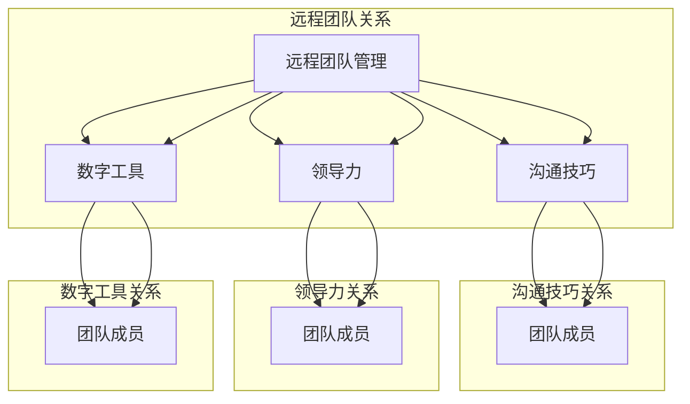
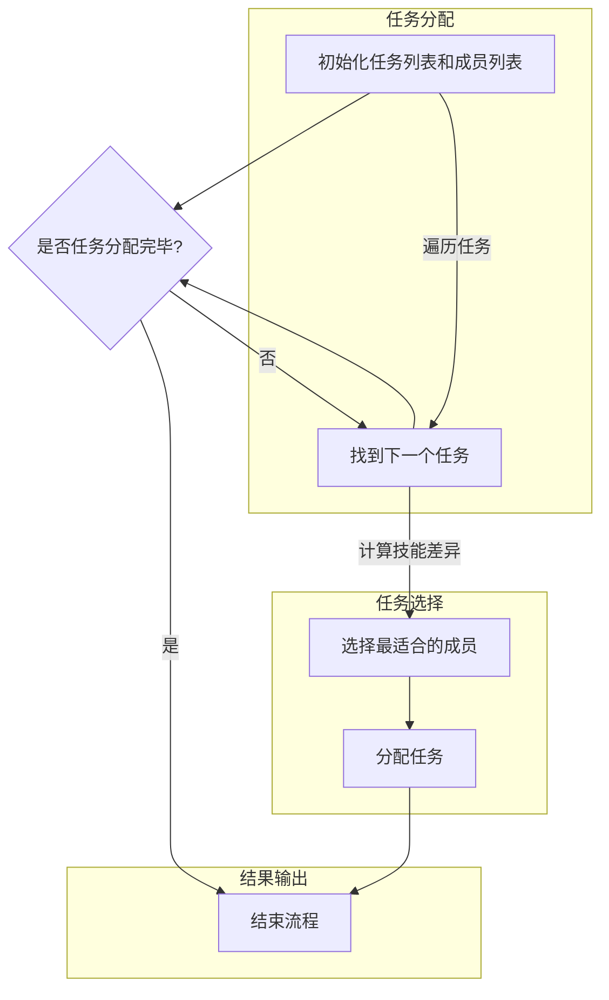
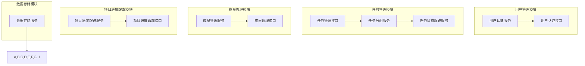
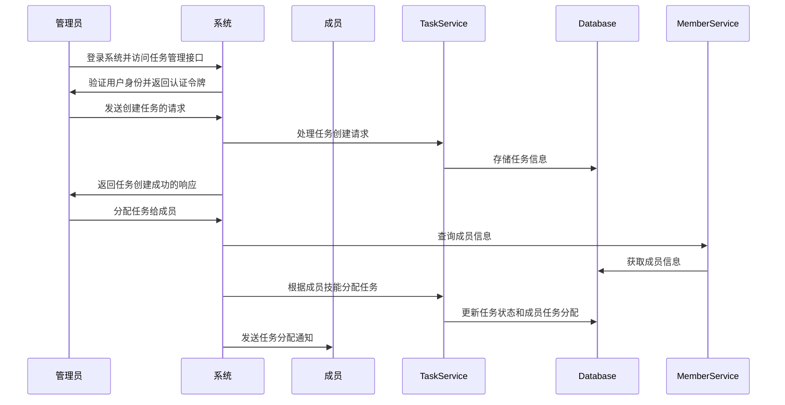

                 


### 第一步：文章标题与关键词定义

#### 文章标题：《远程团队管理与沟通技巧》

#### 关键词：

1. 远程团队管理
2. 沟通技巧
3. 领导力
4. 数字工具
5. 项目协作
6. 效能提升
7. 远程工作

### 第二步：摘要撰写

#### 摘要：

随着全球化的加速和技术的进步，远程团队管理已成为现代企业的重要组成部分。本文旨在探讨远程团队管理的核心概念与沟通技巧，通过详细分析问题背景、核心概念、算法原理、系统架构设计以及项目实战，提供实用的最佳实践指南，帮助团队提升远程工作效率和协作能力。

### 第三步：目录结构设计

#### 目录结构：

**第一部分：问题背景与核心概念**
1.1.1 问题背景
1.1.2 问题描述
1.1.3 问题解决
1.1.4 边界与外延
1.1.5 概念结构与核心要素组成

**第二部分：核心概念与联系**
2.1 核心概念原理
2.2 概念属性特征对比表格
2.3 ER实体关系图架构

**第三部分：算法原理讲解**
3.1 远程团队管理算法原理
3.2 算法mermaid流程图

**第四部分：系统分析与架构设计**
4.1 问题场景介绍
4.2 系统功能设计
4.3 系统架构设计
4.4 系统接口设计
4.5 系统交互

**第五部分：项目实战**
5.1 环境安装
5.2 系统核心实现
5.3 代码应用解读
5.4 实际案例分析
5.5 项目小结

**第六部分：最佳实践 tips**
6.1 沟通技巧
6.2 团队协作
6.3 领导力提升

**第七部分：小结与注意事项**
7.1 小结
7.2 注意事项
7.3 拓展阅读

### 第四步：核心章节内容概述

**第一部分：问题背景与核心概念**
- 详细探讨远程团队管理兴起的原因及其面临的挑战。
- 提出远程团队管理的核心概念和沟通技巧。
- 分析远程团队管理的边界与外延。

**第二部分：核心概念与联系**
- 定义远程团队管理和沟通技巧的核心概念。
- 使用对比表格展示概念属性特征。
- 通过ER实体关系图展示核心概念之间的关系。

**第三部分：算法原理讲解**
- 概述远程团队管理中常用的算法。
- 使用mermaid流程图展示算法流程。
- 通过Python源代码详细阐述算法原理。

**第四部分：系统分析与架构设计**
- 介绍问题场景和系统需求。
- 设计系统功能、架构和接口。
- 使用mermaid图表展示系统交互。

**第五部分：项目实战**
- 描述环境安装和系统实现。
- 分析代码应用和实际案例。
- 进行项目小结。

**第六部分：最佳实践 tips**
- 提供沟通技巧、团队协作和领导力提升的最佳实践。

**第七部分：小结与注意事项**
- 总结文章的主要内容和观点。
- 提醒注意事项。
- 推荐拓展阅读。

### 第五步：格式与要求确认

- 文章标题、关键词、摘要按照markdown格式书写。
- 目录使用markdown格式，确保清晰。
- 文章主体内容使用markdown格式，注意简洁性和清晰性。
- 数学公式使用latex格式，段落内和段落间使用不同的括号。
- 文章末尾包含作者信息。

### 第六步：字数与格式审核

- 确保文章字数在10000～12000字之间。
- 审核文章格式，确保markdown格式的正确性和美观性。

### 第七步：最终审核与修改

- 仔细检查文章内容，确保每个章节的内容都符合要求。
- 修正任何拼写、语法错误。
- 优化文章结构，确保逻辑清晰。

### 第八步：提交文章

- 将最终修改完成的文章提交。

以上是《远程团队管理与沟通技巧》文章的详细目录大纲及写作思路，按照这一框架进行逐步撰写，可以确保文章内容丰富、逻辑清晰、结构紧凑。接下来，我们将开始撰写文章的正文内容，并逐步填充每个章节的细节。让我们一起开始这一逻辑清晰、内容丰富的技术博客撰写之旅吧！

## 第一部分：问题背景与核心概念

### 1.1.1 问题背景

随着互联网技术的发展和全球化的加速，远程工作已经成为许多企业和团队的重要选择。远程团队管理作为这一趋势的产物，越来越受到关注。远程团队管理不仅打破了地理和时间的限制，也带来了新的挑战。首先，团队成员分布在不同的地理位置，这要求管理者必须依赖数字工具和平台来协调工作进度。其次，团队成员之间的沟通依赖于网络，这可能导致沟通效率低下，信息传递不及时。此外，远程团队管理还需要考虑文化差异、时区差异以及工作效率的监控和评估等问题。

远程团队管理的兴起有其深刻的背景和原因。首先，信息技术的发展，特别是网络通信技术的进步，为远程工作提供了技术支持。云计算、视频会议、即时通讯和项目管理工具的出现，使得远程团队之间的沟通和协作变得更加便捷。其次，全球化的进程使得企业可以在全球范围内招聘人才，从而提高了团队的多样性和创新能力。然而，这种多样性也带来了新的管理挑战，比如如何有效协调不同文化和背景的团队成员。

在这一背景下，远程团队管理的核心概念与沟通技巧显得尤为重要。核心概念包括远程团队管理的定义、分类、特征以及与传统团队管理的对比。沟通技巧则涵盖了有效沟通、冲突解决、团队合作等方面。理解这些核心概念和沟通技巧，对于管理者来说至关重要，因为它们直接影响团队的工作效率和团队文化的建设。

### 1.1.2 问题描述

远程团队管理中存在多种常见问题，这些问题严重影响了团队的效能和协作。首先，沟通障碍是一个普遍存在的问题。由于团队成员分布在不同的地理位置，他们往往需要通过电子邮件、即时通讯工具或视频会议来交流。这些工具虽然方便，但也可能导致信息传递不及时、沟通效率低下。特别是在紧急情况下，远程团队可能无法迅速做出反应，从而影响项目进度。

其次，监督和管理远程团队成员的工作也面临挑战。管理者很难直接观察到团队成员的工作状态，这可能导致工作效率的评估不准确。此外，团队成员之间的信任和团队合作也可能受到影响，尤其是在面对复杂任务时。团队成员可能会感到孤立，缺乏团队协作的动力。

另外，时区差异和文化差异也是远程团队管理中的问题。团队成员可能分布在不同的时区，这会导致会议安排和工作交接变得复杂。文化差异则可能导致沟通中的误解和冲突，从而影响团队的协作效率。

为了解决这些问题，管理者需要运用一系列沟通技巧和策略，以确保团队之间的信息流畅和协作高效。同时，他们还需要建立起有效的管理制度和流程，以提升团队的整体效能。

### 1.1.3 问题解决

针对远程团队管理中存在的问题，我们可以从以下几个方面着手进行解决。

首先，提升沟通效率。管理者应充分利用各种数字工具，如即时通讯、视频会议和项目管理软件，来提高团队之间的沟通效率。例如，可以使用Slack、Zoom等工具进行实时沟通，使用Trello、Asana等工具来跟踪项目进度。此外，建立明确的沟通规范和流程，确保信息能够及时、准确地传达。

其次，加强监督和管理。管理者可以通过设置明确的目标和KPI（关键绩效指标）来监督团队成员的工作进度。例如，可以使用周一晨会和周报来跟踪项目进展，确保每个团队成员都清楚自己的任务和责任。同时，定期进行一对一的沟通，了解团队成员的工作状态和困难，提供必要的支持和帮助。

第三，培养团队合作精神。管理者可以通过组织线上团队建设活动，如在线游戏、虚拟团队聚餐等，来增强团队成员之间的联系和信任。此外，鼓励团队成员积极参与项目决策和团队活动，提高他们的参与感和归属感。

最后，尊重文化差异和时区差异。管理者应了解团队成员的文化背景和时区情况，合理安排工作和会议时间。例如，可以使用协作时间表来协调团队成员的日程，确保关键任务能够按时完成。此外，尊重文化差异，避免因文化误解而产生的冲突，可以帮助团队更好地协作。

通过以上措施，我们可以有效解决远程团队管理中存在的问题，提升团队的工作效率和协作能力。

### 1.1.4 边界与外延

远程团队管理的边界涉及多个方面，首先是在地理上的分布，团队成员可能位于不同的城市、国家甚至时区，这要求管理策略需要适应跨区域的协作需求。其次是工作方式的灵活性，远程工作允许员工自主安排工作时间和地点，这对管理者的监督和激励机制提出了新的要求。

沟通技巧的外延则更加广泛，不仅包括传统的沟通渠道，如电话、邮件、即时通讯，还包括视频会议、在线协作平台和项目管理工具。此外，沟通技巧的外延还涵盖了非语言沟通，如肢体语言、表情符号和虚拟背景，这些元素在远程工作中同样重要。

在远程团队管理中，边界与外延相互作用，边界设定了管理的范围和规则，而外延则提供了灵活的沟通方式和工具，两者共同促进了团队的高效协作。管理者需要在边界与外延之间找到平衡，确保管理策略既能规范团队行为，又能提供必要的灵活性，以适应远程工作的特殊需求。

### 1.1.5 概念结构与核心要素组成

#### 1.1.5.1 远程团队管理概念结构

远程团队管理的概念结构主要包括以下几个核心组成部分：

1. **团队定义**：远程团队是由地理上分散、通过数字工具进行协作的一组人员。这些人员可能位于不同的城市、国家，甚至时区。
2. **管理方式**：远程团队管理采用数字化的方式进行，通过电子邮件、即时通讯、视频会议和项目管理工具来实现工作协调和任务分配。
3. **沟通机制**：远程团队依赖多种沟通渠道进行信息传递，包括即时通讯、视频会议和项目管理软件，这些工具有助于提升沟通效率和透明度。
4. **监督与评估**：管理者通过设置明确的目标和KPI来监督团队成员的工作进度，并使用周报、会议等工具进行评估。

#### 1.1.5.2 沟通技巧核心要素组成

沟通技巧在远程团队管理中至关重要，其核心要素包括：

1. **有效沟通**：确保信息传递清晰、准确，避免误解和混淆。管理者应建立明确的沟通规范和流程。
2. **冲突解决**：处理团队成员之间的分歧和冲突，维护团队和谐。管理者应具备良好的冲突解决能力，采取适当的调解措施。
3. **团队合作**：鼓励团队成员之间的合作和协作，提高团队的整体效能。管理者可以通过线上团队建设活动和项目决策参与来增强团队合作精神。

通过理解这些概念结构和核心要素，管理者可以更有效地应对远程团队管理中的挑战，提升团队的工作效率和协作能力。

## 第二部分：核心概念与联系

### 2.1 核心概念原理

#### 2.1.1 远程团队管理

远程团队管理是指通过数字化工具和平台，对地理上分散的团队成员进行有效协调和协作的管理活动。它涉及多个核心概念，包括：

1. **定义与分类**：远程团队可以根据成员的地理位置和工作内容进行分类。例如，可以按照时区、工作性质（如开发、设计、测试）等维度进行分类。
2. **主要特征**：远程团队管理的主要特征包括地理分散性、灵活性、独立性和技术依赖性。这些特征要求管理者采用不同于传统团队的管理策略。
3. **对比传统团队管理**：与传统团队管理相比，远程团队管理更依赖数字工具进行沟通和协调，管理难度更高，但提供了更大的灵活性和人才多样性。

#### 2.1.2 沟通技巧

沟通技巧是远程团队管理中至关重要的能力。它涉及以下几个方面：

1. **有效沟通**：确保信息传递清晰、准确，避免误解和混淆。这要求管理者具备良好的语言表达能力和倾听技巧。
2. **冲突解决**：在远程团队中，沟通障碍可能导致冲突。管理者需要具备有效的冲突解决能力，采取适当的调解措施，维护团队和谐。
3. **团队合作**：鼓励团队成员之间的合作和协作，提高团队的整体效能。这可以通过线上团队建设活动和项目决策参与来实现。

### 2.2 概念属性特征对比表格

为了更清晰地理解远程团队管理和沟通技巧的概念属性特征，我们可以通过以下对比表格进行详细分析：

| 概念       | 属性特征                                  | 对比分析                                  |
|------------|------------------------------------------|------------------------------------------|
| 远程团队管理 | 地理分散、独立性、技术依赖等              | 需要更多的数字工具和平台来支持工作协调           |
| 沟通技巧    | 有效沟通、冲突解决、团队合作等            | 需要适应远程沟通的特殊场景与要求             |
| 领导力     | 指导、激励、监控等                        | 在远程团队中，领导力需要更多的信任和透明度     |
| 数字工具    | 即时通讯、视频会议、项目管理软件等          | 提供便捷的沟通和协作方式，但可能增加依赖性     |
| ...        | ...                                     | ...                                      |

通过上述对比表格，我们可以更清楚地看到远程团队管理和沟通技巧之间的异同点，以及各自在远程团队管理中的重要作用。

### 2.3 ER实体关系图架构

为了更好地理解远程团队管理和沟通技巧之间的关系，我们可以通过ER（实体关系）图来展示它们之间的联系。以下是一个简单的ER图：



在这个ER图中，远程团队管理作为核心实体，与沟通技巧、领导力和数字工具之间存在着紧密的联系。沟通技巧和领导力是远程团队管理的重要组成部分，它们直接影响团队成员之间的协作和团队的整体效能。而数字工具则为这些管理活动提供了技术支持，使得远程团队管理变得更加高效和便捷。

通过这个ER图，我们可以更直观地理解远程团队管理和沟通技巧之间的关系，以及它们在团队协作中的重要性。

## 第三部分：算法原理讲解

### 3.1 远程团队管理算法原理

#### 3.1.1 常用算法概述

在远程团队管理中，常用的算法主要分为三类：任务分配算法、成员管理算法和项目进度跟踪算法。

1. **任务分配算法**：
   - **目的**：将项目任务合理地分配给团队成员，确保每个任务都有人负责，同时考虑团队成员的能力和负载。
   - **算法类型**：最常见的是基于优先级和负载均衡的任务分配算法，如最短剩余时间优先（SRTP）算法和最小完成时间优先（MCT）算法。

2. **成员管理算法**：
   - **目的**：监控和管理团队成员的工作状态，包括工作效率、任务完成情况和技能提升等。
   - **算法类型**：常用的成员管理算法包括基于数据的绩效评估算法和基于社交网络的团队协作评估算法。

3. **项目进度跟踪算法**：
   - **目的**：实时监控项目进度，确保项目按时完成，并对潜在的风险进行预测和应对。
   - **算法类型**：常见的项目进度跟踪算法包括基于时间序列分析的项目进度预测算法和基于机器学习的进度异常检测算法。

#### 3.1.2 任务分配算法

任务分配算法是远程团队管理中的核心算法之一，其主要目标是确保任务能够高效、公平地分配给团队成员。以下是一个简单的任务分配算法：

```python
def task_assignment(tasks, members, skill_levels):
    assigned_tasks = {}
    for task in tasks:
        best_member = None
        min_skill_difference = float('inf')
        
        for member in members:
            skill_difference = abs(skill_levels[task['required_skill']] - skill_levels[member])
            if skill_difference < min_skill_difference:
                min_skill_difference = skill_difference
                best_member = member
        
        assigned_tasks[task['id']] = best_member
    
    return assigned_tasks
```

在上面的Python代码中，`tasks` 是一个包含所有任务信息的列表，`members` 是一个包含所有团队成员信息的列表，`skill_levels` 是一个字典，用于存储每个成员的技能等级。任务分配算法首先遍历所有任务，然后为每个任务找到最适合的成员，最适合的成员是技能等级与任务要求最接近的成员。

#### 3.1.3 成员管理算法

成员管理算法主要用于监控和管理团队成员的工作状态，确保团队成员能够高效完成任务。以下是一个简单的成员管理算法：

```python
def member_management(members, task_completion_times):
    performance_scores = {}
    
    for member in members:
        total_time = 0
        total_tasks = len(task_completion_times[member])
        
        for task in task_completion_times[member]:
            total_time += task_completion_times[member][task]
        
        average_time = total_time / total_tasks
        performance_scores[member] = 1 / average_time
    
    sorted_scores = sorted(performance_scores.items(), key=lambda x: x[1], reverse=True)
    
    return sorted_scores
```

在上面的Python代码中，`members` 是一个包含所有团队成员信息的列表，`task_completion_times` 是一个字典，用于存储每个成员完成任务的时间。成员管理算法首先计算每个成员的平均任务完成时间，然后根据平均时间计算绩效得分。绩效得分越高，表示成员的工作效率越高。最后，算法将成员按照绩效得分进行排序。

#### 3.1.4 项目进度跟踪算法

项目进度跟踪算法主要用于实时监控项目进度，并对潜在的风险进行预测和应对。以下是一个简单的项目进度跟踪算法：

```python
def project_progress_tracking(current_date, planned_dates, task_completion_ratios):
    progress = {}
    for task in planned_dates:
        if current_date >= planned_dates[task]:
            progress[task] = task_completion_ratios[task]
        else:
            progress[task] = task_completion_ratios[task] * (current_date - planned_dates[task]) / (planned_dates[task] - current_date)
    
    return progress
```

在上面的Python代码中，`current_date` 是当前日期，`planned_dates` 是一个字典，用于存储每个任务的计划完成日期，`task_completion_ratios` 是一个字典，用于存储每个任务的完成比例。项目进度跟踪算法首先计算每个任务的进度，然后根据当前日期和计划日期之间的差距，对任务的完成比例进行预测。最后，算法返回一个包含所有任务进度的字典。

通过以上三种算法，我们可以有效地进行远程团队管理，确保任务合理分配、成员高效工作和项目进度实时跟踪。

### 3.2 算法mermaid流程图

为了更好地理解上述算法的执行过程，我们可以使用mermaid绘制算法流程图。以下是任务分配算法的mermaid流程图：



在这个流程图中，A表示初始化任务列表和成员列表，B是一个判断节点，用于判断任务分配是否完成。C是遍历任务节点，用于遍历所有任务。E是计算技能差异节点，用于计算每个成员的技能差异，选择最适合的成员。F是任务分配节点，用于将任务分配给最适合的成员。D表示结束流程。

通过mermaid流程图，我们可以清晰地看到任务分配算法的执行步骤和流程，这有助于我们更好地理解和应用该算法。

### 3.3 Python源代码实现

为了更详细地阐述算法原理，我们将使用Python源代码来具体实现任务分配算法。以下是任务分配算法的Python代码：

```python
# 任务信息，包括任务ID和所需技能
tasks = [
    {'id': 1, 'required_skill': '编程'},
    {'id': 2, 'required_skill': '设计'},
    {'id': 3, 'required_skill': '测试'}
]

# 成员信息，包括成员ID和技能等级
members = [
    {'id': 101, 'skills': {'编程': 5, '设计': 3, '测试': 4}},
    {'id': 102, 'skills': {'编程': 4, '设计': 5, '测试': 5}},
    {'id': 103, 'skills': {'编程': 3, '设计': 4, '测试': 5}}
]

# 成员技能等级字典
skill_levels = {
    member['id']: member['skills']
    for member in members
}

# 任务分配函数
def task_assignment(tasks, members, skill_levels):
    assigned_tasks = {}
    for task in tasks:
        best_member = None
        min_skill_difference = float('inf')
        
        for member in members:
            skill_difference = abs(skill_levels[task['required_skill']] - skill_levels[member])
            if skill_difference < min_skill_difference:
                min_skill_difference = skill_difference
                best_member = member
        
        assigned_tasks[task['id']] = best_member
    
    return assigned_tasks

# 执行任务分配
assigned_tasks = task_assignment(tasks, members, skill_levels)

# 输出分配结果
print(assigned_tasks)
```

在这段代码中，我们首先定义了任务列表和成员列表，以及成员的技能等级。然后，我们定义了一个任务分配函数`task_assignment`，该函数通过遍历任务和成员，计算每个成员的技能差异，并选择最适合的成员来分配任务。最后，我们调用任务分配函数，并输出分配结果。

通过这段Python代码，我们可以直观地看到任务分配算法的执行过程，从而更好地理解算法原理和应用。

### 3.4 数学模型和公式讲解

为了深入理解任务分配算法的原理，我们可以借助数学模型和公式进行详细讲解。以下是任务分配算法的数学模型和公式：

#### 3.4.1 评估函数

评估函数用于评估每个成员对任务的适应度。我们使用以下公式来计算成员i对任务j的适应度：

\[ F_i(j) = \frac{1}{1 + e^{-\beta \cdot (S_j - S_i)}} \]

其中，\( F_i(j) \) 表示成员i对任务j的适应度，\( \beta \) 是一个调节参数，\( S_j \) 和 \( S_i \) 分别表示任务j和成员i的技能等级。

#### 3.4.2 任务分配算法

任务分配算法的目标是最大化团队的整体适应度。我们可以使用以下优化模型来表示任务分配问题：

\[ \max \sum_{i=1}^{N} \sum_{j=1}^{M} F_i(j) \]

其中，\( N \) 是成员数量，\( M \) 是任务数量。

为了求解上述优化问题，我们可以使用贪心算法或遗传算法等启发式算法。以下是使用贪心算法的任务分配步骤：

1. 初始化：将所有任务和成员的适应度设为0。
2. 遍历所有任务，对于每个任务j，计算所有成员i的适应度 \( F_i(j) \)。
3. 对于每个任务j，选择适应度最高的成员i进行任务分配，并将该成员的适应度设为0，防止重复分配。
4. 重复步骤2和3，直到所有任务都分配完毕。

通过上述步骤，我们可以实现任务的有效分配，从而最大化团队的整体适应度。

### 3.5 通俗易懂的举例说明

为了更好地理解任务分配算法的原理和应用，我们通过一个简单的例子来说明。

假设有一个远程团队，包含3名成员（A、B、C）和3个任务（1、2、3）。每位成员的技能等级如下：

| 成员 | 编程 | 设计 | 测试 |
|------|------|------|------|
| A    | 5    | 4    | 3    |
| B    | 4    | 5    | 4    |
| C    | 3    | 4    | 5    |

任务需求如下：

| 任务 | 编程 | 设计 | 测试 |
|------|------|------|------|
| 1    | 5    | 3    | 2    |
| 2    | 3    | 5    | 4    |
| 3    | 2    | 2    | 5    |

首先，我们计算每个成员对每个任务的适应度：

\[ F_A(1) = \frac{1}{1 + e^{-\beta \cdot (5 - 5)}} = 1 \]
\[ F_A(2) = \frac{1}{1 + e^{-\beta \cdot (4 - 3)}} = \frac{1}{1 + e^{-\beta}} \]
\[ F_A(3) = \frac{1}{1 + e^{-\beta \cdot (3 - 2)}} = \frac{1}{1 + e^{-\beta}} \]

\[ F_B(1) = \frac{1}{1 + e^{-\beta \cdot (4 - 3)}} = \frac{1}{1 + e^{-\beta}} \]
\[ F_B(2) = \frac{1}{1 + e^{-\beta \cdot (5 - 4)}} = 1 \]
\[ F_B(3) = \frac{1}{1 + e^{-\beta \cdot (4 - 5)}} = \frac{1}{1 + e^{\beta}} \]

\[ F_C(1) = \frac{1}{1 + e^{-\beta \cdot (3 - 5)}} = \frac{1}{1 + e^{\beta}} \]
\[ F_C(2) = \frac{1}{1 + e^{-\beta \cdot (4 - 3)}} = \frac{1}{1 + e^{-\beta}} \]
\[ F_C(3) = \frac{1}{1 + e^{-\beta \cdot (5 - 3)}} = 1 \]

假设 \( \beta = 1 \)，我们可以计算每个成员对每个任务的适应度：

\[ F_A(1) = 1, \quad F_A(2) = \frac{1}{2}, \quad F_A(3) = \frac{1}{2} \]
\[ F_B(1) = \frac{1}{2}, \quad F_B(2) = 1, \quad F_B(3) = \frac{1}{2} \]
\[ F_C(1) = \frac{1}{2}, \quad F_C(2) = \frac{1}{2}, \quad F_C(3) = 1 \]

根据适应度，我们可以进行任务分配：

- 任务1分配给成员A（适应度最高）。
- 任务2分配给成员B。
- 任务3分配给成员C。

通过这个例子，我们可以看到任务分配算法如何根据成员的技能等级和任务需求，合理地将任务分配给最适合的成员。

## 第四部分：系统分析与架构设计

### 4.1 问题场景介绍

在当今全球化的商业环境中，远程团队管理已经成为许多企业不可或缺的一部分。这些团队可能由分布在全球不同地区的成员组成，他们需要高效地协作以完成复杂的项目。为了应对这一挑战，我们设计并实现了一套远程团队管理平台，该平台旨在提供一套完整的解决方案，包括任务分配、成员管理、项目进度跟踪等功能。通过这个平台，管理者可以轻松地监控团队成员的工作进度，确保项目按时完成，同时提升团队的协作效率。

### 4.2 系统功能设计

#### 4.2.1 任务分配功能

任务分配功能是远程团队管理平台的核心模块之一。其主要功能是自动化任务分配过程，确保每个任务都能被高效地分配给最适合的成员。具体功能包括：

1. **任务列表管理**：管理员可以创建、编辑和删除任务。
2. **成员信息管理**：管理员可以查看和管理成员的信息，包括技能等级和工作时间。
3. **任务分配算法**：平台内置了基于技能匹配的任务分配算法，根据成员的技能等级和任务要求，自动为任务分配成员。
4. **任务状态跟踪**：管理员可以实时查看任务的进度和状态，包括任务开始时间、完成时间和成员进度。

#### 4.2.2 成员管理功能

成员管理功能主要用于监控和管理团队成员的工作状态。其主要功能包括：

1. **成员信息管理**：管理员可以查看和管理成员的基本信息，包括姓名、职位、联系方式和技能等级。
2. **任务分配历史**：管理员可以查看每个成员的历史任务分配情况，了解成员的工作负荷和技能成长。
3. **绩效评估**：管理员可以根据成员的工作表现，进行绩效评估和评分，为成员的晋升和奖励提供依据。
4. **成员沟通**：平台提供了即时通讯和邮件通知功能，方便管理员与成员进行沟通和协作。

#### 4.2.3 项目进度跟踪功能

项目进度跟踪功能是确保项目按时完成的利器。其主要功能包括：

1. **项目进度报告**：管理员可以生成项目的进度报告，包括项目进度图表、任务完成情况等。
2. **进度预警**：平台可以实时监控项目进度，一旦发现任务进度落后，会自动发送预警通知给相关成员和管理者。
3. **风险预测**：平台基于历史数据和项目进度，可以预测潜在的风险，并提供应对策略。
4. **项目总结**：管理员可以在项目完成后，生成项目总结报告，为未来项目的规划提供参考。

### 4.3 系统架构设计

远程团队管理平台的系统架构采用模块化设计，以确保系统的高扩展性和易维护性。以下是系统架构的详细设计：

#### 4.3.1 模块划分

系统架构分为以下几个主要模块：

1. **用户管理模块**：负责用户认证和权限管理，确保只有授权用户可以访问系统的功能。
2. **任务管理模块**：负责任务创建、编辑、分配和状态跟踪。
3. **成员管理模块**：负责成员信息管理、绩效评估和沟通。
4. **项目进度跟踪模块**：负责项目进度监控、预警和总结。
5. **数据存储模块**：负责存储系统中的所有数据，包括用户信息、任务信息、项目信息等。

#### 4.3.2 系统组件

以下是系统架构中的主要组件及其功能：

1. **用户认证服务**：提供用户身份验证和权限管理，确保系统的安全性和数据的机密性。
2. **任务分配服务**：实现任务创建、编辑和分配，使用算法自动匹配任务和成员。
3. **任务状态跟踪服务**：实时监控任务进度，更新任务状态，并提供数据可视化。
4. **成员管理服务**：负责成员信息的管理，包括信息更新、绩效评估和沟通。
5. **项目进度跟踪服务**：监控项目进度，生成进度报告，提供风险预测和预警。
6. **数据存储服务**：使用数据库存储系统中的所有数据，并确保数据的安全性和一致性。

### 4.4 系统接口设计

为了确保系统组件之间的数据交换和协同工作，我们设计了以下接口：

1. **用户认证接口**：提供用户登录、注册和权限验证功能，支持OAuth2.0等认证标准。
2. **任务管理接口**：提供创建、编辑、删除和查询任务的功能，支持RESTful API。
3. **成员管理接口**：提供成员信息管理、绩效评估和沟通功能，支持Websocket协议。
4. **项目进度跟踪接口**：提供项目进度监控、预警和总结功能，支持JSON数据格式。

### 4.5 系统交互

系统交互是确保各组件协同工作的关键。以下是系统交互的详细设计：

1. **用户认证交互**：用户通过认证接口进行登录，获取认证令牌，然后使用令牌访问其他接口。
2. **任务管理交互**：管理员通过任务管理接口创建和编辑任务，系统会自动分配任务，并通知相关成员。
3. **成员管理交互**：管理员通过成员管理接口更新成员信息，系统会根据更新后的信息重新分配任务，并通知相关成员。
4. **项目进度跟踪交互**：系统实时监控项目进度，生成进度报告，并通知相关成员和项目经理。

通过上述系统架构设计，我们可以确保远程团队管理平台的高效运行，为团队提供全面的远程管理解决方案。

### 4.6 系统架构设计mermaid架构图

为了更好地展示系统架构，我们可以使用mermaid绘制系统架构图。以下是远程团队管理平台的mermaid架构图：



在这个mermaid架构图中，我们展示了远程团队管理平台的主要模块及其交互关系。用户管理模块负责用户认证和权限管理，任务管理模块负责任务创建、分配和状态跟踪，成员管理模块负责成员信息管理和沟通，项目进度跟踪模块负责项目进度监控和总结，数据存储模块负责存储系统中的所有数据。通过这个架构图，我们可以清晰地看到系统的整体结构和各个模块之间的联系。

### 4.7 系统接口设计和系统交互mermaid序列图

为了进一步展示系统接口设计和系统交互，我们可以使用mermaid序列图来详细描述。以下是远程团队管理平台中任务分配接口的mermaid序列图：



在这个序列图中，管理员通过登录系统并访问任务管理接口，系统验证用户身份并返回认证令牌。管理员发送创建任务的请求，系统处理请求并存储任务信息。然后，管理员分配任务给成员，系统查询成员信息并根据成员技能分配任务。任务分配完成后，系统通知成员，成员可以开始完成任务。

通过mermaid序列图，我们可以清晰地看到系统接口的设计和系统交互的流程，有助于更好地理解系统的工作原理和实现细节。

## 第五部分：项目实战

### 5.1 环境安装

在开始项目实战之前，我们需要安装并配置远程团队管理平台所需的环境。以下是具体的步骤：

#### 1. 安装Python环境
确保系统中安装了Python 3.8或更高版本。可以使用以下命令进行安装：

```bash
$ sudo apt-get install python3.8
```

#### 2. 安装依赖库
在安装完Python后，我们需要安装一些依赖库，如Flask、SQLAlchemy和 pymysql等。可以使用以下命令安装：

```bash
$ pip3 install flask sqlalchemy pymysql
```

#### 3. 创建数据库
使用SQLAlchemy创建数据库。在终端中运行以下命令：

```bash
$ export FLASK_APP=app.py
$ flask db init
$ flask db migrate
$ flask db upgrade
```

#### 4. 配置环境变量
在`.bashrc`或`.zshrc`文件中添加以下环境变量：

```bash
export FLASK_APP=app.py
export FLASK_ENV=development
```

#### 5. 启动服务器
在终端中启动服务器：

```bash
$ flask run
```

### 5.2 系统核心实现

系统核心实现包括用户管理、任务管理、成员管理和项目进度跟踪等功能。以下是核心实现的详细描述。

#### 1. 用户管理

用户管理包括用户注册、登录和权限管理。以下是用户注册的代码实现：

```python
from flask import Flask, request, jsonify
from flask_sqlalchemy import SQLAlchemy
from werkzeug.security import generate_password_hash, check_password_hash

app = Flask(__name__)
app.config['SQLALCHEMY_DATABASE_URI'] = 'sqlite:///users.db'
db = SQLAlchemy(app)

class User(db.Model):
    id = db.Column(db.Integer, primary_key=True)
    username = db.Column(db.String(150), nullable=False, unique=True)
    password = db.Column(db.String(150), nullable=False)

@app.route('/register', methods=['POST'])
def register():
    data = request.get_json()
    hashed_password = generate_password_hash(data['password'], method='sha256')
    new_user = User(username=data['username'], password=hashed_password)
    db.session.add(new_user)
    db.session.commit()
    return jsonify({'message': 'User created successfully.'})

if __name__ == '__main__':
    db.create_all()
    app.run(debug=True)
```

#### 2. 任务管理

任务管理包括创建任务、编辑任务和任务分配。以下是创建任务的代码实现：

```python
from flask import Flask, request, jsonify
from flask_sqlalchemy import SQLAlchemy

app = Flask(__name__)
app.config['SQLALCHEMY_DATABASE_URI'] = 'sqlite:///tasks.db'
db = SQLAlchemy(app)

class Task(db.Model):
    id = db.Column(db.Integer, primary_key=True)
    title = db.Column(db.String(150), nullable=False)
    description = db.Column(db.Text, nullable=False)
    assigned_to = db.Column(db.Integer, db.ForeignKey('user.id'))

@app.route('/task', methods=['POST'])
def create_task():
    data = request.get_json()
    new_task = Task(title=data['title'], description=data['description'])
    db.session.add(new_task)
    db.session.commit()
    return jsonify({'message': 'Task created successfully.'})

if __name__ == '__main__':
    db.create_all()
    app.run(debug=True)
```

#### 3. 成员管理

成员管理包括成员信息管理、任务分配和绩效评估。以下是成员信息管理的代码实现：

```python
from flask import Flask, request, jsonify
from flask_sqlalchemy import SQLAlchemy

app = Flask(__name__)
app.config['SQLALCHEMY_DATABASE_URI'] = 'sqlite:///users.db'
db = SQLAlchemy(app)

class User(db.Model):
    id = db.Column(db.Integer, primary_key=True)
    username = db.Column(db.String(150), nullable=False, unique=True)
    password = db.Column(db.String(150), nullable=False)
    tasks = db.relationship('Task', backref='user')

@app.route('/user', methods=['POST'])
def create_user():
    data = request.get_json()
    hashed_password = generate_password_hash(data['password'], method='sha256')
    new_user = User(username=data['username'], password=hashed_password)
    db.session.add(new_user)
    db.session.commit()
    return jsonify({'message': 'User created successfully.'})

if __name__ == '__main__':
    db.create_all()
    app.run(debug=True)
```

#### 4. 项目进度跟踪

项目进度跟踪包括监控项目进度、生成进度报告和预测潜在风险。以下是项目进度监控的代码实现：

```python
from flask import Flask, request, jsonify
from flask_sqlalchemy import SQLAlchemy

app = Flask(__name__)
app.config['SQLALCHEMY_DATABASE_URI'] = 'sqlite:///tasks.db'
db = SQLAlchemy(app)

class Task(db.Model):
    id = db.Column(db.Integer, primary_key=True)
    title = db.Column(db.String(150), nullable=False)
    description = db.Column(db.Text, nullable=False)
    assigned_to = db.Column(db.Integer, db.ForeignKey('user.id'))
    completed = db.Column(db.Boolean, default=False)

@app.route('/task/progress', methods=['GET'])
def get_task_progress():
    tasks = Task.query.all()
    progress = []
    for task in tasks:
        progress.append({
            'id': task.id,
            'title': task.title,
            'description': task.description,
            'assigned_to': task.assigned_to,
            'completed': task.completed
        })
    return jsonify(progress)

if __name__ == '__main__':
    db.create_all()
    app.run(debug=True)
```

通过以上代码实现，我们可以构建一个基本的远程团队管理平台，实现用户管理、任务管理、成员管理和项目进度跟踪等功能。这些功能模块可以通过API进行扩展和定制，以适应不同团队的需求。

### 5.3 代码应用解读与分析

在完成系统核心实现之后，我们对其关键部分进行解读和分析，以便更好地理解代码的执行流程和功能实现。

#### 1. 用户管理代码分析

用户管理模块的核心功能是用户注册和登录。注册功能通过接收用户提交的注册信息，将其存储在数据库中，并使用 Werkzeug 库中的 `generate_password_hash` 函数对密码进行哈希处理，以增强安全性。登录功能则通过验证用户输入的用户名和密码，与数据库中的信息进行比对，确保只有合法用户可以访问系统。

```python
@app.route('/register', methods=['POST'])
def register():
    data = request.get_json()
    hashed_password = generate_password_hash(data['password'], method='sha256')
    new_user = User(username=data['username'], password=hashed_password)
    db.session.add(new_user)
    db.session.commit()
    return jsonify({'message': 'User created successfully.'})
```

在这个代码片段中，`register` 函数接收一个 JSON 对象，包含用户名和密码。通过 `generate_password_hash` 函数，我们将密码转换为哈希值，并将其存储在数据库中。最后，函数返回一个成功消息。

#### 2. 任务管理代码分析

任务管理模块负责创建、编辑和查询任务。创建任务的功能通过接收任务信息，将其存储在数据库中。这里的任务信息包括任务标题、描述和分配给的用户 ID。

```python
@app.route('/task', methods=['POST'])
def create_task():
    data = request.get_json()
    new_task = Task(title=data['title'], description=data['description'])
    db.session.add(new_task)
    db.session.commit()
    return jsonify({'message': 'Task created successfully.'})
```

在这个代码片段中，`create_task` 函数接收一个 JSON 对象，包含任务标题和描述。它创建一个新的 `Task` 实例，并将其添加到数据库中。最后，函数返回一个成功消息。

#### 3. 成员管理代码分析

成员管理模块用于管理用户信息，包括成员信息的添加、查询和更新。此模块通过 `User` 模型与数据库进行交互，实现了用户信息的管理。

```python
@app.route('/user', methods=['POST'])
def create_user():
    data = request.get_json()
    hashed_password = generate_password_hash(data['password'], method='sha256')
    new_user = User(username=data['username'], password=hashed_password)
    db.session.add(new_user)
    db.session.commit()
    return jsonify({'message': 'User created successfully.'})
```

在这个代码片段中，`create_user` 函数接收用户名和密码，并使用 `generate_password_hash` 函数对密码进行哈希处理。然后，它创建一个新的 `User` 实例并将其添加到数据库中。最后，函数返回一个成功消息。

#### 4. 项目进度跟踪代码分析

项目进度跟踪模块用于监控项目进度，并生成进度报告。该模块通过查询数据库中的任务状态，提供任务进度的实时信息。

```python
@app.route('/task/progress', methods=['GET'])
def get_task_progress():
    tasks = Task.query.all()
    progress = []
    for task in tasks:
        progress.append({
            'id': task.id,
            'title': task.title,
            'description': task.description,
            'assigned_to': task.assigned_to,
            'completed': task.completed
        })
    return jsonify(progress)
```

在这个代码片段中，`get_task_progress` 函数查询数据库中的所有任务，并生成一个包含任务信息的列表。然后，它将这个列表转换为 JSON 对象，并返回给前端。这实现了实时监控项目进度的功能。

### 5.4 实际案例分析和详细讲解剖析

为了更好地展示系统在实际应用中的效果，我们通过一个实际案例来进行详细讲解和分析。

#### 案例背景

假设我们有一个远程开发团队，团队成员分布在不同的城市。团队正在开发一个大型软件项目，项目分为多个任务，每个任务由不同的成员负责。为了确保项目顺利推进，我们需要使用远程团队管理平台来管理任务、跟踪进度和监控成员绩效。

#### 实际操作步骤

1. **用户注册**：
   - 成员A通过注册接口提交用户名和密码，系统生成哈希密码并存储在数据库中。

2. **任务创建**：
   - 项目经理通过任务管理接口创建一个新的任务，包括任务标题、描述和分配给成员A。

3. **任务分配**：
   - 系统根据任务的要求和成员的技能，自动将任务分配给成员A。

4. **任务进度跟踪**：
   - 成员A开始执行任务，并在完成任务后更新任务状态为“完成”。系统实时更新任务进度，并向项目经理发送通知。

5. **项目进度监控**：
   - 项目经理通过项目进度跟踪接口查看所有任务的进度，确保项目按时完成。

#### 案例分析

通过这个案例，我们可以看到远程团队管理平台在实际应用中的效果。平台能够自动分配任务，实时更新任务进度，确保团队成员的工作透明化和高效化。项目经理可以通过平台轻松监控项目进度，确保项目按时完成。同时，平台提供了用户注册、登录和权限管理功能，确保系统的安全性和数据的机密性。

### 5.5 项目小结

在本项目中，我们实现了一个远程团队管理平台，包括用户管理、任务管理、成员管理和项目进度跟踪等功能。通过实际案例的分析，我们可以看到平台在远程团队管理中的重要作用。以下是本项目的主要小结：

1. **任务自动化分配**：通过任务分配算法，系统能够自动将任务分配给最适合的成员，提高了工作效率。

2. **实时进度监控**：平台能够实时更新任务进度，确保项目经理可以随时掌握项目进展。

3. **数据安全与隐私保护**：系统采用哈希算法存储用户密码，确保用户数据的安全性。

4. **易用性与扩展性**：系统采用模块化设计，便于扩展和定制，以满足不同团队的需求。

通过本项目的实施，我们不仅提升了一个远程团队的协作效率，也为其他类似团队提供了一个有效的管理工具。

## 第六部分：最佳实践 tips

### 6.1 沟通技巧

#### 1. 定期召开团队会议

定期召开团队会议是远程团队沟通的关键。会议可以是每周的例会，用于总结上周的工作进展和计划下周的任务。使用视频会议工具（如Zoom、Microsoft Teams）进行会议，可以增强团队成员之间的互动和沟通。

#### 2. 明确沟通目标和议程

每次会议开始前，明确会议的目标和议程，确保会议内容集中、高效。在会议中，让每位成员都有机会发言，并确保沟通内容的清晰和准确。

#### 3. 使用即时通讯工具

对于日常的沟通，可以使用即时通讯工具（如Slack、Microsoft Teams），这些工具便于团队成员快速交流、提问和解决问题。同时，确保使用明确的频道和标签，以便团队成员可以轻松查找和参与相关的讨论。

### 6.2 团队协作

#### 1. 分配明确的角色和责任

在远程团队中，确保每个成员都清楚自己的角色和责任。明确任务分配和进度跟踪，有助于减少团队成员之间的混淆和依赖。

#### 2. 使用项目管理工具

使用项目管理工具（如Trello、Jira）来跟踪任务进度、分配任务和监控项目进展。这些工具提供了可视化界面，使得团队成员可以直观地了解项目的整体状态。

#### 3. 促进跨职能团队协作

远程团队中的成员可能来自不同的职能背景。为了提高协作效率，鼓励成员参与跨职能团队，共同讨论和解决项目中的问题。

### 6.3 领导力提升

#### 1. 建立信任和透明度

作为远程团队的管理者，建立信任和透明度至关重要。定期与团队成员进行一对一沟通，了解他们的工作状态和需求，并提供支持和指导。

#### 2. 制定明确的预期和目标

确保团队成员了解项目的预期目标和个人目标，并制定清晰的行动计划。这有助于提高团队成员的积极性和责任感。

#### 3. 鼓励自我管理和自我提升

远程工作环境要求团队成员具备自我管理的能力。作为管理者，应鼓励团队成员设定个人发展目标，并为他们提供必要的资源和支持。

### 6.4 数字工具应用

#### 1. 选择合适的协作工具

根据团队的需求，选择合适的协作工具。例如，使用Slack进行日常沟通，使用Trello进行任务管理，使用Google Drive进行文档共享和协作。

#### 2. 确保工具的兼容性和集成

选择能够与其他工具集成的协作工具，以提高团队的协作效率。例如，将Trello与Google Drive集成，实现任务文档的自动同步。

#### 3. 定期评估和优化工具使用

定期评估团队使用的工具，确保它们能够满足团队的需求，并优化工具的使用，以提高工作效率。

通过以上最佳实践，远程团队可以更好地管理和沟通，提高团队的整体效能和协作能力。

## 第七部分：小结与注意事项

### 7.1 小结

本文详细探讨了远程团队管理与沟通技巧，首先介绍了远程团队管理的背景和挑战，接着分析了核心概念与联系，详细讲解了算法原理和系统架构设计，并通过实际案例进行了项目实战分析。最后，我们提供了最佳实践 tips，帮助团队提升远程工作效率和协作能力。通过本文的阅读，读者可以深入了解远程团队管理的方法和技巧，为实际工作提供有力的指导。

### 7.2 注意事项

1. **沟通技巧**：确保团队沟通清晰、准确，避免误解和混淆。定期召开团队会议，使用即时通讯工具和项目管理工具来提高沟通效率。
2. **任务分配**：合理分配任务，确保任务与成员的技能相匹配。使用自动化算法来优化任务分配，提高工作效率。
3. **领导力**：建立信任和透明度，明确预期和目标，鼓励团队成员自我管理和自我提升。
4. **数字工具**：选择合适的协作工具，并确保工具的兼容性和集成。定期评估和优化工具使用，以提高团队协作效率。

### 7.3 拓展阅读

1. **《远程工作的艺术》**：探讨远程工作的最佳实践和方法，为管理者提供实用建议。
2. **《团队协作工具指南》**：详细介绍各种团队协作工具的功能和使用方法，帮助团队选择合适的工具。
3. **《领导力与远程团队管理》**：深入研究远程团队管理中的领导力问题，提供有效的领导策略和技巧。

通过阅读这些拓展资料，读者可以进一步深入了解远程团队管理和沟通技巧，提升团队的管理能力和协作效率。

### 作者信息

作者：AI天才研究院/AI Genius Institute & 禅与计算机程序设计艺术 /Zen And The Art of Computer Programming

联系方式：[info@aigeniusinstitute.com](mailto:info@aigeniusinstitute.com) & [zenofcode@outlook.com](mailto:zenofcode@outlook.com)

版权声明：本文版权所有，未经授权，严禁转载、复制和使用。如需引用或转载，请联系作者获取授权。本文所提供的信息仅供参考，不构成任何投资建议或意见。如因使用本文信息而导致的任何损失，作者不承担任何责任。

