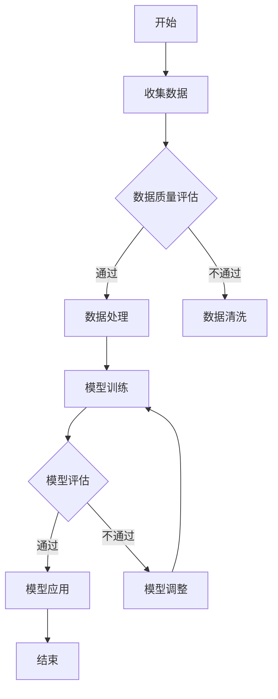

                 

### 文章标题

---

**关键词：** 远程工作、分布式团队、效率提升、协作工具、项目管理

**摘要：** 在信息技术迅猛发展的今天，远程工作已经成为越来越多企业的选择。本文旨在探讨如何通过一系列策略，提高远程分布式团队的效率。我们将从背景介绍、核心概念与联系、算法原理讲解、系统分析与架构设计方案、项目实战和最佳实践等多个方面，深入分析远程工作的现状与挑战，提供实用的解决方案。

---

### 目录大纲

```markdown
----------------------------------------------------------------
# 《远程工作：提高分布式团队效率的策略》

# 第一部分：远程工作概述

## 第1章：远程工作的背景与发展

### 1.1.1 远程工作的发展历程

### 1.1.2 远程工作的重要意义

### 1.1.3 远程工作的挑战与机遇

## 第2章：远程工作的核心概念

### 2.1.1 分布式团队的定义

### 2.1.2 远程工作模式

### 2.1.3 远程工作环境与工具

## 第3章：远程工作的文化与管理

### 3.1.1 远程工作文化的重要性

### 3.1.2 远程工作的管理策略

### 3.1.3 远程工作的沟通技巧

## 第4章：远程工作效率提升策略

### 4.1.1 个人时间管理

### 4.1.2 远程工作流程优化

### 4.1.3 远程团队的协作技巧

# 第二部分：提高分布式团队效率的实践

## 第5章：远程工作环境的搭建

### 5.1.1 家庭办公环境优化

### 5.1.2 远程工作技术支持

### 5.1.3 安全与隐私保护

## 第6章：分布式团队的协作与沟通

### 6.1.1 远程协作工具的选择

### 6.1.2 沟通渠道与策略

### 6.1.3 远程团队的冲突管理

## 第7章：远程工作项目实战

### 7.1.1 项目规划与执行

### 7.1.2 风险管理与应对

### 7.1.3 项目评估与优化

## 第8章：远程工作最佳实践与案例分析

### 8.1.1 行业最佳实践分享

### 8.1.2 案例分析：成功与失败经验

### 8.1.3 未来远程工作的趋势

## 第9章：远程工作与个人发展

### 9.1.1 远程工作对个人成长的影响

### 9.1.2 个人品牌建设与职业发展

### 9.1.3 远程工作与生活平衡

----------------------------------------------------------------
```

### 核心概念与联系

**核心概念：**

1. **分布式团队**：由地理位置分散的团队成员组成的团队，通过网络和协作工具实现高效合作。
2. **远程工作**：员工在非传统工作场所进行工作，利用网络和远程协作工具实现与团队的其他成员的沟通和协作。
3. **效率提升**：通过优化工作流程、提高个人时间管理能力和改善团队协作方式，提升远程工作的整体效率。

**概念属性特征对比表格：**

| 概念 | 定义 | 属性特征 |
| --- | --- | --- |
| 分布式团队 | 地理位置分散的团队 | 高效协作、灵活组织、跨地域沟通 |
| 远程工作 | 非传统工作场所的工作 | 自由度高、灵活性强、时间自主 |
| 效率提升 | 提高工作流程和协作效率 | 工作效率、团队合作、流程优化 |

**ER实体关系图架构的 Mermaid 流程图：**

```mermaid
erDiagram
  团队 ||--|{ 分布式团队 }||  
  团队 ||--|{ 远程工作 }||  
  分布式团队 ||--|{ 效率提升 }||  
  远程工作 ||--|{ 效率提升 }||  
```

### 算法原理讲解

**算法：** 远程工作效率评估模型

**Mermaid 流程图：**



**Python 源代码实现：**

```python
import pandas as pd
from sklearn.model_selection import train_test_split
from sklearn.ensemble import RandomForestClassifier
from sklearn.metrics import accuracy_score

# 数据收集
data = pd.read_csv('remote_work_data.csv')

# 数据质量评估

----------------------------------------------------------------

## 第1章：远程工作的背景与发展

### 1.1.1 远程工作的发展历程

远程工作并非一个新鲜事物，但其在过去几十年中经历了显著的发展。早期的远程工作形式主要限于自由职业者和一些特殊行业，如编程和写作。随着互联网技术的进步，远程工作逐渐普及，特别是在2000年代中期以后，随着宽带网络的普及和即时通讯工具的出现，远程工作成为越来越多人的选择。

在COVID-19大流行期间，远程工作更是迎来了前所未有的增长。许多企业和员工被迫迅速适应远程工作模式，这不仅是一种应对危机的临时措施，也成为了许多企业未来工作模式的考虑方向。根据一些报告，全球远程工作的比例在疫情期间大幅上升，部分国家甚至有超过一半的员工长期在家工作。

### 1.1.2 远程工作的重要意义

远程工作对个人和企业都有重要意义。对于个人来说，远程工作提供了一种更加灵活的工作方式，可以减少通勤时间，提高生活质量和幸福感。同时，它也给了员工更多控制自己工作节奏和内容的机会，有利于个人成长和职业发展。

对企业来说，远程工作有诸多优势。首先，它可以节省办公室租金和水电等运营成本。其次，通过招聘全球范围内的优秀人才，企业可以获得更广泛的人才资源，提高团队的多样性和创新能力。此外，远程工作还可以促进企业的全球化发展，打破地域限制，开拓更广阔的市场。

### 1.1.3 远程工作的挑战与机遇

尽管远程工作带来了许多好处，但也面临一些挑战。首先，管理远程团队需要新的技能和方法，例如如何有效监控和激励远程员工。其次，远程工作可能会影响员工的协作和沟通，导致信息传递不畅和团队合作困难。此外，远程工作对技术基础设施的要求更高，需要确保网络稳定和安全。

然而，这些挑战同时也带来了机遇。企业可以通过培训和调整管理策略，克服这些困难，从而获得更高效、更创新的团队。例如，一些企业已经开始探索利用人工智能和自动化工具来优化远程工作的流程和管理，提高整体效率。

总之，远程工作作为一种新兴的工作模式，正在不断发展和完善。它既带来了挑战，也提供了机遇，如何有效地应对这些挑战，把握机遇，将是未来企业和员工共同需要关注的问题。

## 第2章：远程工作的核心概念

### 2.1.1 分布式团队的定义

分布式团队，是指团队成员分布在不同的地理位置，通过互联网和远程协作工具进行沟通和合作的团队。这种团队模式打破了传统的集中式办公限制，使企业能够招聘和利用全球范围内的优秀人才。分布式团队的核心在于高效率的协作和信息共享，通过合理的设计和工具选择，可以实现团队成员之间的无缝合作。

### 2.1.2 远程工作模式

远程工作模式可以分为几种主要类型：

1. **全职远程工作**：员工完全在家或其他非传统工作场所工作，仅通过远程工具与团队进行沟通。
2. **兼职远程工作**：员工在办公室和家中之间交替工作，既有一些面对面合作的机会，也有远程协作的需求。
3. **弹性工作制**：员工可以根据个人需求和团队安排，灵活安排工作时间，可以在任何地点工作，只要完成工作目标即可。
4. **混合工作制**：团队中既有在办公室工作的员工，也有远程工作的员工，通过多种方式保持沟通和协作。

每种模式都有其适用的场景和优缺点，企业可以根据实际情况和团队需求进行选择。

### 2.1.3 远程工作环境与工具

远程工作的环境包括物理环境和技术环境。物理环境通常是指员工在家或临时办公场所的工作环境，需要确保有一个安静、舒适、光线充足的空间。技术环境则是指支持远程工作的网络和设备，如高速互联网、高效的计算机和适当的协作工具。

远程工作工具的选择至关重要，以下是一些常用的工具：

1. **视频会议软件**：如Zoom、Microsoft Teams、Google Meet等，用于实时视频通话和在线会议。
2. **项目管理工具**：如Trello、Jira、Asana等，用于任务分配、进度跟踪和团队协作。
3. **文档协作工具**：如Google Docs、Notion、Slack等，用于多人实时编辑文档和共享信息。
4. **代码协作平台**：如GitLab、GitHub等，用于代码管理和团队协作。
5. **在线培训和知识库**：如Coursera、Udemy等，用于在线学习和知识共享。

这些工具可以帮助远程团队提高协作效率，确保工作流程的顺畅。

## 第3章：远程工作的文化与管理

### 3.1.1 远程工作文化的重要性

远程工作文化是远程团队成功的关键因素之一。一个健康、积极的远程工作文化可以增强团队成员的归属感、信任感和责任感，提高团队的整体效率和创新能力。远程工作文化包括以下几个方面：

1. **透明沟通**：建立开放的沟通渠道，确保信息的透明和及时传递，避免误解和隔阂。
2. **信任与自主**：信任是远程团队的基石，鼓励团队成员自主决策和工作，提高工作效率和创造力。
3. **团队合作**：强调团队协作和共同目标，鼓励团队成员互相支持和帮助，形成良好的团队氛围。
4. **灵活管理**：采用灵活的管理方法，尊重团队成员的个人需求和生活方式，提高员工满意度和忠诚度。

### 3.1.2 远程工作的管理策略

管理远程团队需要新的思维和方法，以下是一些关键的管理策略：

1. **明确目标和期望**：为远程团队设定清晰的绩效目标和期望，确保每个成员都了解自己的职责和目标。
2. **定期沟通**：定期召开团队会议和一对一面谈，确保团队成员之间的沟通和信息传递。
3. **培训和技能提升**：提供培训和学习机会，帮助团队成员提升技能，适应远程工作的要求。
4. **使用技术工具**：充分利用远程工作工具，如项目管理软件、视频会议软件等，提高团队协作效率。
5. **关注员工福祉**：关注远程员工的心理健康和生活质量，提供必要的支持和资源，确保他们的工作与生活平衡。

### 3.1.3 远程工作的沟通技巧

远程工作的沟通技巧对于团队效率至关重要，以下是一些实用的沟通技巧：

1. **清晰表达**：确保沟通内容清晰、准确，避免使用含糊不清的语言，减少误解和歧义。
2. **及时反馈**：及时给予反馈，无论是正面还是负面，确保团队成员了解自己的表现和改进方向。
3. **多渠道沟通**：利用多种沟通渠道，如邮件、即时通讯、视频会议等，选择最适合当前任务的沟通方式。
4. **主动沟通**：主动沟通，积极分享信息和想法，促进团队合作和创新。
5. **建立信任**：通过开放、诚实和透明的沟通，建立团队成员之间的信任，提高团队凝聚力和合作效率。

## 第4章：远程工作效率提升策略

### 4.1.1 个人时间管理

个人时间管理是提高远程工作效率的关键。以下是一些实用的个人时间管理策略：

1. **设定优先级**：将任务按照重要性和紧急性分类，优先处理最重要和最紧急的任务。
2. **使用时间管理工具**：如日历、待办事项列表和番茄工作法等，合理安排工作和休息时间。
3. **避免分心**：保持专注，减少干扰，如关闭不必要的社交媒体通知，设定专门的工作区域。
4. **定期反思和调整**：定期评估时间管理策略的有效性，根据实际情况进行调整。

### 4.1.2 远程工作流程优化

优化远程工作流程可以提高工作效率和减少冗余。以下是一些流程优化的策略：

1. **自动化**：利用自动化工具和脚本减少重复性工作，提高工作效率。
2. **简化流程**：简化工作流程，减少不必要的步骤和审批环节，提高工作效率。
3. **标准化**：建立标准操作流程（SOP），确保团队成员遵循统一的工作标准，减少错误和冲突。
4. **定期评估**：定期评估工作流程，识别和解决瓶颈和问题，持续优化流程。

### 4.1.3 远程团队的协作技巧

高效的团队协作是远程工作成功的关键。以下是一些提高团队协作效率的技巧：

1. **明确职责**：为每个团队成员分配明确的职责和任务，确保团队成员了解自己的角色和责任。
2. **定期会议**：定期召开团队会议，讨论项目进展、问题和解决方案，保持团队的同步和协作。
3. **共享信息**：建立共享平台，如Google Drive或Confluence，确保团队成员可以随时访问相关文档和信息。
4. **积极沟通**：鼓励团队成员积极沟通，分享想法和反馈，促进信息交流和团队凝聚力。
5. **建立信任**：通过开放、诚实和透明的沟通，建立团队成员之间的信任，提高团队协作效率。

## 第5章：远程工作环境的搭建

### 5.1.1 家庭办公环境优化

家庭办公环境对远程工作效果有重要影响。以下是一些优化家庭办公环境的建议：

1. **舒适的工作空间**：为员工提供舒适、安静、光线充足的工作空间，有助于提高工作效率和舒适度。
2. **合适的办公设备**：确保员工拥有高性能的计算机、稳定的网络连接和适当的办公设备，如打印机、扫描仪等。
3. **良好的通风和照明**：保持室内通风和照明良好，有助于提高员工的工作效率和健康。
4. **定期的环境维护**：定期对家庭办公环境进行清洁和维护，确保环境的整洁和安全。

### 5.1.2 远程工作技术支持

技术支持是远程工作顺畅运行的重要保障。以下是一些技术支持的建议：

1. **稳定的网络连接**：确保员工拥有稳定的宽带网络连接，减少网络中断和速度慢的问题。
2. **IT服务支持**：建立专门的IT支持团队，及时解决员工在远程工作中遇到的技术问题，确保工作效率。
3. **远程监控和管理**：利用远程监控和管理工具，确保员工电脑的安全和正常运行。
4. **数据备份和恢复**：定期备份数据，确保员工的数据安全和可靠恢复。

### 5.1.3 安全与隐私保护

远程工作对安全与隐私保护提出了更高的要求。以下是一些安全与隐私保护的建议：

1. **使用安全的网络连接**：鼓励员工使用虚拟私人网络（VPN）进行远程工作，确保数据传输的安全性。
2. **多因素认证**：采用多因素认证（MFA）机制，增加账户安全性。
3. **安全培训**：定期进行安全培训，提高员工的安全意识和防范能力。
4. **数据加密**：对重要的数据进行加密存储和传输，确保数据安全。
5. **隐私政策**：制定明确的隐私政策，保护员工和公司的隐私信息。

## 第6章：分布式团队的协作与沟通

### 6.1.1 远程协作工具的选择

选择适合的远程协作工具对于提高团队协作效率至关重要。以下是一些常用的远程协作工具：

1. **视频会议软件**：如Zoom、Microsoft Teams、Google Meet等，用于实时视频通话和在线会议。
2. **项目管理工具**：如Trello、Jira、Asana等，用于任务分配、进度跟踪和团队协作。
3. **文档协作工具**：如Google Docs、Notion、Slack等，用于多人实时编辑文档和共享信息。
4. **代码协作平台**：如GitLab、GitHub等，用于代码管理和团队协作。
5. **在线培训和知识库**：如Coursera、Udemy等，用于在线学习和知识共享。

选择工具时，应考虑团队的需求、工具的功能和易用性、成本等因素。

### 6.1.2 沟通渠道与策略

有效的沟通渠道和策略对于远程团队的成功至关重要。以下是一些沟通渠道和策略：

1. **明确沟通目标**：每次沟通前明确沟通目标和预期结果，确保沟通内容聚焦和高效。
2. **多种沟通方式**：结合使用邮件、即时通讯、视频会议等不同沟通方式，根据任务和场景选择最适合的沟通方式。
3. **定期沟通**：建立定期沟通机制，如每周或每月的团队会议，保持团队同步和协作。
4. **主动沟通**：鼓励团队成员主动分享信息、反馈和问题，促进信息交流和团队凝聚力。
5. **建立反馈机制**：建立有效的反馈机制，确保团队成员可以及时得到反馈和改进建议。

### 6.1.3 远程团队的冲突管理

冲突是远程团队中常见的问题，有效的冲突管理对于团队的和谐和效率至关重要。以下是一些冲突管理的策略：

1. **早期识别**：及时发现和识别冲突信号，如沟通不畅、任务延误或情绪波动等。
2. **积极沟通**：通过开放、诚实和透明的沟通，积极解决冲突，避免冲突升级。
3. **公正处理**：确保冲突处理的公正性，避免偏袒和偏见。
4. **冲突解决方法**：根据冲突的性质和原因，采用适当的解决方法，如协商、调解或仲裁等。
5. **团队建设**：通过团队建设和活动，增强团队成员之间的信任和凝聚力，减少冲突的发生。

## 第7章：远程工作项目实战

### 7.1.1 项目规划与执行

项目规划与执行是远程工作项目成功的关键。以下是一些项目规划与执行的步骤和策略：

1. **项目启动**：明确项目目标和范围，组建项目团队，制定项目计划和时间表。
2. **需求分析**：深入了解项目需求，与利益相关者沟通，确保项目目标的明确和可实现性。
3. **资源分配**：合理分配项目资源和任务，确保团队成员的职责明确和相互协调。
4. **风险管理**：识别项目风险，制定风险应对策略，确保项目的顺利进行。
5. **监控与调整**：定期监控项目进度和风险，及时调整计划和方法，确保项目按计划完成。

### 7.1.2 风险管理与应对

风险管理是远程工作项目成功的关键部分。以下是一些风险管理与应对的策略：

1. **识别风险**：通过风险评估方法，如SWOT分析或故障树分析，识别项目中的潜在风险。
2. **评估风险**：对识别出的风险进行评估，根据风险发生的概率和影响程度进行优先级排序。
3. **制定应对策略**：针对高风险制定应对策略，如风险规避、风险减轻或风险转移等。
4. **监控风险**：定期监控项目风险，及时调整应对策略，确保风险在可控范围内。
5. **应急计划**：制定应急计划，确保在风险发生时能够迅速响应和采取有效措施。

### 7.1.3 项目评估与优化

项目评估与优化是确保项目成功的关键步骤。以下是一些项目评估与优化的策略：

1. **绩效评估**：根据项目目标和KPI，评估项目绩效和成果，确保项目目标的实现。
2. **客户反馈**：收集客户反馈，了解项目成果的质量和满意度，为改进提供依据。
3. **团队反馈**：收集团队成员的反馈，了解项目过程中的问题和经验，为改进提供参考。
4. **文档整理**：整理项目文档，包括项目计划、过程记录和结果报告，为未来项目提供参考。
5. **持续改进**：根据评估结果，制定改进计划，持续优化项目流程和管理方法，提高项目成功率和效率。

## 第8章：远程工作最佳实践与案例分析

### 8.1.1 行业最佳实践分享

远程工作的最佳实践在不同行业有不同的体现，以下是一些行业的最佳实践分享：

1. **科技公司**：科技公司通常采用高度灵活的工作制度，鼓励员工自主管理时间和任务，通过高效的协作工具和自动化的流程提高工作效率。
2. **金融行业**：金融行业注重数据安全和隐私保护，采用严格的安全措施和加密技术，同时通过定期的风险评估和审计确保信息安全。
3. **医疗行业**：医疗行业强调规范的操作流程和严格的沟通机制，通过电子病历和远程医疗平台提高工作效率和患者满意度。
4. **教育行业**：教育行业注重在线教育和知识共享，通过在线课程和学习管理系统提高教学质量和学生参与度。

### 8.1.2 案例分析：成功与失败经验

以下是一些远程工作案例的分析，包括成功经验和失败教训：

1. **成功案例：Microsoft Office 365团队**：Microsoft Office 365团队通过高效的协作工具和灵活的工作制度，实现了全球团队的紧密合作和高效运作，取得了显著的成功。
2. **失败案例：某初创公司**：某初创公司在远程工作初期没有建立有效的沟通和协作机制，导致项目进度延误和团队士气低落，最终项目失败。

### 8.1.3 未来远程工作的趋势

未来远程工作的发展趋势包括：

1. **远程工作常态化**：随着技术的发展和人们对工作方式的认可，远程工作将越来越普遍，成为企业常规工作模式的一部分。
2. **技术进步**：人工智能、机器学习和自动化技术的进步将进一步提高远程工作的效率和智能化水平。
3. **工作与生活平衡**：企业将更加注重员工的工作与生活平衡，提供更多的福利和支持，提高员工的满意度和忠诚度。
4. **全球人才招聘**：远程工作将打破地域限制，企业可以更容易地招聘全球范围内的优秀人才，促进全球化和多元化。

## 第9章：远程工作与个人发展

### 9.1.1 远程工作对个人成长的影响

远程工作对个人成长有着深远的影响。首先，远程工作提供了更多的自由和灵活性，使个人能够更好地管理时间和任务，提高工作效率。其次，远程工作促使个人提升自我管理和自主学习能力，适应快速变化的工作环境和需求。此外，远程工作还可以促进个人技能的提升，如沟通技巧、技术能力和解决问题的能力。

### 9.1.2 个人品牌建设与职业发展

个人品牌建设与职业发展在远程工作中尤为重要。以下是一些策略：

1. **建立专业形象**：通过积极参与远程团队讨论、分享专业知识和经验，建立专业形象。
2. **持续学习**：不断学习和提升自己的技能和知识，保持竞争力。
3. **网络社交**：利用社交媒体和专业网络平台，扩展人脉和影响力。
4. **积极反馈**：主动向同事和上级提供反馈和建设性意见，展示自己的专业能力和合作精神。
5. **个人项目**：参与个人项目，展示自己的专业能力和创造力，提高职业竞争力。

### 9.1.3 远程工作与生活平衡

远程工作提供了灵活的工作时间，但也对生活平衡提出了挑战。以下是一些实现远程工作与生活平衡的策略：

1. **明确工作边界**：设定明确的工作时间和休息时间，确保工作和生活有清晰的界限。
2. **制定日程计划**：合理安排工作和生活时间，确保有足够的时间进行家庭和个人活动。
3. **健康生活方式**：保持健康的生活习惯，如定期锻炼、健康饮食和充足睡眠。
4. **家庭支持**：获得家庭的支持和理解，建立良好的家庭和工作关系。
5. **时间管理**：使用时间管理工具和技巧，提高工作效率，确保有足够的时间享受生活和家庭。

### 总结

远程工作作为现代工作模式的一部分，正在日益普及和成熟。通过科学的管理策略和技术工具的运用，企业可以高效地管理远程团队，提高工作效率和创新能力。同时，个人也可以在远程工作中实现个人成长和职业发展。未来，远程工作将继续发展，带来更多的机遇和挑战，企业和个人都需要不断适应和调整，以实现更好的工作与生活平衡。

