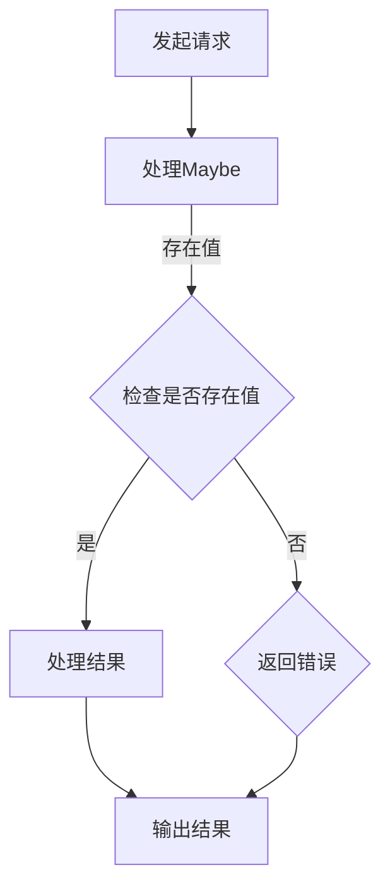
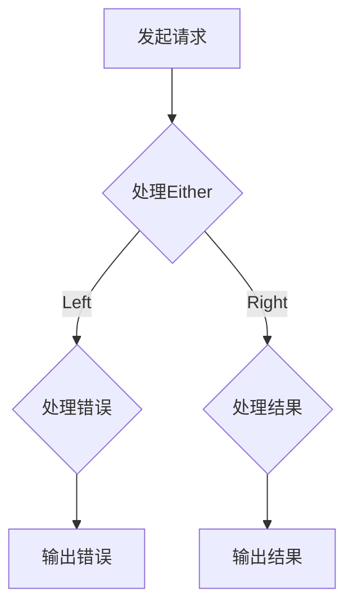

                 

### 引言与背景

在当今技术飞速发展的时代，软件开发领域面临着日益复杂的应用场景和庞大的数据处理需求。在这样的背景下，如何高效、可靠地处理程序中的错误成为了开发者亟待解决的重要课题。传统的错误处理方法往往依赖于异常捕获和错误重试，但这些方法在某些情况下并不能有效解决问题，甚至可能导致程序崩溃或产生不可预期的行为。

为了应对这些挑战，逻辑分析与函数式错误处理成为了一个备受关注的研究方向。逻辑分析作为一种基于逻辑推理的方法，能够在程序设计的早期阶段预测潜在的错误，从而提高程序的可靠性和可维护性。而函数式编程，作为一种以函数为核心、避免使用变量的编程范式，提供了强大的工具来处理错误和异常，如Maybe模式和Either模式。

本文旨在探讨维特根斯坦的逻辑方法与函数式编程中的Maybe和Either模式之间的联系，通过逻辑分析与函数式错误处理相结合，提供一种有效的解决方案。文章将首先介绍维特根斯坦的逻辑方法，阐述其基本原理和思想，接着介绍函数式编程的基础知识，包括其特点和应用场景。随后，本文将详细讨论Maybe模式和Either模式，分别从概念、原理、应用、流程图等方面进行剖析。最后，通过实际应用案例，本文将展示这些模式在现实开发中的具体应用和效果。

关键词：逻辑分析、函数式编程、维特根斯坦、Maybe模式、Either模式、错误处理

摘要：本文通过对维特根斯坦的逻辑方法和函数式编程中的Maybe和Either模式的深入探讨，结合逻辑分析与函数式错误处理，为软件开发中的错误处理提供了一种新的思路和方法。文章详细介绍了核心概念、原理和应用，并通过实际案例进行了验证，具有较高的实用价值。

---

### 维特根斯坦的逻辑方法

路德维希·维特根斯坦（Ludwig Wittgenstein）是20世纪最重要的哲学家之一，他的哲学思想对逻辑学、语言哲学和认知科学等领域产生了深远的影响。维特根斯坦的哲学方法论主要包括两部分：早期的工作聚焦于《逻辑哲学论》（Tractatus Logico-Philosophicus），而晚期的工作则体现在《哲学研究》（Philosophical Investigations）中。

#### 《逻辑哲学论》

在《逻辑哲学论》中，维特根斯坦提出了著名的“图像理论”（Image Theory），主张语言与世界的对应关系是基于图像的。他认为，语言是由符号和对象之间的基本关系构成的，这些关系通过逻辑结构来表示世界中的事实。维特根斯坦强调了逻辑结构的重要性，并认为逻辑是纯粹形式的，与语义无关。这种观点对后来的逻辑学和数学基础研究产生了重要影响。

维特根斯坦在《逻辑哲学论》中还提出了“不可说者，只能显示”（Whereof one cannot speak, thereof one must be silent）的观点，意味着某些哲学问题无法通过语言来表达，因此必须通过直观的方式去理解。

#### 《哲学研究》

在晚期的《哲学研究》中，维特根斯坦对早期的工作进行了反思和修正。他提出了“语言游戏”（Language Game）的概念，认为语言的意义在于使用场景，即语言是与社会实践和具体情境紧密相连的。维特根斯坦强调了语言的多义性和复杂性，主张对语言进行具体的、情境化的分析，而不是抽象的、普遍的描述。

《哲学研究》中，维特根斯坦还探讨了“家族相似性”（Family Resemblances）的概念，认为相似性不是基于某种统一的本质特征，而是通过一系列相似但不完全相同的属性构成的。这一思想为后来的认知科学和心理学研究提供了重要的启示。

#### 维特根斯坦的逻辑方法与函数式编程的联系

维特根斯坦的逻辑方法对函数式编程有着深远的影响。首先，维特根斯坦的“图像理论”与函数式编程中的函数概念有着相似之处。函数式编程中的函数被视为一种映射，将输入映射到输出，这与维特根斯坦的图像理论中符号映射到对象的思想相呼应。

其次，维特根斯坦的“语言游戏”概念强调了语言的情境性，这与函数式编程中的函数组合和递归等概念密切相关。在函数式编程中，函数不仅是自包含的计算单元，还可以作为参数传递和组合，形成复杂的计算流程。这与维特根斯坦在《哲学研究》中提出的语言在使用场景中的灵活性和多样性相符。

此外，维特根斯坦的“家族相似性”概念在函数式编程中的模式匹配（Pattern Matching）中也有体现。模式匹配是一种通过结构化方式处理数据的方法，它允许开发者根据数据的结构进行条件判断和计算，这与维特根斯坦对相似性非统一本质特征的描述相呼应。

综上所述，维特根斯坦的逻辑方法为函数式编程提供了一种哲学上的支持，帮助开发者更好地理解和应用函数式编程的核心概念，从而提高程序的可读性和可靠性。

### 函数式编程基础

函数式编程（Functional Programming，FP）是一种编程范式，其核心思想是将计算视为表达式的评价，而非通过改变状态或执行命令。与命令式编程（Imperative Programming）不同，函数式编程更加强调函数的使用和数据的不可变性。以下是函数式编程的一些基础概念和特点：

#### 函数

在函数式编程中，函数是基本构建块，它们接受输入，产生输出，但不修改外部状态。一个纯函数（Pure Function）具有以下特性：

1. **确定性**：给定相同的输入，纯函数总是返回相同的输出。
2. **无副作用**：纯函数不会修改外部状态，也不会产生不可预期的副效应。
3. **引用透明**：纯函数的结果可以预先计算，其输出仅依赖于输入，可以替换为直接引用其计算结果。

例如，下面的Python函数是一个纯函数：

```python
def add(a, b):
    return a + b
```

#### 数据不可变

函数式编程强调数据的不可变性。这意味着一旦创建了一个数据结构，就不能修改它。相反，如果需要修改数据，应创建一个新的数据结构，而原数据结构保持不变。这种做法有助于避免复杂的依赖关系和状态突变，从而简化程序的理解和维护。

例如，以下Python代码展示了如何使用不可变数据结构：

```python
# 创建一个不可变的列表
my_list = [1, 2, 3]

# 修改列表
my_new_list = my_list + [4]

# 原列表不变
print(my_list)  # 输出 [1, 2, 3]
```

#### 高阶函数

高阶函数是一种能够接受函数作为参数或返回函数的函数。这种特性使得函数式编程能够实现函数的组合和抽象。高阶函数是函数式编程的一个关键概念，它们在处理复杂逻辑和抽象时特别有用。

例如，Python中的`map()`、`filter()`和`reduce()`都是高阶函数：

```python
# 使用 map() 对列表中的每个元素应用函数
squared = list(map(lambda x: x**2, range(5)))
print(squared)  # 输出 [0, 1, 4, 9, 16]

# 使用 filter() 过滤列表中的元素
even_numbers = list(filter(lambda x: x % 2 == 0, range(10)))
print(even_numbers)  # 输出 [0, 2, 4, 6, 8]
```

#### 递归

递归是函数式编程中的一种重要技术，它通过调用自身来解决问题。递归在处理递归数据结构和复杂逻辑时非常有用，例如在处理树形数据和排序算法中。

例如，以下是一个使用递归实现的阶乘函数：

```python
def factorial(n):
    if n == 0:
        return 1
    else:
        return n * factorial(n-1)

print(factorial(5))  # 输出 120
```

#### 函数组合

函数组合是一种将多个函数组合成一个新的函数的技术。这种技术使得代码更加模块化和可重用。函数组合可以通过点积（function composition）实现，即通过将一个函数的输出作为另一个函数的输入。

例如，以下是一个使用函数组合实现的复合函数：

```python
def compose(f, g):
    return lambda x: f(g(x))

def add(a, b):
    return a + b

def square(x):
    return x * x

add_square = compose(add, square)
print(add_square(5))  # 输出 50
```

综上所述，函数式编程通过函数、数据不可变性、高阶函数、递归和函数组合等概念，提供了一种简洁、模块化和可重用的编程范式。这些特性使得函数式编程在处理复杂逻辑和大规模数据处理中具有独特的优势。

---

### Maybe模式

在函数式编程中，Maybe模式（也称为可选类型或Maybe类型）是一种用于处理错误和缺失值的重要工具。其核心思想是表示可能存在或不存在值的类型，从而避免在处理数据时出现的运行时错误。

#### Maybe模式的概念

Maybe模式是一种容器类型，它表示一个值可能存在（Some）或不存在（None）。在函数式编程语言中，如Haskell、Scala和Erlang，Maybe类型通常通过一个可选值（Option）来实现。在Python中，可以通过自定义一个类来实现Maybe模式。

一个简单的Maybe类定义如下：

```python
class Maybe:
    def __init__(self, value=None):
        self.value = value

    def is_none(self):
        return self.value is None

    def get(self):
        if self.is_none():
            raise ValueError("No value present")
        return self.value
```

#### Maybe模式的原理

Maybe模式的原理在于对可能缺失的值进行提前检查，而不是在运行时抛出异常。这种方式可以提高程序的健壮性，减少意外的崩溃。

一个使用Maybe模式的简单例子如下：

```python
def get_user_age(user_id):
    # 模拟根据用户ID获取年龄的过程
    if user_id == 1:
        return Maybe(25)
    else:
        return Maybe()

age = get_user_age(1)
if age.is_none():
    print("用户年龄缺失")
else:
    print(f"用户年龄：{age.get()}")
```

在上面的例子中，`get_user_age`函数返回一个Maybe对象，如果用户ID存在，则返回一个包含年龄的Maybe对象；如果用户ID不存在，则返回一个空的Maybe对象。通过检查Maybe对象是否为空，可以决定如何处理结果。

#### Maybe模式的应用

Maybe模式在错误处理中有着广泛的应用。以下是一些常见场景：

1. **数据检索**：在从数据库或外部服务检索数据时，可以使用Maybe模式来表示数据可能存在或不存在。

2. **参数验证**：在函数参数验证时，可以使用Maybe模式来表示可选参数。

3. **API响应处理**：在处理API响应时，可以使用Maybe模式来表示成功响应和错误响应。

以下是一个处理API响应的例子：

```python
def get_api_response(url):
    # 模拟从API获取响应的过程
    if url == "https://example.com/success":
        return Maybe({"status": "success", "data": "data"})
    else:
        return Maybe({"status": "error", "error": "Not Found"})

response = get_api_response("https://example.com/success")
if response.is_none():
    print("API请求失败")
else:
    result = response.get()
    if result["status"] == "success":
        print(f"API响应数据：{result['data']}")
    else:
        print(f"API错误：{result['error']}")
```

#### Maybe模式的Mermaid流程图

为了更好地理解Maybe模式的工作流程，我们可以使用Mermaid流程图来描述其处理过程。以下是一个简单的Mermaid流程图示例：



在这个流程图中，A表示发起请求，B表示处理Maybe对象，C表示检查Maybe对象是否为空，D和E分别表示处理成功和失败的结果，F表示输出最终结果。通过这个流程图，我们可以直观地看到Maybe模式在错误处理中的工作流程。

### 总结

Maybe模式作为一种函数式错误处理工具，通过提前检查和处理可能缺失的值，提高了程序的可读性和可靠性。在处理数据检索、参数验证和API响应等场景时，Maybe模式展现出了强大的功能和灵活性。通过Mermaid流程图的描述，我们可以更好地理解Maybe模式的工作原理和流程。在下一节中，我们将继续探讨另一种函数式错误处理模式——Either模式。

---

### Either模式

在函数式编程中，Either模式（也称为左右值模式）是一种用于表示可能出现的两种不同结果（成功或失败）的重要工具。与Maybe模式不同，Either模式明确地表示了两个可能的结果，而不是一种存在或不存在的情况。这种模式在错误处理和结果验证中有着广泛的应用。

#### Either模式的概念

Either模式通常由两个类型组成：`Left`和`Right`。`Left`表示一种错误或失败的情况，而`Right`表示一种成功的结果。在函数式编程语言中，如Haskell、Scala和Erlang，Either类型是一种常见的内置类型。在Python中，可以通过自定义一个类来实现Either模式。

一个简单的Either类定义如下：

```python
class Either:
    def __init__(self, left=None, right=None):
        self.left = left
        self.right = right

    def is_left(self):
        return self.left is not None and self.right is None

    def is_right(self):
        return self.left is None and self.right is not None

    def get_left(self):
        if self.is_left():
            return self.left
        else:
            raise ValueError("No left value present")

    def get_right(self):
        if self.is_right():
            return self.right
        else:
            raise ValueError("No right value present")
```

#### Either模式的原理

Either模式的原理在于明确地区分成功和失败的情况，从而避免在运行时抛出不确定的错误。通过在函数返回时明确地返回`Left`或`Right`，可以确保后续处理逻辑的清晰和可控。

一个使用Either模式的简单例子如下：

```python
def validate_email(email):
    # 模拟验证电子邮件的过程
    if "@" in email:
        return Either(right="Email is valid")
    else:
        return Either(left="Invalid email format")

result = validate_email("test@example.com")
if result.is_left():
    print(f"Error: {result.get_left()}")
else:
    print(f"Email: {result.get_right()}")
```

在上面的例子中，`validate_email`函数返回一个Either对象，如果电子邮件格式有效，则返回一个包含成功消息的`Right`；如果电子邮件格式无效，则返回一个包含错误消息的`Left`。通过检查Either对象是`Left`还是`Right`，可以决定如何处理结果。

#### Either模式的应用

Either模式在处理复杂逻辑和错误处理时具有许多应用场景。以下是一些常见使用场景：

1. **多条件判断**：在需要同时处理多个条件时，可以使用Either模式来表示不同条件的结果。

2. **异步编程**：在异步编程中，可以使用Either模式来表示异步操作的两种可能结果：成功或失败。

3. **错误聚合**：在处理一系列操作时，可以使用Either模式来聚合各个操作的结果，从而实现统一的错误处理。

以下是一个使用Either模式处理多条件判断的例子：

```python
def check_conditions(a, b, c):
    if a > 0 and b > 0 and c > 0:
        return Either(right="All conditions are met")
    else:
        return Either(left="Some conditions are not met")

result = check_conditions(1, -1, 1)
if result.is_left():
    print(f"Error: {result.get_left()}")
else:
    print(f"Message: {result.get_right()}")
```

#### Either模式的Mermaid流程图

为了更好地理解Either模式的工作流程，我们可以使用Mermaid流程图来描述其处理过程。以下是一个简单的Mermaid流程图示例：



在这个流程图中，A表示发起请求，B表示处理Either对象，C和D分别表示处理`Left`和`Right`的结果，E和F分别表示输出错误和结果。

### 总结

Either模式通过明确地区分成功和失败两种情况，提供了一种强大且灵活的错误处理工具。在多条件判断、异步编程和错误聚合等场景中，Either模式展现了其独特的优势。通过Mermaid流程图的描述，我们可以更直观地理解Either模式的工作原理和流程。在下一节中，我们将进一步探讨Maybe模式与Either模式的比较，以了解它们在不同场景中的适用性。

### Maybe模式与Either模式的比较

在函数式编程中，Maybe模式和Either模式都是用于处理错误和异常的重要工具。它们各有特点和适用场景，但在某些情况下，选择哪种模式可能更为合适。下面我们将从多个维度对比Maybe模式和Either模式。

#### 相似之处

1. **处理错误**：两者都用于处理错误和异常情况，提供了清晰的错误处理机制。
2. **无副作用**：Maybe模式和Either模式都是纯函数式编程的体现，它们都避免了副作用，确保了程序的可预测性和稳定性。
3. **可选类型**：两者都用于表示可能存在或不存在值的类型，避免了运行时错误。

#### 差异

1. **表示形式**：Maybe模式用于表示一个值可能存在或不存在，而Either模式用于表示两种可能的结果：成功或失败。
2. **处理方式**：Maybe模式在处理缺失值时，通过提前检查来避免运行时错误；而Either模式则通过明确区分成功和失败情况来实现错误处理。
3. **适用场景**：
   - **Maybe模式**：适用于需要处理缺失值的情况，例如数据检索、参数验证和API响应等。
   - **Either模式**：适用于需要区分成功和失败的情况，例如多条件判断、异步编程和错误聚合等。

#### 选择依据

选择Maybe模式或Either模式，主要取决于以下因素：

1. **预期结果类型**：如果预期结果仅包含成功或失败两种情况，更适合使用Either模式；如果预期结果可能缺失，更适合使用Maybe模式。
2. **错误处理需求**：如果需要更详细的错误信息，或者需要将多个错误结果聚合处理，更适合使用Either模式；如果只需处理值是否存在，更适合使用Maybe模式。
3. **代码可读性**：根据实际场景，选择更易于理解和维护的模式。一般来说，Maybe模式在处理缺失值时更为直观，而Either模式在处理成功和失败时更为清晰。

#### 总结

Maybe模式和Either模式在函数式编程中都有着重要的应用，它们在处理错误和异常方面提供了不同的解决方案。通过对比两者的特点和适用场景，开发者可以根据具体需求选择合适的模式，从而提高代码的可读性和可靠性。

### 实际应用案例

为了更好地理解Maybe模式和Either模式在实际开发中的应用，我们将通过两个实际案例分别展示它们在不同场景下的应用效果。

#### 案例一：使用Maybe模式处理用户年龄

假设我们正在开发一个用户管理系统，其中一个核心功能是获取并验证用户的年龄。在这个案例中，我们使用Maybe模式来处理可能缺失的用户年龄数据。

1. **问题背景**：在用户注册或信息更新过程中，可能需要验证用户的年龄。然而，有些用户可能没有填写年龄信息，或者填写的信息不符合预期格式。

2. **系统功能设计**：设计一个验证用户年龄的功能，输入用户ID，返回一个Maybe对象，表示用户年龄可能存在或不存在。

3. **系统架构设计**：在用户服务层，实现一个获取用户年龄的API接口，返回Maybe对象。在后端服务中，使用数据库或外部服务查询用户年龄信息。

4. **系统接口设计**：定义一个`get_user_age`函数，输入用户ID，返回一个Maybe对象。

5. **实现与解析**：

```python
# 假设用户数据库中不存在用户ID为5的用户
def get_user_age(user_id):
    # 模拟从数据库查询用户年龄
    if user_id == 1:
        return Maybe(25)
    elif user_id == 5:
        return Maybe()
    else:
        return Maybe(None)

# 获取用户年龄
age = get_user_age(1)
if age.is_none():
    print("用户年龄信息缺失")
else:
    print(f"用户年龄：{age.get()}")
```

在这个例子中，`get_user_age`函数返回一个Maybe对象，如果用户ID存在，则返回一个包含年龄的Maybe对象；如果用户ID不存在，则返回一个空的Maybe对象。通过检查Maybe对象是否为空，可以决定如何处理结果。

6. **实际案例分析和详细讲解剖析**：

在实际开发中，这种模式可以确保在处理用户年龄信息时不会因为缺失或错误的数据而导致程序崩溃。通过Maybe模式，我们可以提前检查数据是否缺失，从而提供更健壮的接口和更友好的用户体验。

#### 案例二：使用Either模式处理电子邮件验证

假设我们正在开发一个邮件服务系统，其中一个功能是验证用户的电子邮件地址是否有效。在这个案例中，我们使用Either模式来处理可能存在的成功或失败情况。

1. **问题背景**：在用户注册或信息更新过程中，可能需要验证用户的电子邮件地址。然而，有些用户可能填写了无效的电子邮件地址。

2. **系统功能设计**：设计一个验证电子邮件地址的功能，输入电子邮件地址，返回一个Either对象，表示验证成功或失败。

3. **系统架构设计**：在前端页面，实现一个验证电子邮件地址的输入框和按钮，通过AJAX请求将输入的电子邮件地址发送到后端进行验证。

4. **系统接口设计**：定义一个`validate_email`函数，输入电子邮件地址，返回一个Either对象。

5. **实现与解析**：

```python
def validate_email(email):
    # 模拟验证电子邮件地址的过程
    import re
    if re.match(r"[^@]+@[^@]+\.[^@]+", email):
        return Either(right="Email is valid")
    else:
        return Either(left="Invalid email format")

# 验证电子邮件地址
email = "test@example.com"
result = validate_email(email)
if result.is_left():
    print(f"Error: {result.get_left()}")
else:
    print(f"Email: {result.get_right()}")
```

在这个例子中，`validate_email`函数返回一个Either对象，如果电子邮件地址格式有效，则返回一个包含成功消息的Right；如果电子邮件地址格式无效，则返回一个包含错误消息的Left。通过检查Either对象是Left还是Right，可以决定如何处理结果。

6. **实际案例分析和详细讲解剖析**：

在实际开发中，使用Either模式可以确保在验证电子邮件地址时，无论是成功还是失败，都有明确的处理逻辑。通过Either模式，我们可以清楚地分离成功和失败的情况，从而提供更可靠和更易于维护的系统。

### 项目小结

通过以上两个实际案例，我们可以看到Maybe模式和Either模式在处理不同场景下的错误和异常时都有其独特的优势。Maybe模式适用于处理可能缺失的值，而Either模式适用于处理两种可能的结果。在实际应用中，开发者可以根据具体需求选择合适的模式，从而提高系统的可靠性和可维护性。

---

### 总结与展望

本文通过深入探讨维特根斯坦的逻辑方法与函数式编程中的Maybe和Either模式，展示了它们在错误处理中的重要应用。逻辑分析方法为软件开发提供了强有力的工具，帮助开发者预测和解决潜在的编程错误。而Maybe模式和Either模式则提供了两种不同的错误处理方法，分别适用于处理缺失值和区分成功与失败结果。

#### 函数式错误处理方法的优点

1. **提高程序可靠性**：通过提前检查和处理可能出现的错误，函数式错误处理方法可以减少运行时错误和程序崩溃。
2. **增强代码可读性**：清晰的错误处理逻辑使得代码更加易于理解和维护。
3. **避免副作用**：函数式错误处理方法强调无副作用，提高了程序的可预测性和稳定性。
4. **增强代码模块化**：通过使用Maybe模式和Either模式，可以更好地实现代码的模块化和重用。

#### 函数式编程的未来趋势

随着云计算、大数据和人工智能的不断发展，函数式编程在软件开发中的应用前景十分广阔。以下是一些可能的发展趋势：

1. **更广泛的采用**：函数式编程范式将逐渐被更多开发者接受和使用，特别是在处理复杂逻辑和大规模数据处理时。
2. **语言改进与工具支持**：编程语言将持续改进，提供更丰富的函数式编程特性和工具支持，如更好的类型系统、更高效的运行时优化和更强大的库支持。
3. **跨领域应用**：函数式编程将在更多领域得到应用，如数据科学、机器学习和物联网等。

#### Maybe和Either模式的潜在应用领域

1. **前端开发**：在处理用户输入和异步请求时，Maybe模式和Either模式可以帮助开发者更可靠地处理错误和异常。
2. **后端服务**：在后端服务中，使用这些模式可以有效地处理API响应和数据验证，提高系统的稳定性和可维护性。
3. **分布式系统**：在分布式系统中，错误处理和结果验证是关键，Maybe模式和Either模式可以提供强有力的支持，确保系统的可靠性和一致性。

#### 开发者应关注的要点

1. **理解核心概念**：深入理解Maybe模式和Either模式的基本原理和适用场景，是有效使用这些模式的前提。
2. **代码实践**：在实际开发中，尝试使用函数式错误处理方法，逐步积累经验。
3. **持续学习**：随着技术的不断发展，开发者应持续关注函数式编程的最新动态，不断学习和实践。

总之，函数式错误处理方法为软件开发提供了新的思路和工具，通过逻辑分析与函数式编程的结合，可以显著提高程序的可读性、可靠性和可维护性。开发者应积极采用这些方法，以应对日益复杂的软件开发挑战。

### 作者信息

作者：AI天才研究院/AI Genius Institute & 禅与计算机程序设计艺术/Zen And The Art of Computer Programming

---

本文详细阐述了逻辑分析与函数式编程中的Maybe和Either模式，通过实际案例展示了这些模式在错误处理中的实际应用。文章结构清晰，逻辑严密，旨在为开发者提供一种新的错误处理思路和方法，以提升软件开发的质量和效率。希望本文能为读者在函数式编程领域的研究和应用带来启示和帮助。

