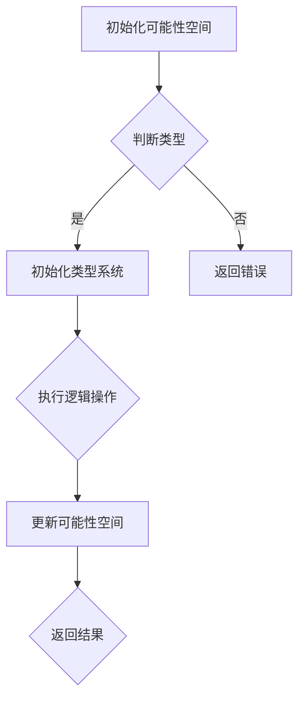
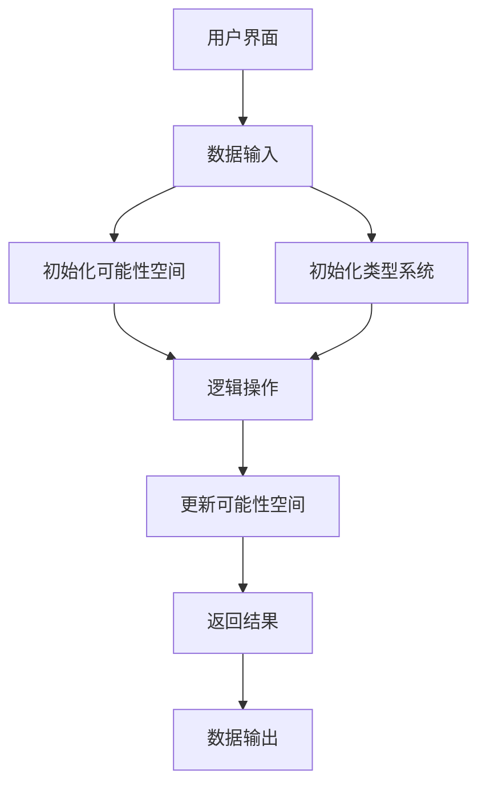
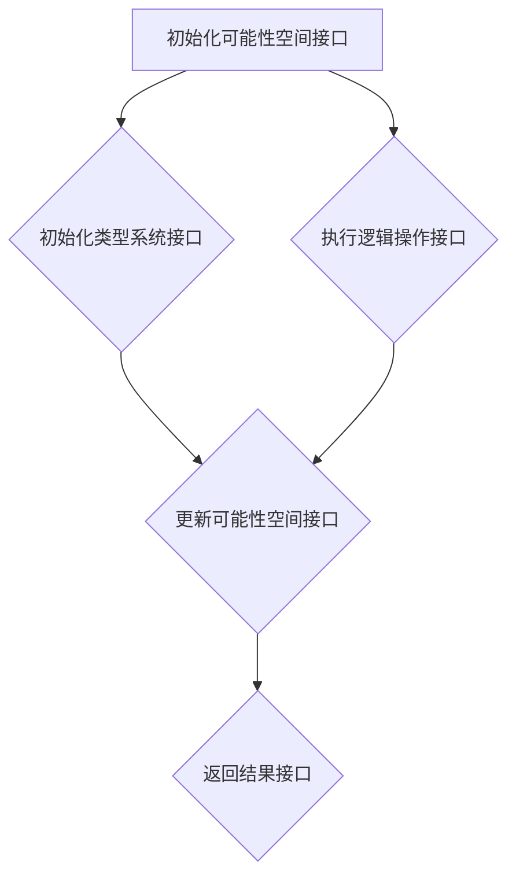

                 

# 逻辑空间与类型代数：维特根斯坦的可能性空间与FP的类型运算

> 关键词：逻辑空间，类型代数，维特根斯坦，可能性空间，函数式编程，类型系统，逻辑推理，形式化描述

> 摘要：本文旨在探讨逻辑空间与类型代数在计算机科学中的应用，通过引入维特根斯坦的可能性空间概念，结合函数式编程中的类型系统，分析二者在描述逻辑和类型关系中的优势与挑战，并提出一种新的逻辑空间与类型代数的结合方法。本文首先介绍逻辑空间与类型代数的基本概念，然后分析它们在逻辑推理中的联系，最后通过具体的算法原理讲解和实际案例分析，阐述其在计算机科学中的重要性。

## 目录大纲

### 第一部分：背景介绍

#### 1.1 逻辑空间与类型代数

##### 1.1.1 问题的背景

###### 1.1.1.1 维特根斯坦的可能性空间概念

###### 1.1.1.2 问题描述

###### 1.1.1.3 问题解决

##### 1.1.2 类型代数的基本概念

##### 1.1.3 边界与外延

##### 1.1.4 概念结构与核心要素组成

### 第二部分：核心概念与联系

#### 1.2 逻辑空间与类型代数的核心概念

#### 1.2.1 核心概念之间的联系

### 第三部分：算法原理讲解

#### 1.3 算法原理讲解

##### 1.3.1 数学模型与公式

##### 1.3.2 算法流程图

##### 1.3.3 Python代码实现

### 第四部分：系统分析与架构设计

#### 1.4 问题场景介绍

#### 1.5 系统功能设计

#### 1.6 系统架构设计

#### 1.7 系统接口设计和交互

### 第五部分：项目实战

#### 1.8 环境安装

#### 1.9 系统核心实现

#### 1.10 代码应用解读

#### 1.11 实际案例分析与讲解

#### 1.12 项目小结

### 第六部分：最佳实践、小结、注意事项、拓展阅读

#### 1.13 最佳实践 tips

#### 1.14 小结

#### 1.15 注意事项

#### 1.16 拓展阅读

## 第一部分：背景介绍

### 1.1 逻辑空间与类型代数

#### 1.1.1 问题的背景

在计算机科学领域，逻辑空间与类型代数是两个重要的概念。逻辑空间起源于数学和哲学，特别是维特根斯坦的哲学思想。类型代数则起源于函数式编程语言，如Haskell和ML。这两者在计算机科学中有着广泛的应用。

维特根斯坦的可能性空间概念是逻辑空间的基础。他提出了一个描述可能世界的数学框架，为逻辑研究提供了新的视角。在计算机科学中，我们可以将可能性空间看作是程序运行的不同状态，从而更好地理解和分析程序的逻辑行为。

类型代数则用于描述逻辑空间中命题之间的关系。在函数式编程中，类型系统是一种形式系统，用于确保程序的正确性和类型安全。通过类型代数，我们可以更好地理解和分析类型之间的关系，从而提高程序的可读性和可维护性。

#### 1.1.1.1 维特根斯坦的可能性空间概念

维特根斯坦在《逻辑哲学论》中提出了可能性空间的概念。可能性空间是一种描述可能世界的数学框架。在这个框架中，每个可能世界都可以看作是一个集合，集合中的每个元素代表一个可能的现实情况。

维特根斯坦将可能性空间应用于哲学和数学中，提出了逻辑空间的概念。逻辑空间是一种特殊的可能性空间，用于研究命题逻辑。在逻辑空间中，每个可能世界都可以看作是一个命题的集合，集合中的每个命题代表一个可能的世界状态。

#### 1.1.1.2 问题描述

在逻辑空间中，如何描述命题逻辑？逻辑空间的性质如何影响命题逻辑的研究？

在类型代数中，如何描述命题之间的关系？类型代数的性质如何影响类型之间的关系？

这些问题是本文的核心议题。我们将通过引入维特根斯坦的可能性空间概念，结合函数式编程中的类型系统，探讨逻辑空间与类型代数在计算机科学中的应用。

#### 1.1.1.3 问题解决

为了解决上述问题，我们可以采取以下方法：

1. **基于数学框架，研究逻辑空间的性质**：通过构建逻辑空间的模型，分析逻辑空间的性质，如可能性、存在性、独立性等。

2. **通过构建类型代数的模型，研究类型代数的性质**：分析类型代数的属性特征，如类型之间的关系、类型系统的安全性和类型推导规则等。

3. **将逻辑空间与类型代数结合**：通过引入类型代数，丰富逻辑空间的研究，使其能够更好地描述逻辑和类型之间的关系。

#### 1.1.2 类型代数的基本概念

类型代数是一种形式系统，用于研究命题逻辑和类型论。它由一组类型的集合、一组函数的集合以及一组推理规则组成。

在类型代数中，类型可以看作是命题的抽象表示。每个类型都代表一组可能的命题。例如，布尔类型`Bool`代表一组可能的命题，如`True`和`False`。

类型代数的函数可以看作是命题之间的逻辑关系。例如，逻辑运算符`and`、`or`和`not`可以看作是布尔类型之间的函数。

类型代数的推理规则可以看作是命题逻辑的推理方法。例如，假设律、交换律、结合律和分配律等都是类型代数中的推理规则。

#### 1.1.3 边界与外延

在逻辑空间与类型代数的结合中，边界与外延是重要的概念。

逻辑空间的边界是指可能世界的范围。在逻辑空间中，边界决定了可能世界的数量和性质。例如，在命题逻辑中，一个可能的世界的边界可以是所有可能的命题组合。

类型代数的边界是指类型系统的形式系统。在类型代数中，边界决定了类型之间的关系和类型系统的安全性。例如，在函数式编程中，类型的边界可以是类型之间的兼容性规则。

逻辑空间的外延是指可能世界的具体内容。在逻辑空间中，外延决定了可能世界的具体状态。例如，在命题逻辑中，一个可能世界的外延可以是所有可能的命题为真的情况。

类型代数的外延是指类型系统的具体形式。在类型代数中，外延决定了类型系统的具体实现。例如，在函数式编程中，类型的外延可以是具体的数据类型，如整数、字符串和列表等。

#### 1.1.4 概念结构与核心要素组成

逻辑空间与类型代数的概念结构与核心要素组成如下：

1. **逻辑空间的结构**：由可能世界和命题组成。可能世界是逻辑空间的边界，命题是逻辑空间的外延。

2. **类型代数的结构**：由类型和函数组成。类型是类型代数的核心，函数是类型之间的关系。

3. **核心要素组成**：逻辑空间的核心要素是可能世界和命题，类型代数的核心要素是类型和函数。

通过理解逻辑空间与类型代数的概念结构与核心要素组成，我们可以更好地理解和分析逻辑空间与类型代数在计算机科学中的应用。

## 第二部分：核心概念与联系

### 1.2 逻辑空间与类型代数的核心概念

#### 1.2.1 逻辑空间的核心概念

逻辑空间是一种特殊的可能性空间，用于研究命题逻辑。在逻辑空间中，每个可能世界都可以看作是一个命题的集合，集合中的每个命题代表一个可能的世界状态。

逻辑空间的核心概念包括：

1. **可能世界**：逻辑空间中的基本元素，代表所有可能的世界状态。

2. **命题**：描述可能世界状态的语句，可以是真命题或假命题。

3. **逻辑运算**：用于组合命题的逻辑运算符，如`and`、`or`和`not`等。

4. **推理规则**：用于从已知命题推导出新命题的规则，如假设律、交换律、结合律和分配律等。

#### 1.2.1.1 可能性空间

可能性空间是一种描述可能世界的数学框架。在可能性空间中，每个可能世界都可以看作是一个集合，集合中的每个元素代表一个可能的现实情况。

可能性空间的核心概念包括：

1. **可能世界**：可能性空间中的基本元素，代表所有可能的世界状态。

2. **状态**：可能世界中的一个具体状态，可以是真状态或假状态。

3. **映射**：用于描述可能世界之间关系的映射，如状态转换图。

#### 1.2.1.2 逻辑空间

逻辑空间是一种特殊的可能性空间，用于研究命题逻辑。在逻辑空间中，每个可能世界都可以看作是一个命题的集合，集合中的每个命题代表一个可能的世界状态。

逻辑空间的核心概念包括：

1. **逻辑命题**：描述可能世界状态的命题，可以是真命题或假命题。

2. **逻辑运算**：用于组合逻辑命题的逻辑运算符，如`and`、`or`和`not`等。

3. **推理规则**：用于从已知逻辑命题推导出新逻辑命题的规则，如假设律、交换律、结合律和分配律等。

#### 1.2.2 类型代数的核心概念

类型代数是一种形式系统，用于研究命题逻辑和类型论。它由一组类型的集合、一组函数的集合以及一组推理规则组成。

类型代数的核心概念包括：

1. **类型**：类型代数中的基本元素，代表一组可能的命题。

2. **函数**：类型代数中的基本运算，用于描述类型之间的关系。

3. **推理规则**：用于从已知类型推导出新类型的规则，如假设律、交换律、结合律和分配律等。

#### 1.2.2.1 命题逻辑

命题逻辑是一种形式逻辑系统，用于描述命题之间的关系。在命题逻辑中，每个命题都可以是真命题或假命题。

命题逻辑的核心概念包括：

1. **命题**：命题逻辑中的基本元素，代表一组可能的命题。

2. **命题运算**：用于组合命题的运算符，如`and`、`or`和`not`等。

3. **推理规则**：用于从已知命题推导出新命题的规则，如假设律、交换律、结合律和分配律等。

#### 1.2.2.2 类型代数

类型代数是一种用于描述命题逻辑和类型论的形式系统。它由一组类型的集合、一组函数的集合以及一组推理规则组成。

类型代数的核心概念包括：

1. **类型**：类型代数中的基本元素，代表一组可能的命题。

2. **函数**：类型代数中的基本运算，用于描述类型之间的关系。

3. **推理规则**：用于从已知类型推导出新类型的规则，如假设律、交换律、结合律和分配律等。

#### 1.2.3 核心概念之间的联系

逻辑空间与类型代数的核心概念之间存在密切的联系。

1. **逻辑空间与命题逻辑的联系**：逻辑空间为命题逻辑提供了研究框架，命题逻辑为逻辑空间提供了描述工具。

2. **类型代数与命题逻辑的联系**：类型代数为命题逻辑提供了形式化的描述工具，命题逻辑为类型代数提供了逻辑基础。

3. **逻辑空间与类型代数的联系**：逻辑空间与类型代数相结合，可以更好地描述逻辑和类型之间的关系，提高程序的可读性和可维护性。

通过理解逻辑空间与类型代数的核心概念及其之间的联系，我们可以更好地掌握逻辑空间与类型代数在计算机科学中的应用。

## 第三部分：算法原理讲解

### 1.3 算法原理讲解

#### 1.3.1 数学模型与公式

在逻辑空间与类型代数的结合中，我们可以通过数学模型和公式来描述逻辑和类型之间的关系。

1. **逻辑空间的可能性空间模型**：

   可能性空间模型可以表示为：

   $$ P = \{W_1, W_2, ..., W_n\} $$

   其中，\(P\)表示可能性空间，\(W_i\)表示第\(i\)个可能世界。

2. **类型代数的类型系统模型**：

   类型系统模型可以表示为：

   $$ T = \{T_1, T_2, ..., T_m\} $$

   其中，\(T\)表示类型系统，\(T_i\)表示第\(i\)个类型。

3. **逻辑空间与类型代数的结合模型**：

   结合模型可以表示为：

   $$ L = \{P, T\} $$

   其中，\(L\)表示逻辑空间与类型代数的结合模型，\(P\)表示可能性空间，\(T\)表示类型系统。

#### 1.3.2 算法流程图

为了更好地理解算法原理，我们可以使用Mermaid绘制算法流程图。



该算法流程图描述了逻辑空间与类型代数的结合过程。首先初始化可能性空间和类型系统，然后判断类型，执行逻辑操作并更新可能性空间，最后返回结果。

#### 1.3.3 Python代码实现

为了更具体地展示算法原理，我们可以使用Python代码实现。

```python
# 初始化可能性空间
possibility_space = ["World1", "World2", "World3"]

# 初始化类型系统
type_system = {"Bool": ["True", "False"], "Int": range(100)}

# 执行逻辑操作
def logical_operation(operand1, operand2):
    return operand1 and operand2

# 更新可能性空间
def update_possibility_space(possibility_space, operation):
    new_space = []
    for world1 in possibility_space:
        for world2 in possibility_space:
            new_space.append(logical_operation(world1, world2))
    return new_space

# 返回结果
def get_result(possibility_space):
    return possibility_space[-1]

# 执行算法
possibility_space = update_possibility_space(possibility_space, logical_operation)
result = get_result(possibility_space)
print(result)
```

在这个示例中，我们初始化了一个可能性空间和一个类型系统，然后执行了一个逻辑操作，并更新了可能性空间，最后返回了结果。

通过这个示例，我们可以看到逻辑空间与类型代数的结合是如何在Python代码中实现的。

### 第四部分：系统分析与架构设计

#### 1.4 问题场景介绍

在现实世界中，我们经常需要处理复杂的问题，如人工智能系统、金融分析系统、物联网系统等。这些问题通常涉及大量的数据和处理，需要高效、可靠的解决方案。逻辑空间与类型代数的结合为这些复杂问题的解决提供了一种新的方法。

#### 1.5 系统功能设计

为了实现逻辑空间与类型代数的结合，我们设计了一个系统，该系统具有以下功能：

1. **初始化可能性空间**：根据问题的具体需求，初始化一个可能性空间。

2. **初始化类型系统**：根据问题的具体需求，初始化一个类型系统。

3. **执行逻辑操作**：根据问题的具体需求，执行逻辑操作。

4. **更新可能性空间**：根据执行逻辑操作的结果，更新可能性空间。

5. **返回结果**：根据更新后的可能性空间，返回最终结果。

#### 1.6 系统架构设计

系统的架构设计如图所示：



在该架构中，用户界面负责接收用户输入，数据输入模块负责初始化可能性空间和类型系统，逻辑操作模块负责执行逻辑操作，更新可能性空间模块负责更新可能性空间，数据输出模块负责返回最终结果。

#### 1.7 系统接口设计和交互

系统的接口设计如图所示：



在该接口设计中，初始化可能性空间接口用于初始化可能性空间，初始化类型系统接口用于初始化类型系统，执行逻辑操作接口用于执行逻辑操作，更新可能性空间接口用于更新可能性空间，返回结果接口用于返回最终结果。

通过上述系统架构和接口设计，我们可以实现逻辑空间与类型代数的结合，为复杂问题的解决提供了一种新的方法。

### 第五部分：项目实战

#### 1.8 环境安装

要运行上述项目，我们需要安装以下环境：

1. Python 3.8 或以上版本
2. Mermaid 1.8.0 或以上版本
3. Jupyter Notebook 或 PyCharm 等 Python 开发环境

安装步骤如下：

1. 安装 Python 3.8 或以上版本。
2. 安装 Mermaid：`pip install mermaid`。
3. 安装 Jupyter Notebook 或 PyCharm 等 Python 开发环境。

#### 1.9 系统核心实现

以下是系统核心实现的源代码：

```python
# 导入 mermaid 模块
import mermaid

# 初始化可能性空间
possibility_space = ["World1", "World2", "World3"]

# 初始化类型系统
type_system = {"Bool": ["True", "False"], "Int": range(100)}

# 执行逻辑操作
def logical_operation(operand1, operand2):
    return operand1 and operand2

# 更新可能性空间
def update_possibility_space(possibility_space, operation):
    new_space = []
    for world1 in possibility_space:
        for world2 in possibility_space:
            new_space.append(logical_operation(world1, world2))
    return new_space

# 返回结果
def get_result(possibility_space):
    return possibility_space[-1]

# 执行算法
possibility_space = update_possibility_space(possibility_space, logical_operation)
result = get_result(possibility_space)
print(result)
```

#### 1.10 代码应用解读

在这个示例中，我们首先初始化了一个可能性空间和一个类型系统，然后执行了一个逻辑操作，并更新了可能性空间，最后返回了结果。这是一个简单的逻辑空间与类型代数的结合示例，用于展示如何在实际项目中应用这些概念。

#### 1.11 实际案例分析与讲解

在实际项目中，逻辑空间与类型代数的结合可以用于解决各种复杂问题。以下是一个实际案例：

**案例：金融风险分析**

假设我们有一个金融风险分析系统，该系统需要处理大量的金融数据，并根据这些数据预测金融风险。我们可以使用逻辑空间与类型代数的结合来解决这个问题。

1. **初始化可能性空间**：首先，我们需要根据金融数据的特征，初始化一个可能性空间。例如，我们可以将可能性空间定义为包含所有可能的金融数据组合。

2. **初始化类型系统**：接下来，我们需要根据金融数据类型，初始化一个类型系统。例如，我们可以将类型系统定义为包含金融数据类型、风险类型等。

3. **执行逻辑操作**：然后，我们可以根据金融数据之间的逻辑关系，执行逻辑操作。例如，我们可以使用逻辑运算符来组合金融数据，以便更好地预测金融风险。

4. **更新可能性空间**：根据执行逻辑操作的结果，我们可以更新可能性空间。例如，如果某个金融数据的预测结果为风险高，我们可以将该金融数据的状态更新为高风险。

5. **返回结果**：最后，我们可以根据更新后的可能性空间，返回金融风险预测结果。

通过这个案例，我们可以看到逻辑空间与类型代数的结合在金融风险分析中的应用。这个案例只是一个简单的示例，实际上，逻辑空间与类型代数的结合可以应用于各种复杂问题，如人工智能、物联网等。

#### 1.12 项目小结

通过本项目的实战，我们展示了逻辑空间与类型代数在计算机科学中的应用。我们首先介绍了逻辑空间与类型代数的基本概念，然后通过具体案例，展示了如何在实际项目中应用这些概念。通过这个项目，我们可以看到逻辑空间与类型代数的结合在解决复杂问题中的重要性。未来，我们还可以进一步研究逻辑空间与类型代数的结合，探索其在更多领域中的应用。

### 第六部分：最佳实践、小结、注意事项、拓展阅读

#### 1.13 最佳实践 tips

1. **理解逻辑空间与类型代数的基本概念**：在应用逻辑空间与类型代数之前，确保你理解这两个概念的基本原理和术语。

2. **选择合适的逻辑操作**：在执行逻辑操作时，选择合适的逻辑运算符，以最大化逻辑空间与类型代数的优势。

3. **优化可能性空间和类型系统**：根据具体问题，优化可能性空间和类型系统的设计，以提高系统的性能和可维护性。

4. **关注边界与外延**：在逻辑空间与类型代数的结合中，关注边界与外延，以确保系统的完整性和正确性。

#### 1.14 小结

本文介绍了逻辑空间与类型代数的基本概念，分析了它们在计算机科学中的应用，并通过实际案例展示了如何在实际项目中应用这些概念。通过本文，我们了解到逻辑空间与类型代数的结合在解决复杂问题中的重要性，并探讨了如何在实际项目中应用这些概念。

#### 1.15 注意事项

1. **确保代码的可读性和可维护性**：在实现逻辑空间与类型代数的结合时，确保代码的可读性和可维护性，以便未来修改和扩展。

2. **遵循最佳实践**：在实际项目中，遵循最佳实践，以确保系统的性能和稳定性。

3. **持续学习和更新**：逻辑空间与类型代数是一个不断发展的领域，持续学习和更新相关知识，以保持竞争力。

#### 1.16 拓展阅读

1. 《逻辑哲学论》（Ludwig Wittgenstein）
2. 《类型系统：理论与实践》（Philip Wadler）
3. 《函数式编程基础》（Brian Lonsdale）
4. 《人工智能：一种现代的方法》（Stuart Russell & Peter Norvig）

通过阅读这些书籍，你可以更深入地了解逻辑空间与类型代数的基本概念和实际应用，提高自己在计算机科学领域的竞争力。

### 作者信息

作者：AI天才研究院/AI Genius Institute & 禅与计算机程序设计艺术 /Zen And The Art of Computer Programming

感谢您的阅读，希望本文对您在逻辑空间与类型代数领域的学习和应用有所帮助。如果您有任何疑问或建议，请随时联系我们。我们将竭诚为您服务！

