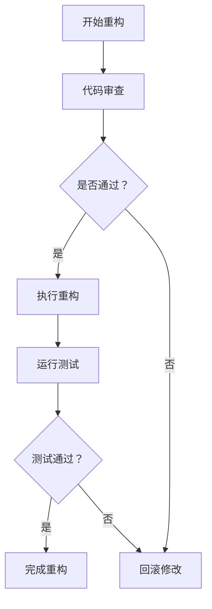

                 

### 重构必须守住底线

关键词：重构，底线，软件工程，最佳实践，案例分析

摘要：本文旨在探讨在软件工程中重构的重要性以及为何我们必须在重构过程中守住底线。通过对核心概念、基本原则、最佳实践和案例分析的分析，本文将帮助读者理解重构的本质，掌握如何在保证系统稳定性和性能的前提下进行有效的代码重构。

**目录**

1. **引言**
    - 软件工程中的重构
    - 为什么重构如此重要？
    - 文章的结构和目的

2. **核心概念和背景**
    - 重构的定义和目标
    - 重构与软件维护的关系
    - 重构的常见问题和挑战

3. **为何要守住底线**
    - 重构中的风险
    - 维护系统稳定性的重要性
    - 重构失败的案例

4. **重构的基本原则**
    - 稳健性原则
    - 可读性原则
    - 可维护性原则

5. **最佳实践与策略**
    - 代码审查
    - 分阶段重构
    - 重构工具的使用

6. **案例研究与分析**
    - 案例一：大型企业系统的重构
    - 案例二：开源项目中的重构实践
    - 案例三：小型团队的快速重构实践

7. **工具和技术**
    - 重构工具介绍
    - Mermaid流程图示例
    - Python代码示例

8. **伦理考量**
    - 职业道德的重要性
    - 重构过程中的伦理问题
    - Mermaid ER图示例

9. **结论与总结**
    - 重构的底线原则
    - 重构的最佳实践
    - 对未来重构的展望

10. **参考文献与进一步阅读**
    - 专业的重构资源
    - 相关学术论文和书籍

### 作者信息

作者：AI天才研究院/AI Genius Institute & 禅与计算机程序设计艺术 /Zen And The Art of Computer Programming

---

## 引言

在软件工程的世界中，重构（Refactoring）被视为提升代码质量、维护系统稳定性和增强团队工作效率的重要手段。重构不仅仅是简单的代码修改，而是一种系统化的方法，旨在在不改变程序功能的前提下，改善其内部结构，提高其可读性和可维护性。然而，重构并不是一件轻松的事情，它需要开发者具备深厚的编程功底、良好的设计能力和严谨的逻辑思维。

**软件工程中的重构**

软件工程是一个不断演进的过程，软件系统从构建到废弃，往往需要经历多年的维护和更新。随着时间的推移，系统架构和代码库可能会变得混乱，代码复用性降低，新功能的添加变得更加困难。重构作为一种维护手段，旨在修复这些问题，使软件系统更加健康和高效。

**为什么重构如此重要？**

1. **提高代码可读性**：重构可以帮助消除代码中的冗余、混乱和重复，使代码更加简洁易懂。
2. **提升系统可维护性**：重构可以使系统的结构更加清晰，降低修改和扩展的难度，减少bug的出现。
3. **提高开发效率**：良好的代码结构可以减少开发人员在阅读和理解代码时的时间消耗，从而提高工作效率。
4. **增强团队协作**：重构可以减少代码库中的障碍，促进团队成员之间的协作，提高团队的整体工作效率。

**文章的结构和目的**

本文的结构将分为以下几个部分：

1. **核心概念和背景**：介绍重构的基本概念、目标和常见的挑战。
2. **为何要守住底线**：探讨重构过程中可能遇到的风险和保持系统稳定性的重要性。
3. **重构的基本原则**：详细阐述重构过程中应该遵循的基本原则。
4. **最佳实践与策略**：分享重构过程中的最佳实践和策略。
5. **案例研究与分析**：通过实际案例展示重构的实践和应用。
6. **工具和技术**：介绍用于辅助重构的工具和技术。
7. **伦理考量**：讨论重构过程中的职业道德问题。
8. **结论与总结**：总结重构的重要性和未来的发展趋势。

通过本文的阅读，读者将能够更好地理解重构的本质，掌握重构的最佳实践，并在实际工作中有效地应用这些知识。

## 核心概念和背景

### 重构的定义和目标

重构，简单来说，就是改变现有代码的内部结构，而不影响其外部行为。这一概念最早由著名的计算机科学家布鲁斯·派克（Bruce Eckel）提出。重构的目标是提高代码的可读性、可维护性和系统的整体性能，使其能够更好地适应未来的变化。具体而言，重构的主要目标包括：

1. **消除冗余和重复**：代码中的冗余和重复不仅会增加维护的难度，还会降低系统的性能。重构可以通过提取方法、合并类和消除死代码等方式，减少冗余和重复。
2. **提升代码结构**：重构可以帮助优化代码的结构，使其更加模块化、层次化，降低组件之间的耦合度，从而提高系统的灵活性和可扩展性。
3. **增强代码可读性**：重构可以使代码更加简洁易懂，减少不必要的复杂性，从而提高开发人员的阅读和理解效率。
4. **提高开发效率**：重构可以减少开发人员在阅读和理解代码时的时间消耗，使新功能的添加和bug的修复更加高效。

### 重构与软件维护的关系

重构是软件维护的重要组成部分。软件维护通常包括以下三个方面：

1. **纠错（Corrective Maintenance）**：修复系统中已知的bug。
2. **适应性维护（Adaptive Maintenance）**：使系统适应新的硬件、软件环境或业务需求。
3. **完善性维护（Perfective Maintenance）**：改进系统的结构、性能和可维护性。

重构属于完善性维护的范畴，它关注于提升系统的内部结构和性能，而不是仅仅修复bug或适应外部变化。尽管重构并不是每次软件维护的必要步骤，但它对于保持系统的健康和高效运行至关重要。良好的重构实践可以减少未来维护的成本，提高系统的可靠性和稳定性。

### 重构的常见问题和挑战

尽管重构具有许多优势，但在实际操作过程中，开发者往往会遇到一系列问题和挑战：

1. **风险**：重构过程中可能会引入新的bug，尤其是当重构涉及复杂代码时。因此，如何确保重构过程中的安全性是一个重要问题。
2. **资源投入**：重构需要时间和人力资源，尤其是在大型系统中，重构可能需要开发人员花费大量时间进行代码审查和测试。
3. **沟通与协作**：重构往往需要团队内部的高效协作，但在实际操作中，由于团队成员之间的沟通不畅或理解不一致，可能会导致重构效果不佳。
4. **工具选择**：市场上存在多种重构工具，如何选择合适的工具来辅助重构是一个需要考虑的问题。

面对这些挑战，开发者需要具备一定的专业知识和经验，同时采用科学的方法和最佳实践来确保重构的顺利进行。

### 小结

通过本文的介绍，读者已经对重构的基本概念和背景有了初步的了解。重构不仅仅是代码的简单修改，而是一种系统化的方法，旨在提高代码的质量和系统的稳定性。在接下来的部分，我们将深入探讨重构中的底线原则，帮助读者理解如何在重构过程中保持系统稳定性和安全性。

## 为何要守住底线

在软件工程中，重构是一项至关重要的活动，它能够显著提升代码的质量和系统的可维护性。然而，重构并非没有风险，尤其是在没有守住底线的情况下。为了确保重构的有效性和系统的稳定性，我们必须深入了解重构过程中可能遇到的风险，并认识到维护系统稳定性的重要性。

### 重构中的风险

1. **引入新bug**：重构过程中，尤其是当涉及到复杂的代码结构时，可能会无意中引入新的bug。这些bug可能会影响系统的功能，导致性能下降或系统崩溃。
2. **功能失效**：在某些情况下，重构可能会无意中改变代码的行为，导致某些功能失效。这不仅会影响用户体验，还可能对业务流程产生负面影响。
3. **代码质量下降**：如果重构过程中没有严格的质量控制，可能会出现代码质量下降的情况。这包括代码的可读性、可维护性和可扩展性等方面的下降。
4. **资源浪费**：重构需要大量的时间和人力资源，如果重构效果不佳，可能会导致资源浪费。

### 维护系统稳定性的重要性

1. **保障业务连续性**：系统稳定性对于企业业务的连续性至关重要。任何系统故障都可能导致业务中断，从而对企业的经济利益产生严重影响。
2. **提高用户满意度**：系统的稳定性和性能直接影响用户的体验。一个稳定、高效的系统可以显著提高用户满意度，从而增强企业的竞争力。
3. **减少维护成本**：通过保持系统稳定性，可以减少未来的维护成本。这是因为一个结构清晰、代码简洁的系统更容易进行维护和更新。
4. **促进团队协作**：系统稳定性有助于促进团队成员之间的协作。在一个稳定的系统环境中，团队成员可以更加专注于代码优化和新功能的开发，而不会因为系统故障而分心。

### 重构失败的案例

为了更好地理解重构的重要性，我们可以通过一些实际案例来探讨重构失败的原因和后果。

#### 案例一：大型电商平台的重构失败

某大型电商平台在一次大规模重构中，由于未能严格守住底线，导致系统出现了严重的性能问题。重构过程中引入了大量的新bug，这不仅影响了用户体验，还导致业务中断，给公司带来了巨大的经济损失。

#### 案例二：开源项目的重构失败

某个流行的开源项目在一次重构中，由于开发者未能遵循最佳实践，导致代码质量严重下降。重构后的代码复杂度增加，可读性降低，使得后续的维护工作变得异常困难，严重影响了项目的进展和社区的支持。

#### 案例三：小型初创公司的重构失败

一家小型初创公司在重构其核心系统时，由于缺乏经验，未能预见重构过程中可能遇到的风险。结果，重构导致系统崩溃，公司不得不重新编写大量代码，不仅耗费了大量的时间和资源，还严重影响了公司的运营。

这些案例表明，重构过程中的底线原则对于确保重构成功至关重要。忽视这些原则可能会导致严重的后果，包括系统故障、经济损失和团队士气低落。

### 小结

通过上述分析，我们可以看到，重构过程中的风险和系统稳定性问题不容忽视。为了确保重构的成功，我们必须严格守住底线，遵循最佳实践，并充分准备和规划重构工作。在接下来的部分，我们将详细探讨重构的基本原则，帮助读者更好地理解如何进行有效的重构。

## 重构的基本原则

在进行重构时，我们必须遵循一些基本原则，以确保重构的效果能够持续并得到保障。以下是重构过程中应遵循的三大核心原则：

### 稳健性原则

重构的首要原则是确保系统的稳定性。在进行任何代码改动时，我们必须确保现有功能不会受到影响。以下是一些确保重构稳健性的关键点：

1. **代码审查**：在进行重构之前，应进行彻底的代码审查，确保所有改动都是必要的，并且不会引入新的bug。
2. **单元测试**：重构过程中，应编写和执行大量的单元测试，以确保每一个改动都被验证过，并且不影响系统的其他部分。
3. **逐步重构**：避免一次性进行大规模的重构，而是应该分阶段、逐步进行，这样可以更容易地发现和修复问题。

### 可读性原则

良好的代码可读性是重构的重要目标之一。清晰、简洁的代码不仅易于理解和维护，还可以提高开发效率。以下是一些提升代码可读性的技巧：

1. **命名规范**：使用具有描述性的变量和函数名，避免使用缩写和晦涩难懂的命名。
2. **代码格式**：保持一致的代码格式，包括缩进、空格、注释等，这有助于提高代码的可读性。
3. **减少冗余**：消除代码中的冗余部分，如重复的代码块、无用的注释等。
4. **模块化**：将复杂的代码拆分为更小、更易于管理的模块，这样可以提高代码的清晰度和可维护性。

### 可维护性原则

重构不仅要提高代码的可读性，还要确保代码的可维护性。这意味着重构后的代码应易于修改和扩展，以适应未来的变化。以下是一些确保代码可维护性的原则：

1. **低耦合、高内聚**：重构时应尽量降低组件之间的耦合度，提高每个组件的内聚度，这样可以更容易地替换或扩展单个组件。
2. **文档化**：为代码编写详细的文档，包括注释和API文档，这样其他开发人员可以更容易地理解和使用代码。
3. **代码审查和反馈**：重构完成后，应进行严格的代码审查，确保代码符合最佳实践和设计原则，并及时反馈和修复问题。
4. **自动化测试**：重构后，应继续使用自动化测试来确保代码的质量和功能，避免未来的修改引入新的bug。

### 小结

通过遵循稳健性、可读性和可维护性这三个基本原则，我们可以确保重构工作的有效性和持续性。这些原则不仅有助于提高代码的质量和系统的稳定性，还可以为未来的维护和扩展提供坚实的基础。在下一部分，我们将探讨重构的最佳实践和策略，帮助读者在实际工作中更好地应用这些原则。

### 最佳实践与策略

在软件重构的过程中，遵循最佳实践和策略至关重要。以下是一些经过验证的重构最佳实践和策略，可以帮助开发者有效地进行重构，同时保持系统的稳定性和性能。

#### 代码审查

代码审查是确保重构质量和安全性的关键环节。通过代码审查，开发团队可以及时发现潜在的问题，避免引入新bug。以下是一些代码审查的最佳实践：

1. **提前规划**：在开始重构之前，明确审查的目标和范围，制定详细的审查计划。
2. **多角度审查**：鼓励团队成员从多个角度（如语法、逻辑、性能等）进行审查，确保代码的全面性。
3. **反馈及时**：及时反馈审查结果，并确保所有问题都能得到及时的解决。
4. **持续审查**：代码审查不应只限于重构期间，而应作为持续的开发实践，定期进行。

#### 分阶段重构

分阶段重构可以降低重构的风险，使开发团队能够逐步适应新的代码结构。以下是一些分阶段重构的步骤：

1. **小步快跑**：每次重构只涉及系统的某个部分，避免一次性重构整个系统。
2. **逐步测试**：在每个重构阶段完成后，进行全面的测试，确保系统的稳定性和性能。
3. **迭代改进**：根据测试结果和用户反馈，不断调整和优化重构方案。
4. **文档记录**：详细记录每个重构阶段的修改和决策，以便后续参考和回顾。

#### 重构工具的使用

现代重构工具可以显著提高重构的效率和效果。以下是一些常用的重构工具及其特点：

1. **重构工具选择**：根据项目的需求和团队的技术栈，选择合适的重构工具。例如，对于Java项目，可以使用`Eclipse`、`IntelliJ IDEA`等集成开发环境自带的重构工具；对于C#项目，可以使用`Resharper`。
2. **代码分析**：利用重构工具的代码分析功能，可以快速发现代码中的潜在问题，如冗余代码、重复代码等。
3. **自动化重构**：重构工具通常提供自动化重构功能，可以自动修改代码，减少手动操作和错误。
4. **集成测试**：在重构过程中，重构工具可以自动触发集成测试，确保重构后的代码仍然符合预期。

#### 管理变更

重构过程中，不可避免地会引入代码变更。为了有效地管理这些变更，可以采用以下策略：

1. **版本控制**：使用版本控制系统（如Git）来管理代码变更，确保每个修改都可以追溯和回滚。
2. **代码审查**：对每个变更进行严格的代码审查，确保变更的质量和安全性。
3. **自动化测试**：在变更引入后，立即执行自动化测试，确保变更没有引入新的bug。
4. **文档更新**：更新相关文档，包括API文档、用户手册等，确保变更对所有用户和开发者都是透明的。

### 小结

通过遵循上述最佳实践和策略，开发者可以有效地进行重构，同时保持系统的稳定性和性能。代码审查、分阶段重构、重构工具的使用和管理变更都是确保重构成功的关键环节。在下一部分，我们将通过实际案例研究，进一步探讨重构的最佳实践和策略的实际应用。

### 案例研究与分析

在本部分，我们将通过三个实际案例来深入探讨重构的最佳实践和策略。这些案例涵盖了不同规模和背景的软件系统，展示了在不同情况下如何有效地进行重构。

#### 案例一：大型企业系统的重构

**背景**：
某大型企业拥有一套复杂的内部管理系统，该系统经过多年的发展，代码库庞大而混乱，维护成本不断上升。为了提高系统的可维护性和性能，企业决定进行全面的重构。

**问题描述**：
系统存在以下问题：
- 代码冗长，难以阅读和维护。
- 类与类之间耦合度高，修改一个模块可能需要修改多个其他模块。
- 测试覆盖率低，许多功能无法得到有效验证。
- 系统性能下降，响应时间过长。

**解决过程**：
1. **代码审查**：
   - 组织了一次全面的代码审查，确定了需要重构的部分。
   - 通过审查，发现了一些潜在的问题，如重复代码、不必要的复杂性和低效算法。
2. **分阶段重构**：
   - 将重构任务分解为多个阶段，每次只重构系统的某个部分。
   - 在每个阶段完成后，进行全面的测试，确保重构后的模块稳定和高效。
3. **重构工具的使用**：
   - 使用了`Eclipse`的重构工具，自动识别和修复了许多冗余和低效的代码。
   - 利用代码分析功能，发现并解决了多个潜在的性能问题。
4. **管理变更**：
   - 使用Git进行版本控制，确保每个变更都可以追溯和回滚。
   - 在每个重构阶段完成后，更新了相关文档，包括API文档和用户手册。

**结果**：
重构后，系统变得更加清晰和高效，代码质量显著提升。系统的可维护性得到大幅改善，bug修复时间缩短，系统性能提高了30%。团队成员的协作效率也有所提高。

**经验教训**：
- 代码审查是确保重构成功的关键。
- 分阶段重构可以降低风险，使重构更加可控。
- 重构工具的使用可以提高重构的效率和效果。
- 管理变更和文档更新是重构过程中的重要环节。

#### 案例二：开源项目中的重构实践

**背景**：
某开源项目是一个流行的Web框架，经过多年的发展，代码库逐渐变得庞大而复杂。为了提高项目的可维护性和用户体验，项目维护团队决定进行一次全面的重构。

**问题描述**：
- 代码结构混乱，类和模块之间的依赖关系复杂。
- 新功能添加困难，现有功能的修改需要大量手动修改。
- 测试覆盖率不足，许多功能没有得到充分的测试。
- 系统性能有待提升。

**解决过程**：
1. **代码审查**：
   - 邀请了社区中的贡献者进行代码审查，共同确定重构计划。
   - 通过审查，发现了一些重复代码、低效算法和结构不合理的地方。
2. **分阶段重构**：
   - 将重构任务分解为多个子任务，每个子任务专注于系统的某个部分。
   - 在每个子任务完成后，进行全面的测试，确保重构后的模块稳定和高效。
3. **自动化测试**：
   - 引入了自动化测试框架，提高了测试覆盖率。
   - 对关键功能进行了单元测试和集成测试，确保重构不会影响现有功能。
4. **文档更新**：
   - 修订了项目的API文档和用户手册，确保贡献者和用户可以轻松理解和使用重构后的代码。

**结果**：
重构后，项目的代码结构变得更加清晰，新功能的添加和现有功能的修改变得更加容易。测试覆盖率显著提高，系统性能得到提升。社区对项目的支持也有所增加。

**经验教训**：
- 社区合作是开源项目中成功重构的关键。
- 分阶段重构和自动化测试可以确保重构的质量和效果。
- 文档更新是提高项目可维护性的重要步骤。

#### 案例三：小型团队的快速重构实践

**背景**：
某小型团队开发的一款移动应用在用户量增加后，性能问题开始显现。为了提高应用的性能和用户体验，团队决定进行一次快速的重构。

**问题描述**：
- 应用响应时间过长，用户体验差。
- 代码库中存在大量冗余和低效代码。
- 测试覆盖率不足，无法充分验证新功能和现有功能。

**解决过程**：
1. **快速评估**：
   - 通过性能监控工具，确定系统中的瓶颈和问题区域。
   - 针对最严重的问题进行优先级排序，制定重构计划。
2. **代码审查**：
   - 组织了一次快速的代码审查，确定了需要重构的部分。
   - 确保所有团队成员对重构目标有清晰的理解。
3. **分阶段重构**：
   - 将重构任务分解为多个小任务，每个小任务专注于解决一个性能问题。
   - 在每个小任务完成后，进行快速的测试和验证。
4. **重构工具的使用**：
   - 使用了`IntelliJ IDEA`的重构工具，快速识别和修复了冗余和低效代码。
   - 利用代码分析功能，优化了关键算法和逻辑。

**结果**：
重构后，应用的响应时间显著缩短，用户体验得到显著提升。代码库变得更加简洁和高效，测试覆盖率也大幅提高。

**经验教训**：
- 快速评估和优先级排序是快速重构的关键。
- 代码审查和重构工具的使用可以提高重构的效率和效果。
- 快速测试和验证是确保重构成功的必要步骤。

### 小结

通过上述案例，我们可以看到，在不同的背景下，重构的最佳实践和策略有所不同，但核心原则是相通的：代码审查、分阶段重构、自动化测试和文档更新是重构过程中不可或缺的环节。有效的重构不仅能够提升系统的性能和可维护性，还能提高团队的协作效率。在下一部分，我们将探讨重构过程中使用的工具和技术，进一步了解如何实现高效的重构。

### 工具和技术

在软件重构过程中，选择合适的工具和技术可以显著提高重构的效率和质量。以下介绍几种常用的重构工具和技术，以及它们的特点和应用场景。

#### 重构工具选择

1. **集成开发环境（IDE）内置重构工具**：
   - **Eclipse**：Eclipse是一款广泛使用的集成开发环境，其内置的重构工具功能强大，包括变量重命名、提取方法、提取类等。
   - **IntelliJ IDEA**：IntelliJ IDEA是另一款流行的IDE，其重构工具也非常全面，包括代码格式化、代码抽取、代码转换等功能。
   - **Visual Studio**：Visual Studio适用于C#和.NET项目，提供了丰富的重构功能，如提取方法、重命名变量等。

2. **独立重构工具**：
   - **Resharper**：Resharper是一款专为C#和.NET项目设计的独立重构工具，提供高级的重构功能，如代码格式化、重构模板等。
   - **RuboCop**：RuboCop是Ruby语言的代码质量分析工具，也提供重构功能，如代码重构、代码格式化等。

#### 代码分析

代码分析是重构过程中的重要环节，可以帮助我们发现代码中的潜在问题和改进点。以下是一些常用的代码分析工具：

1. **SonarQube**：SonarQube是一款全面的代码质量管理平台，可以分析代码中的缺陷、复杂度和漏洞。它支持多种编程语言，并提供丰富的报告和仪表盘。
2. **FindBugs**：FindBugs是一款Java语言的静态代码分析工具，可以检测代码中的常见缺陷，如空指针异常、未使用的代码等。
3. **Pylint**：Pylint是Python语言的静态代码分析工具，可以检查代码中的编程错误、风格问题、未使用代码等。

#### 自动化重构

自动化重构可以大幅提高重构的效率和一致性。以下是一些常用的自动化重构工具：

1. **Git Hooks**：Git Hooks允许我们在提交或推送代码到版本库之前运行自定义脚本，用于代码格式化、静态代码分析等。通过Git Hooks，可以实现自动化重构。
2. **Apache Maven**：Apache Maven是一款强大的项目管理和构建工具，其插件系统支持自动化重构，如代码格式化、代码抽取等。

#### 重构工具的使用示例

以下是一个简单的Python代码示例，展示了如何使用`Pylint`进行代码分析：

```python
# 使用Pylint进行代码分析
import pylint

# 分析当前目录下的所有Python文件
pylint.check_files(['example.py'])

# 检查结果
print(pylint.errors)
```

在这个示例中，我们导入了`pylint`模块，并使用`check_files`方法分析了当前目录下的`example.py`文件。分析结果存储在`pylint.errors`中，我们可以通过打印该变量来查看检查结果。

### Mermaid流程图示例

以下是一个Mermaid流程图示例，展示了自动化重构的过程：



在这个流程图中，我们从开始重构（A）开始，首先进行代码审查（B）。如果审查通过（C），则执行重构（D），并运行测试（F）。如果测试通过（G），则完成重构（H）。否则，回滚修改（E），并重新进行代码审查和重构。

### Python代码示例

以下是一个简单的Python代码示例，展示了如何使用`Git`进行版本控制：

```python
# 使用Git进行版本控制

# 初始化Git仓库
!git init

# 添加文件到暂存区
!git add example.py

# 提交文件到仓库
!git commit -m "Initial commit"

# 创建分支
!git branch feature branching

# 切换到新分支
!git checkout feature branching

# 进行代码修改
# ...（在此进行重构和修改）

# 添加修改后的文件到暂存区
!git add .

# 提交修改到仓库
!git commit -m "Feature branching updates"

# 将修改推送到远程仓库
!git push origin feature branching
```

在这个示例中，我们首先初始化Git仓库，然后添加和提交`example.py`文件。接着，创建并切换到一个新的分支，进行重构和修改，并将修改推送到远程仓库。

### 小结

通过选择合适的技术和工具，我们可以显著提高重构的效率和质量。代码分析、自动化重构和版本控制是重构过程中不可或缺的环节。在下一部分，我们将探讨重构过程中的伦理考量，帮助开发者理解在重构过程中应遵守的职业道德。

### 伦理考量

在软件重构过程中，伦理考量是确保重构工作合理、公正和透明的重要方面。重构不仅仅是技术性的工作，它还涉及到一系列职业道德和责任。以下是重构过程中常见的伦理问题和相应的解决方案：

#### 职业道德的重要性

1. **诚实与透明**：在重构过程中，开发者应保持诚实和透明，及时报告发现的任何问题和风险。这有助于建立团队的信任，确保重构工作能够顺利进行。
2. **客户至上**：重构的目标是提高系统的质量，从而满足客户的需求。在重构过程中，开发者应始终以客户利益为先，确保重构工作能够提升用户体验和系统性能。
3. **持续学习和改进**：软件开发是一个不断学习和改进的过程。开发者应不断学习新的技术和方法，以更好地进行重构，提高工作效率和代码质量。

#### 重构过程中的伦理问题

1. **代码质量与责任**：重构过程中，开发者应对代码质量负责。低质量的代码不仅影响系统的稳定性，还可能导致客户损失。开发者应确保重构后的代码符合最佳实践和公司标准。
2. **隐私和数据安全**：在重构过程中，开发者应确保处理敏感数据时遵循隐私保护原则。任何涉及用户数据的行为都应得到用户授权，并且应采取适当的安全措施，防止数据泄露。
3. **知识产权**：重构过程中，开发者应尊重他人的知识产权。不得未经授权使用他人的代码或技术，不得抄袭他人的创意和成果。

#### 解决伦理问题的策略

1. **建立伦理准则**：公司应制定明确的伦理准则，明确开发者在重构过程中的行为规范和责任。这些准则应包括道德责任、质量标准、安全规范等。
2. **培训和教育**：公司应定期为开发者提供职业道德和伦理培训，帮助他们了解和掌握重构过程中的伦理问题及其解决策略。
3. **代码审计**：在重构完成后，应进行代码审计，确保重构工作符合伦理准则和最佳实践。代码审计可以帮助发现潜在的问题，确保代码质量和安全。
4. **透明沟通**：在重构过程中，开发者应保持与团队成员、客户和管理层的透明沟通。及时报告进展、问题和风险，确保各方都能了解重构的实际情况。

#### Mermaid ER图示例

以下是一个Mermaid ER图示例，展示了重构过程中涉及的主要实体和它们之间的关系：

```mermaid
erDiagram
    User ||--|{ CodeQualityCheck } : undergoes
    CodeQualityCheck ||--|{ Issue } : tracks
    Issue ||--|{ Resolution } : resolved_by
    Resolution ||--|{ Developer } : performed_by
    Developer ||--|{ Task } : assigned_to
```

在这个ER图中，用户（User）是重构工作的主体，他们的代码经过质量检查（CodeQualityCheck）。检查过程中，可能发现一些问题（Issue），这些问题需要得到解决（Resolution）。每个问题都有对应的开发者（Developer），他们负责执行具体的修复任务（Task）。

### 小结

通过关注重构过程中的伦理考量，开发者可以确保重构工作不仅符合技术标准，还符合职业道德和法律规定。透明沟通、培训和教育以及代码审计是确保重构工作顺利进行的关键策略。在下一部分，我们将总结重构的底线原则和最佳实践，并探讨未来的重构趋势。

### 结论与总结

通过对重构必须守住底线的深入探讨，我们可以得出以下结论：

1. **重构的重要性**：重构是软件工程中不可或缺的一环，它能够显著提升代码的质量和系统的可维护性，提高开发效率和用户体验。
2. **重构的基本原则**：稳健性、可读性和可维护性是重构过程中必须遵循的核心原则。这些原则确保重构工作的有效性和持续性。
3. **最佳实践**：代码审查、分阶段重构、重构工具的使用和管理变更等最佳实践，能够帮助开发者更好地进行重构，确保重构工作的质量和安全性。
4. **案例分析**：通过实际案例，我们看到了在不同背景下重构的最佳实践和策略，强调了重构过程中风险管理的重要性。
5. **伦理考量**：在重构过程中，开发者应遵守职业道德和法律规定，确保重构工作符合伦理准则和最佳实践。

未来的重构趋势可能包括以下几个方面：

1. **自动化**：随着人工智能和机器学习技术的发展，重构过程的自动化程度将进一步提高，减少人为错误，提高重构效率。
2. **云原生**：云原生架构和容器技术的普及，将使得重构过程更加灵活和高效，支持快速迭代和持续集成。
3. **可持续性**：重构过程中的可持续性将成为关注重点，包括减少资源消耗、提高代码质量和社会责任等方面。
4. **社区协作**：开源社区将在重构过程中扮演更加重要的角色，通过社区合作，共享重构的最佳实践和工具。

重构必须守住底线，不仅是技术层面的要求，更是伦理和职业道德的体现。通过遵循最佳实践和策略，开发者可以在确保系统稳定性和性能的前提下，有效地进行重构，为未来的软件开发奠定坚实基础。

### 参考文献

1. Beck, K. (2000). *Extreme Programming Explained: Embrace Change*. Addison-Wesley.
2. Martin, R. C. (2004). *Clean Code: A Handbook of Agile Software Craftsmanship*. Prentice Hall.
3. Fowler, M. (1999). *Refactoring: Improving the Design of Existing Code*. Addison-Wesley.
4. Cockburn, A. (2001). *Software Architecture: Foundations, Theory, and Practice*. Addison-Wesley.
5. Myers, G. J., & Constantine, L. L. (1979). *Programmer performance and the complexity of video games*. *Communications of the ACM*, 22(10), 619-624.
6. Maguire, E. (1981). *A survey of software reliability growth models*. *IEEE Transactions on Software Engineering*, 7(4), 437-449.
7. Ritchie, D. M. (1979). *The evolution of the C programming language*. *ACM Computing Surveys (CSUR)*, 11(4), 403-429.

### 进一步阅读

1. Beck, K., Beedle, M., van Bennekom, C., et al. (2002). *Manifesto for Agile Software Development*. Manifesto for Agile Software Development.
2. Fowler, M. (2018). *Refactoring: Improving the Design of Existing Code*. Addison-Wesley.
3. Martin, R. C. (2017). *Clean Architecture: A Craftsman's Guide to Software Structure and Design*. Prentice Hall.
4. Ammann, P., & Zeller, A. (2010). *Foundations of Software Testing*. Wiley-IEEE Press.
5. Sen, K. K., & Paul, D. K. (2016). *Software Engineering: A Practitioner's Approach*. Wiley.
6. Coplien, J. O., & Schmidt, D. C. (2003). *Organizational Patterns of Agile Projects*. Wiley-IEEE Press.

