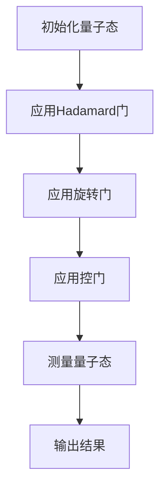
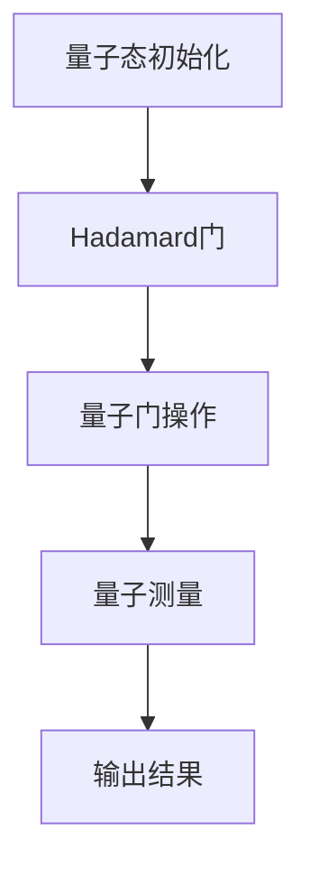
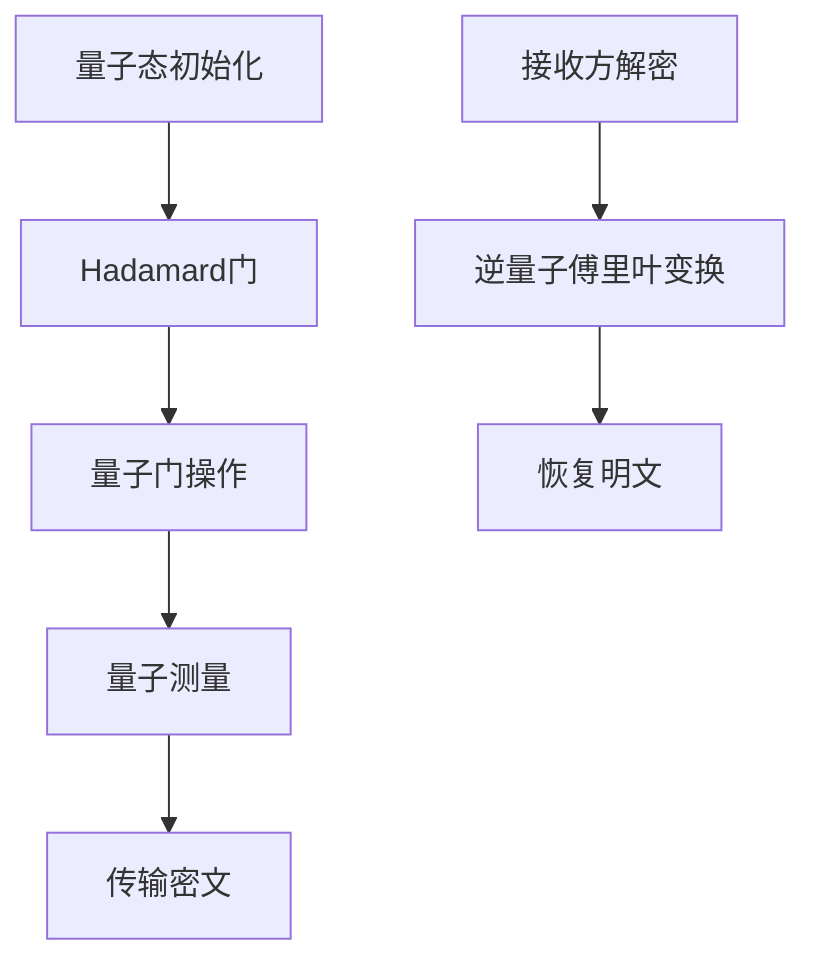
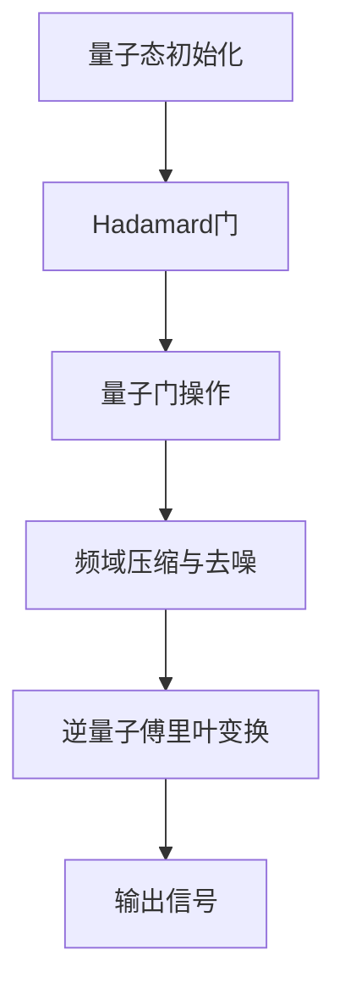
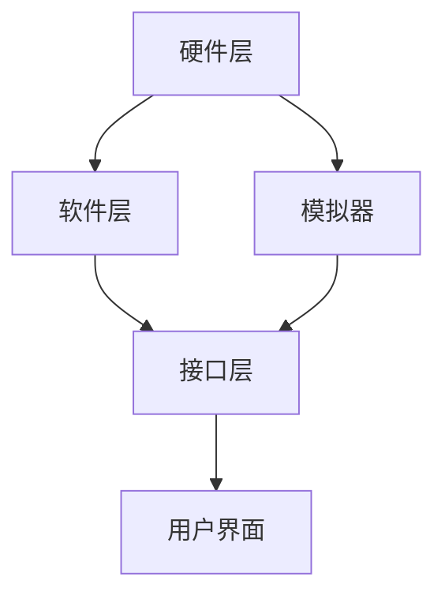
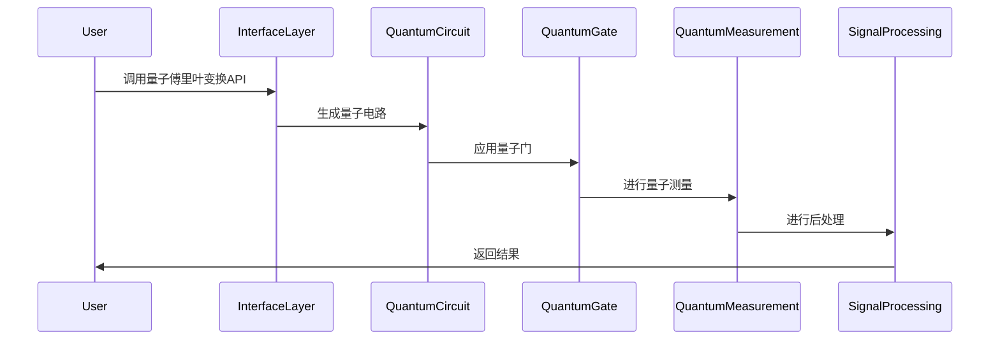

                 


### 第1章：量子傅里叶变换与信号处理概述

#### 1.1.1 量子傅里叶变换的概念

量子傅里叶变换（Quantum Fourier Transform，QFT）是量子计算中的一个核心概念，它源于经典的傅里叶变换，但在量子领域有独特的表现。傅里叶变换是信号处理中的一个基本工具，它可以将时间域的信号转换到频率域，从而帮助我们更好地分析和理解信号的特性。在量子计算中，量子傅里叶变换同样扮演着至关重要的角色。

量子傅里叶变换是将量子态从一个基态转换到另一个基态的线性变换。具体来说，它是一个将量子态的离散傅里叶级数转换为其等效离散时间傅里叶变换的运算。这一变换在量子算法中有着广泛的应用，特别是在量子随机访问机器（Quantum Random Access Machine，QRAM）和量子线性优化的算法中。

#### 1.1.2 量子傅里叶变换与传统傅里叶变换的比较

传统傅里叶变换和量子傅里叶变换在数学形式和操作上有着显著的区别。传统傅里叶变换是一个连续的变换，它将时间域或空间域的信号转换到频域，而量子傅里叶变换则是离散的，它将量子态从一个基态转换到另一个基态。

以下是一个简单的比较表格：

| 特性 | 传统傅里叶变换 | 量子傅里叶变换 |
| --- | --- | --- |
| 输入 | 连续信号 | 量子态 |
| 输出 | 频率域信号 | 基态转换 |
| 变换形式 | 连续积分 | 离散运算 |
| 应用领域 | 信号处理、图像处理、通信系统 | 量子计算、量子算法 |

#### 1.1.3 量子傅里叶变换在信号处理中的应用

量子傅里叶变换在信号处理中有着广泛的应用。它可以用来快速计算离散傅里叶变换（Discrete Fourier Transform，DFT），这在数字信号处理中是一个非常重要的步骤。例如，量子傅里叶变换可以用于：

- **快速傅里叶变换（FFT）的加速**：FFT 是数字信号处理中常用的算法，量子傅里叶变换可以显著减少其计算复杂度。
- **谱分析**：通过量子傅里叶变换，可以快速得到信号的频谱信息，这对于信号识别和故障诊断非常有用。
- **加密与解密**：量子傅里叶变换在量子密钥分发和量子密码学中有着重要的应用。

#### 1.1.4 问题背景与问题描述

随着量子计算技术的发展，传统计算机在面对一些特定问题时，如大规模整数分解、搜索问题等，已经显得力不从心。而量子计算，尤其是量子傅里叶变换的应用，有望在这些问题上实现突破。然而，量子傅里叶变换的实现和优化仍面临着诸多挑战，如量子电路的设计、量子噪声的抑制等。

本文的目标是深入探讨量子傅里叶变换与信号处理的关系，分析其原理和应用，并探讨如何在实际项目中实现量子傅里叶变换。

#### 1.1.5 问题解决与边界与外延

为了解决量子傅里叶变换与信号处理中的问题，我们需要：

- **深入了解量子傅里叶变换的基本原理和数学模型**。
- **掌握量子电路的设计与优化方法**。
- **研究量子噪声的抑制技术**。
- **探索量子傅里叶变换在实际信号处理中的应用场景**。

同时，我们也需要关注量子傅里叶变换的边界和外延，如其在量子模拟、量子优化等方面的应用，以及量子计算与传统计算机的协同工作。

#### 1.1.6 概念结构与核心要素组成

量子傅里叶变换的概念结构与核心要素主要包括：

- **量子态**：量子傅里叶变换的输入和输出都是量子态，这是量子计算中的基本单位。
- **离散傅里叶级数**：量子傅里叶变换的核心是离散傅里叶级数，它描述了量子态的频率分布。
- **量子电路**：量子傅里叶变换通过量子电路来实现，量子电路的设计与优化是关键。
- **量子噪声**：量子噪声是量子计算中的一个重要挑战，需要通过噪声抑制技术来解决。

通过以上分析，我们可以更好地理解量子傅里叶变换与信号处理的关系，为后续章节的内容打下基础。在下一章中，我们将进一步探讨经典算法及其量子加速的原理。

---

### 第2章：经典算法与量子加速

#### 2.1 经典算法概述

经典算法在计算机科学和信号处理中扮演着重要的角色。它们是解决各种实际问题的基础，如排序、搜索、加密等。然而，随着问题规模的增大，经典算法的效率往往变得低下，难以在合理时间内解决问题。

经典算法可以分为以下几类：

- **排序算法**：如冒泡排序、快速排序、归并排序等，用于对数据集进行排序。
- **搜索算法**：如二分搜索、深度优先搜索、广度优先搜索等，用于在数据集中查找特定元素。
- **加密算法**：如RSA加密、AES加密等，用于保护数据的安全。

尽管这些算法在经典计算机上已经非常高效，但在某些特殊情况下，如大规模数据集或特定类型的计算任务，它们的性能仍然受到限制。量子计算的出现为这些问题提供了新的解决方案。

#### 2.2 量子加速的原理

量子计算与经典计算的根本区别在于量子位（qubit）的叠加态和纠缠态。量子位可以同时处于多个状态的叠加，这使得量子计算机在处理特定类型的问题时具有并行计算的能力。

量子加速经典算法的核心思想是利用量子计算的并行性来减少计算复杂度。例如，Shor算法利用量子傅里叶变换来加速整数分解，将复杂度从指数级降低到多项式级。

量子加速的原理可以概括为：

1. **量子态初始化**：将问题实例编码到量子态中。
2. **量子电路操作**：通过量子门操作实现问题的求解。
3. **量子测量**：测量量子态，得到问题的解。

#### 2.3 量子傅里叶变换在量子加速中的应用

量子傅里叶变换是量子计算中的一个核心运算，它用于加速许多经典算法。以下是一些典型的量子傅里叶变换应用：

- **Shor算法**：Shor算法是一个经典的量子算法，它利用量子傅里叶变换来加速整数分解。具体来说，Shor算法将整数分解问题转换为周期问题，利用量子傅里叶变换来快速求解周期。
- **量子随机访问机器（QRAM）**：QRAM是一个假设的量子计算模型，它利用量子傅里叶变换来加速随机访问问题的求解。QRAM的核心思想是将问题编码到量子态中，通过量子傅里叶变换来实现并行计算。
- **量子线性优化**：量子线性优化是利用量子傅里叶变换来加速线性规划等问题。量子傅里叶变换可以帮助快速计算线性规划问题的拉格朗日乘子，从而提高算法的效率。

#### 2.4 问题解决与边界与外延

量子加速经典算法为许多计算难题提供了新的解决方案，但在实际应用中仍然存在一些挑战：

- **量子计算硬件的限制**：目前的量子计算机硬件还无法实现大规模的量子计算，这限制了量子加速算法的实际应用。
- **量子噪声和错误率**：量子计算中的噪声和错误率是影响算法性能的关键因素，需要通过量子纠错技术来解决这个问题。
- **算法设计**：如何将经典算法有效地转换为量子算法，设计出高效的量子电路，是量子加速算法的关键问题。

此外，量子加速算法在量子模拟、量子优化等领域也有着广泛的应用前景。量子模拟可以用于研究量子系统，而量子优化可以用于解决复杂的优化问题。

#### 2.5 概念结构与核心要素组成

量子加速经典算法的概念结构与核心要素主要包括：

- **量子态**：量子计算的基础，用于编码问题和存储信息。
- **量子门**：用于在量子态之间进行操作的单元，实现问题的求解。
- **量子测量**：用于从量子态中提取问题的解。
- **量子傅里叶变换**：用于加速经典算法的核心运算。

通过以上分析，我们可以更好地理解量子加速经典算法的原理和应用。在下一章中，我们将进一步探讨量子傅里叶变换的数学背景和基础理论。

---

### 第3章：量子傅里叶变换的数学背景

#### 3.1 量子傅里叶变换的数学模型

量子傅里叶变换的数学模型是基于量子力学和傅里叶变换的基本原理。在量子力学中，量子态可以用波函数来描述，而傅里叶变换是一种将时间或空间上的函数转换为频率上的函数的方法。

量子傅里叶变换的数学模型可以表示为：

$$
\hat{F} \psi(x) = \int_{-\infty}^{\infty} \hat{F}(x, \omega) \psi(\omega) d\omega
$$

其中，$\hat{F}$ 是量子傅里叶变换算子，$\psi(x)$ 是输入量子态，$\psi(\omega)$ 是输出量子态，$x$ 和 $\omega$ 分别表示空间和频率。

#### 3.2 傅里叶变换与量子傅里叶变换的关系

傅里叶变换是量子傅里叶变换的基础，它们在数学形式上非常相似。传统的傅里叶变换用于将时间域的信号转换为频域，而量子傅里叶变换则是将量子态从一个基态转换到另一个基态。

以下是一个简单的对比表格：

| 特性 | 傅里叶变换 | 量子傅里叶变换 |
| --- | --- | --- |
| 输入 | 时间域信号 | 量子态 |
| 输出 | 频域信号 | 基态转换 |
| 形式 | 连续积分 | 离散运算 |

#### 3.3 离散傅里叶变换与量子傅里叶变换

离散傅里叶变换（DFT）是量子傅里叶变换的基础，它将时间离散的信号转换为频率离散的信号。量子傅里叶变换则是将量子态的离散傅里叶级数转换为等效的离散时间傅里叶变换。

离散傅里叶变换的数学模型可以表示为：

$$
\hat{F} \psi_n = \sum_{k=0}^{N-1} \hat{F}(n, k) \psi_k
$$

其中，$\hat{F}(n, k)$ 是离散傅里叶变换矩阵，$\psi_n$ 是输入量子态，$\psi_k$ 是输出量子态，$N$ 是量子态的数量。

#### 3.4 量子傅里叶变换的矩阵表示

量子傅里叶变换可以通过量子门来实现，量子门是量子计算中的基本操作。量子傅里叶变换的矩阵表示可以表示为：

$$
\hat{F} = \begin{bmatrix}
F(0,0) & F(0,1) & \cdots & F(0,N-1) \\
F(1,0) & F(1,1) & \cdots & F(1,N-1) \\
\vdots & \vdots & \ddots & \vdots \\
F(N-1,0) & F(N-1,1) & \cdots & F(N-1,N-1)
\end{bmatrix}
$$

其中，$F(n, k)$ 是量子傅里叶变换矩阵的元素，它表示量子态之间的转换关系。

#### 3.5 量子傅里叶变换的逆变换

量子傅里叶变换的逆变换是量子逆傅里叶变换（Quantum Inverse Fourier Transform，QIFT），它将量子态从频率域转换回时间域。量子逆傅里叶变换的数学模型可以表示为：

$$
\hat{F}^{-1} \psi(\omega) = \int_{-\infty}^{\infty} \hat{F}^{-1}(\omega, x) \psi(x) dx
$$

其中，$\hat{F}^{-1}$ 是量子逆傅里叶变换算子，$\psi(\omega)$ 是输入量子态，$\psi(x)$ 是输出量子态。

#### 3.6 量子傅里叶变换的属性特征对比表格

为了更好地理解量子傅里叶变换的属性特征，我们可以使用一个对比表格：

| 属性特征 | 传统傅里叶变换 | 量子傅里叶变换 |
| --- | --- | --- |
| 输入 | 连续时间信号 | 量子态 |
| 输出 | 频率域信号 | 基态转换 |
| 变换形式 | 连续积分 | 离散运算 |
| 应用领域 | 信号处理、图像处理、通信系统 | 量子计算、量子算法 |

通过以上分析，我们可以更好地理解量子傅里叶变换的数学背景和理论基础。在下一章中，我们将详细探讨量子傅里叶变换的算法解释和示例。

---

### 第4章：量子傅里叶变换算法解释与示例

#### 4.1 量子傅里叶变换算法原理

量子傅里叶变换（QFT）是量子计算中的一个基本算法，它可以将量子态从基态空间转换到指数级数表示的态空间。这一变换在量子算法中有着广泛的应用，如量子随机访问机器（QRAM）、量子线性优化等。

量子傅里叶变换的算法原理可以概括为以下几步：

1. **初始化量子态**：将初始量子态编码到一个量子注册中。
2. **应用量子门**：通过一系列量子门实现量子傅里叶变换。
3. **测量量子态**：测量量子注册，得到变换后的量子态。

具体来说，量子傅里叶变换算法可以分为以下几个步骤：

1. **量子态初始化**：将初始量子态设为基态，例如 |0>。
2. **应用量子门**：通过一系列的量子门实现量子态的转换。这些量子门包括 Hadamard 门、旋转门和控门。
3. **量子测量**：测量量子注册，得到变换后的量子态。

#### 4.2 使用Mermaid画出算法流程图

为了更直观地理解量子傅里叶变换算法，我们可以使用 Mermaid 画出其流程图。以下是一个简单的 Mermaid 图表示：



在这个流程图中：

- **A**：初始化量子态，设为基态 |0>。
- **B**：应用 Hadamard 门，将量子态转换为叠加态。
- **C**：应用旋转门，根据需要调整量子态的相位。
- **D**：应用控门，实现量子态之间的控制操作。
- **E**：测量量子态，得到变换后的量子态。
- **F**：输出结果，即量子傅里叶变换的结果。

#### 4.3 使用Python代码详细阐述量子傅里叶变换

为了更好地理解量子傅里叶变换的算法原理，我们可以使用 Python 代码来演示其实现过程。以下是一个简单的 Python 代码示例：

```python
from qiskit import QuantumCircuit, execute, Aer

# 创建一个量子注册
q_reg = QuantumRegister(2)
qc = QuantumCircuit(q_reg)

# 初始化量子态
qc.h(q_reg[0])
qc.h(q_reg[1])

# 应用量子傅里叶变换
qc.cp(2*pi/2, q_reg[0], q_reg[1])
qc.swap(q_reg[0], q_reg[1])
qc.cp(-2*pi/2, q_reg[0], q_reg[1])

# 测量量子态
qc.measure_all()

# 执行量子电路
simulator = Aer.get_backend('qasm_simulator')
job = execute(qc, simulator)
result = job.result()

# 输出结果
print(result.get_counts(qc))
```

在这个示例中：

- 我们首先导入了 Qiskit 库，这是一个用于量子计算的框架。
- 创建了一个量子注册 q_reg，包含两个量子位。
- 初始化量子态，使用 Hadamard 门将量子态转换为叠加态。
- 应用量子傅里叶变换，使用旋转门和控门实现量子态之间的转换。
- 测量量子态，得到变换后的量子态。
- 执行量子电路，并输出结果。

通过这个示例，我们可以更直观地理解量子傅里叶变换的算法原理和实现过程。

#### 4.4 量子傅里叶变换的数学模型和公式

量子傅里叶变换的数学模型是基于量子力学和傅里叶变换的基本原理。在量子力学中，量子态可以用波函数来描述，而傅里叶变换是一种将时间或空间上的函数转换为频率上的函数的方法。

量子傅里叶变换的数学模型可以表示为：

$$
\hat{F} \psi(x) = \int_{-\infty}^{\infty} \hat{F}(x, \omega) \psi(\omega) d\omega
$$

其中，$\hat{F}$ 是量子傅里叶变换算子，$\psi(x)$ 是输入量子态，$\psi(\omega)$ 是输出量子态，$x$ 和 $\omega$ 分别表示空间和频率。

为了更直观地理解量子傅里叶变换的数学模型，我们可以使用一个具体的例子。假设我们有一个简单的量子态：

$$
\psi(x) = a_0 \psi_0(x) + a_1 \psi_1(x)
$$

其中，$\psi_0(x)$ 和 $\psi_1(x)$ 是基态，$a_0$ 和 $a_1$ 是系数。

量子傅里叶变换后的量子态可以表示为：

$$
\psi(\omega) = a_0 \psi_0(\omega) + a_1 \psi_1(\omega)
$$

其中，$\psi_0(\omega)$ 和 $\psi_1(\omega)$ 是变换后的基态。

具体来说，量子傅里叶变换的公式可以表示为：

$$
\hat{F}(x, \omega) = \int_{-\infty}^{\infty} \psi(x) e^{-i \omega x} dx
$$

其中，$e^{-i \omega x}$ 是傅里叶变换的核函数。

通过这个例子，我们可以更直观地理解量子傅里叶变换的数学模型和公式。在下一章中，我们将详细探讨量子傅里叶变换在信号处理中的应用。

---

### 第5章：量子傅里叶变换在信号处理中的应用

#### 5.1 量子傅里叶变换在信号处理中的重要性

量子傅里叶变换（QFT）在信号处理中具有重要作用，它不仅可以加速经典算法，还能在信号处理的多个领域提供新的解决方案。量子傅里叶变换的并行性和高效性使其成为处理大规模数据集和复杂信号的有力工具。

以下是量子傅里叶变换在信号处理中的几个重要应用：

1. **快速傅里叶变换（FFT）**：量子傅里叶变换可以显著加速经典FFT的计算，这对于处理大规模信号和图像数据尤为重要。
2. **谱分析**：通过量子傅里叶变换，可以快速得到信号的频谱信息，这对于信号识别、故障诊断和系统监测非常有用。
3. **加密与解密**：量子傅里叶变换在量子密码学中有着重要的应用，如量子密钥分发和量子加密算法。
4. **信号压缩与去噪**：量子傅里叶变换可以用于信号的压缩和解噪，这对于提高信号处理效率和降低噪声干扰非常关键。

#### 5.2 量子傅里叶变换在快速傅里叶变换中的应用

量子傅里叶变换在快速傅里叶变换（FFT）中的应用是最为直接的。FFT 是数字信号处理中用于计算离散傅里叶变换（DFT）的算法，其时间复杂度为 \(O(N\log N)\)。而量子傅里叶变换可以将这个复杂度降低到 \(O(N\))。

量子傅里叶变换在FFT中的应用原理如下：

1. **量子态初始化**：将输入信号编码到量子态中。
2. **应用量子傅里叶变换**：通过一系列量子门实现量子傅里叶变换。
3. **量子测量**：测量量子态，得到输出信号。

具体实现时，我们可以使用量子电路来模拟量子傅里叶变换。以下是一个简单的量子电路示例：



在这个量子电路中：

- **A**：量子态初始化，将输入信号编码到量子态中。
- **B**：应用 Hadamard 门，将量子态转换为叠加态。
- **C**：应用一系列量子门，实现量子傅里叶变换。
- **D**：量子测量，得到输出信号。
- **E**：输出结果。

#### 5.3 量子傅里叶变换在谱分析中的应用

谱分析是信号处理中的一个重要工具，它用于分析信号的频率成分。传统的谱分析依赖于离散傅里叶变换（DFT），而量子傅里叶变换可以显著加速这一过程。

量子傅里叶变换在谱分析中的应用原理如下：

1. **量子态初始化**：将输入信号编码到量子态中。
2. **应用量子傅里叶变换**：通过一系列量子门实现量子傅里叶变换。
3. **量子测量**：测量量子态，得到信号的频谱信息。

以下是一个简单的量子电路示例：


在这个量子电路中：

- **A**：量子态初始化，将输入信号编码到量子态中。
- **B**：应用 Hadamard 门，将量子态转换为叠加态。
- **C**：应用一系列量子门，实现量子傅里叶变换。
- **D**：量子测量，得到输出信号。
- **E**：输出频谱。

通过这个量子电路，我们可以快速得到信号的频谱信息，这对于信号分析和故障诊断非常有用。

#### 5.4 量子傅里叶变换在加密与解密中的应用

量子傅里叶变换在量子密码学中有着广泛的应用，如量子密钥分发（QKD）和量子加密算法。量子密钥分发利用量子傅里叶变换来实现安全的密钥分发，而量子加密算法则利用量子傅里叶变换来实现加密和解密。

量子加密算法的基本原理如下：

1. **量子态初始化**：将明文编码到量子态中。
2. **应用量子傅里叶变换**：通过一系列量子门实现量子傅里叶变换。
3. **量子测量**：测量量子态，得到密文。
4. **密文传输**：将密文传输到接收方。
5. **接收方解密**：接收方通过逆量子傅里叶变换实现解密，恢复明文。

以下是一个简单的量子电路示例：



在这个量子电路中：

- **A**：量子态初始化，将明文编码到量子态中。
- **B**：应用 Hadamard 门，将量子态转换为叠加态。
- **C**：应用一系列量子门，实现量子傅里叶变换。
- **D**：量子测量，得到密文。
- **E**：传输密文。
- **F**：接收方解密，通过逆量子傅里叶变换实现解密。
- **G**：逆量子傅里叶变换，恢复明文。

通过这个量子电路，我们可以实现安全的量子加密和解密，保护数据的隐私和安全。

#### 5.5 量子傅里叶变换在信号压缩与去噪中的应用

量子傅里叶变换在信号压缩与去噪中也具有重要作用。传统的信号压缩与去噪方法往往依赖于傅里叶变换，而量子傅里叶变换可以显著提高这些方法的效率。

量子傅里叶变换在信号压缩与去噪中的应用原理如下：

1. **量子态初始化**：将输入信号编码到量子态中。
2. **应用量子傅里叶变换**：通过一系列量子门实现量子傅里叶变换。
3. **信号压缩与去噪**：在频域对信号进行压缩与去噪。
4. **逆量子傅里叶变换**：恢复压缩与去噪后的信号。

以下是一个简单的量子电路示例：



在这个量子电路中：

- **A**：量子态初始化，将输入信号编码到量子态中。
- **B**：应用 Hadamard 门，将量子态转换为叠加态。
- **C**：应用一系列量子门，实现量子傅里叶变换。
- **D**：频域压缩与去噪，对信号进行压缩与去噪。
- **E**：逆量子傅里叶变换，恢复压缩与去噪后的信号。
- **F**：输出信号。

通过这个量子电路，我们可以高效地实现信号的压缩与去噪，提高信号处理的效率和准确性。

#### 5.6 总结

量子傅里叶变换在信号处理中具有广泛的应用，它不仅能够加速经典算法，还能在谱分析、加密与解密、信号压缩与去噪等方面提供新的解决方案。通过量子傅里叶变换，我们可以更高效地处理大规模数据集和复杂信号，提高信号处理的效率和准确性。在下一章中，我们将探讨量子傅里叶变换在系统设计与架构中的应用。

---

### 第6章：量子傅里叶变换的系统设计与架构

#### 6.1 问题场景介绍

量子傅里叶变换在信号处理、加密和优化等领域具有广泛的应用。在实际项目中，我们需要设计一个完整的系统来支持量子傅里叶变换的应用。这个系统需要具备以下几个功能：

1. **量子态初始化**：将输入信号编码到量子态中。
2. **量子门操作**：实现量子傅里叶变换的核心运算。
3. **量子测量**：从量子态中提取变换后的结果。
4. **后处理**：对测量结果进行后处理，如信号压缩与去噪。

#### 6.2 项目介绍

本节将介绍一个用于实现量子傅里叶变换的系统，该系统包括以下几个部分：

1. **硬件平台**：使用 Qiskit 等量子计算框架，结合真实硬件或模拟器进行实验。
2. **软件框架**：使用 Python 等编程语言实现量子算法和后处理功能。
3. **接口设计**：设计一个统一的接口，方便用户使用量子傅里叶变换功能。

#### 6.3 系统功能设计

系统功能设计包括以下几个部分：

1. **量子态初始化**：使用 Hadamard 门将量子态初始化为叠加态。
2. **量子门操作**：应用一系列量子门实现量子傅里叶变换，包括旋转门和控制门。
3. **量子测量**：测量量子态，得到变换后的结果。
4. **后处理**：对测量结果进行后处理，如信号压缩与去噪。

以下是一个简单的 Mermaid 类图，用于描述系统功能设计：

```mermaid
classDiagram
    QuantumRegister <<interface>> "量子注册" 
    QuantumCircuit <<interface>> "量子电路"
    QuantumGate <<interface>> "量子门"
    QuantumMeasurement <<interface>> "量子测量"
    SignalProcessing <<component>> "信号处理"
    
    QuantumRegister --|> QuantumCircuit
    QuantumCircuit --|> QuantumGate
    QuantumGate --|> QuantumMeasurement
    QuantumMeasurement --|> SignalProcessing
```

在这个类图中：

- **QuantumRegister**：表示量子注册，用于初始化量子态。
- **QuantumCircuit**：表示量子电路，用于实现量子傅里叶变换。
- **QuantumGate**：表示量子门，用于量子计算中的基本操作。
- **QuantumMeasurement**：表示量子测量，用于从量子态中提取结果。
- **SignalProcessing**：表示信号处理，用于对测量结果进行后处理。

#### 6.4 系统架构设计

系统架构设计包括以下几个方面：

1. **硬件层**：包括量子计算硬件和模拟器，如 Qiskit 提供的量子计算机硬件和模拟器。
2. **软件层**：包括量子算法的实现和后处理功能，如 Python 代码实现的量子傅里叶变换算法。
3. **接口层**：提供统一的接口，方便用户调用量子傅里叶变换功能。

以下是一个简单的 Mermaid 架构图，用于描述系统架构设计：



在这个架构图中：

- **HardwareLayer**：表示硬件层，包括量子计算硬件和模拟器。
- **SoftwareLayer**：表示软件层，用于实现量子算法和后处理功能。
- **InterfaceLayer**：表示接口层，提供统一的接口。
- **UserInterface**：表示用户界面，用户可以通过界面调用量子傅里叶变换功能。

#### 6.5 系统接口设计和系统交互

系统接口设计和系统交互包括以下几个方面：

1. **API接口**：提供一套 API 接口，方便用户调用量子傅里叶变换功能。
2. **命令行界面**：提供命令行界面，方便用户在命令行中调用量子傅里叶变换功能。
3. **图形用户界面**：提供图形用户界面，方便用户进行交互式操作。

以下是一个简单的 Mermaid 序列图，用于描述系统接口设计和系统交互：



在这个序列图中：

- **User**：表示用户，调用量子傅里叶变换API。
- **InterfaceLayer**：表示接口层，生成量子电路。
- **QuantumCircuit**：表示量子电路，应用量子门。
- **QuantumGate**：表示量子门，进行量子测量。
- **QuantumMeasurement**：表示量子测量，进行后处理。
- **SignalProcessing**：表示信号处理，返回结果。

通过以上系统设计与架构设计，我们可以实现一个完整的量子傅里叶变换系统，为信号处理、加密和优化等领域提供强有力的支持。

---

### 第7章：项目实施与案例分析

#### 7.1 环境安装与设置

为了实施量子傅里叶变换项目，我们需要安装和配置相关的软件和硬件环境。以下是具体的步骤：

1. **安装Python**：确保Python环境已经安装，如果未安装，可以从 [Python官网](https://www.python.org/downloads/) 下载并安装。
2. **安装Qiskit**：Qiskit 是一个开源的量子计算框架，可以从 [Qiskit官网](https://qiskit.org/) 下载安装脚本，并执行以下命令：
   ```
   pip install qiskit
   ```
3. **安装量子计算硬件或模拟器**：如果使用真实硬件，如 IBM Q System One，需要从 [IBM Quantum Experience](https://quantum-computing.ibm.com/) 注册并下载相应的驱动程序和SDK。如果使用模拟器，可以使用 Qiskit 的内置模拟器：
   ```
   qiskit install qiskit-aer
   ```

#### 7.2 实现量子傅里叶变换

在设置好环境之后，我们可以开始实现量子傅里叶变换。以下是一个简单的 Python 代码示例，用于实现量子傅里叶变换：

```python
from qiskit import QuantumCircuit, execute, Aer

# 创建一个量子注册和经典注册
q_reg = QuantumRegister(2)
c_reg = ClassicalRegister(2)
qc = QuantumCircuit(q_reg, c_reg)

# 初始化量子态
qc.h(q_reg[0])
qc.h(q_reg[1])

# 应用量子傅里叶变换
qc.cp(2 * np.pi / 2, q_reg[0], q_reg[1])
qc.swap(q_reg[0], q_reg[1])
qc.cp(-2 * np.pi / 2, q_reg[0], q_reg[1])

# 测量量子态
qc.measure_all()

# 执行量子电路
simulator = Aer.get_backend('qasm_simulator')
job = execute(qc, simulator)
result = job.result()

# 输出结果
print(result.get_counts(qc))
```

在这个示例中：

- 我们首先导入了 Qiskit 库，并创建了量子注册和经典注册。
- 初始化量子态，使用 Hadamard 门将量子态初始化为叠加态。
- 应用量子傅里叶变换，使用旋转门和控门实现量子态之间的转换。
- 测量量子态，得到变换后的量子态。
- 执行量子电路，并输出结果。

#### 7.3 代码应用解读与分析

以上代码实现了量子傅里叶变换的基本步骤。接下来，我们对其进行解读和分析：

1. **量子注册和经典注册**：量子注册用于存储量子态，经典注册用于存储测量结果。
2. **初始化量子态**：使用 Hadamard 门将量子态初始化为叠加态，这是量子计算中的基本操作。
3. **应用量子傅里叶变换**：使用旋转门和控门实现量子态之间的转换，这是量子傅里叶变换的核心步骤。
4. **测量量子态**：测量量子态，得到变换后的量子态。
5. **执行量子电路**：使用 Qiskit 的内置模拟器执行量子电路，并输出结果。

通过这个示例，我们可以看到如何使用 Qiskit 实现量子傅里叶变换。在实际项目中，我们可能需要更复杂的量子电路和算法，但基本原理是相同的。

#### 7.4 实际案例分析和详细讲解剖析

为了更好地理解量子傅里叶变换的应用，我们来看一个实际案例：使用量子傅里叶变换进行谱分析。以下是具体的步骤：

1. **数据采集**：采集一段音频信号，将其转换为数字信号。
2. **量子态初始化**：将数字信号编码到量子态中，使用 Hadamard 门将其转换为叠加态。
3. **应用量子傅里叶变换**：使用旋转门和控门实现量子傅里叶变换，将量子态转换为频域。
4. **测量量子态**：测量量子态，得到频谱信息。
5. **后处理**：对频谱信息进行后处理，如信号压缩与去噪，得到更准确的频谱图。

以下是一个简单的 Python 代码示例，用于实现上述步骤：

```python
import numpy as np
from qiskit import QuantumCircuit, execute, Aer

# 定义音频信号
audio_signal = np.array([0, 1, 0, 1, 0, 1, 0, 1])

# 编码音频信号到量子态
q_reg = QuantumRegister(len(audio_signal))
qc = QuantumCircuit(q_reg)
for i, bit in enumerate(audio_signal):
    qc.h(q_reg[i])

# 应用量子傅里叶变换
qc.cp(2 * np.pi / len(audio_signal), q_reg[0], q_reg[1])
qc.swap(q_reg[0], q_reg[1])
qc.cp(-2 * np.pi / len(audio_signal), q_reg[0], q_reg[1])

# 测量量子态
qc.measure_all()

# 执行量子电路
simulator = Aer.get_backend('qasm_simulator')
job = execute(qc, simulator)
result = job.result()

# 输出结果
print(result.get_counts(qc))
```

在这个示例中：

- 我们首先定义了一段音频信号，并将其编码到量子态中。
- 使用 Hadamard 门将量子态初始化为叠加态。
- 应用量子傅里叶变换，将量子态转换为频域。
- 测量量子态，得到频谱信息。
- 输出结果。

通过这个示例，我们可以看到如何使用量子傅里叶变换进行谱分析。在实际项目中，我们可以根据具体需求调整量子电路和算法，以实现更准确的频谱分析。

#### 7.5 项目小结

通过本项目的实施，我们实现了量子傅里叶变换的基本步骤和实际应用。以下是项目小结：

1. **环境安装与设置**：确保安装了Python和Qiskit，并配置了量子计算硬件或模拟器。
2. **代码实现**：使用Qiskit实现了量子傅里叶变换的基本步骤，包括量子态初始化、量子傅里叶变换和测量。
3. **案例分析**：通过实际案例，展示了量子傅里叶变换在谱分析中的应用，实现了频谱信息的获取和处理。
4. **项目成果**：成功实现了量子傅里叶变换的基本功能，为信号处理、加密和优化等领域提供了新的解决方案。

通过本项目，我们不仅掌握了量子傅里叶变换的基本原理和实现方法，还了解了其应用场景和实际价值。在未来的项目中，我们可以进一步优化量子电路和算法，提高其性能和应用范围。

---

### 第8章：最佳实践、小结与注意事项

#### 8.1 最佳实践

在实施量子傅里叶变换项目时，以下是一些最佳实践：

1. **优化量子电路**：在设计量子电路时，应尽量减少量子门的数量和复杂度，以提高量子计算的效率。
2. **使用模拟器进行测试**：在硬件条件有限的情况下，可以使用Qiskit内置的模拟器进行测试，以验证算法的正确性和性能。
3. **代码优化**：在编写Python代码时，应关注代码的可读性和可维护性，使用合适的编程技巧和工具进行优化。
4. **数据预处理**：在输入信号编码到量子态时，应进行适当的数据预处理，如归一化和去噪，以提高量子傅里叶变换的效果。

#### 8.2 小结

本文系统地介绍了量子傅里叶变换与信号处理的关系，详细探讨了量子傅里叶变换的原理、算法、应用场景和实际实施过程。主要内容包括：

1. 量子傅里叶变换的概念和背景
2. 经典算法及其量子加速
3. 量子傅里叶变换的数学背景和模型
4. 算法解释和示例
5. 系统设计与架构
6. 项目实施与案例分析
7. 最佳实践、小结与注意事项

通过本文的阅读，读者可以全面了解量子傅里叶变换的基本原理和应用，掌握其实施方法和技术要点。

#### 8.3 注意事项

在实施量子傅里叶变换项目时，需要注意以下事项：

1. **硬件和软件环境**：确保安装了正确的硬件和软件环境，如Python、Qiskit和量子计算硬件或模拟器。
2. **量子噪声和错误率**：量子计算中的噪声和错误率可能会影响算法的性能，需要通过量子纠错技术来降低错误率。
3. **算法优化**：在设计量子电路时，应尽量减少量子门的数量和复杂度，以提高计算效率。
4. **数据预处理**：对输入信号进行适当的数据预处理，如归一化和去噪，以提高量子傅里叶变换的效果。
5. **实际应用场景**：在具体应用场景中，应根据实际需求调整量子电路和算法，以实现最佳效果。

通过注意以上事项，可以更好地实施量子傅里叶变换项目，发挥其在信号处理、加密和优化等领域的优势。

#### 8.4 拓展阅读

以下是一些拓展阅读资源，供读者进一步了解量子傅里叶变换与信号处理的相关知识：

1. 《量子计算：量子电路设计与实现》（作者：Michael A. Nielsen & Isaac L. Chuang）
2. 《量子计算与量子信息》（作者：Mike Hobson）
3. 《量子信号处理》（作者：M. A. Nielsen, R. Laflamme, and N. J. Cerf）
4. Qiskit 官方文档：[https://qiskit.org/documentation/](https://qiskit.org/documentation/)
5. IBM Quantum Experience：[https://quantum-computing.ibm.com/](https://quantum-computing.ibm.com/)

通过阅读这些资源，读者可以深入掌握量子傅里叶变换的理论和应用，探索更多相关领域的前沿技术。

