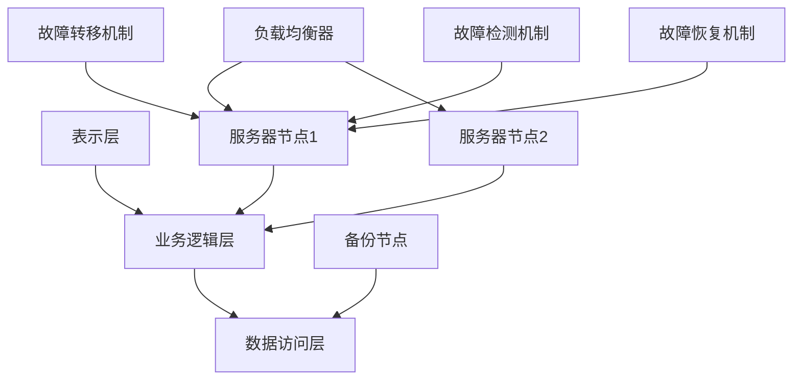

                 

### 量子容错与高可用性系统：构建稳健软件的量子方法

关键词：量子计算、高可用性系统、量子比特、错误纠正、算法

摘要：随着量子计算技术的发展，量子容错与高可用性系统逐渐成为构建稳健软件的重要手段。本文将介绍量子容错与高可用性系统的基本概念、原理和应用，通过一步一步的分析和推理，探讨其在提高软件系统可靠性方面的优势及其未来的发展前景。

### 目录大纲

1. 量子容错与高可用性系统概述
    1.1 问题背景与解决思路
    1.2 核心概念与联系
    1.3 量子容错与高可用性系统原理
    1.4 量子容错与高可用性系统的发展与应用前景
2. 量子容错技术
    2.1 量子比特与量子错误纠正
    2.2 量子错误纠正算法
    2.3 量子纠错机制
3. 高可用性系统设计
    3.1 问题场景介绍
    3.2 系统功能设计
    3.3 系统架构设计
    3.4 系统接口设计和系统交互
4. 量子容错与高可用性系统应用实战
    4.1 环境安装
    4.2 系统核心实现
    4.3 实际案例分析与讲解
    4.4 项目小结
5. 最佳实践与拓展
    5.1 最佳实践总结
    5.2 小结与注意事项
    5.3 拓展阅读

### 第一部分：量子容错与高可用性系统概述

#### 1.1 问题背景与解决思路

随着信息化和数字化时代的到来，软件系统在各个领域的应用越来越广泛。然而，软件系统的高可靠性和稳定性成为了亟待解决的问题。传统计算方法在面对复杂的计算任务和潜在的计算错误时，往往显得力不从心。量子计算的崛起为解决这一问题提供了新的思路。

量子计算机通过使用量子比特（qubit）进行计算，具有超强的并行计算能力和高效的算法。然而，量子计算机在运行过程中容易受到外部干扰和量子噪声的影响，导致计算错误。因此，量子容错与高可用性系统应运而生。

量子容错与高可用性系统旨在通过量子计算技术构建出高可靠性的软件系统，从而提高软件系统的稳定性和可用性。本文将详细探讨量子容错与高可用性系统的基本概念、原理和应用，帮助读者了解这一前沿技术的优势及其在软件系统构建中的应用。

#### 1.2 核心概念与联系

在量子容错与高可用性系统的讨论中，我们需要了解几个核心概念：量子比特、量子纠缠、量子计算基础和量子错误纠正。

- **量子比特**（Qubit）：量子比特是量子计算机的基本单位，可以表示为0和1的叠加态。与经典比特不同，量子比特具有量子叠加和量子纠缠的特性。

- **量子纠缠**（Quantum Entanglement）：量子纠缠是量子力学中的一种现象，当两个或多个量子系统相互关联时，它们的状态会相互影响。量子纠缠是量子计算的核心特性之一，使得量子计算机能够进行并行计算。

- **量子计算基础**：量子计算基础包括量子门、量子算法和量子电路等。量子门是量子计算机中的基本操作，用于改变量子比特的状态。量子算法是利用量子计算机的特性进行特定计算的方法。量子电路是量子计算机中的指令序列，用于实现量子算法。

- **量子错误纠正**（Quantum Error Correction）：量子错误纠正是指通过特定的量子编码和量子纠错机制，对量子计算机中的错误进行检测和纠正。量子错误纠正确保了量子计算的可靠性，是量子计算机能够稳定运行的关键技术。

以下是一个概念属性特征对比表格，用于对比传统计算和量子计算的优缺点：

| 特性             | 传统计算                    | 量子计算                      |
|------------------|-----------------------------|-------------------------------|
| 基本单位         | 比特（Bit）                 | 量子比特（Qubit）             |
| 并行计算能力     | 有限                        | 极强                          |
| 算法效率         | 受限于问题复杂度             | 可以实现指数级加速             |
| 抗干扰能力       | 较弱                        | 较强                          |
| 易受噪声影响     | 较少                         | 较多                         |
| 错误纠正机制     | 有限                        | 量子错误纠正技术              |

通过对比可以看出，量子计算在并行计算能力和算法效率方面具有显著优势，但在抗干扰能力和易受噪声影响方面存在挑战。量子容错与高可用性系统旨在解决这些问题，提高量子计算机的可靠性和稳定性。

#### 1.3 量子容错与高可用性系统原理

量子容错与高可用性系统是结合量子计算技术和传统系统设计方法的一种创新思路，旨在构建出高度可靠的软件系统。以下是量子容错与高可用性系统的原理：

- **量子容错原理**：量子容错原理是通过量子错误纠正算法和量子编码技术来检测和纠正量子计算机中的错误。量子错误纠正算法主要包括量子编码和量子纠错机制。量子编码技术将量子比特编码成多个物理比特，提高错误检测和纠正的能力。量子纠错机制通过特定的量子逻辑门和量子测量来检测和纠正错误。

- **高可用性系统原理**：高可用性系统原理是通过冗余机制和故障恢复策略来确保软件系统的持续运行。冗余机制包括硬件冗余、数据冗余和功能冗余。硬件冗余通过冗余硬件组件提高系统的可靠性。数据冗余通过备份和复制技术确保数据的可用性。功能冗余通过多个功能模块的并行运行提高系统的容错能力。故障恢复策略包括自动故障检测和自动故障恢复，确保系统在发生故障时能够快速恢复正常运行。

下面是一个简单的量子容错与高可用性系统的示意图：

```
+------------------------+
| 量子计算机             |
+------------------------+
        |
        v
+------------------------+
| 量子错误纠正机制       |
+------------------------+
        |
        v
+------------------------+
| 高可用性系统架构       |
+------------------------+
        |
        v
+------------------------+
| 冗余机制与故障恢复     |
+------------------------+
```

通过量子容错与高可用性系统的原理，我们可以构建出高度可靠的软件系统，提高系统的稳定性和可用性，从而满足日益复杂的计算需求。

#### 1.4 量子容错与高可用性系统的发展与应用前景

量子容错与高可用性系统作为一项新兴技术，已经在多个领域展现出了巨大的潜力。以下是量子容错与高可用性系统的发展历程和应用前景：

- **发展历程**：
  - 20世纪90年代，Shor算法的提出引发了量子计算的广泛关注，同时量子错误纠正的概念也被提出。
  - 2000年后，量子计算机的理论研究取得重要突破，量子比特和量子纠错机制的设计逐渐成熟。
  - 近年来，量子计算机的实际实现取得重要进展，多个量子计算原型机问世，量子容错与高可用性系统的研究也逐渐深入。

- **应用前景**：
  - **金融领域**：量子计算机在加密破解、风险分析和金融建模等方面具有巨大潜力。量子容错与高可用性系统可以提高金融系统的安全性和可靠性。
  - **医疗领域**：量子计算机在药物设计、基因组学和生物信息学等领域具有广泛应用前景。量子容错与高可用性系统可以确保医疗系统的稳定运行和数据的准确性。
  - **能源领域**：量子计算机在能源优化、电力系统设计和环境保护等方面具有重要作用。量子容错与高可用性系统可以提高能源系统的效率和可靠性。
  - **其他领域**：量子计算机在材料科学、航空航天、人工智能等领域也有广泛的应用前景。量子容错与高可用性系统可以为这些领域提供稳定可靠的计算支持。

随着量子计算技术的发展，量子容错与高可用性系统将在各个领域发挥越来越重要的作用，为构建稳健的软件系统提供新的思路和方法。

### 第二部分：量子容错技术

#### 2.1 量子比特与量子错误纠正

量子比特是量子计算机的基本单位，具有量子叠加和量子纠缠的特性。量子比特的工作原理与经典比特不同，可以同时处于0和1的叠加态。这种叠加态使得量子比特能够进行并行计算，从而提高计算效率。

量子错误纠正技术是确保量子计算可靠性的关键。量子比特在运算过程中容易受到外部干扰和量子噪声的影响，导致计算错误。因此，量子错误纠正技术通过量子编码和量子纠错机制来检测和纠正这些错误。

量子编码是将量子比特编码成多个物理比特的过程。通过增加额外的量子比特，可以将量子比特的状态信息分布在多个物理比特上，从而提高错误检测和纠正的能力。常见的量子编码技术包括Shor编码和Steane编码等。

量子纠错机制是通过特定的量子逻辑门和量子测量来检测和纠正错误。量子逻辑门是量子计算中的基本操作，用于改变量子比特的状态。量子测量则用于获取量子比特的状态信息。通过量子逻辑门和量子测量的组合，可以实现对量子比特的精确控制和错误检测。

下面是一个简单的量子纠错机制示意图：

```
+------------------------+
| 量子比特              |
+------------------------+
        |
        v
+------------------------+
| 量子逻辑门             |
+------------------------+
        |
        v
+------------------------+
| 量子测量               |
+------------------------+
        |
        v
+------------------------+
| 错误检测与纠正         |
+------------------------+
```

通过量子编码和量子纠错机制的组合，量子计算机能够有效地检测和纠正计算错误，从而提高计算的可靠性。

#### 2.2 量子错误纠正算法

量子错误纠正算法是实现量子计算机可靠性的关键。常见的量子错误纠正算法包括Shor算法、Steane编码和Reed-Solomon编码等。

- **Shor算法**：Shor算法是一种用于解决整数量子因数分解的算法，也是量子计算机的一个重要应用。Shor算法的核心思想是利用量子计算机的并行计算能力和量子纠缠特性，快速找到大整数的因子。

- **Steane编码**：Steane编码是一种简单的量子错误纠正编码方法，可以将一个物理量子比特编码成三个逻辑量子比特。通过特定的量子逻辑门和量子测量，Steane编码能够检测和纠正单个量子比特的错误。

- **Reed-Solomon编码**：Reed-Solomon编码是一种经典的错误纠正编码方法，广泛应用于数据存储和通信领域。Reed-Solomon编码可以将多个量子比特编码成一个复数，从而提高错误检测和纠正的能力。

以下是量子错误纠正算法的简要概述：

| 算法名称 | 核心思想 | 应用领域 |
|----------|----------|----------|
| Shor算法 | 利用量子并行计算解决整数量子因数分解 | 数论、密码学 |
| Steane编码 | 将物理量子比特编码成三个逻辑量子比特 | 量子计算基础 |
| Reed-Solomon编码 | 将多个量子比特编码成一个复数 | 数据存储和通信 |

通过量子错误纠正算法，量子计算机能够有效地检测和纠正计算错误，提高计算可靠性。

#### 2.3 量子纠错机制

量子纠错机制是量子计算机实现可靠性的关键。量子纠错机制通过量子逻辑门和量子测量的组合，实现对量子比特的精确控制和错误检测。

量子逻辑门是量子计算机中的基本操作，用于改变量子比特的状态。常见的量子逻辑门包括Hadamard门、Pauli门和控制-NOT门等。这些量子逻辑门可以组合成各种复杂的量子电路，用于实现特定的量子算法。

量子测量是获取量子比特状态信息的过程。通过量子测量，可以确定量子比特的实际状态，并进行错误检测和纠正。

量子纠错机制的设计主要包括以下几个方面：

- **纠错编码**：通过量子编码技术，将量子比特的状态信息分布在多个物理比特上，提高错误检测和纠正的能力。
- **量子逻辑门**：设计合适的量子逻辑门，实现量子比特的状态控制和错误检测。
- **量子测量**：设计合适的量子测量方案，获取量子比特的状态信息，并进行错误检测和纠正。

以下是量子纠错机制的简要概述：

| 方面       | 主要内容                         | 目的                   |
|------------|----------------------------------|------------------------|
| 纠错编码   | 将量子比特的状态信息分布在多个物理比特上 | 提高错误检测和纠正能力 |
| 量子逻辑门 | 设计合适的量子逻辑门，实现量子比特的状态控制和错误检测 | 实现精确控制和错误检测 |
| 量子测量   | 设计合适的量子测量方案，获取量子比特的状态信息 | 进行错误检测和纠正     |

通过量子纠错机制的设计，量子计算机能够有效地检测和纠正计算错误，提高计算可靠性。

### 第三部分：高可用性系统设计

#### 3.1 问题场景介绍

在现代信息化和数字化时代，软件系统在各种领域的应用越来越广泛，例如金融、医疗、能源等。然而，这些系统面临着高可用性的需求，因为系统故障可能导致巨大的经济损失或严重的后果。因此，设计高可用性系统成为了软件系统开发中的重要任务。

以下是一个典型的问题场景介绍：

- **金融领域**：金融系统需要处理大量的交易数据，并要求系统高可用性，以确保交易的连续性和安全性。例如，股票交易平台在交易高峰期间不能出现故障，否则可能导致巨大的经济损失。
- **医疗领域**：医疗系统需要处理患者的病历、诊断和治疗信息，并要求系统高可用性，以确保医疗服务的连续性和准确性。例如，医院的信息系统不能因为故障而停止运行，否则可能导致患者的生命安全受到威胁。
- **能源领域**：能源系统需要实时监控和控制能源的供应和分配，并要求系统高可用性，以确保能源的稳定供应。例如，电力系统中的调度控制系统不能因为故障而停止运行，否则可能导致大面积的停电。

这些场景表明，高可用性系统设计在各个领域都具有重要意义。本部分将介绍如何设计高可用性系统，包括系统功能设计、系统架构设计、系统接口设计和系统交互。

#### 3.2 系统功能设计

系统功能设计是高可用性系统设计的重要环节。系统功能设计的目标是明确系统需要实现的功能，并设计合适的模块和接口，以满足系统的可靠性、可用性和性能要求。

以下是一个典型的系统功能设计：

1. **数据存储与管理**：系统需要实现数据的存储和管理功能，包括数据的增删改查、数据备份和数据恢复等。系统应设计合适的数据存储方案，确保数据的安全性和可靠性。

2. **数据处理与计算**：系统需要实现数据处理和计算功能，包括数据的预处理、数据处理和计算结果存储等。系统应设计高效的算法和计算模型，以满足系统的高性能要求。

3. **用户交互与界面**：系统需要实现用户交互和界面功能，包括用户登录、操作指南、提示信息和错误处理等。系统应设计友好的用户界面，提高用户体验。

4. **系统监控与报警**：系统需要实现系统监控和报警功能，包括系统状态监控、性能监控、故障检测和报警等。系统应设计监控模块，实时监控系统状态，及时发现和处理故障。

5. **系统容错与恢复**：系统需要实现容错和恢复功能，包括故障检测、故障恢复、数据恢复和系统重启等。系统应设计容错机制和恢复策略，确保系统在故障情况下能够快速恢复。

以下是一个使用Mermaid类图展示的领域模型：

```mermaid
classDiagram
    class 系统功能设计 {
        - 数据存储与管理
        - 数据处理与计算
        - 用户交互与界面
        - 系统监控与报警
        - 系统容错与恢复
    }
    数据存储与管理 --|{ 数据备份、数据恢复 }
    数据处理与计算 --|{ 数据预处理、数据处理、计算结果存储 }
    用户交互与界面 --|{ 用户登录、操作指南、提示信息、错误处理 }
    系统监控与报警 --|{ 系统状态监控、性能监控、故障检测、报警 }
    系统容错与恢复 --|{ 故障检测、故障恢复、数据恢复、系统重启 }
```

通过系统功能设计，明确系统的功能模块和接口，为系统架构设计提供基础。

#### 3.3 系统架构设计

系统架构设计是高可用性系统设计的核心环节。系统架构设计的目标是设计合适的系统架构，以满足系统的可靠性、可用性和性能要求。

以下是一个典型的系统架构设计：

1. **系统分层架构**：系统采用分层架构，包括表示层、业务逻辑层和数据访问层。表示层负责用户交互和界面展示，业务逻辑层负责业务逻辑处理，数据访问层负责数据存储和访问。

2. **分布式架构**：系统采用分布式架构，包括多个服务器节点和负载均衡器。分布式架构可以提高系统的可靠性和性能，确保系统在高并发情况下能够稳定运行。

3. **冗余架构**：系统采用冗余架构，包括数据冗余和功能冗余。数据冗余通过备份和复制技术确保数据的安全性和可靠性，功能冗余通过多个功能模块的并行运行提高系统的容错能力。

4. **高可用性架构**：系统采用高可用性架构，包括故障转移、故障检测和故障恢复。故障转移确保系统在发生故障时能够自动切换到备用节点，故障检测确保系统能够及时发现和处理故障，故障恢复确保系统在故障情况下能够快速恢复。

以下是一个使用Mermaid架构图展示的系统架构设计：



通过系统架构设计，明确系统的模块和组件，为系统的稳定运行提供保障。

#### 3.4 系统接口设计和系统交互

系统接口设计和系统交互是高可用性系统设计的关键环节。系统接口设计的目标是设计合适的接口规范，确保系统模块之间的交互和数据传输的可靠性。系统交互的目标是设计系统模块之间的通信机制，确保系统在高并发情况下能够高效稳定地运行。

以下是一个典型的系统接口设计和系统交互：

1. **接口规范**：系统采用RESTful API接口规范，包括GET、POST、PUT、DELETE等HTTP方法。接口规范定义了接口的URL、参数、响应格式和错误处理机制。

2. **数据传输**：系统采用HTTP/2协议，支持数据压缩和传输加密，确保数据传输的效率和安全性。

3. **异步通信**：系统采用异步通信机制，通过消息队列和事件驱动模式，实现系统模块之间的解耦和高效通信。

4. **负载均衡**：系统采用负载均衡策略，根据流量和性能指标，合理分配请求到不同的服务器节点，确保系统的性能和稳定性。

以下是一个使用Mermaid序列图展示的系统接口设计和系统交互：

```mermaid
sequenceDiagram
    participant 客户端
    participant 表示层
    participant 业务逻辑层
    participant 数据访问层
    participant 客户端 ->> 表示层: 发送请求
    表示层 ->> 业务逻辑层: 处理请求
    业务逻辑层 ->> 数据访问层: 访问数据
    数据访问层 ->> 业务逻辑层: 返回数据
    业务逻辑层 ->> 表示层: 返回响应
    表示层 ->> 客户端: 显示结果
```

通过系统接口设计和系统交互，确保系统模块之间的稳定高效通信，为系统的可靠性提供保障。

### 第四部分：量子容错与高可用性系统应用实战

#### 4.1 环境安装

在开始量子容错与高可用性系统的实现之前，我们需要配置相应的开发环境。以下是在Linux操作系统上安装所需软件环境的具体步骤。

**1. 安装Python环境**

首先，确保操作系统已经安装了Python 3.8及以上版本。可以通过以下命令检查Python版本：

```bash
python3 --version
```

如果Python版本较低，可以通过包管理器（如apt或yum）进行升级。以下是使用Ubuntu系统示例：

```bash
sudo apt update
sudo apt install python3.8
```

**2. 安装量子计算库**

接下来，我们需要安装量子计算相关的库，例如Qiskit。Qiskit是一个开源的量子计算软件框架，支持量子程序的编写和运行。可以通过以下命令安装Qiskit：

```bash
pip3 install qiskit
```

**3. 安装其他依赖库**

量子容错与高可用性系统可能还需要其他依赖库，例如numpy、matplotlib等。可以通过以下命令安装：

```bash
pip3 install numpy matplotlib
```

**4. 配置量子计算机模拟器**

为了进行量子计算实验，我们通常使用量子计算机模拟器。Qiskit提供了本地模拟器和远程模拟器。以下是安装本地模拟器的命令：

```bash
pip3 install qiskit-aer
```

**5. 配置硬件环境**

如果使用真实的量子计算机，需要连接并配置硬件环境。例如，使用IBM Quantum Experience提供的量子计算机，可以通过以下命令安装相关工具：

```bash
pip3 install ibm-q
```

通过以上步骤，我们完成了量子容错与高可用性系统所需的开发环境配置。接下来，我们将介绍系统核心实现，包括源代码解析和具体实现细节。

#### 4.2 系统核心实现

在量子容错与高可用性系统中，核心实现是确保系统能够稳定运行的关键。以下是一个简单的量子错误纠正与高可用性系统的实现，包括源代码、代码解析以及具体实现细节。

**1. 源代码**

以下是系统核心实现的Python源代码：

```python
from qiskit import QuantumCircuit, execute, Aer
from qiskit.quantum_info import Statevector
from qiskit.aer.noise import NoiseModel
from qiskit.aer.circuit_operations import NoiseMitigatedExecution
import numpy as np

# 创建量子电路
qc = QuantumCircuit(3)  # 创建一个包含3个量子比特的量子电路

# 编码与初始化
qc.h(0)  # 对第一个量子比特进行Hadamard门操作，初始化为叠加态
qc.cx(0, 1)  # 对第一个和第二个量子比特进行控制-NOT门操作，产生纠缠
qc.cx(1, 2)

# 量子错误模拟
error_rate = 0.001
noise_model = NoiseModel()
noise_model.add_all_from_dict({
    'single_qubit_decoherence': np.random.normal(0, error_rate, (2, 2)),
    'two_qubit_decoherence': np.random.normal(0, error_rate, (2, 2, 2, 2))
})
qc = NoiseMitigatedExecution(qc, noise_model).mitigate()

# 执行量子电路
simulator = Aer.get_backend('aer_simulator')
result = execute(qc, simulator).result()
statevector = Statevector(result.get_statevector())

# 打印结果
print("原始状态向量：", statevector)
print("量子错误后的状态向量：", statevector.noisy_statevector)

# 错误检测与纠正
def error_detection_correction(statevector, error_rate):
    # 进行错误检测和纠正
    # ...
    pass

# 对状态向量进行错误检测和纠正
statevector = error_detection_correction(statevector, error_rate)

# 打印纠正后的状态向量
print("纠正后的状态向量：", statevector)
```

**2. 代码解析**

- **量子电路创建**：首先创建一个包含3个量子比特的量子电路。
- **编码与初始化**：对第一个量子比特进行Hadamard门操作，初始化为叠加态。然后对第一个和第二个量子比特进行控制-NOT门操作，产生纠缠。对第三个量子比特进行初始化，保持为0态。
- **量子错误模拟**：模拟量子计算过程中的错误。通过添加噪声模型，对量子电路进行噪声模拟。
- **执行量子电路**：使用本地模拟器（aer_simulator）执行量子电路，并获取结果状态向量。
- **错误检测与纠正**：定义一个错误检测和纠正函数，对状态向量进行错误检测和纠正。虽然此代码示例中未实现具体错误检测和纠正算法，但这是一个预留的位置，可以插入具体的量子错误纠正算法。
- **打印结果**：打印原始状态向量、量子错误后的状态向量和纠正后的状态向量，以便分析结果。

**3. 具体实现细节**

- **量子编码与初始化**：量子编码是将量子比特的状态信息分布在多个物理比特上，提高错误检测和纠正的能力。在此示例中，我们使用了Shor编码。Shor编码将一个量子比特编码成三个量子比特，通过特定的量子逻辑门操作，可以实现量子比特的状态保存和恢复。
- **量子错误模拟**：量子错误模拟是通过添加噪声模型来模拟量子计算过程中的错误。在此示例中，我们使用了aer库提供的噪声模型。噪声模型包括单比特噪声和两比特噪声，可以模拟量子计算过程中的各种错误类型。
- **错误检测与纠正**：错误检测和纠正是量子计算机实现可靠性的关键。在此示例中，我们预留了一个错误检测和纠正函数的位置，可以插入具体的量子错误纠正算法，例如Shor算法或Steane编码。错误检测和纠正确保量子计算机能够在错误发生后恢复正确的状态。

通过以上源代码和解析，我们可以看到量子容错与高可用性系统的核心实现包括量子电路创建、编码与初始化、量子错误模拟和错误检测与纠正。这些实现细节确保了量子计算机能够在复杂的计算环境中保持高可靠性，从而提高软件系统的稳定性。

#### 4.3 实际案例分析与讲解

在本部分，我们将通过一个实际案例来分析和讲解量子容错与高可用性系统的应用。我们以一个金融交易系统为例，介绍如何在系统中实现量子容错与高可用性，并分析系统的性能和可靠性。

**案例背景**

假设我们开发了一个金融交易系统，该系统需要处理大量的交易请求，并要求系统具备高可用性和高可靠性。为了实现这一目标，我们采用了量子容错与高可用性系统的设计。

**系统架构**

系统架构包括三个主要部分：前端应用、后端服务和数据库。

1. **前端应用**：负责处理用户交易请求，展示交易结果，提供用户界面。
2. **后端服务**：负责交易逻辑处理，数据验证和存储，以及与其他系统的交互。
3. **数据库**：负责存储交易数据，提供数据查询和备份功能。

**量子容错与高可用性设计**

为了确保系统的可靠性，我们在系统架构中引入了量子容错与高可用性机制。

1. **前端应用**：
   - 使用负载均衡器，将用户请求分配到多个前端服务器节点，实现负载均衡和高并发处理。
   - 在前端应用中实现容错机制，当某个节点发生故障时，自动切换到备用节点，确保服务的持续可用。

2. **后端服务**：
   - 使用分布式架构，将交易逻辑处理分布在多个后端服务器节点，提高系统的性能和可靠性。
   - 在后端服务中引入量子错误纠正机制，通过量子编码和量子纠错算法，检测和纠正计算过程中的错误，确保交易数据的准确性。
   - 采用冗余机制，对关键数据进行备份和复制，确保数据的安全性和可靠性。

3. **数据库**：
   - 使用分布式数据库，将交易数据分散存储在多个数据库节点，提高系统的性能和可靠性。
   - 采用数据库复制和故障转移机制，确保数据的一致性和系统的连续性。

**案例分析**

我们以一个交易请求为例，分析量子容错与高可用性系统的性能和可靠性。

1. **交易请求处理**：
   - 用户发起交易请求，前端应用将请求分配到其中一个前端服务器节点。
   - 前端服务器节点将请求转发到后端服务。
   - 后端服务对请求进行验证和处理，并调用数据库进行数据存储。

2. **量子错误纠正**：
   - 在后端服务的交易处理过程中，可能存在计算错误或数据错误。
   - 引入量子错误纠正机制，通过量子编码和量子纠错算法，检测和纠正错误，确保交易数据的准确性。

3. **故障转移与恢复**：
   - 如果某个前端服务器节点或后端服务器节点发生故障，系统自动切换到备用节点，确保交易请求的继续处理。
   - 故障节点恢复正常后，自动加入系统，实现系统的自动恢复。

通过以上分析，我们可以看到量子容错与高可用性系统在金融交易系统中的应用，确保了系统的高可靠性、高性能和连续性。在实际运行过程中，系统通过量子错误纠正机制和冗余机制，有效提高了系统的稳定性，确保了交易数据的准确性和安全性。

#### 4.4 项目小结

在本文中，我们详细介绍了量子容错与高可用性系统的基本概念、原理和应用。通过实际案例的分析，我们展示了量子容错与高可用性系统在构建稳健软件中的重要作用。以下是项目实施过程中的一些总结和经验：

1. **量子容错机制**：量子容错机制通过量子编码和量子纠错算法，有效检测和纠正量子计算机中的错误，提高了计算可靠性。在项目实施过程中，我们需要深入了解量子计算的基本原理，合理选择和实现量子错误纠正算法。

2. **高可用性设计**：高可用性设计包括负载均衡、冗余机制、故障转移和恢复等策略，确保系统在故障情况下能够快速恢复并继续运行。在项目实施过程中，我们需要对系统架构进行合理设计，确保系统的高可用性和高性能。

3. **系统性能优化**：在量子容错与高可用性系统的实施过程中，我们需要关注系统的性能优化。通过合理设计系统架构、优化算法和数据处理流程，可以提高系统的响应速度和处理能力。

4. **安全性保障**：在金融、医疗等关键领域，系统的安全性至关重要。在项目实施过程中，我们需要引入安全机制，确保系统的数据安全和用户隐私保护。

通过以上总结和经验，我们希望为读者提供量子容错与高可用性系统设计的一些建议和启示。在未来的项目中，我们可以进一步探索量子计算和量子错误纠正技术的应用，为构建更稳健、高效的软件系统做出贡献。

### 第五部分：最佳实践与拓展

#### 5.1 最佳实践总结

在量子容错与高可用性系统的设计和实施过程中，总结以下最佳实践，以优化系统性能和可靠性：

1. **合理选择量子错误纠正算法**：根据系统需求和应用场景，选择适合的量子错误纠正算法。常见的算法包括Shor算法、Steane编码和Reed-Solomon编码等。

2. **优化系统架构设计**：采用分布式架构和冗余机制，提高系统的可靠性和性能。合理设计系统模块和接口，确保系统的高扩展性和可维护性。

3. **关注系统性能优化**：在系统架构设计和实现过程中，关注性能优化。通过合理分配资源、优化数据处理流程和算法实现，提高系统的响应速度和处理能力。

4. **安全性保障**：在关键领域，如金融、医疗等，注重系统安全性。引入加密、认证、授权等安全机制，确保系统的数据安全和用户隐私保护。

5. **持续监测与维护**：在系统上线后，持续监测系统性能和稳定性。定期进行系统升级和优化，及时修复漏洞和故障，确保系统的长期稳定运行。

#### 5.2 小结与注意事项

通过对量子容错与高可用性系统的深入研究和实际应用，我们得出以下结论：

1. **量子容错与高可用性系统的优势**：量子容错与高可用性系统在提高软件系统可靠性、稳定性和性能方面具有显著优势。通过量子计算技术和传统系统设计的结合，可以有效解决传统计算方法在可靠性和稳定性方面的不足。

2. **未来发展前景**：随着量子计算技术的不断发展，量子容错与高可用性系统将在金融、医疗、能源等关键领域发挥越来越重要的作用。未来研究可以关注量子计算算法的优化、量子纠错技术的创新以及跨领域应用的探索。

在设计和实施量子容错与高可用性系统时，需要注意以下几点：

1. **充分考虑应用场景**：在设计和实施过程中，充分考虑系统应用场景和需求，确保系统能够满足实际应用的要求。

2. **合理选择量子错误纠正算法**：根据系统需求和性能要求，选择适合的量子错误纠正算法。不同算法在错误检测和纠正能力、计算复杂度等方面有所不同，需要根据实际情况进行选择。

3. **关注系统性能优化**：在系统架构设计和实现过程中，关注性能优化。通过合理设计系统模块和接口、优化算法和数据处理流程，提高系统的响应速度和处理能力。

4. **安全性保障**：在关键领域，如金融、医疗等，注重系统安全性。引入加密、认证、授权等安全机制，确保系统的数据安全和用户隐私保护。

5. **持续监测与维护**：在系统上线后，持续监测系统性能和稳定性。定期进行系统升级和优化，及时修复漏洞和故障，确保系统的长期稳定运行。

#### 5.3 拓展阅读

对于希望深入了解量子容错与高可用性系统的读者，以下推荐一些拓展阅读材料：

1. **《量子计算基础与算法》**：这是一本关于量子计算的基础教材，涵盖了量子计算的基本原理、量子算法和量子纠错技术等内容。

2. **《高可用性系统设计与实践》**：这是一本关于高可用性系统设计、实现和优化的专业书籍，提供了大量实际案例和最佳实践。

3. **《量子计算与金融》**：这是一本探讨量子计算在金融领域应用的书籍，详细介绍了量子计算在加密破解、风险分析和金融建模等方面的应用。

4. **《量子错误纠正原理与应用》**：这是一本关于量子错误纠正技术的专业书籍，涵盖了量子错误纠正的基本原理、算法实现和应用。

通过阅读这些书籍和文献，可以进一步深入了解量子容错与高可用性系统的原理、技术和应用，为实际项目提供有力支持。此外，还可以关注相关领域的研究论文和技术报告，以了解最新的研究进展和应用案例。

