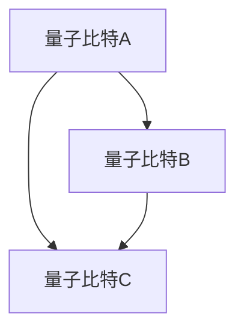
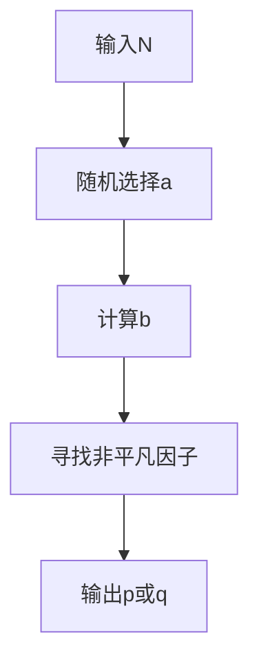

                 

# 量子计算：超越经典计算的新范式

## 关键词
- 量子计算
- 量子比特
- 量子叠加
- 量子纠缠
- 量子算法
- 错误纠正

## 摘要
本文将深入探讨量子计算这一前沿领域，从基本概念出发，逐步分析量子计算与传统计算机的差异、量子比特与经典比特的对比、量子纠缠的原理，以及量子算法如Shor算法的详细解读。文章旨在为读者提供一个系统、易懂的量子计算导论，帮助读者理解这一超越经典计算的新范式。

## 背景介绍

### 第1章：量子计算概述

### 1.1 问题背景

量子计算是计算机科学的前沿领域，它利用量子力学的原理进行信息处理。传统计算机基于二进制系统，使用0和1两种状态，而量子计算机则基于量子位（qubits），能够同时存在于多种状态，这使得量子计算机具有处理复杂问题的潜力。

### 1.2 问题描述

量子计算的主要问题是如何有效地利用量子叠加和量子纠缠等量子力学特性来构建计算模型，以及如何克服量子噪声和错误纠正等问题。

### 1.3 问题解决

量子计算通过量子比特（qubits）的叠加和纠缠来实现并行计算，这使得它能够在某些特定问题上远超传统计算机。然而，量子计算还面临着许多技术挑战，包括量子比特的稳定性、错误纠正和量子算法的开发。

### 1.4 边界与外延

量子计算不仅仅是计算速度的提升，它还涉及到全新的计算范式，包括量子模拟、量子加密和量子优化等应用。

### 1.5 概念结构与核心要素组成

量子计算的核心概念包括量子比特、量子叠加、量子纠缠、量子门和量子算法。这些概念共同构成了量子计算的理论框架。

### 1.6 本章小结

本章介绍了量子计算的基本概念和问题背景，为后续章节的深入讨论打下了基础。

### 1.7 量子比特与经典比特的对比

### 1.7.1 定义与特性

#### 量子比特（qubits）

- **定义**：量子比特是量子计算机中的基本单元，它不仅能够表示0或1，还可以同时表示0和1的叠加态。
- **特性**：量子比特具有叠加态和纠缠态的特性，这使其能够在计算中实现并行性。

#### 经典比特（classical bits）

- **定义**：经典比特是传统计算机中的基本单元，它只能表示0或1。
- **特性**：经典比特的状态是确定的，不具有叠加态和纠缠态的特性。

### 1.7.2 对比表格

| 特性        | 量子比特             | 经典比特             |
|-------------|----------------------|----------------------|
| 状态        | 多态叠加             | 确定状态（0或1）     |
| 存储信息    | 2^n个信息单元        | 仅1个信息单元        |
| 纠错机制    | 错误纠正较复杂       | 错误纠正较简单       |

### 1.8 量子纠缠

#### 1.8.1 定义与特性

量子纠缠是量子力学中的一个重要特性，它描述了两个或多个量子比特之间的强相关性。即使这些量子比特相距很远，一个量子比特的状态变化也会立即影响到其他量子比特的状态。

#### 1.8.2 ER实体关系图



### 1.9 量子算法简介

#### 1.9.1 量子算法概述

量子算法利用量子比特的叠加和纠缠来加速传统算法。著名的量子算法包括Shor算法和Grover算法。

#### 1.9.2 Shor算法

##### 1.9.2.1 算法原理

Shor算法是一种能够高效解决整数分解问题的量子算法。

$$
\text{Input: } N, \text{质数 } p \text{ 满足 } N = pq \\
\text{Output: } p, q \\
\text{1. } a \text{ 是 } [1, N] \text{ 内的随机数} \\
\text{2. } b \text{ 是 } a^{\frac{N}{2}} \text{ mod } N \text{ 的结果} \\
\text{3. } \text{找到 } b \text{ 的一个非平凡因子} \\
\text{4. } p \text{ 或 } q \text{ 是这个因子} \\
$$

##### 1.9.2.2 Mermaid流程图



##### 1.9.2.3 Python源代码

```python
import random
import numpy as np

def shor(N):
    a = random.randint(1, N-1)
    b = pow(a, N//2) % N
    
    # 这里简化处理，实际中需要更复杂的算法来寻找非平凡因子
    factor = np.gcd(b, N)
    if factor != 1 and factor != N:
        return factor
    else:
        return None

N = 2
result = shor(N)
print(result)
```

### 第2章：量子计算机的工作原理

### 2.1 量子比特

量子比特是量子计算机中的基本单元，与经典比特不同，量子比特能够同时存在于多种状态。这种特性使得量子比特能够实现并行计算，从而在处理某些复杂问题时具有巨大潜力。

### 2.2 量子叠加

量子叠加是量子计算的核心概念之一。它描述了量子比特可以同时存在于多种状态的特性。例如，一个量子比特可以同时处于0和1的状态，这种叠加态使得量子计算机能够同时处理多个问题。

### 2.3 量子纠缠

量子纠缠是量子计算中的另一个核心概念。它描述了两个或多个量子比特之间的强相关性。即使这些量子比特相距很远，一个量子比特的状态变化也会立即影响到其他量子比特的状态。

### 2.4 量子门

量子门是量子计算机中的基本操作，类似于经典计算机中的逻辑门。量子门可以对量子比特进行变换，实现特定的计算操作。

### 2.5 量子算法

量子算法是利用量子比特的叠加和纠缠来加速传统算法的方法。著名的量子算法包括Shor算法和Grover算法，这些算法在特定问题上具有显著的加速效果。

### 第3章：量子计算的优势与挑战

### 3.1 优势

量子计算具有许多优势，包括并行计算能力、解决特定问题的速度优势和量子模拟的能力。这些优势使得量子计算在许多领域具有广泛的应用前景。

### 3.2 挑战

尽管量子计算具有巨大的潜力，但它也面临着许多挑战，包括量子比特的稳定性、错误纠正和量子算法的开发。这些挑战需要持续的研究和技术的突破。

### 第4章：量子计算的应用

### 4.1 量子模拟

量子模拟是量子计算的一个重要应用领域。它利用量子计算机模拟量子系统，帮助科学家更好地理解量子现象。

### 4.2 量子加密

量子加密是一种利用量子力学原理进行信息加密的方法。它具有传统加密方法无法达到的安全水平。

### 4.3 量子优化

量子优化是利用量子计算机解决优化问题的方法。它在物流、金融、人工智能等领域具有广泛的应用前景。

### 第5章：未来展望

### 5.1 量子计算机的发展趋势

随着量子计算机技术的不断发展，我们预计将看到更多的量子计算机应用于实际问题，包括科学研究、工业制造、金融分析和人工智能等领域。

### 5.2 量子计算的挑战与解决方案

为了实现量子计算的实际应用，我们需要解决量子比特的稳定性、错误纠正和量子算法的开发等挑战。通过持续的研究和技术创新，我们有望克服这些挑战。

### 第6章：总结与展望

量子计算是计算机科学的前沿领域，它利用量子力学的原理进行信息处理，具有巨大的潜力。通过本文的探讨，我们了解了量子计算的基本概念、工作原理、优势与挑战以及应用前景。未来，随着量子计算机技术的发展，我们有望看到更多的创新和突破。

### 作者

作者：AI天才研究院/AI Genius Institute & 禅与计算机程序设计艺术 /Zen And The Art of Computer Programming

## 注意事项与拓展阅读

### 注意事项

1. 量子计算机的发展需要跨学科的合作，包括物理学、数学和计算机科学等领域的深入研究。
2. 量子计算的安全性需要得到充分的研究和验证，以确保量子加密系统的安全性。
3. 量子计算的实际应用需要解决量子比特的稳定性、错误纠正和量子算法的开发等挑战。

### 拓展阅读

1. Nielsen, Michael A., and Isaac L. Chuang. "Quantum Computation and Quantum Information." Cambridge University Press, 2000.
2. Kitaev, Alexei Yu., et al. "Quantum Computation: A Quantum Error Correction Approach." arXiv preprint quant-ph/0401062, 2004.
3. Shor, Peter. "Algorithms for Quantum Computation: Discrete Log and Factoring." In Proceedings of the 35th Annual ACM Symposium on Theory of Computing (STOC), 2003.

