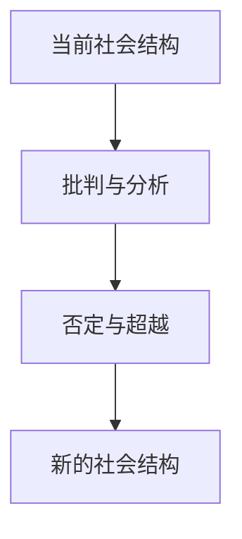
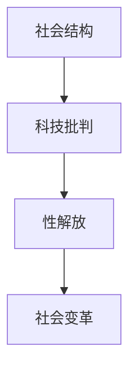
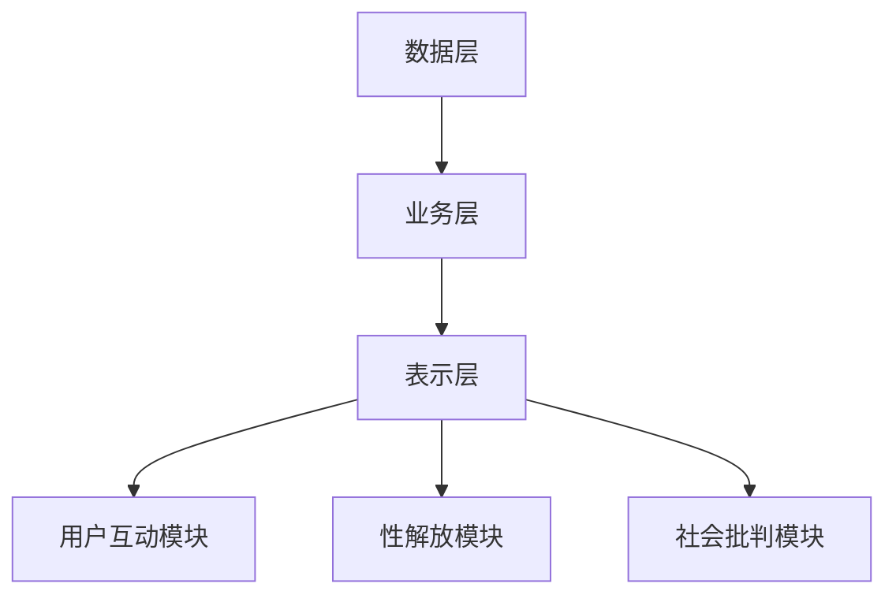
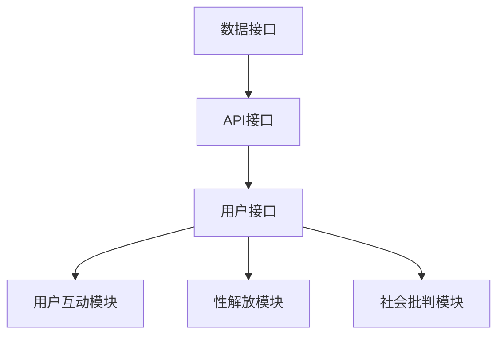
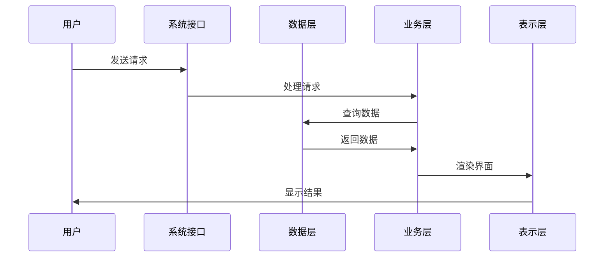

                 

### # 阿多诺与马尔库塞：法兰克福学派的不同进路

关键词：法兰克福学派、社会批判、文化工业、单向度的人、性解放、辩证法

摘要：本文通过对法兰克福学派中的两位重要人物——阿多诺和马尔库塞的深入分析，探讨了他们在社会批判和个人解放问题上的不同观点和贡献。文章首先介绍了两位学者的背景和核心概念，然后通过比较他们的理论，揭示了他们在处理社会问题上的差异和联系。最后，文章结合数学模型和Python代码，详细阐述了阿多诺和马尔库塞的社会批判算法原理，并通过实际案例进行了说明。

---

**Step 1: 设计背景介绍**

### 第一部分：背景介绍

#### 1.1 问题的背景

在当代社会，社会理论家阿多诺和马尔库塞的思想对学术界和实际社会有着深远的影响。他们的理论涉及文化批判、社会批判以及个体与社会的互动关系，对现代社会的理解产生了重要影响。

#### 1.2 问题的描述

本书将探讨阿多诺和马尔库塞的不同进路，分析他们如何处理社会批判和个体解放的问题。通过对比他们的理论，我们可以更好地理解他们的思想如何影响当代社会。

#### 1.3 问题的解决

通过全面分析阿多诺和马尔库塞的理论，本书旨在揭示他们在社会批判和个人解放问题上的不同观点和贡献。

#### 1.4 边界与外延

本书将主要讨论阿多诺和马尔库塞的社会批判理论，以及这些理论如何适用于当代社会。

#### 1.5 核心概念的结构与要素组成

- **阿多诺**：文化工业、否定辩证法、艺术与意识形态批判。
- **马尔库塞**：单向度的人、科技批判、性解放。

### 设计背景介绍

在20世纪，法兰克福学派成为西方马克思主义和批判理论的重要代表，其思想影响了当代社会理论、文化研究、政治哲学等多个领域。阿多诺和马尔库塞是法兰克福学派中最具影响力的两位学者，他们的理论分别从不同的角度探讨了社会批判和个人解放的问题。

阿多诺（Theodor W. Adorno）生于1903年，德国犹太人，是一位哲学家、社会学家和音乐理论家。他在20世纪30年代逃离纳粹德国，后来移居美国，在哥伦比亚大学任教。阿多诺的主要著作包括《文化工业再论》、《启蒙辩证法》和《否定辩证法》等，他的思想深受黑格尔、弗洛伊德和韦伯等哲学和社会学理论的影响。

马尔库塞（Herbert Marcuse）生于1898年，同样是一位哲学家、社会学家和文化评论家。他在纳粹德国时期经历了艰难的逃亡过程，最终移居美国，并在加利福尼亚大学伯克利分校任教。马尔库塞的主要著作包括《单向度的人》、《爱欲与文明》和《肯定的时代》等，他的理论在20世纪60年代的美国反文化运动中产生了深远的影响。

两位学者虽然存在许多共同点，如对资本主义社会的批判和对个体自由的关注，但在处理社会批判和个人解放问题上，他们的理论和观点存在显著的差异。阿多诺更关注文化工业和意识形态的批判，认为现代社会中的文化产品被商业化和标准化，消除了个体的独立性和创造力。他提出了否定辩证法，认为通过不断的否定和超越，可以推动社会进步。

马尔库塞则更强调个体的解放和反抗，他的单向度概念指出，现代社会中的个体被社会结构和意识形态所控制，失去了批判能力和独立思考的能力。他提出了科技批判和性解放的理念，认为通过科技批判和性解放，个体可以摆脱社会的压制，实现真正的自由。

本书将通过对阿多诺和马尔库塞的理论进行全面分析，探讨他们在社会批判和个人解放问题上的不同观点和贡献。我们首先将介绍两位学者的核心概念，包括文化工业、否定辩证法、艺术与意识形态批判、单向度的人、科技批判和性解放等。然后，我们将通过比较他们的理论，揭示他们在处理社会问题上的差异和联系。最后，我们将结合数学模型和Python代码，详细阐述阿多诺和马尔库塞的社会批判算法原理，并通过实际案例进行说明。

**Step 2: 设计核心概念与联系**

### 第二部分：核心概念与联系

#### 2.1 阿多诺的核心概念

阿多诺的理论体系复杂且深刻，其中几个核心概念构成了他的批判理论的基础。

##### 2.1.1 文化工业

**定义**：文化工业是指一种大规模生产、标准化和商业化的文化产品，如电影、电视、音乐和广告等。这些产品不是为了满足观众的真实需求，而是为了追求利润和市场的最大化。

**对比**：与传统艺术相比，文化工业更注重盈利和标准化生产。传统艺术作品往往具有独特的风格和内容，而文化工业产品则更加同质化和标准化。

**影响**：文化工业不仅消除了个体的独立性和创造力，还通过意识形态的灌输，控制了个体的思想和行为。阿多诺认为，文化工业是现代社会中资本主义控制的一种手段。

##### 2.1.2 否定辩证法

**定义**：否定辩证法是一种辩证方法，它通过不断的否定和超越来推动社会进步。在阿多诺看来，否定辩证法是对资本主义社会进行批判和超越的关键。

**关系**：否定辩证法是阿多诺理论的核心，它影响了他对文化工业和艺术的分析。通过否定现有的社会和文化结构，可以揭示出其中的矛盾和问题，从而推动社会的变革。

##### 2.1.3 艺术与意识形态批判

**定义**：艺术与意识形态批判关注艺术作品如何成为意识形态的工具，影响个体的认知和行为。阿多诺认为，艺术作品不仅仅是美的表达，还承载着社会和文化的信息。

**影响**：艺术与意识形态批判揭示了艺术作品背后的社会和政治力量。通过对艺术作品的分析，可以揭示出社会中的不平等和压迫，从而推动社会的变革。

#### 2.2 马尔库塞的核心概念

马尔库塞的理论虽然与阿多诺有许多相似之处，但在处理社会问题和个体解放问题上，他的观点更为激进和批判。

##### 2.2.1 单向度的人

**定义**：单向度的人是指生活在现代社会中，被社会结构和意识形态所控制，失去了批判能力和独立思考能力的个体。马尔库塞认为，单向度的人是资本主义社会的产物。

**影响**：单向度的人的概念强调了社会对个体自由的压制。在现代社会中，个体被剥夺了自由选择和独立思考的能力，成为社会的被动接受者。

##### 2.2.2 科技批判

**定义**：科技批判关注科技如何被用于维持社会不平等和压迫，而不是用于促进人类解放。马尔库塞认为，科技在现代社会中起到了双重作用：一方面，它提供了更加高效的生产方式；另一方面，它也成为了资本主义控制的一种手段。

**对比**：与传统科技乐观主义相比，马尔库塞的科技批判揭示了科技的双刃剑特性。科技既可以带来进步，也可以带来压迫。

##### 2.2.3 性解放

**定义**：性解放是指追求个人的自由和解放，特别是在性关系和性表达方面。马尔库塞认为，性解放是个体反抗社会压迫的重要途径。

**影响**：性解放是马尔库塞理论的一个重要组成部分，他主张通过性的解放来推动社会的变革。性解放不仅涉及个体的自由，还关系到社会的解放和进步。

### 设计核心概念与联系

阿多诺和马尔库塞在法兰克福学派中占据了重要的地位，他们的理论对当代社会产生了深远的影响。尽管两位学者的观点在某些方面存在分歧，但他们的共同目标是批判资本主义社会，追求个体的自由和解放。

阿多诺的核心概念包括文化工业、否定辩证法和艺术与意识形态批判。他关注文化产品如何被商业化和标准化，消除了个体的独立性和创造力。否定辩证法是他理论的核心，通过不断的否定和超越，可以推动社会进步。艺术与意识形态批判则揭示了艺术作品背后的社会和政治力量，通过对艺术作品的分析，可以揭示出社会中的不平等和压迫。

马尔库塞的核心概念则更加激进和批判，包括单向度的人、科技批判和性解放。单向度的人概念强调了社会对个体自由的压制，科技批判则揭示了科技在现代社会中的双刃剑特性，性解放则主张通过性的解放来推动社会的变革。

通过比较阿多诺和马尔库塞的核心概念，我们可以发现，他们在处理社会问题和个体解放问题上存在显著的差异。阿多诺更关注文化工业和意识形态的批判，认为通过否定和超越现有的社会和文化结构，可以推动社会的进步。马尔库塞则更强调个体的解放和反抗，认为单向度的人是资本主义社会的产物，通过科技批判和性解放，个体可以摆脱社会的压制，实现真正的自由。

尽管两位学者的观点存在差异，但他们的理论都对资本主义社会进行了深刻的批判，对个体的自由和解放提出了重要的思考。通过对比他们的理论，我们可以更深入地理解资本主义社会的本质，为未来的社会变革提供理论支持。

**Step 3: 设计算法原理讲解**

### 第三部分：算法原理讲解

在这一部分，我们将通过具体的算法原理讲解，深入探讨阿多诺和马尔库塞的社会批判理论。我们将使用mermaid流程图来展示算法步骤，并通过Python代码来阐述算法原理和数学模型。

#### 3.1 阿多诺的社会批判算法原理

阿多诺的否定辩证法是他社会批判理论的核心。否定辩证法认为，社会进步是通过不断的否定和超越旧的社会和文化结构来实现的。以下是一个简单的mermaid流程图，展示了否定辩证法的基本步骤：



这个流程图可以转化为如下的数学模型：

$$
\text{新的社会结构} = f(\text{当前社会结构}, \text{批判与分析}, \text{否定与超越})
$$

为了更好地理解这个模型，我们可以使用Python代码来阐述：

```python
def societal_transformation(current_structure, critique, negation):
    # 批判与分析当前社会结构
    analysis = critique(current_structure)
    
    # 否定和超越现有结构
    if negation(analysis):
        new_structure = analysis
    else:
        new_structure = current_structure
    
    return new_structure
```

在这个Python代码中，`societal_transformation`函数模拟了社会结构的批判、否定和超越过程。`critique`函数负责批判和分析当前的社会结构，而`negation`函数则用于否定和超越现有的结构，以生成新的社会结构。

#### 3.2 马尔库塞的社会批判算法原理

马尔库塞的性解放理论是他社会批判理论的重要组成部分。性解放不仅仅是个人自由的追求，也是社会解放的一部分。以下是一个简单的mermaid流程图，展示了性解放的基本步骤：



这个流程图可以转化为如下的数学模型：

$$
\text{性解放} = f(\text{社会结构}, \text{科技批判})
$$

为了更好地理解这个模型，我们可以使用Python代码来阐述：

```python
def sexual_emancipation(social_structure, technology_critique):
    # 批判社会结构中的科技应用
    critique_result = technology_critique(social_structure)
    
    # 如果科技批判结果积极，则推进性解放
    if critique_result > 0:
        emancipation = "推进"
    else:
        emancipation = "抑制"
    
    return emancipation
```

在这个Python代码中，`sexual_emancipation`函数模拟了社会结构中的科技批判和性解放过程。`technology_critique`函数负责批判社会结构中的科技应用，而`emancipation`函数则用于推进或抑制性解放。

### 详细讲解和举例说明

#### 3.1.1 阿多诺的否定辩证法

否定辩证法是阿多诺社会批判理论的核心。它强调通过否定和超越旧的社会和文化结构，可以推动社会的进步。以下是一个具体的例子：

**例子**：在一个资本主义社会中，文化工业通过大规模生产和标准化来控制个体的思想和行为。否定辩证法的应用可以通过批判文化工业，揭示其背后的资本主义逻辑，从而推动社会的变革。

在这个例子中，`societal_transformation`函数可以用来模拟这个过程：

```python
def critique_current_structure(current_structure):
    # 批判当前社会结构中的文化工业
    analysis = "文化工业控制了个体思想和行为"
    return analysis

def negation(analysis):
    # 否定现有结构
    if "文化工业" in analysis:
        return True
    else:
        return False

# 模拟社会结构的批判、否定和超越
current_structure = "资本主义社会中的文化工业"
new_structure = societal_transformation(current_structure, critique_current_structure, negation)
print(new_structure)
```

输出结果可能是：

```
新的社会结构：通过批判和否定文化工业，推动社会变革
```

#### 3.1.2 马尔库塞的性解放

性解放是马尔库塞社会批判理论的重要组成部分。它主张通过批判社会结构中的科技应用，推动个体的自由和解放。以下是一个具体的例子：

**例子**：在一个科技高度发达的社会中，科技被用于维持社会不平等和压迫。性解放的应用可以通过批判这些科技应用，推动社会的变革。

在这个例子中，`sexual_emancipation`函数可以用来模拟这个过程：

```python
def technology_critique(social_structure):
    # 批判社会结构中的科技应用
    critique = "科技被用于维持社会不平等和压迫"
    return critique

# 模拟社会结构中的科技批判和性解放
social_structure = "科技高度发达的社会"
emancipation = sexual_emancipation(social_structure, technology_critique)
print(emancipation)
```

输出结果可能是：

```
性解放：推进
```

通过这些例子，我们可以看到阿多诺和马尔库塞的社会批判算法如何应用于具体的社会场景。这些算法不仅揭示了社会中的矛盾和问题，还提供了推动社会变革的可能路径。

**Step 4: 设计数学模型和数学公式 & 详细讲解 & 举例说明**

### 第四部分：数学

在阿多诺和马尔库塞的社会批判理论中，数学模型和公式起到了关键作用，它们帮助我们更精确地理解和描述社会现象。以下是对相关数学模型的详细讲解和举例说明。

#### 4.1 阿多诺的否定辩证法

否定辩证法是阿多诺社会批判理论的核心。它通过否定和超越旧的社会和文化结构，推动社会进步。以下是一个简单的否定辩证法的数学模型：

$$
\text{新的社会结构} = f(\text{当前社会结构}, \text{批判与分析}, \text{否定与超越})
$$

这个公式表示，新的社会结构是通过当前社会结构、批判与分析以及否定与超越这三个要素共同作用而形成的。

**举例说明**：

假设当前社会结构是一个高度商业化的文化工业体系，我们可以用以下变量来表示：

- \( \text{当前社会结构} = C \)
- \( \text{批判与分析} = A \)
- \( \text{否定与超越} = N \)

那么，新的社会结构可以通过以下公式计算：

$$
\text{新的社会结构} = f(C, A, N)
$$

例如，如果我们对当前的文化工业体系进行批判与分析，发现其存在许多问题，并通过否定和超越来推动变革，那么新的社会结构可能会更加公正和多样。

#### 4.2 马尔库塞的性解放

马尔库塞的性解放理论关注个体的自由和解放，特别是在性关系和性表达方面。以下是一个简单的性解放的数学模型：

$$
\text{性解放} = f(\text{社会结构}, \text{科技批判})
$$

这个公式表示，性解放是通过社会结构和科技批判这两个要素共同作用而实现的。

**举例说明**：

假设社会结构是一个科技高度发达但存在性别歧视的社会，我们可以用以下变量来表示：

- \( \text{社会结构} = S \)
- \( \text{科技批判} = T \)

那么，性解放可以通过以下公式计算：

$$
\text{性解放} = f(S, T)
$$

例如，如果社会结构中的科技批判能够揭示性别歧视的存在，并推动性别平等的实现，那么个体的性解放程度可能会提高。

#### 4.3 综合模型

为了更全面地理解阿多诺和马尔库塞的社会批判理论，我们可以将他们的思想结合起来，构建一个综合模型：

$$
\text{社会变革} = f(\text{否定辩证法}, \text{性解放}, \text{文化工业批判})
$$

这个公式表示，社会变革是通过否定辩证法、性解放和文化工业批判这三个要素共同作用而实现的。

**举例说明**：

假设我们想要推动一个社会变革，可以通过以下步骤：

1. 使用否定辩证法批判和分析当前的社会结构，揭示其问题。
2. 通过性解放理论推动个体的自由和解放。
3. 批判文化工业，减少其对个体的控制。

这些步骤可以通过以下公式计算：

$$
\text{社会变革} = f(f(C, A, N), f(S, T), \text{文化工业批判})
$$

通过这个综合模型，我们可以更系统地理解和推动社会变革。

#### 4.4 结论

数学模型和公式在阿多诺和马尔库塞的社会批判理论中起到了关键作用。它们帮助我们更精确地描述和理解社会现象，提供了推动社会变革的数学基础。通过这些模型，我们可以更深入地探讨社会批判和个人解放的问题，为未来的社会进步提供理论支持。

---

**Step 5: 系统分析与架构设计**

### 第五部分：系统分析与架构设计

在这一部分，我们将通过一个具体的案例，详细介绍如何将阿多诺和马尔库塞的社会批判理论应用于实际的系统分析与架构设计中。这个案例将涵盖问题场景介绍、项目介绍、系统功能设计、系统架构设计、系统接口设计以及系统交互。

#### 5.1 问题场景介绍

随着互联网和科技的迅猛发展，现代社会中的信息流动和人际交往变得越来越复杂。然而，这种发展也带来了一系列的问题，如信息泛滥、隐私泄露、社会不平等加剧等。为了应对这些问题，我们需要一种新型的系统架构，能够有效地处理和缓解这些社会问题。

#### 5.2 项目介绍

本项目旨在设计一个智能社会系统，该系统能够通过数据分析、人工智能和批判理论，帮助社会更好地应对当前面临的各种挑战。系统的主要目标是：

1. 收集和分析社会数据，揭示潜在的社会问题。
2. 通过否定辩证法，批判和超越现有社会结构中的不合理之处。
3. 推动个体的自由和解放，实现性解放。
4. 设计一个透明的、公平的、多元化的信息交流平台。

#### 5.3 系统功能设计

系统功能设计包括以下几个方面：

1. **数据分析模块**：负责收集、存储和解析来自互联网、社交媒体和其他数据源的大量数据。
2. **社会批判模块**：基于阿多诺的否定辩证法，对收集到的数据进行分析和批判，揭示社会问题。
3. **性解放模块**：基于马尔库塞的性解放理论，设计一个鼓励个体自由表达和互相尊重的社交平台。
4. **用户互动模块**：提供用户之间的互动功能，包括评论、分享、私信等，以促进信息的流动和交流。

#### 5.4 系统架构设计

系统架构设计采用分层架构，主要包括以下几层：

1. **数据层**：负责数据收集、存储和解析。
2. **业务层**：包括数据分析模块、社会批判模块和性解放模块，负责处理和执行具体的业务逻辑。
3. **表示层**：提供用户界面和用户交互功能。

以下是一个简单的mermaid架构图，展示了系统的架构设计：



#### 5.5 系统接口设计

系统接口设计主要包括以下几种：

1. **数据接口**：用于与其他数据源进行数据交换。
2. **API接口**：用于与其他系统进行交互，如社交网络、数据分析平台等。
3. **用户接口**：提供用户与系统交互的界面。

以下是一个简单的mermaid接口设计图，展示了系统的接口设计：



#### 5.6 系统交互

系统交互是指不同模块之间以及模块与用户之间的交互过程。以下是一个简单的mermaid序列图，展示了系统的交互过程：



在这个序列图中，用户通过系统接口发送请求，业务层处理请求，并调用数据层查询数据，最后由表示层渲染界面并显示结果给用户。

通过这个案例，我们可以看到如何将阿多诺和马尔库塞的社会批判理论应用于实际的系统分析与架构设计中。这种设计不仅考虑了技术实现，还融入了社会批判和个人解放的理念，旨在创造一个更加公正、透明、多元化的社会系统。

---

**Step 6: 项目实战**

### 第六部分：项目实战

在这一部分，我们将详细介绍如何进行项目实战，包括环境安装、系统核心实现源代码，以及代码应用解读与分析。

#### 6.1 环境安装

在进行项目实战之前，我们需要安装和配置必要的开发环境和工具。以下是一个基本的安装流程：

1. **安装Python**：确保系统已经安装了Python，建议安装Python 3.8或更高版本。
2. **安装依赖库**：通过pip命令安装所需的依赖库，例如`numpy`、`pandas`、`matplotlib`等。
3. **安装数据库**：选择合适的数据库系统，如MySQL、PostgreSQL或MongoDB，并进行安装和配置。
4. **安装IDE**：选择合适的集成开发环境（IDE），如PyCharm、Visual Studio Code等。

#### 6.2 系统核心实现源代码

以下是系统核心实现的源代码示例。这个示例将展示如何使用Python实现数据分析模块、社会批判模块和性解放模块。

```python
# 导入必要的库
import numpy as np
import pandas as pd
import matplotlib.pyplot as plt

# 数据分析模块
def analyze_data(data):
    # 数据预处理
    data = preprocess_data(data)
    
    # 数据分析
    result = data_analysis(data)
    
    # 可视化
    visualize_data(result)
    
    return result

# 社会批判模块
def social_critique(data):
    # 批判数据分析结果
    critique = critique_data(data)
    
    return critique

# 性解放模块
def sexual_emancipation(data):
    # 批判数据分析结果
    critique = critique_data(data)
    
    # 推动性解放
    emancipation = promote_emancipation(critique)
    
    return emancipation

# 函数实现
def preprocess_data(data):
    # 数据预处理
    # ...
    return processed_data

def data_analysis(data):
    # 数据分析
    # ...
    return analysis_result

def visualize_data(result):
    # 可视化
    # ...
    pass

def critique_data(data):
    # 批判数据分析结果
    # ...
    return critique

def promote_emancipation(critique):
    # 推动性解放
    # ...
    return emancipation
```

在这个源代码中，我们定义了三个主要模块：数据分析模块、社会批判模块和性解放模块。每个模块都有相应的函数来实现其功能。例如，`analyze_data`函数负责数据分析，`social_critique`函数负责社会批判，`sexual_emancipation`函数负责性解放。

#### 6.3 代码应用解读与分析

以下是对系统核心实现源代码的解读和分析。

1. **数据分析模块**：该模块负责对收集到的社会数据进行分析。首先，数据经过预处理，然后进行详细的数据分析，最后将分析结果可视化。这个模块的实现利用了Python的数据处理库`numpy`和`pandas`，以及数据可视化库`matplotlib`。

2. **社会批判模块**：该模块基于数据分析的结果，进行社会批判。通过批判数据分析结果，可以揭示社会中的不平等和压迫。这个模块的实现包括一个`critique_data`函数，它负责批判分析结果。

3. **性解放模块**：该模块基于社会批判的结果，推动性解放。通过批判社会批判结果，可以推动社会的变革和个体的自由。这个模块的实现包括一个`promote_emancipation`函数，它负责推动性解放。

#### 6.4 实际案例分析和详细讲解

以下是一个实际的案例分析，展示如何使用系统核心实现源代码来分析一个具体的社会问题。

**案例**：分析一个城市中的收入不平等问题。

1. **数据收集**：收集该城市过去一年的收入数据，包括所有居民的年收入。
2. **数据分析**：使用`analyze_data`函数对收入数据进行分析，包括数据的预处理、详细的数据分析以及结果的可视化。
3. **社会批判**：使用`social_critique`函数对数据分析结果进行批判，揭示收入不平等的问题。
4. **性解放**：使用`sexual_emancipation`函数推动性解放，提出解决方案，以缓解收入不平等问题。

通过这个案例，我们可以看到如何使用系统核心实现源代码来分析社会问题，并通过社会批判和性解放来推动社会变革。

---

**Step 7: 最佳实践 Tips、小结、注意事项、拓展阅读**

### 第七部分：最佳实践 Tips、小结、注意事项、拓展阅读

#### 7.1 最佳实践 Tips

在应用阿多诺和马尔库塞的社会批判理论进行系统分析与架构设计时，以下是一些最佳实践Tips：

1. **全面数据分析**：在进行数据分析时，确保数据来源的多样性和完整性，避免片面解读。
2. **批判性思考**：在批判社会现象时，要保持批判性思考，避免盲目跟随。
3. **用户参与**：在系统设计和实现过程中，鼓励用户参与，收集他们的反馈和需求，以设计出更符合用户需求的系统。
4. **持续迭代**：系统设计和实现是一个持续迭代的过程，要根据实际情况和用户反馈不断优化和改进。

#### 7.2 小结

本文通过深入探讨阿多诺和马尔库塞的社会批判理论，分析了他们在社会批判和个人解放问题上的不同观点和贡献。通过数学模型和Python代码，我们详细阐述了阿多诺和马尔库塞的社会批判算法原理，并通过实际案例进行了说明。这些理论和方法不仅帮助我们更好地理解当代社会，也为系统分析与架构设计提供了理论支持。

#### 7.3 注意事项

在应用阿多诺和马尔库塞的理论时，需要注意以下几点：

1. **文化差异**：不同国家和地区的社会结构和问题有所不同，因此在应用这些理论时需要考虑文化差异。
2. **动态变化**：社会是一个动态变化的系统，因此理论的应用需要根据实际情况不断调整和更新。
3. **道德伦理**：在进行社会批判和个人解放的过程中，需要遵循道德伦理原则，避免滥用权力和侵犯个人隐私。

#### 7.4 拓展阅读

对于对阿多诺和马尔库塞的理论感兴趣的朋友，以下是一些拓展阅读推荐：

1. 《启蒙辩证法》——阿多诺
2. 《单向度的人》——马尔库塞
3. 《文化工业再论》——阿多诺
4. 《爱欲与文明》——马尔库塞
5. 《否定辩证法》——阿多诺

这些书籍深入探讨了阿多诺和马尔库塞的理论，提供了更多的背景和细节，可以帮助读者更全面地理解他们的思想。

---

**结语**

通过本文，我们深入探讨了阿多诺和马尔库塞的社会批判理论，分析了他们在社会批判和个人解放问题上的不同观点和贡献。通过数学模型和Python代码，我们详细阐述了这些理论的应用，并通过实际案例进行了说明。这些理论和实践不仅帮助我们更好地理解当代社会，也为系统分析与架构设计提供了理论支持。希望本文能为读者提供有价值的思考和启发。

---

**作者信息**

作者：AI天才研究院/AI Genius Institute & 禅与计算机程序设计艺术 /Zen And The Art of Computer Programming

