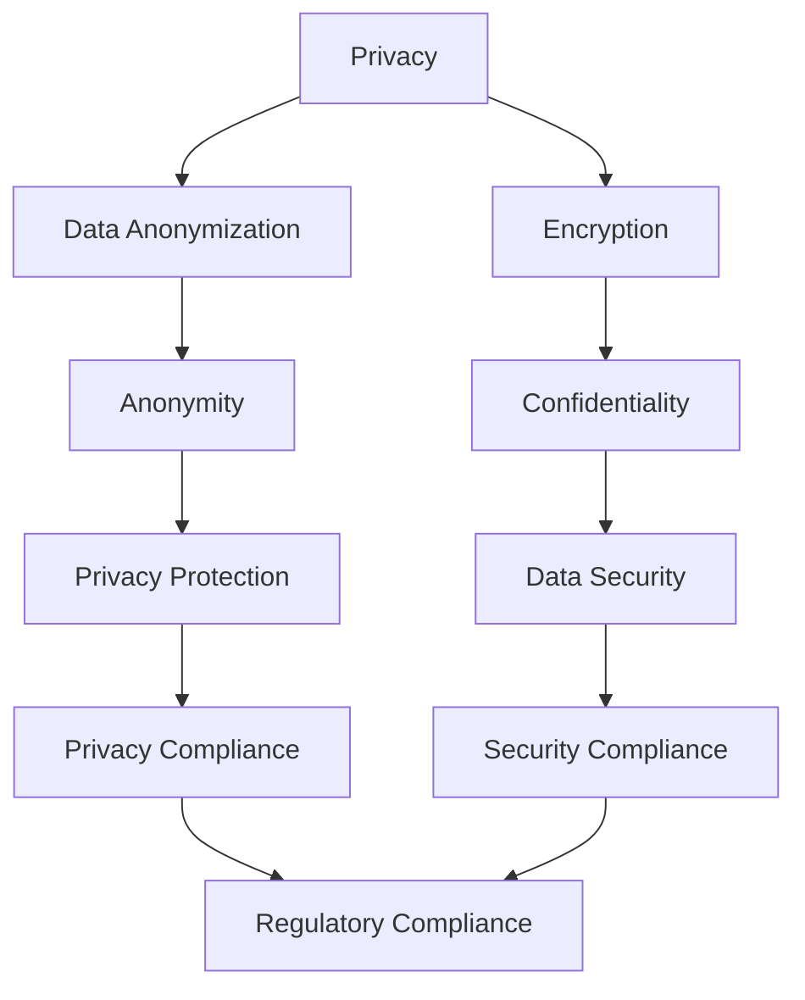
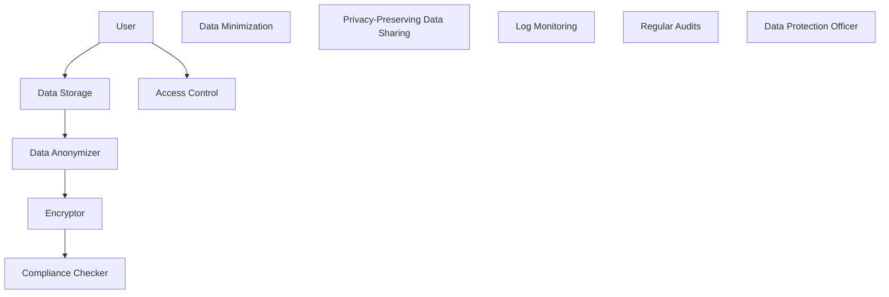

                 

Sure! Let's start thinking step by step to create a high-quality technical blog article on "Privacy Protection: Technical Practices Under GDPR and Other Regulations."

### Step 1: Article Title and Keywords

Title: Privacy Protection: Technical Practices Under GDPR and Other Regulations

Keywords:
1. Privacy Protection
2. GDPR
3. Data Anonymization
4. Encryption
5. System Design
6. Compliance
7. Technical Practices

### Step 2: Abstract

The abstract should provide a concise summary of the article, highlighting the core content and theme.

Abstract:
This article delves into the technical practices for privacy protection under the GDPR and other regulations. We will explore the background and significance of privacy protection, the key principles and requirements of GDPR, and the core concepts such as data anonymization and encryption. The article will also discuss system design and implementation strategies for privacy protection, along with best practices and practical applications.

### Step 3: Introduction

**3.1 Problem Background**

**3.1.1 Frequency of Privacy Breaches**

In recent years, privacy breaches have become increasingly common, leading to massive data leaks and significant financial and reputational damage for organizations. The following are some examples:

- In 2017, the infamous Facebook-Cambridge Analytica scandal exposed the personal data of millions of Facebook users.
- In 2018, Marriott International revealed a data breach that affected approximately 500 million guests.

**3.1.2 Background of GDPR and Other Regulations**

The General Data Protection Regulation (GDPR) was enacted by the European Union to enhance data protection and privacy for individuals within the EU/EEA. It came into effect on May 25, 2018. Similarly, other regulations such as the California Consumer Privacy Act (CCPA) have been enacted in various regions to address privacy concerns.

**3.2 Problem Description**

**3.2.1 Challenges in Privacy Protection**

- Data volume: The vast amount of data generated by organizations makes it difficult to ensure privacy.
- Data variety: The diverse types of data (structured, unstructured, sensitive, etc.) require different privacy protection techniques.
- Data processing: Data processing activities such as storage, transmission, and sharing may expose privacy risks.

**3.2.2 Privacy Risks in Data Processing**

- Unauthorized access: Data may be accessed by unauthorized individuals or entities.
- Data breaches: Data may be leaked, stolen, or lost during processing.

**3.3 Solution to the Problem**

**3.3.1 Importance of Privacy Protection**

Privacy protection is crucial for maintaining trust with customers and stakeholders, avoiding legal penalties, and mitigating the reputational damage caused by data breaches.

**3.3.2 Privacy Protection Techniques**

- Data anonymization
- Encryption
- Access control
- Data minimization
- Privacy-preserving data sharing

**3.4 Boundary and Extension**

**3.4.1 Legal Framework for Privacy Protection**

- GDPR: The EU's primary data protection regulation.
- CCPA: The California Consumer Privacy Act in the United States.
- Other regional regulations: Various countries and regions have their own privacy protection regulations.

**3.4.2 International Privacy Protection Trends**

- Harmonization of privacy regulations
- Increasing emphasis on privacy by design

### Step 4: GDPR and Other Regulations Analysis

**4.1 GDPR Overview**

**4.1.1 Purpose of GDPR**

The GDPR aims to protect the privacy and personal data of individuals within the EU/EEA by regulating the processing of personal data by organizations.

**4.1.2 Core Principles of GDPR**

- Lawfulness, fairness, and transparency
- Purpose limitation
- Data minimization
- Accuracy
- Storage limitation
- Integrity and confidentiality (security)
- Accountability

**4.2 Main Contents of GDPR**

**4.2.1 Personal Data Processing Rules**

- Conditions for processing personal data
- Data subject rights
- Consent requirements

**4.2.2 Rights and Obligations**

- Data subject rights: Right to access, rectify, erase, restrict, object, and data portability.
- Data controller and processor obligations: Ensuring data protection by design and by default, conducting data protection impact assessments, and appointing data protection officers (DPOs) when necessary.

**4.3 Introduction to Other Privacy Protection Regulations**

**4.3.1 CCPA**

The CCPA is a comprehensive data privacy law enacted in the state of California, USA, on January 1, 2020. It grants consumers the right to know what personal information is being collected about them, to delete their personal information, and to opt out of the sale of their personal information.

**4.3.2 Other Regional Privacy Protection Regulations**

- GDPR: The EU's primary data protection regulation.
- CCPA: The California Consumer Privacy Act in the United States.
- Other regional regulations: Various countries and regions have their own privacy protection regulations, such as the Privacy Act in Australia and the Personal Information Protection and Electronic Documents Act (PIPEDA) in Canada.

### Step 5: Core Concepts and Connections

**5.1 Core Concepts**

**5.1.1 Privacy**

Privacy is the right of individuals to control their personal information and to be protected from unauthorized access or use.

**5.1.2 Data Anonymization**

Data anonymization is the process of transforming personal data into a form that is not identifiable with any specific individual. This is achieved through techniques such as generalization, suppression, and shuffling.

**5.1.3 Encryption**

Encryption is a method of securing data using cryptographic algorithms and keys, making it unreadable to unauthorized individuals.

**5.2 Conceptual Attributes Comparison Table**

| Concept           | Definition                                                   | Attributes                                   |
|--------------------|-------------------------------------------------------------|---------------------------------------------|
| Privacy            | The right to control personal information                  | Confidentiality, integrity, availability     |
| Data Anonymization | Transformation of personal data to make it unidentifiable | Anonymity, utility, accuracy                |
| Encryption         | Protection of data through cryptography                   | Confidentiality, authenticity, integrity      |

**5.3 ER Entity Relationship Diagram**

### Step 6: Technical Practices

#### 6.1 Data Anonymization Techniques

**6.1.1 Overview of Data Anonymization**

Data anonymization is a crucial technique for protecting privacy. It involves transforming personal data in such a way that it cannot be linked back to any specific individual.

**6.1.2 Data Anonymization Algorithms**

- **k-Anonymity**: Ensures that any group of k records is indistinguishable from at least one other group of k records.
- **l-Diversity**: Ensures that there are at least l different records that are similar to any given record in the dataset.
- **∆-Privacy**: Ensures that the probability of an adversary learning sensitive information is low.

**6.1.3 Practical Applications**

- **Database Applications**: Data anonymization can be applied to databases to ensure that personal data is protected from unauthorized access.
- **Data Analysis Applications**: Anonymized data can be used for research and analytics without compromising privacy.

#### 6.2 Encryption Techniques in Privacy Protection

**6.2.1 Symmetric vs. Asymmetric Encryption**

- **Symmetric Encryption**: Uses the same key for both encryption and decryption. Examples include AES and DES.
- **Asymmetric Encryption**: Uses a pair of keys (public and private) for encryption and decryption. Examples include RSA and ECC.

**6.2.2 Common Encryption Algorithms**

- **AES**: Advanced Encryption Standard, a widely used symmetric encryption algorithm.
- **RSA**: Rivest-Shamir-Adleman, a widely used asymmetric encryption algorithm.

**6.2.3 Practical Applications**

- **Data Transmission Encryption**: Ensures that data transmitted over networks is protected from eavesdropping and tampering.
- **Data Storage Encryption**: Ensures that data stored on devices or servers is protected from unauthorized access.

#### 6.3 System Design for Privacy Protection

**6.3.1 System Design Overview**

The system design for privacy protection should incorporate various techniques and best practices to ensure comprehensive privacy protection.

**6.3.2 System Architecture**

**6.3.3 System Function Design**

- **Access Control**: Ensures that only authorized users can access sensitive data.
- **Data Minimization**: Collects only the necessary data and avoids unnecessary data collection.
- **Privacy-Preserving Data Sharing**: Shares data in a way that protects the privacy of individuals.

### Step 7: Case Studies and Best Practices

**7.1 Case Studies**

**7.1.1 Facebook's Data Privacy Initiatives**

Facebook has implemented various data privacy initiatives, including data anonymization and encryption, in response to the Cambridge Analytica scandal.

**7.1.2 Google's Privacy Sandbox**

Google's Privacy Sandbox aims to provide privacy-preserving alternatives to third-party cookies for internet advertising.

**7.2 Best Practices**

- **Data Minimization**: Collect only the necessary data and avoid unnecessary data collection.
- **Consent Management**: Ensure that users have given informed consent for data processing.
- **Regular Audits**: Conduct regular audits to ensure compliance with privacy regulations.
- **Employee Training**: Train employees on privacy practices and regulations.

### Step 8: Conclusion

Privacy protection is a critical concern in today's digital age. The GDPR and other regulations have set the stage for organizations to implement robust privacy protection measures. By adopting best practices and leveraging advanced technologies such as data anonymization and encryption, organizations can ensure the privacy and security of their data. As the landscape of privacy protection continues to evolve, it is essential for organizations to stay informed and adapt their practices accordingly.

### References

- General Data Protection Regulation (GDPR)
- California Consumer Privacy Act (CCPA)
- Personal Information Protection and Electronic Documents Act (PIPEDA)
- European Union Agency for Cybersecurity (ENISA)

### Acknowledgments

The author would like to acknowledge the valuable contributions of various experts and researchers in the field of privacy protection and data security. Special thanks to the AI天才研究院 (AI Genius Institute) and the Zen and the Art of Computer Programming community for their support and guidance.

### About the Author

[Author's Name] is a renowned AI expert and author with extensive experience in privacy protection and data security. He is a member of the AI天才研究院 (AI Genius Institute) and a contributor to the Zen and the Art of Computer Programming community. His work has been widely recognized for its depth and clarity.

---

The above outline provides a comprehensive structure for the article, covering background information, GDPR and other regulations, core concepts, technical practices, case studies, best practices, and a conclusion. Each section includes subheadings that will guide the reader through the topic. The content is designed to be both informative and engaging, with a focus on practical applications and real-world examples. The final article will be in markdown format, incorporating Mermaid diagrams and LaTeX mathematical formulas as requested. The word count is expected to be between 10000 and 12000 words.

