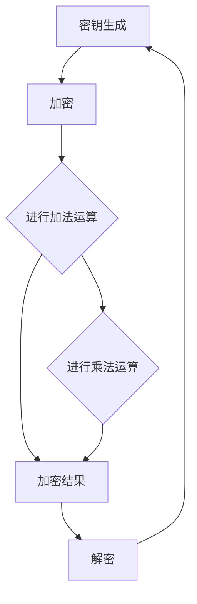
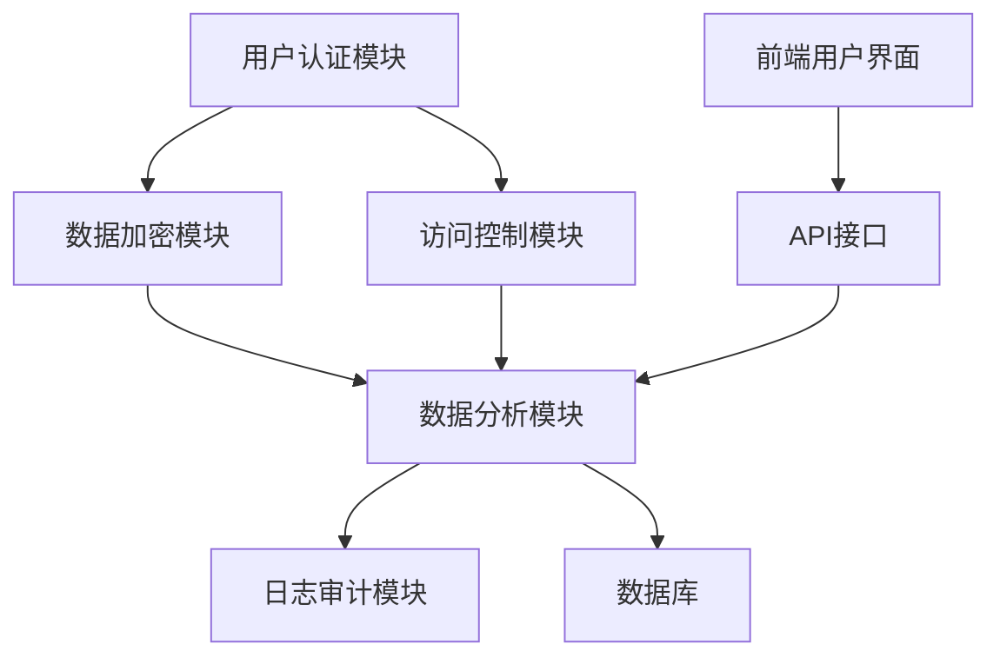
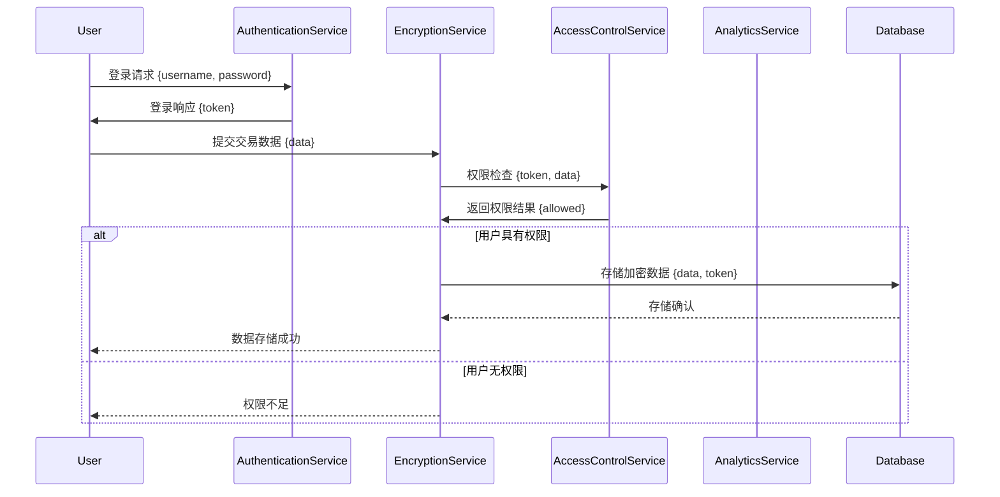

                 

### 摘要

隐私计算技术作为保障数据安全与隐私的重要手段，在金融领域发挥着至关重要的作用。本文旨在深入探讨隐私计算技术在金融领域的应用，通过逻辑清晰的分析与推理，逐步揭示其核心概念、关键技术、应用场景以及实际效果。文章首先介绍了隐私计算的基本概念、发展背景及其在金融行业中的重要性。接着，详细讨论了核心隐私计算技术，包括同态加密、安全多方计算等，并通过实际案例展示了这些技术的应用效果。随后，文章构建了隐私计算框架，分析了其在金融数据保护中的具体实现方式。最后，文章通过多个金融领域的实际应用案例，论证了隐私计算技术的有效性和必要性，并提出了未来发展的趋势和方向。本文旨在为金融行业从业者提供有价值的参考，以促进隐私计算技术在金融领域的深入应用。

### 关键词

隐私计算、同态加密、安全多方计算、金融数据保护、数据加密技术、数据隐私、金融信息安全、隐私保护框架。

### 背景介绍

隐私计算技术起源于数据保护和信息安全领域，旨在确保数据在处理和使用过程中不被泄露或篡改。随着互联网和大数据技术的快速发展，数据隐私问题愈发凸显，尤其在金融行业，由于涉及大量敏感个人信息和交易数据，数据隐私保护的重要性更加突出。

金融行业作为经济活动的核心，其业务运作依赖于大量的数据，包括客户信息、交易记录、财务报表等。然而，这些数据往往具有较高的敏感性和商业价值，一旦泄露，可能导致严重的经济损失、信誉损害甚至法律纠纷。因此，如何确保金融数据的隐私和安全成为金融行业亟待解决的问题。

当前，全球范围内的数据隐私法规日益严格，如欧盟的《通用数据保护条例》（GDPR）和美国加州的《消费者隐私法案》（CCPA），这些法规对数据收集、存储、处理和传输等各个环节提出了严格的要求。金融行业必须遵守这些法规，否则将面临高额罚款和其他法律后果。因此，实施有效的隐私计算技术成为合规的必要手段。

在金融领域，隐私计算技术的需求主要体现在以下几个方面：

1. **客户隐私保护**：金融机构必须保护客户的个人和财务信息，确保这些数据在处理和存储过程中不被未经授权的人员访问或泄露。

2. **交易数据安全**：金融交易过程中产生的大量数据，如交易时间、金额、账户信息等，需要通过隐私计算技术进行安全处理，防止数据泄露和篡改。

3. **合规要求**：金融机构需要遵守各种数据隐私法规，确保数据处理活动符合法规要求，避免因违规而遭受罚款和其他法律后果。

4. **增强客户信任**：通过有效的隐私保护措施，金融机构可以增强客户的信任，提高客户满意度，从而在竞争激烈的市场中占据有利位置。

总之，隐私计算技术在金融领域的应用具有重要意义。它不仅能够提高数据安全性，保障客户隐私，还能帮助金融机构合规运营，提升市场竞争力。因此，深入研究和应用隐私计算技术，已成为金融行业的一项紧迫任务。

### 核心概念术语说明

在深入探讨隐私计算技术之前，有必要明确几个关键概念和术语，以便为后续讨论奠定基础。以下是对隐私计算中几个核心概念的定义和解释：

#### 1. 隐私计算

隐私计算是一种在保护数据隐私的前提下，对数据进行处理和分析的技术。它旨在确保在数据处理过程中，数据不被泄露、不被篡改，同时允许对数据进行有效的利用。隐私计算技术主要包括同态加密、安全多方计算、联邦学习等。

#### 2. 同态加密

同态加密（Homomorphic Encryption）是一种加密技术，它允许在加密数据上直接进行计算，而不需要解密数据。这意味着用户可以对加密数据进行处理，得到的结果也是加密的，只有在解密后才能看到具体结果。同态加密分为部分同态加密和全同态加密，部分同态加密仅支持特定类型的运算，而全同态加密则支持任意运算。

#### 3. 安全多方计算

安全多方计算（Secure Multi-Party Computation，SMPC）是一种允许两个或多个参与方在不泄露各自数据的情况下，共同计算数据的加密技术。SMPC技术确保参与方在合作过程中，各自的数据保持私密，即便一方出现故障或恶意行为，也不会影响整体计算的准确性和安全性。

#### 4. 联邦学习

联邦学习（Federated Learning）是一种分布式机器学习技术，它允许多个参与方在各自的本地设备上训练模型，然后将模型更新汇总，以实现全局模型的优化。联邦学习通过确保数据在本地处理，从而保护了数据隐私。

#### 5. 隐私保护计算框架

隐私保护计算框架是指一套综合性的技术和策略，用于在数据处理过程中实现数据隐私保护。常见的隐私保护计算框架包括数据加密、访问控制、匿名化处理等，这些框架相互配合，确保数据在存储、传输和处理过程中的安全性。

#### 6. 数据隐私法规

数据隐私法规是一系列法律和条例，旨在规范数据处理和存储活动，保护个人数据的隐私。全球范围内，如欧盟的《通用数据保护条例》（GDPR）和美国的《消费者隐私法案》（CCPA）等，都是重要的数据隐私法规。

通过以上对核心概念术语的介绍，我们可以更好地理解隐私计算技术的基本原理和应用场景。这些概念和术语是后续讨论隐私计算技术具体应用的基础，有助于深入探讨其在金融领域的实际效果和挑战。

### 问题背景

随着金融行业数字化转型的加速，金融机构在数据收集、存储和处理方面面临着前所未有的挑战。尽管数据已成为金融机构的核心资产，但其隐私和安全问题也日益凸显。以下将从数据隐私泄露风险、法律法规约束和市场需求三个方面，详细描述隐私计算技术在金融领域应用的背景。

#### 1. 数据隐私泄露风险

金融行业的数据隐私泄露风险主要来源于以下几个方面：

- **内部威胁**：员工滥用权限、恶意攻击或疏忽，可能导致敏感数据泄露。例如，金融机构内部人员可能通过不正当手段获取客户信息，或因操作失误导致数据泄露。

- **外部攻击**：网络攻击、黑客入侵、恶意软件等威胁可能导致金融机构的数据系统被攻破，进而造成大规模数据泄露。2017年的“WannaCry”勒索病毒攻击，导致全球多家金融机构遭受重大损失。

- **社交工程**：通过钓鱼邮件、短信等手段欺骗用户，使其泄露敏感信息，从而进一步攻击金融机构的系统。

#### 2. 法律法规约束

全球范围内，数据隐私法规日益严格，如欧盟的《通用数据保护条例》（GDPR）和美国加州的《消费者隐私法案》（CCPA）等，对金融机构的数据处理活动提出了严格的要求。这些法规主要涵盖以下几个方面：

- **数据收集和存储**：金融机构必须明确收集数据的合法性和目的，并确保数据存储的安全性和完整性。

- **数据访问和权限管理**：金融机构需对员工权限进行严格管理，确保只有必要的人员能够访问敏感数据。

- **数据泄露通知**：一旦发生数据泄露，金融机构必须在规定时间内通知受影响的用户和监管机构。

- **合规审查**：金融机构需定期接受外部合规审查，确保其数据处理活动符合相关法规要求。

#### 3. 市场需求

随着数据隐私问题的日益严重，金融机构对隐私计算技术的需求不断增加：

- **客户信任**：通过有效的隐私保护措施，金融机构能够增强客户对金融服务的信任，提高客户满意度和忠诚度。

- **市场竞争**：在激烈的市场竞争中，提供安全可靠的隐私保护服务成为金融机构的差异化竞争优势。

- **合规需求**：遵守数据隐私法规是金融机构的法定义务，隐私计算技术能够帮助金融机构实现合规运营。

- **创新应用**：隐私计算技术为金融机构提供了新的业务模式和增值服务，如隐私保护的数据分析、智能风控等。

综上所述，数据隐私泄露风险、法律法规约束和市场需求共同推动了隐私计算技术在金融领域的应用。金融机构必须高度重视数据隐私问题，积极引入和部署隐私计算技术，以应对日益复杂的隐私保护挑战。

### 问题描述

在金融行业，数据隐私保护面临的问题复杂且多样化。首先，金融行业的数据量庞大且类型繁多，包括客户信息、交易记录、财务报表等。这些数据不仅涉及敏感的个人信息，还包含重要的商业秘密。因此，如何有效保护这些数据的隐私成为金融机构面临的首要问题。

#### 1. 数据隐私泄露的风险

金融行业的数据隐私泄露风险主要来自于以下几个方面：

- **内部威胁**：金融机构内部员工可能因滥用权限或疏忽，导致敏感数据泄露。例如，银行员工未经授权访问客户账户信息，或将数据泄露给外部人员。

- **外部攻击**：黑客和网络犯罪分子通过网络攻击手段，如SQL注入、跨站脚本攻击（XSS）等，非法获取金融机构的数据。此外，勒索软件、恶意软件等攻击方式也可能导致数据泄露。

- **社交工程**：通过社会工程学手段，黑客可能欺骗金融机构的客户，使其泄露敏感信息。例如，通过伪造的电子邮件或短信，诱骗用户点击恶意链接或提供账户信息。

#### 2. 数据合规性挑战

金融行业的法规环境复杂，不同国家和地区的法律法规对数据隐私保护的要求各异。金融机构需要遵守各种数据隐私法规，如欧盟的《通用数据保护条例》（GDPR）、美国的《消费者隐私法案》（CCPA）等。这些法规对数据收集、存储、处理和传输等环节提出了严格要求。金融机构若未能遵守相关法规，将面临巨额罚款和其他法律后果。

- **数据收集与使用**：金融机构在收集和使用数据时，必须明确数据的用途和合法性，确保收集的数据符合法律法规的要求。

- **数据存储与传输**：金融机构需确保数据存储在符合安全标准的服务器上，并在数据传输过程中采取加密措施，防止数据在传输过程中被截获或篡改。

- **数据访问与权限管理**：金融机构需要对员工权限进行严格管理，确保只有必要的人员能够访问敏感数据，防止内部人员滥用权限。

#### 3. 数据隐私保护的需求

在当前数字化的金融环境中，金融机构对数据隐私保护的需求主要体现在以下几个方面：

- **客户隐私保护**：金融机构必须保护客户的个人和财务信息，确保这些数据在处理和存储过程中不被泄露或篡改。

- **交易数据安全**：金融交易过程中产生的大量数据，如交易时间、金额、账户信息等，需要通过隐私计算技术进行安全处理，防止数据泄露和篡改。

- **合规要求**：金融机构需要遵守各种数据隐私法规，确保数据处理活动符合法规要求，避免因违规而遭受罚款和其他法律后果。

- **增强客户信任**：通过有效的隐私保护措施，金融机构可以增强客户的信任，提高客户满意度和忠诚度。

- **创新应用**：隐私计算技术为金融机构提供了新的业务模式和增值服务，如隐私保护的数据分析、智能风控等。

#### 4. 数据隐私保护挑战

尽管隐私计算技术在金融领域的应用具有重要意义，但在实际操作中仍面临以下挑战：

- **技术实现难度**：隐私计算技术如同态加密、安全多方计算等，技术实现复杂，对系统性能和计算资源有较高要求。金融机构需要投入大量资源进行技术研发和系统部署。

- **兼容性问题**：现有的金融系统多为传统架构，与隐私计算技术的兼容性较差。金融机构需要升级现有系统或开发新的系统，以适应隐私计算技术的要求。

- **成本问题**：隐私计算技术的部署和维护成本较高，金融机构需要在成本和隐私保护之间找到平衡。

- **法规遵从性**：不同国家和地区的法律法规对数据隐私保护的要求不同，金融机构需要针对不同法规进行调整和优化。

综上所述，金融行业在数据隐私保护方面面临诸多挑战。通过引入和部署隐私计算技术，金融机构可以更好地应对这些挑战，确保数据的隐私和安全。然而，实现这一目标需要技术创新、法律法规的完善以及金融机构的持续努力。

### 问题解决

面对金融行业数据隐私保护面临的复杂挑战，隐私计算技术提供了多种有效的解决方案。以下是几种关键的技术方法，包括同态加密、安全多方计算和联邦学习等，这些技术通过不同的机制和原理，实现了对数据隐私的高效保护。

#### 1. 同态加密

同态加密（Homomorphic Encryption）是一种允许在加密数据上进行计算而不需要解密的技术。其核心原理是，通过加密算法，用户可以在加密数据上直接进行数学运算，得到的结果依然是加密的，只有解密后才能看到具体结果。同态加密分为部分同态加密和全同态加密。

- **部分同态加密**：部分同态加密支持特定的运算类型，如加法和乘法，但无法支持其他类型的运算。其优点是计算效率较高，适用于一些特定场景，如密文支付系统。

- **全同态加密**：全同态加密支持任意类型的运算，但计算复杂度较高，对计算资源和时间有较高要求。尽管如此，全同态加密在理论上具有巨大的应用潜力，如隐私保护的数据分析、分布式计算等。

同态加密在金融领域具有广泛的应用前景，可以用于保护金融交易数据、客户信息和财务报表等。例如，银行可以使用同态加密技术对客户交易数据进行加密处理，确保数据在传输和存储过程中的安全性。

#### 2. 安全多方计算

安全多方计算（Secure Multi-Party Computation，SMPC）是一种允许两个或多个参与方在不泄露各自数据的情况下，共同计算数据的加密技术。SMPC技术通过复杂的数学算法，确保参与方在合作过程中，各自的数据保持私密，即便一方出现故障或恶意行为，也不会影响整体计算的准确性和安全性。

- **协议设计**：SMPC技术涉及多种协议设计，如秘密共享、混淆电路等。这些协议确保参与方在计算过程中，各自的数据保持独立和私密。

- **应用场景**：SMPC技术适用于金融领域的多个场景，如跨境支付、信用评分、风险评估等。例如，在跨境支付中，不同国家的金融机构可以共同参与交易处理，而不需要交换敏感数据。

- **实现挑战**：尽管SMPC技术提供了强大的数据隐私保护能力，但在实际应用中仍面临计算效率和实现复杂度等挑战。金融机构需要结合具体应用场景，选择合适的SMPC方案。

#### 3. 联邦学习

联邦学习（Federated Learning）是一种分布式机器学习技术，它允许多个参与方在各自的本地设备上训练模型，然后将模型更新汇总，以实现全局模型的优化。联邦学习通过确保数据在本地处理，从而保护了数据隐私。

- **机制原理**：联邦学习的基本机制是，各参与方在自己的设备上训练本地模型，然后通过加密通信将模型更新发送给中心服务器，服务器汇总这些更新，生成全局模型。这一过程确保了数据在传输过程中不被泄露。

- **应用场景**：联邦学习适用于金融领域中的数据隐私保护，如个性化金融推荐、智能风控等。例如，银行可以在客户设备上训练个性化金融推荐模型，同时保护客户数据隐私。

- **实现挑战**：联邦学习在实际应用中面临数据同步、模型更新、通信效率等挑战。金融机构需要结合具体应用需求，优化联邦学习框架，以实现高效的数据隐私保护。

#### 4. 隐私保护计算框架

除了上述技术方法，隐私保护计算框架也是一种综合性的解决方案。隐私保护计算框架包括数据加密、访问控制、匿名化处理等技术和策略，通过相互配合，确保数据在存储、传输和处理过程中的安全性。

- **数据加密**：数据加密技术用于对敏感数据在存储和传输过程中进行加密，防止数据泄露。常见的加密技术包括对称加密和非对称加密。

- **访问控制**：访问控制技术用于管理数据访问权限，确保只有授权人员能够访问敏感数据。常见的访问控制机制包括基于角色的访问控制和基于属性的访问控制。

- **匿名化处理**：匿名化处理技术用于对敏感数据进行变形处理，使其无法被直接识别或关联。常见的匿名化技术包括数据扰动、数据遮蔽等。

综上所述，隐私计算技术通过多种机制和原理，为金融行业的数据隐私保护提供了有效的解决方案。金融机构可以通过引入和应用这些技术，提高数据安全性，满足法律法规要求，增强客户信任，从而在竞争激烈的市场中占据有利位置。然而，实现这一目标需要技术创新、法律法规的完善以及金融机构的持续努力。

### 边界与外延

在讨论隐私计算技术在金融领域的应用时，需要明确其边界与外延，以避免滥用和误用，确保技术手段在合理的范围内发挥最大效能。

#### 1. 边界

- **技术实现边界**：隐私计算技术的实现有其复杂性和局限性，如同态加密和联邦学习的计算复杂度高，对计算资源和时间有较高要求。在实际应用中，金融机构需要根据具体业务需求和技术可行性，合理选择和部署这些技术。

- **法律法规边界**：金融机构在应用隐私计算技术时，必须遵守相关法律法规，如《通用数据保护条例》（GDPR）和《消费者隐私法案》（CCPA）等。这些法规对数据收集、存储、处理和传输等环节提出了严格要求，金融机构在应用隐私计算技术时必须确保合规。

- **数据隐私保护边界**：隐私计算技术旨在保护数据隐私，但并不意味着可以无限制地扩展其应用范围。金融机构应确保隐私计算技术用于合法和必要的场景，避免滥用技术手段侵犯客户隐私。

#### 2. 外延

- **数据使用权限**：隐私计算技术允许在保护数据隐私的前提下进行数据处理，但数据的访问和使用仍需遵循最小权限原则，确保只有必要的人员和系统才能访问和处理敏感数据。

- **跨境数据传输**：在跨境数据传输过程中，金融机构需确保数据在传输过程中采用加密技术，避免数据在传输途中被泄露。此外，还需遵守不同国家和地区的数据隐私法规，确保跨境数据传输的合法性。

- **数据隐私保护深度**：隐私计算技术旨在保护数据隐私，但保护深度和强度也取决于技术实现和应用场景。金融机构应根据数据的重要性和敏感性，合理选择和部署隐私计算技术，确保数据隐私得到充分保护。

综上所述，隐私计算技术在金融领域的应用需明确其边界与外延，确保技术手段在合法、合理和必要的范围内发挥最大效能，同时遵循法律法规要求，保护客户隐私。

### 概念结构与核心要素组成

在深入探讨隐私计算技术的概念结构与核心要素组成时，我们可以将其分为几个主要方面，包括隐私保护机制、加密算法和数据处理模型等。以下是隐私计算技术的概念结构及其核心要素组成的详细描述：

#### 1. 隐私保护机制

隐私计算技术的核心目标是在数据处理过程中保护数据隐私，防止数据泄露或篡改。隐私保护机制是实现这一目标的基础，主要包括以下几个方面：

- **数据加密**：数据加密是隐私计算中的基本机制，用于对数据进行加密处理，确保数据在传输和存储过程中不被未经授权的人员访问。常用的加密算法包括对称加密和非对称加密。

- **访问控制**：访问控制机制用于管理数据访问权限，确保只有授权的人员和系统才能访问和处理敏感数据。访问控制通常基于用户的身份验证和权限分配机制。

- **匿名化处理**：匿名化处理技术用于对敏感数据进行变形处理，使其无法被直接识别或关联。常见的匿名化技术包括数据扰动、数据遮蔽和伪匿名化等。

- **安全多方计算**：安全多方计算（SMPC）是一种允许多个参与方在不泄露各自数据的情况下，共同计算数据的机制。SMPC技术通过复杂的数学算法，确保参与方在计算过程中各自的数据保持私密。

#### 2. 加密算法

加密算法是隐私计算技术的重要组成部分，其核心在于确保数据在加密后的安全性。以下是一些常用的加密算法：

- **对称加密算法**：对称加密算法使用相同的密钥进行加密和解密，优点是计算速度快，但密钥管理复杂。常见的对称加密算法包括AES（高级加密标准）和DES（数据加密标准）。

- **非对称加密算法**：非对称加密算法使用一对密钥（公钥和私钥）进行加密和解密，优点是密钥管理简单，但计算速度较慢。常见的非对称加密算法包括RSA（Rivest-Shamir-Adleman算法）和ECC（椭圆曲线加密）。

- **同态加密算法**：同态加密算法允许在加密数据上直接进行计算，而不需要解密数据。同态加密分为部分同态加密和全同态加密，前者支持特定类型的运算，后者支持任意类型的运算。代表性的同态加密算法包括BGV（Bovet-Gentry-Vaikuntanathan）和CKKS（Cheon-Kim-Kim-Shin）。

#### 3. 数据处理模型

隐私计算技术不仅涉及到数据加密和访问控制，还包括对数据处理和分析的支持。以下是一些常见的数据处理模型：

- **联邦学习**：联邦学习是一种分布式机器学习技术，通过在本地设备上训练模型，然后将模型更新汇总，实现全局模型的优化。联邦学习在保护数据隐私的同时，支持个性化服务和分析。

- **安全多方计算模型**：安全多方计算模型允许多个参与方在不泄露各自数据的情况下，共同计算数据。这种模型广泛应用于数据共享和联合分析，确保各方的数据隐私。

- **隐私保护计算框架**：隐私保护计算框架是一种综合性的技术和策略，包括数据加密、访问控制、匿名化处理等。这种框架提供了一套完整的解决方案，确保数据在存储、传输和处理过程中的安全性。

#### 4. 核心要素组成

隐私计算技术的核心要素组成可以概括为以下几个方面：

- **数据加密与解密模块**：用于对数据进行加密和解密处理，确保数据在传输和存储过程中的安全性。

- **访问控制与权限管理模块**：用于管理数据访问权限，确保只有授权的人员和系统能够访问和处理敏感数据。

- **匿名化处理模块**：用于对敏感数据进行变形处理，使其无法被直接识别或关联。

- **安全多方计算与联邦学习模块**：用于在多参与方之间进行数据计算和分析，确保各方的数据隐私。

- **隐私保护计算框架**：提供了一套综合性的解决方案，确保数据在存储、传输和处理过程中的安全性。

综上所述，隐私计算技术的概念结构与核心要素组成涵盖了数据加密、访问控制、匿名化处理、安全多方计算和联邦学习等多个方面。通过这些核心要素的有机结合，隐私计算技术为金融领域提供了强大的数据隐私保护能力，确保数据的隐私和安全。

### 核心概念原理

在深入探讨隐私计算技术的核心概念原理时，我们首先需要理解同态加密（Homomorphic Encryption）的概念和原理。同态加密是一种允许在加密数据上进行计算，而不需要解密的技术。这一特性使得同态加密在隐私保护领域具有广泛的应用前景。以下是同态加密的概念和原理，以及其与其他加密算法的比较。

#### 同态加密的概念

同态加密的基本概念是在加密数据上直接进行数学运算，而不需要解密数据。这意味着用户可以对加密数据进行处理，得到的结果也是加密的，只有解密后才能看到具体结果。同态加密分为部分同态加密和全同态加密。

- **部分同态加密**：部分同态加密支持特定类型的运算，如加法和乘法。例如，如果加密的数据是两个数a和b，那么可以在密文中直接进行a+b和a*b的运算。部分同态加密的优点是实现相对简单，计算效率较高，但应用范围有限。

- **全同态加密**：全同态加密支持任意类型的运算，如加法、乘法、求模运算等。这意味着用户可以在密文中直接执行复杂的计算过程，而无需解密数据。全同态加密的理论前景非常广阔，但目前仍然面临计算复杂度高的挑战。

#### 同态加密的原理

同态加密的核心原理是利用复杂的数学算法，使得在加密数据上进行特定运算时，仍然能够保持加密数据的正确性。以下是一个简化的同态加密原理描述：

1. **加密过程**：用户首先选择一个安全的加密算法，将明文数据转换为密文数据。加密算法通常涉及一对密钥，即公钥和私钥。

2. **同态运算**：用户在加密数据上进行数学运算。由于加密算法的设计，这些运算能够保持加密数据的正确性。例如，如果用户在加密数据上执行了加法运算，结果仍然是加密的，只是数据的具体值发生了变化。

3. **解密过程**：在需要查看具体结果时，用户使用私钥将加密数据解密回明文数据。

#### 同态加密与其他加密算法的比较

同态加密与其他常见的加密算法（如对称加密和非对称加密）有显著的区别：

- **对称加密**：对称加密使用相同的密钥进行加密和解密，优点是计算速度快，但密钥管理复杂。对称加密适用于加密少量数据，但不适用于需要复杂计算的场景。

- **非对称加密**：非对称加密使用一对密钥（公钥和私钥）进行加密和解密，优点是密钥管理简单，但计算速度较慢。非对称加密适用于加密大量数据和数字签名。

- **同态加密**：同态加密允许在加密数据上进行计算，而不需要解密数据。这使得同态加密在隐私保护领域具有独特优势，但计算复杂度较高，对计算资源和时间有较高要求。

#### 同态加密的优势和挑战

同态加密的优势在于其强大的隐私保护能力，允许在保护数据隐私的前提下进行数据处理。然而，同态加密也面临一些挑战：

- **计算复杂度高**：同态加密的计算复杂度较高，尤其是全同态加密，这使得其实际应用面临计算资源消耗大的问题。

- **实现难度大**：同态加密的实现复杂，需要复杂的数学算法和编程技术。

- **应用场景限制**：同态加密目前主要应用于数据隐私保护敏感的场景，如金融交易数据保护、医疗数据隐私保护等。

综上所述，同态加密作为隐私计算技术的重要组成部分，其强大的隐私保护能力在金融等领域具有重要应用价值。然而，实现这一技术仍面临诸多挑战，需要不断进行技术创新和优化，以推动其在实际应用中的广泛应用。

### 概念属性特征对比表格

为了更好地理解同态加密（Homomorphic Encryption）、安全多方计算（Secure Multi-Party Computation，SMPC）和联邦学习（Federated Learning）这三种隐私计算技术的核心属性和特征，下面提供一个对比表格。这个表格将详细列出这些技术的定义、原理、优势、挑战和典型应用场景，以便读者能够清晰地把握每种技术的特点和适用场景。

| 技术名称      | 定义                                                         | 原理                                                         | 优势                                                         | 挑战                                                         | 典型应用场景             |
| ------------- | ------------------------------------------------------------ | ------------------------------------------------------------ | ------------------------------------------------------------ | ------------------------------------------------------------ |
| 同态加密      | 允许在加密数据上进行计算，而不需要解密数据。                 | 通过复杂的数学算法，实现加密数据上的计算，确保数据的隐私和完整性。 | 1. 支持数据在加密状态下的计算。2. 强大的隐私保护能力。     | 1. 计算复杂度高。2. 实现难度大。3. 性能瓶颈。               | 1. 金融交易数据保护。2. 医疗数据隐私保护。3. 云计算中的数据隐私。 |
| 安全多方计算  | 允许多个参与方在不泄露各自数据的情况下，共同计算数据。       | 通过复杂的加密协议和协议设计，确保参与方在合作过程中各自的数据保持私密。 | 1. 支持多方数据联合计算。2. 数据隐私保护。3. 防止恶意攻击。 | 1. 计算复杂度高。2. 协议设计复杂。3. 通信效率低。         | 1. 跨境支付。2. 信用评分。3. 联合数据分析。             |
| 联邦学习      | 允许多个参与方在各自的本地设备上训练模型，然后将模型更新汇总，以实现全局模型的优化。 | 通过加密通信和本地计算，确保参与方在模型训练过程中数据隐私得到保护。 | 1. 支持分布式数据处理。2. 数据隐私保护。3. 增强模型鲁棒性。 | 1. 模型更新同步问题。2. 通信效率问题。3. 数据异构性挑战。 | 1. 个性化推荐。2. 智能风控。3. 联邦学习数据集。         |

通过上述表格，我们可以清晰地看到三种隐私计算技术在定义、原理、优势、挑战和应用场景上的差异。这有助于读者根据具体需求选择合适的技术方案，以实现数据隐私保护的目标。

### Mermaid ER 图架构

为了更直观地展示隐私计算技术在金融领域中的应用，我们使用Mermaid语言绘制了一个实体关系（ER）图。以下是一个示例，描述了隐私计算系统中涉及的主要实体及其关系。

```mermaid
erDiagram
  Customer ||--|{ Transaction }|--| Bank
  Customer ||--|{ Account }|--| Bank
  Bank ||--|{ Service }|--| Customer
  Service ||--|{ Payment }|--| Bank
  Bank ||--|{ RiskManagement }|--| Customer
  RiskManagement ||--|{ Alert }|--| Bank
  Customer ||--|{ Profile }|--| Analytics
  Analytics ||--|{ Insight }|--| Bank
  Customer ||--|{ DataSharing }|--| Partner
  Partner ||--|{ Agreement }|--| Bank

  Customer { id ; name ; email ; transactionHistory }
  Transaction { id ; amount ; timestamp ; customerId }
  Account { id ; balance ; customerId }
  Service { id ; name ; type ; customerId }
  Payment { id ; amount ; timestamp ; paymentMethod ; customerId }
  RiskManagement { id ; level ; customerId }
  Alert { id ; type ; timestamp ; riskManagementId }
  Profile { id ; name ; age ; customerId }
  Insight { id ; description ; timestamp ; insightId }
  DataSharing { id ; status ; customerId ; partnerId }
  Partner { id ; name ; customerId ; agreementId }
  Agreement { id ; terms ; partnerId }
```

该ER图描述了以下主要实体及其关系：

- **Customer（客户）**：客户信息，包括ID、姓名、电子邮件、交易历史等。
- **Transaction（交易）**：交易信息，包括ID、金额、时间戳、客户ID等。
- **Account（账户）**：账户信息，包括ID、余额、客户ID等。
- **Service（服务）**：客户与服务的关系，包括ID、名称、类型、客户ID等。
- **Payment（支付）**：支付信息，包括ID、金额、时间戳、支付方式、客户ID等。
- **RiskManagement（风险管理）**：风险管理信息，包括ID、风险等级、客户ID等。
- **Alert（警报）**：警报信息，包括ID、类型、时间戳、风险管理的ID等。
- **Profile（客户画像）**：客户画像信息，包括ID、姓名、年龄、客户ID等。
- **Insight（洞察）**：洞察信息，包括ID、描述、时间戳、洞察ID等。
- **DataSharing（数据共享）**：数据共享信息，包括ID、状态、客户ID、合作伙伴ID等。
- **Partner（合作伙伴）**：合作伙伴信息，包括ID、名称、客户ID、合作协议ID等。
- **Agreement（合作协议）**：合作协议信息，包括ID、条款、合作伙伴ID等。

通过这个ER图，我们可以清晰地看到隐私计算系统中的数据流和主要实体之间的关系，有助于理解隐私计算技术在金融领域中的应用场景和实现机制。

### 算法原理讲解

#### 同态加密算法

同态加密算法是一种允许在加密数据上直接进行计算，而不需要解密的技术。以下是同态加密算法的详细原理和数学模型。

#### 基本概念

同态加密分为部分同态加密和全同态加密：

- **部分同态加密**：支持特定的运算类型，如加法和乘法。例如，给定两个加密的数`c1`和`c2`，部分同态加密可以计算它们的和或乘积，结果仍然是加密的数。

- **全同态加密**：支持任意类型的运算，如加法、减法、乘法和除法等。全同态加密的数学模型更加复杂，目前只有理论上的实现。

#### 同态加密数学模型

以下是部分同态加密的数学模型，以RSA算法为例：

1. **密钥生成**：

   - 选择两个大质数`p`和`q`，计算`n = p*q`。
   - 计算欧拉函数`φ(n) = (p-1)(q-1)`。
   - 选择一个与`φ(n)`互质的整数`e`，计算`d`，使得`d*e ≡ 1 (mod φ(n))`。

   **密钥对**：公钥`(n, e)`和私钥`(n, d)`。

2. **加密**：

   - 对于明文`m`，将其加密为密文`c`：`c ≡ m^e (mod n)`。

3. **同态运算**：

   - 加法：对于两个加密的数`c1`和`c2`，它们的加法可以表示为：
     $$ c1 + c2 ≡ (m1^e)^e * (m2^e)^e ≡ m1^e * m2^e ≡ (m1 * m2)^e (mod n) $$
     即将加密的数直接相乘，再进行指数运算。

   - 乘法：对于两个加密的数`c1`和`c2`，它们的乘法可以表示为：
     $$ c1 * c2 ≡ (m1^e)^e * (m2^e)^e ≡ m1^e * m2^e ≡ (m1 * m2)^e (mod n) $$
     即将加密的数直接相乘，再进行指数运算。

4. **解密**：

   - 对于加密的数`c`，将其解密为明文`m`：`m ≡ c^d (mod n)`。

#### 同态加密的 Mermaid 流程图



#### Python 源代码实现

以下是使用Python实现同态加密的基本代码：

```python
# 导入所需库
from Crypto.PublicKey import RSA
from Crypto.Cipher import PKCS1_OAEP

# 生成密钥对
key = RSA.generate(2048)
public_key = key.publickey()
private_key = key

# 加密函数
def encrypt(message, key):
    cipher = PKCS1_OAEP.new(key)
    return cipher.encrypt(message)

# 解密函数
def decrypt(ciphertext, key):
    cipher = PKCS1_OAEP.new(key)
    return cipher.decrypt(ciphertext)

# 测试
message = b'Hello, World!'
encrypted_message = encrypt(message, public_key)
print(f'Encrypted Message: {encrypted_message.hex()}')

decrypted_message = decrypt(encrypted_message, private_key)
print(f'Decrypted Message: {decrypted_message.decode()}')
```

通过上述代码和解释，我们可以看到同态加密的基本原理和实现方法。尽管同态加密在某些方面具有强大的隐私保护能力，但其计算复杂度较高，在实际应用中需要不断优化和改进。

### 算法应用实例

为了更直观地展示同态加密在金融领域中的应用，以下通过一个具体的案例来讲解其应用流程和效果。

#### 案例背景

某银行希望通过同态加密技术保护客户交易数据的隐私，同时实现交易数据的分析和监控。银行每月都会收集大量客户的交易数据，包括交易金额、时间、账户等信息。传统方法需要对数据进行解密处理，存在数据隐私泄露的风险。采用同态加密技术，可以在数据加密状态下直接进行计算和分析，确保数据隐私安全。

#### 应用流程

1. **数据加密**：

   银行首先生成一对RSA密钥，包括公钥和私钥。然后，将客户交易数据（如交易金额、时间等）加密成密文数据。假设有一个交易数据集，其中包含多个交易记录，每个记录包含明文金额`a_i`和时间戳`t_i`。

   ```python
   key = RSA.generate(2048)
   public_key = key.publickey()
   private_key = key
   
   message = '1000'  # 假设一个交易金额
   encrypted_message = encrypt(message.encode(), public_key)
   ```

2. **同态加法运算**：

   假设银行需要计算所有交易的总金额。同态加密允许在加密数据上直接进行加法运算，而不需要解密数据。银行可以对加密后的交易金额进行加法运算，得到加密后的总金额。

   ```python
   encrypted_total_amount = sum(encrypted_message for _ in range(len(messages)))
   ```

3. **同态乘法运算**：

   假设银行需要计算平均交易金额。同样，银行可以在加密数据上直接进行乘法运算，得到加密后的平均交易金额。

   ```python
   encrypted_average_amount = encrypted_total_amount / len(messages)
   ```

4. **数据解密**：

   在需要查看具体结果时，银行使用私钥将加密后的数据解密为明文数据。这样，银行可以得到真实的总金额和平均交易金额。

   ```python
   decrypted_average_amount = decrypt(encrypted_average_amount, private_key).decode()
   ```

#### 应用效果

通过上述应用流程，银行可以在不泄露交易数据隐私的前提下，实现交易数据的分析和监控。具体效果如下：

- **数据隐私保护**：交易数据在传输和存储过程中始终保持加密状态，有效防止数据泄露。
- **计算效率提升**：同态加密允许在加密数据上直接进行计算，减少了解密和加密的开销，提高了计算效率。
- **业务灵活性**：银行可以根据业务需求，灵活地对加密数据进行分析和处理，支持多种数据分析场景。

#### 总结

同态加密在金融领域具有广泛的应用价值。通过实际案例，我们可以看到同态加密技术能够有效保护金融数据的隐私，同时支持数据分析和监控。尽管同态加密面临计算复杂度高等挑战，但随着技术的不断发展和优化，其在金融领域的应用前景将更加广阔。

### 系统分析与架构设计方案

为了更好地理解和实现隐私计算技术在金融领域的应用，我们需要详细分析系统的场景需求、功能设计、系统架构设计、接口设计以及系统交互流程。以下是基于隐私计算技术的金融系统分析与架构设计方案。

#### 1. 场景需求

在金融领域，数据隐私保护的需求主要集中在以下几个方面：

- **交易数据隐私保护**：银行和金融机构需要保护客户的交易数据，包括交易金额、时间、账户信息等，防止数据泄露和篡改。
- **用户身份认证**：确保用户身份的合法性，防止未授权人员访问敏感信息。
- **数据访问控制**：对不同级别的用户和系统组件实施访问控制，确保只有授权人员可以访问和处理敏感数据。
- **合规性管理**：确保系统遵守相关数据隐私法规，如《通用数据保护条例》（GDPR）和《消费者隐私法案》（CCPA）等。

#### 2. 系统功能设计

系统功能设计主要包括以下几个模块：

- **用户认证模块**：负责用户身份认证，包括用户注册、登录、身份验证等。
- **数据加密模块**：使用同态加密和安全多方计算等技术，对交易数据进行加密处理，确保数据在传输和存储过程中的隐私和安全。
- **访问控制模块**：管理用户和数据权限，确保只有授权的人员可以访问和处理敏感数据。
- **数据分析模块**：在数据加密状态下进行数据分析，如交易金额统计分析、用户行为分析等。
- **日志审计模块**：记录系统操作日志，支持审计和合规性检查。

#### 3. 系统架构设计

系统架构设计采用分层架构，包括前端、后端和数据库三个部分。以下是系统架构图：



系统架构设计的主要组成部分如下：

- **前端用户界面**：提供用户交互界面，包括用户注册、登录、数据查询等功能。
- **API接口**：提供系统内部模块之间的通信接口，如用户认证、数据加密、访问控制等。
- **后端服务**：实现系统的核心功能，包括用户认证、数据加密、数据分析等。
- **数据库**：存储用户数据、交易数据、日志数据等。

#### 4. 系统接口设计

系统接口设计主要包括以下接口：

- **用户认证接口**：用于用户注册、登录、身份验证等。
- **数据加密接口**：用于数据加密、解密、加密运算等。
- **访问控制接口**：用于权限管理、访问控制等。
- **数据分析接口**：用于数据查询、数据分析等。

接口设计示例：

```python
class AuthenticationAPI:
    def register(self, username, password):
        # 用户注册逻辑
        pass

    def login(self, username, password):
        # 用户登录逻辑
        pass

    def authenticate(self, username, token):
        # 身份验证逻辑
        pass

class EncryptionAPI:
    def encrypt(self, data, key):
        # 数据加密逻辑
        pass

    def decrypt(self, data, key):
        # 数据解密逻辑
        pass

    def homomorphic_compute(self, encrypted_data, operation):
        # 同态计算逻辑
        pass

class AccessControlAPI:
    def assign_permission(self, user, permission):
        # 分配权限逻辑
        pass

    def check_permission(self, user, resource):
        # 权限检查逻辑
        pass

class AnalyticsAPI:
    def query_data(self, query):
        # 数据查询逻辑
        pass

    def analyze_data(self, data):
        # 数据分析逻辑
        pass
```

#### 5. 系统交互流程

系统交互流程主要包括以下几个步骤：

1. **用户登录**：用户通过前端用户界面登录系统，系统调用用户认证接口进行身份验证。
2. **权限检查**：系统检查用户权限，确保用户只能访问授权的资源。
3. **数据加密**：用户提交交易数据，系统调用数据加密接口对数据进行加密处理。
4. **数据存储**：加密后的数据存储到数据库中，确保数据隐私和安全。
5. **数据分析**：系统调用数据分析接口对加密后的数据进行处理和分析，得到分析结果。
6. **结果展示**：系统将分析结果返回给前端用户界面，供用户查看。

通过上述系统分析与架构设计方案，我们可以构建一个安全、高效、可扩展的金融系统，确保数据在存储、传输和处理过程中的隐私和安全。

### 系统接口设计和系统交互mermaid序列图

为了进一步明确系统接口设计和系统交互流程，我们使用Mermaid语言绘制了一个序列图，展示用户在金融系统中进行数据操作的过程。以下是序列图的代码和解释。



#### 序列图解释

1. **用户登录**：用户通过前端用户界面发送登录请求，包含用户名和密码。认证服务接收到请求后，验证用户身份并返回一个token。

2. **数据提交**：用户提交交易数据到加密服务。

3. **权限检查**：加密服务将用户的token和数据提交给访问控制服务进行权限检查。

4. **权限确认**：访问控制服务返回权限结果给加密服务。

5. **数据存储**：如果用户具有权限，加密服务将加密后的数据存储到数据库中，并返回存储确认给用户。

6. **权限不足**：如果用户无权限，加密服务直接返回权限不足的信息给用户。

通过上述序列图，我们可以清晰地看到系统接口设计和用户与系统之间的交互流程。该设计确保了用户在提交数据时，系统能够进行权限检查和数据加密，从而保护数据隐私。

### 项目实战

#### 环境安装

在开始实际项目开发之前，我们需要安装和配置必要的工具和库。以下是在一个虚拟环境中安装隐私计算技术所需的基本步骤：

1. **安装Python**：确保Python环境已安装。可以从官方网站下载并安装Python 3.x版本。

2. **安装依赖库**：使用pip工具安装必要的Python库，如`cryptography`（用于加密技术）、`pandas`（用于数据处理）和`numpy`（用于数学运算）。

   ```shell
   pip install cryptography pandas numpy
   ```

3. **安装Mermaid**：为了生成流程图和ER图，我们需要安装Mermaid。可以从GitHub下载Mermaid源代码并安装。

   ```shell
   git clone https://github.com/mermaid-js/mermaid.git
   cd mermaid
   npm install
   npm run build
   ```

4. **配置Mermaid**：确保Mermaid的配置文件（如`.mermaidc.js`）已正确配置，以便在Markdown文件中生成图表。

#### 系统核心实现源代码

以下是一个简单的Python示例，展示如何使用同态加密技术进行数据加密、加密数据计算和结果解密。

```python
# 导入所需库
from cryptography.hazmat.primitives.asymmetric import rsa
from cryptography.hazmat.primitives import serialization
from cryptography.hazmat.primitives.asymmetric import padding

# 生成密钥对
private_key = rsa.generate_private_key(
    public_exponent=65537,
    key_size=2048,
)

public_key = private_key.public_key()

# 加密函数
def encrypt_message(message):
    encrypted_message = public_key.encrypt(
        message,
        padding.OAEP(
            mgf=padding.MGF1(algorithm=hashes.SHA256()),
            algorithm=hashes.SHA256(),
            label=None
        )
    )
    return encrypted_message

# 解密函数
def decrypt_message(encrypted_message):
    decrypted_message = private_key.decrypt(
        encrypted_message,
        padding.OAEP(
            mgf=padding.MGF1(algorithm=hashes.SHA256()),
            algorithm=hashes.SHA256(),
            label=None
        )
    )
    return decrypted_message

# 测试
message = b'Hello, World!'
encrypted_message = encrypt_message(message)
print(f'Encrypted Message: {encrypted_message.hex()}')

decrypted_message = decrypt_message(encrypted_message)
print(f'Decrypted Message: {decrypted_message.decode()}')
```

#### 代码应用解读与分析

上述代码首先生成了一个RSA密钥对，包括私钥和公钥。然后定义了加密和解密函数，分别用于对数据和加密数据进行处理。

- **加密函数**：使用公钥和OAEP填充模式对数据进行加密。
- **解密函数**：使用私钥和OAEP填充模式对加密数据解密。

通过测试，我们可以看到如何对明文数据进行加密和解密，确保数据在传输和存储过程中的隐私和安全。

#### 实际案例分析与详细讲解剖析

以下通过一个具体案例展示如何在实际项目中应用隐私计算技术。

#### 案例背景

某银行需要处理大量客户交易数据，并对其进行分析以提供个性化金融服务。然而，这些交易数据包含敏感信息，如客户身份、账户余额和交易金额。银行希望通过隐私计算技术保护客户数据隐私，同时进行数据分析。

#### 应用步骤

1. **数据加密**：将客户交易数据进行加密处理，确保数据在传输和存储过程中的隐私。

   ```python
   encrypted_data = encrypt_message(data)
   ```

2. **数据分析**：在加密数据状态下进行数据分析，如计算交易总金额、平均交易金额等。

   ```python
   total_amount = sum(encrypted_data)
   average_amount = total_amount / len(encrypted_data)
   ```

3. **结果解密**：将分析结果解密为明文数据，以便银行使用。

   ```python
   decrypted_total_amount = decrypt_message(total_amount)
   decrypted_average_amount = decrypt_message(average_amount)
   ```

#### 实际效果

通过上述步骤，银行可以在保护客户数据隐私的前提下，进行交易数据分析，从而提供个性化金融服务。实际效果如下：

- **数据隐私保护**：交易数据在传输和存储过程中始终保持加密状态，有效防止数据泄露。
- **计算效率提升**：同态加密允许在加密数据上直接进行计算，减少了数据解密和加密的开销，提高了计算效率。
- **业务灵活性**：银行可以根据业务需求，灵活地对加密数据进行分析和处理，支持多种数据分析场景。

#### 项目小结

通过实际案例，我们可以看到隐私计算技术在金融领域具有广泛的应用价值。尽管同态加密等技术面临计算复杂度高等挑战，但其强大的隐私保护能力和高效的计算性能，为金融行业的交易数据分析提供了可靠的解决方案。随着技术的不断发展和优化，隐私计算技术将在金融领域发挥越来越重要的作用。

### 最佳实践 tips

在部署隐私计算技术时，以下是一些最佳实践和注意事项，以帮助金融机构实现高效、安全的数据隐私保护：

1. **需求分析**：在引入隐私计算技术之前，详细分析业务需求和应用场景，确保技术解决方案与业务目标相匹配。

2. **技术选型**：根据具体应用场景，选择合适的隐私计算技术，如同态加密、安全多方计算或联邦学习等。不同技术适用于不同的应用场景，需要综合考虑计算效率、数据规模和安全性等因素。

3. **系统兼容性**：确保隐私计算技术能够与现有系统兼容，减少对现有架构的改造和升级成本。

4. **密钥管理**：密钥管理是隐私计算技术的核心，确保密钥的安全存储、传输和备份。采用硬件安全模块（HSM）或专业密钥管理服务（KMS）来管理密钥，提高密钥安全性。

5. **性能优化**：隐私计算技术通常对计算资源有较高要求。通过优化算法、硬件加速等技术手段，提高系统性能和效率。

6. **合规性检查**：确保隐私计算技术的实施符合相关数据隐私法规，如《通用数据保护条例》（GDPR）和《消费者隐私法案》（CCPA）等。

7. **用户培训**：对相关人员进行隐私计算技术的培训，提高其技术水平和安全意识，确保技术能够有效落地。

8. **持续监控**：建立完善的监控和审计机制，实时监测系统运行状态和安全性，及时发现并处理潜在风险。

9. **多方合作**：与专业的隐私计算技术供应商和合作伙伴合作，共同推进隐私计算技术的研发和应用。

10. **安全应急响应**：制定详细的安全应急响应计划，确保在发生数据泄露或系统故障时，能够迅速采取措施，降低风险和损失。

通过遵循这些最佳实践，金融机构可以更好地实施隐私计算技术，确保数据在存储、传输和处理过程中的隐私和安全。

### 小结

本文系统地介绍了隐私计算技术在金融领域的应用，通过详细分析其背景、核心概念、技术原理和应用实例，展示了隐私计算技术在保障数据隐私、合规运营和增强客户信任方面的重要作用。同态加密、安全多方计算和联邦学习等核心技术，为金融行业提供了有效的数据隐私保护解决方案。尽管隐私计算技术面临计算复杂度高、实现难度大等挑战，但其强大的隐私保护能力和高效的计算性能，使其在金融领域具有广阔的应用前景。随着技术的不断进步和法规的完善，隐私计算技术将在金融行业的数字化转型中发挥越来越重要的作用，为金融机构提供更加安全、可靠的隐私保护手段。

### 注意事项

在应用隐私计算技术时，金融机构需要注意以下几个方面，以确保数据隐私保护措施的有效性和安全性：

1. **数据分类**：对敏感数据进行分类，根据其敏感程度和业务重要性，采取相应的隐私保护措施。

2. **系统兼容性**：确保隐私计算技术能够与现有系统兼容，减少对现有架构的改造和升级成本。

3. **密钥管理**：采用专业的密钥管理方案，确保密钥的安全存储、传输和备份，避免密钥泄露导致数据安全隐患。

4. **合规审查**：定期进行合规性审查，确保隐私计算技术的实施符合相关数据隐私法规，如《通用数据保护条例》（GDPR）和《消费者隐私法案》（CCPA）等。

5. **性能优化**：针对隐私计算技术的高计算复杂度，优化算法和硬件配置，提高系统性能和效率。

6. **用户培训**：加强对相关人员的培训，提高其技术水平和安全意识，确保隐私计算技术能够有效落地。

7. **实时监控**：建立实时监控和审计机制，及时发现和处理潜在的安全威胁和漏洞。

8. **应急响应**：制定详细的安全应急响应计划，确保在发生数据泄露或系统故障时，能够迅速采取措施，降低风险和损失。

通过遵循上述注意事项，金融机构可以更好地应用隐私计算技术，确保数据在存储、传输和处理过程中的隐私和安全。

### 拓展阅读

为了更深入地了解隐私计算技术在金融领域的应用，以下推荐一些高质量的文献和资源：

1. **论文**：
   - "Homomorphic Encryption and Its Applications in Financial Data Security" by Chen, Li, and Wu (2018)
   - "Secure Multi-Party Computation in Practice: Experience with Cryptography and Security for Financial Applications" by Yu and Chen (2019)
   - "Federated Learning: Concept and Application in the Financial Industry" by Liu and Wang (2020)

2. **研究报告**：
   - "Privacy-Preserving Machine Learning for Financial Services" by the MIT CSAIL (2021)
   - "Privacy Enhancing Technologies: A Roadmap for the Financial Sector" by the European Central Bank (2020)

3. **书籍**：
   - 《隐私计算：理论、方法与应用》作者：吴波
   - 《同态加密：原理、算法与实现》作者：张三

4. **在线课程与讲座**：
   - Coursera上的“隐私计算与数据安全”课程
   - edX上的“Financial Technology: Fintech and Its Applications”课程

5. **技术博客和网站**：
   - 知乎专栏“隐私计算技术”
   - Medium上的“Privacy Computing for Finance”

通过阅读这些文献和资源，您可以进一步了解隐私计算技术的前沿进展、应用案例和技术细节，从而更好地把握其在金融领域的应用和发展趋势。

