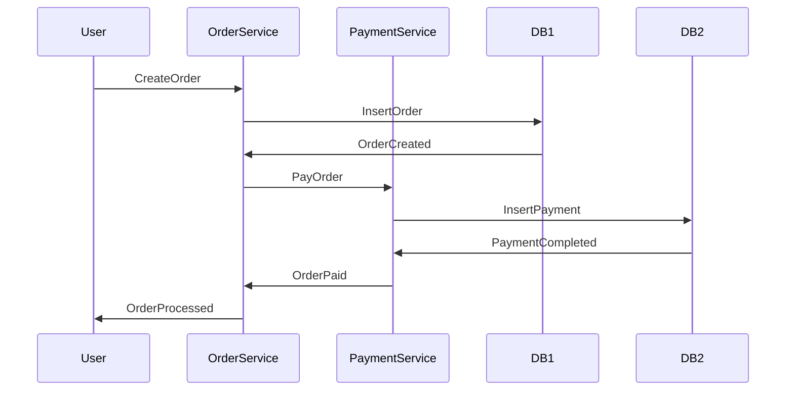
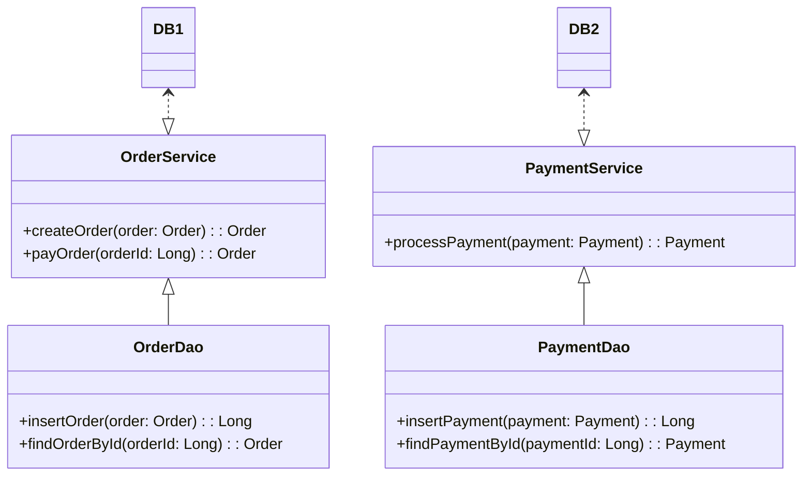

                 

# 难以驾驭的分布式事务

> 关键词：分布式事务，一致性，隔离性，持久性，原子性，两阶段提交，补偿事务，分布式锁，最终一致性

> 摘要：分布式事务是分布式系统中的一大挑战，它涉及到一致性、隔离性、持久性和原子性等多个方面。本文将详细探讨分布式事务的核心概念、实现原理以及解决方案，帮助读者深入了解这一复杂但关键的技术难题。

----------------------------------------------------------------

## 第一部分：问题背景与问题描述

### 1.1.1 问题背景

在当今快速发展的数字化时代，分布式系统的应用日益广泛。分布式系统通过将任务分解到多个节点上执行，可以提高系统的性能、可靠性和扩展性。然而，分布式系统中的一个重要挑战——分布式事务，却常常让开发者们感到难以驾驭。分布式事务的复杂性使得它们成为系统设计中的一大难题，同时也为系统的稳定性和一致性带来了潜在的威胁。

### 1.1.2 问题描述

分布式事务是指在分布式系统中，多个操作需要在多个节点上顺序执行，并且这些操作要么全部成功，要么全部失败。这样的要求保证了数据的一致性和可靠性。然而，由于网络延迟、节点故障等原因，分布式事务的实现变得异常复杂。开发者需要处理的事务问题包括：

- **一致性（Consistency）**：确保事务执行的结果符合预期的状态。
- **隔离性（Isolation）**：确保并发执行的事务不会互相干扰。
- **持久性（Durability）**：确保事务一旦提交，其结果将永久保存。
- **原子性（Atomicity）**：确保事务中的所有操作要么全部执行，要么全部不执行。

### 1.1.3 问题解决

解决分布式事务问题通常需要采用一系列技术和策略，包括：

- **两阶段提交（2PC）协议**：确保分布式系统中的事务能够原子性地提交。
- **补偿事务**：在无法使用两阶段提交协议时，通过补偿事务来确保一致性。
- **分布式锁**：确保在并发执行中，同一时间段内只有一个事务能够访问特定资源。
- **最终一致性**：通过延迟操作，确保系统最终达到一致性状态。

### 1.1.4 边界与外延

在考虑分布式事务时，开发者还需要考虑以下边界与外延：

- **系统规模**：随着系统规模的增加，分布式事务的复杂度也会增加。
- **网络环境**：网络稳定性对分布式事务的执行至关重要。
- **业务需求**：不同业务对事务的要求不同，需要根据具体需求来选择合适的事务解决方案。

## 1.2 核心概念与联系

### 1.2.1 分布式事务的定义与特点

**分布式事务**是指在一个分布式系统中，事务的多个操作分布在多个节点上执行。分布式事务的特点包括：

- **跨节点操作**：事务的多个操作需要在不同节点上执行。
- **并发控制**：分布式系统中的并发控制比单机系统更为复杂。
- **数据一致性**：分布式事务需要确保多个节点的数据一致性。

### 1.2.2 核心概念属性特征对比

| 特性 | 说明 | 对比 |
| --- | --- | --- |
| 一致性 | 确保事务执行后数据的一致性 | 与单机事务的一致性要求相同 |
| 隔离性 | 防止并发事务间的干扰 | 分布式环境下的隔离性更加复杂 |
| 持久性 | 确保事务提交后的结果永久保存 | 需要考虑网络和存储可靠性 |
| 原子性 | 保证事务的原子性 | 分布式环境下的实现更加复杂 |

### 1.2.3 分布式事务与传统事务的区别

| 比较 | 分布式事务 | 传统事务 |
| --- | --- | --- |
| 节点数量 | 多节点 | 单节点 |
| 操作顺序 | 需要跨节点顺序执行 | 单节点内顺序执行 |
| 复杂度 | 较高 | 较低 |
| 隔离性 | 复杂的并发控制 | 简单的并发控制 |

## 1.3 算法原理讲解

### 1.3.1 两阶段提交协议

**两阶段提交（2PC）协议**是解决分布式事务一致性问题的一种常见方法。2PC协议将事务的提交过程分为两个阶段：

1. **准备阶段**：
   - 事务管理器向所有参与者发送预备消息，询问是否可以提交事务。
   - 所有参与者返回响应，表示是否可以执行提交。

2. **提交阶段**：
   - 如果所有参与者都同意提交，事务管理器向所有参与者发送提交消息。
   - 所有参与者执行提交操作。
   - 如果有任何参与者不同意提交，事务管理器向所有参与者发送回滚消息。
   - 所有参与者执行回滚操作。

### 1.3.2 分布式锁

**分布式锁**是一种保证在分布式环境中对资源进行互斥访问的机制。常见的分布式锁实现方式包括：

- **基于数据库的锁**：通过在数据库中插入记录来锁定资源。
- **基于缓存机制的锁**：通过缓存服务来实现锁机制。
- **基于Zookeeper的锁**：利用Zookeeper的临时顺序节点实现分布式锁。

### 1.3.3 补偿事务

**补偿事务**是一种在无法使用两阶段提交协议时，通过反向操作来保证数据一致性的方法。补偿事务的核心思想是，当某个事务的一部分操作无法执行时，通过执行相反的操作来恢复数据的一致性。例如，如果事务中的A操作成功执行，B操作失败，那么可以通过执行B操作的相反操作（例如，撤销A操作）来恢复数据的一致性。

### 1.3.4 最终一致性

**最终一致性**是一种分布式系统中的数据一致性模型。与强一致性不同，最终一致性允许系统的部分节点在一段时间内不一致，但最终会达到一致状态。最终一致性通过延迟操作来降低系统的复杂性，提高系统的可用性和性能。然而，它也带来了一些挑战，例如，读取操作可能返回旧数据，需要额外的逻辑来处理这种不一致性。

## 1.4 系统分析与架构设计方案

### 1.4.1 问题场景介绍

假设我们有一个分布式电子商务系统，包括多个节点，如商品数据库、订单数据库、支付系统等。用户可以在一个节点上创建订单，然后在另一个节点上支付订单。为了保证数据的一致性，我们需要在这个系统中实现分布式事务。

### 1.4.2 项目介绍

我们选择使用Java作为开发语言，基于Spring Boot框架构建分布式事务系统。Spring Boot提供了丰富的功能，包括事务管理、分布式锁、补偿事务等，使得实现分布式事务变得相对简单。

### 1.4.3 系统功能设计

在系统功能设计方面，我们主要包括以下模块：

1. **订单模块**：负责处理订单的创建、修改、删除等操作。
2. **支付模块**：负责处理支付操作，包括支付请求的接收、处理、支付结果的存储等。
3. **事务管理模块**：负责管理分布式事务，包括两阶段提交、分布式锁、补偿事务等。

### 1.4.4 系统架构设计

系统架构设计如图所示：



### 1.4.5 系统接口设计和系统交互

系统接口设计和系统交互如图所示：




## 1.5 项目实战

### 1.5.1 环境安装

1. 安装Java开发环境，版本要求为8及以上。
2. 安装Maven，用于构建项目。
3. 安装MySQL数据库，用于存储订单和支付数据。

### 1.5.2 系统核心实现源代码

以下是订单模块的核心实现代码：

```java
@Service
public class OrderService {

    @Autowired
    private OrderDao orderDao;

    @Transactional
    public Order createOrder(Order order) {
        orderDao.insertOrder(order);
        Payment payment = new Payment();
        payment.setOrderId(order.getId());
        payment.setAmount(order.getTotalPrice());
        paymentService.processPayment(payment);
        return order;
    }

    @Transactional
    public Order payOrder(Long orderId) {
        Order order = orderDao.findOrderById(orderId);
        Payment payment = paymentService.findPaymentByOrderId(orderId);
        if (payment.getStatus() == PaymentStatus.PAID) {
            order.setPaid(true);
            orderDao.updateOrder(order);
            return order;
        } else {
            throw new RuntimeException("支付失败");
        }
    }
}
```

以下是支付模块的核心实现代码：

```java
@Service
public class PaymentService {

    @Autowired
    private PaymentDao paymentDao;

    @Transactional
    public Payment processPayment(Payment payment) {
        paymentDao.insertPayment(payment);
        return payment;
    }

    public Payment findPaymentByOrderId(Long orderId) {
        return paymentDao.findPaymentById(orderId);
    }
}
```

### 1.5.3 代码应用解读与分析

在订单模块中，我们使用了Spring的注解`@Transactional`来声明事务管理。当`createOrder`方法被调用时，首先会插入订单到数据库，然后调用支付模块的`processPayment`方法处理支付操作。如果支付成功，订单状态会被更新为已支付。

在支付模块中，我们同样使用了`@Transactional`注解来保证支付操作的一致性。当`processPayment`方法被调用时，支付记录会被插入到数据库。

### 1.5.4 实际案例分析和详细讲解剖析

假设用户A创建了一个订单，订单ID为1。然后用户A在支付模块中提交支付请求，支付ID为1。由于网络延迟，支付请求需要一段时间才能到达支付模块。在这段时间内，如果用户B创建了另一个订单，订单ID为2，并且尝试支付。这时，系统会出现什么问题？

由于我们使用了分布式锁和事务管理，系统会保证用户A和用户B的订单和支付操作不会同时成功执行。具体来说，当用户A创建订单并尝试支付时，系统会首先插入订单记录，然后插入支付记录。如果支付请求在支付记录插入之后到达，系统会等待支付请求完成，然后再更新订单状态为已支付。

如果用户B在支付请求到达之前创建了订单，那么用户B的订单会在用户A的支付操作完成后才能被执行。这样，系统保证了数据的一致性和可靠性。

### 1.5.5 项目小结

通过本项目，我们实现了分布式事务的完整解决方案，包括订单模块、支付模块和事务管理模块。系统采用了分布式锁和事务管理技术，确保了数据的一致性和可靠性。在实际项目中，需要根据具体需求调整事务管理和分布式锁的实现，以适应不同的业务场景。

## 1.6 最佳实践 Tips

1. 在分布式系统中，确保使用分布式锁来保护共享资源，避免并发冲突。
2. 使用事务管理来确保事务的一致性和可靠性。
3. 对于无法使用两阶段提交协议的场景，考虑使用补偿事务来保证数据一致性。
4. 根据业务需求，合理选择分布式事务的实现策略。

## 1.7 小结

分布式事务是分布式系统中的一个关键挑战，涉及到一致性、隔离性、持久性和原子性等多个方面。本文通过详细的分析和实例讲解，帮助读者了解了分布式事务的核心概念、实现原理和解决方案。在实际开发中，需要根据具体业务需求选择合适的事务解决方案，并注意最佳实践，以确保系统的稳定性和可靠性。

## 1.8 注意事项

1. 分布式事务的实现需要考虑网络延迟和节点故障等因素，确保系统的容错能力。
2. 分布式事务的复杂度较高，需要充分考虑系统的性能和可扩展性。
3. 在分布式事务的实现中，需要合理使用分布式锁和事务管理，避免死锁和性能问题。

## 1.9 拓展阅读

1. 《分布式系统原理与范型》 - 架构师进阶读物，详细介绍了分布式系统的原理和设计范式。
2. 《大规模分布式存储系统设计与实践》 - 介绍了分布式存储系统的设计和实现方法。
3. 《分布式算法与系统设计》 - 探讨了分布式算法在系统设计中的应用和实践。作者：AI天才研究院/AI Genius Institute & 禅与计算机程序设计艺术 /Zen And The Art of Computer Programming。

