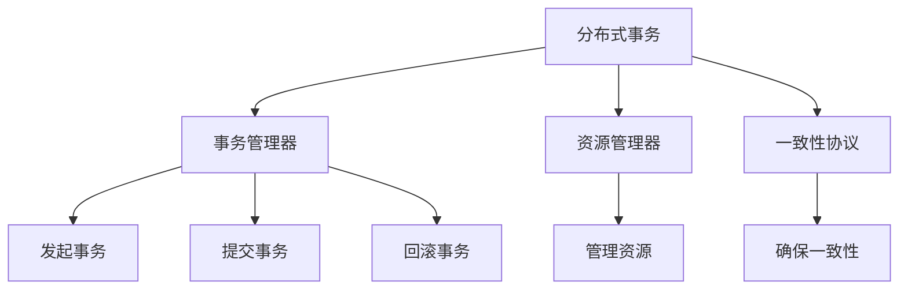
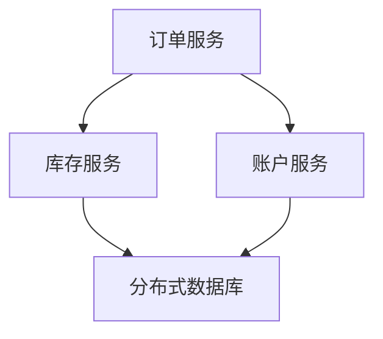
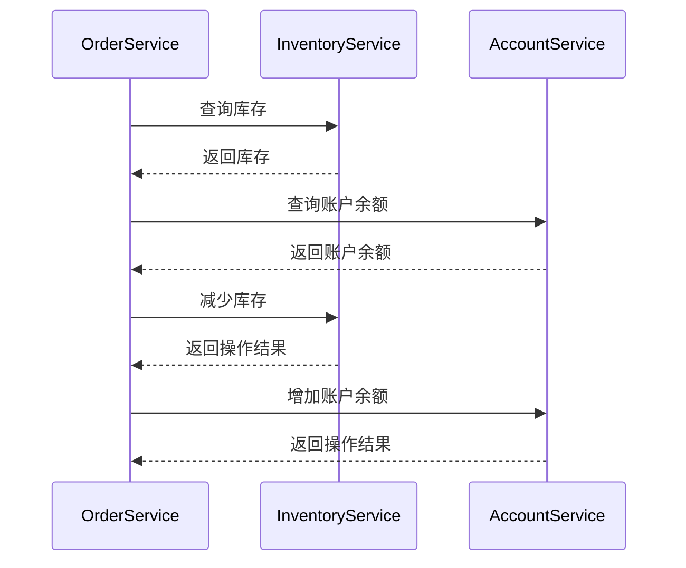

                 


### 第1章：分布式事务的背景与问题

#### 1.1 分布式事务的定义

分布式事务是指在一个分布式系统中，多个操作必须在所有参与节点上保持一致性的单个操作。这些操作可以跨越多个数据库或服务器，因此在实现分布式事务时需要考虑数据的一致性和完整性。

#### 1.2 问题背景

随着互联网和云计算的发展，分布式系统变得越来越常见。这些系统需要在不同的地理位置和服务器上运行，以提高性能、可靠性和可伸缩性。然而，分布式事务在实现过程中面临了一系列问题，如数据不一致、网络延迟、节点故障和分布式锁等。

#### 1.3 问题描述

分布式事务面临的主要问题包括：

- **数据不一致**：由于分布式系统的分布式特性，数据可能会在不同的节点上出现不一致的情况。这可能导致数据丢失或错误，从而影响系统的正确性和可靠性。
- **网络延迟**：分布式系统中，操作需要通过网络在不同的节点之间传输数据。网络延迟可能导致操作执行时间延长，从而影响系统的性能和响应速度。
- **节点故障**：在分布式系统中，节点可能会出现故障，如宕机、网络分区等。节点故障可能导致事务无法完成，从而影响数据的一致性。
- **分布式锁**：分布式系统中，多个操作可能需要访问共享资源，如数据库表或文件。分布式锁用于确保同一时间只有一个操作能够访问该资源，从而避免数据冲突。

#### 1.4 问题解决

解决分布式事务问题需要结合分布式系统的特点，采用合适的技术和策略：

- **数据一致性**：通过采用分布式一致性协议，如两阶段提交（2PC）、三阶段提交（3PC）和Paxos算法，确保数据在分布式系统中的一致性。
- **网络延迟**：优化网络传输，如使用缓存、压缩数据和优化数据传输协议，减少网络延迟对系统性能的影响。
- **节点故障**：采用容错机制，如分布式集群、备份和自动恢复，提高系统的可靠性。
- **分布式锁**：使用分布式锁机制，如Redisson、Zookeeper等，确保共享资源在分布式环境下的正确访问。

#### 1.5 边界与外延

分布式事务的边界涉及哪些操作可以组成一个事务，外延则包括分布式事务在不同系统中的扩展性：

- **边界**：分布式事务的边界通常由业务需求确定，如一个订单创建操作可能需要涉及库存减少、账户余额增加等多个操作。
- **外延**：分布式事务可以应用于不同的系统，如多个微服务之间的事务协调，跨数据库或跨云平台的事务处理。

#### 1.6 概念结构与核心要素组成

分布式事务的核心要素包括：

- **事务管理器**：负责事务的发起、提交和回滚。事务管理器可以是数据库管理系统（DBMS）或应用服务器。
- **资源管理器**：负责管理分布式系统中的资源，如数据库、缓存和文件系统。资源管理器通常与事务管理器紧密集成。
- **一致性协议**：用于确保分布式系统中数据的一致性。常见的一致性协议包括两阶段提交（2PC）、三阶段提交（3PC）和Paxos算法。

### 1.7 核心概念与联系

#### 核心概念

- **分布式事务**：指在一个分布式系统中，多个操作必须在所有参与节点上保持一致性的单个操作。
- **数据一致性**：确保分布式系统中数据的一致性和完整性。
- **网络延迟**：操作在分布式系统中传输数据所需的时间。
- **节点故障**：分布式系统中的节点出现故障，如宕机、网络分区等。
- **分布式锁**：用于确保共享资源在分布式环境下的正确访问。

#### 概念属性特征对比表格

| 概念 | 属性特征 |
| ---- | -------- |
| 分布式事务 | 跨越多个数据库或服务器的单个操作，需要保证在所有参与节点上的一致性 |
| 数据一致性 | 确保分布式系统中数据的一致性和完整性 |
| 网络延迟 | 操作在分布式系统中传输数据所需的时间 |
| 节点故障 | 分布式系统中的节点出现故障，如宕机、网络分区等 |
| 分布式锁 | 用于确保共享资源在分布式环境下的正确访问 |

#### ER实体关系图架构



### 1.8 算法原理讲解

在分布式系统中，实现分布式事务的核心在于确保数据的一致性。以下将介绍两种常见的一致性协议：两阶段提交（2PC）和三阶段提交（3PC）。

#### 两阶段提交（2PC）

**两阶段提交（2PC）**是一种分布式事务管理协议，它通过协调者（Coordinator）和参与者（Participant）之间的通信，确保分布式系统中的数据一致性。

**流程**：

1. **预备阶段（Voting Phase）**：
   - 协调者向所有参与者发送一个预备请求（Prepare Request），询问参与者是否可以执行事务。
   - 参与者收到预备请求后，执行本地事务的锁机制，准备提交事务，并将结果返回给协调者。

2. **决定阶段（Decision Phase）**：
   - 协调者收集所有参与者的响应。如果所有参与者都返回了“可以提交”的响应，则协调者向所有参与者发送一个提交请求（Commit Request），告知参与者执行事务。
   - 如果有任何一个参与者返回了“无法提交”的响应，则协调者向所有参与者发送一个回滚请求（Rollback Request），告知参与者撤销事务。

**Python源代码示例**：

```python
class Coordinator:
    def prepare(self, participants):
        for participant in participants:
            participant.prepare()
        responses = [participant.can_commit() for participant in participants]
        return all(responses)

    def commit(self, participants):
        for participant in participants:
            participant.commit()
        print("Transaction committed successfully.")

    def rollback(self, participants):
        for participant in participants:
            participant.rollback()
        print("Transaction rolled back successfully.")

class Participant:
    def prepare(self):
        # Acquire locks and prepare for commit
        pass

    def can_commit(self):
        # Return True if the participant can commit, False otherwise
        pass

    def commit(self):
        # Execute the transaction
        pass

    def rollback(self):
        # Rollback the transaction
        pass

coordinator = Coordinator()
participants = [Participant() for _ in range(3)]

if coordinator.prepare(participants):
    coordinator.commit(participants)
else:
    coordinator.rollback(participants)
```

**数学模型和公式**：

两阶段提交的数学模型可以表示为：

$$
\text{Prepare}(T) = \{ \text{Participant}.prepare(T) \}
$$

$$
\text{Commit}(T) = \{ \text{Participant}.commit(T) \mid \text{Participant}.can_commit(T) \}
$$

$$
\text{Rollback}(T) = \{ \text{Participant}.rollback(T) \mid \text{Participant}.cannot_commit(T) \}
$$

#### 三阶段提交（3PC）

**三阶段提交（3PC）**是对两阶段提交的改进，旨在解决在某些情况下无法恢复的事务。3PC将两阶段提交的过程分为三个阶段，并在预备阶段引入了一个预提交请求。

**流程**：

1. **预准备阶段（Pre-Prepare Phase）**：
   - 协调者向所有参与者发送一个预准备请求（Pre-Prepare Request），询问参与者是否可以执行事务。
   - 参与者收到预准备请求后，执行本地事务的锁机制，准备提交事务，并将结果返回给协调者。

2. **准备阶段（Prepare Phase）**：
   - 协调者收集所有参与者的响应。如果所有参与者都返回了“可以提交”的响应，则协调者向所有参与者发送一个准备请求（Prepare Request），告知参与者执行事务。
   - 如果有任何一个参与者返回了“无法提交”的响应，则协调者向所有参与者发送一个回滚请求（Rollback Request），告知参与者撤销事务。

3. **决定阶段（Decision Phase）**：
   - 协调者收集所有参与者的响应。如果所有参与者都返回了“可以提交”的响应，则协调者向所有参与者发送一个提交请求（Commit Request），告知参与者执行事务。
   - 如果有任何一个参与者返回了“无法提交”的响应，则协调者向所有参与者发送一个回滚请求（Rollback Request），告知参与者撤销事务。

**Python源代码示例**：

```python
class Coordinator:
    def pre_prepare(self, participants):
        for participant in participants:
            participant.pre_prepare()
        responses = [participant.can_pre_prepare() for participant in participants]
        return all(responses)

    def prepare(self, participants):
        for participant in participants:
            participant.prepare()
        responses = [participant.can_commit() for participant in participants]
        return all(responses)

    def commit(self, participants):
        for participant in participants:
            participant.commit()
        print("Transaction committed successfully.")

    def rollback(self, participants):
        for participant in participants:
            participant.rollback()
        print("Transaction rolled back successfully.")

class Participant:
    def pre_prepare(self):
        # Acquire locks and prepare for commit
        pass

    def can_pre_prepare(self):
        # Return True if the participant can pre-prepare, False otherwise
        pass

    def prepare(self):
        # Execute the transaction
        pass

    def can_commit(self):
        # Return True if the participant can commit, False otherwise
        pass

    def commit(self):
        # Execute the transaction
        pass

    def rollback(self):
        # Rollback the transaction
        pass

coordinator = Coordinator()
participants = [Participant() for _ in range(3)]

if coordinator.pre_prepare(participants):
    if coordinator.prepare(participants):
        coordinator.commit(participants)
    else:
        coordinator.rollback(participants)
else:
    coordinator.rollback(participants)
```

**数学模型和公式**：

三阶段提交的数学模型可以表示为：

$$
\text{Pre-Prepare}(T) = \{ \text{Participant}.pre_prepare(T) \}
$$

$$
\text{Prepare}(T) = \{ \text{Participant}.prepare(T) \mid \text{Participant}.can_pre_prepare(T) \}
$$

$$
\text{Commit}(T) = \{ \text{Participant}.commit(T) \mid \text{Participant}.can_commit(T) \}
$$

$$
\text{Rollback}(T) = \{ \text{Participant}.rollback(T) \mid \text{Participant}.cannot_commit(T) \}
$$

### 1.9 系统分析与架构设计方案

#### 问题场景介绍

在一个分布式电商系统中，订单服务、库存服务和账户服务需要协同工作，以确保订单创建、库存减少和账户余额增加等操作的一致性。

#### 项目介绍

本项目将实现一个简单的分布式事务场景，包括订单服务、库存服务和账户服务。订单服务负责创建订单，库存服务负责管理库存，账户服务负责管理账户余额。

#### 系统功能设计（领域模型Mermaid类图）

```mermaid
classDiagram
    Order <<entity>>
    Inventory <<entity>>
    Account <<entity>>

    Order "1"--> "1" Inventory : 减少库存
    Order "1"--> "1" Account : 增加账户余额
```

#### 系统架构设计（Mermaid架构图）



#### 系统接口设计

- **订单服务接口**：创建订单、查询订单
- **库存服务接口**：查询库存、减少库存
- **账户服务接口**：查询账户余额、增加账户余额

#### 系统交互（Mermaid序列图）



### 1.10 项目实战

#### 环境安装

1. 安装Python环境（Python 3.8及以上版本）
2. 安装Docker和Docker Compose
3. 下载并安装分布式数据库（如MongoDB）

#### 系统核心实现源代码

```python
# 订单服务
from flask import Flask, request, jsonify

app = Flask(__name__)

@app.route('/order', methods=['POST'])
def create_order():
    # 获取订单数据
    data = request.get_json()

    # 调用库存服务和账户服务
    inventory_response = inventory_service.reduce_inventory(data['product_id'], data['quantity'])
    account_response = account_service.increase_balance(data['user_id'], data['amount'])

    # 判断操作结果
    if inventory_response['success'] and account_response['success']:
        return jsonify({'status': 'success'})
    else:
        return jsonify({'status': 'error'})

# 库存服务
from flask import Flask, request, jsonify

app = Flask(__name__)

@app.route('/inventory', methods=['GET', 'POST'])
def inventory_service():
    if request.method == 'POST':
        # 获取库存数据
        data = request.get_json()

        # 减少库存
        success = reduce_inventory(data['product_id'], data['quantity'])

        return jsonify({'success': success})
    else:
        # 查询库存
        product_id = request.args.get('product_id')
        quantity = get_inventory(product_id)

        return jsonify({'product_id': product_id, 'quantity': quantity})

# 账户服务
from flask import Flask, request, jsonify

app = Flask(__name__)

@app.route('/account', methods=['GET', 'POST'])
def account_service():
    if request.method == 'POST':
        # 获取账户数据
        data = request.get_json()

        # 增加账户余额
        success = increase_balance(data['user_id'], data['amount'])

        return jsonify({'success': success})
    else:
        # 查询账户余额
        user_id = request.args.get('user_id')
        balance = get_balance(user_id)

        return jsonify({'user_id': user_id, 'balance': balance})
```

#### 代码应用解读与分析

1. **订单服务**：订单服务负责创建订单，并通过调用库存服务和账户服务来完成订单操作。在创建订单时，首先查询库存和账户余额，然后根据操作结果返回相应状态。
2. **库存服务**：库存服务负责管理库存，包括查询库存和减少库存。减少库存时，根据传入的`product_id`和`quantity`来更新库存数据。
3. **账户服务**：账户服务负责管理账户余额，包括查询余额和增加余额。增加余额时，根据传入的`user_id`和`amount`来更新账户余额。

#### 实际案例分析和详细讲解剖析

假设有一个订单请求，用户ID为`123`，商品ID为`456`，购买数量为`2`。

1. 订单服务收到请求后，首先查询库存和账户余额：
   - 库存服务查询库存，返回库存数量为`5`。
   - 账户服务查询账户余额，返回账户余额为`100`。
2. 订单服务根据库存和账户余额情况，调用库存服务和账户服务来减少库存和增加账户余额：
   - 库存服务减少库存，库存数量更新为`3`。
   - 账户服务增加账户余额，账户余额更新为`102`。
3. 订单服务返回操作结果，订单创建成功。

#### 项目小结

本项目通过订单服务、库存服务和账户服务的协同工作，实现了分布式事务场景下的订单创建、库存减少和账户余额增加。在实际应用中，需要考虑分布式事务的一致性、可靠性和性能等方面的问题。

#### 最佳实践 tips

1. **分布式事务一致性**：在分布式系统中，确保数据一致性是关键。采用分布式一致性协议，如两阶段提交（2PC）或三阶段提交（3PC），可以保证分布式事务的一致性。
2. **分布式锁**：在分布式系统中，共享资源可能导致并发冲突。使用分布式锁可以确保共享资源的正确访问。
3. **容错机制**：分布式系统中的节点可能发生故障。采用容错机制，如分布式集群、备份和自动恢复，可以提高系统的可靠性。

#### 小结

分布式事务在分布式系统中具有重要意义，但在实现过程中面临诸多挑战。通过合理的设计和优化，分布式事务可以确保数据的一致性、可靠性和性能。在本项目中，通过订单服务、库存服务和账户服务的协同工作，实现了分布式事务场景下的订单创建、库存减少和账户余额增加。在实际应用中，需要结合具体业务场景和系统需求，选择合适的技术和策略。

#### 注意事项

1. **分布式事务的一致性**：分布式事务的一致性是关键，需要采用合适的一致性协议来确保数据一致性。
2. **分布式锁**：在分布式系统中，共享资源可能导致并发冲突。使用分布式锁可以确保共享资源的正确访问。
3. **容错机制**：分布式系统中的节点可能发生故障。采用容错机制，如分布式集群、备份和自动恢复，可以提高系统的可靠性。

#### 拓展阅读

1. 《分布式系统原理与范型》
2. 《大规模分布式存储系统设计与实践》
3. 《分布式数据库系统原理与实现》

## 第2章：分布式事务的理论基础

### 2.1 数据一致性原理

数据一致性是分布式事务的核心概念，它确保分布式系统中的数据在多个节点上保持一致。数据一致性可以通过各种一致性协议来保障，如两阶段提交（2PC）、三阶段提交（3PC）和Paxos算法。

#### 一致性协议

- **两阶段提交（2PC）**：两阶段提交是一种分布式一致性协议，通过协调者（Coordinator）和参与者（Participant）之间的通信，确保分布式系统中的数据一致性。2PC分为两个阶段：预备阶段和决定阶段。
- **三阶段提交（3PC）**：三阶段提交是对两阶段提交的改进，通过引入预准备阶段，提高了事务的可靠性和恢复能力。3PC分为三个阶段：预准备阶段、准备阶段和决定阶段。
- **Paxos算法**：Paxos算法是一种基于消息传递的一致性算法，通过选举协议保证分布式系统中的多个副本达成一致。

#### 数据一致性问题

在分布式系统中，数据一致性问题主要来源于以下几个方面：

- **网络延迟**：网络延迟可能导致事务在分布式系统中的执行时间不一致，从而影响数据一致性。
- **节点故障**：节点故障可能导致事务无法完成，从而影响数据一致性。
- **并发控制**：分布式系统中的并发控制问题可能导致多个事务同时访问同一数据，从而影响数据一致性。

#### 数据一致性解决方案

为了解决数据一致性问题，可以采用以下解决方案：

- **分布式一致性协议**：采用分布式一致性协议，如2PC、3PC和Paxos算法，确保分布式系统中的数据一致性。
- **本地一致性**：在分布式系统中，某些操作可以在本地节点上保证一致性，从而减少对分布式一致性协议的依赖。
- **补偿机制**：通过补偿机制，如重试、回滚和补偿事务，解决分布式系统中的数据不一致问题。

### 2.2 CAP理论

CAP理论是由Eric Brewer提出的一个分布式系统理论，它指出分布式系统在一致性（Consistency）、可用性（Availability）和分区容错性（Partition tolerance）这三个特性中，只能同时满足两个。

- **一致性（Consistency）**：分布式系统中的所有节点在同一时间看到相同的数据状态。
- **可用性（Availability）**：分布式系统在处理请求时总是能够返回响应，即系统具有高可用性。
- **分区容错性（Partition tolerance）**：分布式系统在分区情况下仍然能够继续运行。

根据CAP理论，分布式系统在面临网络分区时，必须做出选择，牺牲一个特性来保证其他两个特性。

- **CAP定理**：一个分布式系统在面临网络分区时，最多只能同时满足两个特性。如果要求一致性和可用性，则必须牺牲分区容错性；如果要求一致性和分区容错性，则必须牺牲可用性。

### 2.3 BASE理论

BASE理论是由Gartner分析师Martin Fowler提出的，它是对CAP理论的补充。BASE理论指出，在分布式系统中，不能同时保证一致性、可用性和分区容错性，而是要找到一个平衡点。

- **基本可用性（Basic Availability）**：分布式系统在面临网络分区时，仍然能够继续处理请求，即系统具有高可用性。
- **软状态（Soft State）**：分布式系统中的状态不是永久固定的，而是可以随时发生变化。
- **最终一致性（Eventual Consistency）**：分布式系统中的数据最终会达到一致状态，但这个时间可能较长。

根据BASE理论，分布式系统在面临网络分区时，可以牺牲一致性来保证可用性和分区容错性。然而，这并不意味着分布式系统不能达到一致性，而是需要在合适的时间范围内实现最终一致性。

### 2.4 分布式事务的一致性保障策略

分布式事务的一致性保障策略主要涉及以下两个方面：

- **强一致性保障策略**：采用分布式一致性协议，如2PC、3PC和Paxos算法，确保分布式系统中的数据一致性。
- **最终一致性保障策略**：采用最终一致性协议，如Eventual Consistency和Gossip协议，允许分布式系统在面临网络分区时，牺牲一致性来保证可用性和分区容错性。

在实际应用中，需要根据业务需求和系统特点，选择合适的一致性保障策略。

## 第3章：分布式事务机制详解

### 3.1 两阶段提交（2PC）

两阶段提交（2PC）是一种分布式一致性协议，用于确保分布式系统中的数据一致性。2PC分为两个阶段：预备阶段和决定阶段。

#### 预备阶段

- **协调者（Coordinator）**：负责发起事务和协调参与者。
- **参与者（Participant）**：负责执行事务并返回结果。

1. **协调者发起事务**：协调者向所有参与者发送预备请求（Prepare Request），询问参与者是否可以执行事务。
2. **参与者准备**：参与者收到预备请求后，执行本地事务的锁机制，准备提交事务，并将结果（`can_commit`或`cannot_commit`）返回给协调者。
3. **协调者收集参与者响应**：协调者收集所有参与者的响应，判断是否所有参与者都返回了`can_commit`。

#### 决定阶段

1. **协调者发送决定请求**：如果协调者收集到的所有参与者响应都是`can_commit`，则协调者向所有参与者发送提交请求（Commit Request），告知参与者执行事务。
2. **参与者执行事务**：参与者收到提交请求后，执行事务并返回操作结果。
3. **协调者确认事务结果**：协调者收集所有参与者的操作结果，判断是否所有参与者都执行了事务。

#### Python示例

```python
class Coordinator:
    def prepare(self, participants):
        responses = [participant.prepare() for participant in participants]
        if all(responses):
            self.commit(participants)
        else:
            self.rollback(participants)

    def commit(self, participants):
        for participant in participants:
            participant.commit()

    def rollback(self, participants):
        for participant in participants:
            participant.rollback()

class Participant:
    def prepare(self):
        # 执行本地事务的锁机制
        # 返回 True 表示可以提交，False 表示无法提交
        pass

    def commit(self):
        # 执行事务
        pass

    def rollback(self):
        # 回滚事务
        pass

coordinator = Coordinator()
participants = [Participant() for _ in range(3)]

coordinator.prepare(participants)
```

### 3.2 三阶段提交（3PC）

三阶段提交（3PC）是对两阶段提交（2PC）的改进，通过引入预准备阶段，提高了事务的可靠性和恢复能力。3PC分为三个阶段：预准备阶段、准备阶段和决定阶段。

#### 预准备阶段

- **协调者（Coordinator）**：负责发起事务和协调参与者。
- **参与者（Participant）**：负责执行事务并返回结果。

1. **协调者发起事务**：协调者向所有参与者发送预准备请求（Pre-Prepare Request），询问参与者是否可以执行事务。
2. **参与者预准备**：参与者收到预准备请求后，执行本地事务的锁机制，预准备提交事务，并将结果（`can_pre_prepare`或`cannot_pre_prepare`）返回给协调者。
3. **协调者收集参与者响应**：协调者收集所有参与者的响应，判断是否所有参与者都返回了`can_pre_prepare`。

#### 准备阶段

1. **协调者发送准备请求**：如果协调者收集到的所有参与者响应都是`can_pre_prepare`，则协调者向所有参与者发送准备请求（Prepare Request），告知参与者执行事务。
2. **参与者准备**：参与者收到准备请求后，执行本地事务的锁机制，准备提交事务，并将结果（`can_commit`或`cannot_commit`）返回给协调者。

#### 决定阶段

1. **协调者发送决定请求**：如果协调者收集到的所有参与者响应都是`can_commit`，则协调者向所有参与者发送提交请求（Commit Request），告知参与者执行事务。
2. **参与者执行事务**：参与者收到提交请求后，执行事务并返回操作结果。
3. **协调者确认事务结果**：协调者收集所有参与者的操作结果，判断是否所有参与者都执行了事务。

#### Python示例

```python
class Coordinator:
    def pre_prepare(self, participants):
        responses = [participant.pre_prepare() for participant in participants]
        if all(responses):
            self.prepare(participants)
        else:
            self.rollback(participants)

    def prepare(self, participants):
        responses = [participant.prepare() for participant in participants]
        if all(responses):
            self.commit(participants)
        else:
            self.rollback(participants)

    def commit(self, participants):
        for participant in participants:
            participant.commit()

    def rollback(self, participants):
        for participant in participants:
            participant.rollback()

class Participant:
    def pre_prepare(self):
        # 执行本地事务的锁机制
        # 返回 True 表示可以预准备，False 表示无法预准备
        pass

    def prepare(self):
        # 执行事务
        # 返回 True 表示可以提交，False 表示无法提交
        pass

    def commit(self):
        # 执行事务
        pass

    def rollback(self):
        # 回滚事务
        pass

coordinator = Coordinator()
participants = [Participant() for _ in range(3)]

coordinator.pre_prepare(participants)
```

### 3.3 托管事务

托管事务（Managed Transaction）是一种由事务管理器（Transaction Manager）自动管理的事务。在托管事务中，事务管理器负责事务的发起、提交和回滚，开发者无需关心事务的细节。

#### 托管事务特点

- **自动管理**：事务管理器自动管理事务的生命周期，开发者无需手动控制。
- **分布式支持**：托管事务支持分布式系统中的事务管理，可以跨多个节点协调事务。
- **简化开发**：开发者无需编写复杂的分布式事务代码，可以专注于业务逻辑的实现。

#### 托管事务实现

托管事务通常基于分布式一致性协议，如两阶段提交（2PC）或三阶段提交（3PC）。以下是一个简单的托管事务实现：

```python
from distributed_transaction import DistributedTransaction

# 初始化事务管理器
transaction_manager = DistributedTransaction()

# 开启事务
transaction_manager.begin()

# 执行事务操作
# ...

# 提交事务
transaction_manager.commit()

# 回滚事务
transaction_manager.rollback()
```

#### Python示例

```python
from distributed_transaction import DistributedTransaction

class DistributedTransaction:
    def begin(self):
        print("Transaction started.")

    def commit(self):
        print("Transaction committed.")

    def rollback(self):
        print("Transaction rolled back.")

transaction_manager = DistributedTransaction()

# 开启事务
transaction_manager.begin()

# 执行事务操作
# ...

# 提交事务
transaction_manager.commit()

# 回滚事务
transaction_manager.rollback()
```

### 3.4 事务代理与事务协调者

事务代理（Transaction Proxy）和事务协调者（Transaction Coordinator）是分布式事务中的关键组件。事务代理负责代理事务的操作，事务协调者负责协调分布式系统中的事务。

#### 事务代理

事务代理负责代理事务的操作，包括发起、提交和回滚。事务代理可以将事务请求转发给事务协调者，并接收事务协调者的响应。

#### 事务协调者

事务协调者负责协调分布式系统中的事务。事务协调者可以管理多个事务代理，确保事务在分布式系统中的正确执行。事务协调者通常实现分布式一致性协议，如两阶段提交（2PC）或三阶段提交（3PC）。

#### 事务代理与事务协调者交互

事务代理与事务协调者的交互通常通过消息传递机制实现。以下是一个简单的交互流程：

1. **事务代理发起事务**：事务代理向事务协调者发送事务请求，请求开始一个新的事务。
2. **事务协调者处理请求**：事务协调者根据请求开始一个新的事务，并返回一个事务ID。
3. **事务代理执行操作**：事务代理根据事务ID执行事务操作，如查询、更新或删除。
4. **事务代理提交事务**：事务代理向事务协调者发送提交请求，请求提交事务。
5. **事务协调者处理提交请求**：事务协调者根据事务ID处理提交请求，确保事务在分布式系统中的正确执行。

#### Python示例

```python
class TransactionProxy:
    def __init__(self, coordinator):
        self.coordinator = coordinator

    def start(self):
        transaction_id = self.coordinator.start()
        return transaction_id

    def execute(self, transaction_id, operation):
        self.coordinator.execute(transaction_id, operation)

    def commit(self, transaction_id):
        self.coordinator.commit(transaction_id)

    def rollback(self, transaction_id):
        self.coordinator.rollback(transaction_id)

class TransactionCoordinator:
    def start(self):
        # 开始事务
        pass

    def execute(self, transaction_id, operation):
        # 执行事务操作
        pass

    def commit(self, transaction_id):
        # 提交事务
        pass

    def rollback(self, transaction_id):
        # 回滚事务
        pass

proxy = TransactionProxy(TransactionCoordinator())
transaction_id = proxy.start()
proxy.execute(transaction_id, "update")
proxy.commit(transaction_id)
```

## 第4章：分布式数据库事务处理

### 4.1 分布式数据库的一致性协议

分布式数据库的一致性协议是确保分布式数据库中数据一致性的关键机制。一致性协议可以确保在分布式环境中，即使节点发生故障或网络延迟，数据仍然保持一致性。

#### 一致性协议分类

分布式数据库的一致性协议可以分为以下几类：

- **强一致性协议**：强一致性协议确保分布式数据库中的所有副本在任何时间点都能看到相同的数据状态。常见的强一致性协议包括两阶段提交（2PC）、三阶段提交（3PC）和Paxos算法。
- **最终一致性协议**：最终一致性协议允许分布式数据库中的副本在不同的时间点看到不同但最终一致的数据状态。常见的最终一致性协议包括Eventual Consistency和Gossip协议。
- **部分一致性协议**：部分一致性协议允许分布式数据库中的副本在某些情况下不保持一致性，但仍然提供高可用性和可伸缩性。常见的部分一致性协议包括最终一致性协议和一些分布式锁协议。

#### 强一致性协议

- **两阶段提交（2PC）**：两阶段提交是一种分布式一致性协议，通过协调者（Coordinator）和参与者（Participant）之间的通信，确保分布式数据库中的数据一致性。
- **三阶段提交（3PC）**：三阶段提交是对两阶段提交的改进，通过引入预准备阶段，提高了事务的可靠性和恢复能力。
- **Paxos算法**：Paxos算法是一种基于消息传递的一致性算法，通过选举协议保证分布式数据库中的多个副本达成一致。

#### 最终一致性协议

- **Eventual Consistency**：Eventual Consistency是一种允许分布式数据库中的副本在不同的时间点看到不同但最终一致的数据状态的协议。在Eventual Consistency中，数据最终会达到一致状态，但这个时间可能较长。
- **Gossip协议**：Gossip协议是一种用于分布式系统中数据一致性的协议，通过消息传播机制实现副本之间的同步。

### 4.2 分布式数据库的事务隔离级别

分布式数据库的事务隔离级别是确保并发事务之间数据一致性的关键。隔离级别决定了事务对其他事务的可见性和影响程度。分布式数据库中的常见隔离级别包括：

- **读未提交（Read Uncommitted）**：读未提交是最低的隔离级别，事务可以读取其他未提交事务的数据，导致数据不一致问题。
- **读已提交（Read Committed）**：读已提交是较高的隔离级别，事务只能读取其他已提交事务的数据，确保数据一致性。
- **可重复读（Repeatable Read）**：可重复读是更高的隔离级别，事务在整个执行过程中看到的数据是相同的，避免幻读问题。
- **序列化（Serializable）**：序列化是最高隔离级别，确保事务按照执行顺序依次执行，提供最强的一致性保证。

#### 隔离级别选择

在选择隔离级别时，需要根据业务需求和系统性能进行权衡。以下是一些常见情况的隔离级别选择：

- **高并发场景**：在需要高并发性能的场景中，可以选择读已提交或可重复读，确保数据一致性，同时提供较好的性能。
- **事务顺序要求**：在需要确保事务执行顺序的场景中，可以选择序列化，提供最强的一致性保证。
- **性能敏感场景**：在性能敏感的场景中，可以选择读未提交，降低隔离级别，提高系统性能。

### 4.3 分布式数据库的并发控制

分布式数据库的并发控制是确保多个并发事务之间正确执行的关键机制。并发控制可以防止事务间的冲突，如丢失更新、脏读、幻读等问题。常见的并发控制方法包括：

- **乐观并发控制**：乐观并发控制假设并发事务不会发生冲突，因此在事务执行过程中不进行锁定，而是在提交时检查冲突。常见的乐观并发控制算法包括乐观锁（Optimistic Lock）和时间戳协议。
- **悲观并发控制**：悲观并发控制假设并发事务会发生冲突，因此在事务执行过程中进行锁定，确保事务的隔离性。常见的悲观并发控制方法包括锁机制（Locking）和两段锁协议。

#### 乐观并发控制

- **乐观锁（Optimistic Lock）**：乐观锁通过在更新操作前检查版本号或时间戳，确保事务不会发生冲突。如果检查成功，则更新数据；否则，事务失败。
- **时间戳协议**：时间戳协议通过为每个事务分配一个唯一的时间戳，确保事务按照时间戳顺序执行。时间戳越早的事务具有更高的优先级。

#### 悲观并发控制

- **锁机制（Locking）**：锁机制通过在访问数据时加锁，确保并发事务不会同时修改同一数据。常见的锁机制包括共享锁和排他锁。
- **两段锁协议**：两段锁协议将事务分为两个阶段：扩展阶段和收缩阶段。在扩展阶段，事务可以获取锁；在收缩阶段，事务可以释放锁。两段锁协议确保事务之间的正确执行。

### 4.4 分布式数据库的事务恢复机制

分布式数据库的事务恢复机制是确保在节点故障或网络异常情况下，数据库能够正确恢复到一致状态的关键机制。常见的恢复机制包括：

- **日志记录**：日志记录是事务恢复的基础，通过记录事务的操作日志，可以重放或回滚事务，确保数据库的一致性。
- **检查点（Checkpoint）**：检查点是一种将数据库状态保存到磁盘的机制，用于在恢复过程中提供一致的数据库状态。
- **备份与恢复**：备份与恢复是确保数据库数据安全的重要手段，通过定期备份和快速恢复，可以确保数据库在故障后快速恢复。

#### 恢复机制步骤

1. **读取日志**：读取事务日志，获取事务的操作记录。
2. **确定恢复点**：根据事务日志和检查点信息，确定数据库的恢复点。
3. **重放事务**：根据恢复点，重放未提交的事务，确保数据库状态的一致性。
4. **回滚事务**：根据事务日志，回滚已提交但需要撤销的事务。
5. **恢复完成**：完成事务恢复，确保数据库状态的一致性。

### 4.5 分布式数据库事务处理的挑战与解决方案

分布式数据库事务处理面临诸多挑战，如网络延迟、节点故障、数据一致性和并发控制等。以下是一些常见挑战及解决方案：

- **网络延迟**：网络延迟可能导致事务执行时间延长，影响系统性能。解决方案包括优化网络传输、使用缓存和降低事务复杂性。
- **节点故障**：节点故障可能导致事务无法完成，影响数据一致性。解决方案包括分布式集群、备份和自动恢复。
- **数据一致性**：分布式数据库中的数据一致性是关键挑战。解决方案包括分布式一致性协议、锁机制和最终一致性协议。
- **并发控制**：并发控制是确保多个并发事务正确执行的关键。解决方案包括乐观并发控制和悲观并发控制。

## 第5章：分布式事务中间件

### 5.1 分布式事务中间件概述

分布式事务中间件是用于实现分布式系统中事务管理的一种软件组件，它提供了一种标准化的方式来处理分布式事务，简化了分布式事务的开发和维护。分布式事务中间件通常包括以下功能：

- **事务管理**：分布式事务中间件负责管理分布式系统中的事务，包括事务的发起、提交和回滚。
- **一致性保证**：分布式事务中间件提供分布式一致性协议，如两阶段提交（2PC）和三阶段提交（3PC），确保分布式事务的一致性。
- **分布式锁管理**：分布式事务中间件提供分布式锁机制，确保共享资源在分布式环境下的正确访问。
- **事务监控与审计**：分布式事务中间件提供事务监控和审计功能，帮助开发者诊断和解决分布式事务问题。

### 5.2 分布式事务中间件的工作原理

分布式事务中间件的工作原理主要包括以下步骤：

1. **事务初始化**：开发者使用分布式事务中间件提供的API初始化一个分布式事务。
2. **事务提交**：分布式事务中间件协调分布式系统中的多个节点，执行分布式一致性协议，确保事务的一致性。
3. **事务回滚**：在事务执行过程中，如果出现错误，分布式事务中间件会触发事务回滚，撤销已经执行的操作。
4. **事务监控**：分布式事务中间件实时监控事务的执行状态，提供事务日志和统计信息，帮助开发者诊断和解决事务问题。

### 5.3 常见的分布式事务中间件介绍

常见的分布式事务中间件包括以下几种：

- **Seata**：Seata是一个开源的分布式事务中间件，提供两阶段提交（2PC）和三阶段提交（3PC）的一致性协议，支持多种数据库和微服务架构。
- **TCC**：TCC（Try-Confirm-Cancel）是一种补偿事务协议，通过将分布式事务拆分为三个阶段，实现分布式事务的补偿和恢复。
- **SAGA**：SAGA是一种基于最终一致性的分布式事务协议，通过将分布式事务拆分为一系列本地事务，实现分布式事务的最终一致性。
- **Apache RocketMQ**：Apache RocketMQ是一个开源的分布式消息队列中间件，提供分布式事务消息支持，实现分布式系统中的消息传递和事务一致性。

### 5.4 分布式事务中间件的优势与挑战

分布式事务中间件的优势包括：

- **简化开发**：分布式事务中间件提供标准化的API和一致性协议，简化了分布式事务的开发和维护。
- **提高性能**：分布式事务中间件优化分布式事务的执行，提高系统的性能和响应速度。
- **增强可靠性**：分布式事务中间件提供分布式锁、补偿事务和恢复机制，增强系统的可靠性和容错能力。

分布式事务中间件面临的挑战包括：

- **一致性保证**：分布式事务中间件的一致性协议可能无法完全满足所有业务需求，需要在性能和一致性之间进行权衡。
- **分布式锁冲突**：分布式锁冲突可能导致系统性能下降和死锁问题，需要合理设计和优化分布式锁。
- **系统复杂性**：分布式事务中间件引入了额外的系统复杂性，需要开发者具备一定的分布式系统和事务管理知识。

### 5.5 分布式事务中间件的未来发展趋势

分布式事务中间件的未来发展趋势包括：

- **跨语言支持**：分布式事务中间件将逐渐支持多种编程语言和分布式系统架构，提供更广泛的应用场景。
- **分布式锁优化**：分布式事务中间件将引入更高效的分布式锁机制，减少锁冲突和性能损耗。
- **智能事务管理**：分布式事务中间件将利用机器学习和人工智能技术，实现更智能的事务管理和优化。
- **云原生支持**：分布式事务中间件将逐渐支持云原生架构，适应云计算和分布式系统的快速发展。

## 第6章：分布式事务设计与案例分析

### 6.1 分布式事务设计原则

设计分布式事务时，需要遵循以下原则，以确保事务的正确性和性能：

1. **最小化事务范围**：将事务拆分为最小的独立操作，减少事务的复杂性和执行时间。
2. **原子性**：确保事务中的所有操作要么全部成功执行，要么全部回滚，避免部分操作成功导致数据不一致。
3. **隔离性**：确保并发事务之间相互独立，避免事务间的干扰和冲突。
4. **持久性**：确保事务提交后，数据能够持久保存，不会因为节点故障或网络异常导致数据丢失。
5. **灵活性**：设计分布式事务时，要考虑系统的可扩展性和可维护性，便于后续的优化和升级。

### 6.2 分布式事务的实际案例解析

以下是一个分布式电商系统中的订单支付场景，分析分布式事务的设计与实现。

#### 场景介绍

在一个分布式电商系统中，用户下单后需要支付订单金额。订单支付涉及订单服务、库存服务、账户服务和支付服务，需要确保订单金额的正确扣除和库存的更新。

#### 事务设计

1. **事务初始化**：订单服务开始一个分布式事务。
2. **库存检查**：订单服务调用库存服务，检查订单中的商品库存是否充足。
3. **账户扣款**：如果库存充足，订单服务调用账户服务，扣除用户账户余额。
4. **库存更新**：订单服务调用库存服务，更新商品库存。
5. **支付处理**：订单服务调用支付服务，处理用户支付请求。
6. **事务提交**：如果所有操作成功，订单服务提交分布式事务，完成订单支付。

#### 事务实现

1. **Seata分布式事务中间件**：使用Seata分布式事务中间件实现分布式事务管理。
2. **两阶段提交（2PC）**：采用两阶段提交协议，确保分布式事务的一致性。
3. **分布式锁**：使用分布式锁确保库存和账户的并发操作不会冲突。

#### Python示例

```python
from seata import sqrt

# 创建Seata客户端
client = sqrt.Client()

# 开始事务
client.begin()

try:
    # 检查库存
    inventory = inventory_service.check_inventory(product_id, quantity)
    if inventory < quantity:
        raise Exception("Inventory不足")

    # 扣除账户余额
    account_service.reduce_balance(user_id, amount)

    # 更新库存
    inventory_service.update_inventory(product_id, quantity)

    # 处理支付
    payment_service.process_payment(order_id, amount)

    # 提交事务
    client.commit()
except Exception as e:
    # 回滚事务
    client.rollback()
    print(f"订单支付失败：{e}")
```

### 6.3 分布式事务的优化策略

为了提高分布式事务的性能和可靠性，可以采用以下优化策略：

1. **分库分表**：通过分库分表技术，将数据分散存储在多个数据库或表中，降低单点瓶颈，提高查询性能。
2. **读写分离**：通过读写分离技术，将读请求和写请求分离到不同的数据库或节点，提高系统的并发能力。
3. **缓存**：使用缓存技术，如Redis或Memcached，减少数据库的查询压力，提高系统的响应速度。
4. **延迟执行**：将一些非关键操作延迟执行，减少事务的复杂性和执行时间。
5. **异步处理**：使用异步处理技术，如消息队列，将一些长时间操作或非关键操作异步执行，避免阻塞主事务。

### 6.4 分布式事务测试与监控

分布式事务的测试与监控是确保分布式系统稳定运行的重要环节。以下是一些测试与监控策略：

1. **压力测试**：通过模拟高并发请求，测试分布式事务的性能和稳定性。
2. **性能监控**：监控分布式事务的执行时间、响应时间和资源消耗，识别性能瓶颈。
3. **故障注入**：通过故障注入工具，模拟节点故障和网络异常，测试分布式事务的故障处理能力。
4. **日志分析**：分析分布式事务的日志，识别错误和异常，定位问题原因。
5. **持续集成与持续部署（CI/CD）**：将分布式事务的测试和部署集成到自动化流程中，确保分布式系统的持续交付。

## 第7章：分布式事务故障处理与恢复

### 7.1 分布式事务故障的类型

分布式事务故障可以分为以下几种类型：

1. **网络故障**：网络故障可能导致分布式事务的通信中断，如网络延迟、网络分区等。
2. **节点故障**：节点故障包括数据库或服务器宕机、硬件故障等，可能导致分布式事务无法执行。
3. **数据损坏**：数据损坏可能由于硬件故障、软件错误或网络攻击等原因导致，影响分布式事务的一致性。
4. **并发冲突**：并发冲突可能由于多个分布式事务同时访问同一数据，导致数据不一致。
5. **分布式锁故障**：分布式锁故障可能导致分布式事务无法正确执行，如锁过期、锁冲突等。

### 7.2 分布式事务故障的检测与诊断

分布式事务故障的检测与诊断是确保分布式系统稳定运行的关键。以下是一些常见的检测与诊断方法：

1. **日志分析**：通过分析分布式事务的日志，识别异常和错误，定位故障原因。
2. **性能监控**：监控分布式事务的执行时间、响应时间和资源消耗，识别性能瓶颈和故障迹象。
3. **故障注入**：通过故障注入工具，模拟各种故障场景，测试分布式事务的故障处理能力。
4. **分布式跟踪**：使用分布式跟踪工具，如Zipkin或Jaeger，跟踪分布式事务的执行路径，识别故障点。
5. **健康检查**：定期进行分布式系统的健康检查，包括节点状态、网络连接和系统资源等，识别潜在故障。

### 7.3 分布式事务故障的恢复策略

分布式事务故障的恢复策略是确保分布式系统在故障发生后能够快速恢复到正常状态的关键。以下是一些常见的恢复策略：

1. **自动恢复**：通过分布式事务中间件或分布式数据库的自动恢复功能，自动检测并恢复分布式事务故障。自动恢复可以包括事务回滚、数据重传和节点重启等。
2. **补偿事务**：对于无法自动恢复的分布式事务故障，可以使用补偿事务进行恢复。补偿事务通过反向操作或恢复操作，修正分布式事务故障导致的数据不一致。
3. **重试**：在分布式事务执行过程中，如果出现故障，可以尝试重新执行事务。重试可以是自动重试或手动重试，根据系统负载和故障类型进行选择。
4. **隔离性**：通过提高分布式事务的隔离级别，减少并发冲突和故障发生的概率。例如，使用可重复读或序列化隔离级别，确保分布式事务之间的正确执行。
5. **备份与恢复**：通过定期备份分布式事务的数据，确保在故障发生后可以快速恢复到一致状态。备份可以包括全量备份和增量备份，根据系统需求和资源进行选择。

### 7.4 分布式事务故障处理的最佳实践

分布式事务故障处理的最佳实践包括以下几个方面：

1. **故障预防**：通过优化分布式事务的设计和实现，减少故障发生的概率。例如，合理设置分布式锁的过期时间和并发控制策略，减少并发冲突。
2. **故障检测**：通过实时监控分布式事务的执行状态和系统资源，及时发现故障迹象。例如，监控分布式事务的执行时间、响应时间和资源消耗，识别性能瓶颈和故障迹象。
3. **故障诊断**：通过日志分析、性能监控和故障注入等方法，快速定位故障原因。例如，分析分布式事务的日志，识别错误和异常，定位问题原因。
4. **故障恢复**：在故障发生后，及时采取恢复策略，确保分布式系统快速恢复到正常状态。例如，自动恢复、补偿事务和重试等。
5. **故障演练**：定期进行分布式事务的故障演练，测试分布式系统的故障处理能力和恢复能力。例如，模拟各种故障场景，测试分布式事务的自动恢复和补偿事务功能。

### 第8章：分布式事务的未来展望

### 8.1 分布式事务的新兴技术

随着技术的发展，分布式事务领域涌现出许多新兴技术，这些技术为分布式事务的实现提供了新的解决方案：

1. **分布式数据库新特性**：如分布式事务、分布式锁、分布式缓存等，提高分布式数据库的性能和一致性。
2. **分布式中间件**：如Apache Kafka、Apache RocketMQ等消息队列中间件，提供分布式事务消息支持，实现分布式系统的数据一致性和异步通信。
3. **区块链技术**：区块链技术提供了一种去中心化的分布式事务解决方案，通过共识机制和加密算法确保数据一致性和安全性。
4. **智能合约**：智能合约是一种自动执行合约条款的计算机协议，通过分布式账本技术实现分布式事务的自动化处理。
5. **分布式共识算法**：如PBFT（实用拜占庭容错算法）、Raft算法等，提供更高效和可靠的分布式一致性保障。

### 8.2 分布式事务的未来发展方向

分布式事务的未来发展方向主要包括以下几个方面：

1. **性能优化**：通过分布式数据库、缓存和消息队列等技术的优化，提高分布式事务的执行效率和响应速度。
2. **一致性增强**：进一步研究和改进分布式一致性协议，如分布式锁、分布式事务和分布式缓存的一致性保障，提高数据一致性和可靠性。
3. **智能化**：利用机器学习和人工智能技术，实现分布式事务的智能化管理和优化，如自动故障检测、自动恢复和自适应性能调优等。
4. **跨云与跨平台**：支持跨云和跨平台的事务处理，实现不同云服务提供商和操作系统之间的分布式事务一致性。
5. **隐私保护**：结合区块链和加密技术，实现分布式事务的隐私保护和数据安全，提高数据安全和用户隐私。

### 8.3 分布式事务对企业和开发者的挑战

分布式事务的发展给企业和开发者带来了许多挑战：

1. **技术选型**：分布式事务涉及多种技术和协议，企业和开发者需要选择合适的技术栈，以满足业务需求和性能要求。
2. **性能优化**：分布式事务的性能优化是一个复杂的过程，需要针对不同的业务场景和系统架构进行细粒度的优化。
3. **一致性保障**：分布式事务的一致性保障是一个关键问题，需要采用合适的一致性协议和一致性保障策略，确保数据的一致性和可靠性。
4. **系统稳定性**：分布式事务涉及的组件和节点较多，需要确保系统的稳定性，避免因节点故障或网络异常导致的事务故障。
5. **人才需求**：分布式事务需要具备分布式系统、数据库和分布式一致性协议等多方面知识，企业和开发者需要培养和引进专业人才。

### 8.4 分布式事务的创新应用场景

分布式事务的创新应用场景不断扩展，为企业和开发者提供了新的机会：

1. **物联网（IoT）**：在物联网领域，分布式事务可以确保设备数据的一致性和实时性，支持大规模物联网系统的部署和运营。
2. **区块链**：在区块链领域，分布式事务可以确保分布式账本的一致性和安全性，支持智能合约的执行和跨链操作。
3. **移动应用**：在移动应用领域，分布式事务可以确保用户数据的一致性和实时性，支持高并发和高性能的移动应用开发。
4. **云计算**：在云计算领域，分布式事务可以确保跨云和跨平台的数据一致性和可靠性，支持云计算服务的可靠性和可伸缩性。
5. **大数据**：在大数据领域，分布式事务可以确保数据处理的正确性和一致性，支持大规模数据处理的效率和准确性。

