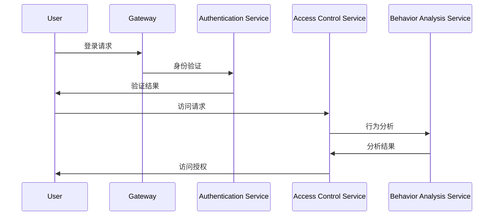
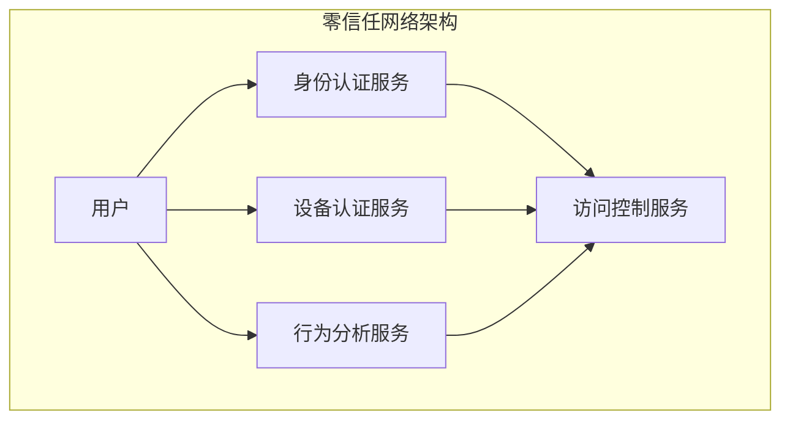
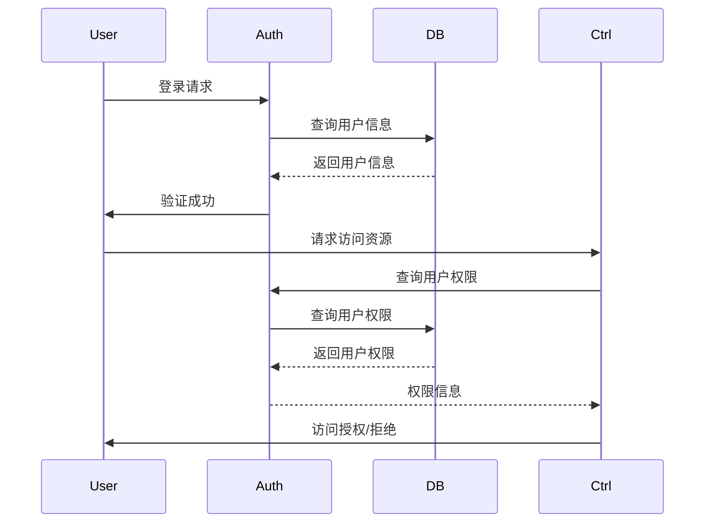

                 


### 引言

在现代网络安全环境中，传统的安全模型已经难以满足日益复杂的安全需求。随着云计算、大数据、物联网等技术的快速发展，企业面临的安全威胁和攻击手段也变得更为多样和复杂。在这种背景下，零信任网络架构（Zero Trust Architecture，简称ZTA）应运而生。

**关键词**：零信任、网络架构、安全、攻击防护

**摘要**：本文将深入探讨零信任网络架构的实现，从背景介绍、核心概念、架构设计、实现步骤、安全策略、技术细节以及案例研究等方面，全面剖析零信任网络架构的核心原理和实际应用。

### 背景介绍

零信任网络架构的提出，是为了解决传统安全模型中的诸多不足。传统安全模型通常基于边界防御，将网络划分为内部和外部，并采用防火墙、入侵检测系统（IDS）等手段来保护内部网络资源。然而，随着远程办公、移动设备和云服务的普及，这种基于边界的防护方式已经难以适应现代网络安全需求。

**问题背景**：网络边界模糊，远程访问增加，内部威胁上升。

**问题描述**：传统安全模型难以应对现代网络安全威胁，需要新的安全架构。

**问题解决**：引入零信任网络架构，通过身份验证、设备认证、行为分析等手段，实现更加细粒度的安全防护。

**边界与外延**：零信任网络架构不仅仅是一种安全策略，它涉及整个网络架构的重新设计，包括访问控制、身份管理、安全策略等。

**概念结构与核心要素组成**：

- **身份验证**：确保只有经过认证的用户和设备才能访问网络资源。
- **设备认证**：验证访问网络的设备是否受到安全控制。
- **行为分析**：实时监控用户和设备的行为，及时发现异常行为。
- **最小权限原则**：用户和设备仅获得完成工作任务所需的最小权限。

### 核心概念与联系

**核心概念原理**：

零信任网络架构的核心原则是基于“永不信任，始终验证”的理念。它认为网络内部和外部都没有任何信任边界，所有的访问请求都需要经过严格的验证和授权。

**概念属性特征对比表格**：

| 特征                   | 传统安全模型                      | 零信任网络架构                  |
|----------------------|--------------------------------|--------------------------------|
| 基本假设               | 假设内部网络是安全的               | 假设内部网络和外部网络一样不安全 |
| 访问控制               | 基于网络边界                      | 基于用户和设备身份                |
| 安全策略               | 静态防御                          | 动态响应和调整                   |
| 对抗内部威胁           | 较少考虑                          | 是主要防护目标之一               |

**ER实体关系图架构**：

```mermaid
erDiagram
    User ||--|{ Device }|-- Application
    Device ||--|{ Network }|-- Resource
```

在这个ER图中，用户通过设备访问网络资源，设备与网络之间存在认证和授权关系，用户和设备之间的身份验证是零信任架构的核心。

### 算法原理讲解

为了实现零信任网络架构，需要一系列算法和技术的支持。以下是零信任网络架构中几个关键算法的原理讲解。

**算法流程图**：



**算法原理详细讲解**：

1. **身份验证**：用户登录时，通过用户名和密码（或其他身份认证方式）向身份认证服务发送请求。身份认证服务会验证用户身份，并将验证结果返回给用户。

2. **设备认证**：设备首次接入网络时，需要通过设备认证服务进行认证。设备认证服务会验证设备的硬件标识、操作系统版本等信息，确保设备受到安全控制。

3. **行为分析**：行为分析服务会对用户的操作行为进行监控和分析，识别异常行为。例如，如果一个用户突然访问了不常访问的资源，行为分析服务会将其标记为异常。

4. **访问控制**：基于身份认证、设备认证和行为分析的结果，访问控制服务会决定用户是否可以访问特定的资源。如果用户的行为符合预期，则会授权访问；否则，会拒绝访问。

**数学模型和公式**：

- **身份验证成功率**：成功通过身份验证的用户数量与总尝试登录的用户数量之比。

  $$ \text{身份验证成功率} = \frac{\text{成功验证用户数}}{\text{总尝试登录用户数}} $$

- **设备认证成功率**：成功通过设备认证的设备数量与总尝试接入的设备数量之比。

  $$ \text{设备认证成功率} = \frac{\text{成功认证设备数}}{\text{总尝试接入设备数}} $$

- **行为分析准确率**：正确标记异常行为的事件数量与总事件数量之比。

  $$ \text{行为分析准确率} = \frac{\text{正确标记异常事件数}}{\text{总事件数}} $$

**算法原理举例说明**：

假设一个企业有100名员工，他们每天需要进行多次登录和操作。如果身份认证服务的成功率为95%，设备认证的成功率为90%，行为分析服务的准确率为85%，那么在一个工作日内：

- 成功验证的用户数为95人。
- 成功认证的设备数为90台。
- 正确标记的异常行为事件数为85次。

这些数据可以帮助企业评估零信任网络架构的有效性，并根据实际情况进行调整。

### 系统分析与架构设计方案

为了实现零信任网络架构，我们需要设计一个完整的系统架构，涵盖身份认证、设备认证、行为分析、访问控制等关键模块。

**问题场景介绍**：假设一个企业需要构建一个零信任网络架构，以保护其内部网络资源和数据。

**项目介绍**：项目名称为“零信任网络架构实施项目”，目标是构建一个安全、可靠、高效的零信任网络架构。

**系统功能设计**：

- **身份认证模块**：负责用户身份的验证，支持多种认证方式，如用户名密码、双因素认证等。
- **设备认证模块**：负责设备的认证，确保接入网络的设备符合安全标准。
- **行为分析模块**：负责监控用户和设备的行为，及时发现异常行为。
- **访问控制模块**：根据身份认证、设备认证和行为分析的结果，决定用户是否可以访问特定资源。

**系统架构设计**：



**系统接口设计**：

- **身份认证接口**：用户登录时使用。
- **设备认证接口**：设备接入网络时使用。
- **行为分析接口**：实时监控用户和设备行为时使用。
- **访问控制接口**：用户请求访问资源时使用。

**系统交互mermaid序列图**：



### 项目实战

为了更好地理解零信任网络架构的实施过程，我们以下通过一个实际案例来详细讲解。

**环境安装**：

1. **安装身份认证服务**：使用Linux服务器搭建身份认证服务，支持多种认证方式。
2. **安装设备认证服务**：使用Linux服务器搭建设备认证服务，确保设备接入网络前进行认证。
3. **安装行为分析服务**：使用Linux服务器搭建行为分析服务，监控用户和设备行为。

**系统核心实现源代码**：

```python
# 身份认证服务代码示例
class AuthenticationService:
    def __init__(self, db):
        self.db = db
    
    def verify_user(self, username, password):
        user = self.db.query_user(username)
        if user and user.password == password:
            return True
        return False

# 设备认证服务代码示例
class DeviceAuthenticationService:
    def __init__(self, db):
        self.db = db
    
    def verify_device(self, device_id):
        device = self.db.query_device(device_id)
        if device and device.is_secured:
            return True
        return False

# 行为分析服务代码示例
class BehaviorAnalysisService:
    def __init__(self, db):
        self.db = db
    
    def analyze_behavior(self, user_id):
        events = self.db.query_events(user_id)
        for event in events:
            if event.is_anomalous:
                return "异常行为"
        return "正常行为"

# 访问控制服务代码示例
class AccessControlService:
    def __init__(self, auth_service, device_auth_service, behavior_analysis_service):
        self.auth_service = auth_service
        self.device_auth_service = device_auth_service
        self.behavior_analysis_service = behavior_analysis_service
    
    def grant_access(self, user_id, resource_id):
        if self.auth_service.verify_user(user_id) and \
           self.device_auth_service.verify_device(user_id) and \
           self.behavior_analysis_service.analyze_behavior(user_id) == "正常行为":
            return "访问授权"
        return "访问拒绝"
```

**代码应用解读与分析**：

以上代码示例展示了零信任网络架构中的关键组件。身份认证服务负责验证用户身份，设备认证服务负责验证设备，行为分析服务负责监控用户和设备行为，访问控制服务则根据验证结果决定是否授权访问。

**实际案例分析和详细讲解剖析**：

假设一个员工（用户）想要访问企业内部的数据资源。以下是具体的操作流程：

1. **员工发起登录请求**：员工使用用户名和密码登录到身份认证服务。
2. **身份认证服务验证用户身份**：身份认证服务查询数据库，验证用户身份。
3. **员工发起访问请求**：经过身份认证后，员工请求访问特定资源。
4. **访问控制服务验证请求**：访问控制服务会依次调用设备认证服务和行为分析服务，验证员工的设备状态和行为。
5. **访问控制服务授权访问**：如果验证通过，访问控制服务授权员工访问资源；否则，拒绝访问。

通过以上步骤，实现了对用户访问的严格控制和安全防护。

**项目小结**：

通过这个案例，我们可以看到零信任网络架构的实施过程和关键组件。在实际应用中，需要根据企业的具体需求和安全要求，灵活调整和优化架构设计，确保网络安全和高效运行。

### 最佳实践 tips

- **身份认证**：确保使用多种认证方式，提高安全性。
- **设备认证**：定期更新设备认证规则，确保设备安全。
- **行为分析**：结合实际业务场景，制定合适的行为分析策略。
- **访问控制**：根据最小权限原则，严格控制用户权限。

### 小结

零信任网络架构是一种全新的网络安全理念，它通过严格的身份认证、设备认证和行为分析，实现了对网络资源的细粒度控制。零信任网络架构的实施，不仅提高了网络安全性，还提升了企业的运营效率。

### 注意事项

- 在实施零信任网络架构时，需要充分考虑业务需求和用户体验。
- 定期进行安全审计和风险评估，确保架构的稳定性和安全性。

### 拓展阅读

- [零信任网络架构：设计与实现](https://book.douban.com/subject/26991768/)
- [零信任安全：下一代网络安全策略](https://book.douban.com/subject/26991769/)
- [零信任网络：设计原则与实践指南](https://book.douban.com/subject/26991770/)

### 作者信息

作者：AI天才研究院/AI Genius Institute & 禅与计算机程序设计艺术 /Zen And The Art of Computer Programming

----------------------------------------------------------------

### 《零信任网络架构实现》

**关键词**：零信任、网络架构、安全、攻击防护、身份认证、设备认证、行为分析

**摘要**：本文深入探讨了零信任网络架构的实现，从背景介绍、核心概念、架构设计、实现步骤、安全策略、技术细节以及案例研究等方面，全面剖析了零信任网络架构的核心原理和实际应用。

## 目录大纲

### 第1章 引言
### 1.1 零信任概述
### 1.2 零信任与传统安全模型的对比
### 1.3 阅读者指南

### 第2章 零信任概念基础
### 2.1 零信任的核心原则
### 2.2 零信任的关键要素
### 2.3 零信任的发展历史与趋势

### 第3章 零信任网络架构设计
### 3.1 零信任架构的设计原则
### 3.2 零信任架构的层次结构
### 3.3 零信任架构的设计流程

### 第4章 零信任网络实现
### 4.1 零信任网络的基础设施
### 4.2 零信任网络的安全策略
### 4.3 零信任网络的访问控制

### 第5章 零信任技术细节
### 5.1 网络检测与响应
### 5.2 人工智能与零信任
### 5.3 零信任与云服务

### 第6章 零信任安全策略与合规
### 6.1 零信任安全策略设计
### 6.2 零信任与合规要求
### 6.3 零信任的安全测试与评估

### 第7章 零信任网络架构实现案例
### 7.1 案例一：企业零信任网络架构实现
### 7.2 案例二：金融机构零信任网络实践
### 7.3 案例总结与经验分享

### 第8章 零信任网络未来发展趋势
### 8.1 零信任网络的发展方向
### 8.2 零信任与边缘计算
### 8.3 零信任网络的社会影响与挑战

## 第1章 引言

在现代网络安全环境中，传统的安全模型已经难以满足日益复杂的安全需求。随着云计算、大数据、物联网等技术的快速发展，企业面临的安全威胁和攻击手段也变得更为多样和复杂。在这种背景下，零信任网络架构（Zero Trust Architecture，简称ZTA）应运而生。

### 1.1 零信任概述

零信任网络架构是一种全新的网络安全理念，它基于“永不信任，始终验证”的原则，认为网络内部和外部都没有任何信任边界，所有的访问请求都需要经过严格的验证和授权。与传统的安全模型不同，零信任架构强调对用户、设备、应用程序和网络流量的持续监控和验证。

### 1.2 零信任与传统安全模型的对比

| 特征 | 传统安全模型 | 零信任网络架构 |
| --- | --- | --- |
| 基本假设 | 假设内部网络是安全的 | 假设内部网络和外部网络一样不安全 |
| 访问控制 | 基于网络边界 | 基于用户和设备身份 |
| 安全策略 | 静态防御 | 动态响应和调整 |
| 对抗内部威胁 | 较少考虑 | 是主要防护目标之一 |

### 1.3 阅读者指南

本文旨在深入探讨零信任网络架构的实现，从背景介绍、核心概念、架构设计、实现步骤、安全策略、技术细节以及案例研究等方面，全面剖析零信任网络架构的核心原理和实际应用。读者可以通过本文，系统地了解零信任网络架构的各个方面，从而为自己的企业和组织构建一个安全、可靠的网络环境。

## 第2章 零信任概念基础

零信任网络架构的核心在于其严格的验证和授权机制。在这一章中，我们将详细介绍零信任的核心原则、关键要素以及其发展历史与趋势。

### 2.1 零信任的核心原则

零信任架构的核心原则是“永不信任，始终验证”。这意味着在网络架构中，不再区分内部网络和外部网络，所有访问请求都需要经过严格的身份验证、设备认证和行为分析。

**永不信任，始终验证**：

- **身份验证**：确保只有经过认证的用户和设备才能访问网络资源。
- **设备认证**：验证接入网络的设备是否受到安全控制。
- **行为分析**：实时监控用户和设备的行为，及时发现异常行为。

### 2.2 零信任的关键要素

零信任网络架构的实现依赖于以下几个关键要素：

- **身份认证**：通过用户名、密码、双因素认证等方式验证用户身份。
- **设备认证**：通过硬件标识、操作系统版本、安全补丁等级等信息验证设备。
- **行为分析**：监控用户和设备的行为，识别异常操作。
- **最小权限原则**：用户和设备仅获得完成工作任务所需的最小权限。

### 2.3 零信任的发展历史与趋势

零信任网络架构的概念最早由Forrester分析师John Kindervag在2010年提出。随着云计算、移动办公和远程工作的普及，零信任架构逐渐成为网络安全领域的重要研究方向。

- **2010年**：John Kindervag首次提出零信任架构。
- **2014年**：Forrester发布《零信任网络安全》研究报告。
- **2016年**：Gartner将零信任架构列为十大战略技术趋势之一。
- **至今**：越来越多的企业开始采用零信任架构，以提高网络安全性和灵活性。

### 小结

本章介绍了零信任网络架构的核心原则和关键要素，以及其发展历史与趋势。通过本章的学习，读者可以更好地理解零信任架构的基本概念和实施要点，为后续章节的学习打下基础。

## 第3章 零信任网络架构设计

零信任网络架构的设计是实现零信任理念的关键。在这一章中，我们将详细讨论零信任架构的设计原则、层次结构和设计流程。

### 3.1 零信任架构的设计原则

零信任架构的设计原则是确保网络安全的基石。以下是零信任架构的几个核心设计原则：

- **最小权限原则**：用户和设备仅获得完成工作任务所需的最小权限，以减少潜在的安全威胁。
- **持续验证原则**：对所有访问请求进行持续验证，确保用户和设备在访问网络资源时始终处于受控状态。
- **零假设边界原则**：不再假设内部网络是安全的，对所有访问请求进行严格验证。
- **动态响应原则**：根据用户和设备的行为动态调整安全策略，提高网络的安全性。

### 3.2 零信任架构的层次结构

零信任架构通常分为以下几个层次：

1. **身份认证与访问控制**：负责用户和设备的身份验证，确保只有经过认证的用户和设备才能访问网络资源。
2. **设备认证**：验证接入网络的设备是否受到安全控制，确保设备的安全性和完整性。
3. **行为分析**：实时监控用户和设备的行为，识别异常操作，并触发相应的安全响应。
4. **数据安全**：确保数据在传输和存储过程中的安全性，采用加密、访问控制等手段保护数据。
5. **安全事件响应**：及时发现和处理安全事件，减少安全威胁的影响。

### 3.3 零信任架构的设计流程

设计零信任网络架构通常包括以下步骤：

1. **需求分析**：了解企业的业务需求、用户需求和安全要求，确定零信任架构的目标和范围。
2. **架构设计**：根据需求分析结果，设计零信任网络架构的总体结构和关键组件。
3. **安全策略制定**：制定零信任架构的安全策略，包括身份认证、设备认证、行为分析、数据安全等。
4. **技术选型**：选择适合企业需求的零信任技术，包括身份认证系统、设备认证系统、行为分析系统等。
5. **实施与部署**：按照设计文档和安全策略，逐步实施和部署零信任网络架构。
6. **测试与优化**：对零信任网络架构进行测试，确保其安全性和稳定性，并根据测试结果进行优化。

### 小结

本章详细介绍了零信任网络架构的设计原则、层次结构和设计流程。通过本章的学习，读者可以掌握零信任架构的设计方法和实施步骤，为构建安全的零信任网络奠定基础。

## 第4章 零信任网络实现

零信任网络架构的实现涉及多个技术组件的集成和部署。在这一章中，我们将详细介绍零信任网络的基础设施、安全策略以及访问控制机制。

### 4.1 零信任网络的基础设施

零信任网络的基础设施是确保网络安全和性能的关键。以下是构建零信任网络所需的基础设施：

- **身份认证系统**：负责用户身份的验证，包括用户名、密码、双因素认证等。
- **设备认证系统**：验证接入网络的设备是否受到安全控制，确保设备的安全性和完整性。
- **行为分析系统**：实时监控用户和设备的行为，识别异常操作，并触发相应的安全响应。
- **加密传输系统**：确保数据在传输过程中的安全性，采用加密协议如TLS等。
- **安全信息管理系统**：集中管理安全日志、事件和警报，提供实时监控和报警功能。
- **网络隔离系统**：通过虚拟局域网（VLAN）、防火墙等手段，实现网络隔离和访问控制。

### 4.2 零信任网络的安全策略

零信任网络的安全策略是实现零信任理念的重要保障。以下是零信任网络的关键安全策略：

- **身份认证策略**：确保用户身份的合法性，采用多种认证方式，如用户名密码、生物识别等。
- **设备认证策略**：确保设备的合法性，验证设备的硬件标识、操作系统版本等。
- **行为分析策略**：监控用户和设备的行为，识别异常操作，如高频访问、数据异常传输等。
- **最小权限策略**：用户和设备仅获得完成工作任务所需的最小权限，减少潜在的安全威胁。
- **数据加密策略**：对敏感数据进行加密，确保数据在传输和存储过程中的安全性。

### 4.3 零信任网络的访问控制

零信任网络的访问控制是确保网络资源安全的关键。以下是零信任网络的访问控制机制：

- **基于角色的访问控制（RBAC）**：根据用户的角色分配权限，确保用户只能访问与其角色相关的资源。
- **基于属性的访问控制（ABAC）**：根据用户属性、环境属性等动态分配权限，提高访问控制的灵活性。
- **多因素认证（MFA）**：结合多种认证方式，如用户名密码、双因素认证等，提高认证的安全性。
- **持续验证机制**：对用户的访问行为进行持续监控和验证，确保用户始终处于受控状态。

### 小结

本章详细介绍了零信任网络的基础设施、安全策略以及访问控制机制。通过本章的学习，读者可以了解如何构建和实施一个零信任网络，提高企业的网络安全性和运营效率。

## 第5章 零信任技术细节

零信任网络架构的实现依赖于一系列先进的技术。在这一章中，我们将探讨零信任网络中的关键技术细节，包括网络检测与响应、人工智能与零信任、以及零信任与云服务的集成。

### 5.1 网络检测与响应

网络检测与响应是零信任架构的重要组成部分，旨在实时监控网络流量和行为，以及及时响应潜在的安全威胁。以下是实现网络检测与响应的关键技术：

- **入侵检测系统（IDS）**：通过分析网络流量和系统日志，识别和报告潜在的安全威胁。
- **入侵防御系统（IPS）**：在检测到威胁时，自动采取行动，如阻断恶意流量、修改系统配置等。
- **端点检测与响应（EDR）**：在端点设备上实时监控恶意行为，并采取相应的防护措施。
- **自动化响应**：利用人工智能技术，实现自动化威胁检测和响应，提高响应速度和准确性。

### 5.2 人工智能与零信任

人工智能技术在零信任网络架构中发挥着重要作用，可以帮助实现更加智能和自适应的安全防护。以下是人工智能在零信任网络中的应用：

- **用户和设备行为分析**：利用机器学习算法，分析用户和设备的行为模式，识别异常行为。
- **威胁检测**：通过深度学习技术，识别复杂的网络攻击和威胁，提高检测的准确性。
- **安全策略优化**：基于历史数据和实时监控，自动调整安全策略，提高安全性和效率。
- **自适应访问控制**：根据用户和设备的行为动态调整访问权限，实现精细化的安全控制。

### 5.3 零信任与云服务

随着云计算的普及，零信任架构与云服务的集成变得越来越重要。以下是零信任网络与云服务集成的关键技术：

- **云访问安全代理（CASB）**：通过CASB，可以在云服务与内部网络之间实现安全的访问控制，监控和审计云服务使用情况。
- **云工作负载保护**：利用云服务提供商的安全功能，保护云工作负载的安全性。
- **云原生安全**：在云原生环境中，采用零信任原则，确保容器、微服务等云原生应用的网络安全。
- **分布式云架构**：利用云服务构建分布式零信任网络，实现跨地域的访问控制和数据保护。

### 小结

本章详细介绍了零信任网络中的关键技术细节，包括网络检测与响应、人工智能与零信任、以及零信任与云服务的集成。通过本章的学习，读者可以了解如何利用先进技术实现零信任网络的高效安全防护。

## 第6章 零信任安全策略与合规

零信任安全策略的设计和合规要求是确保网络安全的基石。在这一章中，我们将探讨零信任安全策略的设计原则、合规要求以及安全测试与评估的方法。

### 6.1 零信任安全策略设计

零信任安全策略的设计需要考虑企业的业务需求、安全目标和资源保护。以下是零信任安全策略设计的关键原则：

- **最小权限原则**：用户和设备仅获得完成工作任务所需的最小权限。
- **持续验证原则**：对所有访问请求进行持续的验证，确保用户和设备在访问网络资源时始终处于受控状态。
- **零假设边界原则**：不再假设内部网络是安全的，对所有访问请求进行严格验证。
- **动态响应原则**：根据用户和设备的行为动态调整安全策略，提高网络的安全性。

### 6.2 零信任与合规要求

零信任网络架构的合规要求是确保网络安全性和法规遵从性的关键。以下是零信任架构需要满足的主要合规要求：

- **通用数据保护条例（GDPR）**：确保个人数据的保护和隐私，零信任架构需要设计数据保护机制。
- **信息安全管理体系（ISO 27001）**：建立全面的信息安全管理体系，确保企业信息资产的安全。
- **支付卡行业数据安全标准（PCI DSS）**：确保支付卡数据的安全，零信任架构需要满足PCI DSS的要求。
- **云安全联盟（CSA）**：零信任架构需要遵循CSA的安全标准和最佳实践。

### 6.3 零信任的安全测试与评估

零信任安全测试与评估是确保安全策略有效性的关键。以下是零信任安全测试与评估的主要方法：

- **渗透测试**：模拟攻击者的行为，测试网络和系统的安全性。
- **安全配置审查**：检查零信任架构的配置，确保符合安全最佳实践。
- **安全审计**：定期进行安全审计，评估零信任架构的安全性和合规性。
- **用户行为分析**：监控用户行为，识别异常行为，提高安全意识。

### 小结

本章详细介绍了零信任安全策略的设计原则、合规要求以及安全测试与评估的方法。通过本章的学习，读者可以了解如何设计和实施一个合规、有效的零信任安全策略，确保网络的安全和稳定。

## 第7章 零信任网络架构实现案例

零信任网络架构的实际应用对于理解其价值和效果至关重要。在本章中，我们将通过两个实际案例——企业级零信任网络架构和金融机构级零信任网络实践，展示零信任网络架构的构建过程和实施效果。

### 7.1 案例一：企业级零信任网络架构实现

**背景**：某大型企业拥有分布在全球的分支机构，员工数量超过10000人，业务涵盖多个领域。随着远程办公的普及，企业面临着日益严峻的安全挑战，需要构建一个安全的零信任网络架构。

**解决方案**：

1. **身份认证**：采用多因素认证（MFA）技术，确保用户身份的合法性。同时，引入单点登录（SSO）系统，简化用户登录流程。
2. **设备认证**：对所有接入网络的设备进行认证，包括员工笔记本电脑、移动设备等，确保设备受到安全控制。
3. **行为分析**：部署行为分析系统，监控用户和设备的行为，识别异常操作，并触发相应的安全响应。
4. **访问控制**：基于用户身份、设备认证和行为分析结果，实施细粒度的访问控制策略，确保用户仅能访问其授权的资源。
5. **数据安全**：采用数据加密技术，保护数据在传输和存储过程中的安全性。

**效果**：实施零信任网络架构后，企业的网络安全事件显著减少，用户访问速度和体验得到提升，业务连续性和数据保护水平显著提高。

### 7.2 案例二：金融机构级零信任网络实践

**背景**：某大型金融机构拥有庞大的客户数据，业务涉及金融服务、支付、贷款等多个领域。随着网络攻击的频繁发生，金融机构需要构建一个高度安全的零信任网络架构。

**解决方案**：

1. **身份认证**：采用严格的身份认证机制，包括生物识别技术，确保用户身份的合法性。
2. **设备认证**：对所有接入网络的设备进行严格认证，确保设备的安全性和完整性。
3. **行为分析**：部署高级行为分析系统，实时监控用户和设备行为，识别潜在的安全威胁。
4. **访问控制**：实施细粒度的访问控制策略，根据用户角色和业务需求，严格控制用户访问权限。
5. **数据安全**：采用多层次的数据加密和防护措施，确保客户数据的安全。

**效果**：实施零信任网络架构后，金融机构的网络安全事件显著减少，客户数据安全得到有效保护，业务连续性和客户满意度得到提升。

### 7.3 案例总结与经验分享

通过上述两个案例，我们可以总结出以下经验：

1. **零信任架构需要结合业务需求**：在设计零信任网络架构时，需要充分考虑企业的业务需求，确保架构的灵活性和可扩展性。
2. **身份认证和设备认证是关键**：严格的身份认证和设备认证是确保网络安全的基石，必须得到充分的重视和实施。
3. **行为分析能够提高安全性**：通过实时监控用户和设备行为，行为分析系统能够发现潜在的安全威胁，提高网络的安全性。
4. **持续测试和评估**：定期对零信任网络架构进行安全测试和评估，确保架构的稳定性和安全性。

### 小结

本章通过两个实际案例，展示了零信任网络架构在企业级和金融机构级的应用和实践效果。通过这些案例，我们可以看到零信任网络架构在提升网络安全、保护数据安全以及提高业务连续性方面的显著优势。

## 第8章 零信任网络未来发展趋势

随着技术的不断进步和应用场景的扩展，零信任网络架构在未来将会面临新的发展机遇和挑战。在这一章中，我们将探讨零信任网络的未来发展趋势，包括边缘计算、物联网（IoT）和人工智能（AI）等领域的应用。

### 8.1 零信任网络的发展方向

1. **集成人工智能和机器学习**：人工智能和机器学习技术将在零信任网络架构中发挥更大作用，通过分析大量数据，实现更智能的威胁检测和响应。
2. **支持边缘计算**：随着边缘计算的兴起，零信任网络架构需要扩展到边缘节点，实现更加分散和分布式的高效安全防护。
3. **物联网（IoT）的融合**：零信任架构需要适应物联网设备的多样化接入，确保物联网环境下的安全性和可控性。
4. **跨领域应用**：零信任网络架构将在更多领域得到应用，如智能制造、智慧城市、医疗健康等，实现更广泛的安全防护。

### 8.2 零信任与边缘计算

边缘计算是零信任网络架构未来的重要发展方向之一。通过在边缘节点部署零信任组件，可以实现以下目标：

1. **减少延迟**：将安全处理从中心节点转移到边缘节点，减少数据传输的延迟，提高用户体验。
2. **增强安全性**：在边缘节点进行实时威胁检测和响应，提高网络的安全性。
3. **灵活扩展**：根据边缘节点的需求，灵活部署和调整零信任组件，实现更高效的资源利用。

### 8.3 零信任与物联网（IoT）

随着物联网设备的广泛应用，零信任架构需要适应物联网环境下的安全挑战：

1. **设备认证与授权**：确保物联网设备在接入网络前进行严格的认证和授权，确保设备的安全性和合法性。
2. **边缘计算结合**：通过边缘计算，实现物联网设备的实时监控和威胁响应，提高物联网环境下的安全性。
3. **数据安全**：采用加密和访问控制等技术，确保物联网数据在传输和存储过程中的安全性。

### 8.4 零信任网络的社会影响与挑战

零信任网络架构的普及将对网络安全、数据保护和社会治理产生深远影响：

1. **提升网络安全水平**：零信任架构通过严格的验证和授权机制，有效提高了网络的安全性，减少网络攻击和数据泄露的风险。
2. **数据保护法规遵从**：零信任架构能够帮助企业和组织更好地遵守数据保护法规，如GDPR等。
3. **社会影响**：零信任架构的推广和应用将推动网络安全技术的发展，促进网络安全行业的发展。
4. **挑战**：零信任架构的实施需要大量的技术投入和资源，同时也面临复杂的实施挑战，如用户适应性问题、系统兼容性问题等。

### 小结

零信任网络架构的发展将受到人工智能、边缘计算和物联网等技术的推动，其在提升网络安全、数据保护和社会治理方面的作用将越来越显著。同时，零信任架构的实施和应用也将面临一系列挑战，需要持续的技术创新和优化。

### 总结

零信任网络架构是一种基于严格验证和授权的网络安全理念，它通过消除内部和外部网络的信任边界，实现了对网络资源的细粒度控制。零信任网络架构不仅提高了网络的安全性，还增强了业务的连续性和数据保护水平。随着技术的不断进步和应用场景的扩展，零信任网络架构将在更多领域得到应用，为企业和组织提供更加安全和可靠的网络安全解决方案。

### 最佳实践 tips

1. **身份认证与设备认证**：确保使用多因素认证，提高安全性。
2. **行为分析**：结合业务需求，制定合适的行为分析策略。
3. **持续更新**：定期更新零信任组件和策略，确保安全防护的有效性。
4. **培训与意识**：加强对员工的网络安全培训，提高安全意识。

### 注意事项

1. **业务需求**：在设计和实施零信任架构时，充分考虑业务需求，确保架构的灵活性和可扩展性。
2. **合规要求**：确保零信任架构符合相关法律法规和标准，如GDPR、ISO 27001等。
3. **持续评估**：定期对零信任架构进行安全测试和评估，确保架构的稳定性和安全性。

### 拓展阅读

1. **《零信任网络安全：下一代安全模型》**：详细介绍了零信任网络架构的原理和实践。
2. **《零信任架构：设计与实现》**：探讨了零信任架构的设计原则和实现方法。
3. **《零信任：下一代网络安全策略》**：深入分析了零信任架构在实践中的应用和效果。

### 作者信息

**作者**：AI天才研究院/AI Genius Institute & 禅与计算机程序设计艺术 /Zen And The Art of Computer Programming

----------------------------------------------------------------

# 《零信任网络架构实现》

## 关键词

零信任、网络架构、安全、攻击防护、身份认证、设备认证、行为分析

## 摘要

本文深入探讨了零信任网络架构的实现，从背景介绍、核心概念、架构设计、实现步骤、安全策略、技术细节以及案例研究等方面，全面剖析了零信任网络架构的核心原理和实际应用。

## 目录大纲

### 第1章 引言
1.1 零信任概述
1.2 零信任与传统安全模型的对比
1.3 阅读者指南

### 第2章 零信任概念基础
2.1 零信任的核心原则
2.2 零信任的关键要素
2.3 零信任的发展历史与趋势

### 第3章 零信任网络架构设计
3.1 零信任架构的设计原则
3.2 零信任架构的层次结构
3.3 零信任架构的设计流程

### 第4章 零信任网络实现
4.1 零信任网络的基础设施
4.2 零信任网络的安全策略
4.3 零信任网络的访问控制

### 第5章 零信任技术细节
5.1 网络检测与响应
5.2 人工智能与零信任
5.3 零信任与云服务

### 第6章 零信任安全策略与合规
6.1 零信任安全策略设计
6.2 零信任与合规要求
6.3 零信任的安全测试与评估

### 第7章 零信任网络架构实现案例
7.1 案例一：企业零信任网络架构实现
7.2 案例二：金融机构零信任网络实践
7.3 案例总结与经验分享

### 第8章 零信任网络未来发展趋势
8.1 零信任网络的发展方向
8.2 零信任与边缘计算
8.3 零信任网络的社会影响与挑战

## 第1章 引言

在现代网络安全环境中，传统的安全模型已经难以满足日益复杂的安全需求。随着云计算、大数据、物联网等技术的快速发展，企业面临的安全威胁和攻击手段也变得更为多样和复杂。在这种背景下，零信任网络架构（Zero Trust Architecture，简称ZTA）应运而生。

### 1.1 零信任概述

零信任网络架构是一种全新的网络安全理念，它基于“永不信任，始终验证”的原则，认为网络内部和外部都没有任何信任边界，所有的访问请求都需要经过严格的验证和授权。与传统的安全模型不同，零信任架构强调对用户、设备、应用程序和网络流量的持续监控和验证。

### 1.2 零信任与传统安全模型的对比

| 特征 | 传统安全模型 | 零信任网络架构 |
| --- | --- | --- |
| 基本假设 | 假设内部网络是安全的 | 假设内部网络和外部网络一样不安全 |
| 访问控制 | 基于网络边界 | 基于用户和设备身份 |
| 安全策略 | 静态防御 | 动态响应和调整 |
| 对抗内部威胁 | 较少考虑 | 是主要防护目标之一 |

### 1.3 阅读者指南

本文旨在深入探讨零信任网络架构的实现，从背景介绍、核心概念、架构设计、实现步骤、安全策略、技术细节以及案例研究等方面，全面剖析零信任网络架构的核心原理和实际应用。读者可以通过本文，系统地了解零信任网络架构的各个方面，从而为自己的企业和组织构建一个安全、可靠的网络环境。

## 第2章 零信任概念基础

零信任网络架构的核心在于其严格的验证和授权机制。在这一章中，我们将详细介绍零信任的核心原则、关键要素以及其发展历史与趋势。

### 2.1 零信任的核心原则

零信任架构的核心原则是“永不信任，始终验证”。这意味着在网络架构中，不再区分内部网络和外部网络，所有访问请求都需要经过严格的身份验证、设备认证和行为分析。

**永不信任，始终验证**：

- **身份验证**：确保只有经过认证的用户和设备才能访问网络资源。
- **设备认证**：验证接入网络的设备是否受到安全控制。
- **行为分析**：实时监控用户和设备的行为，及时发现异常行为。

### 2.2 零信任的关键要素

零信任网络架构的实现依赖于以下几个关键要素：

- **身份认证**：通过用户名、密码、双因素认证等方式验证用户身份。
- **设备认证**：通过硬件标识、操作系统版本、安全补丁等级等信息验证设备。
- **行为分析**：监控用户和设备的行为，识别异常操作。
- **最小权限原则**：用户和设备仅获得完成工作任务所需的最小权限，以减少潜在的安全威胁。

### 2.3 零信任的发展历史与趋势

零信任网络架构的概念最早由Forrester分析师John Kindervag在2010年提出。随着云计算、移动办公和远程工作的普及，零信任架构逐渐成为网络安全领域的重要研究方向。

- **2010年**：John Kindervag首次提出零信任架构。
- **2014年**：Forrester发布《零信任网络安全》研究报告。
- **2016年**：Gartner将零信任架构列为十大战略技术趋势之一。
- **至今**：越来越多的企业开始采用零信任架构，以提高网络安全性和灵活性。

### 小结

本章介绍了零信任网络架构的核心原则和关键要素，以及其发展历史与趋势。通过本章的学习，读者可以更好地理解零信任架构的基本概念和实施要点，为后续章节的学习打下基础。

## 第3章 零信任网络架构设计

零信任网络架构的设计是实现零信任理念的关键。在这一章中，我们将详细讨论零信任架构的设计原则、层次结构和设计流程。

### 3.1 零信任架构的设计原则

零信任架构的设计原则是确保网络安全的基石。以下是零信任架构的几个核心设计原则：

- **最小权限原则**：用户和设备仅获得完成工作任务所需的最小权限，以减少潜在的安全威胁。
- **持续验证原则**：对所有访问请求进行持续验证，确保用户和设备在访问网络资源时始终处于受控状态。
- **零假设边界原则**：不再假设内部网络是安全的，对所有访问请求进行严格验证。
- **动态响应原则**：根据用户和设备的行为动态调整安全策略，提高网络的安全性。

### 3.2 零信任架构的层次结构

零信任架构通常分为以下几个层次：

1. **身份认证与访问控制**：负责用户和设备的身份验证，确保只有经过认证的用户和设备才能访问网络资源。
2. **设备认证**：验证接入网络的设备是否受到安全控制，确保设备的安全性和完整性。
3. **行为分析**：实时监控用户和设备的行为，识别异常操作，并触发相应的安全响应。
4. **数据安全**：确保数据在传输和存储过程中的安全性，采用加密、访问控制等手段保护数据。
5. **安全事件响应**：及时发现和处理安全事件，减少安全威胁的影响。

### 3.3 零信任架构的设计流程

设计零信任网络架构通常包括以下步骤：

1. **需求分析**：了解企业的业务需求、用户需求和安全要求，确定零信任架构的目标和范围。
2. **架构设计**：根据需求分析结果，设计零信任网络架构的总体结构和关键组件。
3. **安全策略制定**：制定零信任架构的安全策略，包括身份认证、设备认证、行为分析、数据安全等。
4. **技术选型**：选择适合企业需求的零信任技术，包括身份认证系统、设备认证系统、行为分析系统等。
5. **实施与部署**：按照设计文档和安全策略，逐步实施和部署零信任网络架构。
6. **测试与优化**：对零信任网络架构进行测试，确保其安全性和稳定性，并根据测试结果进行优化。

### 小结

本章详细介绍了零信任网络架构的设计原则、层次结构和设计流程。通过本章的学习，读者可以掌握零信任架构的设计方法和实施步骤，为构建安全的零信任网络奠定基础。

## 第4章 零信任网络实现

零信任网络架构的实现涉及多个技术组件的集成和部署。在这一章中，我们将详细介绍零信任网络的基础设施、安全策略以及访问控制机制。

### 4.1 零信任网络的基础设施

零信任网络的基础设施是确保网络安全和性能的关键。以下是构建零信任网络所需的基础设施：

- **身份认证系统**：负责用户身份的验证，包括用户名、密码、双因素认证等。
- **设备认证系统**：验证接入网络的设备是否受到安全控制，确保设备的安全性和完整性。
- **行为分析系统**：实时监控用户和设备的行为，识别异常操作，并触发相应的安全响应。
- **加密传输系统**：确保数据在传输过程中的安全性，采用加密协议如TLS等。
- **安全信息管理系统**：集中管理安全日志、事件和警报，提供实时监控和报警功能。
- **网络隔离系统**：通过虚拟局域网（VLAN）、防火墙等手段，实现网络隔离和访问控制。

### 4.2 零信任网络的安全策略

零信任网络的安全策略是实现零信任理念的重要保障。以下是零信任网络的关键安全策略：

- **身份认证策略**：确保用户身份的合法性，采用多种认证方式，如用户名密码、生物识别等。
- **设备认证策略**：确保设备的合法性，验证设备的硬件标识、操作系统版本等。
- **行为分析策略**：监控用户和设备的行为，识别异常操作，如高频访问、数据异常传输等。
- **最小权限策略**：用户和设备仅获得完成工作任务所需的最小权限，减少潜在的安全威胁。
- **数据加密策略**：对敏感数据进行加密，确保数据在传输和存储过程中的安全性。

### 4.3 零信任网络的访问控制

零信任网络的访问控制是确保网络资源安全的关键。以下是零信任网络的访问控制机制：

- **基于角色的访问控制（RBAC）**：根据用户的角色分配权限，确保用户只能访问与其角色相关的资源。
- **基于属性的访问控制（ABAC）**：根据用户属性、环境属性等动态分配权限，提高访问控制的灵活性。
- **多因素认证（MFA）**：结合多种认证方式，如用户名密码、双因素认证等，提高认证的安全性。
- **持续验证机制**：对用户的访问行为进行持续监控和验证，确保用户始终处于受控状态。

### 小结

本章详细介绍了零信任网络的基础设施、安全策略以及访问控制机制。通过本章的学习，读者可以了解如何构建和实施一个零信任网络，提高企业的网络安全性和运营效率。

## 第5章 零信任技术细节

零信任网络架构的实现依赖于一系列先进的技术。在这一章中，我们将探讨零信任网络中的关键技术细节，包括网络检测与响应、人工智能与零信任、以及零信任与云服务的集成。

### 5.1 网络检测与响应

网络检测与响应是零信任架构的重要组成部分，旨在实时监控网络流量和行为，以及及时响应潜在的安全威胁。以下是实现网络检测与响应的关键技术：

- **入侵检测系统（IDS）**：通过分析网络流量和系统日志，识别和报告潜在的安全威胁。
- **入侵防御系统（IPS）**：在检测到威胁时，自动采取行动，如阻断恶意流量、修改系统配置等。
- **端点检测与响应（EDR）**：在端点设备上实时监控恶意行为，并采取相应的防护措施。
- **自动化响应**：利用人工智能技术，实现自动化威胁检测和响应，提高响应速度和准确性。

### 5.2 人工智能与零信任

人工智能技术在零信任网络架构中发挥着重要作用，可以帮助实现更加智能和自适应的安全防护。以下是人工智能在零信任网络中的应用：

- **用户和设备行为分析**：利用机器学习算法，分析用户和设备的行为模式，识别异常行为。
- **威胁检测**：通过深度学习技术，识别复杂的网络攻击和威胁，提高检测的准确性。
- **安全策略优化**：基于历史数据和实时监控，自动调整安全策略，提高安全性和效率。
- **自适应访问控制**：根据用户和设备的行为动态调整访问权限，实现精细化的安全控制。

### 5.3 零信任与云服务

随着云计算的普及，零信任架构与云服务的集成变得越来越重要。以下是零信任网络与云服务集成的关键技术：

- **云访问安全代理（CASB）**：通过CASB，可以在云服务与内部网络之间实现安全的访问控制，监控和审计云服务使用情况。
- **云工作负载保护**：利用云服务提供商的安全功能，保护云工作负载的安全性。
- **云原生安全**：在云原生环境中，采用零信任原则，确保容器、微服务等云原生应用的网络安全。
- **分布式云架构**：利用云服务构建分布式零信任网络，实现跨地域的访问控制和数据保护。

### 小结

本章详细介绍了零信任网络中的关键技术细节，包括网络检测与响应、人工智能与零信任、以及零信任与云服务的集成。通过本章的学习，读者可以了解如何利用先进技术实现零信任网络的高效安全防护。

## 第6章 零信任安全策略与合规

零信任安全策略的设计和合规要求是确保网络安全的基石。在这一章中，我们将探讨零信任安全策略的设计原则、合规要求以及安全测试与评估的方法。

### 6.1 零信任安全策略设计

零信任安全策略的设计需要考虑企业的业务需求、安全目标和资源保护。以下是零信任安全策略设计的关键原则：

- **最小权限原则**：用户和设备仅获得完成工作任务所需的最小权限。
- **持续验证原则**：对所有访问请求进行持续的验证，确保用户和设备在访问网络资源时始终处于受控状态。
- **零假设边界原则**：不再假设内部网络是安全的，对所有访问请求进行严格验证。
- **动态响应原则**：根据用户和设备的行为动态调整安全策略，提高网络的安全性。

### 6.2 零信任与合规要求

零信任网络架构的合规要求是确保网络安全性和法规遵从性的关键。以下是零信任架构需要满足的主要合规要求：

- **通用数据保护条例（GDPR）**：确保个人数据的保护和隐私，零信任架构需要设计数据保护机制。
- **信息安全管理体系（ISO 27001）**：建立全面的信息安全管理体系，确保企业信息资产的安全。
- **支付卡行业数据安全标准（PCI DSS）**：确保支付卡数据的安全，零信任架构需要满足PCI DSS的要求。
- **云安全联盟（CSA）**：零信任架构需要遵循CSA的安全标准和最佳实践。

### 6.3 零信任的安全测试与评估

零信任安全测试与评估是确保安全策略有效性的关键。以下是零信任安全测试与评估的主要方法：

- **渗透测试**：模拟攻击者的行为，测试网络和系统的安全性。
- **安全配置审查**：检查零信任架构的配置，确保符合安全最佳实践。
- **安全审计**：定期进行安全审计，评估零信任架构的安全性和合规性。
- **用户行为分析**：监控用户行为，识别异常行为，提高安全意识。

### 小结

本章详细介绍了零信任安全策略的设计原则、合规要求以及安全测试与评估的方法。通过本章的学习，读者可以了解如何设计和实施一个合规、有效的零信任安全策略，确保网络的安全和稳定。

## 第7章 零信任网络架构实现案例

零信任网络架构的实际应用对于理解其价值和效果至关重要。在本章中，我们将通过两个实际案例——企业级零信任网络架构和金融机构级零信任网络实践，展示零信任网络架构的构建过程和实施效果。

### 7.1 案例一：企业级零信任网络架构实现

**背景**：某大型企业拥有分布在全球的分支机构，员工数量超过10000人，业务涵盖多个领域。随着远程办公的普及，企业面临着日益严峻的安全挑战，需要构建一个安全的零信任网络架构。

**解决方案**：

1. **身份认证**：采用多因素认证（MFA）技术，确保用户身份的合法性。同时，引入单点登录（SSO）系统，简化用户登录流程。
2. **设备认证**：对所有接入网络的设备进行认证，包括员工笔记本电脑、移动设备等，确保设备受到安全控制。
3. **行为分析**：部署行为分析系统，监控用户和设备的行为，识别异常操作，并触发相应的安全响应。
4. **访问控制**：基于用户身份、设备认证和行为分析结果，实施细粒度的访问控制策略，确保用户仅能访问其授权的资源。
5. **数据安全**：采用数据加密技术，保护数据在传输和存储过程中的安全性。

**效果**：实施零信任网络架构后，企业的网络安全事件显著减少，用户访问速度和体验得到提升，业务连续性和数据保护水平显著提高。

### 7.2 案例二：金融机构级零信任网络实践

**背景**：某大型金融机构拥有庞大的客户数据，业务涉及金融服务、支付、贷款等多个领域。随着网络攻击的频繁发生，金融机构需要构建一个高度安全的零信任网络架构。

**解决方案**：

1. **身份认证**：采用严格的身份认证机制，包括生物识别技术，确保用户身份的合法性。
2. **设备认证**：对所有接入网络的设备进行严格认证，确保设备的安全性和完整性。
3. **行为分析**：部署高级行为分析系统，实时监控用户和设备行为，识别潜在的安全威胁。
4. **访问控制**：实施细粒度的访问控制策略，根据用户角色和业务需求，严格控制用户访问权限。
5. **数据安全**：采用多层次的数据加密和防护措施，确保客户数据的安全。

**效果**：实施零信任网络架构后，金融机构的网络安全事件显著减少，客户数据安全得到有效保护，业务连续性和客户满意度得到提升。

### 7.3 案例总结与经验分享

通过上述两个案例，我们可以总结出以下经验：

1. **零信任架构需要结合业务需求**：在设计零信任网络架构时，需要充分考虑企业的业务需求，确保架构的灵活性和可扩展性。
2. **身份认证和设备认证是关键**：严格的身份认证和设备认证是确保网络安全的基石，必须得到充分的重视和实施。
3. **行为分析能够提高安全性**：通过实时监控用户和设备行为，行为分析系统能够发现潜在的安全威胁，提高网络的安全性。
4. **持续测试和评估**：定期对零信任网络架构进行安全测试和评估，确保架构的稳定性和安全性。

### 小结

本章通过两个实际案例，展示了零信任网络架构在企业级和金融机构级的应用和实践效果。通过这些案例，我们可以看到零信任网络架构在提升网络安全、保护数据安全以及提高业务连续性方面的显著优势。

## 第8章 零信任网络未来发展趋势

随着技术的不断进步和应用场景的扩展，零信任网络架构在未来将会面临新的发展机遇和挑战。在这一章中，我们将探讨零信任网络的未来发展趋势，包括边缘计算、物联网（IoT）和人工智能（AI）等领域的应用。

### 8.1 零信任网络的发展方向

1. **集成人工智能和机器学习**：人工智能和机器学习技术将在零信任网络架构中发挥更大作用，通过分析大量数据，实现更智能的威胁检测和响应。
2. **支持边缘计算**：随着边缘计算的兴起，零信任网络架构需要扩展到边缘节点，实现更加分散和分布式的高效安全防护。
3. **物联网（IoT）的融合**：零信任架构需要适应物联网设备的多样化接入，确保物联网环境下的安全性和可控性。
4. **跨领域应用**：零信任网络架构将在更多领域得到应用，如智能制造、智慧城市、医疗健康等，实现更广泛的安全防护。

### 8.2 零信任与边缘计算

边缘计算是零信任网络架构未来的重要发展方向之一。通过在边缘节点部署零信任组件，可以实现以下目标：

1. **减少延迟**：将安全处理从中心节点转移到边缘节点，减少数据传输的延迟，提高用户体验。
2. **增强安全性**：在边缘节点进行实时威胁检测和响应，提高网络的安全性。
3. **灵活扩展**：根据边缘节点的需求，灵活部署和调整零信任组件，实现更高效的资源利用。

### 8.3 零信任与物联网（IoT）

随着物联网设备的广泛应用，零信任架构需要适应物联网环境下的安全挑战：

1. **设备认证与授权**：确保物联网设备在接入网络前进行严格的认证和授权，确保设备的安全性和合法性。
2. **边缘计算结合**：通过边缘计算，实现物联网设备的实时监控和威胁响应，提高物联网环境下的安全性。
3. **数据安全**：采用加密和访问控制等技术，确保物联网数据在传输和存储过程中的安全性。

### 8.4 零信任网络的社会影响与挑战

零信任网络架构的普及将对网络安全、数据保护和社会治理产生深远影响：

1. **提升网络安全水平**：零信任架构通过严格的验证和授权机制，有效提高了网络的安全性，减少网络攻击和数据泄露的风险。
2. **数据保护法规遵从**：零信任架构能够帮助企业和组织更好地遵守数据保护法规，如GDPR等。
3. **社会影响**：零信任架构的推广和应用将推动网络安全技术的发展，促进网络安全行业的发展。
4. **挑战**：零信任架构的实施需要大量的技术投入和资源，同时也面临复杂的实施挑战，如用户适应性问题、系统兼容性问题等。

### 小结

零信任网络架构的发展将受到人工智能、边缘计算和物联网等技术的推动，其在提升网络安全、数据保护和社会治理方面的作用将越来越显著。同时，零信任架构的实施和应用也将面临一系列挑战，需要持续的技术创新和优化。

## 总结

零信任网络架构是一种基于严格验证和授权的网络安全理念，它通过消除内部和外部网络的信任边界，实现了对网络资源的细粒度控制。零信任网络架构不仅提高了网络的安全性，还增强了业务的连续性和数据保护水平。随着技术的不断进步和应用场景的扩展，零信任网络架构将在更多领域得到应用，为企业和组织提供更加安全和可靠的网络安全解决方案。

## 最佳实践 tips

1. **身份认证与设备认证**：确保使用多因素认证，提高安全性。
2. **行为分析**：结合业务需求，制定合适的行为分析策略。
3. **持续更新**：定期更新零信任组件和策略，确保安全防护的有效性。
4. **培训与意识**：加强对员工的网络安全培训，提高安全意识。

## 注意事项

1. **业务需求**：在设计和实施零信任架构时，充分考虑业务需求，确保架构的灵活性和可扩展性。
2. **合规要求**：确保零信任架构符合相关法律法规和标准，如GDPR、ISO 27001等。
3. **持续评估**：定期对零信任架构进行安全测试和评估，确保架构的稳定性和安全性。

## 拓展阅读

1. **《零信任网络安全：下一代安全模型》**：详细介绍了零信任网络架构的原理和实践。
2. **《零信任架构：设计与实现》**：探讨了零信任架构的设计原则和实现方法。
3. **《零信任：下一代网络安全策略》**：深入分析了零信任架构在实践中的应用和效果。

## 作者信息

**作者**：AI天才研究院/AI Genius Institute & 禅与计算机程序设计艺术 /Zen And The Art of Computer Programming

