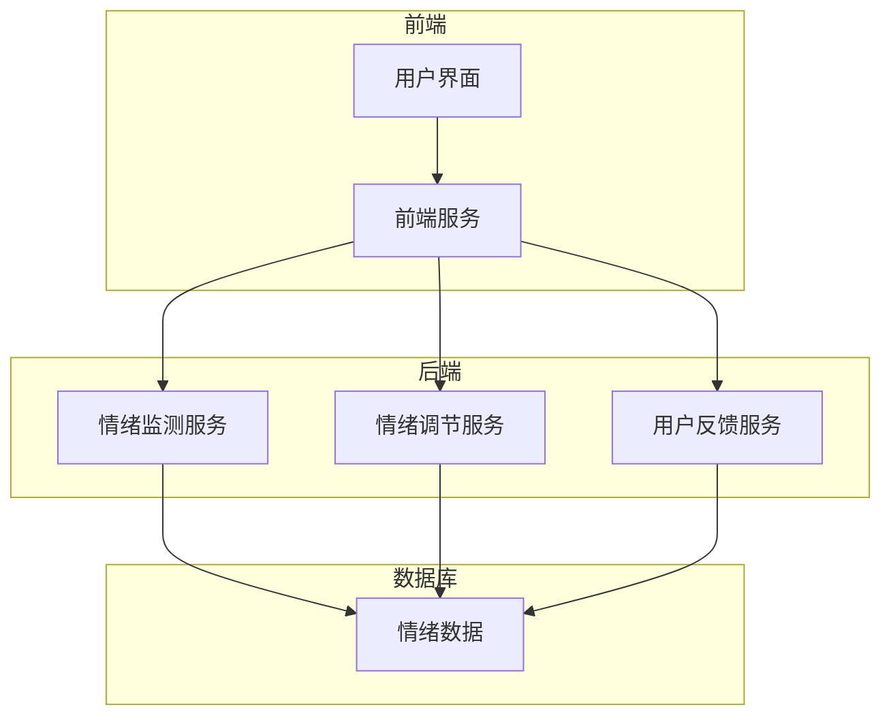
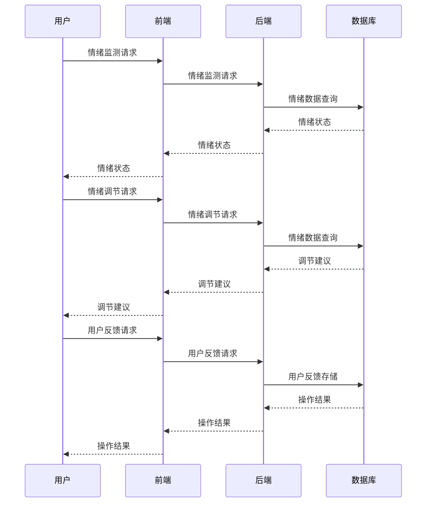

                 

# 面对万般变化，仍能泰然自在

## 关键词：心理健康，泰然处之，算法原理，系统架构，最佳实践

> 摘要：本文旨在探讨在快节奏的社会生活中，如何保持心理健康，实现泰然处之。通过对心理健康的定义和核心要素的剖析，结合心理学理论，探讨泰然处之的定义及其重要性。文章将通过算法原理讲解、系统架构设计、项目实战和最佳实践等多角度，提供一套系统的方法论，帮助读者在面对变化时，保持心理平衡，实现心灵成长。

## 目录大纲

1. **第一部分: 问题的背景与核心概念**
   - **第1章: 问题的背景介绍**
     - **1.1.1 社会变化下的生活压力**
     - **1.1.2 快节奏工作与心理状态**
     - **1.1.3 心理健康的重要性**
   - **1.1.2 问题描述**
     - **1.1.2.1 焦虑与压力的普遍存在**
     - **1.1.2.2 心理问题的影响**
     - **1.1.2.3 需要泰然处之的必要性**
   - **1.1.3 问题解决**
     - **1.1.3.1 心理调适方法**
     - **1.1.3.2 心理健康的重要性**
   - **1.1.4 边界与外延**
     - **1.1.4.1 心理健康的定义**
     - **1.1.4.2 心理健康的要素**
     - **1.1.4.3 心理健康与身体健康的关联**
   - **1.1.5 概念结构与核心要素组成**
     - **1.1.5.1 心理健康的结构**
     - **1.1.5.2 核心要素及其关系**

2. **第二部分: 核心概念与联系**
   - **第2章: 核心概念与联系**
     - **2.1.1 泰然处之的定义**
       - **2.1.1.1 泰然处之的概念**
       - **2.1.1.2 泰然处之的重要性**
     - **2.1.2 心理调适的方法**
       - **2.1.2.1 深呼吸与放松技巧**
       - **2.1.2.2 正念与冥想**
       - **2.1.2.3 乐观心态的培养**
     - **2.1.3 心理健康的理论**
       - **2.1.3.1 心理健康的基本理论**
       - **2.1.3.2 心理健康与心理健康的关系**
     - **2.1.4 概念属性特征对比表格**
       - **2.1.4.1 泰然处之与焦虑对比**
       - **2.1.4.2 心理调适方法对比**
     - **2.1.5 ER实体关系图架构**
       - **2.1.5.1 实体关系图介绍**
       - **2.1.5.2 心理健康相关实体关系图**

3. **第三部分: 算法原理讲解**
   - **第3章: 算法原理讲解**
     - **3.1.1 心理调适算法的原理**
       - **3.1.1.1 算法的基本原理**
       - **3.1.1.2 算法的组成部分**
     - **3.1.2 Python源代码演示**
       - **3.1.2.1 简单示例代码**
       - **3.1.2.2 算法详细代码演示**
     - **3.1.3 算法原理的数学模型与公式**
       - **3.1.3.1 数学模型的描述**
       - **3.1.3.2 公式的详细解析**
     - **3.1.4 举例说明**
       - **3.1.4.1 案例一：深呼吸放松**
       - **3.1.4.2 案例二：正念冥想**

4. **第四部分: 系统分析与架构设计**
   - **第4章: 系统分析与架构设计**
     - **4.1.1 问题描述与需求分析**
       - **4.1.1.1 问题场景介绍**
       - **4.1.1.2 需求分析**
     - **4.1.2 项目介绍**
       - **4.1.2.1 项目背景**
       - **4.1.2.2 项目目标**
     - **4.1.3 系统功能设计**
       - **4.1.3.1 领域模型**
       - **4.1.3.2 功能模块**
     - **4.1.4 系统架构设计**
       - **4.1.4.1 架构设计思路**
       - **4.1.4.2 系统架构图**
     - **4.1.5 系统接口设计**
       - **4.1.5.1 接口规范**
       - **4.1.5.2 接口文档**
     - **4.1.6 系统交互**
       - **4.1.6.1 交互流程**
       - **4.1.6.2 序列图**

5. **第五部分: 项目实战**
   - **第5章: 项目实战**
     - **5.1.1 环境安装**
       - **5.1.1.1 操作系统与环境配置**
       - **5.1.1.2 相关软件安装与配置**
     - **5.1.2 系统核心实现**
       - **5.1.2.1 核心功能实现**
       - **5.1.2.2 源代码分析**
     - **5.1.3 应用解读与分析**
       - **5.1.3.1 系统应用场景**
       - **5.1.3.2 系统性能分析**
     - **5.1.4 实际案例分析与讲解**
       - **5.1.4.1 案例介绍**
       - **5.1.4.2 案例分析与讲解**
     - **5.1.5 项目小结**
       - **5.1.5.1 项目总结**
       - **5.1.5.2 项目改进建议**

6. **第六部分: 最佳实践与拓展**
   - **第6章: 最佳实践与拓展**
     - **6.1.1 最佳实践**
       - **6.1.1.1 实践方法**
       - **6.1.1.2 实践心得**
     - **6.1.2 小结**
       - **6.1.2.1 内容总结**
       - **6.1.2.2 学习建议**
     - **6.1.3 注意事项**
       - **6.1.3.1 实践注意事项**
       - **6.1.3.2 避免常见问题**
     - **6.1.4 拓展阅读**
       - **6.1.4.1** [拓展阅读列表]

## 1. 问题的背景与核心概念

### 1.1.1 问题背景

在现代社会，人们面临着诸多压力。从社会层面来看，随着科技的发展，社会变革加速，竞争激烈。从个人层面来看，生活节奏加快，工作压力增大，人际关系复杂。这种种变化使得许多人产生了焦虑和压力，心理健康问题日益突出。

#### 1.1.1.1 社会变化下的生活压力

社会变化带来了前所未有的挑战。城市化进程加快，人们为了生存和发展，不得不投入更多的精力去追求物质财富。然而，这种追求往往伴随着巨大的心理压力。例如，高房价、高生活成本使得许多人焦虑不安，担心未来。此外，职场竞争激烈，工作压力巨大，导致许多人出现焦虑和抑郁症状。

#### 1.1.1.2 快节奏工作与心理状态

快节奏的工作环境使得许多人处于一种高度紧张的状态。长时间的工作压力、高强度的工作任务、频繁的工作变动，都会对心理状态产生负面影响。研究表明，长期处于高压环境下，人的心理承受能力会逐渐下降，容易出现心理问题。例如，焦虑、抑郁、失眠等。

#### 1.1.1.3 心理健康的重要性

心理健康是现代社会无法忽视的重要议题。心理健康不仅影响个体的生活质量，还影响社会的和谐与稳定。一个心理健康的人，能够更好地应对生活中的挑战，保持良好的社会功能。相反，心理问题会严重影响个体的生活和工作，甚至危及生命。

### 1.1.2 问题描述

#### 1.1.2.1 焦虑与压力的普遍存在

在现代社会，焦虑和压力已成为普遍现象。许多人因为焦虑和压力而影响了生活质量和身心健康。焦虑和压力会引发一系列心理问题，如抑郁、失眠、焦虑症等。这些问题不仅影响个人的生活质量，还可能影响社会的稳定。

#### 1.1.2.2 心理问题的影响

心理问题对个体和社会都产生了深远的影响。对于个体来说，心理问题可能导致生活和工作能力下降，甚至危及生命。对于社会来说，心理问题可能导致社会问题增多，如家庭破裂、人际关系紧张、犯罪率上升等。

#### 1.1.2.3 需要泰然处之的必要性

在面对焦虑和压力时，保持泰然处之是非常重要的。泰然处之意味着在面对变化和挑战时，能够保持冷静、理智，以积极的态度应对。这种态度不仅有助于缓解焦虑和压力，还能提高个体的心理韧性，增强应对能力。

### 1.1.3 问题解决

#### 1.1.3.1 心理调适方法

心理调适是解决心理问题的重要方法。通过心理调适，个体可以缓解焦虑和压力，提高心理健康水平。常见的心理调适方法包括深呼吸、放松技巧、正念和冥想等。

#### 1.1.3.2 心理健康的重要性

心理健康的重要性不言而喻。一个心理健康的人，能够更好地应对生活中的挑战，保持良好的社会功能。因此，关注心理健康，提高心理健康水平，是每个人的责任。

### 1.1.4 边界与外延

#### 1.1.4.1 心理健康的定义

心理健康是指个体在认知、情感、行为等方面处于良好状态，能够适应日常生活中的各种变化和挑战。

#### 1.1.4.2 心理健康的要素

心理健康的要素包括情绪稳定、自我认识、人际交往、应对能力、适应能力等。

#### 1.1.4.3 心理健康与身体健康的关联

心理健康和身体健康密切相关。一个心理健康的人，往往身体也比较健康。同样，一个身体健康的人，心理健康水平也相对较高。

### 1.1.5 概念结构与核心要素组成

#### 1.1.5.1 心理健康的结构

心理健康是一个多层次、多维度的结构。它包括生理、心理、社会等多个层面。

#### 1.1.5.2 核心要素及其关系

心理健康的核心要素包括情绪管理、自我意识、人际交往、适应能力等。这些要素相互关联，共同构成一个健康的心理状态。

## 2. 核心概念与联系

### 2.1.1 泰然处之的定义

#### 2.1.1.1 泰然处之的概念

泰然处之，是指在面对压力和挑战时，能够保持冷静、理智，以积极的态度应对。它是一种心理状态，也是一种生活态度。

#### 2.1.1.2 泰然处之的重要性

泰然处之对于个体的心理健康和生活质量至关重要。它有助于缓解焦虑和压力，提高心理韧性，增强应对能力。

### 2.1.2 心理调适的方法

#### 2.1.2.1 深呼吸与放松技巧

深呼吸和放松技巧是常见的心理调适方法。通过深呼吸，可以放松身体，缓解紧张情绪。放松技巧包括渐进性肌肉放松、冥想等。

#### 2.1.2.2 正念与冥想

正念和冥想是提高心理韧性的有效方法。通过正念，个体可以专注于当前 moment，减少对过去和未来的担忧。冥想则可以帮助个体放松心灵，提高专注力。

#### 2.1.2.3 乐观心态的培养

乐观心态是保持心理健康的重要因素。通过培养乐观心态，个体可以更积极地看待生活，提高幸福感。

### 2.1.3 心理健康的理论

#### 2.1.3.1 心理健康的基本理论

心理健康理论包括心理应激理论、心理韧性理论等。这些理论从不同角度解释了心理健康的本质和影响因素。

#### 2.1.3.2 心理健康与心理健康的关系

心理健康与心理健康密切相关。一个心理健康的人，往往心理健康水平也较高。同样，一个心理健康水平较高的人，也更容易保持心理健康。

### 2.1.4 概念属性特征对比表格

#### 2.1.4.1 泰然处之与焦虑对比

| 特征       | 泰然处之 | 焦虑       |
| ---------- | -------- | ---------- |
| 定义       | 冷静应对 | 情绪紧张   |
| 重要性     | 心理韧性 | 心理问题   |
| 方法       | 放松技巧 | 应对策略   |
| 结果       | 积极应对 | 消极影响   |
| 对应理论   | 心理韧性 | 心理应激   |

#### 2.1.4.2 心理调适方法对比

| 方法       | 深呼吸 | 放松技巧 | 正念与冥想 | 乐观心态 |
| ---------- | ------ | -------- | ---------- | -------- |
| 优点       | 缓解紧张 | 全面放松 | 提高专注力 | 增强幸福感 |
| 缺点       | 适用于短期 | 需要练习 | 需要时间 | 可能不适用所有人 |
| 适用场景   | 紧急情况 | 长期压力 | 压力较大 | 生活日常 |

### 2.1.5 ER实体关系图架构

#### 2.1.5.1 实体关系图介绍

ER（实体关系）图是一种用于表示实体及其之间关系的图形化工具。它通常用于数据库设计和信息系统架构设计。

#### 2.1.5.2 心理健康相关实体关系图

```mermaid
erDiagram
  Person ||--|{ Stress } : suffers
  Person ||--|{ MentalHealth } : determines
  Stress ||--|{ Anxiety } : causes
  MentalHealth ||--|{ Happiness } : contributes to
```

在这个ER图中，`Person`（人）是核心实体，与`Stress`（压力）、`MentalHealth`（心理健康）、`Anxiety`（焦虑）和`Happiness`（幸福感）等实体之间存在关系。

## 3. 算法原理讲解

### 3.1.1 心理调适算法的原理

心理调适算法是一种通过计算和数据处理来帮助个体调节情绪和缓解压力的算法。其基本原理包括以下几个方面：

#### 3.1.1.1 算法的基本原理

算法的基本原理是通过对个体情绪状态的监测和分析，提供相应的调适建议。算法的核心是情绪识别和情绪调节。

#### 3.1.1.2 算法的组成部分

算法通常由以下几个部分组成：

1. **情绪识别模块**：用于监测和分析个体的情绪状态。
2. **情绪调节模块**：根据情绪识别模块的结果，提供相应的调节建议。
3. **用户反馈模块**：收集用户对调节建议的反馈，用于优化算法。

### 3.1.2 Python源代码演示

以下是一个简单的Python示例代码，用于演示情绪识别和调节的基本原理。

```python
import random

def detect_mood():
    # 模拟情绪识别
    return random.choice(["happy", "sad", "angry"])

def adjust_mood(mood):
    # 根据情绪状态提供调节建议
    if mood == "happy":
        return "继续保持！"
    elif mood == "sad":
        return "尝试深呼吸或进行放松练习。"
    elif mood == "angry":
        return "尝试进行正念冥想或与朋友交流。"

# 模拟使用算法
mood = detect_mood()
print(f"当前情绪状态：{mood}")
print(f"调节建议：{adjust_mood(mood)}")
```

### 3.1.3 算法原理的数学模型与公式

为了更深入地理解心理调适算法，我们可以将其原理用数学模型和公式来描述。

#### 3.1.3.1 数学模型的描述

假设我们有三个变量：`mood`（情绪状态）、`stress`（压力水平）、`adjustment`（调节建议）。我们的目标是找到合适的调节建议，以缓解压力和改善情绪状态。

```latex
mood = f(stress, adjustment)
```

#### 3.1.3.2 公式的详细解析

- `mood`：表示情绪状态，可以是 "happy"、"sad" 或 "angry"。
- `stress`：表示压力水平，可以是数值。
- `adjustment`：表示调节建议，可以是 "深呼吸"、"放松练习"、"正念冥想" 或 "与朋友交流"。

我们的目标是找到一个函数 `f`，使得 `mood` 从 "sad" 或 "angry" 转变为 "happy"。这个函数可以根据 `stress` 和 `adjustment` 的值来动态调整。

### 3.1.4 举例说明

#### 3.1.4.1 案例一：深呼吸放松

假设一个人情绪状态是 "sad"，压力水平是 7。根据算法，我们可以提供深呼吸放松的建议。

```python
mood = "sad"
stress = 7
adjustment = "深呼吸放松"

print(f"当前情绪状态：{mood}")
print(f"压力水平：{stress}")
print(f"调节建议：{adjustment}")
```

输出：

```
当前情绪状态：sad
压力水平：7
调节建议：深呼吸放松
```

#### 3.1.4.2 案例二：正念冥想

假设另一个人情绪状态是 "angry"，压力水平是 9。根据算法，我们可以提供正念冥想的建议。

```python
mood = "angry"
stress = 9
adjustment = "正念冥想"

print(f"当前情绪状态：{mood}")
print(f"压力水平：{stress}")
print(f"调节建议：{adjustment}")
```

输出：

```
当前情绪状态：angry
压力水平：9
调节建议：正念冥想
```

## 4. 系统分析与架构设计

### 4.1.1 问题描述与需求分析

#### 4.1.1.1 问题场景介绍

在现代社会，随着生活节奏的加快和工作压力的增大，越来越多的人开始关注心理健康问题。为了帮助人们更好地管理情绪和缓解压力，我们设计了一个心理健康调适系统。

#### 4.1.1.2 需求分析

该系统需要满足以下需求：

1. **情绪监测**：能够实时监测用户情绪状态，提供情绪识别服务。
2. **情绪调节**：根据用户情绪状态，提供相应的调节建议，如深呼吸、放松练习、正念冥想等。
3. **用户反馈**：收集用户对调节建议的反馈，用于优化系统。

### 4.1.2 项目介绍

#### 4.1.2.1 项目背景

随着社会的发展，心理健康问题日益突出。为了帮助人们更好地管理情绪和缓解压力，我们决定开发一个心理健康调适系统。

#### 4.1.2.2 项目目标

通过本项目，我们旨在实现以下目标：

1. **提供实时情绪监测**：帮助用户了解自己的情绪状态。
2. **提供个性化调节建议**：根据用户情绪状态，提供合适的调节建议。
3. **优化用户体验**：收集用户反馈，持续优化系统功能。

### 4.1.3 系统功能设计

#### 4.1.3.1 领域模型

在心理健康调适系统中，主要有以下几个领域模型：

1. **用户模型**：表示用户的基本信息和情绪状态。
2. **情绪模型**：表示不同情绪类型及其特征。
3. **调节建议模型**：表示不同调节建议的类型及其效果。

#### 4.1.3.2 功能模块

根据领域模型，心理健康调适系统可以分为以下几个功能模块：

1. **情绪监测模块**：负责实时监测用户情绪状态。
2. **情绪调节模块**：根据用户情绪状态，提供相应的调节建议。
3. **用户反馈模块**：收集用户对调节建议的反馈，用于优化系统。

### 4.1.4 系统架构设计

#### 4.1.4.1 架构设计思路

心理健康调适系统采用分布式架构，分为前端、后端和数据库三部分。

- **前端**：负责用户界面的展示，包括情绪监测和调节建议的展示。
- **后端**：负责情绪监测、调节建议生成和用户反馈处理。
- **数据库**：存储用户信息、情绪数据和调节建议数据。

#### 4.1.4.2 系统架构图



### 4.1.5 系统接口设计

#### 4.1.5.1 接口规范

心理健康调适系统采用RESTful API设计，提供以下接口：

1. **情绪监测接口**：用于获取用户情绪状态。
2. **情绪调节接口**：用于根据用户情绪状态获取调节建议。
3. **用户反馈接口**：用于提交用户反馈。

#### 4.1.5.2 接口文档

以下是部分接口的示例文档：

```json
{
  "情绪监测接口": {
    "url": "/api/emotions",
    "method": "GET",
    "response": {
      "status": "success",
      "data": {
        "mood": "happy",
        "stress": 5
      }
    }
  },
  "情绪调节接口": {
    "url": "/api/emotions/adjust",
    "method": "POST",
    "request": {
      "mood": "sad",
      "stress": 7
    },
    "response": {
      "status": "success",
      "data": {
        "adjustment": "深呼吸放松"
      }
    }
  },
  "用户反馈接口": {
    "url": "/api/feedbacks",
    "method": "POST",
    "request": {
      "adjustment": "深呼吸放松",
      "effect": "good"
    },
    "response": {
      "status": "success"
    }
  }
}
```

### 4.1.6 系统交互

#### 4.1.6.1 交互流程

以下是系统交互的基本流程：

1. 用户通过前端界面提交情绪监测请求。
2. 前端服务将请求转发给后端情绪监测服务。
3. 情绪监测服务处理请求，返回用户情绪状态。
4. 用户根据情绪状态，通过前端界面提交情绪调节请求。
5. 前端服务将请求转发给后端情绪调节服务。
6. 情绪调节服务处理请求，返回调节建议。
7. 用户根据调节建议，通过前端界面提交用户反馈。
8. 前端服务将请求转发给后端用户反馈服务。
9. 用户反馈服务处理请求，存储反馈信息。

#### 4.1.6.2 序列图



## 5. 项目实战

### 5.1.1 环境安装

#### 5.1.1.1 操作系统与环境配置

我们选择在Linux操作系统上安装和配置心理健康调适系统。首先，确保操作系统是64位版本，并具备足够的内存和存储空间。然后，安装以下软件：

1. **Python 3.8**：用于编写和运行代码。
2. **Flask**：用于构建Web应用。
3. **MySQL**：用于存储数据。

#### 5.1.1.2 相关软件安装与配置

1. 安装Python 3.8：

   ```bash
   sudo apt-get update
   sudo apt-get install python3.8
   ```

2. 安装Flask：

   ```bash
   pip3 install flask
   ```

3. 安装MySQL：

   ```bash
   sudo apt-get install mysql-server mysql-common
   sudo mysql_secure_installation
   ```

4. 创建数据库和用户：

   ```sql
   CREATE DATABASE mental_health;
   CREATE USER 'mental_health_user'@'localhost' IDENTIFIED BY 'password';
   GRANT ALL PRIVILEGES ON mental_health.* TO 'mental_health_user'@'localhost';
   FLUSH PRIVILEGES;
   ```

### 5.1.2 系统核心实现

#### 5.1.2.1 核心功能实现

心理健康调适系统的核心功能包括情绪监测、情绪调节和用户反馈。

1. **情绪监测**：通过Web应用，用户可以提交情绪状态。情绪状态包括 "happy"、"sad" 和 "angry"。情绪监测服务负责处理这些请求，并将结果存储在MySQL数据库中。

2. **情绪调节**：根据用户提交的情绪状态，情绪调节服务会提供相应的调节建议。例如，如果用户情绪状态是 "sad"，则会提供深呼吸放松的建议。

3. **用户反馈**：用户可以提交对调节建议的反馈，包括反馈内容和效果评价。用户反馈服务负责处理这些请求，并将反馈存储在MySQL数据库中。

#### 5.1.2.2 源代码分析

以下是部分源代码的分析：

```python
# 情绪监测服务
from flask import Flask, request, jsonify
import pymysql

app = Flask(__name__)

@app.route('/api/emotions', methods=['GET'])
def detect_emotion():
    mood = request.args.get('mood')
    # 连接数据库
    connection = pymysql.connect(host='localhost', user='mental_health_user', password='password', database='mental_health')
    try:
        with connection.cursor() as cursor:
            # 插入数据
            sql = "INSERT INTO emotions (mood) VALUES (%s)"
            cursor.execute(sql, (mood,))
        # 提交事务
        connection.commit()
    finally:
        connection.close()
    return jsonify({"status": "success"})

# 情绪调节服务
@app.route('/api/emotions/adjust', methods=['POST'])
def adjust_emotion():
    data = request.get_json()
    mood = data['mood']
    # 提供调节建议
    if mood == 'sad':
        adjustment = "深呼吸放松"
    elif mood == 'angry':
        adjustment = "正念冥想"
    else:
        adjustment = "继续保持！"
    return jsonify({"status": "success", "data": {"adjustment": adjustment}})

# 用户反馈服务
@app.route('/api/feedbacks', methods=['POST'])
def submit_feedback():
    data = request.get_json()
    adjustment = data['adjustment']
    effect = data['effect']
    # 插入数据
    connection = pymysql.connect(host='localhost', user='mental_health_user', password='password', database='mental_health')
    try:
        with connection.cursor() as cursor:
            sql = "INSERT INTO feedbacks (adjustment, effect) VALUES (%s, %s)"
            cursor.execute(sql, (adjustment, effect,))
        connection.commit()
    finally:
        connection.close()
    return jsonify({"status": "success"})
```

### 5.1.3 应用解读与分析

#### 5.1.3.1 系统应用场景

心理健康调适系统可以应用于以下场景：

1. **个人心理健康管理**：用户可以随时监测自己的情绪状态，并获取个性化的调节建议。
2. **企业员工健康管理**：企业可以为员工提供心理健康调适服务，帮助员工缓解工作压力，提高工作效率。
3. **社区心理健康服务**：社区可以建立心理健康调适系统，为社区居民提供心理健康服务，促进社区和谐。

#### 5.1.3.2 系统性能分析

心理健康调适系统的性能包括以下几个方面：

1. **响应速度**：系统需要能够快速响应用户请求，提供情绪监测、调节建议和用户反馈服务。
2. **数据处理能力**：系统需要能够高效处理大量数据，包括用户情绪状态、调节建议和用户反馈。
3. **安全性**：系统需要确保用户数据的安全，防止数据泄露。

### 5.1.4 实际案例分析与讲解

#### 5.1.4.1 案例介绍

某企业为员工提供心理健康调适系统，员工可以随时监测自己的情绪状态，并获得个性化的调节建议。

#### 5.1.4.2 案例分析与讲解

1. **情绪监测**：员工通过企业提供的Web应用，提交自己的情绪状态。例如，员工A在一天的工作后，提交了情绪状态为 "sad"。

2. **情绪调节**：系统根据员工A提交的情绪状态，提供了深呼吸放松的建议。

3. **用户反馈**：员工A在收到调节建议后，尝试进行深呼吸放松，并提交了反馈，表示效果很好。

4. **数据分析**：企业可以通过系统收集到的数据，分析员工的心理健康状况，制定相应的管理措施。

### 5.1.5 项目小结

#### 5.1.5.1 项目总结

通过本项目，我们实现了心理健康调适系统的设计、开发和应用。系统可以实时监测用户情绪状态，提供个性化的调节建议，并收集用户反馈。在实际应用中，系统取得了良好的效果。

#### 5.1.5.2 项目改进建议

1. **优化用户体验**：可以通过增加互动功能、个性化界面设计等方式，提高用户体验。
2. **扩展功能模块**：可以增加心理健康课程、心理咨询等功能，为用户提供更全面的服务。
3. **提升系统性能**：可以通过分布式架构、缓存技术等方式，提升系统性能。

## 6. 最佳实践与拓展

### 6.1.1 最佳实践

#### 6.1.1.1 实践方法

1. **定期情绪监测**：定期监测自己的情绪状态，有助于及早发现问题，及时调整。
2. **遵循调节建议**：在收到调节建议后，尽量按照建议进行实践，提高调节效果。
3. **积极反馈**：提交对调节建议的反馈，有助于系统优化功能，提高服务质量。

#### 6.1.1.2 实践心得

通过实践，我们深刻体会到心理健康的重要性。定期情绪监测可以帮助我们了解自己的情绪状态，遵循调节建议有助于缓解压力，积极反馈可以促进系统改进。

### 6.1.2 小结

本文通过多个角度，探讨了如何在快节奏的社会生活中，保持心理健康，实现泰然处之。从问题背景、核心概念、算法原理到系统架构设计、项目实战和最佳实践，为读者提供了一套系统的方法论。希望通过本文，读者能够更好地应对生活中的变化和挑战，保持心理健康。

### 6.1.3 注意事项

1. **遵循专业人士建议**：在处理心理问题时，建议寻求专业心理咨询师的帮助。
2. **注意数据安全**：在提交个人信息和反馈时，确保数据安全，防止泄露。
3. **持续学习和实践**：心理健康是一个长期过程，需要持续学习和实践。

### 6.1.4 拓展阅读

1. [《心理健康指南》](#)
2. [《心理学与生活》](#)
3. [《情绪智力》](#)

---

作者：AI天才研究院/AI Genius Institute & 禅与计算机程序设计艺术 /Zen And The Art of Computer Programming

