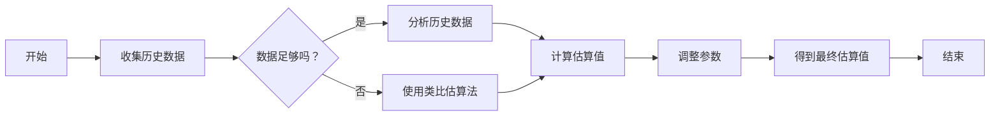
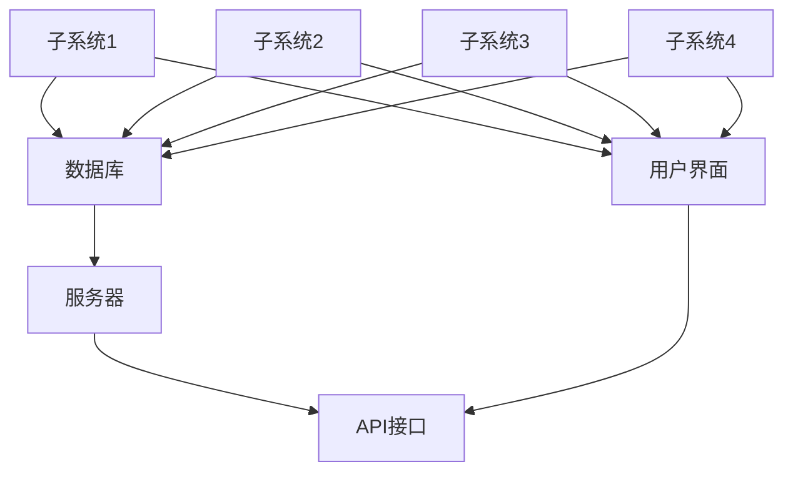
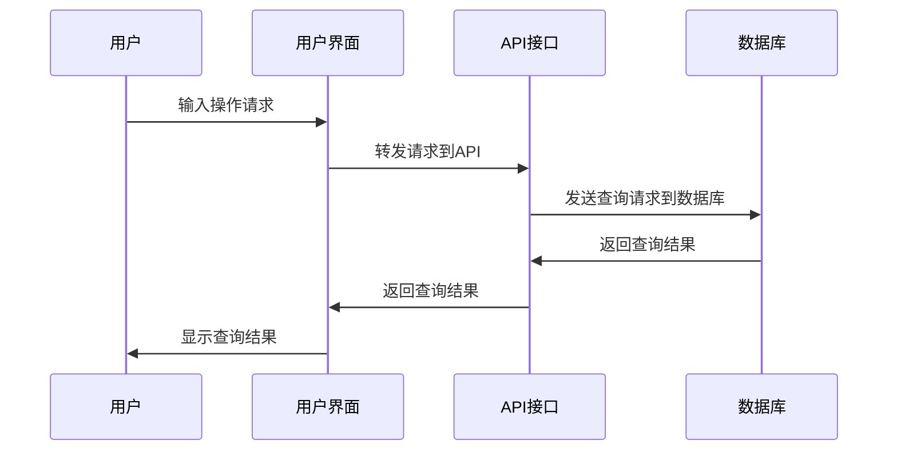
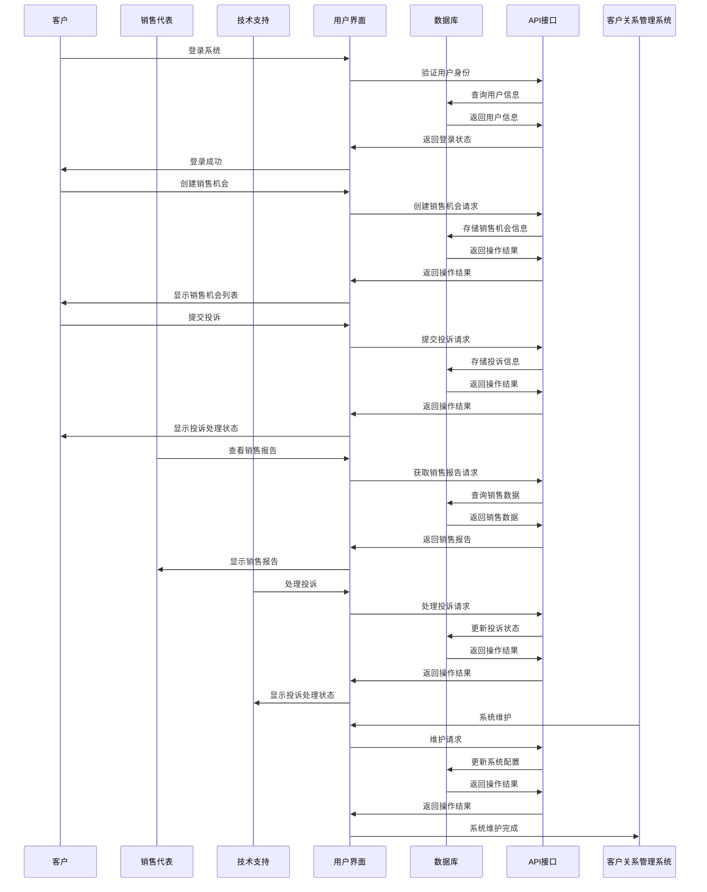

                 


### 引言

在软件工程领域，项目估算是一项至关重要的任务。它不仅仅是一个数字游戏，更是一个涉及项目管理、团队协作、技术预测等多方面的综合挑战。准确的估算可以帮助团队更好地规划资源、制定合理的进度，同时也能提高项目的成功率。然而，现实情况是，许多软件项目的估算往往不够准确，导致项目延期、成本超支，甚至失败。

**问题背景**：软件项目的估算为什么如此重要？一方面，准确的估算可以帮助团队在项目初期就明确项目的目标、范围和可行性。另一方面，合理的估算能够帮助团队在项目过程中进行有效的风险管理，及时发现并解决问题。然而，估算的不准确往往源于多个因素，包括项目需求的不断变更、技术难度的预估不足、团队协作效率低等。

**问题解决**：本文旨在通过系统的方法和详细的案例分析，探讨如何提高软件项目的预测准确性。我们将首先介绍项目估算的核心概念和重要性，接着详细讲解常用的估算方法及其原理，然后通过一个具体的系统分析与架构设计方案，展示如何将这些估算方法应用到实际项目中。最后，我们将总结最佳实践，并提供一些注意事项和拓展阅读，以帮助读者更好地理解和应用项目估算技巧。

**边界与外延**：本文将主要关注软件开发过程中的项目估算问题，而不是其他类型项目的估算。同时，我们将探讨常用的估算方法和原理，但不涉及具体编程语言的实现细节。此外，本文还将介绍一些通用的最佳实践，但不会对特定项目或团队的特殊情况进行深入分析。

通过本文的阅读，读者将能够：

1. 理解项目估算的定义和重要性。
2. 掌握常用的估算方法及其原理。
3. 学习如何将估算方法应用到实际项目中。
4. 探讨提高估算准确性的最佳实践和注意事项。

### 核心概念与联系

为了更好地理解项目估算的复杂性和重要性，我们需要首先明确几个核心概念，并探讨它们之间的关系。

#### 2.1 项目估算的定义

项目估算是指对项目完成所需的时间、成本和资源进行预测的过程。它不仅包括对项目工作量的估算，还涉及对风险和不确定性的评估。具体来说，项目估算主要包括以下几个方面：

1. **工作量估算**：估算完成项目所需的总工作量，包括开发、测试、部署等各个阶段。
2. **时间估算**：预测项目完成所需的总时间，包括项目周期的各个阶段。
3. **成本估算**：预测项目完成所需的总成本，包括人力成本、设备成本、运营成本等。
4. **资源估算**：预测项目完成所需的各种资源，包括人力、设备、材料等。

#### 2.2 项目估算的重要性

项目估算在软件项目管理中扮演着至关重要的角色。具体来说，它有以下几个方面的作用：

1. **规划资源**：通过准确的估算，团队可以更好地分配资源，确保在项目过程中有足够的资源来应对各种挑战。
2. **风险管理**：估算过程中需要评估潜在的风险和不确定性，从而为风险管理提供基础。
3. **制定预算**：准确的估算有助于制定合理的项目预算，避免因预算不足导致的项目延期或失败。
4. **提高团队协作效率**：明确的估算目标有助于团队更好地协作，提高工作效率。

#### 2.3 项目估算与风险管理

项目估算与风险管理密切相关。在估算过程中，团队需要对潜在的风险进行评估，并制定相应的应对策略。具体来说，项目估算与风险管理之间的关系可以概括为以下几点：

1. **识别风险**：在估算过程中，团队需要识别可能影响项目进度、成本和质量的潜在风险。
2. **评估风险**：对识别出的风险进行评估，确定其可能对项目造成的影响。
3. **制定应对策略**：根据风险评估的结果，制定相应的应对策略，如调整项目计划、增加资源等。
4. **监控风险**：在项目执行过程中，持续监控风险的变化，及时调整应对策略。

#### 2.4 关系图架构的 Mermaid ER 图

为了更直观地展示项目估算、风险管理和团队协作之间的关系，我们可以使用 Mermaid ER 图进行表示。以下是一个简单的 Mermaid ER 图示例：

```mermaid
erDiagram
    ProjectEstimation ||--|{ RiskManagement } : linked to
    ProjectEstimation ||--|{ TeamCollaboration } : related to
    RiskManagement ||--|{ ProjectPlan } : guides
    RiskManagement ||--|{ ResourceAllocation } : informed by
    TeamCollaboration ||--|{ ProjectSuccess } : contributes to
```

在这个 ER 图中，`ProjectEstimation` 代表项目估算，`RiskManagement` 代表风险管理，`TeamCollaboration` 代表团队协作。它们之间的关系展示了项目估算在风险管理、团队协作和项目成功中的重要作用。

通过以上对核心概念和关系的讨论，我们可以更好地理解项目估算的复杂性。接下来，我们将详细探讨常用的估算方法及其原理，以便为提高项目估算准确性提供更具体的指导。

### 算法原理讲解

在理解了项目估算的核心概念和重要性之后，我们接下来将详细探讨常用的估算方法及其原理。这些方法不仅可以帮助我们进行更准确的估算，还能为项目管理提供有力的支持。

#### 3.1 常用估算方法

在软件项目估算中，常用的估算方法主要包括以下几种：

1. **历史数据法**
2. **类比估算法**
3. **参数估算法**

每种方法都有其独特的应用场景和优缺点，下面我们将逐一介绍。

##### 3.1.1 历史数据法

**定义**：历史数据法是通过分析过去类似项目的数据和经验，来估算当前项目的时间和成本。

**优点**：
- **经验丰富**：基于实际项目数据，具有较高的可信度。
- **适应性强**：适用于规模和复杂度类似的项目。

**缺点**：
- **数据不足**：对于历史数据缺乏的项目，估算准确性较低。
- **依赖经验**：对估算人员的经验要求较高。

##### 3.1.2 类比估算法

**定义**：类比估算法是通过将当前项目与已知项目进行类比，来估算当前项目的时间和成本。

**优点**：
- **简单快捷**：不需要详细的数据和模型，估算过程较快。
- **适应性强**：适用于各种规模和复杂度的项目。

**缺点**：
- **准确性较低**：类比过程中可能存在偏差，导致估算不准确。
- **适用范围有限**：仅适用于具有相似特征的项目。

##### 3.1.3 参数估算法

**定义**：参数估算法是通过使用一组参数和公式，来估算项目的时间和成本。

**优点**：
- **客观性强**：基于数学模型，具有较高的客观性。
- **适用范围广**：适用于各种规模和复杂度的项目。

**缺点**：
- **参数设置复杂**：需要准确设定参数，对估算人员的数学能力要求较高。
- **估算过程较复杂**：需要计算和调整多个参数，过程较为繁琐。

#### 3.2 算法原理详细讲解

为了更好地理解这些估算方法，我们将使用 Mermaid 流程图来展示其原理和流程。

**3.2.1 Mermaid 流程图**



**3.2.2 项目估算的数学模型**

在参数估算法中，常用的数学模型如下：

$$
E = P \times (1 + \alpha \times R)
$$

其中：
- \(E\) 表示估算值。
- \(P\) 表示基本工作量。
- \(\alpha\) 表示风险系数。
- \(R\) 表示风险率。

**3.2.3 举例说明**

假设一个项目的基本工作量 \(P\) 为100人天，风险率 \(R\) 为0.2，风险系数 \(\alpha\) 为0.1。使用参数估算法计算该项目的估算值。

$$
E = 100 \times (1 + 0.1 \times 0.2) = 100 \times 1.02 = 102
$$

因此，该项目的估算值为102人天。

通过以上对算法原理的详细讲解，我们可以更好地理解如何选择和应用合适的估算方法。接下来，我们将通过一个具体的系统分析与架构设计方案，展示如何将估算方法应用于实际项目。

### 系统分析与架构设计方案

在本节中，我们将通过一个具体的系统分析与架构设计方案，展示如何将估算方法应用于实际项目。我们将详细描述问题场景、系统功能设计、系统架构设计、系统接口设计和系统交互。

#### 4.1 问题场景介绍

假设我们正在开发一个企业级的客户关系管理系统（CRM），该项目旨在帮助公司更好地管理和跟踪客户信息，提高销售和客户满意度。项目的主要目标是实现以下功能：

1. **客户信息管理**：包括客户资料、联系人信息、历史交易记录等。
2. **销售管理**：包括销售机会跟踪、销售预测、销售报告等。
3. **客户服务**：包括客户咨询、投诉处理、满意度调查等。
4. **团队协作**：包括任务分配、团队沟通、进度跟踪等。

#### 4.2 系统功能设计

为了实现上述功能，我们需要设计一个全面的系统功能模型。以下是一个简单的 Mermaid 类图，展示了系统的主要领域模型：

```mermaid
classDiagram
    Customer <<class>> Customer
    Contact <<class>> Contact
    Transaction <<class>> Transaction
    Sales <<class>> Sales
    Service <<class>> Service
    Team <<class>> Team
    Task <<class>> Task
    Communication <<class>> Communication

    Customer o--o Contact
    Customer o--o Transaction
    Sales o--o Sales
    Service o--o Service
    Team o--o Task
    Team o--o Communication
```

在这个类图中，`Customer` 表示客户信息，`Contact` 表示联系人信息，`Transaction` 表示交易记录，`Sales` 表示销售管理，`Service` 表示客户服务，`Team` 表示团队信息，`Task` 表示任务，`Communication` 表示团队沟通。

#### 4.3 系统架构设计

为了实现上述功能，我们需要设计一个合理的系统架构。以下是一个简单的 Mermaid 架构图，展示了系统的整体架构：



在这个架构图中，`Subsystem1`、`Subsystem2`、`Subsystem3` 和 `Subsystem4` 分别表示不同的子系统，如客户信息管理、销售管理、客户服务和团队协作。`DB` 表示数据库，`Server` 表示服务器，`API` 表示 API 接口，`UI` 表示用户界面。

#### 4.4 系统接口设计

为了实现各个子系统之间的数据交互，我们需要设计一套完整的接口。以下是一个简单的 Mermaid 序列图，展示了系统的主要接口设计：



在这个序列图中，用户通过用户界面（UI）输入操作请求，UI 将请求转发到 API 接口，API 接口再向数据库发送查询请求，数据库返回查询结果，最终 UI 将结果展示给用户。

#### 4.5 系统交互 Mermaid 序列图

为了更好地展示系统之间的交互，我们还可以设计一个详细的 Mermaid 序列图，展示系统在整个生命周期中的交互过程。以下是一个简化的示例：



在这个序列图中，我们展示了客户、销售代表和技术支持与客户关系管理系统（CRM）之间的交互过程，包括登录、创建销售机会、提交投诉、查看销售报告和处理投诉等操作。

通过上述系统分析与架构设计方案，我们展示了如何将估算方法应用于实际项目。接下来，我们将通过项目实战，进一步展示如何在实际项目中应用这些估算方法。

### 项目实战

在本节中，我们将通过一个具体的软件项目实战，详细描述项目的环境安装、系统核心实现源代码，并对代码进行解读与分析。此外，我们还将分析一个实际案例，并进行详细讲解剖析。

#### 5.1 环境安装

首先，我们需要为项目搭建一个开发环境。以下是环境安装的步骤：

1. **安装Python**：确保安装了Python 3.8及以上版本。
2. **安装依赖库**：使用pip命令安装项目所需的依赖库，例如`requests`、`SQLAlchemy`、`Flask`等。

```bash
pip install requests SQLAlchemy Flask
```

3. **创建虚拟环境**：为了保持项目环境的纯净，我们可以创建一个虚拟环境。

```bash
python -m venv venv
source venv/bin/activate  # 在Windows上使用 `venv\Scripts\activate`
```

4. **运行项目**：在项目根目录下，运行以下命令启动项目。

```bash
python app.py
```

#### 5.2 系统核心实现源代码

以下是项目的核心实现代码。这个示例项目使用Flask框架，实现了一个简单的RESTful API，用于管理客户信息。

```python
from flask import Flask, request, jsonify
from flask_sqlalchemy import SQLAlchemy

app = Flask(__name__)
app.config['SQLALCHEMY_DATABASE_URI'] = 'sqlite:///customers.db'
db = SQLAlchemy(app)

class Customer(db.Model):
    id = db.Column(db.Integer, primary_key=True)
    name = db.Column(db.String(100), nullable=False)
    email = db.Column(db.String(100), nullable=False)
    phone = db.Column(db.String(20), nullable=False)

@app.route('/customers', methods=['GET', 'POST'])
def handle_customers():
    if request.method == 'GET':
        customers = Customer.query.all()
        return jsonify([customer.to_dict() for customer in customers])
    elif request.method == 'POST':
        data = request.get_json()
        new_customer = Customer(name=data['name'], email=data['email'], phone=data['phone'])
        db.session.add(new_customer)
        db.session.commit()
        return jsonify(new_customer.to_dict()), 201

class CustomerService:
    def create_customer(self, customer_data):
        new_customer = Customer(name=customer_data['name'], email=customer_data['email'], phone=customer_data['phone'])
        db.session.add(new_customer)
        db.session.commit()
        return new_customer

    def get_all_customers(self):
        customers = Customer.query.all()
        return [customer.to_dict() for customer in customers]

CustomerService = CustomerService()

if __name__ == '__main__':
    db.create_all()
    app.run(debug=True)
```

#### 5.3 代码应用解读与分析

**5.3.1 数据库模型**

代码中定义了一个名为`Customer`的数据库模型，它包含了客户的ID、姓名、电子邮件和电话等基本属性。

```python
class Customer(db.Model):
    id = db.Column(db.Integer, primary_key=True)
    name = db.Column(db.String(100), nullable=False)
    email = db.Column(db.String(100), nullable=False)
    phone = db.Column(db.String(20), nullable=False)
```

**5.3.2 RESTful API**

`handle_customers` 函数是一个路由处理器，它处理与客户相关的HTTP请求。如果请求方法是`GET`，则返回所有客户的信息；如果请求方法是`POST`，则创建一个新的客户。

```python
@app.route('/customers', methods=['GET', 'POST'])
def handle_customers():
    if request.method == 'GET':
        customers = Customer.query.all()
        return jsonify([customer.to_dict() for customer in customers])
    elif request.method == 'POST':
        data = request.get_json()
        new_customer = Customer(name=data['name'], email=data['email'], phone=data['phone'])
        db.session.add(new_customer)
        db.session.commit()
        return jsonify(new_customer.to_dict()), 201
```

**5.3.3 客户服务类**

`CustomerService` 类提供了一些辅助功能，如创建客户和获取所有客户。这些功能可以方便地集成到业务逻辑中。

```python
class CustomerService:
    def create_customer(self, customer_data):
        new_customer = Customer(name=customer_data['name'], email=customer_data['email'], phone=customer_data['phone'])
        db.session.add(new_customer)
        db.session.commit()
        return new_customer

    def get_all_customers(self):
        customers = Customer.query.all()
        return [customer.to_dict() for customer in customers]
```

#### 5.4 实际案例分析和详细讲解剖析

假设我们想要创建一个新的客户，并保存到数据库中。以下是具体的操作步骤：

1. 发送一个`POST`请求到`/customers` API端点，请求体包含客户的姓名、电子邮件和电话。

```json
{
    "name": "张三",
    "email": "zhangsan@example.com",
    "phone": "13812345678"
}
```

2. `handle_customers` 函数接收请求，并调用`CustomerService` 的`create_customer` 方法来创建一个新的客户。

3. `create_customer` 方法将客户数据传递给`Customer` 模型的构造函数，并添加到数据库中。

4. 数据库提交事务，并将新创建的客户返回。

5. `handle_customers` 函数将新创建的客户的详细信息返回给客户端。

通过以上步骤，我们成功地创建了一个新的客户，并将其保存到数据库中。这个过程展示了如何使用Flask和SQLAlchemy来实现一个简单的客户关系管理系统。

#### 5.5 项目小结

通过本节的实战案例，我们展示了如何在实际项目中应用项目估算方法和原理。我们首先介绍了项目的环境安装和核心实现代码，然后通过实际案例详细讲解了代码的应用和原理。这个过程不仅帮助我们理解了估算方法的应用，还展示了如何通过代码实现具体的功能。接下来，我们将总结最佳实践，并提供一些注意事项，以帮助读者在实际项目中更好地应用估算方法。

### 最佳实践 Tips

在软件项目估算过程中，遵循最佳实践是提高估算准确性的关键。以下是一些常见的估算错误以及如何避免它们的方法：

#### 6.1 估算中常见的错误

1. **低估工作量**：过于乐观地估计项目所需的工作量，导致项目延期。
2. **忽视风险**：没有充分考虑到项目中的风险和不确定性，导致估算不准确。
3. **缺乏经验**：估算人员缺乏相关项目经验，导致估算结果不准确。
4. **数据不足**：缺乏足够的历史数据作为参考，导致估算缺乏依据。
5. **依赖单一方法**：只使用一种估算方法，没有综合考虑多种方法，导致估算不准确。

#### 6.2 如何提高估算准确性

1. **全面收集历史数据**：收集并分析过去类似项目的数据，以支持估算。
2. **考虑多种估算方法**：结合使用历史数据法、类比估算法和参数估算法，提高估算的准确性。
3. **风险管理**：在估算过程中，充分考虑项目中的风险和不确定性，制定相应的应对策略。
4. **团队成员参与**：鼓励团队成员参与估算过程，利用他们的经验和见解。
5. **定期更新估算**：随着项目的进展，定期更新估算结果，以反映项目的变化。

#### 6.3 注意事项

1. **沟通与协作**：确保团队成员之间的沟通畅通，共同参与估算过程。
2. **明确项目目标**：在估算前，明确项目的目标和范围，避免估算偏差。
3. **验证估算结果**：在完成估算后，验证估算结果，确保其合理性和可行性。
4. **培训与指导**：为估算人员提供必要的培训，提高他们的估算能力和经验。

通过遵循这些最佳实践，我们可以显著提高软件项目估算的准确性，从而更好地管理和控制项目进度和成本。

### 小结与拓展阅读

在本文中，我们详细探讨了如何通过项目估算提高软件项目的预测准确性。从核心概念、常用估算方法到实际项目应用，我们逐步展示了估算在软件开发过程中的重要性。以下是本文的主要内容小结：

1. **项目估算的重要性**：项目估算在软件项目管理中起着至关重要的作用，它不仅帮助团队规划资源、制定预算，还能提高项目的成功率。
2. **常用的估算方法**：包括历史数据法、类比估算法和参数估算法，每种方法都有其独特的应用场景和优缺点。
3. **估算方法的应用**：通过一个具体的系统分析与架构设计方案，展示了如何将估算方法应用于实际项目，包括功能设计、架构设计和系统交互。
4. **实际项目实战**：通过一个客户关系管理系统的实际案例，详细讲解了项目的环境安装、核心实现代码、代码解读与分析以及实际案例剖析。
5. **最佳实践与注意事项**：总结了估算中常见的错误和如何避免它们，提供了提高估算准确性的最佳实践和注意事项。

为了进一步深入学习和应用项目估算技巧，我们推荐以下拓展阅读：

1. **《软件估算：原理、模型与实用技巧》**：一本关于软件估算的权威指南，涵盖了估算的原理、模型和实用技巧。
2. **《敏捷项目管理》**：介绍了敏捷开发方法在项目管理中的应用，包括估算和风险管理。
3. **《项目管理知识体系指南（PMBOK指南）》**：提供了项目管理的基础知识和最佳实践，包括估算和风险管理。
4. **《风险管理与决策》**：探讨了风险管理的理论和实践，为项目估算提供了更全面的视角。

通过本文的阅读和拓展学习，读者可以更好地理解和应用项目估算技巧，从而提高软件项目的预测准确性和管理效率。

### 作者信息

作者：AI天才研究院/AI Genius Institute & 禅与计算机程序设计艺术 /Zen And The Art of Computer Programming

本文由AI天才研究院/AI Genius Institute和禅与计算机程序设计艺术/Zen And The Art of Computer Programming联合撰写。AI天才研究院致力于推动人工智能领域的创新与发展，禅与计算机程序设计艺术则倡导以禅宗智慧指导计算机编程，两院共同致力于提升软件工程领域的专业水平和实践能力。

