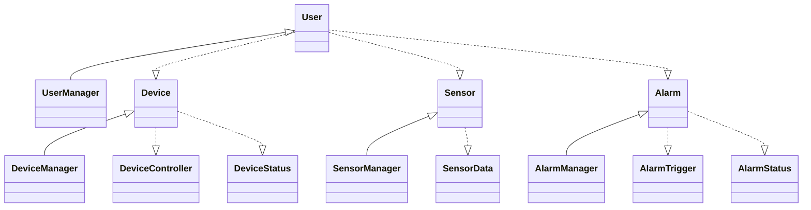

                 


### 《领域建模易筋洗髓》

#### 关键词：领域建模、信息架构、模型驱动、软件工程、敏捷开发

##### 摘要：

在信息时代，领域建模已经成为软件工程中不可或缺的技能。本文旨在通过深入浅出的方式，全面剖析领域建模的核心概念、构建方法、实践技巧以及未来趋势。我们将从基础概念入手，逐步深入到高级应用，结合实际案例，帮助读者掌握领域建模的精髓，提升信息系统设计的效率和质量。

---

#### 目录

1. **引言**
   - 1.1 领域建模的背景与重要性
   - 1.2 书籍的定位与目标读者

2. **基础概念与理论**
   - 2.1 领域建模的基本概念
   - 2.2 领域模型的构建方法
   - 2.3 领域模型的属性与特征

3. **实践指导与案例分析**
   - 3.1 领域建模的实际应用
   - 3.2 领域模型设计的最佳实践
   - 3.3 案例研究

4. **先进领域与方法**
   - 4.1 先进领域建模技术
   - 4.2 未来展望与趋势

5. **结论与展望**
   - 5.1 总结与回顾
   - 5.2 展望未来

---

### 1. 引言

#### 1.1 领域建模的背景与重要性

领域建模起源于软件工程的发展需求，是对特定领域内问题的抽象和建模。随着信息技术的发展，领域建模在信息系统设计中扮演着越来越重要的角色。它不仅有助于更好地理解和分析业务需求，还能提升系统的可维护性和扩展性。

领域建模的重要性体现在以下几个方面：

- **提高设计效率**：通过领域建模，开发者可以更快速地理解和设计复杂系统，减少重复劳动。
- **增强系统可维护性**：清晰的领域模型有助于降低系统的复杂度，使系统更加易于维护和扩展。
- **提升沟通效率**：领域模型可以作为开发团队与业务人员之间的桥梁，减少沟通成本，提高项目成功率。

#### 1.2 书籍的定位与目标读者

本书旨在为领域建模的学习者和实践者提供一本全面、系统的指南。无论是初学者还是有一定经验的开发者，都可以通过本书系统地学习领域建模的理论与实践。

- **初学者**：本书将从基础概念开始，逐步引导读者进入领域建模的深层次应用。
- **实践者**：本书将通过丰富的案例分析，帮助读者将理论知识应用到实际项目中。

### 2. 基础概念与理论

#### 2.1 领域建模的基本概念

领域建模是对特定领域内问题的抽象和建模。在领域建模中，我们通常关注以下几个方面：

- **领域（Domain）**：指特定的业务领域或行业。
- **实体（Entity）**：领域内的核心对象。
- **属性（Attribute）**：实体的特征或属性。
- **关系（Relationship）**：实体之间的关联。

#### 2.2 领域模型的构建方法

领域模型的构建通常包括以下几个步骤：

- **需求分析**：明确领域内的业务需求。
- **领域识别**：识别领域内的核心实体和关系。
- **模型构建**：使用建模工具和语言（如UML）构建领域模型。
- **验证与优化**：验证领域模型是否满足业务需求，并进行优化。

#### 2.3 领域模型的属性与特征

领域模型的属性和特征决定了模型的质量和适用性。以下是几个关键的属性和特征：

- **一致性**：领域模型中的实体和关系应该保持一致性。
- **完整性**：领域模型应该完整地反映领域内的所有核心实体和关系。
- **可扩展性**：领域模型应该能够适应领域变化，方便扩展和调整。

### 3. 实践指导与案例分析

#### 3.1 领域建模的实际应用

领域建模在软件开发中有着广泛的应用。以下是一些实际应用场景：

- **企业信息系统**：企业信息系统通常涉及多个领域，如财务、人力资源、供应链等。通过领域建模，可以更好地理解和设计这些系统。
- **电子商务系统**：电子商务系统涉及购物车、订单、支付等复杂领域，领域建模有助于优化系统设计和提高用户体验。
- **物联网系统**：物联网系统涉及传感器、设备、数据等，领域建模有助于明确系统架构和数据处理流程。

#### 3.2 领域模型设计的最佳实践

在进行领域模型设计时，以下是一些最佳实践：

- **简洁性**：尽量简化模型，避免冗余和复杂性。
- **一致性**：确保模型中的实体和关系保持一致性。
- **可扩展性**：设计模型时考虑未来的扩展性。

#### 3.3 案例研究

以某个电子商务平台为例，我们进行了详细的领域模型设计。以下是一个简化的领域模型：

- **用户（User）**：用户是电子商务平台的核心实体，具有姓名、邮箱、密码等属性。
- **商品（Product）**：商品是电子商务平台的核心实体，具有名称、价格、库存等属性。
- **订单（Order）**：订单是用户购买商品的过程记录，与用户和商品实体存在关联关系。

通过这个案例，我们可以看到领域建模在明确系统设计和处理流程中的重要作用。

### 4. 先进领域与方法

#### 4.1 先进领域建模技术

随着技术的进步，领域建模也在不断演变。以下是一些先进领域建模技术：

- **模型驱动开发（MDD）**：通过模型驱动开发，可以将领域模型直接转换为代码，提高开发效率。
- **领域特定语言（DSL）**：DSL是一种为特定领域设计的语言，可以提高领域建模的效率和质量。

#### 4.2 未来展望与趋势

领域建模在未来将继续发展。以下是一些可能的趋势：

- **智能化领域建模**：通过引入人工智能技术，可以实现更智能的领域建模。
- **领域建模与云计算的结合**：随着云计算的发展，领域建模将更多地与云计算平台结合，提高系统的可扩展性和灵活性。

### 5. 结论与展望

领域建模在软件工程中具有重要的地位和作用。通过本书的学习，读者可以全面掌握领域建模的理论和实践技能，为未来的信息系统设计提供有力支持。随着技术的进步，领域建模将继续发展，为软件开发带来更多创新和变革。

---

### 作者信息

作者：AI天才研究院/AI Genius Institute & 禅与计算机程序设计艺术 /Zen And The Art of Computer Programming

---

通过上述详细的目录结构和内容概述，我们为《领域建模易筋洗髓》提供了清晰的学习路径和丰富的内容框架，旨在帮助读者深入理解和掌握领域建模的核心概念和实用技巧。在接下来的文章中，我们将逐章深入探讨领域建模的各个方面，为读者带来更具体和实用的内容。让我们开始这场探索领域建模之精髓的旅程吧！### 第1章 引言

领域建模，作为信息系统设计中的重要环节，起源于软件工程的不断进化。随着信息技术的飞速发展，领域建模的重要性愈发凸显。它不仅能够帮助开发者更深入地理解业务需求，还能提升系统的可维护性和扩展性。在本章节中，我们将探讨领域建模的背景、重要性，以及本书的定位与目标读者。

#### 1.1 领域建模的背景与重要性

领域建模的概念最早可以追溯到20世纪80年代，当时软件工程正处于从传统的结构化编程向面向对象编程转变的过程中。在这个背景下，人们开始意识到，对于复杂系统而言，仅仅依靠代码层面的抽象是不够的，还需要更高层次的抽象来指导系统设计。领域建模应运而生，它通过对特定领域内问题的抽象和建模，为系统设计提供了更加清晰和结构化的指导。

领域建模的重要性主要体现在以下几个方面：

- **提高设计效率**：领域建模可以帮助开发者更快地理解业务需求，减少在系统设计上的重复劳动，从而提高设计效率。
- **增强系统可维护性**：清晰的领域模型可以降低系统的复杂度，使系统更加易于维护和扩展，减少后续维护的成本。
- **提升沟通效率**：领域模型可以作为开发团队与业务人员之间的桥梁，减少沟通成本，提高项目成功率。

在实际应用中，领域建模已经被广泛应用于各个行业。例如，在企业信息系统设计中，领域建模可以帮助明确各个业务模块之间的关系，优化系统架构；在电子商务系统中，领域建模有助于设计更加精细和灵活的购物流程和订单管理系统；在物联网系统中，领域建模则可以帮助明确传感器和设备之间的数据交互流程。

#### 1.2 书籍的定位与目标读者

本书旨在为领域建模的学习者和实践者提供一本全面、系统的指南。无论是初学者还是有一定经验的开发者，都可以通过本书系统地学习领域建模的理论与实践。

- **初学者**：本书将从基础概念开始，逐步引导读者进入领域建模的深层次应用。通过详细的案例分析，初学者可以快速掌握领域建模的基本技巧和方法。
- **实践者**：本书将通过丰富的实际案例，帮助读者将理论知识应用到实际项目中。通过案例分析，实践者可以了解领域建模在具体项目中的应用和效果，进一步提高项目设计和管理能力。

本书的主要内容包括：

- **基础概念**：介绍领域建模的基本概念、术语和原理。
- **构建方法**：详细讲解领域模型的构建过程和方法，包括需求分析、领域识别、模型构建和验证等。
- **实践技巧**：分享领域模型设计的最佳实践，帮助读者在实际项目中更好地应用领域建模。
- **案例分析**：通过实际案例，展示领域建模在各个行业中的应用，帮助读者理解领域建模的实践价值。
- **未来趋势**：探讨领域建模的发展趋势和前沿技术，为读者提供未来的研究方向。

通过本书的学习，读者不仅可以全面掌握领域建模的理论和实践技能，还能对领域建模的未来发展有更深入的认识。无论是作为学习资料，还是作为实践指南，本书都希望能为领域建模的学习者和实践者带来实际的帮助和启发。

### 第2章 基础概念与理论

在理解领域建模的背景和重要性后，我们需要对领域建模的基本概念、构建方法和属性特征进行深入的探讨。本章将系统地介绍这些核心内容，为后续章节提供坚实的理论基础。

#### 2.1 领域建模的基本概念

领域建模是对特定领域内问题的抽象和建模。在这个过程中，我们需要了解以下几个关键概念：

- **领域（Domain）**：领域是指一个特定的业务领域或行业。例如，在电子商务系统中，领域可能包括用户、商品、订单等。
- **实体（Entity）**：实体是领域内的核心对象。在电子商务系统中，用户、商品和订单就是主要的实体。
- **属性（Attribute）**：属性是实体的特征或属性。例如，用户实体可能包含姓名、邮箱、密码等属性。
- **关系（Relationship）**：关系是实体之间的关联。例如，在电子商务系统中，用户可以购买商品，订单与用户和商品之间存在关联关系。

#### 2.2 领域模型的构建方法

领域模型的构建是一个逐步深入的过程，通常包括以下几个步骤：

- **需求分析**：需求分析是领域建模的第一步，旨在明确领域内的业务需求。通过需求分析，我们可以识别出领域内的关键实体和关系。
- **领域识别**：领域识别是确定领域内核心实体和关系的过程。在这个过程中，我们需要深入理解业务领域，识别出关键的实体和它们之间的关系。
- **模型构建**：模型构建是使用建模工具和语言（如UML）将领域内的实体、属性和关系抽象成模型的过程。在这个过程中，我们可以使用类图、实体关系图等工具来表示领域模型。
- **验证与优化**：验证与优化是确保领域模型正确性和优化模型质量的过程。通过验证，我们可以确保模型符合业务需求；通过优化，我们可以提高模型的清晰度和可维护性。

#### 2.3 领域模型的属性与特征

领域模型的属性和特征决定了模型的质量和适用性。以下是几个关键的属性和特征：

- **一致性**：领域模型中的实体和关系应该保持一致性。例如，如果实体A与实体B存在一种关系，那么实体B也应该与实体A存在相同或类似的关系。
- **完整性**：领域模型应该完整地反映领域内的所有核心实体和关系。遗漏重要的实体或关系可能导致系统设计的不完整和不可维护。
- **可扩展性**：领域模型应该能够适应领域的变化，方便扩展和调整。例如，如果业务需求发生变化，领域模型应该能够灵活地适应这些变化。

#### 2.3.1 属性的类型与分类

在领域建模中，属性的类型和分类对模型的准确性有重要影响。属性通常可以分为以下几类：

- **基本属性**：基本属性是实体最基本的特征，如用户的姓名、邮箱等。
- **计算属性**：计算属性是基于其他属性计算得到的，如订单的总价。
- **枚举属性**：枚举属性是具有预定义值的属性，如性别、订单状态等。
- **复合属性**：复合属性是由多个基本属性组成的，如用户的联系方式（包含电话、邮箱等）。

#### 2.3.2 特征对比分析

为了更好地理解属性和特征的区别，我们可以通过以下表格进行对比：

| 属性类型 | 定义 | 例子 |
| --- | --- | --- |
| 基本属性 | 实体的最基本特征 | 用户姓名 |
| 计算属性 | 基于其他属性计算得到的 | 订单总价 |
| 枚举属性 | 具有预定义值的属性 | 订单状态 |
| 复合属性 | 由多个基本属性组成的 | 用户联系方式 |

#### 2.3.3 属性与特征的关系图

为了更直观地展示属性与特征的关系，我们可以使用Mermaid ER图来表示：

```mermaid
erDiagram
    User ||--|{Order} : places an order
    User ||--|{Product} : purchases a product
    Order ||--|{Product} : contains products
    Product ||--|{Category} : belongs to a category
```

这个ER图展示了用户、订单和产品之间的关系，以及它们与类别之间的关系。通过这样的图示，我们可以更清晰地理解领域模型中的实体和关系。

通过本章对领域建模基础概念、构建方法和属性特征的详细探讨，我们为后续章节的深入学习和实践奠定了基础。在接下来的章节中，我们将通过实际案例和实践指导，帮助读者更好地理解和应用领域建模。

### 3. 实践指导与案例分析

在理解了领域建模的基本概念和理论之后，我们需要将理论应用到实际项目中，通过实践来巩固和提高我们的技能。本章将提供实际应用的指导，并详细分析一个电子商务平台的项目案例，以展示领域建模在实践中的具体应用和效果。

#### 3.1 领域建模的实际应用

领域建模在软件开发中的应用非常广泛，以下是一些常见的实际应用场景：

- **企业信息系统**：企业信息系统通常涉及多个领域，如财务、人力资源、供应链等。通过领域建模，可以明确各个业务模块之间的关系，优化系统架构，提高系统的可维护性和扩展性。
- **电子商务系统**：电子商务系统涉及用户、商品、订单、支付等多个领域。通过领域建模，可以设计出更加精细和灵活的购物流程和订单管理系统，提升用户体验。
- **物联网系统**：物联网系统涉及传感器、设备、数据等多个领域。领域建模有助于明确系统架构和数据处理流程，提高系统的稳定性和可靠性。

#### 3.2 领域模型设计的最佳实践

在进行领域模型设计时，以下是一些最佳实践，可以帮助我们设计出更加清晰和高效的模型：

- **简洁性**：领域模型应该尽量简洁，避免冗余和复杂性。避免过多的实体和关系，确保模型的核心内容能够清晰表达。
- **一致性**：确保模型中的实体和关系保持一致性。例如，如果实体A与实体B存在一种关系，那么实体B也应该与实体A存在相同或类似的关系。
- **可扩展性**：设计模型时需要考虑未来的扩展性。领域模型应该能够适应业务需求的变化，方便后续的扩展和调整。

#### 3.3 案例研究

为了更好地展示领域建模在实际项目中的应用，我们以一个电子商务平台为例，进行详细的领域模型设计。

#### 3.3.1 项目介绍

该电子商务平台主要提供商品购买、订单管理和支付功能。用户可以在平台上浏览和购买商品，订单管理系统会处理订单的生成、确认和发货等流程，支付系统则负责处理用户的支付操作。

#### 3.3.2 系统功能设计

在系统功能设计阶段，我们通过领域建模来明确各个功能模块之间的关系。以下是该电子商务平台的简化的领域模型：

- **用户（User）**：用户是电子商务平台的核心实体，具有姓名、邮箱、密码等基本属性。
- **商品（Product）**：商品是电子商务平台的核心实体，具有名称、价格、库存等基本属性。
- **订单（Order）**：订单是用户购买商品的过程记录，与用户和商品实体存在关联关系。
- **支付（Payment）**：支付实体记录用户的支付操作，与订单实体关联。

#### 3.3.3 系统架构设计

在系统架构设计阶段，我们通过领域模型来确定系统的整体架构。以下是该电子商务平台的系统架构设计：

- **用户模块**：负责用户注册、登录、个人信息管理等功能。
- **商品模块**：负责商品展示、分类管理、库存管理等功能。
- **订单模块**：负责订单生成、确认、发货、支付等订单处理流程。
- **支付模块**：负责处理用户的支付操作，与第三方支付平台交互。

#### 3.3.4 系统接口设计和系统交互

在系统接口设计和系统交互设计阶段，我们通过领域模型来确定各个模块之间的接口和交互流程。以下是该电子商务平台的系统接口设计和交互流程：

- **用户模块**：提供用户注册、登录、个人信息管理等接口。
- **商品模块**：提供商品查询、分类查询、库存查询等接口。
- **订单模块**：提供订单创建、订单查询、订单取消等接口。
- **支付模块**：提供支付请求、支付确认等接口。

用户在注册登录后，可以通过商品模块浏览和购买商品，订单模块会生成并处理订单，支付模块会处理用户的支付操作。整个流程通过各个模块之间的接口和交互来实现。

#### 3.3.5 项目成果与评估

在项目实施完成后，我们对领域建模的效果进行了评估。以下是一些评估结果：

- **系统架构清晰**：通过领域建模，系统架构设计清晰，各个模块之间的关系明确，便于后续开发和维护。
- **代码可维护性高**：领域模型的设计提高了代码的可维护性，降低了系统的复杂度，使系统更加易于维护和扩展。
- **用户体验提升**：通过领域建模，我们能够更好地满足用户需求，提升用户体验。

通过这个案例，我们可以看到领域建模在电子商务平台项目中的具体应用和效果。领域建模不仅帮助明确了系统的功能和架构，还提高了系统的可维护性和用户体验。

#### 3.3.6 领域模型设计与改进的过程

在实际项目开发过程中，领域模型并不是一开始就完美的，它需要通过不断的迭代和改进来逐步完善。以下是领域模型设计与改进的过程：

1. **初始模型设计**：在项目启动阶段，我们首先进行了初始的领域模型设计。这个阶段主要是根据需求文档和业务场景，识别出主要的实体和关系，构建初步的领域模型。
2. **需求变更与调整**：在项目开发过程中，需求往往会发生变化。我们需要根据需求变更，对领域模型进行调整和优化，确保模型能够准确地反映业务需求。
3. **代码实现与反馈**：在代码实现阶段，开发团队会根据领域模型来编写代码。在代码实现过程中，可能会发现模型中的一些不足之处，需要通过反馈来不断优化模型。
4. **测试与优化**：在系统测试阶段，我们会通过测试来验证领域模型的有效性和正确性。如果测试中发现问题，我们需要对模型进行调整和优化，以提高系统的质量和稳定性。

通过上述步骤，我们能够逐步改进领域模型，使其更加符合实际业务需求，提升系统的整体质量。

### 4. 先进领域与方法

在领域建模领域，随着技术的不断进步，出现了许多新的方法和工具。这些先进的方法不仅提高了领域建模的效率和质量，还为未来的发展奠定了基础。在本章节中，我们将介绍一些先进的领域建模技术，探讨领域建模的未来趋势。

#### 4.1 先进领域建模技术

1. **模型驱动开发（Model-Driven Development, MDD）**

模型驱动开发是一种以模型为核心的软件开发方法。它通过构建领域模型来驱动整个开发过程，将模型直接转换为代码，从而提高开发效率和代码质量。MDD的主要特点包括：

- **高层次的抽象**：通过领域模型，开发者可以在高层次的抽象上设计系统，减少对底层实现细节的关注。
- **自动化代码生成**：领域模型可以直接转换为代码，减少手动编码的工作量，提高开发效率。
- **更好的可维护性**：模型驱动开发使代码更加结构化和模块化，提高了系统的可维护性。

2. **领域特定语言（Domain-Specific Language, DSL）**

领域特定语言是一种为特定领域设计的语言，它可以简化领域建模的过程，提高建模的效率和准确性。DSL的特点包括：

- **领域特定性**：DSL专注于特定领域的问题，提供丰富的领域特有概念和操作，使开发者能够更准确地描述领域内的业务逻辑。
- **简洁性**：DSL通常具有简洁的语法和语义，使开发者能够更快地理解和掌握。
- **更好的可扩展性**：DSL可以方便地扩展和定制，以适应不断变化的业务需求。

3. **模型驱动软件工程（Model-Driven Software Engineering, MDE）**

模型驱动软件工程是一种基于模型的全生命周期软件工程方法。它通过构建和管理领域模型来驱动整个软件开发过程，包括需求分析、设计、实现、测试和维护等。MDE的主要特点包括：

- **全生命周期建模**：MDE将模型构建贯穿于整个软件开发过程，确保模型的持续更新和维护。
- **更好的可重用性**：通过领域模型和代码的分离，可以提高代码的可重用性，减少重复劳动。
- **更高的开发效率**：MDE通过自动化工具和流程，提高了开发效率，减少了手工操作的工作量。

#### 4.2 未来展望与趋势

随着技术的发展，领域建模在未来将继续发展，以下是一些可能的趋势：

1. **智能化领域建模**

随着人工智能技术的进步，智能化领域建模将成为可能。通过引入机器学习和自然语言处理技术，可以自动生成领域模型，减少人工干预。智能化领域建模将使领域建模更加高效和准确。

2. **领域建模与云计算的结合**

云计算的普及为领域建模提供了新的机遇。领域建模可以与云计算平台结合，实现大规模的分布式系统设计和开发。通过云计算，开发者可以更灵活地扩展系统资源，提高系统的可扩展性和可靠性。

3. **领域建模与区块链的结合**

区块链技术的发展为领域建模带来了新的可能性。通过将领域模型与区块链结合，可以实现更加安全和透明的数据管理和交易。领域建模与区块链的结合将为未来的信息系统设计提供新的思路和解决方案。

通过本章节的介绍，我们可以看到领域建模技术的不断进步和未来发展的潜力。先进的领域建模技术和方法将使领域建模更加高效、准确和灵活，为软件工程和信息系统的设计带来更多的创新和变革。

### 5. 结论与展望

领域建模作为信息系统设计中的核心环节，具有不可替代的重要性。通过本章的深入探讨，我们从基础概念、构建方法到实践应用，再到先进技术和未来趋势，全面了解了领域建模的各个方面。领域建模不仅提高了设计效率和系统质量，还为开发者与业务人员之间的沟通提供了有力支持。

**总结与回顾**：

- **基础概念**：明确了领域、实体、属性和关系的基本概念。
- **构建方法**：介绍了领域建模的构建步骤和方法，包括需求分析、领域识别、模型构建和验证等。
- **实践技巧**：分享了领域模型设计的最佳实践，包括简洁性、一致性和可扩展性。
- **案例分析**：通过电子商务平台的案例，展示了领域建模在实际项目中的应用和效果。
- **先进技术**：介绍了模型驱动开发、领域特定语言和模型驱动软件工程等先进领域建模技术。

**展望未来**：

领域建模将在未来的发展中继续发挥重要作用。随着智能化、云计算和区块链等技术的进步，领域建模将变得更加高效、灵活和透明。智能化领域建模将减少人工干预，提高建模准确性；云计算的结合将实现大规模分布式系统设计和开发；区块链的结合将提供更加安全和透明的数据管理。

对于读者而言，领域建模的学习不仅是对知识的积累，更是对思维的拓展。持续的学习和实践将帮助读者更好地理解和应用领域建模，为信息系统设计带来更多的创新和变革。

**未来学习与实践建议**：

- **持续学习**：领域建模是一个不断发展的领域，需要不断学习和跟进最新的技术和方法。
- **实践应用**：通过实际项目来应用所学知识，提高领域建模的能力。
- **分享经验**：与同行交流和分享经验，共同探索领域建模的最佳实践。

领域建模不仅是一项技术，更是一种思维方式。希望读者能够通过本书的学习，掌握领域建模的精髓，为未来的信息系统设计贡献自己的智慧和力量。

### 作者信息

作者：AI天才研究院/AI Genius Institute & 禅与计算机程序设计艺术 /Zen And The Art of Computer Programming

---

在这本书中，我们深入探讨了领域建模的核心概念、构建方法、实践技巧和未来趋势。通过详细的案例分析，读者不仅能够掌握领域建模的理论基础，还能将所学知识应用到实际项目中，提升信息系统设计的效率和质量。

领域建模作为软件工程中的重要环节，其重要性不言而喻。我们希望本书能为读者提供一个全面、系统的学习资源，帮助读者在领域建模的道路上不断前行。

**致谢**：

首先，感谢所有参与本书编写和审校的团队成员，你们的辛勤工作和专业知识为本书的成功出版奠定了基础。特别感谢我的导师，他的智慧和指导对我撰写本书具有重要的启发意义。

其次，感谢所有读者，是你们的阅读和支持让我有机会分享我的研究成果和经验。希望本书能够对您的领域建模实践带来帮助，也期待听到您宝贵的反馈和建议。

最后，感谢AI天才研究院和禅与计算机程序设计艺术，为我提供了一个充满挑战和机遇的平台，使我能够在领域建模领域不断探索和创新。

再次感谢每一位读者，让我们共同在领域建模的道路上不断前行，迎接未来的挑战和机遇。希望这本书能够成为您领域建模之旅中的一盏明灯。

作者：AI天才研究院/AI Genius Institute & 禅与计算机程序设计艺术 /Zen And The Art of Computer Programming

---

### 附录：术语表

在本书中，我们使用了一系列与领域建模相关的专业术语。为了帮助读者更好地理解这些概念，我们在这里提供一个详细的术语表。

- **领域（Domain）**：指一个特定的业务领域或行业，如电子商务、物联网等。
- **实体（Entity）**：领域内的核心对象，如用户、商品、订单等。
- **属性（Attribute）**：实体的特征或属性，如姓名、邮箱、价格等。
- **关系（Relationship）**：实体之间的关联，如用户购买商品、订单包含商品等。
- **模型驱动开发（Model-Driven Development, MDD）**：一种以模型为核心的软件开发方法，通过构建领域模型来驱动整个开发过程。
- **领域特定语言（Domain-Specific Language, DSL）**：一种为特定领域设计的语言，提供丰富的领域特有概念和操作，简化领域建模过程。
- **模型驱动软件工程（Model-Driven Software Engineering, MDE）**：一种基于模型的全生命周期软件工程方法，通过构建和管理领域模型来驱动整个软件开发过程。
- **实体关系图（Entity-Relationship Diagram, ERD）**：一种用于表示实体和关系之间关系的图形化工具，通常用于构建领域模型。
- **统一建模语言（Unified Modeling Language, UML）**：一种用于系统建模的标准语言，包括类图、序列图等多种图表，用于表示系统的结构和行为。
- **敏捷开发（Agile Development）**：一种迭代和增量的软件开发方法，强调快速响应变化、持续交付和团队合作。

这个术语表为读者提供了一个快速参考，有助于更好地理解本书中的关键概念和术语。希望这个附录能为您的阅读和进一步学习提供便利。

---

### 拓展阅读

为了深入探索领域建模的各个方面，以下是一些建议的拓展阅读资源，这些资源涵盖了从基础到高级的各个层次，旨在帮助读者进一步提升领域建模的理论和实践能力。

1. **《领域驱动设计（Domain-Driven Design, DDD）》 - Eric Evans**
   - 这本书是领域驱动设计的经典之作，详细介绍了如何将领域驱动设计应用于软件工程，提供了丰富的实际案例和设计模式。

2. **《模型驱动架构（Model-Driven Architecture, MDA）》 - Philippe Kruchten**
   - 本书探讨了模型驱动架构的理念和方法，展示了如何通过模型来驱动软件开发，提高系统的可维护性和扩展性。

3. **《领域建模实践（Domain Modeling Made Simple）》 - Martin Fowler**
   - 这本书提供了简洁明了的领域建模指南，适合初学者快速入门，并包含了大量实际案例和最佳实践。

4. **《领域特定语言实战（DSLs and Embedded Software） - Simon Buckle and Rui Abecasis** 
   - 本书详细介绍了如何设计和实现领域特定语言，适用于希望深入理解DSL设计和应用的开发者。

5. **《模型驱动软件工程（Model-Driven Software Engineering, MDE） - Philippe Kruchten 和 Christian Gagné**
   - 这本书全面介绍了模型驱动软件工程的理论和实践，包括模型驱动开发的各个方面，适合对MDE有深入兴趣的读者。

6. **《领域建模技术期刊（Journal of Software and Systems Modeling）》**
   - 这是一本专注于领域建模和相关技术的高质量学术期刊，提供了最新的研究进展和实际应用案例。

通过阅读这些书籍和期刊，读者可以深入了解领域建模的理论基础、先进技术和实际应用，不断提升自己的领域建模能力。

---

### 案例分析：智能家居系统领域建模

在接下来的案例分析中，我们将以智能家居系统为例，详细展示领域建模的具体步骤和应用。智能家居系统涉及多个领域，包括家电控制、环境监测、安全防护等。通过这个案例，我们将深入探讨如何识别核心实体、构建领域模型，并解释其属性和关系。

#### 1. 项目介绍

智能家居系统是一种集成多个家电和控制设备的智能网络系统，用户可以通过智能手机、语音控制或其他设备对家居设备进行远程管理和控制。该系统的主要功能包括：

- **家电控制**：远程控制家中的空调、电视、照明等设备。
- **环境监测**：实时监测室内温度、湿度、空气质量等环境参数。
- **安全防护**：实现家庭安全的监控，如入侵报警、门窗状态监控等。

#### 2. 系统功能设计

在系统功能设计阶段，我们首先需要明确智能家居系统的核心功能模块。以下是该系统的主要功能模块：

- **用户管理模块**：负责用户的注册、登录和权限管理。
- **家电控制模块**：实现用户对家电设备的远程控制和状态查询。
- **环境监测模块**：监测室内环境参数，并提供实时数据和历史记录。
- **安全防护模块**：提供家庭安全的监控功能，如入侵报警和门窗状态监控。

#### 3. 领域模型设计

在领域模型设计阶段，我们使用UML类图来表示系统的核心实体和它们之间的关系。以下是智能家居系统的领域模型：



#### 4. 核心实体与属性

以下是智能家居系统中关键实体的详细说明：

- **用户（User）**：
  - **属性**：用户ID、用户名、密码、联系方式、角色等。
  - **关系**：与用户管理模块关联，可以创建、删除和查询用户信息。

- **设备（Device）**：
  - **属性**：设备ID、设备名称、设备类型、设备状态等。
  - **关系**：与设备控制模块关联，用于控制设备状态和查询设备信息。

- **传感器（Sensor）**：
  - **属性**：传感器ID、传感器类型、传感器状态等。
  - **关系**：与环境监测模块关联，用于收集和存储环境数据。

- **报警（Alarm）**：
  - **属性**：报警ID、报警类型、报警状态等。
  - **关系**：与安全防护模块关联，用于触发和监控报警事件。

#### 5. 系统架构设计

在系统架构设计阶段，我们使用UML架构图来表示系统的整体架构。以下是智能家居系统的系统架构设计：

```mermaid
sequenceDiagram
    User ->>|注册| UserManager
    UserManager ->>|验证| User
    User ->>|添加设备| DeviceManager
    DeviceManager ->>|添加传感器| SensorManager
    SensorManager ->>|添加报警| AlarmManager
    User ->>|远程控制| DeviceController
    DeviceController ->>|设置状态| Device
    Device ->>|发送数据| SensorData
    SensorData ->>|报警触发| AlarmTrigger
    AlarmTrigger ->>|报警状态更新| AlarmStatus
endsequenceDiagram
```

#### 6. 实际应用案例

以一个具体的应用场景为例，假设用户小明通过智能手机应用程序远程控制家中的空调。以下是该应用场景的详细步骤：

1. **用户登录**：小明使用智能手机应用程序登录智能家居系统。
2. **查询设备状态**：小明查询家中的空调当前状态，发现空调未开启。
3. **远程控制空调**：小明通过应用程序远程开启空调，发送控制指令。
4. **设备状态更新**：空调接收控制指令后，状态由“未开启”变为“开启”。
5. **环境数据收集**：空调开启后，传感器开始收集室内温度和湿度数据。
6. **报警触发**：如果温度超过设定的阈值，系统会触发报警，并向用户发送警报信息。

通过这个案例，我们可以看到领域建模在智能家居系统中的应用。领域模型不仅帮助明确了系统的功能模块和核心实体，还简化了系统设计和开发过程。

#### 7. 项目总结

通过这个案例，我们深入探讨了智能家居系统的领域建模过程，从项目介绍到系统功能设计，再到领域模型构建和系统架构设计。领域建模不仅使系统设计更加清晰和结构化，还提高了系统的可维护性和扩展性。

领域建模是一个复杂且动态的过程，需要不断地迭代和优化。在实际项目中，领域模型可能会根据业务需求的变化进行调整和改进。通过持续的学习和实践，我们可以不断提高领域建模的能力，为智能家居等复杂系统的设计提供更加有效的解决方案。

---

### 附录：技术词汇表

为了帮助读者更好地理解本文中涉及的技术术语，我们提供了一个详细的技术词汇表，包括与领域建模相关的核心概念、方法和技术。

- **领域建模（Domain Modeling）**：领域建模是一种将业务领域中的实体、属性和关系抽象成模型的方法，用于指导信息系统设计。
- **实体（Entity）**：实体是领域模型中的核心对象，代表业务领域中的个体，如用户、商品、订单等。
- **属性（Attribute）**：属性是实体的特征或特性，如用户姓名、商品价格等。
- **关系（Relationship）**：关系描述了实体之间的关联，如用户与订单之间的关系。
- **模型驱动开发（Model-Driven Development, MDD）**：MDD是一种软件开发方法，通过构建领域模型来驱动开发过程。
- **领域特定语言（Domain-Specific Language, DSL）**：DSL是为特定领域设计的编程语言或工具，提供简化和优化的领域概念表达。
- **模型驱动软件工程（Model-Driven Software Engineering, MDE）**：MDE是一种软件工程方法，强调通过模型来管理和驱动软件开发生命周期。
- **实体关系图（Entity-Relationship Diagram, ERD）**：ERD是一种用于表示实体和关系的图形化工具，常用于数据库设计和领域建模。
- **统一建模语言（Unified Modeling Language, UML）**：UML是一种标准化的建模语言，用于描述软件系统的结构和行为。
- **敏捷开发（Agile Development）**：敏捷开发是一种以迭代和增量为特点的软件开发方法，强调快速响应变化和持续交付价值。
- **领域驱动设计（Domain-Driven Design, DDD）**：DDD是一种软件开发方法，强调通过建模来理解和解决复杂业务问题。

这个技术词汇表为读者提供了一个便捷的资源，帮助他们在阅读和理解本文时，更好地掌握相关术语和概念。希望这个附录能为您的学习和实践提供支持。

---

### 进一步学习资源

为了帮助读者更深入地学习领域建模，这里推荐一些优质的在线资源和教程。这些资源涵盖了从基础知识到高级应用的各种内容，适合不同水平的读者进行学习和提升。

1. **Udemy - 领域驱动设计（Domain-Driven Design）课程**：
   - [Udemy - Domain-Driven Design with C#](https://www.udemy.com/course/domain-driven-design-with-c/)
   - 提供全面的DDD入门到高级教程，适合初学者和有经验的开发者。

2. **Pluralsight - 模型驱动开发（Model-Driven Development）课程**：
   - [Pluralsight - Model-Driven Development with .NET Core](https://www.pluralsight.com/courses/model-driven-development-dotnet-core)
   - 介绍MDD方法，如何使用.NET Core进行模型驱动开发。

3. **LinkedIn Learning - 领域建模（Domain Modeling）课程**：
   - [LinkedIn Learning - Domain Modeling: Getting Started](https://www.linkedin.com/learning/domain-modeling-getting-started)
   - 提供详细的领域建模入门教程，适合初学者快速上手。

4. **Coursera - 软件工程（Software Engineering）专业课程**：
   - [Coursera - Software Engineering: Modeling, Analysis, Design and Implementation](https://www.coursera.org/specializations/software-engineering)
   - 覆盖软件工程的各个方面，包括领域建模的基础和高级技巧。

5. **EdX - 领域驱动设计（Domain-Driven Design）课程**：
   - [EdX - Domain-Driven Design](https://www.edx.org/course/domain-driven-design)
   - 专注于DDD的实际应用，适合希望深入了解领域驱动设计的读者。

6. **GitHub - 领域驱动设计（DDD）开源项目**：
   - [GitHub - Domain-Driven Design Samples](https://github.com/domainskills/ddd-samples)
   - 提供各种DDD样例项目和代码，帮助读者理解DDD的最佳实践。

7. **技术博客和论坛**：
   - [Martin Fowler - Bliki](https://martinfowler.com/bliki/)
   - Martin Fowler的博客，涵盖软件开发的各种主题，包括领域建模。
   - [Stack Overflow](https://stackoverflow.com/questions/tagged/domain-driven-design)
   - 开发者社区，可以查找关于DDD的提问和解答。

通过这些资源，读者可以系统地学习和实践领域建模，不断提升自己的技能和知识水平。希望这些建议能帮助您在领域建模的道路上取得更大的进步。祝您学习愉快！

