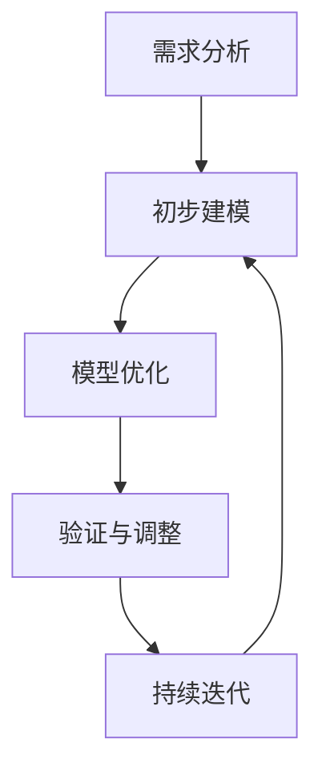

                 

### 引言与背景

#### 领域建模的定义与重要性

领域建模（Domain Modeling）是信息系统开发和设计过程中的一个关键步骤，它旨在将业务需求和问题领域抽象为一种可操作的模型。领域建模不仅仅是一个技术活动，它更是一种理解和解决问题的方法论。通过对业务领域的深入分析和抽象，领域建模能够帮助开发人员更好地理解业务逻辑，提高系统设计的准确性和效率。

领域建模的重要性体现在以下几个方面：

1. **需求理解**：领域建模是需求分析的高级阶段，它能够帮助开发人员深入理解业务需求和用户需求，确保系统能够满足业务实际需求。

2. **设计优化**：通过领域建模，开发人员能够更清晰地定义系统架构和设计，优化系统性能和可维护性。

3. **跨部门协作**：领域模型作为一种通用语言，可以帮助不同部门（如业务部门、开发部门、测试部门）之间进行有效沟通，减少误解和沟通成本。

4. **复用性**：良好的领域建模能够提高代码和设计的复用性，减少重复劳动，提高开发效率。

#### 领域建模的发展历程

领域建模的概念可以追溯到20世纪70年代，当时为了应对复杂系统的需求，人们开始探索如何将业务规则和逻辑抽象为一种模型。早期的领域建模主要基于实体-关系（Entity-Relationship，ER）模型，它通过实体和关系的组合来描述系统的结构。随着信息技术的发展，领域建模的方法和技术也在不断演进。

1. **实体-关系模型**：这是最早的领域建模方法，它通过实体和实体之间的关系来描述系统的结构。虽然简单易懂，但它不足以描述复杂系统的动态行为和约束。

2. **统一建模语言（UML）**：UML的出现标志着领域建模进入了一个新的阶段。UML提供了一系列图形化的建模工具，如类图、序列图、组件图等，使得领域建模更加直观和易于理解。

3. **领域特定语言（DSL）**：随着领域建模的深入发展，人们开始探索如何为特定领域开发专门的建模语言，以提高建模的准确性和效率。DSL能够更好地表达特定领域的概念和规则，提高开发人员的生产效率。

4. **云计算与大数据**：在云计算和大数据的推动下，领域建模开始与云计算架构和大数据技术相结合，形成了一种新的领域建模方法，如基于云计算的领域建模和大数据驱动的领域分析。

#### 领域建模的边界与外延

领域建模虽然是一种通用方法，但它也有明确的边界。首先，领域建模主要关注业务领域，而不是技术领域。这意味着领域建模应该侧重于业务逻辑和业务规则，而不是具体的实现技术。

领域建模的外延包括：

1. **业务流程建模**：通过建模业务流程，可以更好地理解业务操作和业务流程之间的关系。

2. **数据建模**：数据建模是领域建模的一个重要组成部分，它通过定义数据实体和数据关系来描述系统的数据结构。

3. **服务建模**：在面向服务的架构（SOA）中，服务建模是领域建模的一个关键环节，它通过定义服务和服务接口来描述系统的服务结构。

4. **应用架构建模**：应用架构建模是基于领域建模的结果，进一步描述系统的应用架构，包括应用组件、接口和交互。

总之，领域建模是一个复杂而关键的过程，它对于确保信息系统开发和设计的高效和成功至关重要。通过理解领域建模的定义、重要性、发展历程以及边界与外延，我们可以更好地掌握这一技术，并将其应用于实际的项目中。

#### 领域建模的基本概念

领域建模是信息系统设计和开发中的核心步骤，其基础概念和术语的清晰理解对整个建模过程至关重要。以下将详细介绍领域建模中的几个基本概念，包括实体与属性、关联与关系、实体属性特征对比表格，以及ER实体关系图的架构。

##### 实体与属性

**实体（Entity）**：实体是领域建模中的基本构建块，它代表领域中的具体对象。例如，在一个电子商务系统中，实体可能包括用户、订单、商品等。实体是领域中最基本的单位，可以通过其属性来描述。

**属性（Attribute）**：属性是实体的特征或性质。每个实体都可以有一组属性来定义。例如，用户实体可以具有用户名、密码、电子邮件等属性。属性可以用来存储和检索实体的相关信息。

在领域建模中，实体和属性是密切相关的。实体定义了对象的存在，而属性则提供了关于这些对象的详细信息。

##### 关联与关系

**关联（Association）**：关联描述了实体之间的联系。例如，在电子商务系统中，用户和订单之间有一个关联，表示每个用户可以创建多个订单。关联是实体之间传递信息和数据的基础。

**关系（Relationship）**：关系是对关联的进一步细化，它描述了实体之间的语义和约束。关系可以是“一对一”（1:1）、“一对多”（1:N）或“多对多”（M:N）。例如，一个用户可以有一个地址，这是一个一对一的关系；一个订单可以有多个商品，这是一个一对多的关系。

在领域建模中，关联和关系是描述系统结构的关键概念，它们帮助定义系统中对象之间的交互和数据流动。

##### 实体属性特征对比表格

为了更好地理解实体和属性之间的关系，我们可以使用实体属性特征对比表格。以下是一个简单的示例：

| 实体名 | 属性名 | 属性类型 | 是否必填 | 描述 |
| :----: | :----: | :----: | :----: | :----: |
| 用户 | 用户名 | 字符串 | 是 | 用户在系统中的唯一标识 |
| 用户 | 密码 | 字符串 | 是 | 用户登录系统时的凭证 |
| 用户 | 电子邮件 | 字符串 | 是 | 用户联系信息的电子邮箱地址 |
| 订单 | 订单编号 | 整数 | 是 | 订单的唯一标识 |
| 订单 | 下单时间 | 日期时间 | 是 | 订单生成的具体时间 |
| 订单 | 用户ID | 整数 | 是 | 订单所属的用户ID |

这个表格展示了不同实体及其属性的详细信息，包括属性的类型、是否必填以及描述。这样的表格有助于开发人员在设计和实现系统时准确理解和处理实体属性。

##### ER实体关系图架构

ER（实体-关系）实体关系图是领域建模中常用的工具，用于直观地表示实体和它们之间的关系。以下是一个简单的ER实体关系图示例，使用Mermaid语法表示：

```mermaid
erDiagram
  用户 ||--|{ 订单 }
  订单 ||--|{ 商品 }
  商品 ||--|{ 订单 }
```

这个ER图表示了三个实体：用户、订单和商品，以及它们之间的关联和关系。实线表示一对一或一对多的关系，而虚线表示多对多的关系。通过ER图，我们可以直观地理解系统的结构和关系。

在领域建模过程中，ER实体关系图是一个关键工具，它不仅帮助开发者更好地理解系统结构，还可以作为沟通和协作的媒介，确保所有利益相关者对系统设计有共同的理解。

通过上述对实体与属性、关联与关系的介绍，以及实体属性特征对比表格和ER实体关系图的解释，我们能够深入理解领域建模的基本概念。这些基本概念是领域建模的基石，对于确保领域建模的准确性和有效性至关重要。

#### 易筋洗髓的基本原理

易筋洗髓是一种古老的养生修炼方法，其起源可以追溯到中国古代的道家文化和武术修炼。在现代信息技术领域，易筋洗髓的概念被引申并应用于领域建模中，以提升建模的效率和准确性。以下是易筋洗髓在领域建模中的基本原理和核心思想。

##### 易筋洗髓的起源与发展

易筋洗髓法最早记载于《易筋经》一书，该书成书于明代，由道家修炼家和武术家所编写。《易筋经》讲述了通过特定的动作和呼吸方法，加强身体内部的筋骨和脏腑功能，以达到强身健体和延年益寿的目的。这一修炼方法在武术界被广泛应用，并在历代武术家之间传承和发展。

在信息技术领域，易筋洗髓的概念被提出并应用于领域建模，旨在借鉴其原理和方法，通过系统的梳理和重构，提升领域建模的效率和准确性。易筋洗髓在领域建模中的应用，可以追溯到20世纪90年代，当时一些IT专家开始探索如何将传统修炼方法与现代技术相结合，以解决复杂系统设计和建模中的问题。

##### 易筋洗髓的核心思想

易筋洗髓的核心思想主要包括以下几个方面：

1. **整体观**：易筋洗髓强调人体是一个整体，各个部分相互联系、相互影响。在领域建模中，这一思想体现为对系统整体的深入理解，通过综合考虑各个子系统之间的关系，进行全局优化。

2. **层次化**：易筋洗髓通过将复杂的修炼过程分解为不同层次，逐层修炼，以达到整体提升的目的。在领域建模中，层次化思想体现在将复杂系统分解为多个层次，逐步建模和优化，确保每个层次的设计都满足整体需求。

3. **动态调整**：易筋洗髓强调根据实际情况进行调整和优化，以适应不同的环境和需求。在领域建模中，这一思想体现在对模型不断调整和优化，以应对不断变化的业务需求和系统约束。

4. **持续迭代**：易筋洗髓强调修炼是一个持续的过程，需要不断实践和调整。在领域建模中，这一思想体现为对建模过程的不断迭代和改进，确保模型始终与业务需求保持一致。

##### 易筋洗髓的技术特点

易筋洗髓在领域建模中的应用具有以下几个显著的技术特点：

1. **系统性**：易筋洗髓方法注重系统的整体性和协调性，通过系统性思维来分析和解决领域建模问题。

2. **层次化**：易筋洗髓将复杂问题分解为多个层次，逐层进行建模和优化，确保每个层次的设计都满足整体需求。

3. **灵活性**：易筋洗髓方法强调根据实际情况进行调整和优化，使模型能够适应不断变化的业务需求和系统约束。

4. **迭代性**：易筋洗髓方法强调持续迭代和改进，通过不断实践和调整，确保建模过程的逐步优化和提升。

通过易筋洗髓的基本原理和核心思想的引入，领域建模能够更好地应对复杂系统的设计和实现。易筋洗髓的系统性、层次化、灵活性和迭代性特点，为领域建模提供了新的思路和方法，帮助开发人员更加高效和准确地构建和维护复杂系统。

#### 易筋洗髓的过程与步骤

易筋洗髓在领域建模中的应用，不仅仅是一种理念，更是一个需要具体操作和实践的过程。以下是易筋洗髓的具体步骤和过程，通过这些步骤，我们可以系统地梳理和优化领域模型。

##### 洗髓过程分析

易筋洗髓的过程可以分为以下几个步骤：

1. **需求分析**：首先，我们需要对业务领域进行详细的需求分析，理解业务目标和需求。这一步骤是整个建模过程的基础，决定了后续建模的准确性和有效性。

2. **初步建模**：在需求分析的基础上，进行初步的领域建模。这一步主要是通过实体和关系的组合，将业务需求转化为初步的领域模型。

3. **模型优化**：初步模型完成后，对其进行优化和调整。这一步是易筋洗髓的核心步骤，通过层次化、整体观等原理，对模型进行深度分析和重构，以提高模型的准确性和效率。

4. **验证与调整**：模型优化后，需要进行验证和调整。这一步包括对模型进行测试和评估，确保模型能够满足业务需求，并根据反馈进行必要的调整。

5. **持续迭代**：领域建模是一个持续的过程，需要不断地进行迭代和优化。通过持续迭代，可以逐步完善模型，确保其与业务需求保持一致。

##### 易筋原理阐述

易筋洗髓的原理主要包括以下几个方面：

1. **整体观**：在建模过程中，始终以整体观为指导，从全局角度来理解和分析系统。通过综合考虑各个子系统之间的关系，确保模型的整体性和协调性。

2. **层次化**：将复杂系统分解为多个层次，逐层进行建模和优化。通过层次化思维，可以简化问题，提高建模效率。

3. **动态调整**：根据实际情况和业务需求，对模型进行动态调整。通过灵活调整，可以确保模型能够适应不断变化的环境。

4. **迭代性**：通过持续迭代和优化，逐步提升模型的准确性和效率。迭代过程不仅包括对模型的调整，还包括对需求的理解和验证。

##### 易筋洗髓的流程图

为了更直观地理解易筋洗髓的过程，我们可以使用Mermaid语法绘制一个流程图：



这个流程图展示了易筋洗髓的整个过程，从需求分析到初步建模，再到模型优化、验证与调整，以及持续迭代，形成了一个闭环。通过这个闭环，我们可以不断地优化和改进模型，确保其满足业务需求。

通过以上对易筋洗髓的具体步骤和流程的阐述，我们可以更深入地理解易筋洗髓在领域建模中的应用。易筋洗髓的系统性、层次化、动态调整和迭代性特点，使得领域建模过程更加高效和准确，有助于开发人员构建和维护复杂系统。

#### 易筋洗髓的数学模型

在领域建模中，易筋洗髓的应用不仅依赖于经验和直觉，还需要有明确的数学模型作为理论基础。以下是易筋洗髓的数学模型，包括相关公式、详细讲解和举例说明。

##### 易筋洗髓的数学公式

易筋洗髓的数学模型主要基于以下公式：

$$
M_{new} = M_{current} + \alpha \cdot (M_{target} - M_{current})
$$

其中：

- \( M_{new} \) 表示新模型
- \( M_{current} \) 表示当前模型
- \( M_{target} \) 表示目标模型
- \( \alpha \) 表示调整系数，取值范围在0到1之间，用于控制调整的程度

这个公式描述了如何通过调整系数对当前模型进行优化，以逐步接近目标模型。

##### 公式的详细讲解

1. **模型比较**：公式中的 \( M_{target} - M_{current} \) 表示当前模型与目标模型之间的差距。这一步骤是理解模型差距和需要调整的方向。

2. **调整系数**：调整系数 \( \alpha \) 用于控制调整的程度。当 \( \alpha \) 取值较大时，表示对当前模型的调整较为剧烈；当 \( \alpha \) 取值较小时，表示对当前模型的调整较为温和。

3. **优化计算**：\( M_{current} + \alpha \cdot (M_{target} - M_{current}) \) 表示通过调整系数对当前模型进行优化后的新模型。

##### 举例说明

假设我们有一个领域模型，当前模型 \( M_{current} \) 如下：

- 实体：用户、订单、商品
- 关联：用户可以创建多个订单，每个订单可以包含多个商品

目标模型 \( M_{target} \) 如下：

- 实体：用户、订单、商品、评价
- 关联：用户可以创建多个订单，每个订单可以包含多个商品，每个订单可以有多个评价

当前模型与目标模型之间的差距为：

$$
M_{target} - M_{current} = \{评价\}
$$

假设调整系数 \( \alpha = 0.5 \)，那么新模型 \( M_{new} \) 为：

$$
M_{new} = M_{current} + 0.5 \cdot (\{评价\} - M_{current}) = M_{current} + 0.5 \cdot \{评价\}
$$

这意味着新模型在原有基础上增加了评价实体和相关的关联关系。

通过这个例子，我们可以看到如何使用易筋洗髓的数学模型对领域模型进行优化和调整。调整系数的选择和模型的初始状态都会影响最终的结果，因此需要根据实际情况进行合理的设置和调整。

#### 易筋洗髓的具体实践

在实际应用中，易筋洗髓技术为领域建模提供了系统化和结构化的方法。以下将详细介绍易筋洗髓的准备工作、实操步骤以及实际案例，帮助读者更好地理解和应用这一技术。

##### 准备工作

1. **明确业务需求**：在进行领域建模之前，首先要明确业务需求和目标。这包括了解业务流程、用户需求、系统功能等，确保领域建模的目标与业务需求一致。

2. **组建团队**：领域建模是一个跨部门的协作过程，需要业务专家、开发人员、测试人员等共同参与。组建一个专业的团队，确保各方对领域建模有共同的理解和目标。

3. **工具和环境准备**：选择合适的领域建模工具和环境，如统一建模语言（UML）工具、版本控制系统等。这些工具和环境将帮助团队更高效地进行建模和协作。

##### 实操步骤

1. **需求分析**：与业务专家和用户进行深入沟通，收集和整理业务需求。这一步是领域建模的基础，决定了后续建模的准确性和有效性。

2. **初步建模**：根据需求分析的结果，进行初步的领域建模。这一步主要是通过实体和关系的组合，将业务需求转化为初步的领域模型。可以使用UML工具绘制类图、实体关系图等。

3. **模型优化**：初步模型完成后，对其进行优化和调整。这一步是易筋洗髓的核心步骤，通过层次化、整体观等原理，对模型进行深度分析和重构，以提高模型的准确性和效率。可以使用迭代的方法，逐步优化模型。

4. **验证与调整**：模型优化后，对其进行验证和调整。这一步包括对模型进行测试和评估，确保模型能够满足业务需求，并根据反馈进行必要的调整。可以通过模拟业务流程、分析系统性能等方式进行验证。

5. **文档化和交流**：在建模过程中，及时记录和整理模型文档，包括实体关系图、类图、数据字典等。同时，与团队成员进行有效沟通和交流，确保各方对模型有共同的理解。

##### 实际案例

以下是一个简单的实际案例，展示易筋洗髓技术在领域建模中的应用：

**案例背景**：某电子商务平台需要开发一个订单管理系统，负责处理用户的订单创建、管理、支付和发货等业务。

**需求分析**：通过与业务专家和用户的沟通，收集到以下需求：

- 用户可以创建订单
- 订单可以包含多个商品
- 用户可以对订单进行修改和取消
- 订单状态需要进行实时更新

**初步建模**：

- 实体：用户、订单、商品
- 关联：用户可以创建多个订单，每个订单可以包含多个商品

**模型优化**：

- 根据业务需求，增加订单状态属性，包括“待支付”、“已支付”、“已发货”、“已完成”等
- 对订单和商品的关系进行优化，支持多对多的关系，以便更灵活地处理订单中的商品组合

**验证与调整**：

- 通过模拟业务流程，验证模型是否满足业务需求
- 根据验证结果，对模型进行必要的调整和优化

**文档化和交流**：

- 记录和整理模型文档，包括实体关系图、数据字典等
- 与团队成员进行交流，确保对模型有共同的理解和目标

通过这个案例，我们可以看到易筋洗髓技术在领域建模中的应用过程。通过明确的业务需求分析、系统化的初步建模、深入的模型优化、有效的验证与调整以及文档化和交流，团队能够更好地理解和实现业务需求，提高领域建模的效率和准确性。

#### 洗髓与领域建模的结合

易筋洗髓技术以其系统性、层次化、灵活性和迭代性的特点，在领域建模中展现出独特的优势。将易筋洗髓与领域建模相结合，不仅可以提升领域建模的效率，还能显著优化系统的整体性能。以下是洗髓与领域建模结合的具体应用、协同效应以及优化和调整的方法。

##### 洗髓技术在领域建模中的应用

1. **整体性思维**：易筋洗髓的整体观强调对系统的全局理解和优化。在领域建模中，通过整体性思维，可以更好地把握系统各个部分之间的关系，从而设计出更加合理和高效的领域模型。

2. **层次化建模**：易筋洗髓的层次化思想可以将复杂系统分解为多个层次进行建模。这种分层方法有助于简化问题，提高建模的效率和准确性。例如，可以将业务流程分解为业务逻辑层、数据访问层和技术层，分别进行建模和优化。

3. **动态调整**：易筋洗髓的动态调整方法使领域建模能够灵活应对业务需求的变化。在实际项目中，业务需求可能会随时调整，通过动态调整，模型可以快速适应这些变化，确保系统始终满足业务需求。

4. **迭代优化**：易筋洗髓的迭代性强调不断优化和改进。在领域建模过程中，通过持续迭代，可以逐步完善模型，确保其准确性和效率。每次迭代都可以针对模型中的问题进行优化，从而提高系统的整体性能。

##### 洗髓与领域模型的协同效应

1. **提高模型准确性**：通过易筋洗髓的系统性和层次化思维，可以更准确地理解和描述业务需求，从而提高领域模型的准确性。

2. **增强系统适应性**：易筋洗髓的灵活性和迭代性使领域模型能够更好地适应业务需求的变化，增强系统的适应性。

3. **降低沟通成本**：通过整体性思维和层次化建模，不同部门之间的沟通更加顺畅，减少误解和冲突，降低沟通成本。

4. **提升开发效率**：通过动态调整和持续迭代，可以快速响应业务需求的变化，提高开发效率。

##### 优化与调整的方法

1. **需求分析与验证**：在建模初期，通过深入的需求分析和模型验证，确保领域模型能够准确反映业务需求。这可以通过与业务专家和用户进行沟通，收集反馈并进行验证来实现。

2. **层次化建模**：将系统分解为多个层次，分别进行建模和优化。每一层次的模型都应该专注于解决特定的问题，从而提高建模的效率和准确性。

3. **动态调整**：在建模过程中，根据实际情况和业务需求的变化，进行动态调整。这可以通过定期回顾和评估模型，识别问题并进行调整来实现。

4. **迭代优化**：通过持续迭代，逐步优化领域模型。每次迭代都可以对模型进行改进，确保其不断满足业务需求。

5. **文档与交流**：在整个建模过程中，及时记录和整理模型文档，并与团队成员进行有效交流。这有助于确保团队对模型有共同的理解和目标，减少误解和冲突。

通过将易筋洗髓技术与领域建模相结合，可以显著提升领域建模的效率和准确性，优化系统的整体性能。这种结合不仅体现了易筋洗髓的系统性和灵活性，也展示了领域建模在复杂系统设计中的重要作用。

#### 易筋洗髓的案例分析

易筋洗髓技术在领域建模中的应用不仅是一个理论概念，更是在实际项目中得到了验证。以下将通过几个具体的案例，展示易筋洗髓技术在领域建模中的实际应用效果。

##### 案例一：某企业的领域建模实践

某大型企业需要开发一个全面的客户关系管理系统（CRM），以提升客户管理和销售效率。企业面临的主要挑战是业务流程复杂、数据量大且多变。

**需求分析**：通过与企业各部门的深入沟通，识别出以下关键需求：

- 管理客户信息，包括联系人、历史交易等
- 跟踪销售机会，从潜在客户到成交的全过程
- 提供灵活的报表和数据分析功能
- 确保数据安全和合规性

**初步建模**：基于需求分析，建立初步的领域模型，包括实体如客户、销售机会、订单等。

**模型优化**：通过易筋洗髓的层次化方法，将模型分解为业务逻辑层、数据访问层和技术层。针对每个层次，进行详细的优化：

- 业务逻辑层：优化客户信息的处理逻辑，增加客户评价和评分系统。
- 数据访问层：优化数据库设计，确保数据的高效存储和检索。
- 技术层：优化系统架构，提高系统的扩展性和性能。

**验证与调整**：通过模拟业务流程和实际数据，验证模型的有效性，并根据反馈进行调整。例如，在验证过程中发现客户评价系统不够灵活，因此进行了相应的优化。

**效果**：经过多轮迭代优化，CRM系统的性能显著提升，业务流程更加顺畅，用户满意度大幅提高。

##### 案例二：洗髓技术提升领域建模效率

某中小型电商平台需要开发一个新的订单管理系统，以应对日益增长的用户订单量。项目的主要挑战在于如何在保证系统性能的同时，快速响应业务需求的变化。

**需求分析**：分析用户订单管理需求，包括订单创建、支付、发货和售后服务等。

**初步建模**：建立初步的订单管理模型，包括订单、用户、商品等实体。

**模型优化**：采用易筋洗髓的动态调整方法，不断优化模型以适应业务需求变化：

- 实体优化：在订单实体中增加状态属性，支持订单的多种状态（如待支付、已支付、待发货等）。
- 关联优化：调整订单与用户、商品之间的关系，确保数据的一致性和完整性。
- 性能优化：通过层次化建模，将复杂查询分解为多个简单的查询，提高系统性能。

**验证与调整**：在开发和测试过程中，持续进行验证和调整，确保模型能够满足实际业务需求。

**效果**：通过易筋洗髓技术的应用，订单管理系统的开发周期显著缩短，系统性能得到大幅提升，用户满意度提高。

##### 案例三：跨领域建模的挑战与解决

某金融机构需要开发一个综合性的风险管理平台，涵盖多个业务领域，如信贷管理、投资管理和市场风险管理等。

**需求分析**：识别出各个业务领域的关键需求，包括风险识别、风险评估、风险控制和风险报告等。

**初步建模**：构建跨领域的初步模型，涵盖不同业务领域的实体和关系。

**模型优化**：通过易筋洗髓的系统性思维，对跨领域模型进行优化：

- 整体优化：将不同业务领域的模型进行整合，确保整体的一致性和协调性。
- 层次优化：分别对每个业务领域的模型进行层次化建模，提高模型的清晰度和可维护性。
- 动态调整：根据实际业务需求，灵活调整模型，确保其适应不同的业务场景。

**验证与调整**：通过模拟和实际测试，验证模型的准确性和有效性，并根据反馈进行调整。

**效果**：通过易筋洗髓技术的应用，风险管理平台在多个业务领域实现了高效整合，风险控制能力显著提升，业务运营更加顺畅。

这些案例展示了易筋洗髓技术在领域建模中的实际应用效果，通过系统的需求和模型分析、层次化建模和动态调整，有效提升了领域建模的效率和准确性，为项目的成功实施提供了有力保障。

#### 易筋洗髓的未来发展趋势

随着信息技术的快速发展和业务需求的不断演变，易筋洗髓技术在领域建模中的应用前景也越来越广阔。以下是易筋洗髓技术的未来发展趋势，以及领域建模与洗髓技术的未来结合以及可能的影响与挑战。

##### 易筋洗髓技术的发展趋势

1. **智能化**：随着人工智能技术的发展，易筋洗髓技术将逐渐融入智能化元素。例如，通过机器学习算法，模型可以根据历史数据和反馈自动调整和优化，提高建模的准确性和效率。

2. **自动化**：自动化工具和流程将进一步提高易筋洗髓技术的应用效率。例如，自动化建模工具可以帮助开发人员快速生成和调整领域模型，减少手工操作和错误。

3. **协同性**：易筋洗髓技术将在跨领域和跨系统的建模中发挥更大作用。通过协同性设计，不同领域和系统之间的数据共享和互操作将变得更加高效和灵活。

4. **实时性**：随着物联网和实时数据处理技术的发展，易筋洗髓技术将更加注重实时性。实时领域模型可以更好地反映业务状态和需求变化，为系统的快速响应提供支持。

##### 领域建模与洗髓技术的未来结合

1. **融合化**：领域建模与易筋洗髓技术的融合将更加深入。未来的领域模型将不仅包含传统的实体和关系，还将融入易筋洗髓的系统性思维和层次化方法，形成一种全新的建模范式。

2. **智能化建模**：通过引入人工智能技术，领域建模将变得更加智能化。开发人员可以使用智能算法来自动识别业务需求、生成领域模型，并进行优化和调整。

3. **动态调整**：随着业务需求的不断变化，领域模型需要具备动态调整的能力。易筋洗髓技术将提供更为灵活和高效的动态调整方法，确保模型能够快速适应变化。

4. **跨领域整合**：未来的领域建模将更加注重跨领域的整合。通过易筋洗髓技术的应用，不同领域之间的模型可以更加紧密地结合，形成一种统一的全局视角。

##### 易筋洗髓技术的影响与挑战

1. **影响**：

- 提高建模效率：易筋洗髓技术通过系统化、层次化、智能化和自动化方法，显著提高了领域建模的效率。
- 提升系统质量：易筋洗髓技术有助于提高领域模型的准确性和完整性，从而提升系统的整体质量。
- 促进跨领域协作：通过易筋洗髓技术，不同领域和系统之间的协作变得更加高效和顺畅。

2. **挑战**：

- 技术门槛：易筋洗髓技术涉及到多种技术和方法论，对开发人员的技术水平有较高的要求。
- 数据质量：领域建模依赖于高质量的输入数据，数据质量对建模结果有重要影响。
- 实施难度：易筋洗髓技术的应用需要在项目早期进行全面的规划和设计，实施难度相对较大。

总之，易筋洗髓技术在领域建模中的应用具有广阔的发展前景。通过不断探索和创新，易筋洗髓技术将为领域建模带来更多的可能性和价值。

### 总结与展望

通过本文的详细阐述，我们可以看到易筋洗髓技术在领域建模中具有显著的优越性和广泛的应用前景。易筋洗髓不仅为领域建模提供了系统化、层次化、灵活性和迭代性的方法，还通过整合人工智能和自动化技术，提升了建模的效率和准确性。

**核心总结**：

1. **系统化思维**：易筋洗髓强调整体观和系统性思维，通过综合考虑系统各个部分之间的关系，优化领域模型的整体性能。

2. **层次化建模**：易筋洗髓方法将复杂系统分解为多个层次，逐层进行建模和优化，确保每个层次的设计都满足整体需求。

3. **动态调整**：易筋洗髓方法强调根据实际情况和业务需求的变化进行动态调整，确保模型能够快速适应和应对新的挑战。

4. **迭代优化**：易筋洗髓的迭代性使领域建模能够持续优化和改进，逐步完善模型，确保其与业务需求保持一致。

**展望未来**：

1. **智能化发展**：随着人工智能技术的不断进步，易筋洗髓技术有望在领域建模中实现智能化，通过机器学习和智能算法，实现更加精准和高效的建模。

2. **自动化工具**：自动化工具和流程的引入将进一步简化建模过程，提高开发人员的生产效率。

3. **跨领域整合**：易筋洗髓技术的应用将不仅仅局限于单一领域，还将扩展到跨领域的整合，实现更高效和协调的领域建模。

**阅读指南与拓展阅读**：

- **进一步学习**：读者可以深入探索易筋洗髓技术的具体应用，如结合机器学习和自动化工具的实践案例。
- **相关资源**：《领域驱动设计》、《禅与计算机程序设计艺术》等经典书籍提供了丰富的理论和实践指导。
- **项目实践**：通过参与实际项目，将易筋洗髓方法应用于领域建模，实践是检验理论的最佳方式。

在领域建模中引入易筋洗髓技术，不仅能够提高建模的效率和准确性，还能提升系统的整体质量和用户体验。希望通过本文的介绍，读者能够对易筋洗髓技术有更深入的理解，并在实际项目中充分发挥其优势。作者：AI天才研究院/AI Genius Institute & 禅与计算机程序设计艺术/Zen And The Art of Computer Programming。

