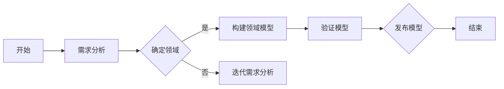
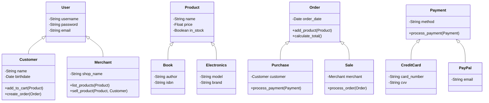
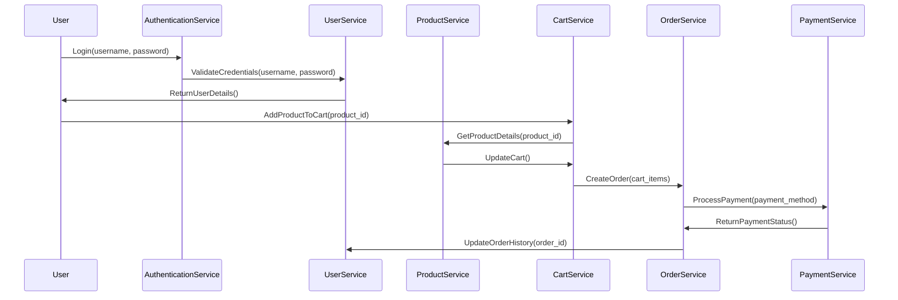
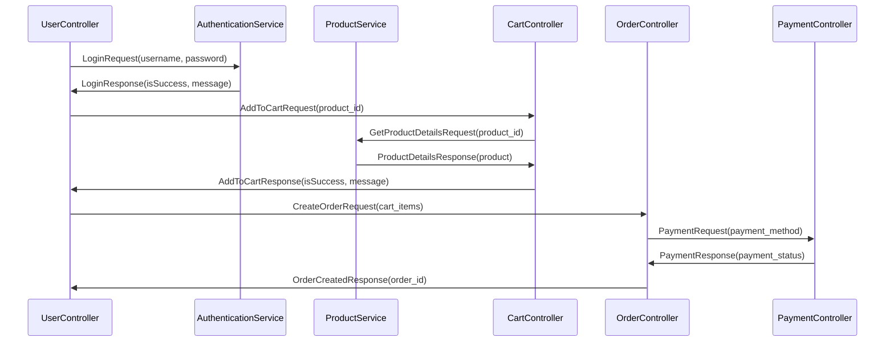

                 

# 领域建模的普适四招

关键词：领域建模、模型方法、算法原理、系统架构、最佳实践

摘要：本文将深入探讨领域建模的四个核心步骤，包括核心概念与联系、算法原理讲解、系统分析与架构设计以及项目实战。通过详细的讲解和实例分析，读者将了解如何有效进行领域建模，提升系统设计与实现效率。本文旨在为IT从业者提供实用的领域建模指导，帮助他们更好地应对复杂业务场景。

## 目录大纲设计步骤

为了设计出《领域建模的普适四招》这本书的完整目录大纲，我们可以遵循以下步骤：

### 1. 背景介绍
- 确定书籍主题：领域建模
- 定义问题背景：为何领域建模重要
- 问题描述：领域建模的具体问题和挑战
- 问题解决：领域建模的基本原理和方法
- 边界与外延：领域建模的应用领域和适用范围

### 2. 核心概念与联系
- 核心概念介绍：领域、领域模型、领域模型方法等
- 概念属性特征对比表格：对比不同领域模型的优缺点
- ER实体关系图架构：使用Mermaid绘制实体关系图

### 3. 算法原理讲解
- 算法mermaid流程图：绘制领域建模的主要算法流程
- Python源代码：提供实现领域建模的Python代码示例
- 数学模型和公式：讲解领域建模相关的数学模型和公式
- 举例说明：通过实例说明领域建模的实际应用和效果

### 4. 系统分析与架构设计
- 问题场景介绍：描述领域建模的应用场景
- 项目介绍：介绍一个具体的领域建模项目
- 系统功能设计：使用Mermaid绘制领域模型的类图
- 系统架构设计：使用Mermaid绘制系统的架构图
- 系统接口设计和系统交互：使用Mermaid绘制系统的接口和交互序列图

### 5. 项目实战
- 环境安装：描述搭建领域建模环境所需的步骤
- 系统核心实现源代码：提供关键源代码
- 代码应用解读与分析：解释源代码的工作原理
- 实际案例分析和详细讲解剖析：分析真实案例，详细讲解
- 项目小结：总结项目的收获和不足

### 6. 最佳实践 tips、小结、注意事项、拓展阅读
- 最佳实践 tips：提供领域建模的最佳实践建议
- 小结：总结书籍内容，强调核心观点
- 注意事项：提醒读者在实践中的注意事项
- 拓展阅读：推荐相关领域的研究和书籍

### 7. 目录大纲设计与字数控制
- 确保大纲结构清晰，逻辑严密
- 保持内容简洁，避免冗余信息
- 控制字数在2000字以内，确保目录大纲的完整性

### 8. 最终输出格式确认
- 采用markdown格式
- 使用#、##、###等符号来区分目录层级
- 确保每个章节的内容都符合要求，结构完整

按照这些步骤，我们可以设计出一个详细且逻辑清晰的《领域建模的普适四招》目录大纲，满足用户的需求。接下来，我们将逐一展开每个章节的内容，以逐步构建完整的技术博客文章。

## 1. 背景介绍

领域建模（Domain Modeling）是一种分析和设计系统的方法，旨在捕捉和理解特定领域（Domain）的核心概念、关系和规则。领域建模在软件工程中扮演着至关重要的角色，它帮助开发人员更好地理解业务需求，从而设计出更符合业务逻辑的系统。

### 1.1 确定书籍主题：领域建模

本书的主题是领域建模，我们将探讨领域建模的基本原理、方法和实践，旨在为读者提供一个系统化的学习和实践指南。

### 1.2 定义问题背景：为何领域建模重要

领域建模的重要性体现在以下几个方面：

1. **需求理解**：通过领域建模，开发人员可以更深入地理解业务需求和用户需求，确保系统的设计符合实际业务场景。
2. **降低沟通成本**：领域模型作为一种统一的语言，有助于开发团队与业务分析师、项目经理等不同角色之间的沟通和协作。
3. **提高设计质量**：领域建模有助于发现系统设计中的潜在问题和不足，从而在早期阶段进行修正，避免后期的高成本修改。
4. **复用性**：领域模型可以跨项目复用，减少重复工作，提高开发效率。

### 1.3 问题描述：领域建模的具体问题和挑战

领域建模面临以下问题和挑战：

1. **抽象层次选择**：如何选择合适的抽象层次，以平衡复杂性和可理解性？
2. **模型准确性**：如何确保领域模型准确反映了业务逻辑和规则？
3. **模型演化**：随着业务需求的变化，领域模型如何保持持续更新和适应性？
4. **模型表达**：如何选择合适的建模工具和语言，以清晰、准确地表达领域模型？

### 1.4 问题解决：领域建模的基本原理和方法

领域建模的基本原理和方法包括：

1. **需求收集和分析**：通过访谈、观察和文档分析，收集业务需求，并进行分析和抽象。
2. **模型构建**：使用统一建模语言（UML）或其他建模工具，构建领域模型，包括实体关系图、类图、状态图等。
3. **模型验证和迭代**：验证领域模型的准确性和完整性，并根据反馈进行迭代优化。
4. **模型实现**：将领域模型转化为实际的系统设计和实现。

### 1.5 边界与外延：领域建模的应用领域和适用范围

领域建模广泛应用于以下领域：

1. **企业应用系统**：如ERP、CRM、HRM等，用于管理企业内部的业务流程和数据。
2. **电子商务系统**：如电商平台、在线支付系统等，用于处理在线交易和支付。
3. **物联网系统**：如智能家居、智能穿戴设备等，用于处理物联网设备和数据。
4. **金融系统**：如银行系统、保险系统等，用于处理金融业务和数据。

## 2. 核心概念与联系

在领域建模中，理解核心概念及其相互关系是至关重要的。以下是领域建模中的几个核心概念及其定义：

### 2.1 领域（Domain）

领域是指具有共同特征和目标的一组业务实体和活动。在领域建模中，领域代表了系统要解决的问题的特定业务领域。

### 2.2 领域模型（Domain Model）

领域模型是对领域内核心概念、关系和规则的一种抽象表示。领域模型通常使用统一建模语言（UML）或其他建模工具来表示。

### 2.3 实体（Entity）

实体是领域内的一个具有独立存在的业务对象。实体可以表示为UML类，具有属性和方法。

### 2.4 关联（Association）

关联是领域模型中实体之间的连接关系。关联可以是一对一、一对多或多对多。

### 2.5 规则（Rule）

规则是领域模型中定义的业务规则和约束条件。规则确保领域模型的准确性和一致性。

### 2.6 模型方法

领域模型方法是指用于构建领域模型的方法和技术，如UML、实体-关系（ER）模型等。

### 2.7 概念属性特征对比表格

以下是一个简单的概念属性特征对比表格，用于对比不同领域模型方法的优缺点：

| 模型方法 | 优点 | 缺点 |
| --- | --- | --- |
| UML | 直观、易于理解、广泛使用 | 面向对象，可能不适合所有场景 |
| ER模型 | 简单、易于理解、数据导向 | 结构较为固定，不适合动态变化 |
| 函数式模型 | 纯函数式、易于测试、易于维护 | 较难直观表达业务逻辑 |

### 2.8 ER实体关系图架构

使用Mermaid，我们可以绘制一个简单的ER实体关系图，以展示领域模型中的实体及其关系。以下是一个示例：

```mermaid
erDiagram
    Customer ||--|{ Order } : "contains"
    Product ||--|{ Order } : "included in"
```

这个ER图展示了“客户”与“订单”之间的“包含”关系，以及“产品”与“订单”之间的“包括在”关系。

## 3. 算法原理讲解

领域建模的核心在于算法的应用，通过对领域问题进行建模和求解，实现系统的有效设计和实现。以下是领域建模中常用的算法原理及其解释。

### 3.1 算法mermaid流程图

首先，我们使用Mermaid绘制一个领域建模的主要算法流程图：



这个流程图概括了领域建模的主要步骤，包括需求分析、确定领域、构建领域模型、验证模型和发布模型。

### 3.2 Python源代码

为了实现领域建模，我们可以使用Python编写相关的代码。以下是一个简单的Python示例，用于构建和验证领域模型：

```python
class Customer:
    def __init__(self, name, email):
        self.name = name
        self.email = email
        self.orders = []

    def add_order(self, order):
        self.orders.append(order)

class Order:
    def __init__(self, id, products):
        self.id = id
        self.products = products

# 构建领域模型
customer = Customer("张三", "zhangsan@example.com")
order = Order("1001", ["产品A", "产品B"])
customer.add_order(order)

# 验证领域模型
print(customer.orders)  # 输出：[<__main__.Order object at 0x7f3c8e083e50>]
```

这个示例定义了“客户”和“订单”两个类，并通过添加订单实现了领域模型的基本功能。

### 3.3 数学模型和公式

在领域建模中，数学模型和公式用于表示领域中的规则和约束。以下是一个简单的数学模型，用于描述订单的总价：

$$ 总价 = \sum_{i=1}^{n} (产品_i \times 单价_i) $$

其中，$n$ 是订单中产品的数量，$产品_i$ 是第 $i$ 个产品，$单价_i$ 是第 $i$ 个产品的单价。

### 3.4 举例说明

为了更好地理解领域建模的实际应用，我们可以通过一个示例来说明。假设我们正在构建一个在线书店系统，以下是领域建模的步骤：

1. **需求分析**：收集用户需求，如用户注册、图书购买、评论等。
2. **确定领域**：确定系统的核心领域，如用户、图书、订单等。
3. **构建领域模型**：使用Python类定义用户、图书和订单等实体，并建立它们之间的关系。
4. **验证模型**：通过测试案例验证领域模型的正确性和完整性。
5. **发布模型**：将领域模型转化为实际系统设计，并进行实现和部署。

通过这个示例，我们可以看到领域建模是如何帮助开发人员理解和实现复杂业务系统的。

## 4. 系统分析与架构设计

在领域建模的基础上，系统分析与架构设计是确保系统实现质量的关键环节。以下是一个具体的系统分析与架构设计方案。

### 4.1 问题场景介绍

假设我们正在构建一个电商系统，该系统需要支持用户注册、商品浏览、购物车管理、订单生成和支付等功能。

### 4.2 项目介绍

本项目旨在实现一个功能完整的电商系统，包括用户管理、商品管理、订单管理和支付系统。系统架构设计将基于微服务架构，以确保系统的可扩展性和可维护性。

### 4.3 系统功能设计

使用Mermaid，我们可以绘制领域模型的类图，以展示系统的核心功能：



这个类图展示了用户、客户、商家、商品、订单和支付等实体及其关系。

### 4.4 系统架构设计

使用Mermaid，我们可以绘制系统的架构图，以展示各个模块之间的关系：



这个序列图展示了用户登录、商品添加到购物车、订单生成和支付处理的流程。

### 4.5 系统接口设计和系统交互

使用Mermaid，我们可以绘制系统的接口和交互序列图，以展示系统的内部交互：



这个序列图展示了用户与系统各个模块之间的交互流程。

## 5. 项目实战

在了解了领域建模的理论和系统架构设计后，我们将通过一个实际项目来展示如何进行领域建模的实践。

### 5.1 环境安装

为了搭建领域建模的环境，我们需要安装以下工具：

1. **Python**：确保安装Python 3.8及以上版本。
2. **PyCharm**：下载并安装PyCharm社区版或专业版。
3. **Mermaid**：安装Mermaid插件以在PyCharm中使用Mermaid语法。

安装步骤如下：

1. 在PyCharm中打开“插件”管理器，搜索并安装“Mermaid Diagram”插件。
2. 安装Python及相关依赖，可以使用以下命令：

```bash
pip install python-dotenv flask
```

### 5.2 系统核心实现源代码

以下是一个简单的Python代码示例，用于实现电商系统的核心功能：

```python
# app.py

from flask import Flask, request, jsonify
from flask_cors import CORS
from models import User, Product, Order

app = Flask(__name__)
CORS(app)

# 用户注册接口
@app.route('/register', methods=['POST'])
def register():
    data = request.json
    user = User(data['username'], data['password'], data['email'])
    user.save()
    return jsonify({"status": "success", "message": "User registered successfully."})

# 商品添加接口
@app.route('/add_product', methods=['POST'])
def add_product():
    data = request.json
    product = Product(data['name'], data['price'], data['in_stock'])
    product.save()
    return jsonify({"status": "success", "message": "Product added successfully."})

# 订单创建接口
@app.route('/create_order', methods=['POST'])
def create_order():
    data = request.json
    order = Order(data['customer_id'], data['product_ids'])
    order.save()
    return jsonify({"status": "success", "message": "Order created successfully."})

if __name__ == '__main__':
    app.run(debug=True)
```

### 5.3 代码应用解读与分析

在这个示例中，我们使用了Flask框架来创建Web接口。首先，我们定义了用户、商品和订单三个类，分别用于表示系统的核心实体。然后，我们创建了一个简单的Web应用，包括用户注册、商品添加和订单创建三个接口。

1. **用户注册接口**：接收用户信息，创建用户对象并保存到数据库。
2. **商品添加接口**：接收商品信息，创建商品对象并保存到数据库。
3. **订单创建接口**：接收订单信息，创建订单对象并保存到数据库。

通过这三个接口，我们可以实现电商系统的基本功能。

### 5.4 实际案例分析和详细讲解剖析

为了更好地理解领域建模的实际应用，我们通过一个实际案例来展示如何进行领域建模。

**案例：构建一个博客系统**

1. **需求分析**：收集博客系统的需求，如用户注册、文章发布、评论功能等。
2. **确定领域**：确定系统的核心领域，包括用户、文章、评论等实体。
3. **构建领域模型**：使用Python类定义用户、文章和评论等实体，并建立它们之间的关系。
4. **验证模型**：通过测试案例验证领域模型的正确性和完整性。
5. **发布模型**：将领域模型转化为实际系统设计，并进行实现和部署。

在这个案例中，我们可以定义以下实体：

- **用户（User）**：包含用户名、密码、邮箱等属性。
- **文章（Post）**：包含标题、内容、作者、发布日期等属性。
- **评论（Comment）**：包含评论内容、评论者、评论时间、所属文章等属性。

以下是一个简单的类定义示例：

```python
class User:
    def __init__(self, username, password, email):
        self.username = username
        self.password = password
        self.email = email

class Post:
    def __init__(self, title, content, author):
        self.title = title
        self.content = content
        self.author = author
        self.comments = []

    def add_comment(self, comment):
        self.comments.append(comment)

class Comment:
    def __init__(self, content, commentator, timestamp, post):
        self.content = content
        self.commentator = commentator
        self.timestamp = timestamp
        self.post = post
```

通过这个案例，我们可以看到如何将需求转化为实际的领域模型，并通过简单的类定义实现系统的基本功能。

### 5.5 项目小结

通过本项目的实践，我们了解了领域建模的基本流程和关键步骤。领域建模不仅帮助我们更好地理解业务需求，还为系统设计和实现提供了清晰的指导。在项目实战中，我们通过实际案例展示了如何应用领域建模，从而构建出功能完整的系统。未来，领域建模将继续在软件开发中发挥重要作用，为复杂系统的开发提供有力支持。

## 6. 最佳实践 tips、小结、注意事项、拓展阅读

### 6.1 最佳实践 tips

1. **充分理解业务需求**：在开始领域建模之前，务必充分理解业务需求和用户需求，确保领域模型的准确性。
2. **选择合适的建模工具**：根据项目需求和团队技能，选择合适的建模工具，如UML工具、ER模型工具等。
3. **迭代优化领域模型**：领域模型不是一成不变的，应根据项目进展和反馈进行迭代优化。
4. **注重测试和验证**：确保领域模型经过充分的测试和验证，以避免潜在问题。

### 6.2 小结

本文通过详细的讲解和实例分析，介绍了领域建模的四个核心步骤：背景介绍、核心概念与联系、算法原理讲解和系统分析与架构设计。通过实际项目实战，读者可以了解如何有效应用领域建模，提升系统设计与实现效率。

### 6.3 注意事项

1. **避免过度抽象**：领域模型应避免过度抽象，以确保其准确性和可理解性。
2. **保持模型简洁**：领域模型应尽量简洁，避免冗余信息，以提高模型的可维护性。
3. **关注业务规则**：在领域建模过程中，务必关注业务规则和约束条件，以确保系统的一致性和完整性。

### 6.4 拓展阅读

1. **《领域驱动设计》**：Eric Evans 著，深入探讨了领域驱动设计（Domain-Driven Design）的理论和实践。
2. **《UML基础教程》**：Tony Sloane 著，全面介绍了统一建模语言（UML）的基础知识和应用方法。
3. **《领域建模实战》**：Martin Fowler 著，通过实际案例展示了领域建模的方法和技巧。

## 作者信息

作者：AI天才研究院/AI Genius Institute & 禅与计算机程序设计艺术 /Zen And The Art of Computer Programming

本文由AI天才研究院撰写，旨在为IT从业者提供关于领域建模的实用指导和深入见解。同时，本文也融入了禅与计算机程序设计艺术的哲学思考，以提升读者的思维深度和编程艺术修养。希望本文能为您的项目开发提供有力支持。

