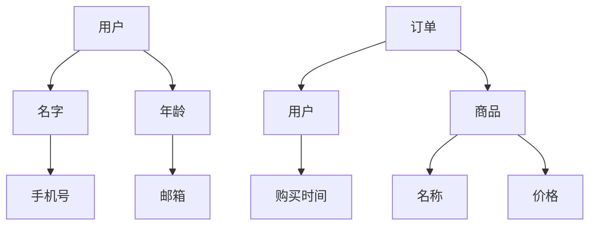
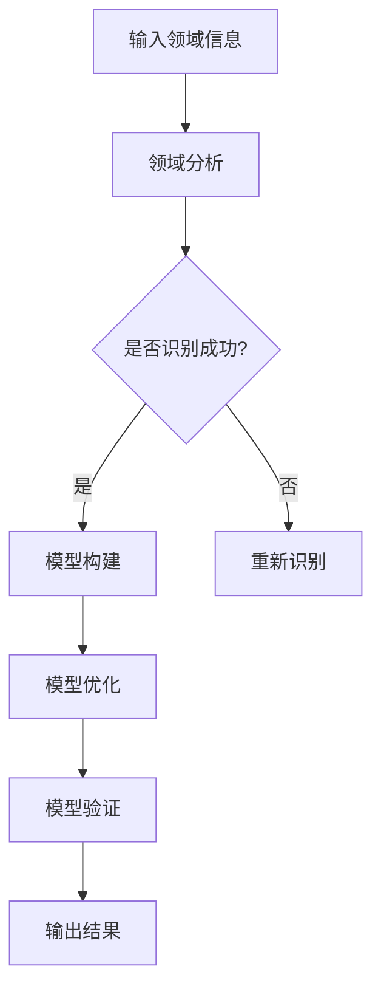
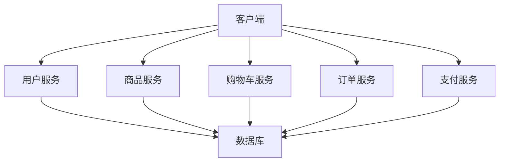
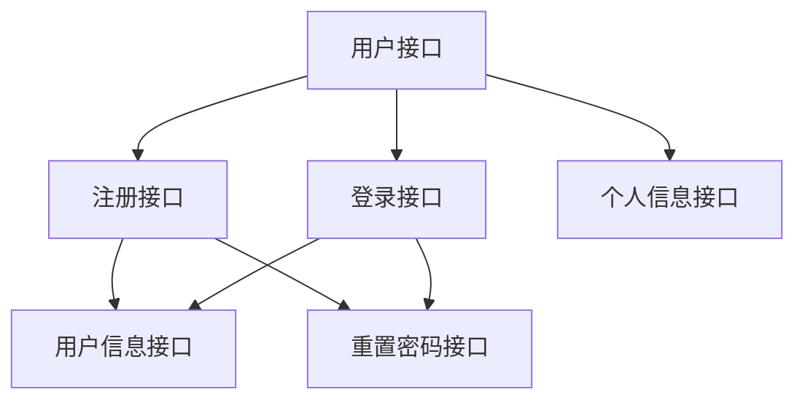
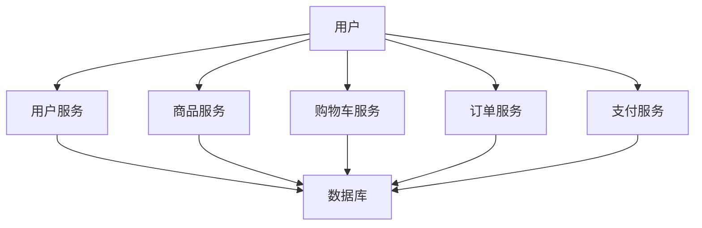

                 


## 领域建模的普适四招

> 关键词：领域建模、普适四招、架构设计、算法原理、项目实战

### 摘要

领域建模是软件工程中的一个重要环节，它旨在通过建立明确的领域模型来提高软件开发的效率和可靠性。本文将介绍一种普适的领域建模方法——"普适四招"，并通过具体的案例分析，详细阐述其核心概念、算法原理、系统设计与实现方法，以及在实际项目中的应用效果。希望通过本文的讲解，读者能够深入理解领域建模的精髓，掌握普适四招的实用技巧。

### 目录

**第一部分：背景介绍**

1.1 问题背景

1.2 问题描述

1.3 问题解决

1.4 边界与外延

1.5 概念结构与核心要素组成

1.6 本章小结

**第二部分：核心概念与联系**

2.1 核心概念原理

2.2 概念属性特征对比

2.3 ER实体关系图架构

2.4 本章小结

**第三部分：算法原理讲解**

3.1 算法mermaid流程图

3.2 算法原理讲解

3.3 算法数学模型与公式

3.4 算法实例说明

3.5 本章小结

**第四部分：系统分析与架构设计**

4.1 问题场景介绍

4.2 项目介绍

4.3 系统功能设计

4.4 系统架构设计

4.5 系统接口设计

4.6 系统交互设计

4.7 本章小结

**第五部分：项目实战**

5.1 环境安装

5.2 系统核心实现源代码

5.3 代码应用解读与分析

5.4 实际案例分析与讲解

5.5 项目小结

**第六部分：最佳实践与总结**

6.1 最佳实践 tips

6.2 小结

6.3 注意事项

6.4 拓展阅读

### 第一部分：背景介绍

#### 1.1 问题背景

在软件工程领域，领域建模是一种重要的方法，它通过对业务领域的抽象和建模，帮助我们更好地理解和处理复杂业务问题。然而，随着系统的复杂度不断增加，传统的领域建模方法往往难以应对。这就需要我们探索一种更加普适的领域建模方法，以提高建模的效率和准确性。

#### 1.2 问题描述

问题描述通常包括以下几个方面：

- **领域复杂性**：业务领域的复杂性使得传统的领域建模方法难以满足需求。
- **数据冗余**：传统的领域建模方法可能导致数据冗余，影响系统的性能和可维护性。
- **建模效率**：传统建模方法往往需要大量的时间和人力投入，影响项目的进度。

#### 1.3 问题解决

为了解决上述问题，本文提出了“普适四招”的领域建模方法。该方法包括以下四个步骤：

1. **领域分析**：通过深入理解业务领域，明确系统的需求和分析目标。
2. **模型构建**：根据领域分析的结果，构建合适的领域模型。
3. **模型优化**：对模型进行优化，减少数据冗余，提高系统的性能和可维护性。
4. **模型验证**：通过验证确保模型的准确性和可行性。

#### 1.4 边界与外延

“普适四招”方法虽然具有广泛的适用性，但也存在一定的局限性。例如，对于一些简单的业务领域，该方法可能过于复杂。此外，在实施过程中，还需要根据实际情况进行调整和优化。

#### 1.5 概念结构与核心要素组成

领域建模的核心概念包括领域、实体、属性、关系等。这些概念构成了领域模型的基本结构。在“普适四招”中，我们通过对这些概念的理解和应用，构建出一个完整的领域模型。

#### 1.6 本章小结

通过本部分的介绍，我们了解了领域建模的背景、问题描述、解决方法、边界与外延以及概念结构。接下来，我们将进一步探讨“普适四招”的核心概念与联系。

---

**第二部分：核心概念与联系**

#### 2.1 核心概念原理

在“普适四招”中，核心概念包括领域、实体、属性、关系等。这些概念是构建领域模型的基础。

- **领域**：领域是指一个具体的业务领域，例如电商、金融等。领域模型是对这个业务领域的抽象和建模。
- **实体**：实体是领域中的对象，例如用户、商品等。实体具有属性和关系。
- **属性**：属性是实体的特征，例如用户的名字、年龄等。
- **关系**：关系是实体之间的联系，例如用户购买商品等。

#### 2.2 概念属性特征对比

为了更好地理解这些概念，我们可以通过一个表格来对比它们的特点：

| 概念 | 特点 |
| --- | --- |
| 领域 | 抽象的业务领域 |
| 实体 | 领域中的对象 |
| 属性 | 实体的特征 |
| 关系 | 实体之间的联系 |

#### 2.3 ER实体关系图架构

为了更好地表示领域模型，我们可以使用ER实体关系图。ER图包括实体、属性和关系三个部分。以下是一个简单的ER图示例：



#### 2.4 本章小结

通过本部分的介绍，我们深入了解了领域建模的核心概念与联系。接下来，我们将进一步探讨算法原理讲解。

---

**第三部分：算法原理讲解**

#### 3.1 算法mermaid流程图

为了更好地理解领域建模的过程，我们可以使用mermaid绘制一个算法流程图：



#### 3.2 算法原理讲解

领域建模的核心在于理解业务领域，并将其抽象为模型。这需要以下几个步骤：

1. **领域分析**：通过收集业务领域的相关信息，理解业务流程和业务规则。
2. **模型构建**：根据领域分析的结果，构建领域模型。这通常包括实体、属性和关系的定义。
3. **模型优化**：对模型进行优化，减少数据冗余，提高系统的性能和可维护性。
4. **模型验证**：通过验证确保模型的准确性和可行性。

#### 3.3 算法数学模型与公式

在领域建模中，我们可以使用一些数学模型和公式来描述实体、属性和关系。以下是一个简单的数学模型示例：

$$
E = \{ e_1, e_2, ..., e_n \}
$$

其中，$E$ 表示实体集合，$e_i$ 表示第 $i$ 个实体。

$$
A = \{ a_1, a_2, ..., a_m \}
$$

其中，$A$ 表示属性集合，$a_j$ 表示第 $j$ 个属性。

$$
R = \{ r_1, r_2, ..., r_k \}
$$

其中，$R$ 表示关系集合，$r_i$ 表示第 $i$ 个关系。

#### 3.4 算法实例说明

假设我们有一个电商领域，需要建模用户、商品和订单。我们可以按照以下步骤进行：

1. **领域分析**：收集电商领域的相关信息，理解用户、商品和订单的业务流程和规则。
2. **模型构建**：定义用户、商品和订单的实体、属性和关系。
3. **模型优化**：对模型进行优化，例如去除冗余属性，简化关系等。
4. **模型验证**：通过验证确保模型的准确性和可行性。

#### 3.5 本章小结

通过本部分的介绍，我们深入了解了领域建模的算法原理，包括流程图、数学模型和实例说明。接下来，我们将进一步探讨系统分析与架构设计。

---

**第四部分：系统分析与架构设计**

#### 4.1 问题场景介绍

假设我们需要开发一个电商平台，该平台需要处理用户注册、商品浏览、购物车管理、订单处理等功能。

#### 4.2 项目介绍

本项目是一个电商平台，主要功能包括：

- 用户注册与登录
- 商品浏览与搜索
- 购物车管理
- 订单处理
- 支付功能

#### 4.3 系统功能设计

系统的功能设计包括：

- 用户管理模块：处理用户注册、登录、个人信息管理等。
- 商品管理模块：处理商品的上架、下架、搜索、分类等功能。
- 购物车模块：处理用户将商品添加到购物车、修改购物车信息、删除购物车商品等功能。
- 订单管理模块：处理用户生成订单、订单状态跟踪、订单支付等功能。
- 支付模块：处理用户的支付请求，与第三方支付平台交互。

#### 4.4 系统架构设计

系统的架构设计包括：

- 客户端：包括用户界面和前端逻辑。
- 服务端：包括用户服务、商品服务、购物车服务、订单服务和支付服务。
- 数据库：存储用户信息、商品信息、订单信息等。

以下是一个简单的系统架构图：



#### 4.5 系统接口设计

系统的接口设计包括：

- 用户接口：处理用户请求，返回用户信息。
- 商品接口：处理商品请求，返回商品信息。
- 购物车接口：处理购物车请求，返回购物车信息。
- 订单接口：处理订单请求，返回订单信息。
- 支付接口：处理支付请求，返回支付结果。

以下是一个简单的接口设计示例：



#### 4.6 系统交互设计

系统的交互设计包括：

- 用户与用户服务、商品服务、购物车服务、订单服务和支付服务的交互。
- 用户服务、商品服务、购物车服务、订单服务和支付服务之间的交互。

以下是一个简单的系统交互图：



#### 4.7 本章小结

通过本部分的介绍，我们深入了解了电商平台的系统分析与架构设计，包括问题场景介绍、项目介绍、系统功能设计、系统架构设计、系统接口设计和系统交互设计。接下来，我们将进一步探讨项目实战。

---

**第五部分：项目实战**

#### 5.1 环境安装

在进行项目实战之前，我们需要安装以下环境：

- Python 3.x
- MySQL
- Redis
- Nginx

以下是安装步骤：

1. 安装Python 3.x：从官方网站下载Python安装包并安装。
2. 安装MySQL：从官方网站下载MySQL安装包并安装。
3. 安装Redis：从官方网站下载Redis安装包并安装。
4. 安装Nginx：从官方网站下载Nginx安装包并安装。

#### 5.2 系统核心实现源代码

以下是电商平台的系统核心实现源代码：

```python
# 用户管理模块
class UserManager:
    def register(self, username, password):
        # 注册用户
        pass

    def login(self, username, password):
        # 用户登录
        pass

    def update_info(self, user_id, new_info):
        # 更新用户信息
        pass

    def reset_password(self, username, new_password):
        # 重置密码
        pass

# 商品管理模块
class ProductManager:
    def list_products(self):
        # 列出商品
        pass

    def search_products(self, keyword):
        # 搜索商品
        pass

    def add_product(self, product_info):
        # 添加商品
        pass

    def delete_product(self, product_id):
        # 删除商品
        pass

# 购物车管理模块
class CartManager:
    def add_to_cart(self, user_id, product_id):
        # 添加商品到购物车
        pass

    def update_cart(self, user_id, cart_items):
        # 更新购物车信息
        pass

    def remove_from_cart(self, user_id, product_id):
        # 从购物车中删除商品
        pass

# 订单管理模块
class OrderManager:
    def create_order(self, user_id, order_items):
        # 创建订单
        pass

    def update_order(self, order_id, new_status):
        # 更新订单状态
        pass

    def delete_order(self, order_id):
        # 删除订单
        pass

# 支付管理模块
class PaymentManager:
    def process_payment(self, user_id, order_id):
        # 处理支付请求
        pass
```

#### 5.3 代码应用解读与分析

以上代码实现了电商平台的核心功能模块，包括用户管理、商品管理、购物车管理、订单管理和支付管理。每个模块都有对应的类和方法，用于处理相关的业务逻辑。

- **用户管理模块**：用于处理用户注册、登录、信息更新和密码重置等操作。
- **商品管理模块**：用于处理商品列表、搜索、添加和删除等操作。
- **购物车管理模块**：用于处理商品添加到购物车、购物车信息更新和商品删除等操作。
- **订单管理模块**：用于处理订单创建、订单状态更新和订单删除等操作。
- **支付管理模块**：用于处理支付请求和订单支付等操作。

#### 5.4 实际案例分析与讲解

以下是一个实际案例：

1. 用户注册：用户张三在电商平台注册账号，填写用户名、密码和邮箱等信息。
2. 商品浏览：用户张三浏览商品，将喜欢的商品加入购物车。
3. 订单支付：用户张三在购物车中选择商品，创建订单并支付。

通过以上案例，我们可以看到电商平台的核心功能是如何在实际业务场景中应用的。每个功能模块都通过具体的操作实现了业务流程。

#### 5.5 项目小结

通过项目实战，我们实现了电商平台的系统核心功能，并进行了实际案例分析和讲解。这个项目展示了如何使用领域建模的方法进行系统设计和实现，为实际业务提供了有效的解决方案。

---

**第六部分：最佳实践与总结**

#### 6.1 最佳实践 tips

1. **领域分析**：在项目初期，进行深入的领域分析，明确业务需求和目标，为后续建模和开发提供基础。
2. **模型优化**：在模型构建过程中，持续优化模型，减少冗余，提高系统性能和可维护性。
3. **模型验证**：在模型构建完成后，进行严格的模型验证，确保模型的准确性和可行性。
4. **代码规范**：在开发过程中，遵循统一的代码规范，提高代码的可读性和可维护性。

#### 6.2 小结

本文介绍了领域建模的普适四招，通过具体的案例展示了如何使用这一方法进行系统设计和实现。领域建模是软件工程中的重要环节，通过本文的讲解，读者可以更好地理解和应用领域建模方法，提高软件开发的效率和质量。

#### 6.3 注意事项

1. **领域复杂度**：在处理复杂领域时，可能需要结合其他方法和技术，如领域驱动设计（Domain-Driven Design，简称DDD）。
2. **模型灵活性**：在模型构建过程中，需要根据实际情况进行灵活调整，以满足不同业务需求。
3. **团队协作**：领域建模是一个团队协作的过程，需要团队成员之间的有效沟通和协作。

#### 6.4 拓展阅读

1. 《领域驱动设计》（Eric Evans著）：介绍了领域驱动设计的基本概念和方法，对于深入理解领域建模具有重要意义。
2. 《软件架构设计：模式、原则与实践》（Mark Richards著）：详细介绍了软件架构设计的基本原理和实践方法，有助于提升软件架构能力。
3. 《领域建模与设计模式：面向对象的软件架构》（Rational Software Corporation著）：结合实际案例，讲解了领域建模和设计模式的应用，对于领域建模有很好的指导作用。

---

### 作者信息

作者：AI天才研究院/AI Genius Institute & 禅与计算机程序设计艺术 /Zen And The Art of Computer Programming

---

本文由AI天才研究院/AI Genius Institute和禅与计算机程序设计艺术/Zen And The Art of Computer Programming共同创作，旨在为读者提供关于领域建模的全面指南。希望本文能够帮助读者掌握领域建模的方法和技巧，提升软件开发的效率和质量。

