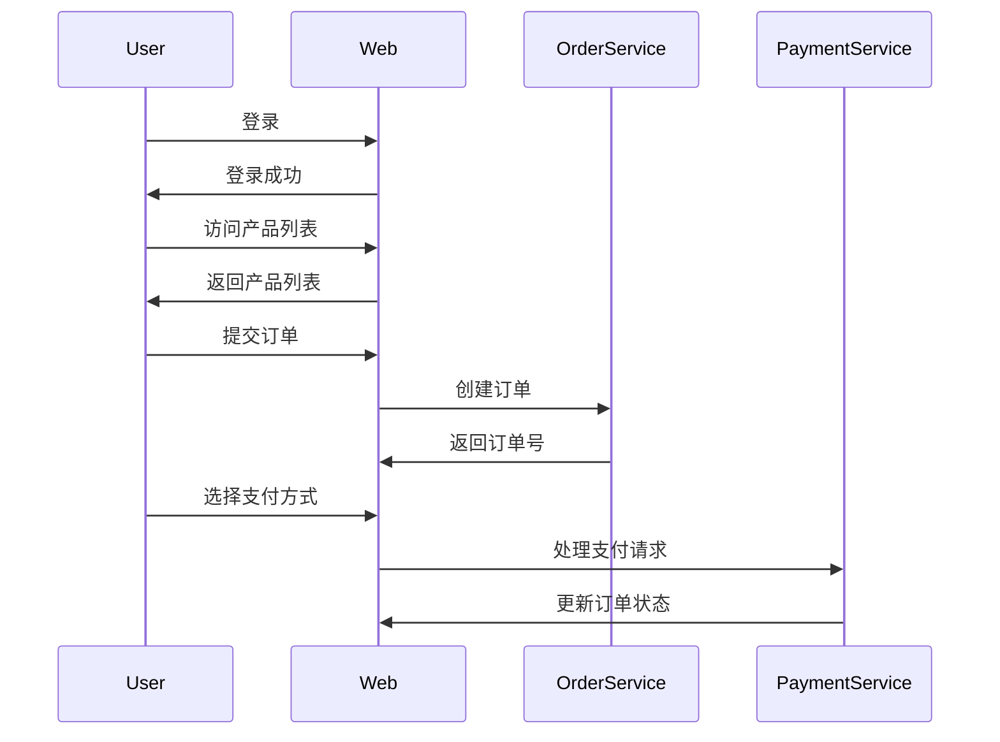
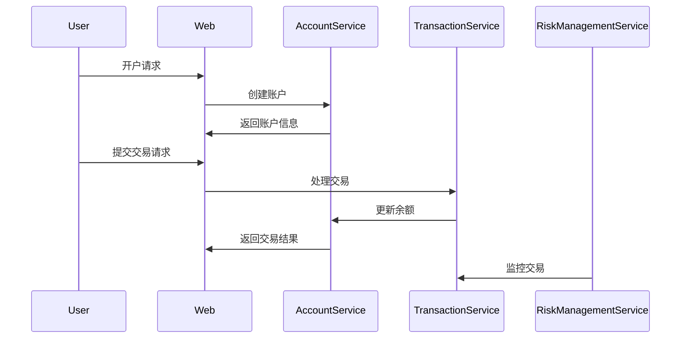
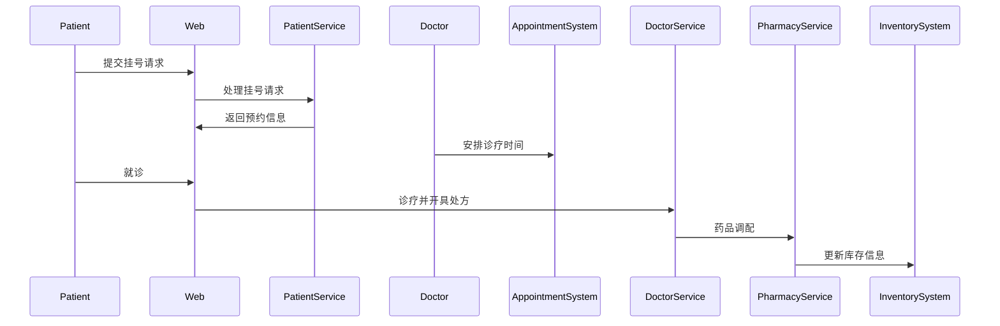

                 

### 文章标题

《领域建模：技术人都该是设计师》

### 关键词

领域建模、软件开发、系统架构、技术人员、领域驱动开发（DDD）、领域特定语言（DSL）

### 摘要

在数字化时代的浪潮中，领域建模已经成为提升软件设计和开发效率的关键技术。本文通过详细的章节内容，系统地介绍了领域建模的基础概念、设计方法、应用实践以及未来发展趋势，旨在帮助技术人员理解和掌握领域建模的核心技能。文章以逻辑清晰、结构紧凑、简单易懂的表述方式，深入剖析了领域建模在软件开发和系统架构设计中的重要性，为技术人员的职业发展提供了有价值的参考。

## 概述

《领域建模：技术人都该是设计师》是一本专注于领域建模技术的全面指南，旨在帮助技术人员从开发者角色向设计师角色转变。随着软件工程和系统架构的复杂性不断增加，领域建模作为一种系统分析和设计方法，已经成为了现代软件开发中的核心技能。本文将通过以下十个部分，详细探讨领域建模的理论与实践：

### 第一部分：引言与背景

本部分将介绍领域建模的基本概念、重要性以及技术人员的角色转变。通过理解领域建模的背景，读者可以更好地认识到其在软件开发和系统架构设计中的关键作用。

### 第二部分：基础概念

在这一部分中，我们将详细讨论领域和领域模型的基本概念、关键术语和符号，为后续的内容奠定基础。

### 第三部分：核心方法

本部分将介绍领域模型设计的核心方法，包括原型法、用例驱动的领域建模和企业架构框架，帮助读者掌握领域模型设计的实用技巧。

### 第四部分：领域模型的应用

我们将探讨领域模型在软件开发中的应用，包括领域特定语言（DSL）和领域驱动开发（DDD），并通过实际案例解析，展示领域模型的具体应用。

### 第五部分：领域模型与系统架构

本部分将探讨领域模型与系统架构设计的关系，介绍常见的领域模型架构模式，帮助读者理解如何将领域模型应用于系统架构设计。

### 第六部分：领域模型与业务流程

在这一部分中，我们将讨论领域模型在业务流程管理中的应用，介绍业务流程的概述以及领域模型在流程管理中的作用。

### 第七部分：领域模型工具与技术

我们将介绍常用的领域模型工具和技术，以及领域模型开发的最佳实践，帮助读者在实际工作中有效运用领域建模技术。

### 第八部分：领域模型案例研究

本部分将通过电子商务系统、银行系统和医疗健康系统等实际案例，深入分析领域模型的应用和实践。

### 第九部分：领域建模的未来发展趋势

我们将探讨领域建模在人工智能等新技术领域的发展趋势，以及面临的挑战和新机遇。

### 第十部分：总结与展望

最后，我们将对全书内容进行回顾，总结领域建模的最佳实践，并展望未来领域建模技术的发展方向。

通过以上十个部分的详细探讨，本文希望能够帮助读者全面理解领域建模的核心概念和应用方法，提升在软件开发和系统架构设计中的实际能力。

## 第1章：引言与背景

### 1.1 领域建模的重要性

领域建模（Domain Modeling）是现代软件开发中不可或缺的一部分，它通过抽象和概括特定领域的知识，构建出一种系统化的视图，帮助开发人员更好地理解和处理复杂的应用场景。领域建模的重要性可以从以下几个方面进行阐述：

**1.1.1 领域建模的定义与背景**

领域建模最早起源于软件工程中的需求分析和设计阶段，随着系统复杂性的增加，传统的需求分析和设计方法逐渐暴露出其局限性。领域建模作为一种更为系统化和抽象的方法，旨在通过对领域知识的全面理解和抽象，构建出一种结构化的领域模型，从而为软件开发提供坚实的理论基础。

领域建模的核心在于“领域”和“模型”这两个概念。“领域”指的是软件开发所涉及的特定业务领域，如电子商务、银行系统、医疗健康等；“模型”则是通过抽象和概括领域知识，构建出的系统化视图，通常包括实体、关系、动作和事件等。

**1.1.2 领域建模的必要性**

随着软件系统的复杂性和规模不断扩大，开发人员面临着越来越多的挑战。具体来说，领域建模的必要性体现在以下几个方面：

- **提高开发效率**：领域建模通过抽象和概括领域知识，可以显著降低开发人员理解业务需求和系统功能的时间，从而提高开发效率。
- **增强系统可维护性**：领域模型为系统提供了一个清晰的架构视图，有助于开发人员更好地理解和维护系统，降低系统维护成本。
- **降低沟通成本**：领域建模将复杂的业务逻辑和系统功能以图形化的方式展现，有助于开发人员与业务人员之间的沟通，减少误解和冲突。
- **促进复用**：通过领域建模，可以将特定领域的知识抽象成可重用的组件和框架，提高软件开发的复用性，减少重复劳动。

**1.1.3 领域建模的价值**

领域建模不仅具有上述的必要性，还具备以下几个重要的价值：

- **提升系统质量**：领域建模通过对领域知识的全面理解和抽象，有助于发现和解决系统设计中的潜在问题，从而提升系统的整体质量。
- **支持敏捷开发**：领域建模支持敏捷开发的方法论，通过迭代和渐进的方式，逐步完善领域模型，实现快速开发和适应需求变化。
- **促进技术创新**：领域建模为技术创新提供了基础，通过将特定领域的知识模型化，可以为新技术的应用和创新提供指导。

总之，领域建模是现代软件开发中的重要工具和方法，对于提升开发效率、增强系统可维护性、降低沟通成本以及促进技术创新等方面具有重要的意义。在接下来的章节中，我们将进一步探讨领域建模的基础概念、设计方法以及应用实践，帮助读者深入理解和掌握领域建模的核心技能。

### 1.2 技术人员的角色转变

随着软件工程和系统架构的不断发展，技术人员的角色也在不断演变。从传统的开发者角色逐渐向设计师角色转变，这一转变不仅需要技术人员掌握更广泛的技能，还需要他们具备全新的思维方式和工作方法。领域建模在这一过程中起到了关键的推动作用。

**1.2.1 从开发者到设计师的转变**

传统的开发者角色主要关注编码和实现，他们通过编写代码来满足业务需求和系统功能。而设计师角色则更加注重系统架构、设计模式和用户体验等方面，他们不仅需要编写代码，还需要从整体上理解和设计系统的结构和流程。

这种角色转变背后的原因主要有以下几个方面：

- **系统复杂性增加**：随着软件系统的规模和复杂性不断增加，开发人员需要从更高的视角来理解和设计系统，而不仅仅是关注具体的代码实现。
- **需求变化频繁**：在快速发展的业务环境中，需求的变化非常频繁，开发者需要具备灵活的应对能力，从设计层面进行系统调整和优化。
- **用户体验的重要性**：随着移动互联网和智能设备的普及，用户体验（UX）成为了影响系统成功的关键因素，设计师需要从用户的角度出发，进行系统设计和优化。

**1.2.2 技术人员在领域建模中的作用**

领域建模作为一种系统分析和设计方法，对技术人员的角色转变起到了重要的推动作用。技术人员在领域建模中扮演着以下几方面的关键角色：

- **领域专家**：技术人员需要深入了解特定业务领域的知识，成为该领域的专家，从而更好地理解和抽象领域模型。
- **系统架构师**：技术人员需要从系统架构的角度出发，设计领域模型的架构，确保系统的高可用性、高扩展性和高性能。
- **设计模式专家**：技术人员需要掌握常用的设计模式和架构模式，通过这些模式来优化领域模型的设计，提高系统的可维护性和复用性。
- **用户体验设计师**：技术人员需要关注用户体验，将领域模型转化为具体的界面设计和交互流程，确保系统易于使用和操作。

**1.2.3 领域建模对技术人员的要求**

为了适应从开发者到设计师的角色转变，技术人员需要具备以下几方面的能力和素质：

- **深入业务知识**：技术人员需要深入了解特定业务领域的知识，掌握业务流程、业务规则和业务需求，从而更好地理解和设计领域模型。
- **系统架构能力**：技术人员需要具备系统架构的能力，能够从整体上设计和优化系统的架构，确保系统的可扩展性和高可用性。
- **设计模式掌握**：技术人员需要掌握常用的设计模式和架构模式，能够将这些模式灵活应用于领域模型的设计中，提高系统的可维护性和复用性。
- **用户体验意识**：技术人员需要关注用户体验，将领域模型转化为具体的界面设计和交互流程，确保系统易于使用和操作。

总之，领域建模在技术人员角色转变中起到了重要的推动作用。技术人员通过领域建模，不仅可以更好地理解和设计复杂的系统，还可以提升自身的综合素质和职业竞争力。在接下来的章节中，我们将深入探讨领域建模的基础概念、设计方法和应用实践，帮助技术人员掌握这一核心技能。

### 1.3 本书结构

《领域建模：技术人都该是设计师》这本书旨在为技术人员提供全面、系统的领域建模知识，帮助他们从理论到实践全面掌握领域建模的核心技能。本书结构紧凑，逻辑清晰，共分为十个部分，每部分都有明确的主题和目标，旨在帮助读者逐步深入理解领域建模的各个方面。

**1.3.1 本书的主要内容**

本书的主要内容包括：

1. **引言与背景**：介绍领域建模的基本概念、重要性和技术人员的角色转变。
2. **基础概念**：详细讨论领域和领域模型的基本概念、关键术语和符号。
3. **核心方法**：介绍领域模型设计的核心方法，包括原型法、用例驱动的领域建模和企业架构框架。
4. **领域模型的应用**：探讨领域模型在软件开发中的应用，包括领域特定语言（DSL）和领域驱动开发（DDD）。
5. **领域模型与系统架构**：介绍领域模型与系统架构设计的关系，以及常见的领域模型架构模式。
6. **领域模型与业务流程**：讨论领域模型在业务流程管理中的应用，以及如何优化业务流程。
7. **领域模型工具与技术**：介绍常用的领域模型工具和技术，以及领域模型开发的最佳实践。
8. **领域模型案例研究**：通过实际案例解析，展示领域模型的应用和实践。
9. **领域建模的未来发展趋势**：探讨领域建模在新技术领域的发展趋势，以及面临的挑战和新机遇。
10. **总结与展望**：对全书内容进行回顾，总结领域建模的最佳实践，并展望未来领域建模技术的发展方向。

**1.3.2 阅读指南**

为了更好地理解本书的内容，我们提供以下阅读指南：

1. **循序渐进**：本书内容按照从基础到高级的顺序排列，建议读者按照章节顺序阅读，逐步深入理解领域建模的各个方面。
2. **理论与实践相结合**：本书不仅提供了理论讲解，还通过实际案例和实战经验，帮助读者将理论知识应用于实际工作中。
3. **动手实践**：为了加深对领域建模的理解，本书中包含了一些实践环节，读者可以通过动手实践来巩固所学知识。
4. **持续更新**：领域建模是一个不断发展的领域，本书将定期更新，以反映最新的研究成果和技术趋势。

**1.3.3 练习题与案例研究**

为了帮助读者更好地掌握领域建模的知识，本书在每个章节后都提供了相关的练习题和案例研究。通过这些练习题和案例研究，读者可以：

1. **巩固知识**：通过解决练习题，读者可以巩固所学知识，加深对领域建模的理解。
2. **实战演练**：通过案例研究，读者可以接触到实际项目中的领域建模应用，了解领域建模在实际开发中的具体应用和实践。
3. **反思与总结**：在完成练习题和案例研究后，读者可以对所学知识进行反思和总结，发现自己的不足之处，并进一步深入学习。

通过以上阅读指南和练习题、案例研究，读者可以更好地掌握领域建模的核心技能，提升在软件开发和系统架构设计中的实际能力。在接下来的章节中，我们将深入探讨领域建模的基础概念、设计方法、应用实践和未来发展趋势，帮助读者全面理解和掌握领域建模的各个方面。

### 第2章：领域建模基础

领域建模是现代软件开发中至关重要的一环，它通过系统化地抽象和概括特定领域的知识，为系统设计提供了坚实的基础。本章将深入探讨领域和领域模型的基础概念，包括领域与领域模型的关系、基本概念与术语，以及领域模型的核心要素。

#### 2.1 领域与领域模型

**2.1.1 领域的定义与分类**

领域（Domain）是指软件开发所涉及的特定业务领域，如电子商务、金融、医疗、物流等。领域可以大如一个行业，也可以小如一个具体的项目或应用。领域的主要特点包括：

- **业务相关性**：领域是与特定业务活动密切相关的，其核心是业务逻辑和业务规则。
- **知识复杂性**：领域通常涉及大量的专业知识，如行业规范、业务流程和业务规则等。
- **系统依赖性**：领域内的系统通常具有较高的内聚性和关联性，需要统一的设计和管理。

领域可以分为以下几种类型：

- **通用领域**：通用领域是指广泛应用于多个业务场景的领域，如客户关系管理（CRM）、企业资源规划（ERP）等。
- **特定领域**：特定领域是指针对某一特定业务或应用场景的领域，如电子商务系统、银行系统等。
- **跨领域**：跨领域是指涉及多个业务领域的综合领域，如互联网生态系统、智能城市系统等。

**2.1.2 领域模型的定义**

领域模型（Domain Model）是对特定领域知识进行抽象和概括的结果，通常采用图形化的方式展现，包括实体、关系、动作和事件等。领域模型的主要作用包括：

- **业务抽象**：通过领域模型，可以将复杂的业务逻辑和规则进行抽象，简化为可管理的部分。
- **系统设计**：领域模型为系统设计提供了明确的框架和指导，有助于开发人员理解和实现系统功能。
- **知识共享**：领域模型有助于不同角色（如开发人员、业务人员）之间的沟通和协作，确保对业务需求的共识。

**2.1.3 领域模型的作用**

领域模型在软件开发和系统设计中具有以下重要作用：

- **提高开发效率**：领域模型通过抽象和概括领域知识，可以显著减少开发人员理解业务需求和系统功能的时间，从而提高开发效率。
- **增强系统可维护性**：领域模型提供了一个清晰的架构视图，有助于开发人员更好地理解和维护系统，降低系统维护成本。
- **降低沟通成本**：领域模型以图形化的方式展现复杂的业务逻辑和规则，有助于开发人员与业务人员之间的沟通，减少误解和冲突。
- **促进复用**：通过领域模型，可以将特定领域的知识抽象成可重用的组件和框架，提高软件开发的复用性，减少重复劳动。

#### 2.2 基本概念与术语

领域建模涉及一系列基本概念和术语，以下是一些常见的基本概念和术语：

- **实体（Entity）**：实体是领域模型中的基本元素，代表领域内的对象或实体，如客户、订单、产品等。
- **属性（Attribute）**：属性是实体的特征或描述，如客户的名字、年龄、联系方式等。
- **关系（Relationship）**：关系是实体之间的联系，如客户可以下单、订单包含产品等。
- **动作（Action）**：动作是实体可以执行的操作，如创建订单、支付订单等。
- **事件（Event）**：事件是领域模型中的特定事件，如订单生成、支付成功等。
- **规则（Rule）**：规则是领域内的业务规则或约束，如订单金额必须大于0等。
- **视图（View）**：视图是领域模型的一个视角，通常用于展示特定的信息或功能。

#### 2.3 领域模型的核心要素

领域模型的核心要素包括实体、属性、关系、动作和事件等，以下将分别进行介绍：

**2.3.1 实体与属性**

实体是领域模型中的基本元素，代表领域内的对象或实体。例如，在电子商务系统中，客户、订单、产品等都是实体。

实体通常具有以下特征：

- **唯一标识**：每个实体都有唯一的标识，如客户的ID、订单的ID等。
- **属性定义**：实体具有一系列属性，用于描述实体的特征或状态，如客户的名字、年龄、联系方式等。

属性通常具有以下特征：

- **数据类型**：属性具有特定的数据类型，如字符串、数字、日期等。
- **约束条件**：属性可能需要满足特定的约束条件，如订单金额必须大于0等。

**2.3.2 关系与约束**

关系是实体之间的联系，用于描述实体之间的交互和依赖。关系通常具有以下特征：

- **类型**：关系可以分为一对一（1:1）、一对多（1:N）和多对多（M:N）三种类型。
- **角色**：关系中的每个实体都扮演特定的角色，如客户可以下单，订单包含产品等。
- **约束条件**：关系可能需要满足特定的约束条件，如订单必须包含至少一个产品等。

**2.3.3 动作与事件**

动作是实体可以执行的操作，用于描述实体在领域模型中的行为。例如，客户可以创建订单、支付订单等。

事件是领域模型中的特定事件，通常与实体的动作相关。例如，当客户创建订单时，会触发订单生成的事件。

动作和事件通常具有以下特征：

- **触发条件**：动作和事件通常需要满足特定的触发条件，如订单金额达到支付条件时，会触发支付事件。
- **执行效果**：动作和事件会带来一定的执行效果，如支付事件会更新订单状态为已支付等。

**2.3.4 模型视图与层次**

模型视图是领域模型的一个视角，用于展示特定的信息或功能。例如，客户视图可以展示客户的基本信息和订单列表。

领域模型通常具有多个视图，以适应不同的需求和用途。例如，开发人员可能需要关注系统架构和模块设计，而业务人员可能需要关注业务流程和业务规则。

领域模型的层次结构通常包括：

- **实体层次**：实体是领域模型的基本层次，用于描述领域内的对象和实体。
- **关系层次**：关系层次用于描述实体之间的联系和依赖，是领域模型的中间层次。
- **行为层次**：行为层次用于描述实体的行为和动作，是领域模型的高级层次。

通过以上对领域与领域模型、基本概念与术语、核心要素的介绍，读者可以初步了解领域建模的基础知识。在接下来的章节中，我们将进一步探讨领域模型的设计方法、应用实践和未来发展趋势，帮助读者深入掌握领域建模的核心技能。

### 第3章：领域模型设计方法

领域模型设计是软件开发过程中至关重要的一环，它不仅有助于明确系统功能和业务逻辑，还能提升系统的可维护性和可扩展性。本章将详细介绍几种常用的领域模型设计方法，包括原型法、用例驱动的领域建模和企业架构框架。通过这些方法，技术人员可以更加高效地进行领域模型设计。

#### 3.1 原型法

原型法（Prototyping）是一种通过创建初步模型来探索和验证领域模型设计的方法。原型法的主要目标是快速构建出系统原型，以便在早期阶段发现和解决问题，从而降低项目风险和成本。

**3.1.1 原型法的定义与优势**

原型法是一种迭代和渐进的方法，通过逐步完善原型，不断优化领域模型设计。这种方法的主要优势包括：

- **快速反馈**：原型法能够在开发早期就提供可运行的系统原型，使开发人员能够快速验证设计思路和功能实现，及时获取反馈并进行调整。
- **降低风险**：通过早期构建原型，可以及时发现和解决潜在的问题，降低项目开发过程中的风险。
- **灵活调整**：原型法支持快速迭代和调整，使系统能够更好地适应需求变化，提高系统的灵活性。

**3.1.2 原型法的实施步骤**

原型法的实施步骤主要包括以下几个阶段：

1. **需求分析**：在项目启动阶段，对业务需求进行初步分析，明确系统的主要功能和用户需求。
2. **快速原型构建**：基于需求分析的结果，快速构建出一个基本的系统原型，通常采用低代码或无代码工具实现。
3. **用户测试与反馈**：将原型展示给用户，收集用户反馈，了解原型在实际使用中的表现，并根据反馈进行优化和调整。
4. **迭代与优化**：根据用户反馈，不断迭代和优化原型，逐步完善领域模型设计，直到达到预期效果。

**3.1.3 原型法的应用案例**

在电子商务系统中，原型法可以用于设计购物流程、订单管理、支付流程等模块。通过快速构建原型，开发人员可以验证用户购物流程的便捷性和支付流程的可靠性，从而优化系统设计。

#### 3.2 用例驱动的领域建模

用例驱动的领域建模（Use Case Driven Domain Modeling）是一种以用户需求为中心的建模方法，通过分析用户用例来设计和实现领域模型。这种方法强调从用户的角度出发，明确系统的功能和行为，以确保系统能够满足用户需求。

**3.2.1 用例的概念与分类**

用例（Use Case）是描述系统功能和行为的一种工具，它定义了系统与用户之间的交互过程。用例可以分为以下几种类型：

- **基本用例**：基本用例是系统必须实现的核心功能，如登录、查询订单、支付等。
- **次要用例**：次要用例是系统可选的功能，如账户安全设置、积分兑换等。
- **边界用例**：边界用例描述系统与外部系统的交互，如与支付网关的交互、与库存系统的交互等。

**3.2.2 用例驱动的建模流程**

用例驱动的领域建模通常包括以下步骤：

1. **需求收集**：通过与用户和业务人员沟通，收集系统的需求，明确系统需要实现的功能和用户行为。
2. **用例编写**：根据收集到的需求，编写详细的用例文档，描述每个用例的功能、输入、输出和执行流程。
3. **用例建模**：使用统一建模语言（UML）等工具，将用例转化为图形化的用例图，展示系统与用户之间的交互关系。
4. **领域模型细化**：根据用例图，进一步细化领域模型，包括实体、关系、动作和事件等。
5. **迭代与优化**：根据用例和领域模型，进行迭代和优化，确保系统能够满足用户需求，并具有较好的可维护性和扩展性。

**3.2.3 用例模型的设计技巧**

在设计用例模型时，需要注意以下几个技巧：

- **用例粒度**：用例应尽量保持粒度适中，避免过细或过粗。过细的用例会增加维护成本，而过粗的用例会导致需求遗漏。
- **用例分解**：复杂用例可以通过分解为更小的子用例来简化设计和实现。分解时应注意保持子用例之间的独立性。
- **用例关联**：用例之间可能存在关联关系，如包含关系、扩展关系和泛化关系。正确识别和表示这些关系有助于理解用例之间的交互和依赖。

#### 3.3 企业架构框架

企业架构框架（Enterprise Architecture Framework）是一种系统化的方法，用于设计和实现企业的信息系统架构。企业架构框架涵盖了企业战略、业务流程、数据管理、技术平台等多个方面，以确保信息系统与企业目标的一致性。

**3.3.1 企业架构的概念与架构层次**

企业架构是指企业信息系统的基础结构，它包括组织架构、业务流程、数据架构、技术架构等组成部分。企业架构可以分为以下几个层次：

1. **战略层**：定义企业的战略目标和愿景，为信息系统架构提供方向和指导。
2. **业务层**：定义企业的业务流程和业务规则，确保信息系统能够支持业务需求。
3. **数据层**：定义企业的数据架构和数据管理策略，确保数据的一致性、完整性和安全性。
4. **技术层**：定义企业信息系统的技术架构和技术标准，确保系统的性能、可靠性和可扩展性。

**3.3.2 企业架构与领域建模的关系**

企业架构与领域建模之间存在密切的关系。领域建模是企业架构中的一个重要组成部分，它通过抽象和概括业务领域的知识，为系统设计提供了坚实的基础。具体来说，企业架构与领域建模的关系包括：

- **支持企业目标**：领域建模是企业架构实现企业战略目标的重要手段，通过构建明确的领域模型，可以确保信息系统与企业目标的一致性。
- **优化业务流程**：领域建模有助于分析和优化企业的业务流程，通过领域模型，可以识别业务流程中的瓶颈和优化点，提高业务效率。
- **确保数据一致性**：领域建模可以帮助企业实现数据的一致性和标准化，通过领域模型，可以明确数据定义、数据结构和数据规则，确保数据在企业内部的一致性。

**3.3.3 企业架构框架的设计方法**

企业架构框架的设计方法通常包括以下几个步骤：

1. **需求分析**：通过与企业高层和业务人员进行沟通，了解企业的战略目标、业务需求和信息技术需求。
2. **架构定义**：根据需求分析的结果，定义企业的战略架构、业务架构、数据架构和技术架构。
3. **架构实现**：根据架构定义，设计和实施企业的信息系统架构，确保架构的可行性和可操作性。
4. **架构评估与优化**：定期评估企业架构的运行效果，发现和解决架构中的问题，持续优化企业架构。

通过以上对原型法、用例驱动的领域建模和企业架构框架的详细介绍，技术人员可以更好地选择和应用适合的方法进行领域模型设计。在接下来的章节中，我们将进一步探讨领域模型在软件开发中的应用和实践，帮助读者深入理解和掌握领域建模的核心技能。

### 第4章：领域模型在软件开发中的应用

领域模型在软件开发中的应用具有重要的实践意义，它不仅能够帮助开发人员更好地理解和实现业务需求，还能提高系统的可维护性和可扩展性。本章将深入探讨领域模型在软件开发中的应用，包括领域特定语言（DSL）和领域驱动开发（DDD）。

#### 4.1 领域特定语言（DSL）

领域特定语言（Domain Specific Language，DSL）是一种为特定领域设计的语言，它通过抽象和简化领域内的概念和操作，使得开发人员能够以更自然和高效的方式描述和实现领域模型。DSL可以分为内部DSL和外部DSL两种类型。

**4.1.1 DSL的定义与分类**

DSL是一种专门为解决特定领域问题而设计的编程语言或工具，它的核心目标是提高开发效率和代码可读性。DSL可以分为以下几种类型：

- **内部DSL**：内部DSL通常嵌入在主流编程语言中，通过特定的语法和库来实现特定领域的功能。例如，Java中的SQL嵌入式语言。
- **外部DSL**：外部DSL是独立的编程语言或工具，通常用于特定领域的建模和设计。例如，领域特定建模语言（Domain Specific Modeling Language，DSML）。
- **组合DSL**：组合DSL结合了内部DSL和外部DSL的特点，通过组合不同的语言和工具来满足特定领域的需求。

**4.1.2 DSL的优势与应用场景**

DSL具有以下优势：

- **提高开发效率**：DSL通过抽象和简化领域概念，使得开发人员能够更专注于领域问题的解决，而无需关注底层实现细节。
- **提高代码可读性**：DSL通常采用领域内的术语和语法，使得代码更加贴近业务需求，易于理解和维护。
- **提高复用性**：DSL可以将特定领域的知识抽象成可重用的组件和框架，提高软件开发的复用性。

DSL适用于以下场景：

- **复杂业务逻辑**：当业务逻辑非常复杂，需要大量代码实现时，DSL可以显著降低代码量，提高开发效率。
- **跨领域应用**：在需要跨领域复用的场景中，DSL可以将特定领域的知识和规则进行抽象和封装，提高代码的可维护性和可扩展性。
- **定制化开发**：在定制化开发需求中，DSL可以根据客户需求灵活调整和优化领域模型，提高系统的定制化程度。

**4.1.3 DSL的开发过程**

DSL的开发过程主要包括以下几个步骤：

1. **需求分析**：通过与企业业务人员沟通，了解领域需求，明确DSL的目标和功能。
2. **语法设计**：根据需求分析的结果，设计DSL的语法和语义，确定语言的基本结构和操作。
3. **工具开发**：开发DSL的解析器、解释器和编译器等工具，将DSL代码转换为可执行的代码。
4. **集成与应用**：将DSL集成到开发环境中，支持代码编写、编译、调试和部署等环节，确保DSL能够方便地应用于软件开发。

#### 4.2 领域驱动开发（DDD）

领域驱动开发（Domain-Driven Design，DDD）是一种面向领域的软件开发方法论，它强调通过领域模型来理解和设计复杂的系统。DDD旨在将领域知识融入系统设计中，提高系统的可维护性和可扩展性。

**4.2.1 DDD的概念与核心原则**

DDD的核心概念包括领域（Domain）、子域（Subdomain）、限界上下文（Bounded Context）和实体（Entity）等。

- **领域**：领域是软件开发所涉及的特定业务领域，如电子商务、银行系统等。
- **子域**：子域是领域中的特定部分，通常具有独立的业务逻辑和功能。
- **限界上下文**：限界上下文是领域模型的边界，用于定义领域模型中的不同部分，确保各部分之间的隔离和独立。
- **实体**：实体是领域模型中的基本元素，代表领域内的对象或实体。

DDD的核心原则包括：

- **领域驱动设计**：通过领域模型来理解和设计系统，将领域知识融入系统设计中。
- **实体优先**：在系统设计中，优先考虑实体的设计和实现，确保系统与业务需求的紧密联系。
- **分层架构**：DDD采用分层架构，包括领域层、应用层和基础设施层，确保系统的模块化和可扩展性。
- **聚合与边界**：通过聚合（Aggregate）和边界（Boundary）来定义领域模型的结构和边界，确保系统的稳定性和可维护性。

**4.2.2 DDD的建模过程**

DDD的建模过程通常包括以下几个阶段：

1. **需求分析**：通过与企业业务人员进行沟通，了解业务需求和领域知识。
2. **领域模型设计**：基于需求分析的结果，构建领域模型，包括实体、关系、行为和约束等。
3. **限界上下文划分**：根据领域模型的复杂性和独立性，划分限界上下文，确保各部分之间的隔离和独立。
4. **应用层设计**：根据领域模型和限界上下文，设计应用层架构，包括控制器、服务和界面等。
5. **基础设施层实现**：实现基础设施层，包括数据库、存储、消息队列等，确保系统的稳定性和性能。

**4.2.3 DDD的优势与实践**

DDD具有以下优势：

- **领域知识融合**：通过领域模型，将领域知识融入系统设计中，确保系统与业务需求的紧密联系。
- **系统可维护性**：DDD采用分层架构和聚合设计，提高了系统的可维护性和可扩展性。
- **开发效率提升**：DDD通过领域驱动设计，降低了系统的复杂度，提高了开发效率。

DDD在以下场景中具有较好的实践效果：

- **复杂业务系统**：在需要处理复杂业务逻辑的场景中，DDD能够帮助开发人员更好地理解和设计系统。
- **领域变化频繁**：在业务领域变化较为频繁的场景中，DDD通过领域模型和限界上下文，能够更好地适应需求变化。
- **高可维护性要求**：在需要高可维护性和高可扩展性的场景中，DDD能够通过分层架构和聚合设计，提高系统的稳定性和灵活性。

通过以上对领域特定语言（DSL）和领域驱动开发（DDD）的详细介绍，技术人员可以更好地理解和应用领域模型在软件开发中的应用。在接下来的章节中，我们将进一步探讨领域模型与系统架构设计的关系，帮助读者深入掌握领域建模的核心技能。

### 第5章：领域模型与系统架构设计

领域模型作为软件开发的核心，其设计与系统架构设计紧密相关。领域模型不仅提供了对业务领域的抽象，也为系统架构设计提供了关键指导。本章将深入探讨领域模型与系统架构设计的关系，介绍常见的领域模型架构模式，并分析领域模型对系统架构设计的影响。

#### 5.1 系统架构概述

系统架构是指系统的整体结构，包括系统组件、组件之间的关系以及系统的组织方式。系统架构设计的目标是实现系统的稳定性、可靠性、可扩展性和高可用性。系统架构通常可以分为以下几个层次：

1. **基础设施层**：基础设施层包括硬件、网络、存储和操作系统等，提供系统运行的基础环境。
2. **应用层**：应用层包括业务逻辑、数据访问和用户接口等，是系统的核心部分，实现具体的功能需求。
3. **数据层**：数据层包括数据库、数据仓库和大数据平台等，负责数据的存储、管理和分析。
4. **接口层**：接口层包括API、Web服务和其他通信接口，负责系统与其他系统或用户的交互。

#### 5.2 领域模型与系统架构的关系

领域模型与系统架构设计之间的关系是双向的。一方面，领域模型为系统架构设计提供了明确的业务抽象和功能定义，指导系统组件的设计和实现；另一方面，系统架构设计为领域模型提供了技术实现的平台和资源，确保领域模型在实际系统中的可行性和有效性。

领域模型与系统架构设计的关系主要体现在以下几个方面：

- **业务与技术的融合**：领域模型将业务需求和技术实现紧密结合，通过抽象和概括业务领域的知识，为系统架构设计提供了清晰的业务视图。
- **组件化与模块化**：领域模型有助于实现系统的组件化和模块化设计，通过将复杂的业务功能分解为独立的组件和模块，提高系统的可维护性和可扩展性。
- **层次化与分层架构**：领域模型与系统架构设计中的层次结构相对应，通过分层架构，可以实现不同层次之间的解耦和协作，提高系统的灵活性和可扩展性。
- **稳定性与可扩展性**：通过领域模型，可以识别系统的关键业务逻辑和核心功能，确保系统架构的稳定性和可扩展性，以应对业务需求的变化。

#### 5.3 常见的领域模型架构模式

常见的领域模型架构模式包括面向服务架构（SOA）、微服务架构（Microservices）和领域驱动设计（DDD）等。

**5.3.1 面向服务架构（SOA）**

面向服务架构（Service-Oriented Architecture，SOA）是一种基于服务组件的系统架构模式，它通过将系统功能划分为独立的服务组件，实现系统的松耦合和模块化。SOA的主要特点包括：

- **服务组件**：服务组件是系统的基本单元，每个服务组件负责特定的业务功能，可以独立开发、部署和维护。
- **服务接口**：服务组件通过服务接口与其他组件进行通信，服务接口定义了服务的输入和输出。
- **服务注册与发现**：服务组件在运行时进行注册和发现，确保其他组件能够动态访问和调用服务。

SOA在领域模型中的应用：通过SOA，可以将领域模型中的业务功能抽象为服务组件，实现业务功能的模块化和松耦合。例如，在电子商务系统中，可以分别设计购物车服务、订单服务和支付服务等。

**5.3.2 微服务架构（Microservices）**

微服务架构（Microservices Architecture）是一种基于服务组件的系统架构模式，它强调将系统分解为多个独立的微服务，每个微服务负责特定的业务功能。微服务架构的主要特点包括：

- **独立性**：每个微服务具有独立的开发、部署和维护能力，可以独立运行和扩展。
- **分布式通信**：微服务通过轻量级的通信协议（如HTTP/REST、消息队列等）进行通信，实现分布式系统的解耦和协作。
- **容器化与云计算**：微服务通常采用容器化技术（如Docker）进行部署和运行，利用云计算平台提供弹性计算资源。

微服务架构在领域模型中的应用：通过微服务架构，可以将领域模型中的业务功能划分为独立的微服务，实现业务功能的高内聚和低耦合。例如，在电子商务系统中，可以分别设计商品微服务、订单微服务、支付微服务和用户微服务等。

**5.3.3 领域驱动设计（DDD）**

领域驱动设计（Domain-Driven Design，DDD）是一种基于领域模型的软件开发方法论，它通过构建明确的领域模型，实现业务需求与技术实现的紧密结合。DDD的主要特点包括：

- **领域模型**：领域模型是DDD的核心，它通过实体、关系、行为和约束等概念，对业务领域进行抽象和概括。
- **分层架构**：DDD采用分层架构，包括领域层、应用层和基础设施层，实现领域模型与系统架构的层次化设计。
- **聚合与边界**：DDD通过聚合（Aggregate）和边界（Boundary）来定义领域模型的结构和边界，确保系统的稳定性和可维护性。

DDD在领域模型中的应用：通过DDD，可以将领域模型转化为具体的系统架构，实现业务需求的精准落地。例如，在电子商务系统中，可以采用DDD的方法，设计出明确的领域模型，包括客户、订单、商品等实体，以及它们之间的关系和行为。

#### 5.4 领域模型对系统架构设计的影响

领域模型对系统架构设计的影响主要体现在以下几个方面：

- **业务抽象**：领域模型通过对业务领域的抽象和概括，提供了清晰的业务视图，为系统架构设计提供了明确的业务方向。
- **组件化设计**：领域模型有助于实现系统的组件化和模块化设计，通过将复杂的业务功能分解为独立的组件和模块，提高系统的可维护性和可扩展性。
- **分层架构**：领域模型与系统架构设计中的层次结构相对应，通过分层架构，可以实现不同层次之间的解耦和协作，提高系统的灵活性和可扩展性。
- **稳定性与可扩展性**：通过领域模型，可以识别系统的关键业务逻辑和核心功能，确保系统架构的稳定性和可扩展性，以应对业务需求的变化。

通过以上对系统架构概述、领域模型与系统架构的关系、常见领域模型架构模式以及领域模型对系统架构设计影响的详细介绍，技术人员可以更好地理解和应用领域模型与系统架构设计的相关知识。在接下来的章节中，我们将进一步探讨领域模型在业务流程管理中的应用，帮助读者深入掌握领域建模的核心技能。

### 第6章：领域模型与业务流程管理

在软件工程和系统架构设计中，领域模型不仅是理解业务领域的重要工具，也是优化和自动化业务流程的关键手段。本章将探讨领域模型在业务流程管理中的应用，包括业务流程的概述、领域模型在流程管理中的作用以及如何通过领域模型优化业务流程。

#### 6.1 业务流程概述

业务流程（Business Process）是组织为完成特定目标而进行的一系列有序活动。这些活动通常涉及人员、资源、信息和决策，共同作用以实现业务目标。业务流程的主要特点包括：

- **有序性**：业务流程中的活动按照一定的顺序执行，每个活动都有明确的开始和结束条件。
- **协作性**：业务流程通常涉及多个部门、团队或人员，需要协同工作以完成整体任务。
- **可优化性**：业务流程可以通过不断改进和优化，提高效率、降低成本和提升服务质量。
- **标准化**：业务流程需要明确的标准和规范，以确保流程的执行一致性和可重复性。

业务流程可以分为以下几个基本组件：

- **活动**：业务流程中的具体操作或任务，如审批、发货、报销等。
- **决策**：业务流程中的决策节点，根据特定的条件或规则，决定下一步行动。
- **资源**：业务流程中使用的各种资源，如人员、设备、资金、信息等。
- **信息**：业务流程中的信息流，包括数据、文档、消息等。

#### 6.2 领域模型在业务流程管理中的作用

领域模型在业务流程管理中发挥着重要作用，它不仅帮助理解业务流程，还支持流程的优化和自动化。领域模型在业务流程管理中的作用主要包括以下几个方面：

**6.2.1 提高流程可视化

领域模型通过图形化的方式展现业务流程，使流程更加直观和易于理解。领域模型中的实体、关系、动作和事件等元素，可以帮助业务人员和开发人员清晰地看到业务流程的每一个环节，从而提高沟通效率和减少误解。

**6.2.2 明确流程规则

领域模型可以明确业务流程中的规则和约束条件，确保流程的执行符合业务需求和规范。通过领域模型，可以定义流程中的业务逻辑、决策规则和操作步骤，使流程执行更加规范和标准化。

**6.2.3 支持流程优化

领域模型可以帮助识别业务流程中的瓶颈和低效环节，通过分析和改进领域模型，优化业务流程。领域模型中的数据分析和模拟功能，可以帮助预测流程的执行时间和资源需求，从而提出优化建议。

**6.2.4 促进流程自动化

领域模型可以支持业务流程的自动化，通过将领域模型中的业务逻辑和操作步骤转化为代码或脚本，实现自动化执行。领域模型与业务流程管理系统的集成，可以提供自动化流程控制、任务分配和进度跟踪等功能，提高流程执行效率和准确性。

#### 6.3 领域模型在流程管理中的应用

领域模型在流程管理中的应用场景广泛，以下是一些典型应用：

**6.3.1 跨部门协作流程

在跨部门协作的流程中，领域模型可以帮助明确各部门的职责和任务，确保协作顺畅。例如，在一个电子商务公司的订单处理流程中，领域模型可以定义订单创建、审核、发货和售后等环节，以及各部门的职责和协作关系。

**6.3.2 审批流程

审批流程是许多组织中的重要业务流程，领域模型可以帮助规范审批流程，提高审批效率。通过领域模型，可以定义审批人员的角色和权限、审批条件和审批流程，确保审批过程透明、规范和高效。

**6.3.3 供应链管理流程

在供应链管理流程中，领域模型可以帮助管理和优化供应链中的各个环节，如采购、库存管理、生产和物流等。通过领域模型，可以定义供应链中的关键流程、业务规则和约束条件，提高供应链的协同效率和响应速度。

**6.3.4 人力资源管理流程

人力资源管理流程涉及招聘、培训、绩效考核和员工关系管理等环节。领域模型可以帮助优化这些流程，提高人力资源管理的效率和准确性。例如，通过领域模型，可以定义招聘流程的各个环节、招聘标准和流程规则，以及绩效考核指标和评估方法。

#### 6.4 流程优化与领域模型

通过领域模型进行流程优化，通常包括以下几个步骤：

**6.4.1 流程分析

首先，对现有业务流程进行分析，识别流程中的瓶颈、低效环节和潜在优化点。通过领域模型，可以清晰地展示流程中的每个环节、数据流和决策点，为后续优化提供基础。

**6.4.2 优化方案设计

根据流程分析的结果，设计流程优化方案。通过领域模型，可以定义新的业务流程、优化后的业务规则和操作步骤，确保流程优化方案的可行性和可操作性。

**6.4.3 模拟与评估

在优化方案设计完成后，通过领域模型进行流程模拟和评估。通过模拟，可以预测优化后流程的执行时间和资源需求，评估优化方案的可行性和效果。

**6.4.4 实施与监控

根据优化方案，实施流程优化，并对其进行监控和评估。通过领域模型，可以实时跟踪流程执行情况，发现和解决潜在问题，确保流程优化的效果。

通过以上对业务流程概述、领域模型在业务流程管理中的作用、领域模型在流程管理中的应用以及流程优化与领域模型的详细介绍，技术人员可以更好地理解领域模型在业务流程管理中的重要性，并掌握通过领域模型进行流程优化的方法和技巧。在接下来的章节中，我们将进一步探讨领域模型工具与技术，帮助读者深入掌握领域建模的最佳实践。

### 第7章：领域模型工具与技术

在领域建模的过程中，选择合适的工具和技术能够显著提升建模的效率和质量。本章将介绍常用的领域模型工具和技术，包括领域模型工具、领域模型开发技术和最佳实践。

#### 7.1 常用领域模型工具

**7.1.1 UML工具**

统一建模语言（Unified Modeling Language，UML）是最常用的领域模型工具之一。UML提供了一套标准的图形符号和语法规则，用于描述领域模型的各种元素和关系。常见的UML工具包括：

- **IBM Rational Rose**：一款功能强大的UML建模工具，支持多种建模方法和建模语言。
- **StarUML**：一款免费开源的UML建模工具，支持UML 2.x标准，具有友好的用户界面。
- **Visual Paradigm**：一款综合性的UML建模工具，支持敏捷开发方法，提供丰富的建模模板和插件。

**7.1.2 领域特定建模语言（DSML）**

领域特定建模语言（Domain Specific Modeling Language，DSML）是一种专门为特定领域设计的建模语言。DSML可以通过图形化或文本化的方式，高效地描述领域模型。常见的DSML工具包括：

- **ProML**：一种基于文本的DSML工具，支持定义领域模型和生成代码。
- **M Concrete**：一种基于图形的DSML工具，提供直观的领域模型设计界面，支持生成各种编程语言代码。

**7.1.3 领域模型可视化工具**

领域模型可视化工具可以帮助开发者更直观地理解和展示领域模型。常见的领域模型可视化工具包括：

- **Graphviz**：一款开源的图形可视化工具，支持多种图形格式，可以方便地生成领域模型的图形表示。
- **Lucidchart**：一款在线的图形可视化工具，支持UML和其他常见的建模语言，提供丰富的图形模板和编辑功能。

#### 7.2 领域模型开发技术

**7.2.1 原型法**

原型法是一种快速构建和迭代领域模型的方法。通过创建初步原型，开发者可以快速验证领域模型的设计思路和实现方法。原型法的关键步骤包括：

1. **需求分析**：与用户和业务人员沟通，收集领域需求。
2. **快速原型构建**：使用原型工具快速构建领域模型原型。
3. **用户测试与反馈**：将原型展示给用户，收集反馈并进行优化。
4. **迭代与优化**：根据用户反馈，迭代优化领域模型原型。

**7.2.2 用例驱动的领域建模**

用例驱动的领域建模是一种基于用户需求的方法。通过分析用户用例，开发者可以构建出符合业务需求的领域模型。关键步骤包括：

1. **需求收集**：与用户和业务人员沟通，收集领域需求。
2. **用例编写**：根据需求编写详细的用例文档。
3. **用例建模**：使用UML或其他建模工具，将用例转化为领域模型。
4. **迭代与优化**：根据业务需求和用例，迭代优化领域模型。

**7.2.3 企业架构框架**

企业架构框架是一种系统化的方法，用于设计和实现企业的领域模型。企业架构框架包括多个层次，如战略层、业务层、数据层和技术层。关键步骤包括：

1. **需求分析**：分析企业的业务需求和技术需求。
2. **架构定义**：根据需求定义企业的架构层次和组件。
3. **架构实现**：设计和实现企业的领域模型。
4. **架构评估与优化**：定期评估架构的性能和效果，进行优化和改进。

#### 7.3 领域模型最佳实践

**7.3.1 保持模型简洁**

领域模型应保持简洁和易读，避免过度复杂化。过多的复杂关系和元素会使模型难以理解和维护。最佳实践包括：

- **适度分解**：在必要时分解复杂用例或实体，但避免过度分解。
- **保持一致性**：确保模型中的术语和概念使用一致，避免混淆和误解。

**7.3.2 实现模型的可扩展性**

领域模型应具备良好的可扩展性，以便适应未来的需求变化。最佳实践包括：

- **使用抽象层次**：通过使用抽象层次，可以将变化的影响限制在特定层次，提高模型的灵活性。
- **定义明确的边界**：通过定义明确的边界，可以确保模型的扩展不会影响其他部分。

**7.3.3 模型与代码的一致性**

领域模型应与实现代码保持一致，确保模型能够准确反映系统的实际状态。最佳实践包括：

- **代码生成**：使用模型生成工具，自动生成实现代码，确保模型与代码的一致性。
- **代码审查**：定期对代码进行审查，确保代码实现与领域模型保持一致。

**7.3.4 利用版本控制系统**

使用版本控制系统（如Git）来管理领域模型，确保模型的版本控制和变更记录。最佳实践包括：

- **分支管理**：通过分支管理，可以在不同版本之间切换，进行模型更新和迭代。
- **变更记录**：记录模型的变更历史，以便追踪和审查变更原因和效果。

通过以上对常用领域模型工具、领域模型开发技术和最佳实践的详细介绍，技术人员可以更好地选择和应用适合的领域建模工具和技术，提升领域建模的效率和质量。在接下来的章节中，我们将通过实际案例研究，进一步展示领域模型的应用和实践。

### 第8章：领域模型案例研究

通过实际案例研究，我们可以更深入地了解领域模型在软件开发和系统架构设计中的应用。本章将详细分析电子商务系统、银行系统和医疗健康系统的领域模型案例，展示如何通过领域模型解决实际问题。

#### 8.1 电子商务系统

电子商务系统是领域模型应用的一个典型场景。在这个案例中，我们关注电子商务系统的订单管理、产品管理和用户管理等功能。

**8.1.1 项目介绍**

一个电子商务系统通常包括以下几个核心功能模块：

- **订单管理**：处理订单的创建、修改、取消和支付。
- **产品管理**：管理商品信息、库存和价格。
- **用户管理**：管理用户注册、登录和权限。

**8.1.2 系统功能设计（领域模型）**

在电子商务系统中，领域模型可以分解为以下几个核心实体：

1. **用户（User）**：包括用户基本信息和权限。
2. **产品（Product）**：包括商品名称、价格、库存量等属性。
3. **订单（Order）**：包括订单号、订单状态、订单详情等。
4. **支付（Payment）**：包括支付方式、支付状态等。

领域模型的ER图如下所示：

```mermaid
erDiagram
    User ||--|{ Order }|-- Payment
    Product ||--|{ Order }|
```

**8.1.3 系统架构设计**

电子商务系统的架构设计通常包括以下几个层次：

- **基础设施层**：包括服务器、网络和存储等。
- **应用层**：包括用户服务、订单服务和支付服务。
- **数据层**：包括数据库和数据存储。

领域模型与系统架构的映射关系如下：

- **用户服务**：负责用户注册、登录和权限管理，对应领域模型中的“用户”实体。
- **订单服务**：负责订单的创建、修改和取消，对应领域模型中的“订单”实体。
- **支付服务**：负责支付处理和支付状态管理，对应领域模型中的“支付”实体。

**8.1.4 系统接口设计和系统交互**

电子商务系统的接口设计包括RESTful API，用于处理用户、订单和支付等操作。系统交互流程如下：

1. 用户登录后，可以访问产品列表。
2. 用户选择商品后，创建订单并提交。
3. 订单服务处理订单，生成订单号。
4. 用户选择支付方式，进行支付。
5. 支付服务处理支付请求，更新订单状态。

系统交互序列图如下：



**8.1.5 项目小结**

通过领域模型，电子商务系统实现了订单管理、产品管理和用户管理的功能，提高了系统的可维护性和可扩展性。领域模型为系统设计提供了明确的框架，有助于开发人员理解和实现复杂的业务逻辑。

#### 8.2 银行系统

银行系统是一个复杂的系统，涉及账户管理、交易处理、风险管理等多个方面。领域模型在此类系统中尤为重要，它能够帮助明确业务流程和功能需求。

**8.2.1 项目介绍**

银行系统的核心功能模块包括：

- **账户管理**：包括账户创建、查询、修改和注销。
- **交易处理**：包括存款、取款、转账等交易处理。
- **风险管理**：包括风险识别、评估和控制。

**8.2.2 系统功能设计（领域模型）**

银行系统的领域模型可以包括以下几个核心实体：

1. **账户（Account）**：包括账户基本信息和余额。
2. **交易（Transaction）**：包括交易类型、金额、状态等。
3. **用户（User）**：包括用户基本信息和权限。

领域模型的ER图如下所示：

```mermaid
erDiagram
    Account ||--|{ Transaction }|
    User --> Account
```

**8.2.3 系统架构设计**

银行系统的架构设计通常包括以下几个层次：

- **基础设施层**：包括服务器、网络和存储等。
- **应用层**：包括账户服务、交易服务和风险管理服务。
- **数据层**：包括数据库和数据存储。

领域模型与系统架构的映射关系如下：

- **账户服务**：负责账户管理，对应领域模型中的“账户”实体。
- **交易服务**：负责交易处理，对应领域模型中的“交易”实体。
- **风险管理服务**：负责风险识别、评估和控制，对应领域模型中的潜在风险和约束。

**8.2.4 系统接口设计和系统交互**

银行系统的接口设计包括Web API和内部服务调用。系统交互流程如下：

1. 用户通过Web接口提交开户请求。
2. 账户服务处理开户请求，创建账户。
3. 用户进行交易，如存款、取款或转账。
4. 交易服务处理交易请求，更新账户余额。
5. 风险管理服务监控交易行为，识别潜在风险。

系统交互序列图如下：



**8.2.5 项目小结**

通过领域模型，银行系统实现了账户管理、交易处理和风险管理等功能，提高了系统的稳定性和安全性。领域模型为系统设计提供了清晰的框架，有助于开发人员理解和实现复杂的业务逻辑。

#### 8.3 医疗健康系统

医疗健康系统是一个高度复杂且涉及多个领域的系统，如患者管理、药品管理、诊疗流程等。领域模型在医疗健康系统中发挥着关键作用。

**8.3.1 项目介绍**

医疗健康系统的核心功能模块包括：

- **患者管理**：包括患者信息管理、就诊记录管理等。
- **药品管理**：包括药品信息管理、库存管理等。
- **诊疗流程**：包括预约挂号、诊疗、处方管理等。

**8.3.2 系统功能设计（领域模型）**

医疗健康系统的领域模型可以包括以下几个核心实体：

1. **患者（Patient）**：包括患者基本信息、就诊记录等。
2. **药品（Drug）**：包括药品基本信息、库存信息等。
3. **医生（Doctor）**：包括医生基本信息、诊疗记录等。

领域模型的ER图如下所示：

```mermaid
erDiagram
    Patient ||--|{ Doctor }|<-- Appointment
    Drug ||--|{ Prescription }|
```

**8.3.3 系统架构设计**

医疗健康系统的架构设计通常包括以下几个层次：

- **基础设施层**：包括服务器、网络和存储等。
- **应用层**：包括患者服务、药品服务、医生服务和诊疗服务。
- **数据层**：包括数据库和数据存储。

领域模型与系统架构的映射关系如下：

- **患者服务**：负责患者信息管理和就诊记录管理，对应领域模型中的“患者”实体。
- **药品服务**：负责药品信息管理和库存管理，对应领域模型中的“药品”实体。
- **医生服务**：负责医生信息管理和诊疗记录管理，对应领域模型中的“医生”实体。
- **诊疗服务**：负责诊疗流程管理，包括预约挂号、诊疗和处方管理。

**8.3.4 系统接口设计和系统交互**

医疗健康系统的接口设计包括Web API和内部服务调用。系统交互流程如下：

1. 患者通过Web接口提交挂号请求。
2. 患者服务处理挂号请求，生成预约信息。
3. 医生根据预约信息安排诊疗时间。
4. 患者就诊，医生进行诊疗并开具处方。
5. 药品服务根据处方信息进行药品调配和库存管理。

系统交互序列图如下：



**8.3.5 项目小结**

通过领域模型，医疗健康系统实现了患者管理、药品管理和诊疗流程等功能，提高了系统的效率和用户体验。领域模型为系统设计提供了明确的框架，有助于开发人员理解和实现复杂的业务逻辑。

### 第9章：领域建模的未来发展趋势

随着技术的不断进步和应用场景的多样化，领域建模也在不断地演进和拓展。本章将探讨领域建模在人工智能、云计算、大数据等新技术领域的发展趋势，分析领域建模面临的挑战和机遇，以及未来可能的发展方向。

#### 9.1 人工智能与领域建模

人工智能（Artificial Intelligence，AI）技术的快速发展，为领域建模带来了新的机遇。AI技术可以通过数据分析和模式识别，帮助更好地理解和优化领域模型。以下是一些人工智能在领域建模中的应用：

**9.1.1 自动化领域模型生成**

通过机器学习和自然语言处理技术，可以自动化地生成领域模型。AI系统可以分析业务文档、用户需求等文本资料，自动提取实体、关系和规则，生成相应的领域模型。这种自动化生成方法可以显著提高领域建模的效率，减少人工工作量。

**9.1.2 领域模型优化与改进**

AI技术可以帮助优化现有的领域模型。通过数据分析和机器学习，可以识别领域模型中的瓶颈和不足之处，提出改进建议。例如，通过分析历史数据和用户反馈，可以优化业务流程和系统设计，提高系统的性能和用户体验。

**9.1.3 智能决策支持**

领域建模结合AI技术，可以提供智能决策支持。通过构建基于AI的决策模型，可以辅助业务人员做出更明智的决策。例如，在金融领域，可以通过AI模型分析市场数据和用户行为，预测投资风险和机会，为投资决策提供支持。

#### 9.2 云计算与领域建模

云计算（Cloud Computing）的兴起，为领域建模提供了更加灵活和高效的基础设施。云计算平台可以提供强大的计算和存储资源，支持大规模领域模型的分析和部署。以下是一些云计算在领域建模中的应用：

**9.2.1 大规模数据处理**

云计算平台可以处理海量数据，为领域建模提供丰富的数据资源。通过云计算，可以轻松实现大数据分析和挖掘，帮助更好地理解业务领域，发现新的业务机会。

**9.2.2 弹性扩展与分布式计算**

云计算平台具有弹性扩展和分布式计算的能力，可以根据需求动态调整计算资源，支持大规模领域模型的分析和部署。这种弹性扩展能力可以确保系统在高并发和大数据量下的稳定性和性能。

**9.2.3 模块化与微服务架构**

云计算支持模块化和微服务架构，可以更好地实现领域模型的分解和优化。通过将领域模型分解为独立的微服务，可以降低系统耦合度，提高系统的灵活性和可维护性。

#### 9.3 大数据与领域建模

大数据（Big Data）技术的快速发展，为领域建模提供了新的数据资源和分析工具。大数据技术可以帮助更好地理解和分析领域模型，发现新的业务模式和机会。以下是一些大数据在领域建模中的应用：

**9.3.1 数据整合与融合**

大数据技术可以整合来自不同来源的数据，实现数据的融合和分析。通过大数据技术，可以整合业务数据、用户行为数据和其他相关数据，构建更加全面和准确的领域模型。

**9.3.2 实时分析与预测**

大数据技术支持实时分析和预测，可以帮助优化领域模型。通过实时分析用户行为和市场数据，可以预测业务趋势和用户需求，为领域模型优化和决策提供支持。

**9.3.3 数据驱动决策**

大数据技术支持数据驱动的决策方法，可以帮助业务人员基于数据做出更加明智的决策。通过大数据分析，可以识别业务领域的瓶颈和改进点，提出优化建议。

#### 9.4 挑战与机遇

领域建模在新技术领域面临一系列挑战和机遇：

**9.4.1 数据质量和隐私**

随着数据规模的扩大，数据质量和隐私问题日益突出。领域建模需要确保数据的质量和完整性，同时保护用户的隐私和数据安全。

**9.4.2 复杂性管理**

随着系统复杂性的增加，领域建模需要更好地管理系统的复杂度。通过采用模块化、微服务架构等方法，可以降低系统的复杂性，提高系统的可维护性和可扩展性。

**9.4.3 跨领域协同**

领域建模需要在不同领域之间进行协同，实现跨领域的业务流程和数据共享。通过制定统一的数据标准和业务规则，可以更好地实现跨领域的协同和集成。

**9.4.4 技术与业务结合**

领域建模需要紧密结合业务需求，实现技术与业务的深度融合。通过构建基于AI、云计算、大数据的领域模型，可以更好地满足业务需求，提高系统的业务价值。

#### 9.5 未来发展趋势

领域建模的未来发展趋势将受到人工智能、云计算、大数据等新技术的影响。以下是一些未来发展趋势：

**9.5.1 自动化与智能化**

自动化和智能化将成为领域建模的重要趋势。通过AI技术和自动化工具，可以自动化地生成和优化领域模型，提高建模效率和质量。

**9.5.2 数据驱动的决策**

数据驱动的决策将逐渐取代传统的经验式决策。通过大数据分析和预测，可以提供更加精准和有效的决策支持，帮助企业更好地应对市场变化。

**9.5.3 模块化与微服务**

模块化和微服务架构将成为领域建模的主要模式。通过将领域模型分解为独立的微服务，可以降低系统的耦合度，提高系统的灵活性和可维护性。

**9.5.4 跨领域协同**

跨领域协同将得到进一步发展。通过制定统一的数据标准和业务规则，可以实现不同领域之间的数据共享和业务协同，提高系统的整体效能。

通过以上对人工智能、云计算、大数据等新技术领域发展趋势的探讨，以及对挑战和机遇的分析，我们可以看到领域建模在未来的发展中具有广阔的前景。领域建模将继续在软件开发和系统架构设计中发挥关键作用，推动技术的进步和业务的发展。

### 第10章：总结与展望

在数字化时代的浪潮下，领域建模作为一种系统分析和设计方法，已经成为提升软件设计和开发效率的关键技术。通过本书的详细探讨，我们从基础概念、设计方法、应用实践到未来发展趋势，全面了解了领域建模的核心技能和实际应用。

**10.1 本书回顾**

本书分为十个部分，系统地介绍了领域建模的各个方面。首先，我们探讨了领域建模的基础概念，包括领域、领域模型以及基本术语和核心要素。接着，我们深入介绍了领域模型设计的方法，如原型法、用例驱动的领域建模和企业架构框架。随后，我们探讨了领域模型在软件开发中的应用，包括领域特定语言（DSL）和领域驱动开发（DDD）。此外，我们还分析了领域模型与系统架构设计的关系，介绍了常见的领域模型架构模式。在业务流程管理方面，我们探讨了领域模型在流程优化中的应用。接下来，我们通过实际案例研究，展示了领域模型在不同领域的应用和实践。最后，我们探讨了领域建模在新技术领域的发展趋势，分析了面临的挑战和机遇。

**10.2 领域建模的最佳实践**

为了更好地应用领域建模，以下是一些最佳实践建议：

1. **深入了解业务领域**：在构建领域模型之前，需要深入理解业务领域的知识，包括业务流程、业务规则和业务需求。

2. **保持模型简洁**：领域模型应保持简洁和易读，避免过度复杂化。通过适度分解和抽象，可以提高模型的清晰度和可维护性。

3. **遵循一致性原则**：确保模型中的术语和概念使用一致，避免混淆和误解。一致性有助于提高模型的可理解性和可维护性。

4. **利用工具和技术**：选择合适的领域模型工具和技术，可以提高建模的效率和效果。常用的工具包括UML工具、DSML工具和领域模型可视化工具等。

5. **模型与代码的一致性**：确保领域模型与实现代码的一致性，避免模型与代码之间的偏差和冲突。

6. **持续迭代和优化**：领域建模是一个持续迭代和优化的过程。通过定期回顾和改进模型，可以确保模型与业务需求保持一致，并适应变化。

**10.3 展望未来**

领域建模在未来的发展中将继续发挥关键作用。随着人工智能、云计算、大数据等新技术的应用，领域建模将变得更加自动化和智能化。未来的领域建模将更加注重数据驱动和实时分析，通过大数据和机器学习技术，可以提供更加精准和有效的决策支持。

此外，领域建模将在跨领域协同和集成中发挥重要作用。通过制定统一的数据标准和业务规则，可以实现不同领域之间的数据共享和业务协同，提高系统的整体效能。

总之，领域建模是现代软件开发和系统架构设计中的重要工具和方法。通过深入了解和应用领域建模的最佳实践，技术人员可以提升软件开发和系统架构设计的效率和质量，推动技术的进步和业务的发展。

### 附录

**附录A：参考文献**

1. 《领域驱动设计：软件核心复杂性应对策略》作者：Eric Evans
2. 《领域特定语言》作者：Peter Coad
3. 《系统架构设计：企业级应用的架构设计与实现》作者：Rexxfield
4. 《大数据技术导论》作者：涂子沛
5. 《人工智能：一种现代的方法》作者：Stuart Russell & Peter Norvig

**附录B：术语解释**

- **领域（Domain）**：软件开发所涉及的特定业务领域，如电子商务、金融、医疗等。
- **领域模型（Domain Model）**：对特定领域知识进行抽象和概括的结果，通常采用图形化的方式展现，包括实体、关系、动作和事件等。
- **实体（Entity）**：领域模型中的基本元素，代表领域内的对象或实体，如客户、订单、产品等。
- **属性（Attribute）**：实体的特征或描述，如客户的名字、年龄、联系方式等。
- **关系（Relationship）**：实体之间的联系，如客户可以下单、订单包含产品等。
- **动作（Action）**：实体可以执行的操作，如创建订单、支付订单等。
- **事件（Event）**：领域模型中的特定事件，如订单生成、支付成功等。
- **规则（Rule）**：领域内的业务规则或约束，如订单金额必须大于0等。

**附录C：技术栈**

- **UML工具**：如IBM Rational Rose、StarUML、Visual Paradigm
- **DSML工具**：如ProML、M Concrete
- **领域模型可视化工具**：如Graphviz、Lucidchart
- **AI技术**：如机器学习、自然语言处理
- **云计算平台**：如Amazon Web Services（AWS）、Microsoft Azure、Google Cloud Platform（GCP）
- **大数据技术**：如Hadoop、Spark、Hive

### 作者信息

**作者：**AI天才研究院/AI Genius Institute & 禅与计算机程序设计艺术 /Zen And The Art of Computer Programming

AI天才研究院致力于推动人工智能领域的研究和应用，为技术人才提供高质量的培训和研究资源。禅与计算机程序设计艺术则强调在编程中融入哲学思维，提高程序设计的质量和效率。希望本书能够为读者在领域建模方面的学习和实践提供有益的参考和启示。

