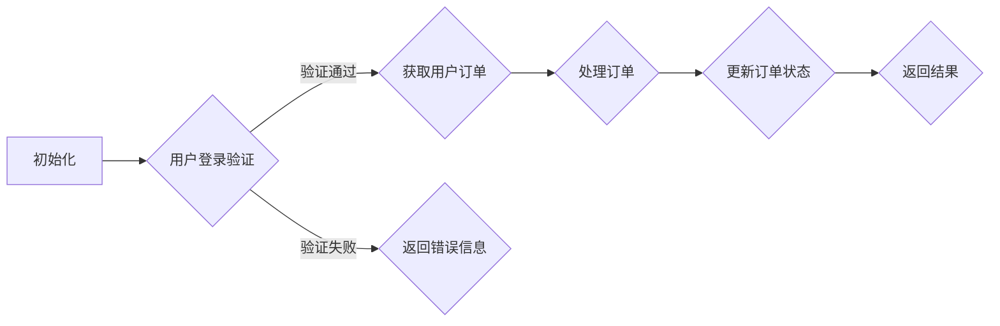
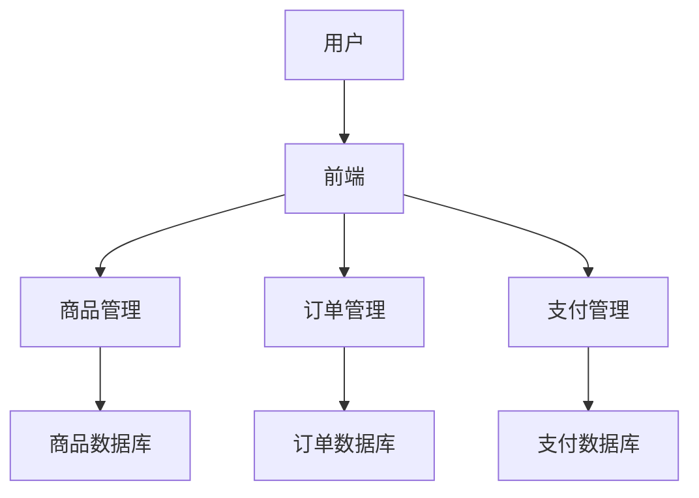

                 

# 领域模型也有软肋

> 关键词：领域模型、软肋、局限性、应用场景、案例分析

> 摘要：领域模型是软件工程中的一种重要设计方法，通过抽象和概括业务领域的本质特征，以帮助开发人员更好地理解和实现系统功能。然而，领域模型并非完美无缺，它也存在一些软肋和局限性。本文将深入探讨领域模型的概念、软肋、应用场景，并结合实际案例进行分析，旨在帮助读者全面理解领域模型，提高其在实际项目中的应用能力。

## 一、背景介绍

领域模型（Domain Model）是面向对象设计方法的核心概念之一，它通过抽象和概括业务领域的本质特征，构建出一个与具体实现技术无关的领域模型。领域模型的目标是使开发人员能够更好地理解业务领域，从而在实现系统功能时更加高效和准确。

领域模型的发展可以追溯到20世纪80年代，当时随着面向对象设计方法的出现，领域模型作为一种新的设计方法逐渐受到关注。在软件工程实践中，领域模型被广泛应用于各种类型的系统中，如企业级应用、电商平台、社交网络等。

领域模型的重要性主要体现在以下几个方面：

1. **提高开发效率**：通过领域模型，开发人员可以更加直观地理解业务领域，从而减少需求分析和设计阶段的错误和遗漏，提高开发效率。
2. **促进团队协作**：领域模型提供了统一的抽象层次，使得团队成员能够在同一个语言环境下进行沟通和协作，减少误解和冲突。
3. **支持系统扩展和维护**：领域模型通过封装和模块化，使得系统在扩展和维护时更加灵活和方便。

## 二、核心概念与联系

### 1. 领域模型的核心概念

领域模型由以下核心概念组成：

- **实体（Entity）**：表示业务领域中的对象，如用户、订单、产品等。
- **关系（Relationship）**：表示实体之间的关联，如用户下单、产品评论等。
- **行为（Behavior）**：表示实体可以执行的操作，如用户登录、产品搜索等。

### 2. 概念属性特征对比表格

| 概念 | 定义 | 属性特征对比 |
| --- | --- | --- |
| 实体 | 表示业务领域中的对象 | - 名称：<br>- 类型：<br>- 属性： |
| 关系 | 表示实体之间的关联 | - 名称：<br>- 参与实体：<br>- 关联类型： |
| 行为 | 表示实体可以执行的操作 | - 名称：<br>- 参数：<br>- 返回值： |

### 3. ER实体关系图架构

```mermaid
erDiagram
  User ||--o> Order : "下单"
  Product ||--o> Order : "订购"
  Comment ||--|> Product : "评论"
```

## 三、算法原理讲解

领域模型的实现往往涉及一系列算法。以下将介绍一个简单的领域模型算法，并使用Mermaid画出算法流程图，然后用Python代码和LaTeX公式来详细阐述算法原理。

### 1. 算法流程图



### 2. Python代码

```python
def user_login(username, password):
    # 用户登录验证
    if verify_login(username, password):
        return get_user_orders(username)
    else:
        return "登录失败"

def get_user_orders(username):
    # 获取用户订单
    orders = query_orders_by_username(username)
    return orders

def process_order(order):
    # 处理订单
    update_order_status(order)
    return "订单处理完成"

def verify_login(username, password):
    # 用户登录验证
    # ...（省略具体实现）
    return True

def query_orders_by_username(username):
    # 查询用户订单
    # ...（省略具体实现）
    return orders

def update_order_status(order):
    # 更新订单状态
    # ...（省略具体实现）
```

### 3. 算法原理的数学模型和公式

领域模型中的算法通常可以通过数学模型来描述。以下是一个简单的数学模型示例：

$$
\text{处理订单} = \text{登录验证} \land \text{订单查询} \land \text{订单处理}
$$

其中，$\land$ 表示逻辑与操作。

## 四、系统分析与架构设计方案

领域模型在实际系统中的应用场景非常广泛。以下将介绍一个典型的电商平台的领域模型，并分析其系统架构设计方案。

### 1. 问题描述

电商平台是一个复杂的系统，涉及到用户、商品、订单、支付等多个领域。领域模型可以帮助开发人员更好地理解和实现这些领域的功能。

### 2. 系统功能设计

电商平台的功能设计主要包括用户管理、商品管理、订单管理、支付管理等。领域模型可以抽象出以下核心实体和关系：

- 实体：用户、商品、订单、支付
- 关系：用户下单、商品评论、订单支付

### 3. 系统架构设计

电商平台的系统架构设计可以分为前端、后端和数据库三个部分。以下是一个简单的Mermaid架构图：



### 4. 系统接口设计和系统交互

电商平台中的各个模块需要通过接口进行交互。以下是一个简单的Mermaid序列图：

```mermaid
sequenceDiagram
    participant 用户 as 用户
    participant 前端 as 前端
    participant 后端 as 后端
    participant 支付 as 支付
    用户->>前端：请求页面
    前端->>后端：获取数据
    后端->>前端：返回数据
    前端->>用户：展示页面
    用户->>前端：提交订单
    前端->>后端：创建订单
    后端->>支付：支付订单
    支付->>后端：支付结果
    后端->>前端：订单状态
    前端->>用户：通知结果
```

## 五、项目实战

以下将结合一个实际电商项目，介绍如何应用领域模型。

### 1. 环境安装

安装所需的开发工具和库，如Python、Django、MySQL等。

```shell
pip install django mysql-connector-python
```

### 2. 系统核心实现

使用Django框架实现用户管理、商品管理、订单管理、支付管理等功能。以下是用户管理模块的代码示例：

```python
# users/models.py
from django.db import models

class User(models.Model):
    username = models.CharField(max_length=50)
    password = models.CharField(max_length=50)

# users/views.py
from django.http import JsonResponse
from .models import User

def login(request):
    username = request.POST.get('username')
    password = request.POST.get('password')
    user = User.objects.filter(username=username, password=password)
    if user:
        return JsonResponse({'status': 'success'})
    else:
        return JsonResponse({'status': 'fail'})
```

### 3. 代码应用解读与分析

通过上述代码，我们可以看到如何使用Django框架实现用户登录功能。首先，在models.py中定义用户实体，然后在views.py中处理用户登录请求。

### 4. 实际案例分析和详细讲解剖析

以下是一个实际案例：用户登录电商平台。

- 用户输入用户名和密码。
- 前端将用户信息发送到后端。
- 后端通过数据库查询用户信息。
- 如果用户信息匹配，返回成功消息；否则，返回失败消息。

### 5. 项目小结

通过这个实际案例，我们可以看到领域模型在实际项目中的应用。领域模型帮助我们抽象出用户、商品、订单等核心实体，从而简化了系统设计和开发过程。

## 六、最佳实践 tips、小结、注意事项、拓展阅读

### 最佳实践 tips

1. **明确领域模型的目标**：在设计领域模型时，首先要明确模型的目标，以确保模型能够准确地反映业务领域。
2. **关注领域模型的抽象层次**：领域模型的抽象层次应该适中，既不能过于具体，也不能过于抽象。适中的抽象层次可以帮助开发人员更好地理解和实现系统功能。
3. **持续优化领域模型**：领域模型并非一成不变，随着业务发展和需求变化，领域模型也需要不断优化和调整。

### 小结

本文从背景介绍、核心概念与联系、算法原理讲解、系统分析与架构设计方案、项目实战等多个方面，全面阐述了领域模型的概念、软肋和应用场景。通过实际案例的分析，读者可以更好地理解领域模型在实际项目中的应用。

### 注意事项

1. **领域模型的抽象层次要适中**：过于具体的模型会增加开发难度，而过于抽象的模型则可能导致理解和实现上的困难。
2. **领域模型的更新要及时**：随着业务的发展和需求的变化，领域模型也需要及时更新，以确保其能够准确反映业务领域。

### 拓展阅读

1. 《领域驱动设计（Domain-Driven Design）》 - Eric Evans
2. 《软件架构设计：基于OOA和OOD的模型》 - Mark Richards

作者：AI天才研究院/AI Genius Institute & 禅与计算机程序设计艺术 /Zen And The Art of Computer Programming

