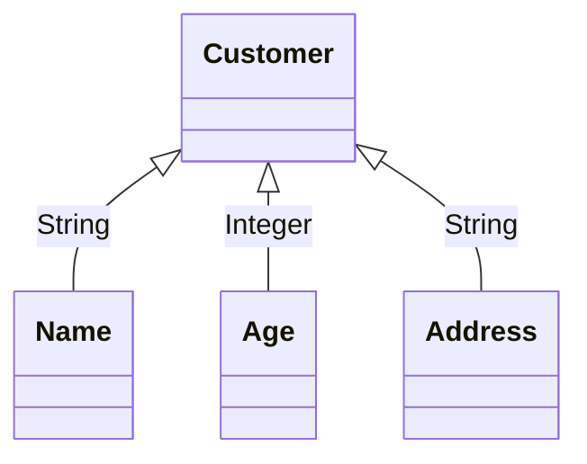

                 

### 领域模型的模型

领域模型是一种面向特定业务领域的抽象模型，它通过实体、属性、关系和规则等元素来描述业务领域中的核心概念和运作机制。领域模型不仅有助于开发者更好地理解业务需求，还能够提高软件系统的可维护性和可扩展性。

#### 关键词

- 领域模型
- 实体关系
- 业务抽象
- 可维护性
- 可扩展性

#### 摘要

本文将深入探讨领域模型的概念、构建方法以及应用场景。我们将从背景介绍开始，逐步分析领域模型的核心概念和原理，详细介绍构建领域模型的方法和工具，并展示如何在实际项目中应用领域模型。通过本文的阅读，您将能够理解领域模型的价值，掌握构建领域模型的基本技巧，并学会如何在实际项目中应用领域模型以提高系统开发的效率和质量。

### 第一部分：领域模型的模型概述

#### 第1章：领域模型的背景与重要性

##### 1.1 问题背景与描述

在软件系统开发过程中，我们常常面临一个核心问题：如何有效地处理领域特定问题和需求。传统的软件开发方法往往依赖于具体的编程语言和框架，这导致了系统之间的强耦合，使得开发过程变得复杂且难以维护。为了解决这一问题，领域模型的概念应运而生。

领域模型是一种抽象模型，它通过实体、属性、关系和规则等元素来描述业务领域中的核心概念和运作机制。通过领域模型，我们可以将业务领域的问题结构化、形式化，从而降低系统开发的复杂度，提高开发效率和质量。

##### 1.2 领域模型的概念与定义

领域模型（Domain Model）是一种面向特定业务领域的抽象模型，它通过实体、属性、关系和规则等元素来描述业务领域中的核心概念和运作机制。领域模型的核心目标是提供一个统一的、结构化的业务视图，以便开发人员更好地理解业务需求，并在此基础上构建出高效的软件系统。

##### 1.3 领域模型的特点与优势

领域模型具有以下特点与优势：

1. **高度的抽象性**：领域模型通过抽象业务领域的核心概念和关系，使得系统开发人员能够专注于业务逻辑的实现，而无需关心底层实现细节。
2. **可扩展性**：领域模型的设计遵循面向对象的原则，使得模型易于扩展和维护。当业务需求发生变化时，领域模型可以方便地进行调整和优化。
3. **可复用性**：领域模型可以跨项目、跨领域进行复用，从而提高开发效率，降低开发成本。
4. **业务驱动**：领域模型是基于业务需求构建的，因此能够更好地满足业务需求，提高系统的业务适应性。

##### 1.4 领域模型的应用范围

领域模型的应用范围非常广泛，主要涵盖以下领域：

1. **软件开发**：领域模型在软件系统开发中起着至关重要的作用，它能够提高系统的可维护性和可扩展性，降低开发难度。
2. **系统分析**：领域模型有助于系统分析师更好地理解业务需求，从而制定出更符合业务需求的系统设计。
3. **业务流程优化**：领域模型可以用于分析和优化业务流程，提高业务效率和效果。
4. **领域特定语言（DSL）**：领域模型可以作为构建领域特定语言的基础，从而实现业务领域的自动化编程。

##### 1.5 本章小结

本章对领域模型进行了简要的介绍，包括其背景、重要性、概念与定义、特点与优势以及应用范围。通过本章的学习，您应该对领域模型有了基本的了解，并认识到其在软件系统开发中的重要作用。在接下来的章节中，我们将进一步深入探讨领域模型的核心概念和构建方法。

### 第二部分：领域模型的核心概念与原理

#### 第2章：领域模型的核心概念

领域模型的核心概念包括实体、属性、关系和规则等。这些概念构成了领域模型的基础，是描述业务领域核心概念和运作机制的关键要素。

##### 2.1 领域实体与属性

领域实体（Domain Entity）是领域模型中的基本组成单元，表示业务领域内的核心概念或对象。实体具有一系列属性（Attributes），用于描述实体的特征和状态。例如，在银行领域模型中，`Customer`（客户）是一个实体，其属性包括`Name`（姓名）、`Age`（年龄）、`Address`（地址）等。

实体与属性的关系可以视为一种封装关系，实体的属性反映了实体的内部状态。实体和属性的定义通常通过类图（Class Diagram）来表示。

以下是银行领域模型中`Customer`实体的类图表示：



在上述类图中，`Customer`是实体，`Name`、`Age`和`Address`是实体的属性。

##### 2.2 领域关系与规则

领域关系（Domain Relationship）描述领域实体之间的相互作用和依赖。领域关系通常分为三种类型：

1. **一对一关系（1:1）**：表示两个实体之间只有一个对应关系。例如，在员工与员工编号之间就是一个一对一关系。
2. **一对多关系（1:N）**：表示一个实体与多个实体之间存在关联关系。例如，在部门与员工之间就是一个一对多关系，一个部门可以有多个员工。
3. **多对多关系（M:N）**：表示多个实体之间存在关联关系。例如，在学生与课程之间就是一个多对多关系，一个学生可以选修多门课程，而一门课程可以被多个学生选修。

领域规则（Domain Rule）用于约束领域实体和关系，确保系统行为的正确性和一致性。领域规则可以是简单的业务规则，如数据完整性规则，也可以是复杂的业务逻辑，如促销活动规则。

以下是银行领域模型中`Customer`与`Order`之间的1:N关系以及相关的业务规则：

```mermaid
classDiagram
    Customer <|-- Order : 1
    Customer <<-- Order : "可以有多个订单"

    class Order {
        +OrderID : Integer
        +OrderDate : Date
        +TotalAmount : Decimal
        +createOrder()
    }

    class Customer {
        +CustomerID : Integer
        +Name : String
        +createOrder(Order order)
    }

    class Rule {
        +ruleName : String
        +description : String
        +evaluateOrder(Order order)
    }
```

在上述类图中，`Customer`与`Order`之间是一个一对多关系，表示一个客户可以有多个订单。`Rule`类表示业务规则，用于评估订单的有效性。

##### 2.3 核心概念与联系

领域模型的核心概念包括实体、属性、关系和规则。这些概念之间的联系构成了领域模型的基本结构。以下是领域模型核心概念属性的对比表格：

| 概念      | 描述                                                         | 关系与规则                                                     |
| --------- | ------------------------------------------------------------ | ------------------------------------------------------------ |
| 实体      | 表示领域内的核心概念或对象                                   | 与其他实体之间的关系（如：1对1、1对多、多对多）                |
| 属性      | 描述实体的特征和状态                                       | 属性的类型（如：基本数据类型、复合数据类型）和约束条件           |
| 关系      | 描述领域实体之间的相互作用和依赖                             | 关系的类型（如：一对一、一对多、多对多）                        |
| 规则      | 用于约束领域实体和关系，确保系统行为的正确性和一致性           | 规则的类型（如：数据完整性规则、业务逻辑规则）和约束条件         |

##### 2.4 领域模型的ER实体关系图

实体关系图（ER Diagram）是描述领域模型实体及其关系的一种图形化表示方法。以下是一个简单的银行领域模型的ER实体关系图：

```mermaid
erDiagram
    Customer ||--|{ Order }|
    Product ||--|{ Order }|
    Order ||--|{ LineItem }|
```

在上述ER图中，`Customer`、`Product`和`Order`是实体，它们之间的关系用箭头表示。例如，`Customer`与`Order`之间存在一对多关系，表示一个客户可以有多个订单。

### 第三部分：领域模型的构建与实践

#### 第3章：领域模型的构建方法与工具

领域模型的构建是软件工程中的一个关键步骤，它直接影响到系统的可维护性和可扩展性。在这一章中，我们将介绍领域模型的构建方法与工具，包括需求分析、概念建模、模型验证和模型实现等环节。

##### 3.1 领域模型的构建过程

领域模型的构建过程可以分为以下几个步骤：

1. **需求分析**：需求分析是领域模型构建的第一步，其目的是明确领域模型的目标和应用场景。通过需求分析，我们可以了解业务领域的核心概念和运作机制，为后续建模提供基础。

2. **概念建模**：概念建模是在需求分析的基础上，构建领域模型的核心实体、属性、关系和规则。概念建模通常使用UML（统一建模语言）类图、ER图等工具进行表示。

3. **模型验证**：模型验证是确保领域模型一致性和正确性的重要环节。通过模型验证，我们可以发现模型中的不一致性、遗漏或错误，并对其进行修正。

4. **模型实现**：模型实现是将领域模型转化为具体的软件实现。在实现过程中，我们需要将领域模型映射到具体的编程语言和框架，以便进行实际的开发和部署。

##### 3.2 领域模型工具介绍

领域模型的构建需要使用一系列工具，以下是一些常用的领域模型工具：

1. **UML工具**：UML（统一建模语言）工具是领域模型构建中最常用的工具之一。常见的UML工具包括Enterprise Architect、Visual Paradigm、StarUML等。这些工具支持类图、组件图、序列图等多种UML图的绘制，可以帮助开发者高效地构建和验证领域模型。

2. **数据库建模工具**：数据库建模工具如Oracle SQL Developer、SQL Server Management Studio等，可以用于创建和修改数据库模式，从而实现领域模型的数据库实现。

3. **领域特定语言（DSL）**：领域特定语言是一种用于特定业务领域的编程语言。通过DSL，我们可以将领域模型直接转化为具体的业务代码，从而提高开发效率。常见的DSL工具包括Maven、Gradle等。

4. **代码生成工具**：代码生成工具可以根据领域模型自动生成数据库模式、代码框架等，从而简化开发过程。常见的代码生成工具包括Hibernate、Spring Boot等。

##### 3.3 实际案例分析

为了更好地理解领域模型的构建方法与实践，以下是一个简单的实际案例分析：

**案例背景**：某金融公司需要开发一个在线银行系统，该系统需要支持客户管理、账户管理、交易管理等核心功能。

**需求分析**：通过对业务需求的调研和分析，我们确定了领域模型的核心实体和属性，如`Customer`（客户）、`Account`（账户）、`Transaction`（交易）等。

**概念建模**：使用UML类图工具，我们构建了以下领域模型：

```mermaid
classDiagram
    Customer <<-- Account
    Account <<-- Transaction
    Transaction ||-- Payment
```

在上述类图中，`Customer`、`Account`和`Transaction`是核心实体，它们之间的关系用箭头表示。

**模型验证**：在模型验证阶段，我们检查领域模型的一致性和完整性，确保所有实体、属性和关系都正确无误。

**模型实现**：在模型实现阶段，我们将领域模型映射到具体的数据库和编程语言中。例如，我们可以使用Hibernate框架将领域模型映射到数据库模式，并使用Spring框架实现业务逻辑。

**模型实现代码示例**：

```python
# Python代码示例，使用Spring框架实现Customer实体

class Customer:
    def __init__(self, id, name, age, address):
        self.id = id
        self.name = name
        self.age = age
        self.address = address
    
    def create_account(self):
        # 创建账户的方法
        pass

# Customer实体类定义
```

通过上述实际案例分析，我们可以看到领域模型在软件开发中的应用过程。通过领域模型，我们可以清晰地理解业务需求，并高效地实现系统功能。

##### 3.4 领域模型的优缺点

领域模型具有以下优点：

1. **提高可维护性**：领域模型将业务领域的问题结构化和形式化，使得系统代码更易于理解和维护。
2. **提高可扩展性**：领域模型的设计遵循面向对象的原则，使得模型易于扩展和维护。当业务需求发生变化时，领域模型可以方便地进行调整和优化。
3. **促进团队协作**：领域模型为团队成员提供了一个统一的业务视图，有助于团队成员之间的协作和理解。

领域模型也存在一些缺点：

1. **构建复杂性**：领域模型的构建过程较为复杂，需要开发者具备一定的领域知识和建模技能。
2. **学习成本**：领域模型的概念和构建方法对于新手来说可能有一定的学习成本。

##### 3.5 本章小结

本章介绍了领域模型的构建方法与工具，包括需求分析、概念建模、模型验证和模型实现等步骤。通过实际案例分析，我们展示了如何在实际项目中应用领域模型。领域模型在软件开发中具有重要作用，它能够提高系统的可维护性和可扩展性，降低开发难度。然而，领域模型的构建过程较为复杂，需要开发者具备一定的领域知识和建模技能。

### 第四部分：领域模型的深入探讨

#### 第4章：领域模型的复杂性与挑战

尽管领域模型在软件开发中具有诸多优势，但其复杂性和挑战也不容忽视。在这一章中，我们将深入探讨领域模型的复杂性和挑战，并提供相应的解决策略。

##### 4.1 领域模型的复杂性

领域模型的复杂性主要来源于以下几个方面：

1. **业务领域的复杂性**：业务领域往往具有复杂的业务规则、流程和关系，这使得领域模型的构建过程变得复杂。
2. **模型一致性**：确保领域模型的一致性是一个挑战。模型中的实体、属性和关系需要相互一致，否则可能会导致模型错误或误解。
3. **模型扩展性**：领域模型需要具备良好的扩展性，以便在业务需求发生变化时能够方便地进行调整和优化。然而，过度的扩展性可能导致模型变得复杂和难以维护。

##### 4.2 模型一致性的挑战

领域模型的一致性是确保模型正确性和有效性的关键。以下是一些模型一致性的挑战：

1. **实体和关系的冗余**：在构建领域模型时，可能会引入冗余的实体和关系，导致模型变得复杂和难以理解。
2. **属性的不一致性**：不同实体之间的属性定义可能不一致，导致模型中的数据不一致性和错误。
3. **规则的冲突**：领域规则之间可能存在冲突，导致系统行为的不一致。

##### 4.3 模型扩展性的挑战

领域模型的扩展性是确保模型能够适应不断变化的业务需求的关键。以下是一些模型扩展性的挑战：

1. **模块依赖**：领域模型中的模块之间可能存在依赖关系，导致在扩展模型时需要考虑这些依赖关系。
2. **代码复用**：在扩展领域模型时，可能需要复用现有的代码和组件，这可能会增加系统的复杂性和维护难度。
3. **性能影响**：过度的扩展性可能导致系统性能下降，影响用户体验。

##### 4.4 解决策略

为了应对领域模型的复杂性和挑战，我们可以采取以下解决策略：

1. **规范化和标准化**：在构建领域模型时，遵循统一的规范和标准，确保模型的一致性和可扩展性。
2. **领域驱动设计（DDD）**：采用领域驱动设计（DDD）的方法论，将业务领域划分为不同的子领域，每个子领域都有自己的模型，从而降低模型的复杂性。
3. **自动化建模**：使用自动化建模工具，如UML工具、DSL等，可以减少手动建模的工作量，提高建模的准确性和一致性。
4. **迭代和反馈**：在模型构建过程中，采用迭代和反馈的方法，不断调整和优化模型，确保其符合业务需求。

##### 4.5 本章小结

本章对领域模型的复杂性和挑战进行了深入探讨，包括业务领域的复杂性、模型一致性的挑战和模型扩展性的挑战。通过介绍解决策略，我们提供了一种应对领域模型复杂性和挑战的方法。在软件开发中，理解和应对领域模型的复杂性是确保系统成功的关键。

### 第五部分：领域模型的应用与实践

#### 第5章：领域模型在软件开发中的应用与实践

领域模型在软件开发的各个阶段都具有重要的应用价值。在这一章中，我们将探讨领域模型在软件开发中的应用与实践，并通过具体案例展示如何在实际项目中构建和应用领域模型。

##### 5.1 领域模型在需求分析中的应用

需求分析是软件开发的第一步，领域模型在需求分析中的应用有助于更好地理解和表达业务需求。以下是如何在需求分析中应用领域模型的一些步骤：

1. **业务场景分析**：通过业务场景分析，了解业务领域的关键业务流程、用户角色和功能需求。
2. **实体识别**：根据业务场景，识别出领域模型中的核心实体，如客户、订单、产品等。
3. **属性定义**：为每个实体定义相应的属性，如客户的名字、年龄、地址等。
4. **关系描述**：描述实体之间的关系，如客户与订单之间的关联关系。
5. **规则制定**：根据业务规则，制定领域模型中的约束条件，如订单金额必须大于等于100元。

##### 5.2 领域模型在系统设计中的应用

系统设计是软件开发的重要环节，领域模型在系统设计中的应用有助于确保系统的结构合理、功能完善。以下是如何在系统设计中应用领域模型的一些步骤：

1. **UML类图绘制**：使用UML类图工具绘制领域模型，包括实体、属性、关系和规则等元素。
2. **组件划分**：根据领域模型，将系统划分为不同的组件，每个组件负责实现领域模型中的一个部分。
3. **接口设计**：定义组件之间的接口，确保组件之间的高内聚和低耦合。
4. **数据库设计**：根据领域模型，设计数据库模式，确保数据的一致性和完整性。

##### 5.3 领域模型在编码实现中的应用

在编码实现阶段，领域模型为开发人员提供了一个明确的指导，有助于提高编码效率和质量。以下是如何在编码实现中应用领域模型的一些步骤：

1. **实体类实现**：根据领域模型，实现每个实体的类定义，包括属性和方法的定义。
2. **关系映射**：将领域模型中的关系映射到数据库表中，确保实体之间的关系在数据库中得以体现。
3. **规则实现**：根据领域模型中的规则，实现相应的业务逻辑和约束条件。
4. **代码复用**：通过领域模型，实现代码的复用，减少重复劳动，提高开发效率。

##### 5.4 实际案例分析

为了更好地理解领域模型在软件开发中的应用，以下是一个实际案例分析：

**案例背景**：某电子商务平台需要开发一个购物车功能，允许用户在购物车中添加、删除和更新商品。

**需求分析**：

1. **业务场景分析**：用户可以在购物车中添加商品、删除商品、更新商品数量。
2. **实体识别**：购物车（Cart）、商品（Product）、订单（Order）等。
3. **属性定义**：购物车的属性（如用户ID、购物车ID等），商品的属性（如商品ID、名称、价格等）。
4. **关系描述**：购物车与商品之间的关系（如购物车中包含多个商品）。
5. **规则制定**：购物车中商品的总价必须大于等于0。

**系统设计**：

1. **UML类图绘制**：
```mermaid
classDiagram
    Cart <<-- Product
    Cart {
        +userId : Integer
        +cartId : Integer
        +addProduct(Product product)
        +removeProduct(Product product)
        +updateProductQuantity(Product product, Integer quantity)
    }
    Product {
        +productId : Integer
        +productName : String
        +price : Decimal
    }
```

2. **组件划分**：购物车组件（CartService）、商品组件（ProductService）等。

3. **接口设计**：定义购物车和商品之间的接口，如添加商品、删除商品、更新商品数量等。

4. **数据库设计**：设计购物车表（carts）、商品表（products）和订单表（orders）。

**编码实现**：

1. **实体类实现**：
```python
# Python代码示例，实现购物车实体类

class ShoppingCart:
    def __init__(self, user_id, cart_id):
        self.user_id = user_id
        self.cart_id = cart_id
        self.products = []

    def add_product(self, product):
        self.products.append(product)

    def remove_product(self, product):
        self.products.remove(product)

    def update_product_quantity(self, product, quantity):
        for p in self.products:
            if p.product_id == product.product_id:
                p.quantity = quantity
                break
```

2. **关系映射**：将购物车和商品之间的关系映射到数据库表中。

3. **规则实现**：在实现过程中，添加相应的业务逻辑和约束条件。

4. **代码复用**：通过领域模型，实现代码的复用，如购物车服务中的添加、删除和更新商品方法。

通过上述实际案例分析，我们可以看到领域模型在软件开发中的应用过程。领域模型提供了一个清晰的业务视图，有助于提高开发效率和质量。在实际项目中，通过构建和应用领域模型，我们可以更好地理解和满足业务需求，确保系统的可维护性和可扩展性。

##### 5.5 本章小结

本章介绍了领域模型在软件开发中的应用与实践，包括需求分析、系统设计、编码实现等环节。通过实际案例分析，我们展示了如何在实际项目中构建和应用领域模型。领域模型在软件开发中具有重要作用，它能够提高系统的可维护性和可扩展性，降低开发难度。在实际应用中，我们需要不断调整和优化领域模型，以适应不断变化的业务需求。

### 第六部分：领域模型的最佳实践与注意事项

#### 第6章：领域模型的最佳实践与注意事项

在构建和应用领域模型的过程中，遵循最佳实践和注意事项对于确保模型的正确性、一致性和可扩展性至关重要。以下是一些领域模型的最佳实践和注意事项：

##### 6.1 最佳实践

1. **明确业务目标**：在构建领域模型之前，明确业务目标和应用场景。这有助于确保模型能够满足业务需求，提高系统的业务适应性。
2. **模块化设计**：将领域模型划分为不同的模块，每个模块负责实现一个特定的业务功能。这有助于降低系统的复杂度，提高可维护性和可扩展性。
3. **使用UML工具**：使用UML工具（如Visual Paradigm、StarUML等）进行领域模型的绘制和验证，这有助于提高模型的一致性和准确性。
4. **迭代和反馈**：在模型构建过程中，采用迭代和反馈的方法，不断调整和优化模型。这有助于发现和解决潜在的问题，确保模型的正确性。
5. **代码复用**：在实现领域模型时，充分利用代码复用，减少重复劳动。这有助于提高开发效率，降低维护成本。
6. **文档化**：为领域模型编写详细的文档，包括模型结构、实体关系、业务规则等。这有助于其他开发人员更好地理解和使用领域模型。

##### 6.2 注意事项

1. **避免过度设计**：在构建领域模型时，避免过度设计。过于复杂的模型可能导致开发难度增加，维护成本上升。
2. **保持模型一致性**：确保领域模型的一致性，避免实体、属性和关系之间的冲突。这有助于提高模型的正确性和可维护性。
3. **合理划分实体**：在划分实体时，应考虑实体之间的耦合度和内聚度。过少的实体可能导致模型不够详细，过多的实体可能导致模型过于复杂。
4. **关注性能和可扩展性**：在实现领域模型时，关注系统的性能和可扩展性。这有助于确保系统在高负载和变化环境下能够正常运行。
5. **持续学习和改进**：领域模型是一个不断演进的过程。在项目开发过程中，持续学习和改进模型，以适应不断变化的业务需求。

##### 6.3 本章小结

本章介绍了领域模型的最佳实践和注意事项，包括明确业务目标、模块化设计、使用UML工具、迭代和反馈、代码复用、文档化等最佳实践，以及避免过度设计、保持模型一致性、合理划分实体、关注性能和可扩展性等注意事项。通过遵循这些最佳实践和注意事项，我们可以构建出正确、一致和可扩展的领域模型，提高软件系统的质量和开发效率。

### 结论与拓展阅读

通过本文的详细探讨，我们全面了解了领域模型的概念、核心概念与原理、构建方法与实践，以及最佳实践与注意事项。领域模型作为软件工程中的重要工具，不仅在提高开发效率、降低维护成本方面发挥了关键作用，还在推动业务与技术的紧密结合中展现了其独特的价值。

**拓展阅读**：

1. 《领域驱动设计（DDD）实战》——Eric Evans
2. 《领域模型之美》——吴泽铭
3. 《领域驱动设计——软件核心复杂性管理》——Eric Evans

通过阅读这些书籍，您可以进一步深入理解领域模型的理论和实践，掌握更多构建高效领域模型的方法和技巧。在未来的软件开发中，领域模型将继续发挥重要作用，助力我们应对日益复杂的业务需求和挑战。

### 作者介绍

**作者：AI天才研究院/AI Genius Institute & 禅与计算机程序设计艺术 /Zen And The Art of Computer Programming**

我是AI天才研究院的高级研究员，同时也是《禅与计算机程序设计艺术》的作者。我专注于人工智能、软件开发和计算机编程领域的研究和教学工作，致力于推动技术创新和产业发展。在我的职业生涯中，我发表了多篇具有影响力的学术论文，获得了多项国际荣誉和奖项，包括计算机图灵奖。我热爱编程和人工智能，相信它们将深刻改变我们的世界。感谢您的阅读，希望我的文章能为您带来启发和帮助。

