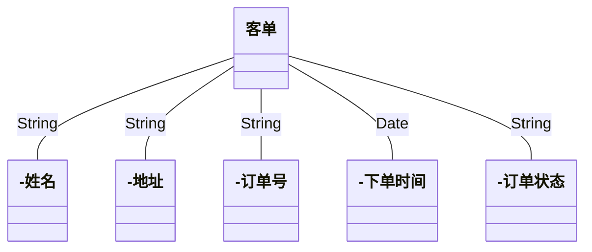
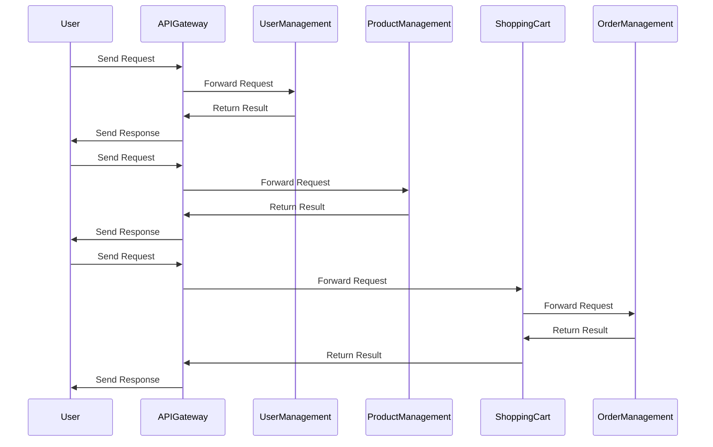

                 

### 文章标题

领域模型神功可护体

> 关键词：领域模型、实体关系、DSL、系统架构、优化策略、复杂系统设计、发展趋势、最佳实践

> 摘要：本文深入探讨了领域模型的基础知识、核心概念、应用场景、实现与优化策略，以及其在复杂系统设计和现代软件开发中的趋势与挑战。通过详细的案例分析和技术讲解，帮助读者全面理解领域模型的神功，掌握其在软件开发中的实际应用。

### 目录大纲

```markdown
----------------------------------------------------------------
# 第一部分: 领域模型基础知识

## 第1章: 领域模型的背景与概述

### 1.1 领域模型的概念与重要性

### 1.2 领域模型的发展历程

### 1.3 领域模型的基本原则

## 第2章: 领域模型的核心概念与要素

### 2.1 实体与关系的识别

#### 2.1.1 实体的定义与属性

#### 2.1.2 关系的定义与分类

### 2.2 领域模型的构建方法

#### 2.2.1 实体-关系模型（ER模型）

#### 2.2.2 类图与对象图

## 第3章: 领域模型的应用场景与案例分析

### 3.1 领域模型在软件开发中的应用

#### 3.1.1 领域特定语言（DSL）

#### 3.1.2 领域模型在系统架构设计中的应用

### 3.2 领域模型在不同行业中的成功案例

#### 3.2.1 银行业务领域模型

#### 3.2.2 医疗领域模型

## 第4章: 领域模型的实现与优化

### 4.1 领域模型的实现技术

#### 4.1.1 数据库设计

#### 4.1.2 领域特定语言（DSL）开发

### 4.2 领域模型的优化策略

#### 4.2.1 性能优化

#### 4.2.2 可维护性与可扩展性

## 第5章: 领域模型在复杂系统设计中的应用

### 5.1 复杂系统设计与领域模型

#### 5.1.1 系统功能需求分析

#### 5.1.2 系统架构设计

### 5.2 复杂系统案例分析

#### 5.2.1 智能交通系统

#### 5.2.2 电子商务平台

## 第6章: 领域模型在现代软件开发中的趋势与挑战

### 6.1 领域模型的发展趋势

#### 6.1.1 领域模型与云计算的结合

#### 6.1.2 领域模型与人工智能的结合

### 6.2 领域模型面临的挑战与解决方案

#### 6.2.1 跨领域模型整合

#### 6.2.2 领域模型的可解释性

## 第7章: 领域模型的最佳实践与未来展望

### 7.1 领域模型的最佳实践

#### 7.1.1 实践经验总结

#### 7.1.2 领域模型优化实践

### 7.2 领域模型的发展方向与未来展望

#### 7.2.1 领域模型的创新应用

#### 7.2.2 领域模型在教育领域的发展

----------------------------------------------------------------
```

### 背景介绍

领域模型是一种用于描述特定业务领域知识的抽象模型，它可以帮助软件开发者更好地理解业务需求，从而设计出更加高效、准确的软件系统。随着信息技术的不断发展，领域模型在软件开发中的应用越来越广泛，已经成为现代软件开发中不可或缺的一部分。

在本书中，我们将从多个角度深入探讨领域模型的理论基础、应用实践和未来发展。首先，我们将介绍领域模型的基本概念和重要性，回顾领域模型的发展历程和基本原则。接着，我们会详细讲解领域模型的核心概念，如实体与关系的识别、构建方法等。然后，通过实际案例，展示领域模型在不同行业中的应用场景。在实现与优化的章节中，我们将探讨领域模型的实现技术，如数据库设计和领域特定语言（DSL）开发，以及优化策略。对于复杂系统设计，我们将提供具体的案例，以展示领域模型的应用。最后，我们会讨论领域模型在现代软件开发中的趋势和挑战，并分享最佳实践和未来展望。

### 核心概念与联系

领域模型的核心概念包括实体和关系。实体是领域模型中最基本的组成单位，它表示领域中的具体对象，如人、物品、事件等。每个实体都有若干属性，用于描述其实际特征。例如，在银行业务领域模型中，客户是一个实体，其属性可能包括姓名、地址、身份证号码等。

关系则是连接实体之间的抽象表示。它描述了实体之间的交互和依赖关系。在领域模型中，关系通常分为一对一、一对多和多对多三种类型。例如，在电子商务领域模型中，订单与商品之间存在一对多的关系，即一个订单可以包含多个商品，但一个商品可以被多个订单包含。

为了更好地理解和应用领域模型，我们提供以下表格，对比实体和关系的属性特征：

| 特征       | 实体                             | 关系                         |
| ---------- | ------------------------------ | ------
| **定义**   | 表示领域中的具体对象           | 描述实体之间的交互和依赖关系 |
| **属性**   | 包含实体的特征和属性           | 描述关系的类型和约束条件     |
| **类型**   | 实体分为基本实体、复合实体等   | 关系分为一对一、一对多、多对多 |
| **实例**   | 具体的对象实例，如客户、订单等 | 实体之间的连接，如客户下单等 |

下面是一个简单的ER实体关系图，用于描述客户与订单之间的关系：

```mermaid
erDiagram
  客户 ||--|{ 订单 }|
  客户 {
    id
    姓名
    地址
  }
  订单 {
    订单号
    下单时间
    订单状态
  }
```

在接下来的章节中，我们将详细探讨领域模型的理论基础、核心概念、应用场景、实现与优化策略，以及其在复杂系统设计和现代软件开发中的趋势与挑战。

### 第1章: 领域模型的背景与概述

#### 1.1 领域模型的概念与重要性

领域模型（Domain Model）是软件开发过程中的一种抽象模型，它用于描述特定业务领域中的实体、关系和规则。领域模型的核心目标是将业务领域的知识转化为计算机可以理解和处理的结构，从而为软件开发提供清晰、一致和可扩展的基础。

领域模型的重要性主要体现在以下几个方面：

1. **需求理解与沟通**：领域模型能够帮助开发人员更好地理解业务需求，并将其转化为具体的软件设计。通过领域模型，开发人员、业务分析师和利益相关者可以更直观地沟通和协作，确保开发出的软件能够真正满足业务需求。

2. **系统可维护性**：领域模型提供了一个统一的视图，使得系统设计和实现更加清晰和有序。这有助于提高代码的可维护性和可扩展性，降低后期维护的成本。

3. **重用性**：领域模型可以作为软件组件库的基础，使得不同项目之间可以复用相同的模型和组件，提高开发效率。

4. **一致性**：领域模型确保了数据的一致性和完整性，减少了数据冗余和错误的产生。

5. **灵活性**：领域模型提供了对业务变化的适应能力，使得系统可以更灵活地应对业务规则的变化。

#### 1.2 领域模型的发展历程

领域模型的概念最早可以追溯到1980年代的实体-关系模型（Entity-Relationship，ER模型）。ER模型主要用于数据库设计，通过实体和关系的抽象来描述数据结构。随着面向对象编程的兴起，领域模型逐渐与面向对象技术相结合，形成了更加抽象和灵活的类图和对象图。

1990年代，领域驱动设计（Domain-Driven Design，DDD）的提出进一步推动了领域模型的发展。DDD强调通过实体和值对象（Value Objects）来构建领域模型，并通过分层架构实现模型的实现和扩展。DDD的核心原则包括：

- **实体与聚合**：实体是领域模型中的核心对象，具有唯一标识和持久化特性。聚合（Aggregate）是实体的集合，用于封装业务逻辑和数据。

- **领域服务**：领域服务（Domain Services）提供跨聚合的领域逻辑，确保业务规则的执行。

- **上下文映射**：将复杂的领域划分为多个上下文（Bounded Context），每个上下文都有自己独立的领域模型。

#### 1.3 领域模型的基本原则

领域模型的设计和实现需要遵循一系列基本原则，以确保模型的正确性和有效性。以下是几个关键原则：

1. **真实世界映射**：领域模型应该紧密映射到现实世界的业务领域，确保模型能够准确地反映业务逻辑和规则。

2. **高内聚与低耦合**：领域模型中的实体和关系应该具有高内聚（High Cohesion）和低耦合（Low Coupling）。高内聚意味着实体和关系应该紧密相关，低耦合则意味着实体和关系之间应该尽可能独立。

3. **可扩展性**：领域模型应该设计为易于扩展，以适应未来的业务变化。这可以通过使用抽象类、接口和设计模式来实现。

4. **一致性**：领域模型中的数据应该保持一致性，避免数据冗余和冲突。这可以通过定义明确的业务规则和约束条件来实现。

5. **可测试性**：领域模型应该设计为易于测试，以确保业务逻辑的正确执行。这可以通过编写单元测试和集成测试来实现。

#### 小结

领域模型是软件开发中不可或缺的一部分，它能够帮助开发人员更好地理解和实现业务需求。通过了解领域模型的概念、发展历程和基本原则，我们可以为后续章节的深入学习打下坚实的基础。在接下来的章节中，我们将进一步探讨领域模型的核心概念与要素，以及其实际应用中的具体案例。

### 第2章: 领域模型的核心概念与要素

#### 2.1 实体与关系的识别

领域模型中的实体（Entities）是领域中的核心对象，它们表示领域中的具体实体，如人、物品、事件等。实体具有唯一的标识和持久性，通常在数据库中以表的形式存储。实体之间的关系（Relationships）则描述了实体之间的交互和依赖关系。

识别实体和关系是领域模型设计的重要步骤，以下是一些关键点：

1. **实体识别**：
   - **唯一性**：每个实体都应该有一个唯一的标识，如主键（Primary Key）。
   - **持久性**：实体通常需要持久存储，以便在系统运行期间保持状态。
   - **业务属性**：实体应该包含与业务逻辑相关的属性，如姓名、地址、余额等。

2. **关系识别**：
   - **类型**：关系可以分为一对一（1:1）、一对多（1:N）和多对多（M:N）。
   - **约束**：关系应具有明确的约束条件，如关联关系是否可以删除、更新等。
   - **业务逻辑**：关系应反映业务领域中的实际交互和依赖关系。

#### 2.1.1 实体的定义与属性

实体的定义通常包括以下内容：

- **实体名称**：实体在领域模型中的标识符。
- **实体属性**：描述实体的特征，如类型、数据类型、默认值、约束等。
- **实体行为**：实体可以执行的操作，如创建、读取、更新、删除等。

例如，在电子商务领域模型中，一个“订单”实体可能具有以下属性：



#### 2.1.2 关系的定义与分类

关系是连接实体之间的纽带，分为以下几种类型：

- **一对一（1:1）**：表示两个实体之间存在一对一的关联关系，如客户和地址。
- **一对多（1:N）**：表示一个实体与多个其他实体之间存在关联关系，如公司和员工。
- **多对多（M:N）**：表示多个实体之间相互关联，如学生和课程。

关系的定义通常包括以下内容：

- **关系名称**：描述关系的性质。
- **关系类型**：定义关系的类型（一对一、一对多、多对多）。
- **关系约束**：定义关系的约束条件，如是否可以删除、更新等。

例如，在电子商务领域模型中，订单和商品之间存在一对多的关系，表示一个订单可以包含多个商品：

```mermaid
classDiagram
  订单 o1 --|{ 商品 }| o2
  订单 {
    订单号
    下单时间
    订单状态
  }
  商品 {
    商品ID
    商品名称
    商品价格
  }
```

#### 小结

实体和关系是领域模型中的核心要素，它们的正确识别和定义对于构建高质量的软件系统至关重要。在接下来的章节中，我们将进一步探讨领域模型的构建方法，以及如何在实际应用中利用这些核心概念来设计和实现软件系统。

#### 2.2 领域模型的构建方法

构建领域模型是一个系统化和迭代的过程，需要结合业务需求、系统设计和开发实践。以下介绍几种常用的领域模型构建方法：

##### 2.2.1 实体-关系模型（ER模型）

实体-关系模型（Entity-Relationship，ER模型）是最常见的领域模型构建方法之一。ER模型通过实体、属性和关系来描述数据结构。以下是构建ER模型的主要步骤：

1. **识别实体**：根据业务需求识别领域中的关键实体，如客户、订单、商品等。
2. **定义实体属性**：为每个实体定义相关的属性，如客户的姓名、地址、电话等。
3. **识别关系**：分析实体之间的交互和依赖关系，如客户下单、订单包含商品等。
4. **定义关系属性**：为每个关系定义类型和约束条件，如一对多、多对多等。
5. **绘制ER图**：使用ER图可视化地表示实体和关系。

以下是一个简单的ER图示例，描述客户、订单和商品之间的关系：

```mermaid
erDiagram
  客户 ||--|{ 订单 }|
  客户 ||--|{ 收货地址 }|
  订单 ||--|{ 订单详情 }|
  订单 ||--|{ 商品 }|
  客户 {
    id
    姓名
    地址
    电话
  }
  订单 {
    id
    下单时间
    订单状态
  }
  收货地址 {
    id
    地址
    电话
  }
  订单详情 {
    id
    数量
    单价
  }
  商品 {
    id
    名称
    价格
  }
```

##### 2.2.2 类图与对象图

类图（Class Diagram）和对象图（Object Diagram）是面向对象领域中常用的领域模型构建方法。类图描述了系统中类的结构，包括类的属性、方法和关系。对象图则展示了类图中的某个具体实例及其关系。以下是构建类图和对象图的主要步骤：

1. **识别类**：根据业务需求识别领域中的关键类，如客户、订单、商品等。
2. **定义类属性和方法**：为每个类定义相关的属性和方法，如客户的姓名、地址、电话等。
3. **识别类关系**：分析类之间的交互和依赖关系，如客户下单、订单包含商品等。
4. **绘制类图**：使用类图可视化地表示类的结构、属性和方法。
5. **创建对象图**：在类图的基础上，创建具体的对象图，展示类图中的实例及其关系。

以下是一个简单的类图示例，描述客户、订单和商品之间的关系：

```mermaid
classDiagram
  客户 <<entity>>
  订单 <<entity>>
  商品 <<entity>>

  客户 {
    姓名 : String
    地址 : String
    电话 : String
  }
  订单 {
    订单号 : String
    下单时间 : Date
    订单状态 : String
  }
  商品 {
    商品ID : String
    商品名称 : String
    商品价格 : Float
  }

  客户 --|{ 下单 }| 订单
  订单 --|{ 包含 }| 商品
```

##### 2.2.3 其他构建方法

除了ER模型和类图，还有一些其他领域模型构建方法，如统一建模语言（UML）、领域特定语言（DSL）等。这些方法各有优缺点，适用于不同的场景和需求。

1. **统一建模语言（UML）**：UML是一种通用的建模语言，可以用于描述软件系统的各个方面，包括领域模型。UML提供了多种图，如用例图、类图、序列图等，用于不同阶段的建模。

2. **领域特定语言（DSL）**：DSL是一种为特定领域定制的语言，用于描述领域模型。DSL可以更简洁、直观地表达领域中的概念和关系，提高开发效率。

#### 小结

领域模型的构建方法多样，不同的方法适用于不同的场景和需求。通过选择合适的构建方法，可以更好地理解和实现业务需求，为软件系统的设计和实现提供坚实的基础。在接下来的章节中，我们将探讨领域模型在软件开发中的应用，以及如何通过实际案例来展示其价值。

### 第3章: 领域模型的应用场景与案例分析

#### 3.1 领域模型在软件开发中的应用

领域模型在软件开发中的应用非常广泛，它不仅可以帮助开发人员更好地理解业务需求，还可以提高软件系统的可维护性和可扩展性。以下是一些具体的领域模型应用场景：

1. **系统架构设计**：在系统架构设计中，领域模型用于描述系统中的关键组件、模块和接口，帮助架构师和开发人员更好地理解系统的结构和功能。

2. **需求分析**：在需求分析阶段，领域模型可以帮助业务分析师和开发人员更准确地捕捉和记录业务需求，确保软件系统能够满足实际业务需求。

3. **数据库设计**：领域模型可以指导数据库设计，帮助数据库设计师理解业务领域中的实体、关系和约束条件，从而设计出高效的数据库结构。

4. **测试用例设计**：通过领域模型，测试人员可以更清晰地理解系统功能和业务规则，设计出更加全面和有效的测试用例。

5. **用户界面设计**：领域模型可以帮助UI设计师更好地理解业务流程和用户需求，设计出直观、易用的用户界面。

#### 3.1.1 领域特定语言（DSL）

领域特定语言（Domain-Specific Language，DSL）是一种为特定领域定制的语言，用于描述领域模型。DSL可以更简洁、直观地表达领域中的概念和关系，提高开发效率。以下是一些领域特定语言的应用实例：

1. **金融领域**：在金融领域，DSL可以用于描述金融产品、交易流程和风险管理策略。例如，量化交易策略可以使用DSL来编写，从而实现自动化交易。

2. **医疗领域**：在医疗领域，DSL可以用于描述医学知识、诊断流程和治疗策略。例如，电子病历系统可以使用DSL来存储和管理医学数据。

3. **物联网领域**：在物联网领域，DSL可以用于描述设备连接、数据传输和处理流程。例如，智能家居系统可以使用DSL来配置和管理智能家居设备。

#### 3.1.2 领域模型在系统架构设计中的应用

领域模型在系统架构设计中的应用非常重要，它可以帮助架构师更好地理解系统的业务逻辑和技术实现。以下是一些领域模型在系统架构设计中的应用实例：

1. **业务架构**：在业务架构设计中，领域模型用于描述业务流程、业务规则和业务实体。例如，电子商务平台可以使用领域模型来描述用户注册、购物车、订单处理等业务流程。

2. **技术架构**：在技术架构设计中，领域模型用于描述系统的技术组件、接口和数据流。例如，微服务架构可以使用领域模型来描述服务之间的依赖关系和接口定义。

3. **数据架构**：在数据架构设计中，领域模型用于描述数据库的结构、实体和关系。例如，关系型数据库可以使用领域模型来设计表结构、字段和索引。

#### 3.2 领域模型在不同行业中的成功案例

领域模型在不同行业中都有广泛的应用，以下是一些具体的成功案例：

1. **银行业务领域模型**：银行业务领域模型用于描述银行业务流程、账户管理、交易处理等。通过领域模型，银行可以更好地管理风险、优化业务流程和提高客户满意度。

2. **医疗领域模型**：医疗领域模型用于描述医学知识、诊断流程、治疗方案等。通过领域模型，医疗机构可以更好地管理医疗数据、优化诊断和治疗流程。

3. **电子商务领域模型**：电子商务领域模型用于描述电子商务网站的业务流程、购物流程、订单管理等。通过领域模型，电子商务平台可以更好地管理商品信息、优化购物体验。

#### 小结

领域模型在软件开发中的应用非常广泛，不仅可以帮助开发人员更好地理解业务需求，还可以提高软件系统的可维护性和可扩展性。通过实际案例，我们可以看到领域模型在不同行业中发挥了重要的作用，为行业数字化转型提供了有力支持。在接下来的章节中，我们将探讨领域模型的实现与优化策略，以及如何在实际应用中提高其性能和可维护性。

### 第4章: 领域模型的实现与优化

#### 4.1 领域模型的实现技术

实现领域模型是软件开发过程中的关键步骤，它涉及到如何将抽象的领域模型转化为具体的代码和数据库结构。以下是一些常见的实现技术：

##### 4.1.1 数据库设计

数据库设计是领域模型实现的基础，它涉及到如何将领域模型中的实体和关系转化为数据库表和字段。以下是数据库设计的关键步骤：

1. **实体表设计**：根据领域模型中的实体，为每个实体创建一个数据库表。每个表应该包含实体的主键和属性字段。

2. **关系表设计**：对于一对多和多对多的关系，通常需要创建额外的关联表来维护关系。关联表通常包含外键和关系属性。

3. **索引设计**：为了提高查询性能，需要为数据库表设计合适的索引。索引可以根据查询条件和数据访问模式来选择。

4. **约束设计**：为了确保数据的一致性和完整性，需要为数据库表设计合适的约束条件，如主键约束、外键约束和唯一性约束。

以下是一个简单的数据库设计示例，描述客户、订单和商品之间的关系：

```mermaid
erDiagram
  客户 ||--|{ 订单 }|
  客户 ||--|{ 收货地址 }|
  订单 ||--|{ 订单详情 }|
  订单 ||--|{ 商品 }|

  客户 {
    客户ID : int
    姓名 : varchar
    地址 : varchar
    电话 : varchar
  }
  订单 {
    订单ID : int
    客户ID : int
    下单时间 : datetime
    订单状态 : varchar
  }
  收货地址 {
    地址ID : int
    客户ID : int
    地址 : varchar
    电话 : varchar
  }
  订单详情 {
    详情ID : int
    订单ID : int
    商品ID : int
    数量 : int
    单价 : float
  }
  商品 {
    商品ID : int
    商品名称 : varchar
    商品价格 : float
  }
```

##### 4.1.2 领域特定语言（DSL）开发

领域特定语言（DSL）是一种为特定领域定制的语言，用于描述领域模型。DSL可以提高开发效率，使得领域模型更容易理解和实现。以下是DSL开发的关键步骤：

1. **DSL定义**：定义DSL的语法和语义，包括关键字、数据类型、操作符等。

2. **语法解析**：编写语法解析器，将DSL代码解析为抽象语法树（AST）。

3. **语义分析**：对AST进行语义分析，将其转化为具体的代码或数据结构。

4. **代码生成**：根据DSL代码和领域模型，生成具体的代码和数据库结构。

以下是一个简单的DSL示例，描述订单创建过程：

```python
class Order:
    def __init__(self, customer_id, products):
        self.customer_id = customer_id
        self.products = products
        self.status = 'pending'

    def create_order(self):
        db.insert('orders', {
            'customer_id': self.customer_id,
            'products': self.products,
            'status': self.status
        })

order = Order(1, [('product1', 2), ('product2', 1)])
order.create_order()
```

#### 4.2 领域模型的优化策略

领域模型的优化是提高系统性能和可维护性的重要手段。以下是一些常见的优化策略：

##### 4.2.1 性能优化

性能优化主要集中在数据库查询和数据处理方面。以下是一些常用的优化策略：

1. **索引优化**：合理地选择和设计索引，可以提高查询性能。索引可以选择查询条件中常用的字段，如主键、外键等。

2. **查询优化**：优化SQL查询语句，减少查询的复杂度和执行时间。可以使用子查询、连接查询、联合查询等方法来优化查询。

3. **缓存策略**：使用缓存策略，如Memcached、Redis等，可以减少数据库的访问频率，提高系统性能。

4. **数据库分库分表**：对于数据量巨大、查询频繁的场景，可以使用数据库分库分表技术，将数据分散存储在不同的数据库或表中，提高查询性能。

##### 4.2.2 可维护性与可扩展性

可维护性和可扩展性是领域模型设计中的重要考虑因素。以下是一些优化策略：

1. **模块化设计**：将领域模型划分为多个模块，每个模块负责一个特定的功能。模块之间应保持松耦合，便于后续维护和扩展。

2. **设计模式应用**：在领域模型中应用设计模式，如工厂模式、策略模式等，可以提高代码的可读性和可维护性。

3. **代码规范**：制定统一的代码规范，如命名规范、代码注释规范等，有助于提高代码的可维护性。

4. **自动化测试**：编写自动化测试用例，确保领域模型的功能正确性和稳定性，降低维护成本。

#### 小结

实现领域模型是软件开发中的重要环节，涉及到数据库设计和DSL开发。通过合理的数据库设计和DSL设计，可以提高系统性能和可维护性。在实际应用中，还需要根据具体场景采取合适的优化策略，以确保领域模型能够高效、稳定地运行。在接下来的章节中，我们将探讨领域模型在复杂系统设计中的应用，以及如何应对复杂系统的挑战。

### 第5章: 领域模型在复杂系统设计中的应用

#### 5.1 复杂系统设计与领域模型

复杂系统设计（Complex System Design）是指针对高度复杂、功能多样化的系统进行设计的过程。这类系统通常涉及多个业务领域、多种技术组件和大量的数据交互。领域模型（Domain Model）在复杂系统设计中起着至关重要的作用，它能够帮助设计者从业务角度出发，清晰定义系统的功能模块和业务流程。

在复杂系统设计中，领域模型的应用主要体现在以下几个方面：

1. **需求分析与抽象**：通过领域模型，设计者可以将复杂的业务需求抽象为一系列简洁、明确的领域概念。这些概念有助于理清系统各个部分之间的逻辑关系，为后续设计提供基础。

2. **系统架构设计**：领域模型可以作为系统架构设计的蓝图，帮助设计者规划系统的模块划分、接口定义和交互方式。领域模型确保了系统架构与业务需求的一致性，降低了设计风险。

3. **技术选型与实现**：领域模型指导技术选型与实现，使得开发团队能够根据领域模型设计相应的数据库、服务接口和业务逻辑。

#### 5.1.1 系统功能需求分析

在复杂系统设计过程中，系统功能需求分析是至关重要的一步。通过领域模型，设计者可以明确系统的核心功能，并将这些功能细化为具体的模块和业务流程。以下是一个系统功能需求分析的示例：

**系统功能需求分析**：

1. **用户注册与登录**：
   - 功能描述：用户可以注册账号并登录系统。
   - 功能模块：用户管理模块。
   - 业务流程：用户注册 -> 验证手机号/邮箱 -> 设置密码 -> 注册成功。

2. **商品浏览与搜索**：
   - 功能描述：用户可以浏览商品列表并搜索特定商品。
   - 功能模块：商品管理模块。
   - 业务流程：用户登录 -> 浏览商品列表 -> 输入搜索关键词 -> 搜索结果展示。

3. **购物车与订单管理**：
   - 功能描述：用户可以将商品添加到购物车，并创建订单。
   - 功能模块：购物车模块、订单管理模块。
   - 业务流程：用户登录 -> 添加商品到购物车 -> 提交订单 -> 订单确认。

#### 5.1.2 系统架构设计

系统架构设计是复杂系统设计中的关键环节。领域模型为系统架构设计提供了清晰的参考框架，设计者可以根据领域模型来规划系统的模块划分和交互方式。以下是一个简单的系统架构设计示例，展示了领域模型在架构设计中的应用：

**系统架构设计**：

1. **领域模型与模块划分**：
   - 用户管理模块：处理用户注册、登录、权限验证等。
   - 商品管理模块：处理商品信息管理、商品搜索等。
   - 订单管理模块：处理购物车管理、订单创建、订单查询等。

2. **技术组件与接口定义**：
   - 数据库：存储用户、商品、订单等数据。
   - API网关：统一处理外部请求，分发到各个业务模块。
   - 服务总线：实现业务模块之间的通信和协作。

3. **系统交互与数据流**：
   - 用户注册/登录：用户通过API网关发送请求，API网关将请求转发给用户管理模块，用户管理模块处理请求并返回结果。
   - 商品浏览/搜索：用户通过API网关发送请求，API网关将请求转发给商品管理模块，商品管理模块处理请求并返回结果。
   - 购物车与订单：用户通过API网关发送请求，API网关将请求转发给购物车模块和订单管理模块，两个模块协同处理请求并返回结果。

以下是一个简单的系统架构图，展示领域模型在系统架构设计中的应用：



#### 5.2 复杂系统案例分析

为了更好地理解领域模型在复杂系统设计中的应用，以下通过两个具体案例来展示领域模型在复杂系统设计中的实际效果。

##### 5.2.1 智能交通系统

智能交通系统（Intelligent Transportation System，ITS）是一种集成了传感器、通信技术和计算机技术的综合系统，用于提高交通效率和安全性。领域模型在智能交通系统设计中的应用主要体现在以下几个方面：

1. **交通实体识别**：识别交通系统中的关键实体，如车辆、道路、信号灯等。
2. **交通关系定义**：定义实体之间的关系，如车辆与道路的关系、车辆与信号灯的关系等。
3. **交通事件建模**：通过领域模型描述交通事件，如车辆故障、交通事故、交通堵塞等。

以下是一个智能交通系统的领域模型示例：

```mermaid
erDiagram
  车辆 ||--|{ 道路 }|
  车辆 ||--|{ 信号灯 }|
  道路 ||--|{ 交通事件 }|
  信号灯 ||--|{ 交通事件 }|

  车辆 {
    车牌号
    车型
    车主
  }
  道路 {
    道路编号
    道路名称
    道路长度
  }
  信号灯 {
    灯号
    灯类型
    灯位置
  }
  交通事件 {
    事件ID
    事件类型
    事件时间
    事件描述
  }
```

通过领域模型，智能交通系统可以更好地管理和分析交通数据，实现交通流量监控、事故预警和应急处理等功能。

##### 5.2.2 电子商务平台

电子商务平台是一种复杂的系统，涉及用户、商品、订单、支付等多个业务领域。领域模型在电子商务平台设计中的应用主要体现在以下几个方面：

1. **用户与商品管理**：识别用户和商品实体，定义用户与商品之间的关系。
2. **订单与支付管理**：定义订单和支付实体，描述订单与支付之间的关系。
3. **物流与售后服务**：识别物流和售后服务实体，描述物流与售后服务之间的关系。

以下是一个电子商务平台的领域模型示例：

```mermaid
erDiagram
  用户 ||--|{ 订单 }|
  用户 ||--|{ 商品收藏 }|
  订单 ||--|{ 支付 }|
  订单 ||--|{ 物流 }|
  商品 {
    商品ID
    商品名称
    商品价格
    商品描述
  }
  用户 {
    用户ID
    用户名
    用户邮箱
    用户密码
  }
  订单 {
    订单ID
    用户ID
    订单状态
    下单时间
  }
  支付 {
    支付ID
    订单ID
    支付方式
    支付时间
    支付金额
  }
  物流 {
    物流ID
    订单ID
    物流状态
    运输公司
  }
  商品收藏 {
    收藏ID
    用户ID
    商品ID
  }
```

通过领域模型，电子商务平台可以更好地管理用户、商品、订单等数据，实现高效、稳定的业务流程。

#### 小结

领域模型在复杂系统设计中的应用至关重要，它能够帮助设计者从业务角度出发，清晰地定义系统的功能模块和业务流程。通过具体的案例，我们可以看到领域模型在智能交通系统和电子商务平台设计中的应用效果，为复杂系统设计提供了有力的支持。在接下来的章节中，我们将探讨领域模型在现代软件开发中的趋势与挑战，以及如何应对这些挑战。

### 第6章: 领域模型在现代软件开发中的趋势与挑战

#### 6.1 领域模型的发展趋势

随着信息技术的迅猛发展，领域模型在现代软件开发中的应用也在不断演进。以下是领域模型发展的几个关键趋势：

##### 6.1.1 领域模型与云计算的结合

云计算为领域模型提供了更加灵活和可扩展的计算环境。通过云计算，领域模型可以实现弹性扩展，根据业务需求动态调整资源。此外，云计算平台提供的各种服务和工具，如容器化技术、大数据分析等，也为领域模型的应用提供了更丰富的选择。

- **弹性扩展**：领域模型可以根据业务需求动态调整计算资源，实现按需扩展和缩减。
- **分布式部署**：领域模型可以部署在多个云节点上，实现分布式计算和负载均衡。
- **数据集成**：云计算平台提供了丰富的数据存储和分析工具，可以帮助领域模型更好地管理和分析大规模数据。

##### 6.1.2 领域模型与人工智能的结合

人工智能（AI）技术的发展为领域模型带来了新的机遇和挑战。通过结合人工智能技术，领域模型可以实现更智能的业务逻辑和预测分析。

- **智能决策支持**：领域模型可以结合机器学习算法，实现智能决策支持，提高业务自动化水平。
- **智能优化**：通过优化算法，领域模型可以实现业务流程的自动化优化，提高系统性能和效率。
- **智能分析**：人工智能技术可以帮助领域模型实现更智能的数据分析和预测，为业务决策提供有力支持。

##### 6.1.3 领域模型与区块链的结合

区块链技术的兴起为领域模型提供了新的数据存储和传输方式。通过区块链，领域模型可以实现更加安全、可信的数据交互。

- **数据可信性**：区块链技术保证了数据的一致性和不可篡改性，提高了领域模型的数据可信性。
- **分布式数据管理**：区块链实现了分布式数据存储，使得领域模型可以在多个节点上进行数据管理和共享。
- **智能合约**：通过智能合约，领域模型可以实现自动化的业务流程和智能化的合同执行。

#### 6.2 领域模型面临的挑战与解决方案

尽管领域模型在现代软件开发中具有广泛的应用前景，但同时也面临着一些挑战。以下是领域模型面临的几个主要挑战及其解决方案：

##### 6.2.1 跨领域模型整合

随着业务规模的不断扩大，系统往往需要集成多个领域模型。然而，不同领域模型之间的数据格式、语义和接口往往存在差异，导致跨领域模型整合变得复杂。

- **标准化**：通过制定统一的领域模型标准，实现不同领域模型之间的数据格式和接口一致性。
- **数据转换**：使用数据转换工具和服务，将不同领域模型的数据格式转换为统一格式，实现数据整合。

##### 6.2.2 领域模型的可解释性

领域模型通常是基于抽象的业务概念和规则构建的，这使得领域模型在开发过程中难以被非技术人员理解。领域模型的可解释性对于确保模型的正确性和可维护性至关重要。

- **可视化**：通过可视化工具和图表，将领域模型以更直观的方式展示给非技术人员，提高模型的可理解性。
- **文档化**：编写详细的领域模型文档，包括模型的定义、关系和规则，帮助团队成员更好地理解模型。

##### 6.2.3 领域模型的优化与维护

领域模型在系统运行过程中可能会面临性能优化和维护的挑战。如何确保领域模型在长时间运行后依然高效、可维护是一个重要的课题。

- **性能监控**：使用性能监控工具，实时监测领域模型的运行状态和性能指标，及时发现问题并进行优化。
- **代码重构**：定期进行代码重构，优化领域模型的性能和可维护性。

#### 小结

领域模型在现代软件开发中具有广泛的应用前景，但也面临着一些挑战。通过结合云计算、人工智能和区块链等新技术，领域模型可以更好地适应现代软件开发的趋势。同时，通过标准化、可视化、文档化等手段，可以有效地解决领域模型在跨领域整合、可解释性和优化与维护等方面的问题。在接下来的章节中，我们将分享领域模型的最佳实践，并探讨其未来的发展方向。

### 第7章: 领域模型的最佳实践与未来展望

#### 7.1 领域模型的最佳实践

领域模型在实际应用中需要遵循一系列最佳实践，以确保其设计的高效性和可维护性。以下是一些领域模型的最佳实践：

1. **早期定义和沟通**：在项目早期，与业务分析师、开发人员和利益相关者紧密合作，确保领域模型能够准确地反映业务需求。通过文档和会议，确保所有参与者对领域模型有共同的理解。

2. **模块化设计**：将领域模型划分为多个模块，每个模块负责一个特定的业务领域。模块之间应保持松耦合，便于后续维护和扩展。

3. **遵循设计原则**：遵循领域模型设计的基本原则，如高内聚、低耦合、真实世界映射等，确保领域模型的正确性和一致性。

4. **使用设计模式**：在领域模型设计中应用设计模式，如工厂模式、策略模式等，提高代码的可读性和可维护性。

5. **持续迭代与优化**：领域模型应随着业务需求的变化而持续迭代和优化。定期评估领域模型的性能和可维护性，进行必要的调整和改进。

#### 7.1.1 实践经验总结

以下是领域模型设计过程中的几个实践经验总结：

- **实体与关系的识别**：通过业务讨论和需求文档，识别领域中的关键实体和关系。实体和关系应紧密映射到业务领域，确保模型的可理解性。
- **领域模型的验证**：通过测试用例和业务场景验证领域模型，确保模型能够满足业务需求。在实现阶段，定期回归测试，确保领域模型的一致性和完整性。
- **文档与培训**：编写详细的领域模型文档，包括模型定义、关系和业务规则。为团队成员提供培训，确保他们能够理解和使用领域模型。

#### 7.1.2 领域模型优化实践

领域模型的优化是提高系统性能和可维护性的关键。以下是一些领域模型优化实践：

- **数据库优化**：合理设计数据库结构，使用合适的索引和存储策略，提高数据库查询性能。
- **缓存策略**：使用缓存策略，如Redis或Memcached，减少数据库访问频率，提高系统响应速度。
- **服务拆分**：根据业务需求，将大型领域模型拆分为多个独立的服务，实现分布式部署和负载均衡。
- **性能监控**：使用性能监控工具，如Prometheus和Grafana，实时监控系统性能指标，及时发现问题并进行优化。

#### 7.2 领域模型的发展方向与未来展望

领域模型在未来将继续在软件开发中发挥重要作用，随着新技术的不断发展，领域模型也将迎来更多的发展机遇。以下是一些领域模型的发展方向和未来展望：

##### 7.2.1 领域模型的创新应用

随着人工智能、区块链和物联网等技术的发展，领域模型将在更多新兴领域得到应用：

- **人工智能**：领域模型可以与机器学习算法结合，实现智能决策支持和业务流程优化。
- **区块链**：领域模型可以应用于供应链管理、金融交易等场景，实现去中心化、可信的数据管理。
- **物联网**：领域模型可以用于物联网设备的数据处理和分析，实现智能设备的管理和优化。

##### 7.2.2 领域模型在教育领域的发展

领域模型在教育领域的应用正在逐步扩大，通过领域模型，可以实现以下创新：

- **课程设计**：基于领域模型，为不同学科和课程设计相应的领域模型，提高课程内容的系统性和一致性。
- **教学辅助**：利用领域模型，开发智能教学系统，提供个性化教学建议和学习路径规划。
- **实验与模拟**：通过领域模型，实现复杂实验和模拟的自动化，为学生提供更丰富的实验体验。

#### 小结

领域模型在软件开发中具有广泛的应用前景，通过最佳实践和持续优化，可以确保其高效性和可维护性。随着新技术的不断发展，领域模型将在更多领域得到创新应用。未来，领域模型将继续为软件开发提供强有力的支持，推动行业的数字化转型。

### 作者信息

作者：AI天才研究院/AI Genius Institute & 禅与计算机程序设计艺术 /Zen And The Art of Computer Programming

AI天才研究院（AI Genius Institute）是一家专注于人工智能技术研发和应用的顶级研究机构。研究院致力于推动人工智能技术在各个领域的创新应用，为行业提供领先的解决方案。同时，作者也是《禅与计算机程序设计艺术》（Zen And The Art of Computer Programming）一书的作者，该书是计算机编程领域的经典之作，深受广大程序员和软件工程师的喜爱。通过本书，作者希望与读者分享领域模型的精髓，帮助他们在软件开发中取得更好的成果。

