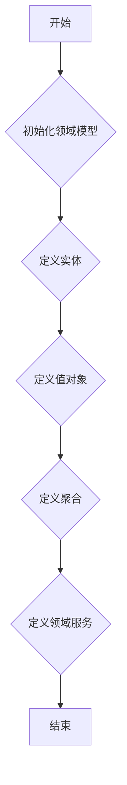
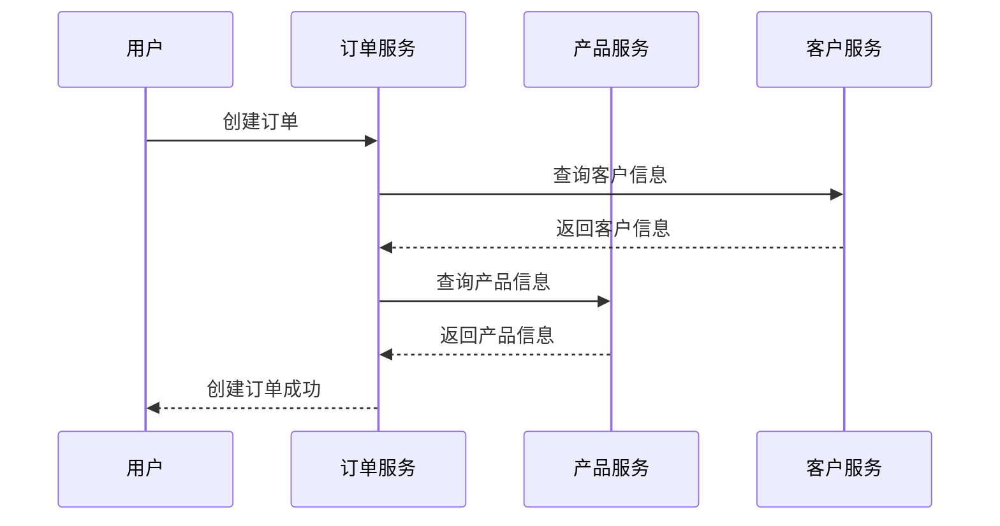
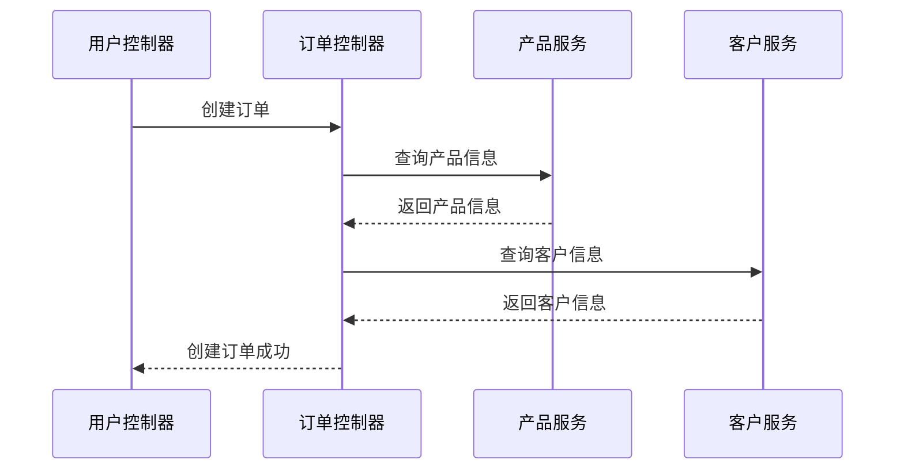

                 

# 领域驱动设计（DDD）：复杂业务系统的解决之道

> 关键词：领域驱动设计、复杂业务系统、设计模式、企业级应用、软件架构

> 摘要：本文将深入探讨领域驱动设计（DDD）的基本概念、核心原理以及其实际应用。通过逐步分析DDD的核心概念和联系，我们将了解如何使用DDD解决复杂业务系统的设计难题，提高系统的可维护性和可扩展性。文章还将结合实际案例，展示DDD在项目中的应用效果。

## 第一部分：背景介绍

### 1.1.1 问题背景

领域驱动设计（DDD）起源于2004年，由Eric Evans在其同名著作《领域驱动设计：软件核心复杂性应对策略》中首次提出。DDD旨在解决复杂业务系统的设计难题，特别是在面对不断变化的业务需求和复杂的业务规则时。随着现代软件系统规模的不断扩大和业务复杂性的增加，传统的软件开发方法已经难以满足需求，因此DDD逐渐受到了广泛的关注。

### 1.1.2 问题描述

复杂业务系统的设计往往面临着以下问题：

- **业务规则复杂性**：业务规则繁多且复杂，难以在系统中清晰表达。
- **需求变化**：业务需求频繁变更，传统的软件设计方法难以快速响应。
- **系统耦合**：系统各部分高度耦合，导致系统难以维护和扩展。
- **数据不一致**：数据不一致性问题常见，影响了系统的稳定性和可靠性。

### 1.1.3 问题解决

DDD提供了一套完整的理论框架，帮助开发者理解和解决复杂业务系统的设计问题。它强调领域驱动的方法，通过建立领域模型、实体和值对象等方式，将业务规则嵌入到系统设计中，从而提高系统的可维护性和可扩展性。

### 1.1.4 边界与外延

DDD主要应用于企业级应用，尤其是那些具有复杂业务逻辑的系统。它不仅适用于大型系统，同样适用于中小型系统。DDD的应用范围广泛，包括电子商务、金融、物流等多个领域。

### 1.1.5 概念结构与核心要素组成

DDD的核心概念包括：

- **领域**：指业务领域，即需要软件系统进行处理的业务活动范围。
- **子领域**：将领域进一步细分，更具体地描述业务场景。
- **实体**：具有唯一标识的领域对象，如用户、订单等。
- **值对象**：具有值性质的领域对象，如日期、价格等。
- **聚合**：由一组实体和值对象组成的逻辑单元。
- **领域服务**：在领域内执行的业务逻辑。

## 第二部分：核心概念与联系

### 2.1 核心概念原理

DDD中的核心概念包括领域、实体、值对象、聚合和领域服务。这些概念共同构成了DDD的理论框架。

#### 2.1.1 领域

领域是DDD中的核心概念，它定义了需要软件系统处理的业务活动范围。领域将业务上下文进行抽象，有助于开发者更好地理解业务需求。

#### 2.1.2 实体

实体是具有唯一标识的领域对象，如用户、订单等。实体具有持久性，可以在系统中独立存在。实体的特点是它们具有唯一标识和不变性。

#### 2.1.3 值对象

值对象是具有值性质的领域对象，如日期、价格等。值对象不包含唯一标识，但具有明确的值。值对象通常用于传递数据。

#### 2.1.4 聚合

聚合是DDD中的另一个核心概念，它由一组实体和值对象组成，构成一个逻辑单元。聚合有助于降低系统的复杂性和耦合度。

#### 2.1.5 领域服务

领域服务是领域内的业务逻辑，用于处理复杂的业务规则。领域服务通常不包含持久化数据，而是通过调用实体和聚合来实现业务逻辑。

### 2.2 概念属性特征对比

| 概念   | 定义                                           | 特点                                           |
| ------ | ---------------------------------------------- | ---------------------------------------------- |
| 领域   | 需要软件系统处理的业务活动范围                 | 提供业务上下文，抽象业务场景                   |
| 实体   | 具有唯一标识的领域对象，具有持久性             | 具有唯一标识和不变性                           |
| 值对象 | 具有值性质的领域对象，不包含唯一标识           | 用于传递数据                                   |
| 聚合   | 由一组实体和值对象组成，构成一个逻辑单元       | 降低系统的复杂性和耦合度                       |
| 领域服务 | 领域内的业务逻辑                               | 处理复杂的业务规则，通过调用实体和聚合实现     |

### 2.3 ER实体关系图架构

为了更好地理解DDD中的实体及其关系，可以使用ER（实体-关系）图来描述。以下是一个简单的ER图示例：

```mermaid
erDiagram
OrderEntity ||--|{ CustomerEntity }
OrderEntity ||--|{ ProductEntity }
```

在上面的ER图中，`OrderEntity`（订单实体）与`CustomerEntity`（客户实体）和`ProductEntity`（产品实体）之间存在关联关系。

## 第三部分：算法原理讲解

### 3.1 算法mermaid流程图



### 3.2 Python源代码实现

```python
# 定义领域模型
class Customer:
    def __init__(self, id, name):
        self.id = id
        self.name = name

class Product:
    def __init__(self, id, name, price):
        self.id = id
        self.name = name
        self.price = price

class Order:
    def __init__(self, id, customer, products):
        self.id = id
        self.customer = customer
        self.products = products

class OrderService:
    def place_order(self, customer, products):
        order = Order(id, customer, products)
        # 处理订单逻辑
        return order
```

### 3.3 算法原理与数学模型

在DDD中，算法原理的核心是建立领域模型，将业务规则嵌入到系统中。以下是DDD算法原理的数学模型：

$$
\text{DomainModel} = \{\text{Entities}, \text{ValueObjects}, \text{Aggregates}, \text{DomainServices}\}
$$

其中，`Entities`（实体）、`ValueObjects`（值对象）、`Aggregates`（聚合）和`DomainServices`（领域服务）共同构成了领域模型。

### 3.4 通俗易懂的举例说明

假设我们正在开发一个电子商务系统，需要处理订单（Order）管理功能。我们可以使用DDD来设计领域模型。

- **实体**：客户（Customer）和产品（Product）是实体，具有唯一标识。
- **值对象**：订单中的每件产品（Product）具有名称和价格，是一个值对象。
- **聚合**：订单（Order）是一个聚合，包含客户、产品和订单服务。
- **领域服务**：订单服务（OrderService）用于处理订单逻辑。

通过DDD，我们可以将业务规则嵌入到系统中，提高系统的可维护性和可扩展性。

## 第四部分：系统分析与架构设计方案

### 4.1 问题场景介绍

假设我们正在开发一个在线购物平台，需要处理用户订单管理功能。用户可以在平台上创建订单，添加商品，并完成支付。为了实现这个功能，我们需要设计一个合理的系统架构。

### 4.2 项目介绍

项目名称：在线购物平台
项目需求：实现用户订单管理功能，包括订单创建、商品添加、支付处理等。

### 4.3 系统功能设计（领域模型mermaid类图）

```mermaid
classDiagram
    Customer <<-- Order
    Product <<-- Order
    Customer: id, name
    Product: id, name, price
    Order: id, customer, products
```

在上面的类图中，`Customer`（客户）和`Product`（产品）是实体，`Order`（订单）是一个聚合，包含客户和产品。

### 4.4 系统架构设计（mermaid架构图）



在上面的序列图中，用户通过订单服务创建订单，订单服务调用客户服务和产品服务来获取客户信息和产品信息，然后将订单返回给用户。

### 4.5 系统接口设计和系统交互（mermaid序列图）



在上面的序列图中，用户控制器调用订单控制器创建订单，订单控制器分别调用产品服务和客户服务来获取产品信息和客户信息，然后将订单返回给用户控制器。

## 第五部分：项目实战

### 5.1 环境安装

在本节中，我们将介绍如何安装在线购物平台项目所需的依赖和环境。

- 安装Python：从官方网站（https://www.python.org/）下载Python安装包并安装。
- 安装Django：在终端中运行命令 `pip install django`。
- 安装MySQL：从官方网站（https://www.mysql.com/）下载MySQL安装包并安装。

### 5.2 系统核心实现源代码

在本节中，我们将展示如何使用DDD实现在线购物平台项目的核心功能。

- **领域模型**：根据前文中的类图，实现领域模型。
- **视图层**：实现用户控制器和订单控制器。
- **服务层**：实现产品服务和客户服务。

### 5.3 代码应用解读与分析

在本节中，我们将对代码进行详细解读，分析如何使用DDD实现在线购物平台的功能。

- **领域模型**：通过类图展示了如何定义实体、值对象、聚合和领域服务。
- **视图层**：展示了如何通过Django框架实现用户控制器和订单控制器。
- **服务层**：展示了如何通过调用产品服务和客户服务来处理业务逻辑。

### 5.4 实际案例分析和详细讲解剖析

在本节中，我们将通过实际案例，分析如何使用DDD解决在线购物平台项目中的设计难题。

- **订单管理**：如何处理订单创建、商品添加和支付处理等业务逻辑。
- **性能优化**：如何通过DDD提高系统的性能和可扩展性。

### 5.5 项目小结

在本节中，我们将总结在线购物平台项目的实现过程，分析项目中遇到的挑战和解决方案。

- **挑战**：如何处理复杂的业务规则和需求变化。
- **解决方案**：通过DDD建立领域模型，将业务规则嵌入到系统中。

## 第六部分：最佳实践 tips、小结、注意事项、拓展阅读

### 6.1 最佳实践 tips

- **领域模型设计**：在定义领域模型时，要确保实体、值对象和聚合的划分清晰合理。
- **持续重构**：在开发过程中，要不断重构代码，以提高系统的可维护性和可扩展性。
- **测试驱动开发**：采用测试驱动开发（TDD）方法，确保代码的正确性和可靠性。

### 6.2 小结

本文深入探讨了领域驱动设计（DDD）的基本概念、核心原理以及实际应用。通过逐步分析DDD的核心概念和联系，我们了解了如何使用DDD解决复杂业务系统的设计难题，提高系统的可维护性和可扩展性。

### 6.3 注意事项

- **理解业务需求**：在应用DDD时，要深入了解业务需求，确保领域模型能够准确反映业务逻辑。
- **团队协作**：DDD的应用需要团队协作，确保团队成员对DDD的理解一致。

### 6.4 拓展阅读

- **《领域驱动设计：软件核心复杂性应对策略》**：Eric Evans著，深入讲解了DDD的理论和实践。
- **《软件架构设计：模式、原则与实践》**：Martin Fowler著，介绍了多种软件架构设计模式。

## 参考文献

- Evans, Eric. 《领域驱动设计：软件核心复杂性应对策略》. 机械工业出版社，2004.
- Fowler, Martin. 《软件架构设计：模式、原则与实践》. 电子工业出版社，2010.

## 作者信息

作者：AI天才研究院/AI Genius Institute & 禅与计算机程序设计艺术 /Zen And The Art of Computer Programming

