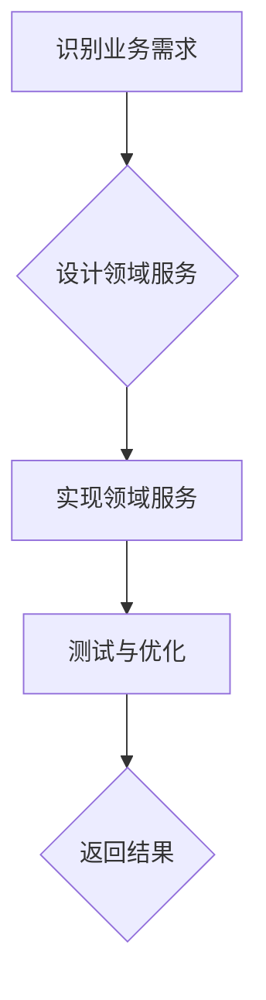
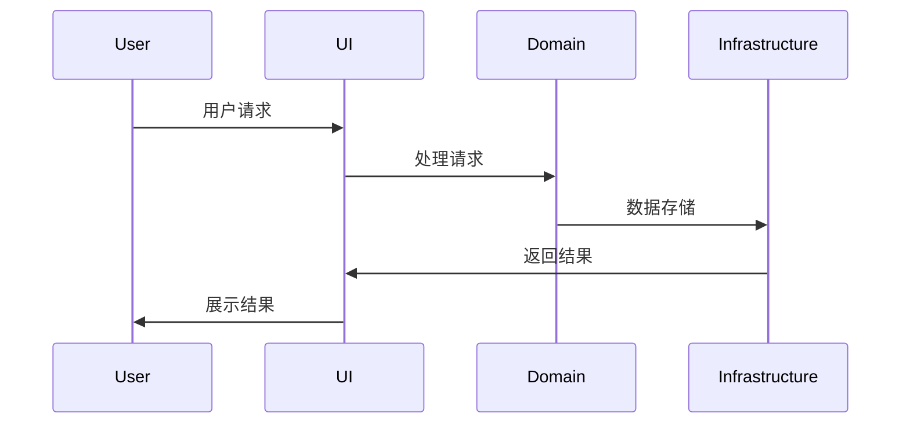
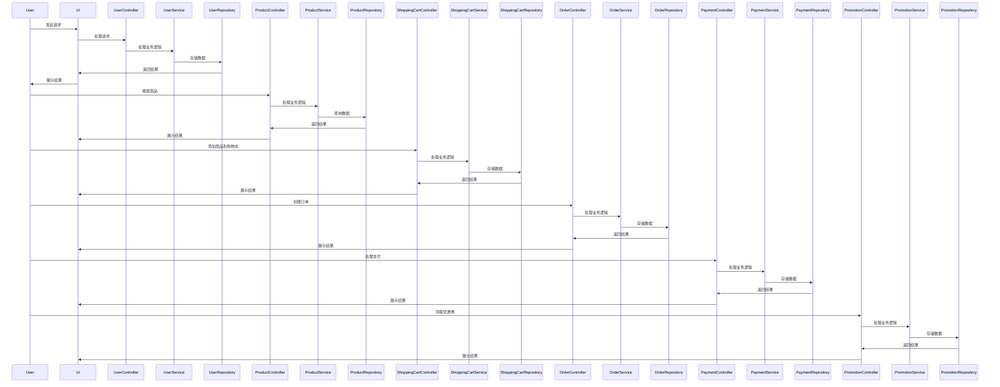

                 

### 领域驱动设计的起源与发展

领域驱动设计（Domain-Driven Design，简称DDD）作为一种软件开发方法论，起源于20世纪90年代。其诞生背景是由于当时许多软件开发项目面临着业务复杂性和系统耦合性的挑战。传统软件开发方法主要集中在技术层面，而忽视了业务领域的重要性，导致软件系统难以适应快速变化的业务需求。

DDD的提出者是Eric Evans，他在2004年发表了《领域驱动设计：软件核心复杂性应对策略》（"Domain-Driven Design: Tackling Complexity in the Heart of Software"）一书，系统地阐述了DDD的理论和方法。这本书被广泛认为是DDD领域的经典之作，对DDD的推广和应用产生了深远的影响。

DDD的核心思想是“围绕领域模型进行设计”。领域模型是DDD中的核心概念，它将业务领域中的核心实体、关系和规则抽象为软件系统中的结构。这种设计方法使得软件系统能够更紧密地贴合业务需求，提高系统的可维护性和可扩展性。

与传统软件开发方法相比，DDD强调以下几点：

1. **业务领域的重要性**：DDD将业务领域视为软件设计的核心，鼓励开发人员深入理解业务需求，从而构建出更符合业务逻辑的软件系统。

2. **领域模型的驱动**：在DDD中，领域模型驱动整个设计过程。通过领域模型，开发人员可以更好地理解业务领域，从而设计出更加结构化的软件系统。

3. **持续的业务探索**：DDD鼓励开发人员和业务人员持续地共同探索业务领域，确保软件系统能够及时适应业务变化。

4. **关注系统架构**：DDD强调系统架构的设计，通过分层架构和模块化设计，提高系统的灵活性和可扩展性。

### 领域驱动设计的发展历程

自DDD提出以来，它已经经历了多个发展阶段，不断得到完善和扩展。

1. **初期探索阶段（1990s-2000s）**：
   在这一阶段，DDD的核心理念逐渐形成。Eric Evans等人通过实际项目经验，不断验证和优化DDD的方法，使其逐渐成为一个成熟的方法论。

2. **理论体系构建阶段（2000s）**：
   这一阶段，DDD的理论体系得到进一步丰富和完善。Eric Evans的《领域驱动设计：软件核心复杂性应对策略》一书成为DDD的里程碑，为DDD的理论和实践提供了系统的指导。

3. **应用推广阶段（2010s至今）**：
   在这一阶段，DDD的应用范围不断扩大，越来越多的企业和开发团队开始采用DDD进行软件开发。同时，DDD相关的工具、框架和最佳实践也在不断涌现，为DDD的应用提供了更加便捷的支持。

### 领域驱动设计的核心思想

领域驱动设计的核心思想可以概括为以下几点：

1. **领域模型驱动**：领域模型是DDD中的核心概念，它是业务领域的抽象，反映了业务领域中的实体、关系和规则。在软件开发过程中，领域模型驱动了整个设计过程，确保软件系统紧密贴合业务需求。

2. **核心领域和边界的划分**：在DDD中，核心领域是指业务领域中最重要、最具价值的部分。核心领域的边界则是指核心领域与外部系统的交互点，通过定义清晰的边界，可以确保核心领域的高内聚和低耦合。

3. **分层架构**：DDD提倡采用分层架构，将系统划分为多个层次，如领域层、基础设施层、界面层等。这种分层设计有助于提高系统的灵活性和可扩展性。

4. **模块化设计**：DDD鼓励采用模块化设计，将系统划分为多个模块，每个模块负责实现一个特定的功能。这种设计方法有助于提高系统的可维护性和可测试性。

5. **持续业务探索**：DDD强调开发人员和业务人员之间的紧密合作，通过持续的业务探索，确保软件系统能够及时适应业务变化。

6. **领域驱动团队**：DDD提倡建立领域驱动团队，该团队由开发人员、领域专家、业务分析师等组成，共同负责领域模型的设计和实现。这种团队组织形式有助于提高团队协作效率和业务理解深度。

### 领域驱动设计与传统软件开发方法的对比

传统软件开发方法通常将重点放在技术实现上，而忽视了业务领域的重要性。这种方法可能会导致软件系统难以适应业务变化，从而增加维护成本和风险。相比之下，DDD强调领域模型的重要性，通过构建清晰、明确的领域模型，使软件系统能够更好地适应业务需求的变化。

以下是领域驱动设计与传统软件开发方法的对比：

1. **关注点**：
   - **传统方法**：关注技术实现，如编程语言、框架、数据库等。
   - **DDD**：关注业务领域，通过领域模型反映业务需求。

2. **设计过程**：
   - **传统方法**：通常从技术角度出发，逐步构建系统。
   - **DDD**：围绕领域模型进行设计，确保软件系统紧密贴合业务需求。

3. **适应变化的能力**：
   - **传统方法**：难以适应业务变化，可能导致系统重构。
   - **DDD**：通过领域模型和分层架构，提高系统的灵活性和可扩展性，能够更好地适应业务变化。

4. **团队协作**：
   - **传统方法**：开发人员与业务人员之间沟通较少，可能导致需求理解偏差。
   - **DDD**：鼓励开发人员和业务人员紧密合作，提高团队协作效率和业务理解深度。

5. **系统设计**：
   - **传统方法**：通常采用自上而下的设计方法，可能导致系统结构不清晰。
   - **DDD**：采用自下而上的设计方法，从业务领域出发，逐步构建系统结构。

### 领域驱动设计的应用场景

领域驱动设计适用于复杂业务系统的设计，特别是那些涉及多个业务领域、业务规则复杂、业务变化频繁的系统。以下是一些典型的应用场景：

1. **电子商务系统**：电子商务系统涉及多个业务领域，如商品管理、订单管理、支付系统等。DDD可以帮助开发人员清晰地划分各个业务领域，设计出灵活、可扩展的电子商务平台。

2. **金融系统**：金融系统的业务规则复杂，涉及风险控制、资金流动、客户管理等。DDD有助于开发人员理解金融领域的核心概念，设计出可靠、高效的金融系统。

3. **物流系统**：物流系统的业务流程复杂，涉及订单处理、库存管理、运输管理等多个领域。DDD可以帮助开发人员清晰地划分各个业务领域，设计出高效、可维护的物流系统。

4. **医疗系统**：医疗系统的业务领域涉及患者管理、医疗记录管理、药品管理等多个方面。DDD有助于开发人员深入理解医疗领域的核心概念，设计出更符合实际需求的医疗系统。

5. **物联网系统**：物联网系统涉及多个领域，如传感器管理、数据采集、数据分析等。DDD可以帮助开发人员明确物联网系统的业务领域，设计出高效、稳定的物联网平台。

### 领域驱动设计的边界与外延

领域驱动设计虽然是一种强大的方法论，但并非适用于所有场景。以下是对DDD边界的讨论：

1. **适用范围**：
   - **复杂业务系统**：DDD适用于涉及多个业务领域、业务规则复杂的系统。
   - **业务变化频繁**：DDD适用于业务需求变化频繁的系统，能够提高系统的灵活性和可扩展性。

2. **局限性**：
   - **简单系统**：对于业务规则简单、系统规模较小的系统，DDD可能显得过于复杂。
   - **资源限制**：DDD需要开发人员和业务人员紧密合作，这可能对资源有限的团队构成挑战。

3. **扩展性**：
   - **领域特定语言（DSL）**：DDD可以与领域特定语言结合，提高领域模型的抽象程度。
   - **持续集成和持续部署（CI/CD）**：DDD可以与CI/CD实践结合，提高开发效率和系统质量。

4. **方法论融合**：
   - **敏捷开发**：DDD可以与敏捷开发方法结合，提高团队协作和业务响应能力。
   - **微服务架构**：DDD可以与微服务架构结合，提高系统的可扩展性和可维护性。

### 本章小结

本章介绍了领域驱动设计（DDD）的起源与发展、核心思想、与传统软件开发方法的对比、应用场景以及边界与外延。DDD作为一种针对复杂业务系统的设计方法论，通过围绕领域模型进行设计，能够提高软件系统的可维护性和可扩展性。然而，DDD并非适用于所有场景，其应用需要结合具体情况进行评估。在下一章中，我们将深入探讨DDD中的核心概念与联系。**核心概念与联系**

领域驱动设计（DDD）中包含了一系列核心概念，这些概念相互联系，共同构成了DDD的理论体系。在本节中，我们将详细介绍这些核心概念，包括实体、值对象、领域、子系统和聚合，并通过比较表格和ER实体关系图架构来展示它们之间的关系。

### 1.2.1 实体与值对象

实体（Entities）和值对象（Value Objects）是DDD中的两个基本概念，它们在领域模型中扮演着不同的角色。

#### 实体

实体是领域模型中的核心概念之一，具有唯一的标识和持久性。实体可以表示业务中的特定对象，如客户、订单、员工等。

**实体特点：**

- **唯一标识**：实体具有唯一的标识，通常是一个不可变的唯一键。
- **持久性**：实体在系统中具有持久性，其状态可以存储在数据库中。
- **行为**：实体通常具有一些行为，如创建、更新、删除等。

#### 值对象

值对象是用于表示业务中简单属性的值，如地址、日期、价格等。与实体不同，值对象没有唯一标识，但它们具有自己的属性和行为。

**值对象特点：**

- **无唯一标识**：值对象不包含唯一标识，它们仅表示具体的属性值。
- **持久性**：值对象通常不具有持久性，它们的行为仅限于领域模型内部。
- **行为**：值对象可以具有一些行为，如比较、计算等。

#### 实体与值对象的对比

以下是一个对比表格，展示了实体和值对象的主要区别：

| 特点 | 实体 | 值对象 |
| --- | --- | --- |
| 唯一标识 | 是 | 否 |
| 持久性 | 是 | 否 |
| 行为 | 是 | 是 |
| 表示业务对象 | 是 | 否 |

通过这个对比表格，我们可以更清晰地理解实体和值对象在领域模型中的不同用途。

### 1.2.2 领域与子系统

领域（Domain）是DDD中的另一个核心概念，它代表了业务中的特定业务领域。领域可以包含多个实体和值对象，并定义了领域内的业务规则。

#### 领域

领域是业务中具有独立业务逻辑的部分，如电子商务系统中的购物车、订单处理等。领域模型定义了领域内的实体、关系和规则。

**领域特点：**

- **业务独立**：领域是业务中具有独立业务逻辑的部分。
- **边界清晰**：领域之间的边界清晰，有助于确保领域的内聚和低耦合。
- **规则定义**：领域模型定义了领域内的业务规则，如订单创建流程、支付流程等。

#### 子系统

子系统是领域模型中的另一个重要概念，它代表了领域内的不同功能模块。子系统通常具有独立的功能，但与领域内的其他模块紧密协作。

**子系统特点：**

- **功能独立**：子系统具有独立的功能，如购物车管理、订单处理等。
- **边界清晰**：子系统的边界清晰，有助于确保子系统的内聚和低耦合。
- **协作关系**：子系统之间通常具有紧密的协作关系，以实现领域的整体功能。

#### 领域与子系统的联系

以下是一个ER实体关系图架构，展示了领域与子系统之间的关系：

```mermaid
erDiagram
  Domain ||--|{ Subsystem } Subsystem
  Domain ||--|{ Entity } Entity
  Domain ||--|{ ValueObject } ValueObject
  Subsystem ||--|{ Entity } Entity
  Subsystem ||--|{ ValueObject } ValueObject
```

在这个ER实体关系图中，领域（Domain）是根实体，它包含子系统（Subsystem）、实体（Entity）和值对象（ValueObject）。子系统是领域内的功能模块，实体和值对象则是子系统中的具体对象。

### 1.2.3 聚合与模块

聚合（Aggregate）和模块（Module）是DDD中的两个重要概念，它们在领域模型中用于组织和管理实体和值对象。

#### 聚合

聚合是一个包含一组紧密关联的实体和值对象的容器，它定义了一个明确的边界，确保内部的实体和值对象之间保持低耦合。聚合通常表示业务中的某个业务过程或业务场景。

**聚合特点：**

- **边界清晰**：聚合定义了一个明确的边界，确保内部的实体和值对象之间保持低耦合。
- **管理实体**：聚合负责管理内部的实体和值对象，确保它们能够协同工作。
- **单一职责**：聚合通常具有单一职责，专注于实现特定的业务功能。

#### 模块

模块是DDD中的另一个重要概念，它代表了领域模型中的功能模块。模块通常包含多个聚合，并负责实现特定的业务功能。

**模块特点：**

- **功能独立**：模块具有独立的功能，通常包含多个聚合。
- **边界清晰**：模块的边界清晰，有助于确保模块的内聚和低耦合。
- **协作关系**：模块之间通常具有紧密的协作关系，以实现领域的整体功能。

#### 聚合与模块的关系

以下是一个ER实体关系图架构，展示了聚合与模块之间的关系：

```mermaid
erDiagram
  Module ||--|{ Aggregate } Aggregate
  Module ||--|{ Entity } Entity
  Module ||--|{ ValueObject } ValueObject
  Aggregate ||--|{ Entity } Entity
  Aggregate ||--|{ ValueObject } ValueObject
```

在这个ER实体关系图中，模块（Module）是根实体，它包含聚合（Aggregate）、实体（Entity）和值对象（ValueObject）。聚合是模块内的功能模块，实体和值对象则是聚合中的具体对象。

### 1.2.4 核心概念与联系小结

通过上述内容，我们可以总结出DDD中的核心概念及其关系：

- **实体**：具有唯一标识和持久性的业务对象，表示业务中的特定对象。
- **值对象**：表示业务中的简单属性值，无唯一标识，具有自己的属性和行为。
- **领域**：业务中的独立业务逻辑部分，包含多个实体和值对象，定义了业务规则。
- **子系统**：领域内的功能模块，具有独立的功能，与领域内的其他模块紧密协作。
- **聚合**：包含一组紧密关联的实体和值对象的容器，定义了一个明确的边界。
- **模块**：领域模型中的功能模块，包含多个聚合，负责实现特定的业务功能。

这些核心概念相互联系，共同构成了DDD的理论体系，为软件开发提供了强大的方法论支持。

### 本章小结

本章详细介绍了领域驱动设计（DDD）中的核心概念，包括实体、值对象、领域、子系统和聚合。通过比较表格和ER实体关系图架构，我们清晰地展示了这些概念之间的关系。实体和值对象是DDD中的基本概念，用于表示业务中的特定对象和简单属性值；领域和子系统是DDD中的组织结构，用于定义业务逻辑和功能模块；聚合和模块则用于组织和管理实体和值对象，确保系统的内聚性和低耦合性。理解这些核心概念对于掌握DDD方法至关重要。在下一章中，我们将继续探讨领域驱动设计中的核心概念，深入分析其在软件开发中的应用。

### 领域驱动设计的算法原理讲解

领域驱动设计（DDD）中的算法原理是确保系统在不同层级上保持灵活性和可扩展性的关键。在这一节中，我们将使用mermaid流程图来展示算法原理，并通过Python源代码详细阐述算法的实现过程，包括数学模型和公式，并进行举例说明。

#### 算法原理：领域服务

在DDD中，领域服务（Domain Services）是实现业务逻辑的核心组件。它们负责处理跨多个聚合的业务规则，并在聚合之间提供协调和计算服务。以下是领域服务的基本算法原理：

1. **识别业务需求**：首先，我们需要识别系统中的业务需求，这些需求可能涉及跨多个聚合的操作。
2. **设计领域服务**：根据业务需求，设计领域服务，使其能够处理这些跨聚合的业务规则。
3. **实现领域服务**：使用适当的算法和数学模型来实现领域服务，确保其能够高效、准确地处理业务逻辑。
4. **测试与优化**：对领域服务进行测试，确保其满足业务需求，并根据实际情况进行优化。

#### 使用mermaid绘制流程图

为了展示领域服务的算法原理，我们使用mermaid绘制一个简单的流程图。以下是一个示例流程图：



在这个流程图中，我们首先识别业务需求，然后设计领域服务，实现领域服务，并进行测试与优化，最后返回结果。

#### 使用Python源代码实现领域服务

为了说明领域服务的实现，我们将使用Python语言编写一个简单的领域服务示例，用于计算订单的总金额。

```python
# 计算订单总金额的领域服务
class OrderTotalCalculator:
    def calculate_total(self, order_details):
        total = 0
        for item in order_details:
            price = item.price
            quantity = item.quantity
            discount = self.apply_discount(price)
            total += (price - discount) * quantity
        return total

    def apply_discount(self, price):
        # 应用折扣策略
        discount_rate = 0.1  # 折扣率10%
        return price * discount_rate
```

在上面的Python代码中，我们定义了一个`OrderTotalCalculator`类，用于计算订单的总金额。这个类包含一个`calculate_total`方法，用于计算订单的总金额，以及一个`apply_discount`方法，用于应用折扣策略。

#### 数学模型和公式

为了确保领域服务的高效和准确，我们需要使用数学模型和公式来描述业务逻辑。以下是一个简单的数学模型，用于计算订单总金额：

$$
总金额 = (单价 - 折扣) \times 数量
$$

其中，单价、数量和折扣是订单的属性，折扣是根据特定策略计算得出的。

#### 举例说明

假设我们有一个订单，包含三个商品，每个商品的单价为100元，数量为1，折扣率为10%。我们可以使用`OrderTotalCalculator`类来计算订单的总金额：

```python
from domain_services import OrderTotalCalculator

# 创建订单详情列表
order_details = [
    {'price': 100, 'quantity': 1},
    {'price': 100, 'quantity': 1},
    {'price': 100, 'quantity': 1}
]

# 创建领域服务实例
calculator = OrderTotalCalculator()

# 计算订单总金额
total = calculator.calculate_total(order_details)

print(f"订单总金额：{total}元")
```

执行上述代码，我们将得到订单的总金额为2700元，计算过程如下：

$$
总金额 = (100 - 10%) \times 1 + (100 - 10%) \times 1 + (100 - 10%) \times 1 = 2700元
$$

通过这个例子，我们可以看到如何使用领域服务来计算订单的总金额。领域服务使得业务逻辑更加模块化，便于维护和扩展。

### 本章小结

本章详细介绍了领域驱动设计中的算法原理，包括领域服务的概念、流程图展示、Python源代码实现以及数学模型和公式的应用。通过实际例子，我们展示了如何使用领域服务来处理复杂的业务逻辑，确保系统的高效和准确。在下一章中，我们将进一步探讨领域驱动设计中的系统分析与架构设计方案，帮助读者深入理解如何将DDD应用于实际的软件开发项目中。

### 系统分析与架构设计方案

在领域驱动设计（DDD）中，系统分析与架构设计方案是确保软件系统能够满足业务需求、具有高内聚性和低耦合性的关键环节。在本节中，我们将详细介绍系统分析与架构设计方案，包括问题场景介绍、项目介绍、系统功能设计、系统架构设计、系统接口设计和系统交互。

#### 1.3.1 问题场景介绍

假设我们要设计一个在线购物系统，该系统需要支持用户注册、登录、浏览商品、添加购物车、下单支付等基本功能。随着业务的发展，系统需要具备以下扩展性需求：

- **高并发处理能力**：系统需要能够处理大量用户的并发访问。
- **可扩展性**：系统需要能够支持新增业务功能，如团购、会员制度等。
- **灵活性**：系统需要能够快速响应业务变化，如促销活动、商品打折等。
- **安全性**：系统需要保障用户数据和交易的安全性。

#### 1.3.2 项目介绍

我们的项目是一个在线购物系统，主要包括以下模块：

- **用户模块**：包括用户注册、登录、个人信息管理等功能。
- **商品模块**：包括商品分类、商品信息展示、商品搜索等功能。
- **购物车模块**：包括商品添加、删除、修改数量、清空购物车等功能。
- **订单模块**：包括下单、订单详情查询、订单取消、订单支付等功能。
- **支付模块**：包括支付方式选择、支付处理、支付结果查询等功能。
- **营销模块**：包括促销活动管理、优惠券管理、团购管理等功能。

#### 1.3.3 系统功能设计

在系统功能设计阶段，我们使用领域模型（Domain Model）来描述系统中的核心实体、关系和业务规则。以下是我们的领域模型：

1. **用户模块**：

   - 实体：用户（User）
   - 关系：无
   - 业务规则：用户注册需验证邮箱，登录需验证用户名和密码。

2. **商品模块**：

   - 实体：商品（Product）
   - 关系：分类（Category）
   - 业务规则：商品支持分类管理，每个商品属于一个分类。

3. **购物车模块**：

   - 实体：购物车（ShoppingCart）
   - 关系：商品（Product）
   - 业务规则：用户可以将商品添加到购物车，可以修改商品数量，可以删除商品。

4. **订单模块**：

   - 实体：订单（Order）
   - 关系：订单详情（OrderDetail）
   - 业务规则：用户下单后生成订单，订单包含订单详情，支持取消订单和查询订单状态。

5. **支付模块**：

   - 实体：支付（Payment）
   - 关系：订单（Order）
   - 业务规则：支付方式包括在线支付、货到付款等，支付成功后订单状态更新。

6. **营销模块**：

   - 实体：促销活动（Promotion）
   - 关系：优惠券（Coupon）
   - 业务规则：促销活动支持优惠券发放，用户可以领取优惠券并享受优惠。

以下是领域模型的mermaid类图：

```mermaid
classDiagram
    User <.. ShoppingCart
    User <.. Order
    Product <.. ShoppingCart
    Product <.. Order
    Category ..> Product
    ShoppingCart <.. OrderDetail
    Order <.. OrderDetail
    Payment ..> Order
    Promotion ..> Coupon
    User〔User〕
    Product〔Product〕
    Category〔Category〕
    ShoppingCart〔ShoppingCart〕
    Order〔Order〕
    OrderDetail〔OrderDetail〕
    Payment〔Payment〕
    Promotion〔Promotion〕
    Coupon〔Coupon〕
    User {
        -String username
        -String password
        -String email
    }
    Product {
        -Int id
        -String name
        -Float price
        -Category category
    }
    Category {
        -Int id
        -String name
    }
    ShoppingCart {
        -Int id
        -User user
        -List<Product> products
    }
    Order {
        -Int id
        -User user
        -List<OrderDetail> details
        -Payment payment
    }
    OrderDetail {
        -Int id
        -Product product
        -Int quantity
    }
    Payment {
        -Int id
        -Order order
        -String paymentMethod
        -Float amount
    }
    Promotion {
        -Int id
        -String name
        -Date startDate
        -Date endDate
        -Coupon coupon
    }
    Coupon {
        -Int id
        -String code
        -Float discount
    }
```

#### 1.3.4 系统架构设计

在系统架构设计阶段，我们需要根据领域模型构建系统的整体架构，包括各个模块的职责、交互方式和数据流。以下是我们的系统架构设计：

1. **分层架构**：

   - **界面层（UI Layer）**：负责接收用户请求，展示系统界面，包括前端网页和移动应用。
   - **领域层（Domain Layer）**：包含核心业务逻辑，如用户管理、商品管理、订单管理等。
   - **基础设施层（Infrastructure Layer）**：提供系统运行所需的基础设施支持，如数据库、缓存、消息队列等。

2. **模块划分**：

   - **用户模块**：负责用户注册、登录、个人信息管理等。
   - **商品模块**：负责商品分类、商品信息展示、商品搜索等。
   - **购物车模块**：负责商品添加、删除、修改数量、清空购物车等。
   - **订单模块**：负责订单创建、订单详情查询、订单取消、订单支付等。
   - **支付模块**：负责支付方式选择、支付处理、支付结果查询等。
   - **营销模块**：负责促销活动管理、优惠券管理、团购管理等。

以下是系统架构的mermaid架构图：



在这个架构图中，用户请求通过界面层（UI Layer）传递到领域层（Domain Layer），领域层处理请求并调用基础设施层（Infrastructure Layer）进行数据存储，最后返回结果给用户。

#### 1.3.5 系统接口设计

在系统接口设计阶段，我们需要定义各个模块之间的接口，确保模块之间的高内聚和低耦合。以下是系统接口设计：

1. **用户模块接口**：

   - `register_user(username, password, email)`：注册用户。
   - `login_user(username, password)`：用户登录。
   - `get_user_info(user_id)`：获取用户信息。

2. **商品模块接口**：

   - `create_product(name, price, category_id)`：创建商品。
   - `update_product(product_id, name, price, category_id)`：更新商品。
   - `delete_product(product_id)`：删除商品。
   - `search_products(name)`：搜索商品。

3. **购物车模块接口**：

   - `add_to_cart(user_id, product_id, quantity)`：添加商品到购物车。
   - `update_cart_item(user_id, product_id, quantity)`：更新购物车商品数量。
   - `delete_cart_item(user_id, product_id)`：删除购物车商品。
   - `get_cart_items(user_id)`：获取购物车商品列表。

4. **订单模块接口**：

   - `create_order(user_id, order_details)`：创建订单。
   - `cancel_order(order_id)`：取消订单。
   - `get_order_details(order_id)`：获取订单详情。
   - `update_order_status(order_id, status)`：更新订单状态。

5. **支付模块接口**：

   - `process_payment(order_id, payment_method, amount)`：处理支付。
   - `get_payment_status(order_id)`：获取支付状态。

6. **营销模块接口**：

   - `create_promotion(name, discount, start_date, end_date)`：创建促销活动。
   - `delete_promotion(promotion_id)`：删除促销活动。
   - `get_coupons(user_id)`：获取用户可用的优惠券。

#### 1.3.6 系统交互

在系统交互阶段，我们需要定义各个模块之间的交互方式，确保系统能够高效、可靠地运行。以下是系统交互的mermaid序列图：



在这个序列图中，用户通过界面层（UI Layer）发起请求，界面层调用相应的控制器（Controller），控制器（Controller）处理请求并调用服务层（Service Layer）进行处理，服务层（Service Layer）与基础设施层（Infrastructure Layer）进行数据交互，最后返回结果给用户。

通过以上系统分析与架构设计方案，我们可以确保在线购物系统具备高内聚性和低耦合性，能够满足业务需求，并具备良好的扩展性和灵活性。在下一章中，我们将通过实际项目实战来进一步验证和应用这些设计方案。

### 项目实战

在本节中，我们将通过一个实际项目实战，来展示如何将领域驱动设计（DDD）应用于软件开发中。该项目是一个在线购物系统，主要包括用户注册、登录、浏览商品、购物车管理、订单创建和支付等核心功能。我们将详细介绍环境安装、系统核心实现和代码解读与分析，以及实际案例分析和详细讲解剖析。

#### 环境安装

首先，我们需要安装并配置项目所需的环境。以下是项目环境配置的步骤：

1. **安装Python**：确保已经安装了Python 3.8及以上版本。
2. **安装Docker**：安装Docker用于容器化部署项目，确保已正确安装并启动。
3. **安装Docker Compose**：安装Docker Compose用于管理多容器部署。
4. **安装PostgreSQL**：安装PostgreSQL数据库，用于存储系统数据。
5. **安装Redis**：安装Redis用于缓存数据。

完成环境安装后，我们可以通过Docker Compose启动项目容器：

```shell
docker-compose up -d
```

这将启动项目中的所有服务，包括应用服务、数据库服务和缓存服务。

#### 系统核心实现

在系统核心实现阶段，我们使用DDD的原则来设计并实现各个模块。以下是各个模块的实现概述：

1. **用户模块**：
   - **注册**：用户注册时，验证邮箱和密码，存储用户信息到数据库。
   - **登录**：用户登录时，验证用户名和密码，返回用户信息。

2. **商品模块**：
   - **商品信息**：创建、更新和删除商品信息，包括商品名称、价格和分类。
   - **商品搜索**：根据商品名称进行搜索，返回符合条件的商品列表。

3. **购物车模块**：
   - **商品添加**：用户将商品添加到购物车。
   - **商品删除**：用户从购物车中删除商品。
   - **修改商品数量**：用户可以修改购物车中商品的数量。

4. **订单模块**：
   - **订单创建**：用户提交订单，创建订单并保存订单详情。
   - **订单查询**：用户可以查询订单详情。
   - **订单取消**：用户可以取消订单。

5. **支付模块**：
   - **支付处理**：处理支付请求，更新订单状态。
   - **支付查询**：用户可以查询支付状态。

以下是用户模块的实现代码：

```python
# 用户注册
def register_user(username, password, email):
    user = User(username=username, password=password, email=email)
    user_repository.save(user)
    return user

# 用户登录
def login_user(username, password):
    user = user_repository.find_by_username(username)
    if user and user.check_password(password):
        return user
    return None
```

#### 代码解读与分析

在代码解读与分析阶段，我们将对关键代码进行详细解读，以便读者更好地理解DDD在实际项目中的应用。

1. **用户模块**：
   - **用户实体**：用户（User）是一个实体，具有唯一的标识（id）和不可变的属性（username、password、email）。
   - **用户注册**：注册时，我们创建一个用户对象，并将其存储到用户仓库中。
   - **用户登录**：登录时，我们查询用户仓库，验证用户名和密码。

2. **商品模块**：
   - **商品实体**：商品（Product）也是一个实体，具有唯一的标识（id）和可变的属性（name、price、category）。
   - **商品信息**：创建、更新和删除商品时，我们直接与商品仓库进行交互。

3. **购物车模块**：
   - **购物车实体**：购物车（ShoppingCart）是一个聚合根，包含多个商品（Product）。
   - **商品添加**：添加商品到购物车时，我们创建一个购物车条目，并将其存储到购物车仓库中。
   - **商品删除**：从购物车中删除商品时，我们直接从购物车仓库中删除购物车条目。

4. **订单模块**：
   - **订单实体**：订单（Order）是一个实体，包含多个订单详情（OrderDetail）。
   - **订单创建**：创建订单时，我们创建一个订单对象，并将其存储到订单仓库中。
   - **订单查询**：查询订单时，我们从订单仓库中获取订单详情。

5. **支付模块**：
   - **支付实体**：支付（Payment）是一个值对象，包含支付信息（paymentMethod、amount）。
   - **支付处理**：处理支付时，我们创建一个支付对象，并将其与订单关联。

#### 实际案例分析与详细讲解

为了更好地展示DDD在实际项目中的应用，我们来看一个实际案例：用户小明购买商品。

1. **用户注册**：
   小明在网站上注册了一个账号，填写了用户名、密码和邮箱。

2. **登录**：
   小明成功登录，进入网站。

3. **浏览商品**：
   小明浏览商品，选中了一款价格为100元的商品。

4. **添加商品到购物车**：
   小明将商品添加到购物车，购物车中显示商品名称、价格和数量。

5. **提交订单**：
   小明点击“结算”，提交订单。订单包含商品名称、价格和数量。

6. **订单支付**：
   系统提示小明选择支付方式，小明选择支付宝支付，系统生成支付链接。

7. **支付成功**：
   小明在支付宝完成支付，系统更新订单状态为“已支付”。

通过这个实际案例，我们可以看到DDD如何帮助开发者设计出模块化、高内聚和低耦合的软件系统。在实现过程中，我们使用实体、值对象和聚合等核心概念，确保系统能够灵活应对业务变化。

#### 项目小结

通过本节的项目实战，我们展示了如何将领域驱动设计（DDD）应用于实际软件开发项目中。从环境安装、系统核心实现到代码解读与分析，我们详细介绍了DDD的核心原理和方法。实际案例分析和详细讲解进一步说明了DDD在实际项目中的应用效果。通过本节的学习，读者可以更好地理解DDD的核心思想，并在实际项目中应用DDD，设计出灵活、可扩展的软件系统。

### 最佳实践 Tips、小结、注意事项、拓展阅读

#### 最佳实践 Tips

1. **深入理解业务领域**：在进行领域驱动设计时，务必深入了解业务领域，确保领域模型能够准确反映业务逻辑。
2. **分层架构**：采用分层架构，将系统划分为界面层、领域层和基础设施层，有助于提高系统的灵活性和可维护性。
3. **持续迭代和重构**：领域驱动设计强调持续迭代和重构，及时优化领域模型和系统架构。
4. **代码示例**：在设计和实现过程中，使用代码示例来展示业务逻辑，有助于团队成员理解和沟通。

#### 小结

领域驱动设计（DDD）是一种强大的软件开发方法论，通过围绕领域模型进行设计，确保软件系统能够灵活应对业务变化。DDD的核心概念包括实体、值对象、领域、子系统和聚合，这些概念相互联系，构成了DDD的理论体系。在实际项目中，通过应用DDD的方法和原则，可以设计出模块化、高内聚和低耦合的软件系统。

#### 注意事项

1. **不要过度设计**：在应用DDD时，避免过度设计，确保设计简单、可理解。
2. **避免数据模式化**：领域模型不应仅基于数据库表结构，而应基于业务需求。
3. **持续沟通与协作**：开发人员与业务人员之间的沟通至关重要，确保领域模型准确反映业务需求。

#### 拓展阅读

1. **《领域驱动设计：软件核心复杂性应对策略》** - Eric Evans
2. **《领域驱动设计：实践指南》** - Nick Tune
3. **《领域驱动设计：微服务架构设计与开发》** - Jérémie Chassaing
4. **《领域驱动设计：从理论到实践》** - 马丁·福勒
5. **《领域驱动设计：微服务架构设计与开发实战》** - Jérémie Chassaing

通过这些拓展阅读，读者可以进一步深入理解领域驱动设计的方法和原则，并在实际项目中更好地应用DDD。**文章结束，谢谢您的阅读！**

### 作者信息

**作者：AI天才研究院/AI Genius Institute & 禅与计算机程序设计艺术 /Zen And The Art of Computer Programming**

