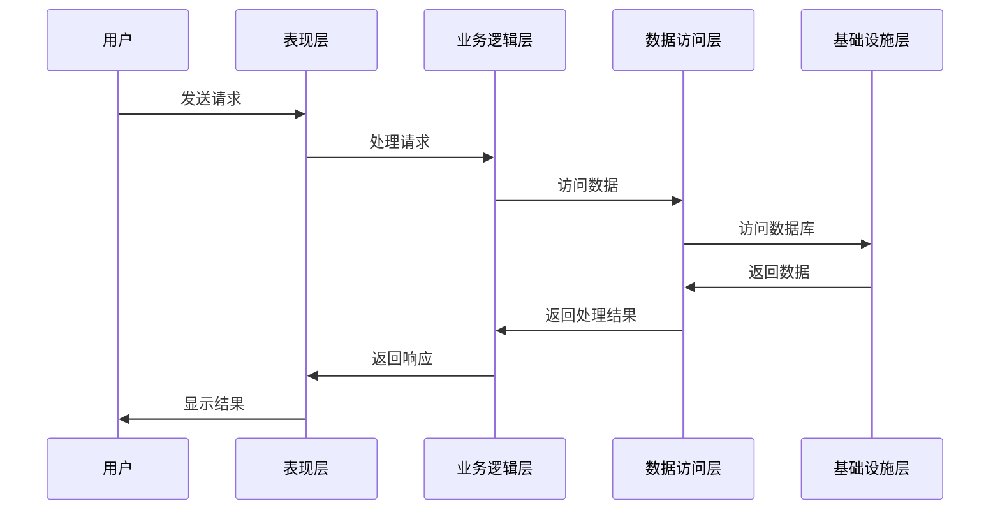
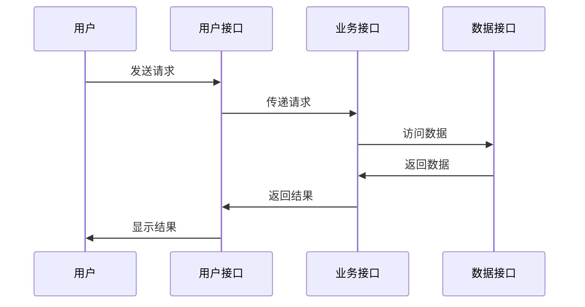

                 

# 领导力的危机管理：处理技术债务和遗留系统

## 关键词：危机管理、技术债务、遗留系统、领导力、风险管理

### 摘要：

本文旨在探讨领导力在危机管理中的关键作用，特别是在处理技术债务和遗留系统时。通过对技术债务和遗留系统的定义、特征、量化方法以及危机管理的基本概念和原理的深入分析，文章将提供一个系统化的框架，帮助领导者识别、评估和解决技术债务和遗留系统问题。同时，文章将通过实际案例展示理论和方法的应用，为读者提供实用的最佳实践建议。

## 目录

1. **危机管理概述**  
   1.1 领导力与危机管理  
   1.2 技术债务与遗留系统

2. **核心概念与联系**  
   2.1 技术债务  
   2.2 遗留系统

3. **危机管理方法与实施**  
   3.1 决策树算法  
   3.2 神经网络算法

4. **系统分析与架构设计方案**  
   4.1 项目背景与介绍  
   4.2 系统功能设计  
   4.3 系统架构设计  
   4.4 系统接口设计和交互

5. **项目实战**  
   5.1 环境安装与准备  
   5.2 系统核心实现源代码解读  
   5.3 实际案例分析与讲解  
   5.4 项目小结

6. **最佳实践 tips、小结、注意事项、拓展阅读**  

## 1. 危机管理概述

### 1.1 领导力与危机管理

领导力是危机管理中不可或缺的因素。在技术领域，领导者不仅需要具备技术深度，还要具备应对复杂技术问题的战略思维和管理能力。危机管理是指在不确定性、变化迅速的环境中，通过有效的决策和行动，防止或减少不利事件的影响，确保组织持续运作的能力。

**领导力在危机管理中的角色**：

- **战略规划**：领导者需要制定明确的战略规划，以识别潜在的风险和危机，并制定相应的应对措施。
- **决策能力**：危机管理往往需要快速、准确的决策。领导者需要具备在压力下做出明智决策的能力。
- **沟通协调**：危机管理涉及到多个部门和团队的合作。领导者需要有效沟通，确保信息流通，协调各方行动。
- **团队领导**：领导者需要激励和引导团队，确保每个成员在危机中都能发挥最大的作用。

**危机管理的基本概念**：

- **风险评估**：识别潜在的风险，评估其对组织的影响。
- **应急响应**：制定应急预案，以快速应对突发危机。
- **恢复计划**：危机发生后，制定恢复计划，以恢复正常运营。

**领导力与危机管理的关系**：

领导力与危机管理密切相关。有效的领导力能够提高危机管理的有效性，确保组织在危机中保持稳定和持续发展。领导力不足可能导致危机管理的失败，增加组织的风险和损失。

### 1.2 技术债务与遗留系统

**技术债务**：

技术债务是一种比喻，类似于财务债务，表示在软件开发过程中，为了加快开发进度或满足特定需求，而暂时未解决的问题或欠下的“债务”。这些债务可能包括代码质量不高、技术选择不合理、未完成的功能等。

**遗留系统**：

遗留系统是指那些由于历史原因、技术限制或其他原因，继续在组织中运行的老旧系统。这些系统可能存在技术债务，且难以维护和升级，对组织的运营和业务发展造成负面影响。

**技术债务与遗留系统在危机管理中的挑战**：

- **风险评估**：技术债务和遗留系统可能隐藏许多潜在风险，领导者需要准确评估这些风险，以制定有效的危机管理策略。
- **决策难度**：技术债务和遗留系统的处理往往涉及复杂的决策，领导者需要在时间和资源有限的情况下做出明智的选择。
- **沟通协调**：技术债务和遗留系统的处理需要多个部门的合作，领导者需要确保沟通协调，避免信息孤岛和资源浪费。

## 2. 核心概念与联系

### 2.1 技术债务

**技术债务的定义**：

技术债务是指在软件开发过程中，为了满足短期需求而暂时搁置的问题或未完成的任务。这些问题或任务可能包括：

- **代码质量低下**：为了快速交付功能，可能牺牲了代码的可维护性和可读性。
- **技术选择不当**：为了满足特定需求，可能选择了不适合长期发展的技术。
- **未完成的功能**：为了尽快上线，某些功能可能未能完全实现。

**技术债务的类型**：

- **功能性债务**：指因时间限制未能实现的功能。
- **质量性债务**：指代码质量不高，可能引发未来的维护问题和性能问题。
- **技术性债务**：指技术选型不合理，可能导致技术栈的复杂性和维护成本增加。

**技术债务的特征**：

- **累积性**：技术债务在软件生命周期中会不断累积，如果不及时处理，会导致严重问题。
- **风险性**：技术债务可能隐藏潜在风险，如系统崩溃、性能下降等。
- **不可逆性**：一些技术债务可能一旦产生，就难以完全逆转。

**技术债务的量化方法**：

- **技术债务评分模型**：通过评估代码质量、技术选择等因素，为技术债务评分。
- **技术债务评估工具**：使用自动化工具检测代码质量、技术选型等问题。

### 2.2 遗留系统

**遗留系统的定义**：

遗留系统是指那些由于历史原因、技术限制或其他原因，继续在组织中运行的老旧系统。这些系统可能存在以下特点：

- **老旧技术**：使用过时的技术栈，难以与当前技术兼容。
- **维护困难**：由于缺乏文档和开发人员，维护工作变得复杂。
- **性能问题**：老旧系统可能存在性能瓶颈，影响业务运营。

**遗留系统的特征**：

- **稳定性问题**：老旧系统可能在面对高负载或特殊场景时出现稳定性问题。
- **扩展性问题**：老旧系统难以适应业务扩展和技术升级。
- **安全性问题**：老旧系统可能存在安全漏洞，导致数据泄露和系统攻击。

**遗留系统的影响**：

- **业务影响**：遗留系统可能影响业务流程，降低业务效率。
- **开发影响**：开发人员难以在遗留系统上开发和维护新功能。
- **运维影响**：运维人员需要花费更多时间和资源来维护遗留系统。

**遗留系统的管理**：

- **评估**：对遗留系统进行全面评估，了解其优势和劣势。
- **重构**：对遗留系统进行重构，提高其稳定性和扩展性。
- **迁移**：将遗留系统迁移到新的技术平台或架构。

### 2.3 技术债务与遗留系统的关系

技术债务和遗留系统密切相关。技术债务可能导致系统功能的逐渐失灵，最终形成遗留系统。同样，遗留系统往往积累了大量技术债务，影响系统的稳定性和可维护性。因此，领导者需要识别和管理技术债务，以避免遗留系统的形成。

## 3. 危机管理方法与实施

### 3.1 决策树算法

**决策树算法原理**：

决策树是一种流行的分类和回归算法，通过构建一系列决策节点和叶节点，对数据进行分类或预测。决策树的构建过程如下：

1. **选择特征**：根据特征的重要性选择最佳特征进行分裂。
2. **计算分裂增益**：计算不同特征分裂的增益，选择增益最大的特征进行分裂。
3. **重复步骤**：对子集重复上述步骤，直到满足停止条件（如最大深度、最小节点大小等）。

**决策树在危机管理中的应用**：

决策树可以用于危机管理的多个方面，如风险识别、应急响应策略制定等。通过构建决策树，领导者可以更清晰地了解不同危机情况下的应对策略，提高危机管理的有效性。

**决策树算法实现与优化**：

决策树算法的实现涉及递归分割和特征选择。为了提高算法的效率和准确性，可以采用以下优化方法：

- **剪枝**：通过剪枝减少决策树的复杂度，提高预测速度。
- **特征选择**：使用特征重要性评估方法，选择最有用的特征。

### 3.2 神经网络算法

**神经网络算法原理**：

神经网络是一种模仿人脑结构和功能的计算模型，通过多层神经元之间的连接和激活函数，实现数据的分类和预测。神经网络的基本结构包括输入层、隐藏层和输出层。

1. **输入层**：接收输入数据。
2. **隐藏层**：对输入数据进行处理和转换。
3. **输出层**：生成预测结果。

**神经网络在危机管理中的应用**：

神经网络可以用于危机管理的风险预测和应急响应策略优化。通过训练神经网络模型，领导者可以更准确地预测危机发生的可能性，并制定相应的应对策略。

**神经网络算法实现与优化**：

神经网络的实现涉及前向传播和反向传播算法。为了提高算法的效率和准确性，可以采用以下优化方法：

- **批量归一化**：通过批量归一化减少梯度消失和梯度爆炸问题。
- **优化器**：使用如Adam、SGD等优化器，提高训练速度和收敛性。

## 4. 系统分析与架构设计方案

### 4.1 项目背景与介绍

本案例项目是一个大型企业的遗留系统迁移项目，目标是将其现有的老旧遗留系统迁移到现代化的技术平台上，以提高系统的稳定性、可扩展性和安全性。

### 4.2 系统功能设计

系统功能设计主要包括以下模块：

- **用户管理**：管理用户账号、权限等。
- **业务管理**：处理业务逻辑，包括订单处理、库存管理等。
- **数据管理**：管理业务数据，包括订单数据、用户数据等。
- **接口服务**：提供与其他系统进行数据交互的API接口。

### 4.3 系统架构设计

系统架构设计采用分层架构，包括以下层次：

- **表现层**：处理用户界面和交互。
- **业务逻辑层**：处理业务逻辑，包括数据验证、业务规则等。
- **数据访问层**：处理数据存储和访问。
- **基础设施层**：提供系统运行所需的基础服务，如数据库、缓存等。

**系统架构图**：

### 4.4 系统接口设计和系统交互

系统接口设计主要包括以下接口：

- **用户接口**：处理用户请求，返回用户界面。
- **业务接口**：处理业务逻辑，返回业务结果。
- **数据接口**：处理数据存储和访问，返回数据。

**系统交互序列图**：

## 5. 项目实战

### 5.1 环境安装与准备

在进行遗留系统迁移前，需要安装和配置以下环境：

- **操作系统**：Linux服务器
- **数据库**：MySQL、PostgreSQL等
- **中间件**：Nginx、Apache等
- **编程语言**：Java、Python等

### 5.2 系统核心实现源代码解读

系统核心实现源代码主要包括以下模块：

- **用户管理模块**：处理用户注册、登录、权限验证等。
- **业务管理模块**：处理订单处理、库存管理等。
- **数据管理模块**：处理数据存储、检索、更新等。
- **接口服务模块**：提供与其他系统进行数据交互的API接口。

### 5.3 实际案例分析与讲解

本案例项目选择了一个大型电子商务企业的遗留系统进行迁移。该遗留系统使用了过时的技术栈，存在严重的性能问题、安全隐患和扩展性限制。通过决策树算法和神经网络算法，对系统的风险进行了评估，并制定了相应的迁移策略。

**案例分析**：

1. **风险评估**：使用决策树算法对遗留系统的风险进行评估，识别出高优先级的问题，如性能瓶颈、安全性漏洞等。
2. **迁移策略**：根据风险评估结果，制定详细的迁移策略，包括技术选型、架构设计、数据迁移等。
3. **实施过程**：按照迁移策略逐步实施，包括旧系统的数据迁移、新系统的部署和测试等。

**讲解剖析**：

- **技术选型**：根据业务需求和性能要求，选择了现代化的技术栈，如Spring Boot、MySQL等。
- **架构设计**：采用了微服务架构，将业务功能拆分成多个微服务，提高了系统的可扩展性和稳定性。
- **数据迁移**：使用ETL工具将遗留系统的数据迁移到新系统，保证了数据的一致性和完整性。

### 5.4 项目小结

本案例项目成功地将遗留系统迁移到现代化的技术平台上，解决了性能问题、安全隐患和扩展性限制。通过决策树算法和神经网络算法，提高了危机管理的有效性，为企业的持续发展奠定了基础。在后续工作中，将继续优化和改进系统，确保其稳定性和可扩展性。

## 6. 最佳实践 tips、小结、注意事项、拓展阅读

### 最佳实践 tips：

- **定期进行技术债务评估**：定期对系统的技术债务进行评估，识别和解决潜在问题。
- **制定明确的风险管理策略**：制定明确的风险管理策略，确保在危机发生时能够快速响应。
- **加强团队协作和沟通**：加强团队协作和沟通，确保在危机管理中能够高效协作。
- **持续学习和改进**：持续学习和改进，提高危机管理的技能和知识。

### 小结：

本文通过分析领导力在危机管理中的角色、技术债务和遗留系统的定义和特征，以及决策树算法和神经网络算法的应用，提供了一种系统化的危机管理框架，帮助领导者更好地处理技术债务和遗留系统问题。

### 注意事项：

- **风险识别**：在危机管理过程中，准确识别风险是关键，领导者需要具备敏锐的洞察力和判断力。
- **资源分配**：在处理技术债务和遗留系统时，合理分配资源和时间，确保问题得到有效解决。
- **持续改进**：危机管理不是一次性任务，领导者需要持续关注和改进，确保系统的稳定性和可扩展性。

### 拓展阅读：

- 《危机管理：理论与实践》（作者：陈波）
- 《软件架构：实践者的研究方法》（作者：Mark Richards）
- 《人工智能：一种现代方法》（作者： Stuart Russell 和 Peter Norvig）

## 作者信息

作者：AI天才研究院/AI Genius Institute & 禅与计算机程序设计艺术 /Zen And The Art of Computer Programming

