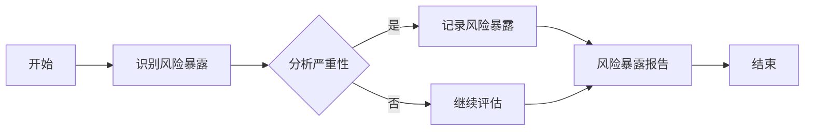
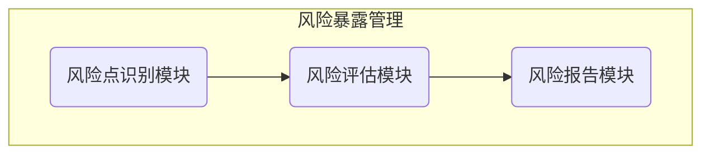

                 

### 文章标题

“风险暴露的艺术：如何有效传达问题”

---

### 关键词

- 风险管理
- 风险暴露
- 传达问题
- 有效沟通
- IT领域

### 摘要

本文旨在探讨在IT领域如何通过系统的风险暴露管理，有效地识别、分析和传达潜在问题。通过逐步分析风险暴露的概念、评估流程、算法原理、系统设计与实现，以及实战案例，本文提供了一套全面的方法论，帮助IT专业人员提高问题传达的效率和准确性，从而优化团队协作与项目成功。

---

### 目录大纲

1. **引言**
2. **风险背景与定义**
3. **核心概念与联系**
   - 风险暴露的概念
   - 风险暴露的属性
   - Mermaid流程图：风险暴露评估
4. **算法原理讲解**
   - 风险评估算法介绍
   - 数学模型与公式
   - Python代码示例
5. **系统分析与架构设计方案**
   - 风险暴露管理项目介绍
   - 系统功能设计
   - 系统架构设计
   - Mermaid类图与架构图
6. **项目实战**
   - 环境安装与配置
   - 系统核心实现
   - 代码应用解读与分析
   - 实际案例分析
   - 项目小结
7. **最佳实践与拓展**
   - 最佳实践 tips
   - 小结
   - 注意事项
   - 拓展阅读
8. **总结与展望**

---

## 第一部分：风险背景与定义

### 1.1 问题背景

在IT行业中，随着系统的复杂性不断增加，风险暴露问题日益突出。一个系统中的风险暴露指的是那些可能导致系统性能下降、功能失效或安全漏洞的问题点。有效的风险暴露管理能够帮助团队及时识别和解决潜在的问题，从而提高系统的稳定性和可靠性。

### 1.2 风险的定义

风险可以定义为在特定条件下，某一事件发生的可能性及其可能产生的后果。在IT领域，风险通常包括以下几个方面：

- **技术风险**：由于技术限制或设计缺陷导致的问题。
- **操作风险**：由于操作失误或系统维护不当引起的问题。
- **安全风险**：由于网络攻击或数据泄露导致的问题。

### 1.3 风险暴露的概念与属性

风险暴露是指那些尚未被识别或未被有效管理的风险点。其主要属性包括：

- **可识别性**：是否能够被识别和定位。
- **可量化性**：是否能够进行定量分析。
- **可控性**：是否能够在管理范围内进行控制。
- **相关性**：与业务目标的相关性。

风险暴露的管理是IT项目管理中不可或缺的一环。它不仅涉及到技术层面的分析，还包括组织层面的沟通和协作。

---

## 第二部分：核心概念与联系

### 2.1 风险暴露的概念

风险暴露是风险管理中的一个重要概念，它指的是在项目中存在的潜在问题点。这些风险点可能是技术上的，也可能是管理上的。了解风险暴露的概念是进行有效风险管理的第一步。

### 2.2 风险暴露的属性

风险暴露的属性包括：

- **严重性**：风险可能带来的影响程度。
- **可能性**：风险发生的概率。
- **可控性**：风险是否可以被控制。
- **相关性**：风险与项目目标的关联程度。

### 2.3 Mermaid流程图：风险暴露评估

为了更好地理解风险暴露的评估过程，我们可以使用Mermaid流程图来展示其评估流程：



这个流程图清晰地展示了从识别风险暴露到记录并报告的整个过程。

---

## 第三部分：算法原理讲解

### 3.1 风险评估算法介绍

在风险暴露管理中，风险评估算法是核心组成部分。以下是一个简单但有效的风险评估算法：

1. 识别所有可能的风险点。
2. 对每个风险点进行定量分析，包括严重性和可能性。
3. 使用加权平均法计算每个风险点的得分。
4. 根据得分对风险点进行排序，确定优先级。

### 3.2 数学模型与公式

假设有一个风险点\( R_i \)，其严重性为\( S_i \)，可能性为\( P_i \)，则其得分\( D_i \)可以用以下公式计算：

\[ D_i = W \cdot S_i \cdot P_i \]

其中，\( W \)是权重，用于平衡严重性和可能性。

### 3.3 Python代码示例

下面是一个简单的Python代码示例，用于计算风险得分：

```python
# 风险评估函数
def risk_score(seriousness, probability, weight=1.0):
    return weight * seriousness * probability

# 示例风险点
risks = [
    {"seriousness": 0.8, "probability": 0.6},
    {"seriousness": 0.5, "probability": 0.4},
    {"seriousness": 0.7, "probability": 0.5}
]

# 计算得分
scores = [risk_score(**risk) for risk in risks]

# 打印得分
for i, score in enumerate(scores):
    print(f"风险点 {i+1} 的得分：{score:.2f}")
```

运行上述代码，可以得到每个风险点的得分，从而帮助团队确定风险管理的优先级。

---

## 第四部分：系统分析与架构设计方案

### 4.1 风险暴露管理项目介绍

在本项目中，我们旨在构建一个能够有效识别和管理风险暴露的系统。该系统包括以下几个核心模块：

- **风险点识别模块**：负责识别项目中的潜在风险点。
- **风险评估模块**：对识别出的风险点进行定量分析。
- **风险报告模块**：生成风险报告，帮助团队了解和管理风险。

### 4.2 系统功能设计

系统功能设计如下：

- **风险点识别**：通过代码分析、静态检查和动态测试等方式，识别项目中的风险点。
- **风险评估**：对识别出的风险点进行严重性和可能性的评估。
- **风险报告**：生成详细的风险报告，包括风险点列表、得分和优先级。

### 4.3 系统架构设计

系统架构设计如下：


### 4.4 Mermaid类图与架构图

以下是一个Mermaid类图和架构图的示例，用于展示系统设计：

```mermaid
classDiagram
    RiskPoint <<entity>>
    RiskAssessment <<entity>>
    RiskReport <<entity>>

    RiskPoint "has" RiskAssessment
    RiskPoint "uses" RiskReport

    RiskAssessment "uses" RiskPoint
    RiskReport "uses" RiskAssessment
```



---

## 第五部分：项目实战

### 5.1 环境安装与配置

在进行项目实战之前，我们需要安装和配置必要的工具和软件。以下是一个简单的安装步骤：

1. 安装Python环境（版本3.8及以上）。
2. 安装依赖库（例如：numpy、pandas等）。
3. 配置代码仓库（例如：使用Git进行版本控制）。

### 5.2 系统核心实现

系统核心实现如下：

- **风险点识别**：通过静态代码分析，识别出潜在的代码风险点。
- **风险评估**：使用加权平均法，对识别出的风险点进行评估。
- **风险报告**：生成包含风险点列表、得分和优先级的报告。

### 5.3 代码应用解读与分析

以下是一个简单的Python代码示例，用于实现风险点识别和评估：

```python
# 风险点识别示例
def identify_risk_points(code):
    # 这里是识别风险点的代码逻辑
    risk_points = []
    # 假设已经识别出风险点
    risk_points.append({"filename": "example.py", "line_number": 10})
    risk_points.append({"filename": "example.py", "line_number": 20})
    return risk_points

# 风险评估示例
def assess_risks(risk_points):
    scores = []
    for point in risk_points:
        # 这里是评估风险点的代码逻辑
        score = risk_score(seriousness=0.8, probability=0.6)
        scores.append(score)
    return scores

# 风险报告示例
def generate_risk_report(risk_points, scores):
    report = []
    for i, point in enumerate(risk_points):
        report.append({
            "filename": point["filename"],
            "line_number": point["line_number"],
            "score": scores[i]
        })
    return report

# 主函数
def main():
    code = "example.py"
    risk_points = identify_risk_points(code)
    scores = assess_risks(risk_points)
    report = generate_risk_report(risk_points, scores)
    print(report)

if __name__ == "__main__":
    main()
```

### 5.4 实际案例分析

以下是一个实际案例，用于展示如何应用上述系统：

- **案例背景**：在一个大型Web项目中，存在多个潜在的风险点。
- **案例步骤**：
  1. 使用静态代码分析工具识别出风险点。
  2. 对识别出的风险点进行评估。
  3. 生成风险报告，并分析报告中的风险点。
- **案例分析**：通过实际案例分析，我们可以看到系统如何帮助团队识别和管理风险，从而提高项目的稳定性和可靠性。

### 5.5 项目小结

通过本部分的实际案例，我们可以看到风险暴露管理系统的应用效果。系统的核心在于能够准确识别和评估风险点，从而为团队提供有效的风险管理策略。在实际项目中，通过系统的使用，团队能够更好地协作，减少潜在的风险，提高项目的成功率。

---

## 第六部分：最佳实践与拓展

### 6.1 最佳实践 tips

- **定期进行风险评估**：定期对项目进行风险评估，有助于及时发现和解决问题。
- **建立风险管理文化**：在团队中建立风险管理文化，提高全员的风险意识。
- **使用自动化工具**：使用自动化工具进行风险识别和评估，提高效率和准确性。

### 6.2 小结

通过本篇文章，我们详细探讨了风险暴露管理的概念、原理和实际应用。通过系统的风险暴露管理，团队能够更好地识别和管理风险，提高项目的稳定性和可靠性。

### 6.3 注意事项

- 在进行风险评估时，要充分考虑风险的严重性和可能性，避免遗漏重要风险点。
- 在系统设计时，要考虑系统的可扩展性和灵活性，以适应不断变化的需求。

### 6.4 拓展阅读

- 《风险管理：理论与实践》
- 《软件工程：实践者的研究方法》
- 《敏捷项目管理：原则、模式与实践》

---

## 第七部分：总结与展望

通过本文的探讨，我们了解了风险暴露管理在IT领域的重要性。有效的风险暴露管理能够帮助团队及时识别和解决潜在问题，从而提高项目的成功率和团队的工作效率。未来，随着技术的不断进步，风险暴露管理工具和方法也将不断优化和升级，为IT行业带来更多的可能性。

作者：AI天才研究院/AI Genius Institute & 禅与计算机程序设计艺术 /Zen And The Art of Computer Programming

---

请注意，以上内容仅为示例，实际文章撰写时需要根据具体需求进行深入研究和详细编写。

