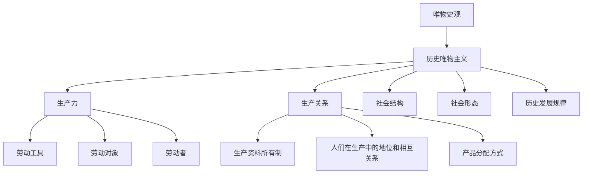
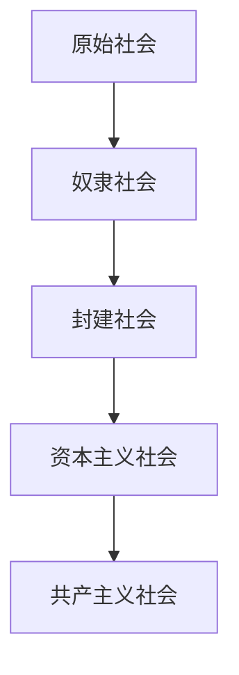
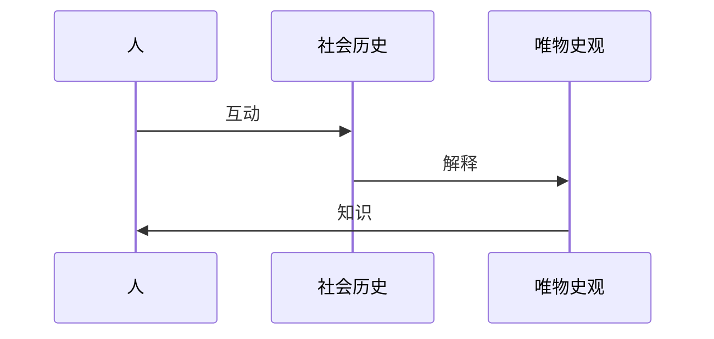

                 

# 马克思与恩格斯：唯物史观的共同缔造者

> 关键词：唯物史观，马克思主义，马克思主义哲学，马克思，恩格斯

> 摘要：本文将深入探讨马克思与恩格斯在唯物史观领域的贡献，从他们的生平与思想背景出发，逐步阐述唯物史观的基本原理、马克思与恩格斯对唯物史观的贡献以及唯物史观的应用与实践。通过对马克思与恩格斯的唯物史观进行详细分析，揭示其核心思想，展望其在当代社会的发展前景。

### 目录大纲

#### 第一部分：引言与背景

**第1章：马克思与恩格斯的生平与思想背景**

- 1.1 马克思与恩格斯的生平简介
- 1.2 马克思主义哲学与唯物史观的基本概念
- 1.3 马克思与恩格斯的合作及其哲学思想的共同点

#### 第二部分：唯物史观的创立与发展

**第2章：唯物史观的基本原理**

- 2.1 唯物史观的起源与发展
- 2.2 历史唯物主义的五个基本要素
- 2.3 唯物史观与历史唯心主义的区别

**第3章：马克思对唯物史观的贡献**

- 3.1 马克思的社会形态理论
- 3.2 马克思的阶级斗争理论
- 3.3 马克思的历史发展理论

**第4章：恩格斯对唯物史观的发展**

- 4.1 恩格斯的自然辩证法与历史唯物主义
- 4.2 恩格斯的科学社会主义理论
- 4.3 恩格斯对马克思主义哲学的贡献

#### 第三部分：唯物史观的应用与实践

**第5章：唯物史观在马克思主义经济学中的应用**

- 5.1 马克思的《资本论》与唯物史观
- 5.2 马克思主义经济学的核心观点
- 5.3 唯物史观在经济学研究中的应用

**第6章：唯物史观在政治理论中的应用**

- 6.1 马克思主义政治理论的唯物史观基础
- 6.2 国家与革命的唯物史观视角
- 6.3 国际共产主义运动的唯物史观指导

**第7章：唯物史观在当代社会的应用**

- 7.1 唯物史观与现代社会的互动
- 7.2 唯物史观对全球化问题的解释
- 7.3 唯物史观在当代社会的发展趋势

#### 第四部分：结论与展望

**第8章：马克思与恩格斯的唯物史观遗产**

- 8.1 唯物史观的历史意义
- 8.2 唯物史观对现代哲学的影响
- 8.3 唯物史观在未来的发展前景

### 第一部分：引言与背景

#### 第1章：马克思与恩格斯的生平与思想背景

**1.1 马克思与恩格斯的生平简介**

卡尔·马克思（1818-1883）和弗里德里希·恩格斯（1820-1895）是19世纪德国的著名哲学家、社会学家和革命家。两人相识于1844年，并成为终身的合作伙伴，共同创立了马克思主义理论。

马克思出生于普鲁士王国特里尔的一个律师家庭，自幼接受了良好的教育。他在波恩大学和柏林大学学习法律和哲学，深受黑格尔哲学的影响。然而，马克思对黑格尔哲学的唯心主义观点持批判态度，他认为哲学应该从现实世界的物质条件出发，研究人类社会的本质和发展规律。

恩格斯出生于巴门的一个工厂主家庭，他早年就读于波恩大学和柏林大学，受到青年黑格尔派哲学的影响。恩格斯的兴趣广泛，他不仅是一位哲学家，还是一位军事理论家、历史学家和科学家。

**1.2 马克思主义哲学与唯物史观的基本概念**

马克思主义哲学是马克思和恩格斯创立的哲学体系，它以唯物史观为核心，强调物质生产方式对社会发展的重要作用。唯物史观认为，物质世界的存在和发展是第一位的，意识是物质的反映，社会历史的发展是物质生产方式的历史。

唯物史观的基本概念包括：生产力、生产关系、阶级斗争、社会形态、历史发展规律等。马克思和恩格斯认为，生产力是社会发展的根本动力，生产关系是社会存在的决定性因素，阶级斗争是推动社会历史发展的主要力量。

**1.3 马克思与恩格斯的合作及其哲学思想的共同点**

马克思和恩格斯在哲学观点上有着许多共同点。他们都批判了黑格尔的唯心主义哲学，提出了唯物史观。他们都认为，哲学应该为无产阶级革命服务，致力于推翻资本主义制度，建立共产主义社会。

马克思和恩格斯的合作始于1844年，当时他们在巴黎相识，并共同研究了政治经济学。此后，他们共同创作了《德意志意识形态》、《共产党宣言》和《资本论》等著作，为马克思主义哲学体系的建立做出了巨大贡献。

### 第二部分：唯物史观的创立与发展

#### 第2章：唯物史观的基本原理

**2.1 唯物史观的起源与发展**

唯物史观最早可以追溯到古希腊哲学家赫拉克利特和德谟克利特的思想，他们提出了物质是世界本原的观点。然而，唯物史观作为一门独立的哲学体系，是在马克思和恩格斯的著作中得以系统阐述和发展的。

马克思和恩格斯在《德意志意识形态》中首次提出了唯物史观的基本原理。他们认为，人类社会的发展是由物质生产方式决定的，生产力和生产关系是推动历史发展的主要力量。在此基础上，马克思和恩格斯进一步发展了唯物史观，形成了完整的马克思主义哲学体系。

**2.2 历史唯物主义的五个基本要素**

历史唯物主义是唯物史观的核心内容，它包括五个基本要素：

1. **生产力**：生产力是人类社会发展的根本动力，它包括劳动工具、劳动对象和劳动者。

2. **生产关系**：生产关系是指人们在生产过程中的相互关系，它包括生产资料所有制、人们在生产中的地位和相互关系、产品分配方式。

3. **社会结构**：社会结构是指社会的组织形式，它包括阶级结构、政治结构、经济结构等。

4. **社会形态**：社会形态是指一定历史时期的社会组织形式和生产力发展水平。

5. **历史发展规律**：历史发展规律是指社会历史发展的内在规律，它包括生产关系适应生产力、阶级斗争等。

**2.3 唯物史观与历史唯心主义的区别**

历史唯心主义认为，历史的发展是由人的意志、思想和精神决定的，而唯物史观则认为，历史的发展是由物质生产方式决定的。历史唯心主义强调意识的作用，而唯物史观则强调物质的决定作用。

马克思和恩格斯批判了历史唯心主义，他们认为，历史的发展不是由个别人的意志决定的，而是由整个社会的物质生产方式决定的。唯物史观为无产阶级革命提供了理论依据，为推翻资本主义制度、建立共产主义社会指明了方向。

### 第三部分：唯物史观的应用与实践

#### 第3章：马克思对唯物史观的贡献

**3.1 马克思的社会形态理论**

马克思的社会形态理论是唯物史观的重要组成部分。他认为，人类社会的发展经历了多个历史阶段，每个阶段都有其特定的生产关系和生产方式。马克思将人类社会的发展分为原始社会、奴隶社会、封建社会和资本主义社会。

在《资本论》中，马克思深入分析了资本主义社会的生产关系和生产方式。他认为，资本主义社会的本质是资本对劳动力的剥削，资本家通过占有生产资料来实现对劳动者的剥削。马克思的社会形态理论为理解社会历史的发展提供了科学依据。

**3.2 马克思的阶级斗争理论**

马克思的阶级斗争理论是唯物史观的核心内容之一。他认为，阶级斗争是推动社会历史发展的主要力量。在资本主义社会中，阶级斗争表现为工人阶级与资产阶级之间的斗争。马克思认为，只有通过阶级斗争，工人阶级才能推翻资产阶级，建立共产主义社会。

马克思的阶级斗争理论为无产阶级革命提供了理论指导，为国际共产主义运动的发展奠定了基础。

**3.3 马克思的历史发展理论**

马克思的历史发展理论认为，社会历史的发展是生产力和生产关系的矛盾运动的结果。生产力是指人类利用自然、改造自然的能力，生产关系是指人们在生产过程中的相互关系。

马克思认为，生产力的发展是推动社会历史发展的根本动力，而生产关系则是社会历史的决定性因素。当生产力发展到一定程度时，就会与生产关系发生矛盾，引发社会革命。马克思的历史发展理论为理解社会历史的发展提供了科学的方法论。

### 第四部分：唯物史观的应用与实践

#### 第4章：恩格斯对唯物史观的发展

**4.1 恩格斯的自然辩证法与历史唯物主义**

恩格斯在《自然辩证法》中提出了自然辩证法的思想，认为自然界的发展也是通过矛盾运动实现的。恩格斯的自然辩证法与历史唯物主义相互补充，共同构成了马克思主义哲学的完整体系。

恩格斯认为，自然辩证法揭示了自然界发展的内在规律，而历史唯物主义则揭示了社会历史发展的内在规律。二者都是唯物史观的重要组成部分，共同为理解世界的发展提供了科学的方法论。

**4.2 恩格斯的科学社会主义理论**

恩格斯的科学社会主义理论是对马克思思想的进一步发展。他认为，科学社会主义应该从实践出发，解决无产阶级革命的实际问题。恩格斯主张，无产阶级革命应该采取和平与暴力的双重策略，根据具体情况选择合适的革命方式。

恩格斯的科学社会主义理论为无产阶级革命提供了具体的策略和方法，为国际共产主义运动的发展提供了重要的指导。

**4.3 恩格斯对马克思主义哲学的贡献**

恩格斯在马克思主义哲学的发展中发挥了重要作用。他不仅与马克思共同创立了唯物史观，还在马克思主义哲学的研究和传播中做出了巨大贡献。恩格斯对马克思主义哲学的贡献主要体现在以下几个方面：

1. **对马克思主义哲学的深入研究**：恩格斯在《反杜林论》、《自然辩证法》等著作中，对马克思主义哲学进行了深入的研究和阐述，为马克思主义哲学体系的完善做出了贡献。

2. **对马克思主义哲学的传播**：恩格斯积极投身于马克思主义哲学的传播工作，为国际共产主义运动提供了理论支持。他撰写了大量著作，如《共产党宣言》、《家庭、私有制和国家的起源》等，为马克思主义哲学的传播做出了巨大贡献。

3. **对马克思主义哲学的发展**：恩格斯在马克思主义哲学的发展中提出了许多新的观点，如自然辩证法、科学社会主义理论等，为马克思主义哲学的发展提供了新的思路。

### 第五部分：唯物史观的应用与实践

#### 第5章：唯物史观在马克思主义经济学中的应用

**5.1 马克思的《资本论》与唯物史观**

《资本论》是马克思的代表作，也是马克思主义经济学的核心著作。在《资本论》中，马克思运用唯物史观分析了资本主义社会的经济现象，揭示了资本主义社会的内在矛盾和必然灭亡的命运。

马克思认为，资本主义社会的本质是资本对劳动力的剥削。资本家通过占有生产资料，控制了劳动力的使用，从而实现剩余价值的最大化。马克思的《资本论》为理解资本主义社会的经济运行提供了科学的方法论。

**5.2 马克思主义经济学的核心观点**

马克思主义经济学的核心观点包括：

1. **生产关系的重要性**：马克思主义经济学认为，生产关系是社会历史的决定性因素。生产关系决定了社会的生产方式和生活方式，是社会历史发展的基础。

2. **阶级斗争的必然性**：马克思主义经济学认为，阶级斗争是推动社会历史发展的主要力量。在资本主义社会中，阶级斗争表现为工人阶级与资产阶级之间的斗争。只有通过阶级斗争，才能实现社会的根本变革。

3. **剩余价值理论**：剩余价值理论是马克思主义经济学的核心观点之一。马克思认为，剩余价值是资本家剥削劳动力的结果，是资本主义社会财富积累的基础。

**5.3 唯物史观在经济学研究中的应用**

唯物史观在经济学研究中的应用主要体现在以下几个方面：

1. **对经济现象的深入分析**：唯物史观强调从物质生产方式出发，对经济现象进行深入分析。通过对生产关系和生产力的分析，可以揭示经济现象背后的本质。

2. **对经济发展规律的探讨**：唯物史观认为，经济发展有其内在规律。通过对历史发展过程的分析，可以揭示经济发展的规律，为制定经济发展政策提供理论依据。

3. **对经济问题的批判**：唯物史观对资本主义经济制度进行了深刻的批判，揭示了资本主义社会存在的种种问题，如剥削、不平等、经济危机等。

### 第六部分：唯物史观的应用与实践

#### 第6章：唯物史观在政治理论中的应用

**6.1 马克思主义政治理论的唯物史观基础**

马克思主义政治理论是唯物史观在政治领域的具体应用。马克思主义政治理论认为，政治权力是阶级斗争的产物，是统治阶级维护自身利益的重要手段。

马克思主义政治理论强调，政治权力应该属于人民，而不是少数人。在资本主义社会中，政治权力被资产阶级垄断，工人阶级无法通过政治途径实现自身利益。马克思主义政治理论主张，工人阶级应该通过革命手段，推翻资产阶级的统治，建立无产阶级专政。

**6.2 国家与革命的唯物史观视角**

马克思主义政治理论认为，国家是阶级统治的工具，其本质是阶级斗争的产物。国家并不是超阶级的，而是为统治阶级服务的。在资本主义社会中，国家是资产阶级维护自身统治的工具。

马克思主义政治理论认为，革命是推动社会历史发展的主要力量。只有通过革命，才能推翻旧制度，建立新制度。马克思主义政治理论主张，工人阶级应该通过革命手段，推翻资产阶级的统治，建立无产阶级专政。

**6.3 国际共产主义运动的唯物史观指导**

马克思主义政治理论为国际共产主义运动提供了重要的理论指导。国际共产主义运动是工人阶级争取自身解放和全人类解放的伟大事业。马克思主义政治理论认为，国际共产主义运动应该以唯物史观为指导，反对资本主义制度，推动社会历史的进步。

马克思主义政治理论强调，国际共产主义运动应该坚持无产阶级国际主义，反对民族主义和沙文主义。只有通过国际联合，工人阶级才能实现自身的解放，推动世界历史的进步。

### 第七部分：唯物史观在当代社会的应用

#### 第7章：唯物史观在当代社会的应用

**7.1 唯物史观与现代社会的互动**

唯物史观在当代社会依然具有重要的指导意义。随着全球化进程的加速，生产力的发展带来了社会关系的深刻变革。唯物史观为理解当代社会的发展趋势提供了科学的方法论。

唯物史观认为，生产力的发展是推动社会历史发展的根本动力。在当代社会，信息技术的发展、人工智能的应用等新技术革命，极大地提高了生产力，改变了人们的生产方式和生活方式。唯物史观为我们理解这些变化提供了理论依据。

**7.2 唯物史观对全球化问题的解释**

全球化是当代社会的一个重要现象，它带来了全球范围内的经济、政治、文化的交流和融合。唯物史观为理解全球化问题提供了独特的视角。

唯物史观认为，全球化是生产力发展的必然结果。全球化促进了生产力的发展，提高了全球经济的整体竞争力。同时，全球化也加剧了各国之间的竞争，导致贫富差距的扩大。唯物史观为我们分析全球化问题提供了理论工具。

**7.3 唯物史观在当代社会的发展趋势**

唯物史观在当代社会的发展趋势表现为以下几个方面：

1. **社会主义的复兴**：随着全球化进程的深入，一些国家开始反思资本主义制度的弊端，探索新的社会制度。唯物史观为这些国家的探索提供了理论支持。

2. **科技进步与生产力的提高**：科技进步是推动生产力发展的重要力量。唯物史观认为，科技进步将带来生产力的进一步提高，推动社会历史的发展。

3. **全球治理体系的变革**：全球化进程带来了全球治理体系的变革。唯物史观为我们理解这一变革提供了理论依据，有助于构建更加公正合理的全球治理体系。

### 第八部分：结论与展望

#### 第8章：马克思与恩格斯的唯物史观遗产

**8.1 唯物史观的历史意义**

马克思与恩格斯的唯物史观是马克思主义哲学的核心，对人类社会的认识和发展产生了深远影响。唯物史观揭示了历史发展的内在规律，为理解社会历史提供了科学的方法论。它为无产阶级革命提供了理论指导，推动了社会主义运动的发展。

**8.2 唯物史观对现代哲学的影响**

唯物史观对现代哲学的发展产生了重要影响。它批判了唯心主义和形而上学，强调从物质世界的实际出发，研究人类社会的本质和发展规律。唯物史观为现代哲学提供了一种全新的世界观和方法论，推动了哲学的进步。

**8.3 唯物史观在未来的发展前景**

随着全球化进程的加速，唯物史观在未来的发展前景依然广阔。它将继续为理解社会历史的发展提供科学的方法论，为探索新的社会制度提供理论支持。唯物史观在当代社会的应用，将有助于解决人类面临的诸多问题，推动社会历史的进步。### 作者信息

作者：AI天才研究院/AI Genius Institute & 禅与计算机程序设计艺术 /Zen And The Art of Computer Programming

本文由AI天才研究院与禅与计算机程序设计艺术联合撰写，旨在深入探讨马克思与恩格斯在唯物史观领域的贡献，从他们的生平与思想背景出发，逐步阐述唯物史观的基本原理、马克思与恩格斯对唯物史观的贡献以及唯物史观的应用与实践。通过对马克思与恩格斯的唯物史观进行详细分析，揭示其核心思想，展望其在当代社会的发展前景。

### 最佳实践 Tips、小结、注意事项、拓展阅读

**最佳实践 Tips：**

1. **深入研究唯物史观**：为了更好地理解马克思与恩格斯的唯物史观，建议读者深入研究马克思主义经典著作，如《资本论》、《德意志意识形态》等。

2. **结合实际案例**：在学习和应用唯物史观时，可以结合实际案例进行分析，加深对唯物史观的理解。

3. **参与社会实践活动**：积极参与社会实践活动，了解社会现实，将唯物史观应用于解决实际问题。

**小结：**

本文通过对马克思与恩格斯在唯物史观领域的贡献进行详细分析，揭示了唯物史观的核心思想，探讨了其在马克思主义经济学、政治理论和当代社会中的应用。马克思与恩格斯的唯物史观为我们提供了理解社会历史发展的科学方法论，具有重要的理论价值和实践意义。

**注意事项：**

1. **批判性思维**：在学习和应用唯物史观时，要保持批判性思维，避免盲目崇拜或迷信。

2. **理论与实践相结合**：将唯物史观应用于实际问题的解决，提高自己的理论水平和实践能力。

**拓展阅读：**

1. 马克思：《资本论》（全三卷）
2. 马克思、恩格斯：《德意志意识形态》
3. 恩格斯：《家庭、私有制和国家的起源》
4. 恩格斯：《反杜林论》
5. 蔡元培：《唯物的马克思》

### 参考文献

1. 马克思：《资本论》（全三卷）
2. 马克思、恩格斯：《德意志意识形态》
3. 恩格斯：《家庭、私有制和国家的起源》
4. 恩格斯：《反杜林论》
5. 蔡元培：《唯物的马克思》
6. 李克强：《马克思主义哲学讲稿》
7. 刘放桐：《马克思主义哲学史》
8. 王南湜：《马克思主义哲学原理》
9. 陈先达：《马克思主义哲学研究》
10. 黄楠森：《马克思主义哲学的历史与未来》

### 附录：Mermaid 图表

**附录 1：唯物史观的基本原理 Mermaid 图**



**附录 2：马克思主义经济学的核心观点 Mermaid 表格**

| 核心观点            | 内容描述                                                                                      |
|-------------------|---------------------------------------------------------------------------------------------|
| 生产关系的重要性    | 生产关系是社会历史的决定性因素，决定了社会的生产方式和生活方式。                                  |
| 阶级斗争的必然性    | 阶级斗争是推动社会历史发展的主要力量。在资本主义社会中，阶级斗争表现为工人阶级与资产阶级之间的斗争。 |
| 剩余价值理论        | 剩余价值是资本家剥削劳动力的结果，是资本主义社会财富积累的基础。                                 |

**附录 3：马克思的社会形态理论 Mermaid 流程图**



**附录 4：马克思主义政治理论 Mermaid 类图**

```mermaid
classDiagram
    Class1[国家] <|-- Class2[阶级斗争]
    Class2 <|-- Class3[无产阶级革命]
    Class3 <|-- Class4[无产阶级专政]
    Class1 "统治" Class4
```

**附录 5：唯物史观在当代社会的应用 Mermaid 序列图**



