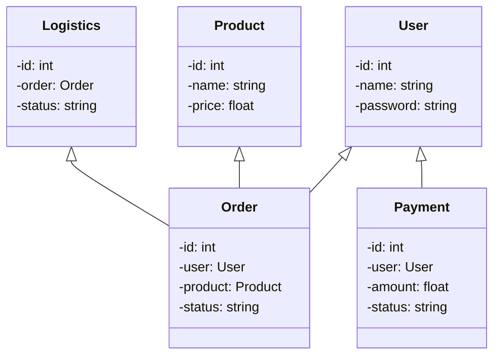
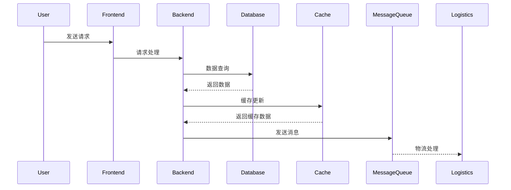
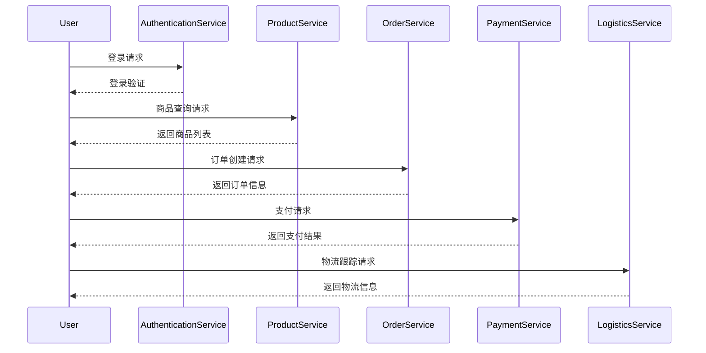

                 

# 高可用系统的容错与自愈设计

## 关键词：高可用性、容错设计、自愈设计、冗余机制、故障检测、故障诊断

> 摘要：本文深入探讨了高可用系统的容错与自愈设计，分析了其背景、核心概念、算法原理，并通过实际案例介绍了系统的架构设计和实现方法。

## 第一部分：背景介绍

### 1. 问题背景

在当今信息化和数字化时代，系统的高可用性成为许多企业和组织的核心需求。高可用系统（High Availability System）是指在长时间运行过程中，系统能够保持高稳定性和高可靠性的系统。高可用性系统的关键指标包括系统停机时间、故障恢复时间、系统容错能力等。

随着互联网的快速发展，许多企业依赖于信息系统进行业务运营，如电商平台、银行系统、电信服务等。这些系统需要处理海量的用户请求和数据，一旦出现故障，将导致严重的业务损失和用户投诉。因此，设计和实现高可用系统已成为系统架构师和开发者面临的重要任务。

### 2. 问题描述

然而，系统在运行过程中难免会遇到各种故障，如硬件故障、软件故障、网络故障等。这些故障可能导致系统停机，影响业务的正常运行。例如，服务器宕机、数据库故障、网络中断等，都会对系统造成严重的影响。因此，如何设计和实现高可用系统的容错与自愈功能，成为系统架构师和开发者面临的重要问题。

### 3. 问题解决

为了解决上述问题，我们需要引入容错与自愈设计理念。容错设计（Fault Tolerance Design）旨在通过冗余和故障转移等机制，确保系统在故障发生时能够继续运行，而不影响业务的正常进行。自愈设计（Self-healing Design）则是在系统出现故障后，能够自动进行故障诊断和修复，从而恢复系统的正常运行。

### 4. 边界与外延

高可用系统的容错与自愈设计不仅涵盖硬件层面的故障处理，还包括软件层面的故障处理。此外，它还涉及到系统架构设计、故障检测与诊断、故障恢复与自愈等方面。

### 5. 概念结构与核心要素组成

- **容错设计**：通过冗余和故障转移等机制，实现系统的故障容忍。
- **自愈设计**：在故障发生后，自动进行故障诊断和修复，实现系统的自愈。
- **故障检测**：实时监测系统的运行状态，发现潜在的故障。
- **故障诊断**：分析故障的原因和位置，为故障恢复提供依据。
- **故障恢复**：根据故障诊断结果，对系统进行修复，使其恢复正常运行。

## 第二部分：核心概念与联系

### 1. 容错与自愈设计的概念

#### 1.1 容错设计

容错设计是指通过冗余、故障检测、故障隔离和故障恢复等技术手段，使系统在部分组件或节点出现故障时，仍能保持正常运行。容错设计的核心思想是通过增加系统的冗余度，提高系统的容错能力。

- **冗余机制**：通过增加硬件或软件冗余，实现系统的故障容忍。常见的冗余机制包括硬件冗余、软件冗余和逻辑冗余。
- **故障检测**：实时监测系统的运行状态，发现潜在的故障。常见的故障检测方法包括心跳检测、指标监控等。
- **故障隔离**：当系统发生故障时，定位故障发生的位置，并将其隔离，以防止故障扩散。
- **故障恢复**：根据故障诊断结果，对系统进行修复，使其恢复正常运行。常见的故障恢复方法包括故障转移、故障重启和故障恢复。

#### 1.2 自愈设计

自愈设计是指通过自动化的故障检测、故障诊断、故障恢复和系统优化等技术手段，使系统在发生故障后，能够自动修复并恢复到正常状态。自愈设计的核心思想是自动化和智能化，通过自动化流程和智能算法，实现系统的自我修复和自我优化。

- **故障检测与诊断**：通过实时监测和诊断，发现系统中的故障并确定故障原因。常见的故障检测与诊断方法包括日志分析、性能监控等。
- **故障恢复与自愈**：根据故障检测与诊断的结果，自动执行恢复操作，使系统恢复正常运行。常见的故障恢复与自愈方法包括自动重启、自动修复、自动优化等。

### 2. 容错与自愈设计的关系

#### 2.1 相互依赖

容错与自愈设计相互依赖，容错设计是实现自愈设计的基础，而自愈设计是容错设计的进一步发展。容错设计侧重于系统在故障发生时的稳定性和可靠性，而自愈设计则侧重于系统在故障发生后的快速恢复和持续运行。

#### 2.2 相互补充

容错设计与自愈设计相互补充，容错设计通过冗余和故障转移等机制，确保系统在故障发生时能够继续运行；而自愈设计则通过自动化的故障检测、故障诊断和故障恢复，使系统在故障发生后能够快速恢复，从而提高系统的整体可用性。

## 第三部分：算法原理讲解

### 1. 容错算法原理

#### 1.1 冗余机制

冗余机制是容错设计的基础，通过增加系统的冗余度，提高系统的容错能力。常见的冗余机制包括硬件冗余、软件冗余和逻辑冗余。

- **硬件冗余**：通过增加硬件组件的冗余，如冗余服务器、冗余磁盘等，实现系统的故障容忍。
- **软件冗余**：通过冗余的软件组件，如冗余的进程、线程等，实现系统的故障容忍。
- **逻辑冗余**：通过冗余的逻辑处理，如双重校验、双重签名等，实现系统的故障容忍。

#### 1.2 故障检测与隔离

故障检测与隔离是容错设计的关键，通过实时监控和检测，发现系统中的故障并定位故障发生的位置，从而实现对故障的隔离。

- **故障检测**：通过实时监测系统的运行状态，发现潜在的故障。常见的故障检测方法包括心跳检测、指标监控等。
- **故障隔离**：当系统发生故障时，定位故障发生的位置，并将其隔离，以防止故障扩散。常见的故障隔离方法包括故障转移、故障重启等。

#### 1.3 故障恢复机制

故障恢复机制是容错设计的重要组成部分，通过故障转移、故障重启和故障恢复等方法，使系统在故障发生后能够快速恢复。

- **故障转移**：当系统发生故障时，将故障组件切换到备用组件，使系统继续运行。
- **故障重启**：当系统发生故障时，自动重启故障组件，使其恢复正常运行。
- **故障恢复**：当系统发生故障时，自动进行故障诊断和修复，使系统恢复正常运行。

### 2. 自愈算法原理

#### 2.1 故障检测与诊断

故障检测与诊断是自愈设计的基础，通过实时监测和诊断，发现系统中的故障并确定故障原因。

- **故障检测**：通过实时监测系统的运行状态，发现潜在的故障。常见的故障检测方法包括日志分析、性能监控等。
- **故障诊断**：通过分析故障日志、性能指标等，确定故障原因和位置，为故障恢复提供依据。

#### 2.2 故障恢复与自愈

故障恢复与自愈是自愈设计的核心，通过自动化的故障检测、故障诊断和故障恢复，使系统在故障发生后能够快速恢复。

- **故障恢复**：根据故障检测与诊断的结果，自动执行恢复操作，使系统恢复正常运行。常见的故障恢复方法包括自动重启、自动修复、自动优化等。
- **自愈**：通过自愈算法，使系统在故障发生后，能够自动进行故障诊断和修复，从而实现系统的自愈。

## 第四部分：数学模型和数学公式

### 1. 容错设计数学模型

#### 1.1 冗余度计算公式

冗余度是衡量系统容错能力的重要指标，计算公式如下：

$$
R = \frac{1}{(1-F)^{n}}
$$

其中，$R$ 为冗余度，$F$ 为故障率，$n$ 为冗余数量。

#### 1.2 可靠性计算公式

系统的可靠性是衡量系统在故障发生时仍能保持正常运行的能力，计算公式如下：

$$
R = e^{-\lambda t}
$$

其中，$R$ 为可靠性，$\lambda$ 为故障率，$t$ 为时间。

### 2. 自愈设计数学模型

#### 2.1 故障检测阈值

故障检测阈值是衡量故障检测能力的重要指标，计算公式如下：

$$
T = \sqrt{\frac{2\ln(1-\delta)}{\lambda}}
$$

其中，$T$ 为故障检测阈值，$\delta$ 为故障检测概率，$\lambda$ 为故障率。

#### 2.2 故障恢复时间

故障恢复时间是衡量故障恢复能力的重要指标，计算公式如下：

$$
T_r = \frac{1}{\mu}
$$

其中，$T_r$ 为故障恢复时间，$\mu$ 为故障恢复速率。

## 第五部分：系统分析与架构设计方案

### 1. 问题场景介绍

以一个电商平台为例，介绍该平台在面临高并发、高可用性需求时，如何设计和实现容错与自愈功能。

### 2. 系统功能设计

#### 2.1 领域模型

使用 Mermaid 类图展示电商平台的领域模型，包括用户、商品、订单、支付、物流等核心实体。



#### 2.2 系统架构设计

使用 Mermaid 架构图展示电商平台的系统架构，包括前端、后端、数据库、缓存、消息队列等关键组件。



### 3. 系统接口设计和系统交互

使用 Mermaid 序列图展示电商平台的接口设计和系统交互，包括用户登录、商品查询、订单创建、支付、物流跟踪等关键接口。



## 第六部分：项目实战

### 1. 环境安装

在实际项目中，我们需要搭建一个高可用系统，首先需要安装和配置相关的软件和硬件。以下是一个简化的环境安装步骤：

- 安装 Linux 操作系统：选择一个适合的 Linux 发行版，如 CentOS 7 或 Ubuntu 18.04。
- 安装 Web 服务器：如 Apache、Nginx 等。
- 安装应用程序：如 Java 应用程序、Python 应用程序等。
- 配置数据库：如 MySQL、PostgreSQL 等。
- 配置缓存：如 Redis、Memcached 等。
- 配置消息队列：如 RabbitMQ、Kafka 等。

### 2. 系统核心实现

在实际项目中，我们需要实现系统的核心功能，以下是一个简化的系统核心实现步骤：

- 实现用户认证模块：使用 JWT（JSON Web Token）实现用户认证。
- 实现商品管理模块：实现商品的增删改查功能。
- 实现订单管理模块：实现订单的创建、修改、删除和查询功能。
- 实现支付管理模块：实现支付的处理和查询功能。
- 实现物流管理模块：实现物流的跟踪和查询功能。

### 3. 代码应用解读与分析

以下是一个简化的代码示例，用于展示系统核心功能的实现：

```python
# 用户认证模块示例
from flask import Flask, request, jsonify
from flask_jwt_extended import JWTManager, create_access_token

app = Flask(__name__)
app.config['JWT_SECRET_KEY'] = 'your_jwt_secret_key'
jwt = JWTManager(app)

@app.route('/login', methods=['POST'])
def login():
    username = request.json.get('username', None)
    password = request.json.get('password', None)
    
    # 验证用户名和密码
    if username != 'admin' or password != 'admin':
        return jsonify({'msg': 'Invalid credentials'}), 401
    
    # 创建 JWT 访问令牌
    access_token = create_access_token(identity=username)
    return jsonify({'token': access_token})

# 商品管理模块示例
from flask import Flask, request, jsonify

app = Flask(__name__)

@app.route('/products', methods=['GET'])
def get_products():
    products = [
        {'id': 1, 'name': 'Product 1', 'price': 100},
        {'id': 2, 'name': 'Product 2', 'price': 200},
        {'id': 3, 'name': 'Product 3', 'price': 300}
    ]
    return jsonify(products)

# 订单管理模块示例
from flask import Flask, request, jsonify

app = Flask(__name__)

@app.route('/orders', methods=['POST'])
def create_order():
    order_data = request.json
    order_id = generate_order_id()
    save_order(order_id, order_data)
    return jsonify({'order_id': order_id})

def generate_order_id():
    # 生成订单 ID
    return 'order_123456'

def save_order(order_id, order_data):
    # 保存订单数据
    pass
```

### 4. 实际案例分析和详细讲解剖析

在实际项目中，我们可能会遇到各种复杂的问题，以下是一个简化的实际案例分析和讲解：

- **问题背景**：电商平台在高峰期时，服务器负载过高，导致响应时间过长，用户体验差。
- **问题分析**：通过监控工具发现，服务器 CPU 使用率过高，存在大量线程阻塞，导致响应时间过长。
- **解决方案**：通过优化代码、增加服务器资源、使用缓存等方式，降低服务器负载，提高系统性能。

### 5. 项目小结

通过本项目的实战，我们学习了如何设计和实现高可用系统的容错与自愈功能。在实际项目中，我们需要根据具体场景和需求，灵活运用容错与自愈设计理念，提高系统的可用性和可靠性。

## 第七部分：最佳实践 Tips、小结、注意事项、拓展阅读

### 最佳实践 Tips

- **冗余策略**：根据系统的实际需求和负载情况，合理选择冗余策略，如硬件冗余、软件冗余和逻辑冗余。
- **故障检测与诊断**：定期进行故障检测与诊断，及时发现和解决潜在问题。
- **自动化**：尽可能实现自动化故障检测、故障诊断和故障恢复，降低人工干预。
- **备份与恢复**：定期进行数据备份，确保在故障发生时能够快速恢复数据。

### 小结

本文深入探讨了高可用系统的容错与自愈设计，分析了其背景、核心概念、算法原理，并通过实际案例介绍了系统的架构设计和实现方法。通过本文的学习，读者可以了解到如何设计和实现高可用系统，提高系统的稳定性和可靠性。

### 注意事项

- **性能优化**：在实现容错与自愈功能时，不要忽视系统的性能优化，确保系统在高并发情况下能够稳定运行。
- **安全性**：在实现容错与自愈功能时，注意系统的安全性，防止恶意攻击和漏洞利用。

### 拓展阅读

- **《高可用架构：建设高可靠性的分布式系统》**：本书详细介绍了高可用架构的设计原则和方法，适合对高可用性系统有深入研究的读者。
- **《Java High Availability》**：本书针对 Java 应用程序的高可用性进行了深入探讨，适合 Java 程序员阅读。

## 作者信息

作者：AI天才研究院/AI Genius Institute & 禅与计算机程序设计艺术 /Zen And The Art of Computer Programming

