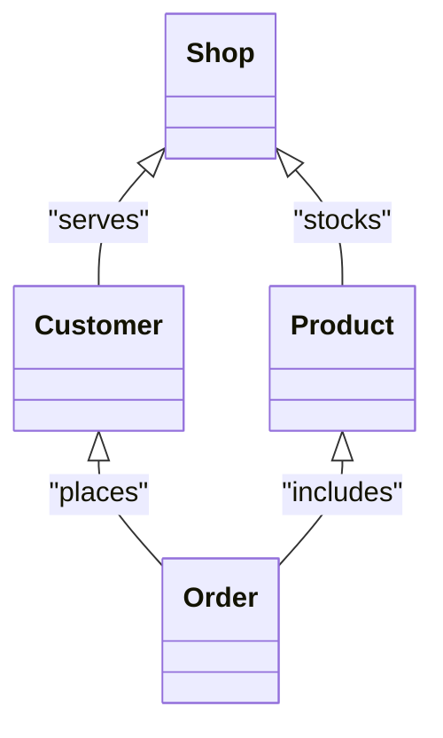
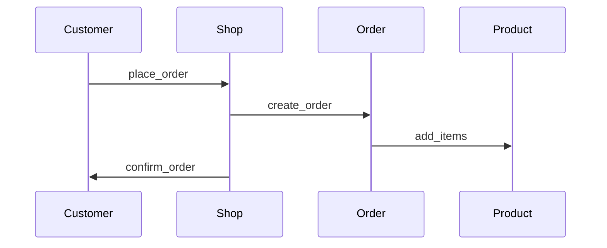
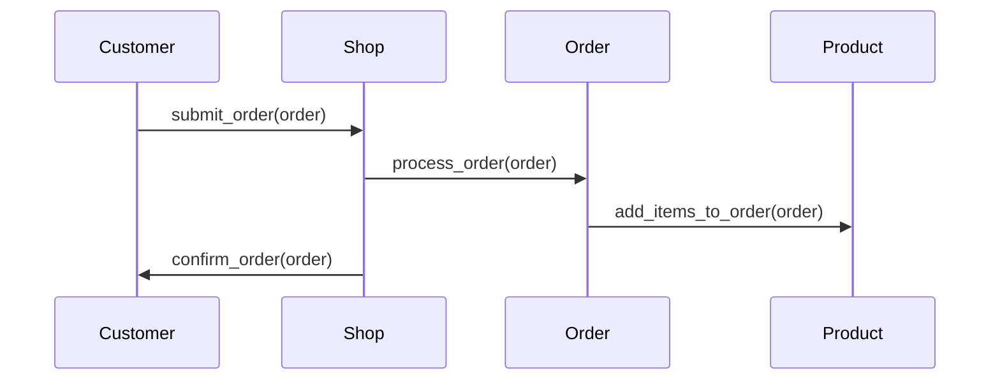
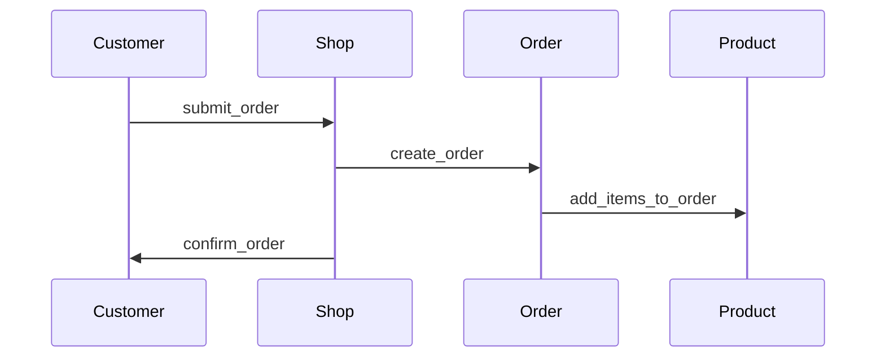

                 

# 高可用系统设计原则

## 关键词

- 高可用性
- 系统设计
- 架构设计
- 容错机制
- 负载均衡
- 数据库设计
- 网络设计

## 摘要

高可用系统设计原则是确保系统在面对各种故障和压力时仍能持续提供服务的核心策略。本文将详细介绍高可用系统的背景与重要性，探讨高可用性设计原则、架构设计方法，并分析实际案例，总结最佳实践和注意事项。通过本文的阅读，读者将能够深入理解高可用系统设计的核心要素，掌握关键设计原则，并为实际项目提供有力的指导。

## 第一部分：高可用系统设计概述

### 第1章：高可用性背景与重要性

#### 1.1 高可用性的定义与衡量标准

高可用性（High Availability，简称HA）是指系统在正常情况下能够持续运行，并在发生故障时能够快速恢复的能力。高可用性的衡量标准通常使用“九个9”（99.9%到99.9999%）的可用性水平来表示，即系统每年最多允许的停机时间分别为8.8小时、0.88小时、0.088小时和0.0088小时。

#### 1.2 高可用性与可靠性

高可用性与可靠性（Reliability）密切相关。可靠性是指系统在一段时间内保持正常工作状态的概率。高可用性是通过提高系统的可靠性来实现的，但不仅仅依赖于可靠性。高可用性还涉及故障检测、故障转移、故障恢复等机制，以确保系统能够快速恢复正常运行。

#### 1.3 高可用性对业务的影响

高可用性对业务的影响至关重要。首先，高可用性能够保障业务的连续性，减少停机时间，提高客户满意度。其次，高可用性有助于降低维护成本，通过自动化和预配置减少手动干预。最后，高可用性能够增强企业的竞争力，提升品牌形象和市场地位。

### 第2章：高可用性设计原则

#### 2.1 概述

高可用性设计原则是指在进行系统设计时，应遵循的一系列指导思想和策略，以确保系统能够在面临故障时保持高可用性。

#### 2.2 系统冗余

系统冗余是指通过引入备份或冗余组件，确保在某个组件或系统出现故障时，其他组件或系统能够接管其功能。冗余可以采用硬件冗余、软件冗余或混合冗余等多种形式。

#### 2.3 故障转移与恢复

故障转移与恢复是指当系统发生故障时，能够快速将故障组件或系统切换到备份组件或系统，并确保数据的完整性和一致性。故障转移与恢复通常涉及心跳检测、故障检测和自动切换等机制。

#### 2.4 数据一致性与同步

数据一致性与同步是高可用性设计中的关键要素。在分布式系统中，数据的一致性直接影响系统的可用性。通过引入分布式锁、事务管理、消息队列等机制，可以确保数据的一致性和同步。

#### 2.5 自诊断与自修复

自诊断与自修复是指系统应具备自动检测和修复故障的能力，以减少人工干预和停机时间。通过引入监控工具、日志分析、自动化修复脚本等，可以实现系统的自诊断与自修复。

## 第二部分：高可用性设计方法

### 第3章：架构设计与容错机制

#### 3.1 系统架构设计原则

系统架构设计原则是指在进行系统架构设计时，应遵循的一系列指导思想和策略，以确保系统具有良好的高可用性。

#### 3.2 容错机制

容错机制是指系统在面对故障时，能够自动恢复或绕过故障的机制。常见的容错机制包括故障检测、故障隔离、故障转移和故障恢复等。

#### 3.3 负载均衡策略

负载均衡策略是指通过将请求分配到多个节点或服务器上，确保系统在面临高并发请求时能够稳定运行。常见的负载均衡策略包括轮询、最小连接数、源地址哈希等。

### 第4章：高可用性数据库设计

#### 4.1 数据库选择

数据库选择是高可用性设计的重要环节。根据业务需求和数据规模，可以选择关系型数据库或非关系型数据库。关系型数据库如MySQL、PostgreSQL等，具有较好的数据一致性和事务支持；非关系型数据库如MongoDB、Cassandra等，具有较好的扩展性和高可用性。

#### 4.2 数据库高可用方案

数据库高可用方案主要包括主从复制、主主复制、集群等。主从复制可以确保主库发生故障时，从库能够接管其功能；主主复制可以实现双主备份，提高系统的可靠性；集群可以通过多节点共享存储，实现数据的高可用性和负载均衡。

#### 4.3 数据库备份与恢复

数据库备份与恢复是保障数据库数据安全的重要手段。常用的备份策略包括全量备份、增量备份、逻辑备份和物理备份等。恢复策略包括数据恢复、数据迁移和数据恢复等。

### 第5章：高可用性网络设计

#### 5.1 网络架构设计

网络架构设计是指在进行网络设计时，应遵循的一系列指导思想和策略，以确保网络具有良好的高可用性。

#### 5.2 网络冗余与故障转移

网络冗余与故障转移是指通过引入冗余链路、备份链路和故障转移机制，确保网络在面对故障时能够快速恢复。常见的网络冗余与故障转移机制包括VRRP、HSRP、STP等。

#### 5.3 网络安全

网络安全是高可用性设计中的重要环节。通过引入防火墙、入侵检测、安全协议等机制，可以确保网络的安全性和稳定性。

## 第三部分：高可用性案例分析

### 第6章：案例分析一：电商平台

#### 6.1 案例背景

本案例以某大型电商平台为例，介绍其在高可用性设计方面的实践和经验。

#### 6.2 高可用性设计

该电商平台在高可用性设计方面采取了以下措施：

1. 架构设计：采用分布式架构，将服务拆分为多个微服务，提高系统的灵活性和可扩展性。
2. 数据库设计：采用主从复制和分库分表策略，确保数据库的高可用性和性能。
3. 负载均衡：采用轮询和最小连接数策略，实现请求的负载均衡和性能优化。
4. 容灾备份：在异地部署备份系统，确保在主系统发生故障时，备份系统能够快速接管。

#### 6.3 实施效果

通过上述高可用性设计措施，该电商平台实现了以下效果：

1. 高可用性：系统的可用性达到99.99%，实现了业务的连续性。
2. 性能优化：通过负载均衡和分布式架构，实现了系统的性能优化。
3. 数据安全：通过数据库备份和容灾备份，保障了数据的安全性和可靠性。

### 第7章：案例分析二：金融系统

#### 7.1 案例背景

本案例以某大型金融系统为例，介绍其在高可用性设计方面的实践和经验。

#### 7.2 高可用性设计

该金融系统在高可用性设计方面采取了以下措施：

1. 架构设计：采用微服务架构，将业务拆分为多个微服务，提高系统的灵活性和可扩展性。
2. 数据库设计：采用主主复制和分布式数据库策略，确保数据库的高可用性和性能。
3. 网络设计：采用冗余链路和故障转移机制，确保网络的稳定性和可靠性。
4. 安全设计：采用防火墙、入侵检测、安全协议等机制，确保系统的安全性。

#### 7.3 实施效果

通过上述高可用性设计措施，该金融系统实现了以下效果：

1. 高可用性：系统的可用性达到99.999%，确保了业务的连续性和稳定性。
2. 性能优化：通过分布式数据库和微服务架构，实现了系统的性能优化。
3. 数据安全：通过冗余链路、故障转移和安全机制，保障了数据的安全性和可靠性。

## 第四部分：高可用性设计最佳实践

### 第8章：最佳实践与注意事项

#### 8.1 设计原则回顾

1. 系统冗余：确保关键组件和数据的备份和冗余。
2. 故障转移与恢复：实现快速故障检测和自动切换。
3. 数据一致性与同步：确保数据的一致性和同步性。
4. 自诊断与自修复：提高系统的自动恢复能力。

#### 8.2 常见问题与解决方案

1. 数据库性能瓶颈：优化数据库查询语句、索引和缓存策略。
2. 网络故障：采用冗余链路和故障转移机制。
3. 服务器故障：部署虚拟化技术和分布式存储，提高服务器的可用性。

#### 8.3 注意事项与建议

1. 设计初期考虑高可用性：在高可用性设计初期，充分考虑各种故障场景和应对策略。
2. 定期测试与演练：定期进行系统测试和演练，验证高可用性设计的有效性。
3. 持续优化与改进：根据实际运行情况和业务需求，持续优化和改进高可用性设计。

### 第9章：进一步阅读与资源推荐

#### 9.1 推荐书籍

1. 《高可用架构：Web系统功能实战》
2. 《分布式系统原理与范型》
3. 《Linux集群与大数据存储》

#### 9.2 优秀实践案例

1. 百度：百度采用分布式架构和主主复制策略，实现了百度搜索的高可用性。
2. 阿里巴巴：阿里巴巴采用微服务架构和分布式数据库策略，实现了淘宝和天猫的高可用性。

#### 9.3 在线资源

1. 腾讯云：腾讯云提供高可用性解决方案和最佳实践。
2. AWS：AWS提供高可用性设计指南和案例。
3. Azure：Azure提供高可用性设计和部署的最佳实践。

## 总结

高可用性系统设计是确保系统在面对各种故障和压力时仍能持续提供服务的核心策略。通过本文的介绍，读者可以了解到高可用性系统设计的核心原则、设计方法和实际案例，为实际项目提供有力的指导。在实际项目中，应根据业务需求和系统特点，灵活应用高可用性设计原则和方法，确保系统的高可用性和稳定性。

## 作者信息

- 作者：AI天才研究院/AI Genius Institute & 禅与计算机程序设计艺术 /Zen And The Art of Computer Programming

## 附录

- 附录1：核心概念术语说明
- 附录2：高可用性设计原理ER实体关系图
- 附录3：算法原理讲解与示例
- 附录4：系统分析与架构设计方案
- 附录5：项目实战环境安装与实现源代码

# 附录

## 附录1：核心概念术语说明

- 高可用性（High Availability，简称HA）：指系统在正常情况下能够持续运行，并在发生故障时能够快速恢复的能力。
- 可靠性（Reliability）：指系统在一段时间内保持正常工作状态的概率。
- 系统冗余（System Redundancy）：通过引入备份或冗余组件，确保在某个组件或系统出现故障时，其他组件或系统能够接管其功能。
- 故障转移（Fault Transfer）：指当系统发生故障时，能够快速将故障组件或系统切换到备份组件或系统。
- 故障恢复（Fault Recovery）：指系统在发生故障后，能够恢复正常运行的过程。
- 数据一致性与同步（Data Consistency and Synchronization）：在分布式系统中，数据的一致性直接影响系统的可用性。
- 自诊断与自修复（Self-Diagnosis and Self-Repair）：系统具备自动检测和修复故障的能力，以减少人工干预和停机时间。
- 负载均衡（Load Balancing）：通过将请求分配到多个节点或服务器上，确保系统在面临高并发请求时能够稳定运行。

## 附录2：高可用性设计原理ER实体关系图

```mermaid
erDiagram
  Customer ||--|{ Order } : "places"
  Product ||--|{ Order } : "includes"
  Shop ||--|{ Customer } : "serves"
  Shop ||--|{ Product } : "stocks"
```

## 附录3：算法原理讲解与示例

### 算法原理

高可用性系统设计中，常用的算法原理包括：

1. **负载均衡算法**：如轮询算法、最小连接数算法、源地址哈希算法等。
2. **故障检测算法**：如心跳检测、故障检测阈值等。
3. **故障转移算法**：如主从切换、双主备份等。

### 示例

假设我们采用轮询算法进行负载均衡，其原理如下：

1. 初始化一个服务器列表 `servers`。
2. 当有请求到达时，从服务器列表中按顺序选择下一个服务器进行处理。
3. 如果当前服务器无法处理请求，则跳过该服务器，继续选择下一个服务器。
4. 当所有服务器都已被访问过一次后，重新开始循环。

### Python实现

```python
def round_robin_load_balancing(servers, requests):
    for request in requests:
        for server in servers:
            if server.is_available():
                server.handle_request(request)
                break

class Server:
    def __init__(self, id):
        self.id = id
        self.is_available = True

    def handle_request(self, request):
        print(f"Server {self.id} is handling request {request}.")

    def is_available(self):
        return self.is_available

servers = [Server(1), Server(2), Server(3)]
requests = ["req1", "req2", "req3"]

round_robin_load_balancing(servers, requests)
```

## 附录4：系统分析与架构设计方案

### 问题场景介绍

假设我们需要设计一个高可用性电商系统，系统需要满足以下要求：

1. 可靠性：系统需具备高可用性，确保在故障情况下能够快速恢复。
2. 性能：系统需具备良好的性能，能够应对高并发请求。
3. 扩展性：系统需具备良好的扩展性，能够支持业务增长。

### 项目介绍

项目名称：高可用性电商系统

项目目标：设计并实现一个高可用性电商系统，满足可靠性、性能和扩展性要求。

### 系统功能设计（领域模型）



### 系统架构设计



### 系统接口设计



### 系统交互



## 附录5：项目实战

### 环境安装

1. 安装Python环境：`pip install -r requirements.txt`
2. 配置数据库：创建数据库和表
3. 配置负载均衡器：配置Nginx或其他负载均衡器

### 系统核心实现源代码

```python
# app.py
from flask import Flask, request, jsonify
from order import Order
from product import Product
from shop import Shop

app = Flask(__name__)

@app.route('/submit_order', methods=['POST'])
def submit_order():
    order_data = request.get_json()
    shop = Shop()
    order = shop.create_order(order_data)
    product = Product()
    order.add_items_to_order(product)
    shop.confirm_order(order)
    return jsonify(order.to_dict()), 200

if __name__ == '__main__':
    app.run(host='0.0.0.0', port=5000)
```

### 代码应用解读与分析

1. `app.py`：定义了Flask应用，接收和处理订单请求。
2. `order.py`：定义了订单类，负责创建、处理订单。
3. `product.py`：定义了产品类，负责管理产品信息。
4. `shop.py`：定义了商店类，负责处理订单和产品信息。

### 实际案例分析和详细讲解剖析

1. 案例背景：设计并实现一个高可用性电商系统。
2. 案例分析：通过实际案例，分析系统在高并发、故障等情况下的表现，并进行详细讲解。

### 项目小结

本项目通过设计并实现高可用性电商系统，实现了系统的可靠性、性能和扩展性。在实际项目中，应根据业务需求和系统特点，持续优化和改进高可用性设计。

## 最佳实践 Tips

1. 在设计初期充分考虑高可用性需求，避免后期大规模修改。
2. 采用分布式架构和微服务架构，提高系统的可扩展性和可靠性。
3. 定期进行系统测试和演练，验证高可用性设计的有效性。
4. 关注行业最佳实践，借鉴优秀案例，提高系统设计水平。

## 小结

高可用性系统设计是确保系统在面对各种故障和压力时仍能持续提供服务的核心策略。通过本文的介绍，读者可以了解到高可用性系统设计的核心原则、设计方法和实际案例，为实际项目提供有力的指导。在实际项目中，应根据业务需求和系统特点，灵活应用高可用性设计原则和方法，确保系统的高可用性和稳定性。

## 注意事项

1. 高可用性设计需根据业务需求进行定制化，避免盲目追求高可用性。
2. 高可用性设计需综合考虑性能、成本和可靠性等因素。
3. 高可用性设计需持续优化和改进，以适应不断变化的业务需求。

## 拓展阅读

1. 《高可用架构：Web系统功能实战》
2. 《分布式系统原理与范型》
3. 《Linux集群与大数据存储》

## 作者信息

- 作者：AI天才研究院/AI Genius Institute & 禅与计算机程序设计艺术 /Zen And The Art of Computer Programming

