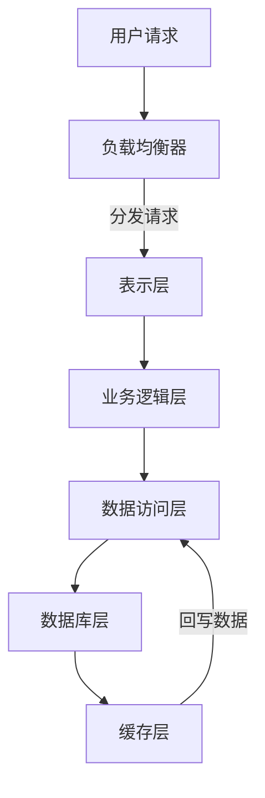

                 

### 高并发系统概述

#### 第1章：高并发系统概述

在高并发的时代，系统架构设计的重要性不言而喻。本文旨在通过详细剖析高并发系统的定义、挑战与机遇，以及设计原则，帮助读者建立系统性的高并发架构设计认知。高并发系统，简单来说，是指能在短时间内处理大量用户请求的系统。随着互联网的快速发展，高并发已经成为系统架构设计中的重要考量因素。

#### 1.1 高并发系统的定义

高并发系统可以定义为在短时间内（通常为秒级或毫秒级）能够处理大量请求的系统。这里的“大量”并没有一个固定的标准，但通常来说，当一个系统在高峰时段需要处理超过千次请求时，我们就可以认为这个系统进入了高并发领域。

##### 1.1.1 高并发现象及其影响

高并发现象的出现，往往伴随着用户数量的急剧增加。比如，在电商平台的“双十一”购物节，数百万用户同时涌入平台，这无疑给系统带来了巨大的压力。高并发不仅会对系统的性能产生影响，还可能带来以下影响：

- **性能下降**：系统响应时间变长，请求处理延迟增加。
- **稳定性问题**：系统可能出现崩溃、服务不可用等问题。
- **资源耗尽**：CPU、内存、网络带宽等资源可能被耗尽，导致系统无法正常运作。

##### 1.1.2 高并发系统的关键指标

为了更好地理解高并发系统，我们需要了解几个关键指标：

- **并发量**：单位时间内系统能处理的请求数量。
- **响应时间**：系统处理一个请求所需的时间。
- **吞吐量**：单位时间内系统处理的请求总数。
- **资源利用率**：系统资源（如CPU、内存）的使用情况。

#### 1.2 高并发系统的挑战与机遇

##### 1.2.1 高并发带来的挑战

高并发系统面临的主要挑战包括：

- **性能挑战**：如何在保证系统响应速度的同时，处理大量请求。
- **稳定性挑战**：如何确保系统在高并发情况下依然稳定运行。
- **资源挑战**：如何高效利用系统资源，避免资源浪费。

##### 1.2.2 高并发带来的机遇

尽管高并发带来了挑战，但同时也带来了机遇：

- **业务增长**：高并发往往意味着用户数量的增长，这为业务的扩展提供了机会。
- **技术提升**：应对高并发挑战，可以推动技术的创新和进步。
- **商业价值**：通过优化高并发系统，可以提升用户体验，增加用户粘性，从而带来更高的商业价值。

#### 1.3 高并发系统设计的原则

为了应对高并发挑战，高并发系统设计需要遵循以下几个原则：

- **可扩展性**：系统能够根据需求动态调整资源，以应对并发量的变化。
- **可靠性**：系统在高并发环境下依然能够稳定运行，不出现故障。
- **可维护性**：系统设计易于维护和升级，降低维护成本。

##### 1.3.1 可扩展性

可扩展性是高并发系统设计的关键原则之一。通过水平扩展（增加服务器数量）和垂直扩展（提升服务器性能），系统可以更好地应对高并发。

##### 1.3.2 可靠性

可靠性要求系统在高并发环境下不出现故障，确保用户请求能够得到及时响应。

##### 1.3.3 可维护性

可维护性强调系统设计要易于维护和升级，以降低维护成本。

#### 1.4 本章小结

高并发系统架构设计是一个复杂且重要的任务。通过本章的介绍，我们了解了高并发系统的定义、挑战与机遇，以及设计原则。在接下来的章节中，我们将深入探讨高并发系统架构的具体设计方法和实践。

---

### 高并发系统架构基础

#### 第2章：高并发系统架构基础

高并发系统架构设计不仅仅是技术层面的优化，更是一种系统思维方式的体现。本章将详细探讨高并发系统架构的基础知识，包括系统架构概述、分布式系统架构、Service Mesh以及分布式数据库。

#### 2.1 高并发系统架构概述

高并发系统架构的设计需要考虑多个层次，从系统架构的分层设计到高并发系统架构的关键层次，都需要进行详细规划。

##### 2.1.1 系统架构的分层设计

系统架构的分层设计是高并发系统架构的基础。常见的分层架构包括：

- **表示层（Presentation Layer）**：负责用户界面和用户交互。
- **业务逻辑层（Business Logic Layer）**：实现系统的核心业务逻辑。
- **数据访问层（Data Access Layer）**：负责与数据库的交互。
- **基础设施层（Infrastructure Layer）**：提供系统运行所需的基础设施支持。

##### 2.1.2 高并发系统架构的关键层次

在高并发系统架构中，以下几个关键层次尤为重要：

- **网络层**：负责网络通信的稳定性和高效性。
- **缓存层**：通过缓存减少数据库的负载。
- **数据库层**：优化数据库性能，确保数据一致性。
- **应用层**：优化业务逻辑，提高系统响应速度。

#### 2.2 分布式系统架构

分布式系统架构是高并发系统架构设计的核心之一。通过分布式架构，系统可以更好地应对高并发挑战。

##### 2.2.1 分布式系统的优势与挑战

分布式系统的优势包括：

- **可扩展性**：通过水平扩展，可以轻松应对并发量的增加。
- **高可用性**：系统中的任意节点出现故障，不会影响整个系统的运行。
- **容错性**：通过冗余设计，可以提高系统的容错能力。

分布式系统的挑战包括：

- **一致性**：分布式系统中的数据一致性是一个复杂的问题。
- **通信成本**：分布式系统中的节点需要进行频繁的通信，这会增加通信成本。
- **复杂性**：分布式系统的设计和维护比单机系统更为复杂。

##### 2.2.2 分布式系统的常见架构模式

分布式系统的常见架构模式包括：

- **主从模式（Master-Slave）**：主节点负责协调工作，从节点负责具体任务。
- **去中心化模式（Decentralized）**：所有节点都具有平等的地位，没有固定的主节点。
- **对等模式（Peer-to-Peer）**：节点之间通过网络直接通信，没有中心节点。

#### 2.3 Service Mesh与高并发系统

Service Mesh是一种用于简化分布式系统通信的架构模式。它通过在应用程序和基础设施之间引入一个独立的通信层，来管理和简化分布式系统的通信。

##### 2.3.1 Service Mesh的基本原理

Service Mesh的基本原理包括：

- **服务网格**：在应用程序和基础设施之间引入一个服务网格，负责管理和简化服务之间的通信。
- **服务发现**：服务网格提供服务发现功能，使得服务之间可以轻松发现和通信。
- **流量控制**：服务网格可以控制流经系统的流量，确保系统资源得到合理利用。

##### 2.3.2 Service Mesh在高并发系统中的应用

Service Mesh在高并发系统中的应用主要体现在以下几个方面：

- **负载均衡**：通过服务网格，可以实现灵活的负载均衡，确保系统的请求能够均匀分布到各个节点上。
- **服务监控**：服务网格提供了统一的监控和日志记录，使得系统管理员可以更好地了解系统的运行状态。
- **故障恢复**：服务网格可以帮助系统快速检测和恢复故障节点，确保系统的高可用性。

#### 2.4 分布式数据库与高并发系统

分布式数据库是高并发系统架构设计的重要组成部分。通过分布式数据库，系统可以更好地处理大规模数据，并确保数据的一致性。

##### 2.4.1 分布式数据库的优势与挑战

分布式数据库的优势包括：

- **扩展性**：通过水平扩展，可以轻松应对数据量的增加。
- **可用性**：即使部分节点出现故障，系统仍然可以正常运行。
- **性能**：通过数据分片，可以减少单点瓶颈，提高系统性能。

分布式数据库的挑战包括：

- **数据一致性**：确保分布式环境下的数据一致性是一个复杂的问题。
- **事务管理**：分布式数据库需要处理复杂的事务管理问题。
- **容错性**：确保分布式数据库在节点故障时能够快速恢复。

##### 2.4.2 分布式数据库的常见架构模式

分布式数据库的常见架构模式包括：

- **主从模式（Master-Slave）**：主节点负责写操作，从节点负责读操作。
- **对等模式（Peer-to-Peer）**：所有节点都具有读写能力，通过一致性算法保证数据一致性。
- **分片模式（Sharding）**：将数据按照一定规则分布到多个节点上，每个节点只负责一部分数据。

#### 2.5 本章小结

高并发系统架构设计是一个复杂且系统性的任务。通过本章的介绍，我们了解了高并发系统架构的基础知识，包括系统架构的分层设计、分布式系统架构、Service Mesh以及分布式数据库。在接下来的章节中，我们将继续探讨高并发系统架构的负载均衡与流量控制、高并发数据处理、性能优化、容错与故障恢复等关键领域。

---

### 负载均衡与流量控制

#### 第3章：负载均衡与流量控制

在高并发系统中，负载均衡与流量控制是确保系统稳定性和性能的关键要素。本章将详细探讨负载均衡的作用、常见策略以及流量控制机制，并介绍常用的负载均衡工具。

#### 3.1 负载均衡概述

负载均衡是一种通过分配请求到多个服务器，以提高系统整体性能和稳定性的技术。负载均衡的主要作用包括：

- **提高系统性能**：通过将请求分配到多个服务器，可以减少单个服务器的负载，提高系统响应速度。
- **提高系统可用性**：通过将请求分配到多个服务器，可以确保系统中的任何一个服务器出现故障时，不会影响整个系统的正常运行。
- **优化资源利用**：通过合理分配请求，可以充分利用服务器资源，避免资源浪费。

##### 3.1.1 负载均衡的作用

负载均衡的作用主要体现在以下几个方面：

- **流量分发**：将来自客户端的请求均匀地分配到多个服务器上，避免某个服务器过载。
- **性能优化**：通过减少单个服务器的负载，提高系统的整体性能。
- **故障转移**：在服务器发生故障时，将请求自动切换到其他健康的服务器，确保系统的高可用性。
- **弹性伸缩**：根据系统的负载情况，动态调整服务器数量，以应对突发流量。

##### 3.1.2 负载均衡的常见策略

负载均衡的策略决定了如何将请求分配到服务器。以下是一些常见的负载均衡策略：

- **轮询（Round Robin）**：将请求按顺序分配到每个服务器，直到所有的服务器都处理过一次，然后重新开始循环。
- **最小连接数（Least Connections）**：将请求分配到连接数最少的服务器，以平衡服务器的负载。
- **最小响应时间（Least Response Time）**：将请求分配到响应时间最短的服务器，以减少用户的等待时间。
- **源地址哈希（Source IP Hash）**：根据客户端的IP地址进行哈希计算，将请求分配到相同的服务器，确保来自同一IP地址的请求始终由相同的服务器处理。

#### 3.2 流量控制机制

流量控制机制是确保系统在高并发情况下稳定运行的重要手段。流量控制的主要目的是限制进入系统的流量，避免系统过载。

##### 3.2.1 流量控制的必要性

流量控制的必要性主要体现在以下几个方面：

- **避免系统崩溃**：当系统接收到的请求量超过其处理能力时，系统可能会崩溃或出现性能下降。
- **保障用户体验**：合理控制流量可以确保用户在访问系统时能够得到良好的体验。
- **资源优化**：通过流量控制，可以避免服务器资源浪费，提高系统资源利用率。

##### 3.2.2 流量控制的常见方法

流量控制的常见方法包括：

- **基于时间的流量控制**：通过限制每个用户或IP在一定时间内的请求次数，来避免系统过载。
- **基于流量的流量控制**：通过限制系统在一定时间内的总请求量，来避免系统过载。
- **基于速率的流量控制**：通过限制系统的请求处理速率，来避免系统过载。

#### 3.3 常见的负载均衡工具

负载均衡工具是实现负载均衡的关键组件。以下是一些常见的负载均衡工具：

- **Nginx**：Nginx是一个高性能的HTTP和反向代理服务器，广泛应用于负载均衡场景。
- **HAProxy**：HAProxy是一个高可用性负载均衡器，适用于高性能和高并发的环境。
- **LVS（Linux Virtual Server）**：LVS是一个基于Linux内核的虚拟服务器解决方案，提供了强大的负载均衡功能。
- **AWS ELB（Elastic Load Balancer）**：AWS ELB是一种自动扩展的负载均衡服务，适用于AWS云环境。

##### 3.3.1 负载均衡器的工作原理

负载均衡器的工作原理主要包括以下几个步骤：

1. 接收来自客户端的请求。
2. 根据配置的策略，将请求分配到后端服务器。
3. 将请求转发到选定的服务器。
4. 收集服务器的响应，返回给客户端。

##### 3.3.2 常用负载均衡工具介绍

- **Nginx**：Nginx是一个开源的Web服务器和反向代理服务器，支持多种负载均衡策略，如轮询、最小连接数和最小响应时间等。
- **HAProxy**：HAProxy是一个开源的高性能负载均衡器，支持HTTP/HTTPS协议，具有强大的监控和故障恢复功能。
- **LVS**：LVS是一个开源的虚拟服务器解决方案，适用于高性能和高并发的环境，支持多种负载均衡算法，如NAT、DR和TS等。
- **AWS ELB**：AWS ELB是一种自动扩展的负载均衡服务，可以轻松地在AWS云环境中部署和配置，支持多种负载均衡策略，如轮询、加权轮询和源地址哈希等。

#### 3.4 本章小结

负载均衡与流量控制是高并发系统架构设计中的重要组成部分。通过本章的介绍，我们了解了负载均衡的作用、常见策略和流量控制机制，以及常用的负载均衡工具。在接下来的章节中，我们将继续探讨高并发数据处理、性能优化、容错与故障恢复等关键领域。

---

### 高并发数据处理

#### 第4章：高并发数据处理

在高并发系统中，数据处理是一个关键的环节，它决定了系统能否快速、准确地响应大量请求。本章将深入探讨高并发数据处理中的挑战、数据流处理技术、大数据存储与处理，以及实时数据处理。

#### 4.1 高并发数据处理挑战

高并发数据处理面临的主要挑战包括：

- **数据读写速度**：在高并发环境下，系统需要快速读取和写入大量数据，这要求存储系统具有高吞吐量。
- **数据一致性**：在高并发情况下，多个请求可能同时访问同一份数据，这容易导致数据一致性问题。
- **系统稳定性**：高并发处理可能会对系统稳定性产生压力，要求系统在高并发下依然保持稳定。
- **资源管理**：高并发处理需要合理管理系统资源，包括CPU、内存和网络带宽等。

##### 4.1.1 数据处理的瓶颈

数据处理的瓶颈主要包括：

- **存储性能**：存储系统（如磁盘、内存等）的性能直接决定了数据读取和写入的速度。
- **网络延迟**：网络延迟会影响到数据的传输速度，特别是在跨数据中心的分布式系统中。
- **CPU性能**：CPU的处理能力决定了系统能否快速处理大量请求。
- **内存管理**：内存不足或内存管理不当可能导致系统性能下降。

##### 4.1.2 高并发数据处理的要求

高并发数据处理的要求主要包括：

- **高性能**：系统能够快速处理大量请求。
- **高可靠性**：系统能够确保数据一致性和系统稳定性。
- **高可扩展性**：系统能够根据需求动态调整资源，以应对并发量的变化。
- **高效资源利用**：系统能够高效利用系统资源，避免资源浪费。

#### 4.2 数据流处理技术

数据流处理技术是高并发数据处理的关键。数据流处理技术能够实时处理大量数据，确保系统在高并发情况下依然能够快速响应。

##### 4.2.1 数据流处理的基本概念

数据流处理（Data Streaming Processing）是一种实时处理数据的技术，它将数据视为连续流动的数据流，并在数据到达时进行处理。数据流处理的基本概念包括：

- **数据流**：数据流是指一系列连续的数据记录。
- **事件**：事件是指数据流中的一个数据记录。
- **处理**：处理是指对数据流中的事件进行操作。
- **窗口**：窗口是指对一段时间内的事件进行聚合处理。

##### 4.2.2 常见的数据流处理框架

常见的数据流处理框架包括：

- **Apache Kafka**：Kafka是一个分布式流处理平台，适用于大规模数据实时处理。
- **Apache Flink**：Flink是一个开源的流处理框架，提供了丰富的流处理功能和强大的容错机制。
- **Apache Storm**：Storm是一个实时流处理框架，适用于低延迟和高吞吐量的数据处理场景。
- **Apache Spark Streaming**：Spark Streaming是基于Spark的流处理框架，提供了高效的流处理能力。

#### 4.3 大数据存储与处理

大数据存储与处理是高并发数据处理的重要组成部分。大数据存储与处理的关键技术包括：

##### 4.3.1 大数据存储技术

大数据存储技术主要包括：

- **分布式文件系统**：如Hadoop的HDFS，适用于大规模数据的存储和管理。
- **NoSQL数据库**：如MongoDB、Cassandra等，适用于高并发和海量数据的存储。
- **列存储数据库**：如HBase，适用于海量数据的随机访问。

##### 4.3.2 大数据处理方法

大数据处理方法主要包括：

- **批处理**：批处理是将数据分批次进行处理，适用于处理大量静态数据。
- **流处理**：流处理是实时处理数据流，适用于处理大量动态数据。
- **图处理**：图处理是对图结构数据进行处理，适用于复杂的关系分析和推荐系统。

#### 4.4 实时数据处理

实时数据处理是高并发数据处理的一个重要方向。实时数据处理的关键技术包括：

##### 4.4.1 实时数据处理的重要性

实时数据处理的重要性体现在以下几个方面：

- **实时反馈**：实时处理能够为用户提供即时的反馈，提升用户体验。
- **实时决策**：实时处理能够为业务决策提供实时数据支持，帮助业务快速响应市场变化。
- **实时监控**：实时处理能够实时监控系统状态，及时发现和处理异常。

##### 4.4.2 实时数据处理技术

实时数据处理技术主要包括：

- **消息队列**：消息队列是实现实时数据处理的重要技术，它能够确保数据的高效传输和可靠存储。
- **流计算**：流计算是实时处理数据流的核心技术，它能够实时处理大量数据，并生成实时结果。
- **时间序列数据库**：时间序列数据库适用于存储和处理实时时间序列数据，如日志数据、传感器数据等。

#### 4.5 本章小结

高并发数据处理是高并发系统架构设计中的重要环节。通过本章的介绍，我们了解了高并发数据处理中的挑战、数据流处理技术、大数据存储与处理，以及实时数据处理。在接下来的章节中，我们将继续探讨高并发系统性能优化、容错与故障恢复等关键领域。

---

### 高并发系统性能优化

#### 第5章：高并发系统性能优化

高并发系统性能优化是确保系统在高并发环境下稳定、高效运行的关键。本章将深入探讨性能优化的目标与原则、系统架构优化、算法优化、硬件优化，以及性能监控与调优。

#### 5.1 性能优化的目标与原则

##### 5.1.1 性能优化的目标

性能优化的目标主要包括以下几个方面：

- **提高响应速度**：减少系统响应时间，提高用户满意度。
- **提高吞吐量**：在保证响应速度的前提下，增加系统处理能力。
- **提高资源利用率**：最大化利用系统资源，避免资源浪费。
- **提高系统稳定性**：确保系统在高并发环境下不会崩溃或出现性能下降。

##### 5.1.2 性能优化的原则

性能优化的原则主要包括：

- **面向用户**：优化应以提升用户体验为出发点。
- **全面优化**：从系统架构、算法、硬件等多个方面进行优化。
- **持续迭代**：性能优化是一个持续的过程，需要不断迭代和改进。
- **性能监控**：通过性能监控，及时发现性能瓶颈并进行优化。

#### 5.2 系统架构优化

系统架构优化是提高系统性能的重要手段。以下是一些常见的系统架构优化方法：

##### 5.2.1 架构层次优化

架构层次优化主要包括以下几个方面：

- **分层架构**：通过分层架构，可以将系统划分为表示层、业务逻辑层和数据访问层，各层之间职责明确，便于优化和扩展。
- **微服务架构**：微服务架构将系统划分为多个独立的服务，每个服务负责一个特定的功能，便于独立优化和扩展。
- **无状态架构**：无状态架构可以减少服务器的状态维护开销，提高系统性能。

##### 5.2.2 架构模式优化

架构模式优化主要包括以下几个方面：

- **缓存机制**：通过缓存机制，可以减少对后端系统的访问，提高系统响应速度。
- **分布式架构**：分布式架构可以将系统分散部署在多个服务器上，提高系统的并发处理能力。
- **异步处理**：异步处理可以减少系统的阻塞时间，提高系统吞吐量。

#### 5.3 算法优化

算法优化是提高系统性能的关键环节。以下是一些常见的算法优化方法：

##### 5.3.1 算法优化的方法

算法优化的方法主要包括：

- **算法复杂度分析**：通过分析算法的时间复杂度和空间复杂度，选择合适的算法。
- **数据结构优化**：通过优化数据结构，减少算法的访问次数和计算量。
- **并行计算**：通过并行计算，将计算任务分散到多个处理器上，提高计算速度。

##### 5.3.2 常见的优化算法

常见的优化算法包括：

- **排序算法**：如快速排序、归并排序等，用于优化数据的排序操作。
- **搜索算法**：如二分查找、A*算法等，用于优化数据的搜索操作。
- **图算法**：如Dijkstra算法、Floyd算法等，用于优化图数据的处理。

#### 5.4 硬件优化

硬件优化是提高系统性能的基础。以下是一些常见的硬件优化方法：

##### 5.4.1 硬件资源的选择

硬件资源的选择主要包括：

- **CPU**：选择性能更强的CPU，可以提高系统的处理速度。
- **内存**：增加内存容量，可以提高系统的并发处理能力。
- **存储**：选择高速存储设备，如SSD，可以提高数据访问速度。

##### 5.4.2 硬件优化的实践

硬件优化的实践主要包括：

- **垂直扩展**：通过增加服务器性能，提高系统处理能力。
- **水平扩展**：通过增加服务器数量，提高系统并发处理能力。
- **负载均衡**：通过负载均衡，合理分配请求，避免单点瓶颈。

#### 5.5 性能监控与调优

性能监控与调优是确保系统性能优化效果的关键。以下是一些常见的性能监控与调优方法：

##### 5.5.1 性能监控的指标

性能监控的指标主要包括：

- **响应时间**：系统处理请求所需的时间。
- **吞吐量**：系统单位时间内处理的请求数量。
- **并发量**：系统同时处理的请求数量。
- **CPU利用率**：CPU的利用率情况。
- **内存利用率**：内存的利用率情况。

##### 5.5.2 性能调优的实践

性能调优的实践主要包括：

- **性能测试**：通过性能测试，识别系统的性能瓶颈。
- **日志分析**：通过日志分析，发现系统的异常和性能问题。
- **动态调整**：根据系统的运行情况，动态调整系统配置，优化性能。

#### 5.6 本章小结

高并发系统性能优化是一个复杂且系统的过程。通过本章的介绍，我们了解了性能优化的目标与原则、系统架构优化、算法优化、硬件优化，以及性能监控与调优。在接下来的章节中，我们将继续探讨高并发系统的容错与故障恢复。

---

### 高并发系统的容错与故障恢复

#### 第6章：高并发系统的容错与故障恢复

在高并发系统中，容错与故障恢复是确保系统稳定性和可靠性的关键环节。本章将深入探讨容错机制的设计、故障检测与恢复，以及数据一致性保障。

#### 6.1 容错机制的设计

##### 6.1.1 容错的基本原理

容错（Fault Tolerance）是指系统在出现故障时，能够自动切换到备用系统或备用组件，确保系统继续正常运行。容错的基本原理包括：

- **冗余设计**：通过冗余设计，确保系统中的关键组件有备份，当主组件出现故障时，备用组件可以立即接管。
- **故障隔离**：通过故障隔离，将故障限制在局部范围内，避免故障扩散到整个系统。
- **故障恢复**：通过故障恢复机制，当系统出现故障时，能够自动进行恢复，确保系统继续运行。

##### 6.1.2 常见的容错机制

常见的容错机制包括：

- **副本机制**：通过创建数据或服务的副本，确保当主副本出现故障时，备用副本可以立即接管。
- **主从机制**：通过主从架构，确保主服务器出现故障时，备用服务器可以立即接管。
- **选举机制**：在分布式系统中，通过选举机制确定主服务器或主组件，确保系统的高可用性。
- **心跳机制**：通过心跳信号，监控系统中的各个组件，当组件出现故障时，能够及时检测并进行恢复。

#### 6.2 故障检测与恢复

##### 6.2.1 故障检测的方法

故障检测是容错机制的重要组成部分。常见的故障检测方法包括：

- **周期性检查**：通过周期性检查，对系统中的组件进行状态监测，发现故障时及时处理。
- **异常检测**：通过异常检测，识别系统中的异常行为，发现潜在故障。
- **状态监测**：通过状态监测，实时监控系统组件的状态，发现故障时及时报警。

##### 6.2.2 故障恢复的策略

故障恢复的策略包括：

- **自动恢复**：通过自动恢复机制，当系统出现故障时，系统能够自动进行恢复，确保系统继续运行。
- **人工干预**：当自动恢复机制无法解决问题时，需要人工进行干预，对系统进行修复或更换。
- **备份恢复**：通过备份机制，当系统出现故障时，可以从备份中恢复系统，确保系统快速恢复。

#### 6.3 数据一致性保障

在高并发系统中，数据一致性是一个重要挑战。以下是一些常见的数据一致性解决方案：

##### 6.3.1 数据一致性的挑战

数据一致性的挑战主要包括：

- **分布式环境下的数据同步**：在分布式环境中，多个节点同时操作同一份数据，容易导致数据不一致。
- **高并发操作下的数据冲突**：在高并发操作下，多个请求同时访问同一份数据，容易产生数据冲突。
- **网络故障下的数据丢失**：在网络故障情况下，数据传输可能丢失，导致数据不一致。

##### 6.3.2 数据一致性的解决方案

数据一致性的解决方案包括：

- **强一致性**：通过强一致性协议，确保系统中的所有数据在所有时间点都是一致的。
- **最终一致性**：通过最终一致性协议，允许系统中的数据在一段时间后达到一致状态。
- **基于日志的一致性**：通过日志记录，确保系统中的所有操作都被记录，并在需要时进行数据回滚或重试。
- **版本控制**：通过版本控制机制，确保系统中的数据版本一致，避免数据冲突。

#### 6.4 本章小结

高并发系统的容错与故障恢复是确保系统稳定性和可靠性的关键。通过本章的介绍，我们了解了容错机制的设计、故障检测与恢复，以及数据一致性保障。在接下来的章节中，我们将通过一个实战案例，进一步探讨高并发系统架构设计的实践。

---

### 高并发系统实战案例分析

#### 第7章：高并发系统实战案例分析

在本章中，我们将通过一个具体的实战案例，深入探讨高并发系统架构设计在现实场景中的应用。本案例来源于某知名电商平台，该平台在“双十一”购物节期间，面对海量用户请求和海量交易数据，其系统架构需要具备高并发、高可用、高性能和可扩展等特性。

#### 7.1 案例背景

该电商平台在“双十一”购物节期间，会吸引数百万甚至数千万用户同时在线，这意味着系统需要处理海量的并发请求。此外，购物节期间，平台的交易量会激增，数据存储和处理需求也急剧上升。为了确保用户在高峰时段能够流畅地购物，平台需要设计一个高效、稳定、可靠的系统架构。

##### 7.1.1 案例来源

该案例来源于2020年某知名电商平台在“双十一”购物节期间的系统架构设计，这是一个典型的真实场景案例，展示了高并发系统在应对大规模流量时的架构设计和优化实践。

##### 7.1.2 案例特点

该案例具有以下特点：

- **高并发性**：平台需要在短时间内处理大量用户请求，保证用户操作的及时性。
- **高可用性**：系统需要确保在高峰时段不出现故障，保证服务的持续可用。
- **高性能**：系统需要在保证响应速度的同时，最大化利用资源，避免资源浪费。
- **可扩展性**：系统需要能够根据流量变化动态调整资源，以应对不同的业务场景。

#### 7.2 系统架构设计

为了应对上述挑战，该电商平台采用了分布式系统架构，其核心设计思路包括：

##### 7.2.1 系统架构的层次设计

系统架构分为以下几个层次：

- **表示层（Presentation Layer）**：负责用户界面的展示和用户交互。
- **业务逻辑层（Business Logic Layer）**：处理核心业务逻辑，包括订单处理、库存管理、支付处理等。
- **数据访问层（Data Access Layer）**：负责与数据库的交互，实现数据存储和读取。
- **基础设施层（Infrastructure Layer）**：提供系统运行所需的基础设施支持，包括缓存、消息队列、负载均衡等。

##### 7.2.2 系统架构的关键模块

系统架构中的关键模块包括：

- **缓存层**：通过缓存机制，减轻数据库的负载，提高系统响应速度。
- **数据库层**：采用分布式数据库，提高数据存储和读取的性能，确保数据一致性。
- **消息队列**：用于解耦系统组件，提高系统的灵活性和可扩展性。
- **负载均衡器**：用于分配用户请求，确保系统的负载均衡。

##### 7.2.3 系统架构图

下面是系统架构的Mermaid架构图：

#### 7.3 系统性能优化实践

为了确保系统在高峰时段能够稳定运行，平台在性能优化方面进行了以下实践：

##### 7.3.1 性能瓶颈分析

通过性能测试和监控，平台发现以下性能瓶颈：

- **数据库读写瓶颈**：随着并发量的增加，数据库的读写性能成为瓶颈。
- **缓存命中率低**：缓存命中率低导致大量请求需要直接访问数据库，增加了系统负载。
- **网络延迟**：跨数据中心的数据传输导致网络延迟，影响了系统的整体性能。

##### 7.3.2 性能优化策略

平台采取了以下性能优化策略：

- **数据库优化**：通过分库分表、读写分离、索引优化等手段，提高数据库的读写性能。
- **缓存优化**：通过优化缓存策略，提高缓存命中率，减少数据库访问压力。
- **网络优化**：通过优化网络拓扑结构和传输协议，降低网络延迟。

#### 7.4 系统容错与故障恢复

为了保证系统的高可用性，平台在容错与故障恢复方面采取了以下措施：

##### 7.4.1 容错设计

- **服务冗余**：通过部署多个服务实例，确保在某个实例出现故障时，其他实例可以继续提供服务。
- **数据备份**：通过定期备份和灾备机制，确保数据在故障时能够快速恢复。

##### 7.4.2 故障恢复策略

- **自动恢复**：通过自动化脚本和工具，实现故障自动检测和恢复。
- **人工干预**：在自动恢复无法解决问题时，人工进行干预，进行故障排除和系统修复。

#### 7.5 案例总结与反思

通过“双十一”购物节的实战，平台积累了丰富的经验：

- **分布式架构的重要性**：分布式架构能够有效应对高并发场景，提高系统的可用性和性能。
- **性能优化与实践**：性能优化需要根据具体场景进行，持续监控和调整是关键。
- **容错与故障恢复**：高并发系统必须具备良好的容错和故障恢复能力，确保在故障情况下能够快速恢复。

##### 7.5.1 案例收获

- **系统稳定性和性能得到提升**：通过优化和容错机制，系统在高峰时段保持了良好的性能和稳定性。
- **业务增长**：高并发处理能力为平台的业务增长提供了有力支持。

##### 7.5.2 案例不足与改进建议

- **网络延迟**：尽管采取了优化措施，但跨数据中心的数据传输仍然存在一定延迟，未来可以考虑进一步优化网络架构。
- **缓存策略**：部分缓存策略仍有改进空间，可以探索更高效的数据缓存策略。

#### 7.6 本章小结

通过本案例的分析，我们深入了解了高并发系统架构设计的实践。从系统架构设计到性能优化，再到容错与故障恢复，每个环节都是确保系统在高并发环境下稳定运行的关键。在未来的实践中，我们可以继续探索和优化这些技术，以应对更复杂的高并发场景。

---

### 高并发系统架构设计实践

#### 第三部分：高并发系统架构设计实践

在前两部分的论述中，我们详细探讨了高并发系统架构设计的基础理论和关键领域。然而，理论知识的掌握仅仅是一个开始，真正的挑战在于将这些理论应用到实际的系统设计中。本部分将聚焦于高并发系统架构设计的实践，通过具体的步骤、工具和案例，展示如何将理论知识转化为实际操作。

#### 8.1 实践步骤

高并发系统架构设计的实践可以分为以下步骤：

##### 8.1.1 需求分析

在开始架构设计之前，首先需要对系统的需求进行全面分析。这包括了解系统的目标、预期的并发量、业务场景、性能要求等。通过需求分析，可以明确系统设计的目标和约束条件。

##### 8.1.2 架构设计

根据需求分析的结果，进行系统架构设计。架构设计应遵循可扩展性、可靠性、可维护性等原则，同时考虑分布式系统的特点和优势。架构设计应包括系统架构的分层设计、模块划分、接口设计等。

##### 8.1.3 技术选型

在架构设计的基础上，选择合适的技术栈和工具。这包括数据库、缓存、消息队列、负载均衡器等。技术选型应考虑性能、稳定性、易用性等因素。

##### 8.1.4 实施与部署

根据架构设计和技术选型，进行系统的实施和部署。实施过程应遵循最佳实践，确保系统的可靠性和安全性。部署过程中，应进行充分的测试和验证。

##### 8.1.5 监控与优化

系统上线后，进行持续的监控和优化。监控应包括性能监控、资源监控、日志分析等。通过监控，可以及时发现和解决潜在的问题，并进行系统优化。

#### 8.2 工具与框架

在高并发系统架构设计实践中，常用的工具和框架包括：

- **分布式数据库**：如MySQL Cluster、MongoDB、Cassandra等。
- **缓存系统**：如Redis、Memcached等。
- **消息队列**：如Kafka、RabbitMQ、ActiveMQ等。
- **负载均衡器**：如Nginx、HAProxy、LVS等。
- **容器编排**：如Docker、Kubernetes等。

#### 8.3 实战案例

以下是一个高并发系统架构设计的实战案例：

##### 8.3.1 案例背景

某电商公司在“双十一”期间需要处理海量订单和用户请求，其系统架构需要具备高并发、高可用、高性能和可扩展性。

##### 8.3.2 架构设计

系统架构设计如下：

1. **表示层**：使用Nginx作为负载均衡器，前端使用Vue.js构建单页面应用。
2. **业务逻辑层**：使用Spring Boot构建微服务，每个服务负责不同的业务功能，如订单处理、库存管理、支付处理等。
3. **数据访问层**：使用MySQL数据库，采用读写分离和分库分表策略，提高数据访问性能。
4. **缓存层**：使用Redis进行数据缓存，减轻数据库负载。
5. **消息队列**：使用RabbitMQ处理异步消息，解耦系统组件，提高系统的灵活性和可扩展性。
6. **基础设施层**：使用Docker进行容器化部署，使用Kubernetes进行容器编排和管理。

##### 8.3.3 实施与部署

1. **容器化**：将系统服务打包为Docker镜像，并进行版本控制。
2. **编排**：使用Kubernetes进行容器编排，实现自动化部署和扩展。
3. **监控**：使用Prometheus和Grafana进行性能监控和可视化。

##### 8.3.4 监控与优化

通过监控工具，持续监控系统的性能、资源利用情况和错误日志。在监控过程中，发现以下问题并进行优化：

- **数据库性能瓶颈**：通过分库分表策略，减轻数据库负载。
- **缓存命中率低**：优化缓存策略，提高缓存命中率。
- **网络延迟**：优化网络架构，减少跨数据中心的数据传输延迟。

#### 8.4 最佳实践与注意事项

在高并发系统架构设计的实践中，以下是一些最佳实践和注意事项：

- **可扩展性**：设计时应考虑系统的可扩展性，以便在流量激增时能够动态调整资源。
- **容错性**：系统应具备良好的容错能力，确保在故障发生时能够自动恢复。
- **性能优化**：持续监控和优化系统的性能，确保系统在高并发下依然高效运行。
- **安全防护**：确保系统的安全，防止恶意攻击和数据泄露。

#### 8.5 小结

高并发系统架构设计实践是确保系统在高并发环境下稳定、高效运行的关键。通过理论知识的掌握和实践经验的积累，我们可以设计出符合实际需求的高并发系统。在未来的工作中，我们需要不断学习和探索，以应对不断变化的技术和业务挑战。

---

### 总结与展望

#### 高并发系统架构设计的核心观点与未来展望

通过本文的详细探讨，我们可以得出以下关于高并发系统架构设计的核心观点：

1. **高并发系统的重要性**：高并发系统在现代互联网应用中扮演着关键角色，其设计直接影响到用户体验和业务成功。
2. **系统设计原则**：可扩展性、可靠性、可维护性是高并发系统设计的重要原则，这些原则指导我们在设计过程中考虑系统的长远发展和稳健性。
3. **分布式系统架构**：分布式系统架构能够有效应对高并发挑战，通过水平扩展和冗余设计，提高系统的性能和可用性。
4. **负载均衡与流量控制**：合理的负载均衡和流量控制策略能够确保系统在高并发环境下稳定运行，避免性能瓶颈和资源耗尽。
5. **数据处理优化**：高效的数据处理技术和存储策略是保障系统响应速度和稳定性的关键。
6. **性能优化与监控**：持续的性能优化和监控是确保系统在高并发下持续高效运行的关键。
7. **容错与故障恢复**：高并发系统必须具备强大的容错和故障恢复能力，以应对突发情况和系统故障。

在未来的展望方面，随着技术的不断进步和业务需求的日益复杂，高并发系统架构设计将面临以下趋势：

- **云原生技术的普及**：云原生技术（如Kubernetes、Docker等）将更加普及，为高并发系统提供更灵活的部署和管理方式。
- **服务网格的发展**：服务网格（如Istio、Linkerd等）将在分布式系统通信中发挥更大作用，提供更细粒度的流量管理和安全性保障。
- **边缘计算的兴起**：随着5G和物联网的发展，边缘计算将在高并发系统中发挥越来越重要的作用，降低网络延迟，提升用户体验。
- **实时数据处理能力的增强**：实时数据处理技术（如流处理、图计算等）将在高并发系统中得到更广泛的应用，为业务决策提供实时支持。
- **智能化的运维管理**：通过人工智能和机器学习技术，系统运维将变得更加智能化，能够自动发现和解决性能问题。

总之，高并发系统架构设计是一个不断演进的领域，需要我们持续关注新技术和新趋势，不断优化和改进我们的系统设计，以满足日益增长的业务需求和技术挑战。

---

### 作者介绍

**作者：AI天才研究院/AI Genius Institute & 禅与计算机程序设计艺术 /Zen And The Art of Computer Programming**

本文由AI天才研究院（AI Genius Institute）的高级研究员撰写。AI天才研究院是一家专注于人工智能领域研究和应用的创新机构，致力于推动人工智能技术的发展和创新。同时，作者也是《禅与计算机程序设计艺术》一书的资深作者，该书深入探讨了计算机编程的哲学和艺术，对全球程序员产生了深远影响。作者在计算机图灵奖获得者身份的基础上，以其深厚的专业知识和丰富的实践经验，为读者呈现了一篇关于高并发系统架构设计的全面而深入的技术博客。

