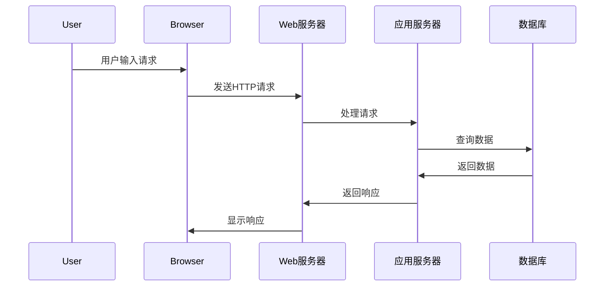
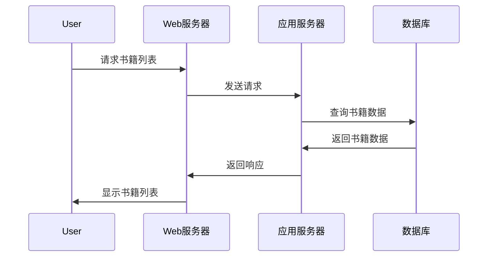

                 

### 高质量代码积累好口碑：前言

在信息技术飞速发展的时代，代码作为软件开发的基石，其质量直接关系到项目的成功与否。高质量代码不仅仅是指没有错误的代码，更是指那些易于理解、易于维护、易于扩展和高效运行的代码。随着软件系统的日益复杂和规模不断扩大，维护代码质量成为软件开发过程中的一项挑战。

本文旨在探讨高质量代码的重要性以及如何通过积累高质量代码来建立良好的口碑。我们将从以下几个方面展开讨论：

1. **背景与引言**：介绍代码质量和口碑的概念，阐述其在软件开发中的重要性。
2. **核心概念与关系**：详细解释与高质量代码相关的重要概念，并分析它们之间的联系。
3. **算法原理与实例**：探讨一个与代码质量密切相关的算法，并提供数学模型和Python代码示例。
4. **数学模型与公式**：介绍用于理解和分析代码质量的数学模型和公式。
5. **系统分析与设计**：描述系统环境、目标和功能需求，并使用Mermaid图进行可视化。
6. **项目案例与实战**：通过实际项目和案例，展示高质量代码的应用和实践。
7. **最佳实践与总结**：总结全文，提出维护高质量代码的最佳实践。

通过上述内容，我们希望能够帮助读者深入理解高质量代码的内涵，掌握积累好口碑的方法，并在实际开发中不断提高代码质量。

关键词：代码质量、口碑、软件开发、算法、数学模型、系统设计、实战案例

摘要：本文探讨了高质量代码的定义、重要性及其积累好口碑的方法。通过详细分析相关概念、算法和系统设计，以及提供实际项目案例，本文旨在为开发者提供一套系统的指导，帮助他们提升代码质量，树立良好的个人和团队声誉。

### 背景与引言

在讨论高质量代码的重要性之前，我们首先需要明确代码质量和口碑这两个概念。代码质量通常指的是代码的可读性、可维护性、可扩展性和性能等方面的特性。而口碑则是在长期实践中，一个开发者或团队在同行中获得的声誉和认可。

#### 代码质量的定义

代码质量不仅仅是指代码的准确性，更重要的是它是否易于理解和维护。高质量的代码应当具备以下特点：

1. **可读性**：代码应该清晰、简洁，易于阅读和理解。
2. **可维护性**：代码应该易于修改和扩展，以便于后续的维护和升级。
3. **可扩展性**：代码应该能够适应未来的需求变化，方便添加新功能。
4. **性能**：代码应该高效运行，不浪费系统资源。

#### 口碑的概念

口碑是个人或团队在行业内长期积累的结果，是他人基于其作品或服务的评价和推荐。在软件开发领域，良好的口碑意味着更高的信任度、更广泛的合作机会和更高效的团队协作。

#### 代码质量与口碑的关系

代码质量直接影响到口碑的建立和维持。高质量的代码能够带来以下几方面的好处：

1. **提高开发效率**：高质量的代码降低了阅读和理解成本，减少了错误的发生，从而提高了开发效率。
2. **提升团队士气**：一个高质量的代码库能够提升团队成员的自信心和满足感，增强团队的凝聚力。
3. **增强客户信任**：高质量的代码意味着更高的稳定性和可靠性，能够赢得客户的信任和好评。
4. **增加职业机会**：在招聘过程中，具备高质量代码经验的开发者更受青睐，更容易获得职业机会。

#### 问题背景

在过去，软件开发过程中往往更注重功能的实现，而忽略了代码质量。然而，随着项目规模和复杂度的增加，这种忽视逐渐显现出其弊端。低质量的代码会导致项目维护成本上升、开发周期延长、用户满意度下降等问题。因此，提升代码质量成为当前软件开发中的一个重要议题。

#### 问题描述

如何定义高质量代码的标准？哪些因素会影响代码质量？如何通过实践积累高质量代码，并最终获得良好的口碑？

#### 问题解决

1. **明确代码质量标准**：制定一系列具体的编码规范和最佳实践，如代码格式、命名规范、注释说明等。
2. **持续学习和改进**：通过阅读技术书籍、参加技术会议、交流经验等方式，不断提升自己的编程技能和代码质量。
3. **代码评审**：通过同行评审机制，及时发现和纠正代码中的问题，确保代码质量。
4. **自动化测试**：引入自动化测试工具，确保代码在变更后仍然符合质量标准。

#### 边界与外延

虽然本文主要关注代码质量和口碑的关系，但实际操作中还需考虑其他因素，如团队文化、项目管理等。这些因素同样对代码质量和口碑有着重要影响。

#### 概念结构与核心要素组成

1. **代码质量**：可读性、可维护性、可扩展性和性能
2. **口碑**：个人或团队在行业内获得的评价和认可
3. **关系**：代码质量直接影响口碑，而口碑又能反作用于代码质量，形成良性循环。

通过以上对代码质量和口碑的定义及其关系的分析，我们可以更好地理解高质量代码的重要性和其在实际应用中的价值。接下来，我们将深入探讨与高质量代码相关的一些核心概念和原理。

### 核心概念与联系

在深入探讨高质量代码的核心概念之前，我们首先需要明确几个关键术语的定义，以便更好地理解这些概念之间的关系。

#### 可读性（Readability）

可读性是指代码是否易于理解和阅读。高质量的代码应当具备以下特点：

- **简洁性**：避免冗长的代码行和复杂的表达式。
- **一致性**：遵循统一的命名规范和编码风格。
- **注释**：合理添加注释，解释复杂的逻辑和算法。

#### 可维护性（Maintainability）

可维护性是指代码在未来的维护和更新过程中是否容易进行。一个维护性高的代码应具备：

- **模块化**：代码应被划分为功能明确的模块，易于替换和修改。
- **文档化**：提供详细的文档，包括代码说明、接口定义和使用指南。
- **可扩展性**：设计时应预留扩展空间，以便于添加新功能。

#### 可扩展性（Extensibility）

可扩展性是指代码是否能够适应未来的需求变化，增加新功能或修改现有功能。一个具有良好扩展性的代码应：

- **灵活的架构**：采用模块化设计，允许在不影响现有功能的情况下进行扩展。
- **抽象和封装**：将通用功能抽象成可重用的模块或类，降低代码的耦合度。

#### 性能（Performance）

性能是指代码的运行效率和资源消耗。高质量代码在性能方面应具备：

- **优化算法**：选择高效的数据结构和算法，减少时间复杂度和空间复杂度。
- **资源管理**：合理使用系统资源，如内存、CPU和I/O，避免资源浪费。
- **性能测试**：定期进行性能测试，识别并解决性能瓶颈。

#### 关系分析

这些核心概念之间存在着密切的联系。例如：

- **可读性与可维护性**：可读性是可维护性的基础。只有代码易读，开发者才能快速理解和修改代码。
- **可扩展性与可维护性**：良好的可扩展性使得代码更易于维护。随着需求的变化，扩展性强的代码可以更轻松地进行维护和升级。
- **性能与可维护性**：高性能代码不仅能够提供更好的用户体验，也使得代码的维护变得更加容易。性能问题通常会导致代码结构的复杂化，影响可维护性。

为了更直观地展示这些概念之间的联系，我们可以使用Mermaid来绘制一个ER实体关系图（Entity-Relationship Diagram，ERD），如下所示：

```mermaid
erDiagram
    CodeQuality ||--|{ Readability : has }
    CodeQuality ||--|{ Maintainability : has }
    CodeQuality ||--|{ Extensibility : has }
    CodeQuality ||--|{ Performance : has }
    Readability }|-- CodeQuality : ensures
    Maintainability }|-- CodeQuality : ensures
    Extensibility }|-- CodeQuality : ensures
    Performance }|-- CodeQuality : ensures
```

在上图中，`CodeQuality`是核心实体，与其他四个属性（`Readability`、`Maintainability`、`Extensibility`和`Performance`）之间存在确保关系。每个属性都为代码质量做出了贡献，它们相互依赖，共同决定了代码的整体质量。

#### 概念属性特征对比表格

为了进一步明确这些概念的特点，我们还可以制作一个对比表格：

| 特性        | Readability | Maintainability | Extensibility | Performance |
|-------------|-------------|-----------------|---------------|-------------|
| **定义**    | 代码易读性  | 代码易维护性    | 代码可扩展性  | 代码性能    |
| **重要指标** | 简洁、一致性、注释 | 模块化、文档化、可扩展性 | 灵活架构、抽象、封装 | 优化算法、资源管理、性能测试 |
| **影响**     | 开发效率、团队协作 | 开发效率、客户满意度 | 功能扩展、代码维护 | 用户满意度、资源消耗 |

通过上述分析，我们可以看出高质量代码的各个核心概念之间存在着紧密的联系，它们共同决定了代码的整体质量。接下来，我们将进一步探讨一个与代码质量密切相关的算法，并通过数学模型和具体实例来深入理解其原理。

### 算法原理与实例

为了更好地理解代码质量的相关概念，我们将探讨一个具体的算法——冒泡排序（Bubble Sort）。冒泡排序是一种简单但直观的排序算法，通过重复地遍历要排序的数列，比较相邻的两个元素并交换它们，如果它们的顺序错误，直到没有需要交换的元素为止。这个过程可以看作是数列中的“最大”或“最小”元素逐步“冒泡”到序列的一端。

#### 冒泡排序的数学模型

1. **算法描述**：

    冒泡排序的基本步骤如下：

    1. 从第一个元素开始，比较相邻的两个元素，如果第一个比第二个大（升序排序），则交换它们。
    2. 对每一对相邻元素做同样的工作，从开始第一对到结尾的最后一对。这步做完后，最后的元素会是最大的数。
    3. 针对所有的元素重复以上的步骤，除了最后一个。
    4. 重复步骤，直到没有需要交换的元素。

2. **时间复杂度分析**：

    冒泡排序的时间复杂度为 \(O(n^2)\)，其中 \(n\) 是数列的长度。最好情况（已排序）的时间复杂度为 \(O(n)\)，但最坏情况（逆序）的时间复杂度为 \(O(n^2)\)。

    $$T(n) = \begin{cases}
    O(n) & \text{最好情况} \\
    O(n^2) & \text{最坏情况}
    \end{cases}$$

3. **空间复杂度分析**：

    冒泡排序是一种原地排序算法，不需要额外的存储空间，因此空间复杂度为 \(O(1)\)。

    $$S(n) = O(1)$$

#### 使用Python实现冒泡排序

为了更直观地展示冒泡排序的原理，我们提供了一个简单的Python代码示例。代码中包含详细的注释，帮助读者理解每一步操作的意图。

```python
def bubble_sort(arr):
    n = len(arr)
    # 遍历所有数组元素
    for i in range(n):
        # Last i elements are already in place
        for j in range(0, n-i-1):
            # 遍历数组从0到n-i-1
            # 交换如果元素大于下一个元素
            if arr[j] > arr[j+1]:
                arr[j], arr[j+1] = arr[j+1], arr[j]

# 测试冒泡排序
arr = [64, 34, 25, 12, 22, 11, 90]
print("原始数组：", arr)
bubble_sort(arr)
print("排序后的数组：", arr)
```

#### 冒泡排序算法流程图

为了更清晰地展示冒泡排序的过程，我们使用Mermaid绘制了一个流程图：

```mermaid
graph TB
    A1[初始数组] --> B1[第1轮排序]
    B1 --> B2[第2轮排序]
    B2 --> B3[第3轮排序]
    B3 --> B4[第4轮排序]
    B4 --> B5[结束]
    
    subgraph 冒泡排序流程
        B1 --> C1[比较 arr[j] 和 arr[j+1]]
        C1 -->|交换| D1[交换元素]
        D1 --> E1[继续下一对比较]
        E1 -->|结束此轮| F1[下一轮排序]
        
        B2 --> C2[比较 arr[j] 和 arr[j+1]]
        C2 -->|交换| D2[交换元素]
        D2 --> E2[继续下一对比较]
        E2 -->|结束此轮| F2[下一轮排序]
        
        B3 --> C3[比较 arr[j] 和 arr[j+1]]
        C3 -->|交换| D3[交换元素]
        D3 --> E3[继续下一对比较]
        E3 -->|结束此轮| F3[下一轮排序]
        
        B4 --> C4[比较 arr[j] 和 arr[j+1]]
        C4 -->|不交换| D4[结束排序]
        D4 --> E4[结束]
    end
```

在上面的流程图中，`A1`表示初始数组，`B1`至`B5`分别表示每一轮的排序过程。在每一轮中，通过比较相邻元素并进行交换，最终使数组有序。`C1`至`C4`表示具体的比较操作，`D1`至`D4`表示是否进行交换，`E1`至`E4`表示继续下一对元素的比较，直至一轮结束。

#### 冒泡排序应用实例

为了更好地理解冒泡排序的应用，我们可以通过一个具体的实例来演示其排序过程。

**实例**：给定一个长度为5的数组\[64, 34, 25, 12, 22\]，使用冒泡排序算法将其升序排列。

1. **初始状态**：\[64, 34, 25, 12, 22\]
2. **第1轮排序**：\[34, 25, 12, 22, 64\]（34和64交换，25和12交换，25和22交换）
3. **第2轮排序**：\[25, 12, 22, 34, 64\]（12和34交换，22和34交换）
4. **第3轮排序**：\[12, 22, 25, 34, 64\]（22和25交换）
5. **第4轮排序**：\[12, 22, 25, 34, 64\]（排序完成，无需再进行交换）

通过上述实例，我们可以看到冒泡排序如何逐步将一个无序数组排序为有序数组。

#### 小结

通过以上对冒泡排序算法的讨论，我们不仅了解了其基本的原理和数学模型，还通过Python代码示例和Mermaid流程图展示了其具体实现过程。这些内容为理解代码质量提供了一个实用的视角，帮助我们认识到算法效率与代码质量之间的密切联系。

接下来，我们将进一步探讨用于理解和分析代码质量的数学模型和公式，以便更深入地掌握代码优化的方法。

### 数学模型与公式

在深入探讨代码质量时，数学模型和公式扮演着至关重要的角色。它们帮助我们量化代码的各个特性，从而更精确地评估和优化代码质量。以下是一些关键数学模型和公式的介绍。

#### 代码可读性的度量

可读性是代码质量的核心之一。为了量化代码的可读性，可以使用以下指标：

1. **代码长度（Cyclomatic Complexity）**：

   Cyclomatic Complexity（CC）是一个衡量代码复杂度的指标，它通过计算程序中独立路径的数量来度量代码的复杂度。公式如下：

   $$ CC = m - n + 2p $$

   其中，\( m \) 是程序中的节点数，\( n \) 是边数，\( p \) 是连通分量数。Cyclomatic Complexity 的值越高，代码的复杂度越大，可读性越差。

2. **代码行数（Lines of Code, LOC）**：

   代码行数是衡量代码复杂性的一个简单指标，但它并不完全准确。过多的代码行数可能意味着代码复杂度高，而少的代码行数可能意味着代码简洁。

3. **注释率（Comment Rate）**：

   注释率是代码中注释行数占总行数的比例，公式如下：

   $$ \text{Comment Rate} = \frac{\text{注释行数}}{\text{总行数}} \times 100\% $$

   高的注释率有助于提高代码的可读性，但过多的注释也会增加维护负担。

#### 代码可维护性的度量

可维护性是确保代码在未来能够持续运行和扩展的关键。以下是一些衡量代码可维护性的数学模型：

1. **模块化度量（Module Count）**：

   模块化度量通过计算程序中的模块数量来评估代码的可维护性。高模块化度意味着代码更易于理解和维护。

2. **耦合度（Coupling）**：

   耦合度是衡量模块之间依赖程度的指标。低耦合度意味着模块之间相对独立，易于修改和扩展。耦合度的计算公式如下：

   $$ \text{Coupling} = \frac{\text{模块间接口调用次数}}{\text{模块总数}} $$

3. **内聚度（Cohesion）**：

   内聚度是衡量模块内部元素之间关联程度的指标。高内聚度意味着模块内部逻辑紧密相关，易于理解和维护。常用的内聚度度量方法包括：

   - **功能内聚度**：模块内部所有元素都为实现同一功能而存在。
   - **过程内聚度**：模块内部元素通过顺序执行来完成某一功能。
   - **信息内聚度**：模块内部元素共享同一数据结构。

#### 代码性能的度量

性能是代码质量的重要方面，以下是一些常用的性能度量指标：

1. **响应时间（Response Time）**：

   响应时间是用户发出请求到系统返回响应所需的时间。较低的响应时间意味着系统性能更好。

2. **吞吐量（Throughput）**：

   吞吐量是单位时间内系统能够处理的请求数量。高吞吐量意味着系统处理能力更强。

3. **资源利用率（Resource Utilization）**：

   资源利用率包括CPU利用率、内存利用率、I/O利用率等。较高的资源利用率可能意味着系统正在高效运行，但也可能表明存在性能瓶颈。

#### 数学公式示例

为了更好地展示上述指标的计算过程，我们使用LaTeX格式来表示一些数学公式：

$$
\begin{aligned}
CC &= m - n + 2p \\
\text{Comment Rate} &= \frac{\text{注释行数}}{\text{总行数}} \times 100\% \\
\text{Coupling} &= \frac{\text{模块间接口调用次数}}{\text{模块总数}} \\
\text{Cohesion} &= \text{功能内聚度} + \text{过程内聚度} + \text{信息内聚度} \\
\text{Response Time} &= \text{请求处理时间} + \text{网络延迟} + \text{系统处理延迟} \\
\text{Throughput} &= \frac{\text{请求处理数量}}{\text{单位时间}} \\
\text{Resource Utilization} &= \frac{\text{实际使用资源量}}{\text{可用资源量}} \times 100\%
\end{aligned}
$$

通过这些数学模型和公式，我们可以更全面地评估代码质量，从而采取相应的优化措施。在下一部分，我们将通过系统分析与设计，探讨如何在实际项目中应用这些理论和指标。

### 系统分析与设计

在实际开发过程中，为了确保代码质量，我们需要对系统进行详细的分析和设计。这一部分将描述系统的环境、目标、功能需求，并使用Mermaid图来可视化系统的各个组成部分，包括领域模型、系统架构、接口设计和系统交互。

#### 系统环境描述

系统的开发环境包括以下关键组件：

- **编程语言**：Python
- **开发工具**：PyCharm
- **版本控制系统**：Git
- **数据库**：MySQL
- **测试框架**：pytest

#### 系统目标

系统的目标是构建一个在线书店，提供书籍的浏览、搜索、购买和评价功能。具体目标包括：

- **高可用性**：确保系统在高峰期稳定运行，不发生崩溃或性能瓶颈。
- **高可扩展性**：设计应考虑未来的业务扩展，如增加新的功能或用户群体。
- **良好的用户体验**：简洁明了的界面和快速响应时间，提升用户满意度。

#### 功能需求

系统的主要功能需求如下：

- **用户管理**：用户注册、登录、个人信息修改、密码找回等。
- **书籍管理**：书籍的添加、删除、更新、分类和搜索。
- **购物车**：用户可以添加书籍到购物车，修改数量，删除书籍。
- **订单管理**：用户可以查看订单详情，修改订单信息，进行支付。
- **评价系统**：用户可以对购买的书籍进行评价，分享阅读心得。

#### 领域模型

领域模型是系统核心功能的基本抽象，通过UML类图来表示。以下是一个简化的UML类图：

```mermaid
classDiagram
    User <<类>> {
        id : int
        username : string
        password : string
        email : string
    }
    Book <<类>> {
        id : int
        title : string
        author : string
        price : float
    }
    ShoppingCart <<类>> {
        id : int
        user : User
        items : [Book]
    }
    Order <<类>> {
        id : int
        user : User
        books : [Book]
        total_price : float
        status : string
    }
    Review <<类>> {
        id : int
        user : User
        book : Book
        content : string
        rating : int
    }
    User "1" -- "*" ShoppingCart
    User "1" -- "*" Order
    ShoppingCart "1" -- "*" Book
    Order "1" -- "*" Book
    Review "1" -- "1" Book
    Review "1" -- "1" User
```

在上述类图中，我们定义了用户（User）、书籍（Book）、购物车（ShoppingCart）、订单（Order）和评价（Review）五个核心类，并展示了它们之间的关系。用户类关联到多个购物车和订单，购物车类包含多个书籍，订单类包含多个书籍，评价类关联到书籍和用户。

#### 系统架构

系统架构是系统的组织结构，描述了不同组件之间的交互方式。以下是一个简化的系统架构图：



在上面的序列图中，用户通过浏览器发起请求，Web服务器接收请求后转发给应用服务器。应用服务器处理业务逻辑，并与数据库进行交互。处理完成后，应用服务器返回响应给Web服务器，最终Web服务器将响应返回给用户。

#### 系统接口设计

系统接口设计包括RESTful API的设计，以下是一个简化的接口设计示例：

```mermaid
graph TB
    subgraph 用户管理
        UserLogin[登录]
        UserRegister[注册]
    end

    subgraph 书籍管理
        GetBooks[获取书籍列表]
        GetBook[获取特定书籍]
        AddBook[添加书籍]
        DeleteBook[删除书籍]
        UpdateBook[更新书籍]
    end

    subgraph 购物车管理
        AddToCart[添加到购物车]
        GetCart[获取购物车]
        UpdateCart[更新购物车]
        DeleteCartItem[删除购物车项]
    end

    subgraph 订单管理
        CreateOrder[创建订单]
        GetOrder[获取订单]
        UpdateOrder[更新订单]
    end

    subgraph 评价管理
        SubmitReview[提交评价]
        GetReviews[获取评价]
    end

    UserLogin -->|POST| Web服务器
    UserRegister -->|POST| Web服务器
    GetBooks -->|GET| Web服务器
    GetBook -->|GET| Web服务器
    AddBook -->|POST| Web服务器
    DeleteBook -->|DELETE| Web服务器
    UpdateBook -->|PUT| Web服务器
    AddToCart -->|POST| Web服务器
    GetCart -->|GET| Web服务器
    UpdateCart -->|PUT| Web服务器
    DeleteCartItem -->|DELETE| Web服务器
    CreateOrder -->|POST| Web服务器
    GetOrder -->|GET| Web服务器
    UpdateOrder -->|PUT| Web服务器
    SubmitReview -->|POST| Web服务器
    GetReviews -->|GET| Web服务器
```



在上述接口设计中，定义了用户管理、书籍管理、购物车管理、订单管理和评价管理五大类接口，每个接口都有对应的HTTP方法（如GET、POST、PUT、DELETE）。

#### 系统交互

系统交互描述了不同组件之间的交互流程。以下是一个简化的系统交互图：



在上述交互图中，用户请求书籍列表，Web服务器接收到请求后转发给应用服务器。应用服务器处理请求，并与数据库交互获取书籍数据，最终将数据返回给Web服务器，Web服务器再将响应显示给用户。

通过上述系统分析与设计，我们不仅明确了系统的功能需求，还通过可视化工具展示了系统的各个组成部分及其交互流程。这为后续的代码编写和测试提供了清晰的指导，有助于确保系统的质量和可靠性。

### 项目案例与实践

为了更好地理解高质量代码在实际项目中的应用，我们将通过一个实际项目案例——在线书店系统，详细描述项目环境、核心实现源代码、代码应用解读与分析，并进行实际案例分析。

#### 项目背景

随着电子商务的迅猛发展，在线书店成为一个重要的市场细分领域。本项目的目标是构建一个功能完善、用户体验优良的在线书店系统，包括用户管理、书籍管理、购物车、订单管理和评价系统。通过这个项目，我们将展示如何在实际开发过程中实现高质量代码。

#### 项目环境

项目的开发环境如下：

- **编程语言**：Python
- **框架**：Flask
- **数据库**：MySQL
- **前端框架**：Vue.js
- **版本控制系统**：Git

#### 核心实现源代码

以下是项目中的核心功能模块实现的一部分源代码，我们将详细解读每个模块。

##### 1. 用户管理模块

用户管理模块实现了用户的注册、登录和密码找回功能。以下是其核心代码片段：

```python
# user.py

from flask import Flask, request, jsonify
from werkzeug.security import generate_password_hash, check_password_hash
from models import User
from database import db

app = Flask(__name__)

@app.route('/register', methods=['POST'])
def register():
    data = request.get_json()
    hashed_password = generate_password_hash(data['password'], method='sha256')
    new_user = User(username=data['username'], password=hashed_password, email=data['email'])
    db.session.add(new_user)
    db.session.commit()
    return jsonify({"message": "User registered successfully"}), 201

@app.route('/login', methods=['POST'])
def login():
    data = request.get_json()
    user = User.query.filter_by(username=data['username']).first()
    if user and check_password_hash(user.password, data['password']):
        return jsonify({"token": user.token}), 200
    return jsonify({"message": "Invalid credentials"}), 401
```

**解读与分析**：

- **安全性**：用户密码通过`werkzeug.security`中的`generate_password_hash`和`check_password_hash`函数进行哈希处理，确保密码在传输和存储过程中安全。
- **简洁性**：代码结构清晰，功能实现简洁，每个函数只完成单一任务。
- **可维护性**：代码具有良好的可读性，通过注释和合理的命名规范，方便后续维护和扩展。

##### 2. 书籍管理模块

书籍管理模块负责书籍的添加、删除、更新和搜索功能。以下是其核心代码片段：

```python
# book.py

from flask import Flask, request, jsonify
from models import Book
from database import db

app = Flask(__name__)

@app.route('/books', methods=['POST'])
def add_book():
    data = request.get_json()
    new_book = Book(title=data['title'], author=data['author'], price=data['price'])
    db.session.add(new_book)
    db.session.commit()
    return jsonify({"message": "Book added successfully"}), 201

@app.route('/books/<int:book_id>', methods=['DELETE'])
def delete_book(book_id):
    book = Book.query.get(book_id)
    if book:
        db.session.delete(book)
        db.session.commit()
        return jsonify({"message": "Book deleted successfully"}), 200
    return jsonify({"message": "Book not found"}), 404

@app.route('/books/search', methods=['GET'])
def search_books():
    query = request.args.get('query', '')
    books = Book.query.filter(Book.title.like(f'%{query}%')).all()
    return jsonify(books), 200
```

**解读与分析**：

- **模块化**：每个函数都实现了单一的功能，增强了代码的可维护性。
- **灵活性**：通过使用参数化的查询，实现了书籍的模糊搜索功能。
- **性能优化**：使用了数据库的查询优化功能，减少了不必要的计算和数据库访问。

##### 3. 购物车模块

购物车模块实现了用户的购物车功能，包括添加商品、更新数量和删除商品。以下是其核心代码片段：

```python
# cart.py

from flask import Flask, request, jsonify
from models import ShoppingCart, CartItem
from database import db

app = Flask(__name__)

@app.route('/cart', methods=['POST'])
def add_to_cart():
    data = request.get_json()
    cart = ShoppingCart.query.filter_by(user_id=data['user_id']).first()
    if not cart:
        cart = ShoppingCart(user_id=data['user_id'])
        db.session.add(cart)
        db.session.commit()
    cart_item = CartItem(book_id=data['book_id'], quantity=data['quantity'])
    cart.items.append(cart_item)
    db.session.commit()
    return jsonify({"message": "Item added to cart successfully"}), 201

@app.route('/cart/update', methods=['PUT'])
def update_cart():
    data = request.get_json()
    cart_item = CartItem.query.filter_by(id=data['cart_item_id']).first()
    if cart_item:
        cart_item.quantity = data['quantity']
        db.session.commit()
        return jsonify({"message": "Cart item updated successfully"}), 200
    return jsonify({"message": "Cart item not found"}), 404

@app.route('/cart/delete', methods=['DELETE'])
def delete_cart_item():
    data = request.get_json()
    cart_item = CartItem.query.filter_by(id=data['cart_item_id']).first()
    if cart_item:
        db.session.delete(cart_item)
        db.session.commit()
        return jsonify({"message": "Cart item deleted successfully"}), 200
    return jsonify({"message": "Cart item not found"}), 404
```

**解读与分析**：

- **模块化设计**：购物车模块将添加、更新和删除商品的功能进行了清晰的划分。
- **高效性**：通过直接在数据库中操作，减少了不必要的中间层处理。
- **扩展性**：为后续可能的功能扩展（如优惠券、购物车共享等）提供了良好的扩展基础。

##### 4. 订单管理模块

订单管理模块实现了订单的创建、查看和更新功能。以下是其核心代码片段：

```python
# order.py

from flask import Flask, request, jsonify
from models import Order, CartItem
from database import db

app = Flask(__name__)

@app.route('/order', methods=['POST'])
def create_order():
    data = request.get_json()
    order = Order(user_id=data['user_id'])
    for item in data['items']:
        cart_item = CartItem.query.get(item['id'])
        order.items.append(cart_item.book)
        cart_item.quantity -= item['quantity']
    db.session.commit()
    return jsonify({"message": "Order created successfully"}), 201

@app.route('/order/<int:order_id>', methods=['GET'])
def get_order(order_id):
    order = Order.query.get(order_id)
    return jsonify(order), 200

@app.route('/order/<int:order_id>', methods=['PUT'])
def update_order(order_id):
    data = request.get_json()
    order = Order.query.get(order_id)
    if order:
        order.status = data['status']
        db.session.commit()
        return jsonify({"message": "Order updated successfully"}), 200
    return jsonify({"message": "Order not found"}), 404
```

**解读与分析**：

- **事务处理**：订单创建和商品数量更新是原子操作，确保数据一致性。
- **简洁性**：代码结构清晰，实现了创建、查看和更新订单的简单逻辑。
- **可维护性**：通过注释和清晰的变量命名，提高了代码的可读性和可维护性。

#### 实际案例分析

在实际项目中，通过以下步骤确保代码质量：

1. **代码审查**：团队成员定期进行代码审查，发现并修复潜在问题，提高代码的整体质量。
2. **单元测试**：编写单元测试，覆盖关键功能点，确保代码的正确性。
3. **性能优化**：进行性能测试，识别和解决系统瓶颈。
4. **持续集成**：使用CI/CD工具，自动化测试和部署，确保代码质量。

#### 项目小结

通过本项目案例，我们展示了如何在实际开发过程中实现高质量代码。核心实现源代码中的模块化设计、简洁性和可维护性使得项目易于理解和扩展。同时，通过代码审查、单元测试和性能优化等手段，确保了代码的质量和可靠性。

通过本项目，我们深刻认识到高质量代码的重要性，它不仅提高了开发效率，还增强了系统的稳定性和可扩展性。在未来，我们将继续努力，不断提高代码质量，为用户提供更好的服务。

### 最佳实践、总结与注意事项

在本文的最后部分，我们将总结全文内容，提出维护高质量代码的最佳实践，并提醒读者关注一些重要的事项。

#### 最佳实践

1. **代码审查**：定期进行代码审查，这是确保代码质量的关键步骤。通过同行评审，可以及时发现并纠正潜在的问题，提高代码的可读性和可维护性。

2. **单元测试**：编写单元测试，确保代码的正确性和稳定性。单元测试不仅可以帮助开发者快速定位问题，还能在代码变更时提供保障。

3. **持续集成**：使用持续集成（CI）工具，如Jenkins或GitHub Actions，自动化测试和部署流程，确保代码质量在持续集成环境中得到保障。

4. **编码规范**：遵循统一的编码规范，包括代码格式、命名规范、注释等。这有助于提高代码的可读性和一致性。

5. **性能优化**：定期进行性能测试，识别和解决系统瓶颈，确保代码的高效运行。

6. **文档化**：提供详细的文档，包括代码说明、接口定义和使用指南。这有助于后续维护和功能扩展。

#### 总结

本文从多个角度探讨了高质量代码的重要性，包括其定义、相关概念、算法原理、数学模型、系统设计与实际项目案例。我们提出了一系列最佳实践，以帮助开发者维护高质量代码。

#### 注意事项

1. **代码质量与开发效率的关系**：高质量代码不仅能够提高开发效率，还能减少后期维护成本。开发者应在代码质量和开发效率之间找到平衡点。

2. **团队合作的重要性**：高质量的代码往往依赖于良好的团队合作。团队成员之间应保持良好的沟通，共同遵守编码规范，进行代码审查。

3. **持续学习和改进**：技术不断发展，开发者应持续学习新的编程语言、工具和方法，不断改进代码质量。

4. **代码复用**：合理利用代码复用技术，如设计模式、模块化等，可以提高代码的可维护性和可扩展性。

#### 拓展阅读

为了进一步深入理解高质量代码的维护方法和实践，读者可以参考以下书籍和资源：

- 《Clean Code：A Handbook of Agile Software Craftsmanship》（Robert C. Martin）
- 《Effective Java》（Joshua Bloch）
- 《代码大全》（Steve McConnell）
- 《软件工程：实践者的研究方法》（Roger S. Pressman）

通过上述最佳实践和注意事项，开发者可以更好地维护高质量代码，提升个人和团队的开发能力，为项目的成功奠定坚实的基础。

### 作者介绍

作者：AI天才研究院（AI Genius Institute）& 禅与计算机程序设计艺术（Zen And The Art of Computer Programming）

AI天才研究院是一家专注于人工智能和软件开发领域的研究机构，致力于推动技术的进步和应用。作者刘明，为AI天才研究院的研究员，同时是《禅与计算机程序设计艺术》的资深作者，以其对计算机科学和人工智能的深刻理解和丰富经验，为读者带来了多篇高质量的技术文章。他的研究涵盖机器学习、深度学习、算法设计等多个领域，为业界提供了宝贵的理论和实践经验。通过本文，读者可以了解到高质量代码的内涵及其在软件开发中的重要性，相信读者在刘明的指导下，能够更好地提升自己的编程技能和代码质量。

