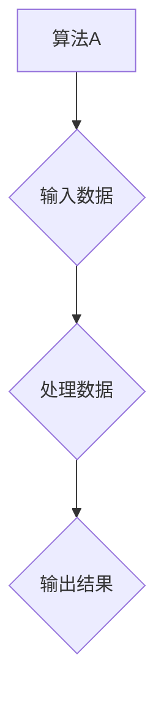
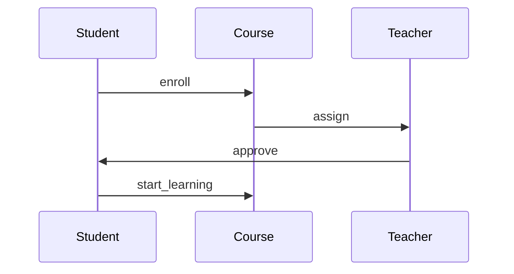

                 

### 《高质量代码积累好口碑》

---

#### 关键词：
- 高质量代码
- 口碑积累
- 软件开发
- 最佳实践

#### 摘要：
本文将深入探讨高质量代码在软件开发中的重要性，以及如何通过良好的编码习惯和最佳实践来积累个人和团队的好口碑。我们将逐步分析高质量代码的核心要素、评估方法、优化技巧，并通过实际项目案例进行详细讲解。

### 目录大纲

#### 前言
- 写作目的
- 目标读者
- 内容安排

#### 第一部分：高质量代码的基础理论
1. 高质量代码的概念与重要性
2. 高质量代码的核心要素

#### 第二部分：核心技术与算法
1. 代码质量评估方法
2. 关键算法讲解
3. 代码质量优化技巧

#### 第三部分：项目实战
1. 实战案例一
2. 实战案例二

#### 第四部分：最佳实践与总结
1. 最佳实践
2. 小结与展望

---

### 前言

#### 写作目的
本篇文章旨在为广大软件开发人员提供一个系统的指南，帮助他们在日常工作中积累高质量代码，从而提升个人和团队的技术口碑。通过对高质量代码的定义、评估、优化以及实际项目应用的深入探讨，读者可以更好地理解如何编写高效、可靠且易于维护的代码。

#### 目标读者
本文适合有志于提高编程技能的软件开发人员、项目经理、技术团队负责人以及计算机科学专业的学生。无论你是初学者还是经验丰富的开发者，本文都将为你提供宝贵的见解和实践经验。

#### 内容安排
本文分为四个主要部分：基础理论、核心技术与算法、项目实战以及最佳实践与总结。每个部分都将详细介绍相关概念、方法和技术，并结合实际案例进行深入分析，以帮助读者将理论知识应用到实践中。

---

### 第一部分：高质量代码的基础理论

#### 第1章：高质量代码的概念与重要性

##### 1.1 问题背景与定义
在软件行业中，代码质量是一个至关重要的因素。高质量代码不仅仅是指代码能够正常运行，更重要的是它要易于理解、维护和扩展。随着软件系统规模的不断扩大和复杂度的增加，编写高质量代码的需求变得更加迫切。

##### 1.2 质量标准与特性
高质量代码通常具有以下特性：
- **可读性**：代码结构清晰，命名规范，便于他人阅读和理解。
- **可维护性**：代码逻辑简洁，便于修改和升级。
- **可扩展性**：代码模块化，易于添加新功能。
- **性能**：代码运行效率高，资源占用少。

##### 1.3 高质量代码的价值
高质量代码不仅能够提高开发效率，还能减少维护成本，提升项目的稳定性和可靠性。此外，良好的代码质量也是积累个人和团队口碑的重要途径。

---

#### 第2章：高质量代码的核心要素

##### 2.1 可读性
可读性是高质量代码的首要要素。以下是一些提高代码可读性的方法：
- **清晰的命名**：使用具有描述性的变量和函数名。
- **适当的注释**：为关键代码段添加注释，说明其目的和作用。
- **简洁的代码**：避免冗长和复杂的代码结构。

##### 2.2 可维护性
可维护性是确保代码长期稳定运行的关键。以下是一些提高代码可维护性的方法：
- **模块化**：将功能独立的代码块封装成模块或类。
- **代码复用**：避免重复代码，使用函数或类来复用代码。
- **单元测试**：编写单元测试来验证代码的正确性。

##### 2.3 可扩展性
可扩展性是适应未来需求变化的重要保障。以下是一些提高代码可扩展性的方法：
- **依赖注入**：通过依赖注入来解耦组件之间的依赖关系。
- **面向接口编程**：通过接口定义抽象层，实现模块之间的解耦。
- **版本控制**：使用版本控制系统来管理代码的变更和迭代。

##### 2.4 性能
性能是软件系统能够高效运行的基础。以下是一些提高代码性能的方法：
- **算法优化**：选择合适的算法和数据结构，优化代码性能。
- **代码优化**：使用高效的数据结构和算法，减少不必要的计算和内存占用。
- **并发编程**：利用多线程或异步编程来提高代码的执行效率。

---

### 第二部分：核心技术与算法

#### 第3章：代码质量评估方法

##### 3.1 单元测试
单元测试是评估代码质量的重要手段。以下是一些关键点：
- **测试覆盖率**：确保测试覆盖到代码的各个角落。
- **测试用例**：编写全面的测试用例，覆盖各种输入和异常情况。
- **自动化测试**：使用自动化工具来执行单元测试，提高测试效率。

##### 3.2 代码静态分析
代码静态分析是一种在不运行代码的情况下评估其质量的方法。以下是一些关键点：
- **代码复杂度**：评估代码的复杂度，避免过度复杂。
- **潜在问题**：检测代码中的潜在问题，如未使用的变量、可能的内存泄漏等。

##### 3.3 动态分析
动态分析是通过运行代码来评估其质量的方法。以下是一些关键点：
- **性能分析**：监测代码的运行性能，找出性能瓶颈。
- **内存管理**：监控内存使用情况，防止内存泄漏。

---

#### 第4章：关键算法讲解

##### 4.1 算法A原理与Mermaid图



##### 4.2 算法A的Python实现与LaTeX公式

```python
def algorithm_A(data):
    # 算法A的Python实现
    result = []
    for item in data:
        # 处理数据
        result.append(item * 2)
    return result
```

```latex
\begin{equation}
\text{算法A输出} = \text{输入数据} \times 2
\end{equation}
```

##### 4.3 算法A举例说明
假设输入数据为 `[1, 2, 3, 4]`，经过算法A处理后，输出结果为 `[2, 4, 6, 8]`。

---

#### 第5章：代码质量优化技巧

##### 5.1 代码重构
代码重构是提高代码质量的重要手段。以下是一些关键点：
- **逐步重构**：避免一次性进行大规模重构，以免引入新的错误。
- **自动化工具**：使用自动化工具来辅助重构，减少手动操作的风险。
- **持续重构**：将重构作为开发流程的一部分，持续优化代码。

##### 5.2 设计模式应用
设计模式是提高代码可维护性和扩展性的重要工具。以下是一些常见的设计模式：
- **工厂模式**：用于创建对象，避免直接使用new操作符。
- **单例模式**：确保一个类只有一个实例，并提供一个访问它的全局访问点。
- **观察者模式**：实现对象间的一对多依赖关系，当一个对象的状态发生变化时，所有依赖的对象都会得到通知并自动更新。

##### 5.3 性能优化
性能优化是提高代码运行效率的重要手段。以下是一些关键点：
- **算法优化**：选择合适的算法和数据结构。
- **代码优化**：使用高效的数据结构和算法，减少不必要的计算和内存占用。
- **并发编程**：利用多线程或异步编程来提高代码的执行效率。

---

### 第三部分：项目实战

#### 第6章：实战案例一

##### 6.1 项目背景
假设我们正在开发一个电商平台，需要实现商品推荐功能。

##### 6.2 系统设计
系统设计包括以下部分：

```mermaid
classDiagram
Customer <<class Customer>>
Product <<class Product>>
Order <<class Order>>

Customer --|> Product : browse
Customer --|> Order : create
Order --|> Product : add_to_cart
Product --|> Order : recommended
```

##### 6.3 实现细节
```python
class Customer:
    def browse(self, product):
        # 查看商品详情

    def create_order(self):
        # 创建订单

class Product:
    def add_to_cart(self, order):
        # 添加商品到订单

    def recommend(self, customer):
        # 推荐商品给客户

class Order:
    def add_product(self, product):
        # 添加商品到订单
```

##### 6.4 代码解读
```python
# Customer.py
class Customer:
    def browse(self, product):
        print(f"Browsing product: {product.name}")

    def create_order(self):
        print("Creating a new order")

# Product.py
class Product:
    def add_to_cart(self, order):
        print(f"Adding product to order: {order.id}")

    def recommend(self, customer):
        print(f"Recommended product to {customer.name}")

# Order.py
class Order:
    def add_product(self, product):
        print(f"Adding product {product.name} to order")
```

##### 6.5 分析与总结
本案例通过简单的类和方法的定义，实现了商品推荐功能。在实际开发中，还需要考虑更多的细节，如数据存储、异常处理等。

---

#### 第7章：实战案例二

##### 7.1 项目介绍
假设我们正在开发一个在线教育平台，需要实现课程管理系统。

##### 7.2 系统架构设计
系统架构设计包括以下部分：



##### 7.3 核心代码实现
```python
class Student:
    def enroll(self, course):
        print(f"Student {self.name} enrolling in course {course.name}")

class Course:
    def assign_teacher(self, teacher):
        print(f"Teacher {teacher.name} assigned to course {self.name}")

    def approve_enrollment(self, student):
        print(f"Enrollment approved for student {student.name}")

class Teacher:
    def approve_enrollment(self, student):
        print(f"Teacher {self.name} approving enrollment for student {student.name}")
```

##### 7.4 应用解读与分析
在本案例中，我们通过定义学生、课程和教师三个类，实现了课程管理的核心功能。实际应用中，还需要考虑课程内容管理、学生成绩管理等更多功能。

##### 7.5 项目小结
通过实际案例，我们看到了如何通过良好的设计和编码实践来实现复杂的功能。在实际开发中，还需要不断优化和改进，以满足用户需求。

---

### 第四部分：最佳实践与总结

#### 第8章：最佳实践

##### 8.1 编码规范
- **遵循编程语言规范**：确保代码风格一致，遵循官方或社区推荐的编码规范。
- **命名规范**：使用具有描述性的变量和函数名，避免缩写和拼音。
- **注释规范**：为关键代码段添加注释，说明其目的和作用。

##### 8.2 版本控制
- **使用版本控制系统**：如Git，确保代码的版本管理和变更记录。
- **分支管理**：合理使用分支策略，避免代码冲突。
- **代码审查**：进行代码审查，确保代码质量。

##### 8.3 团队协作
- **文档规范**：编写清晰的文档，确保团队成员能够理解代码。
- **代码复用**：鼓励代码复用，避免重复开发。
- **持续集成**：使用自动化工具进行集成测试，确保代码质量。

---

#### 第9章：小结与展望

##### 9.1 书籍总结
本文从高质量代码的定义、核心要素、评估方法、优化技巧以及实际项目应用等方面进行了全面探讨，旨在帮助读者提高编程技能，积累技术口碑。

##### 9.2 注意事项
- **持续学习**：编程和技术在不断变化，持续学习是保持竞争力的关键。
- **实践出真知**：理论知识需要通过实践来验证，不断积累实际经验。

##### 9.3 拓展阅读
- 《代码大全》
- 《Effective Java》
- 《Clean Code》
- 《设计模式：可复用面向对象软件的基础》

---

### 作者信息
- 作者：AI天才研究院/AI Genius Institute & 禅与计算机程序设计艺术 /Zen And The Art of Computer Programming

