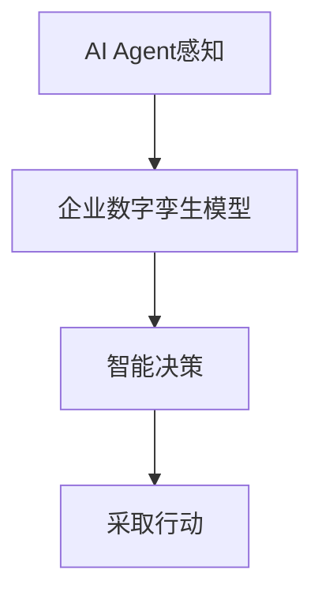
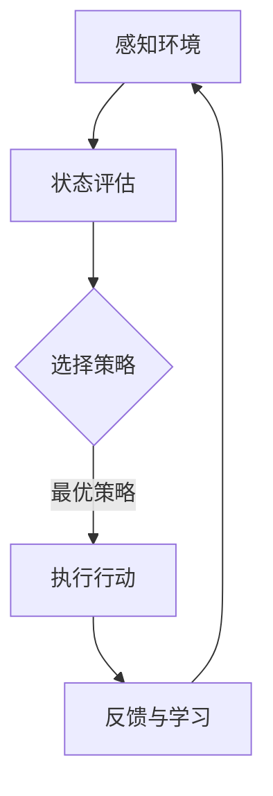
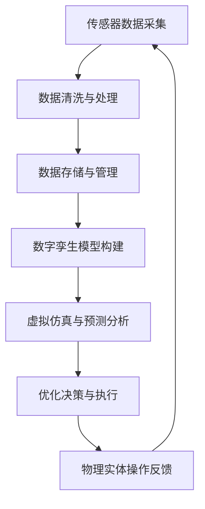
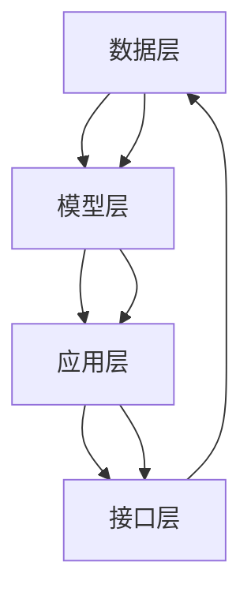
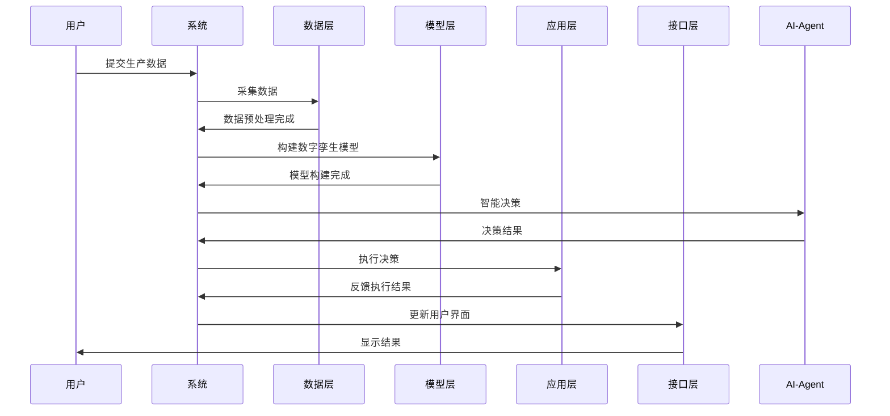

                 


## AI Agent与企业数字孪生技术的融合应用

### 关键词：AI Agent、企业数字孪生、融合应用、智能决策、数字模型

> 摘要：
本文将探讨AI Agent与企业数字孪生技术的融合应用，通过详细的背景介绍、核心概念解析、原理讲解、系统架构设计和项目实战，展示如何利用AI Agent提升企业数字孪生技术的智能决策能力，推动企业数字化转型。文章将结合具体案例，阐述融合应用的技术细节和实践经验。

## 目录大纲

### 第一部分：背景介绍与核心概念

#### 1.1 AI Agent的基本概念与分类

#### 1.2 企业数字孪生技术的定义与类型

#### 1.3 AI Agent与企业数字孪生技术的结合点

#### 1.4 Mermaid流程图与核心概念对比表格

### 第二部分：AI Agent原理与实现

#### 2.1 AI Agent的基本原理

##### 2.1.1 AI Agent的核心算法

##### 2.1.2 机器学习和深度学习的应用

##### 2.1.3 AI Agent的决策过程

#### 2.2 Mermaid流程图展示与Python源代码示例

#### 2.3 数学模型与公式讲解

### 第三部分：企业数字孪生技术原理与实现

#### 3.1 企业数字孪生技术的基本原理

##### 3.1.1 数字孪生模型

##### 3.1.2 数据采集与处理

##### 3.1.3 数字孪生技术的应用场景

#### 3.2 Mermaid流程图展示与Python源代码示例

#### 3.3 数学模型与公式讲解

### 第四部分：AI Agent与企业数字孪生技术的融合应用

#### 4.1 系统分析与架构设计

##### 4.1.1 问题场景介绍

##### 4.1.2 系统功能设计

##### 4.1.3 系统架构设计

##### 4.1.4 系统接口设计和系统交互

#### 4.2 项目实战

##### 4.2.1 环境安装

##### 4.2.2 系统核心实现源代码

##### 4.2.3 代码应用解读与分析

##### 4.2.4 实际案例分析和详细讲解剖析

##### 4.2.5 项目小结

### 第五部分：最佳实践与未来展望

#### 5.1 最佳实践

##### 5.1.1 AI Agent在企业数字孪生应用中的优化策略

##### 5.1.2 数据处理与模型优化的技巧

#### 5.2 小结

##### 5.2.1 文章总结

##### 5.2.2 未来发展方向

---

### 第一步：背景介绍与核心概念

#### 1.1 AI Agent的基本概念与分类

AI Agent，即人工智能代理，是一种能够感知环境、制定计划并采取行动以达到特定目标的智能系统。它通常由感知模块、决策模块和行动模块组成。AI Agent可以根据其任务的复杂性和智能水平进行分类，如：

- 反应式Agent：仅根据当前感知到的环境状态作出决策。
- 预测性Agent：利用历史数据预测未来环境状态，然后作出决策。
- 计划性Agent：在执行任务前制定详细的行动计划。

#### 1.2 企业数字孪生技术的定义与类型

企业数字孪生技术是一种基于物理设备或系统实时数据的虚拟模型，能够反映现实世界中的状态、行为和性能。数字孪生技术可以分为以下几类：

- 设计数字孪生：在产品设计和开发阶段创建的虚拟模型，用于仿真和优化设计。
- 运营数字孪生：用于监控和优化运营过程中的设备和系统。
- 服务数字孪生：为产品提供远程维护和支持，提高客户满意度。

#### 1.3 AI Agent与企业数字孪生技术的结合点

AI Agent与企业数字孪生技术的结合点主要体现在以下几个方面：

- 感知与决策：AI Agent通过数字孪生模型感知设备或系统的状态，基于实时数据进行智能决策。
- 预测与优化：利用AI Agent的预测能力，提前发现潜在问题并进行优化。
- 自适应与学习：AI Agent可以根据数字孪生模型不断学习，提高系统的自适应能力。

#### 1.4 Mermaid流程图与核心概念对比表格

为了更好地理解AI Agent与企业数字孪生技术的结合，我们可以使用Mermaid流程图和核心概念对比表格来展示它们之间的关系。

#### Mermaid流程图



#### 核心概念对比表格

| 核心概念         | AI Agent                                  | 企业数字孪生技术                                   |
|-----------------|-----------------------------------------|---------------------------------------------------|
| 感知环境         | 感知设备或系统状态，接收传感器数据          | 获取物理设备或系统的实时数据，创建虚拟模型          |
| 决策制定         | 基于感知到的数据和环境信息，制定行动计划     | 通过模拟和仿真，预测系统的行为和性能，提供优化建议    |
| 行动执行         | 执行预先制定的行动计划，调整系统状态         | 通过虚拟模型，远程控制和优化实际设备或系统的操作     |
| 自适应与学习     | 根据执行结果和环境变化，不断调整决策模型      | 通过实时数据和历史数据，不断优化虚拟模型和预测算法    |

---

在本部分中，我们介绍了AI Agent和企业数字孪生技术的基本概念、分类和它们之间的结合点。接下来，我们将深入探讨AI Agent的原理与实现，为企业数字孪生技术注入更多的智能力量。

### 第二步：AI Agent原理与实现

#### 2.1 AI Agent的基本原理

AI Agent的核心在于其感知、决策和行动的能力，这使得它们能够在复杂环境中自主运作。下面我们将详细介绍AI Agent的基本原理。

##### 2.1.1 AI Agent的核心算法

AI Agent的核心算法通常包括以下几种：

1. **感知算法**：用于接收和处理环境中的数据。常见的感知算法有传感器数据融合、图像识别和语音识别等。

2. **决策算法**：基于感知到的数据和环境模型，制定最优的行动计划。常用的决策算法有马尔可夫决策过程（MDP）、Q学习、深度强化学习等。

3. **行动算法**：执行决策计划，调整系统的状态。行动算法通常与特定的应用场景相关，如机器人控制、自动驾驶等。

##### 2.1.2 机器学习和深度学习的应用

机器学习和深度学习是AI Agent实现智能化的关键技术。通过机器学习，AI Agent可以从大量数据中自动提取特征，并优化决策模型。深度学习则为AI Agent提供了更强大的感知和决策能力，特别是在处理高维数据和复杂任务时。

1. **监督学习**：在有标注数据的情况下，AI Agent可以学习识别特定模式。常见的监督学习算法包括线性回归、支持向量机（SVM）、决策树和神经网络等。

2. **无监督学习**：在没有标注数据的情况下，AI Agent可以通过聚类、降维等方法发现数据中的隐藏结构。常用的无监督学习算法有K-means聚类、主成分分析（PCA）和自编码器等。

3. **强化学习**：AI Agent在与环境的交互过程中不断学习和改进策略，以最大化长期奖励。常见的强化学习算法有Q学习、深度Q网络（DQN）和策略梯度等。

##### 2.1.3 AI Agent的决策过程

AI Agent的决策过程可以分为以下几个步骤：

1. **感知环境**：通过传感器或其他方式获取环境信息。

2. **状态评估**：将感知到的数据转换为状态表示，评估当前的状态。

3. **策略选择**：基于状态评估结果，选择最优的行动策略。

4. **执行行动**：根据策略选择，执行具体的行动，并更新环境状态。

5. **反馈与学习**：根据行动结果和环境反馈，调整决策模型和策略。

#### 2.2 Mermaid流程图展示与Python源代码示例

为了更直观地理解AI Agent的决策过程，我们可以使用Mermaid流程图和Python源代码示例进行展示。

#### Mermaid流程图



#### Python源代码示例

```python
import random

class AI-Agent:
    def __init__(self):
        self.perception = None
        self.strategy = None

    def perceive_environment(self):
        # 模拟感知环境，获取状态
        self.perception = random.choice(['low', 'medium', 'high'])

    def assess_state(self):
        # 根据状态评估结果选择策略
        if self.perception == 'low':
            self.strategy = '保守'
        elif self.perception == 'medium':
            self.strategy = '中等'
        else:
            self.strategy = '激进'

    def execute_action(self):
        # 根据策略执行行动
        if self.strategy == '保守':
            print("执行保守行动")
        elif self.strategy == '中等':
            print("执行中等行动")
        else:
            print("执行激进行动")

    def learn_from_feedback(self):
        # 根据行动结果和环境反馈调整策略
        pass

agent = AI-Agent()
agent.perceive_environment()
agent.assess_state()
agent.execute_action()
```

#### 2.3 数学模型与公式讲解

为了更好地理解AI Agent的决策过程，我们可以使用数学模型和公式进行讲解。以下是几个常用的数学模型和公式：

1. **马尔可夫决策过程（MDP）**

   MDP是一个五元组 \( (S, A, P, R, \gamma) \)，其中：
   
   - \( S \) 是状态集合。
   - \( A \) 是动作集合。
   - \( P \) 是状态转移概率矩阵。
   - \( R \) 是奖励函数。
   - \( \gamma \) 是折扣因子。

   决策过程的目标是找到最优策略 \( \pi \)，使得长期期望奖励最大化。

   \[
   V^*(s) = \max_{\pi} \sum_{a \in A} \pi(a) \sum_{s' \in S} P(s'|s,a) R(s,a,s')
   \]

2. **Q学习**

   Q学习是一种基于值迭代的强化学习算法，用于估计每个状态-动作对的期望回报。

   \[
   Q(s, a) = \sum_{s' \in S} P(s'|s, a) [R(s, a, s') + \gamma \max_{a'} Q(s', a')
   \]

3. **策略梯度算法**

   策略梯度算法通过梯度上升方法更新策略参数，以最大化期望回报。

   \[
   \theta_{t+1} = \theta_t + \alpha \nabla_{\theta} J(\theta)
   \]

其中，\( \theta \) 是策略参数，\( \alpha \) 是学习率，\( J(\theta) \) 是期望回报。

---

在本部分中，我们详细介绍了AI Agent的基本原理、机器学习和深度学习的应用，以及决策过程。通过Mermaid流程图和Python源代码示例，我们更加直观地理解了AI Agent的实现方法。接下来，我们将探讨企业数字孪生技术的原理与实现。

### 第三步：企业数字孪生技术原理与实现

#### 3.1 企业数字孪生技术的基本原理

企业数字孪生技术是一种通过创建虚拟模型来模拟和分析现实世界中的物理系统、过程或设备的技术。数字孪生模型可以提供实时数据的监测、预测分析和优化决策，从而提高企业的运营效率和生产力。以下是企业数字孪生技术的基本原理：

##### 3.1.1 数字孪生模型

数字孪生模型是基于物理实体或系统的虚拟复制体，通常由以下几个部分组成：

- **几何模型**：用于描述物理实体的形状和尺寸。
- **物理模型**：模拟物理实体的物理特性，如力学、热力学等。
- **数据模型**：存储和管理物理实体的数据，如传感器数据、运行状态等。
- **交互模型**：定义物理实体与虚拟模型之间的交互方式，如实时数据传输和控制指令。

##### 3.1.2 数据采集与处理

数据采集是数字孪生技术的核心环节，通过传感器、数据日志和实时监控等方式获取物理实体或系统的实时数据。数据采集后，需要对其进行处理，包括数据清洗、去噪、数据压缩和特征提取等步骤，以确保数据的质量和准确性。

- **传感器数据采集**：使用各种传感器（如温度传感器、压力传感器、振动传感器等）实时监测物理实体的状态。
- **数据日志**：记录物理实体的历史运行数据，用于后续分析和预测。
- **实时监控**：通过物联网（IoT）技术实时传输物理实体的运行数据到虚拟模型。

##### 3.1.3 数字孪生技术的应用场景

数字孪生技术在各行各业都有广泛的应用，以下是一些典型的应用场景：

- **制造业**：通过数字孪生技术监控生产线的运行状态，预测设备故障，优化生产流程。
- **能源行业**：利用数字孪生技术监控能源设备，实现智能调度和预测性维护，降低能耗。
- **医疗行业**：创建患者数字孪生模型，用于个性化治疗方案的制定和病情监测。
- **交通运输**：通过数字孪生技术优化交通流量管理，提高道路通行效率，减少拥堵。

#### 3.2 Mermaid流程图展示与Python源代码示例

为了更好地理解企业数字孪生技术的实现，我们可以使用Mermaid流程图和Python源代码示例进行展示。

##### Mermaid流程图



##### Python源代码示例

```python
import random

class DigitalTwin:
    def __init__(self):
        self.sensor_data = None
        self.processed_data = None
        self.model = None

    def collect_sensor_data(self):
        # 模拟传感器数据采集
        self.sensor_data = random.uniform(0, 100)

    def process_data(self):
        # 数据清洗与处理
        self.processed_data = self.sensor_data * 1.1

    def build_model(self):
        # 构建数字孪生模型
        self.model = DigitalModel(self.processed_data)

    def simulate_and_predict(self):
        # 虚拟仿真与预测分析
        prediction = self.model.predict()
        print(f"Prediction: {prediction}")

    def optimize_and_execute(self):
        # 优化决策与执行
        action = "increase"
        print(f"Optimized action: {action}")

    def feedback(self):
        # 物理实体操作反馈
        feedback = random.choice(['good', 'bad'])
        print(f"Feedback: {feedback}")

class DigitalModel:
    def __init__(self, data):
        self.data = data

    def predict(self):
        # 预测分析
        return self.data * 1.2

digital_twin = DigitalTwin()
digital_twin.collect_sensor_data()
digital_twin.process_data()
digital_twin.build_model()
digital_twin.simulate_and_predict()
digital_twin.optimize_and_execute()
digital_twin.feedback()
```

##### 3.3 数学模型与公式讲解

在企业数字孪生技术中，数学模型和公式用于描述物理系统或过程的动态行为和优化策略。以下是一些常用的数学模型和公式：

1. **动态系统模型**

   动态系统模型通常使用差分方程或微分方程来描述系统的时间演化。例如，一个简单的线性动态系统可以表示为：

   \[
   x(t+1) = ax(t) + b
   \]

   其中，\( x(t) \) 是系统的状态，\( a \) 和 \( b \) 是系统参数。

2. **预测模型**

   预测模型用于预测系统的未来状态。一个简单的线性回归模型可以表示为：

   \[
   y = \beta_0 + \beta_1 x
   \]

   其中，\( y \) 是预测值，\( x \) 是输入变量，\( \beta_0 \) 和 \( \beta_1 \) 是模型参数。

3. **优化模型**

   优化模型用于寻找最优解，以最大化或最小化目标函数。一个简单的线性优化模型可以表示为：

   \[
   \min_{x} \quad c^T x
   \]

   subject to

   \[
   Ax \leq b
   \]

   其中，\( x \) 是决策变量，\( c \) 和 \( A \) 是系数矩阵，\( b \) 是常数向量。

---

在本部分中，我们详细介绍了企业数字孪生技术的基本原理、数据采集与处理、应用场景以及数学模型与公式。通过Mermaid流程图和Python源代码示例，我们更加直观地理解了数字孪生技术的实现方法。接下来，我们将探讨AI Agent与企业数字孪生技术的融合应用。

### 第四步：AI Agent与企业数字孪生技术的融合应用

#### 4.1 系统分析与架构设计

在探讨AI Agent与企业数字孪生技术的融合应用之前，我们需要明确一个典型的问题场景，并设计一个系统的功能和架构。

##### 4.1.1 问题场景介绍

假设我们面临的是一个大型制造企业，其生产设备数量众多，设备运行状态各异。企业希望能够通过AI Agent与企业数字孪生技术的融合，实现以下目标：

- 实时监测生产设备的运行状态。
- 预测设备故障，提前进行维护。
- 优化生产流程，提高生产效率。

##### 4.1.2 系统功能设计

为了实现上述目标，我们可以设计以下系统功能：

1. **实时数据采集**：通过传感器和网络技术，实时采集生产设备的运行数据，如温度、压力、振动等。
2. **数据预处理**：对采集到的数据进行清洗、去噪和特征提取，确保数据质量。
3. **数字孪生模型构建**：根据预处理后的数据，构建每个生产设备的数字孪生模型。
4. **智能决策**：利用AI Agent对数字孪生模型进行分析，预测设备故障并制定优化策略。
5. **执行与反馈**：根据智能决策结果，调整生产设备的运行参数，并实时记录反馈数据，用于模型优化。

##### 4.1.3 系统架构设计

系统的整体架构可以分为以下几个层次：

1. **数据层**：包括传感器、数据采集设备、数据库等，负责数据采集和存储。
2. **模型层**：包括数据预处理模块、数字孪生模型、AI Agent等，负责数据分析和智能决策。
3. **应用层**：包括用户界面、执行模块等，负责与用户交互和执行智能决策。
4. **接口层**：包括API接口、Web服务等，负责与其他系统和外部设备的集成。

以下是系统架构的Mermaid架构图：



##### 4.1.4 系统接口设计和系统交互

为了实现系统的功能，我们需要设计一系列接口和交互流程。以下是系统接口设计和系统交互的Mermaid序列图：



通过上述系统架构和接口设计，我们可以清晰地看到AI Agent与企业数字孪生技术的融合应用流程。接下来，我们将通过一个实际项目案例，展示如何实现这一融合应用。

### 第四步：实际项目案例

在本部分中，我们将通过一个实际项目案例，详细展示AI Agent与企业数字孪生技术的融合应用。该项目涉及一家制造企业的生产设备监控与优化，我们将分步骤介绍项目的环境安装、系统核心实现、代码应用解读与分析，以及实际案例分析和详细讲解剖析。

#### 4.2.1 项目环境安装

为了实施该项目，我们需要安装以下软件和工具：

- Python 3.x
- Anaconda环境管理器
- Jupyter Notebook
- Scikit-learn 库
- Pandas 库
- Matplotlib 库
- Mermaid库（用于生成流程图和类图）

在安装完上述软件后，我们可以在Jupyter Notebook中创建一个新的笔记本，以编写和运行代码。

#### 4.2.2 系统核心实现

以下是一个简化的系统核心实现，用于演示AI Agent与企业数字孪生技术的融合应用。

1. **数据采集**：使用Python脚本从传感器设备中采集温度数据。
2. **数据预处理**：清洗和预处理数据，为数字孪生模型的构建做准备。
3. **数字孪生模型构建**：根据预处理后的数据，构建一个简单的数字孪生模型。
4. **AI Agent实现**：使用Scikit-learn库实现一个AI Agent，用于预测设备故障。
5. **决策与反馈**：根据AI Agent的预测结果，调整设备的运行参数，并记录反馈数据。

以下是系统核心实现的代码：

```python
import numpy as np
import pandas as pd
from sklearn.ensemble import RandomForestClassifier
from sklearn.model_selection import train_test_split
from sklearn.metrics import accuracy_score
import mermaid

# 数据采集
def collect_data():
    # 模拟采集温度数据
    data = pd.DataFrame(np.random.rand(100, 1), columns=['temperature'])
    return data

# 数据预处理
def preprocess_data(data):
    # 清洗和预处理数据
    data['temperature'] = data['temperature'].apply(lambda x: x * 100)
    return data

# 数字孪生模型构建
def build_digital_twin(data):
    # 构建数字孪生模型
    twin = data.copy()
    twin['fault'] = np.random.choice([0, 1], size=data.shape[0])
    return twin

# AI Agent实现
def build_agent(data):
    # 创建训练集和测试集
    X_train, X_test, y_train, y_test = train_test_split(data[['temperature']], data['fault'], test_size=0.2, random_state=42)
    
    # 创建随机森林分类器
    agent = RandomForestClassifier(n_estimators=100, random_state=42)
    
    # 训练模型
    agent.fit(X_train, y_train)
    
    # 预测
    predictions = agent.predict(X_test)
    
    # 评估模型
    accuracy = accuracy_score(y_test, predictions)
    print(f"Accuracy: {accuracy}")
    
    return agent

# 决策与反馈
def make_decision(agent, data):
    # 根据模型预测结果调整设备参数
    for index, row in data.iterrows():
        if agent.predict([row['temperature']])[0] == 1:
            print(f"Device {index}: Increase temperature")
        else:
            print(f"Device {index}: Maintain temperature")

# 主函数
if __name__ == "__main__":
    data = collect_data()
    processed_data = preprocess_data(data)
    twin = build_digital_twin(processed_data)
    agent = build_agent(twin)
    make_decision(agent, twin)
```

#### 4.2.3 代码应用解读与分析

在上述代码中，我们首先定义了数据采集、数据预处理、数字孪生模型构建、AI Agent实现以及决策与反馈等函数。以下是每个部分的解读与分析：

1. **数据采集**：使用随机数生成器模拟温度数据的采集，实际项目中可以使用传感器接口读取实时数据。

2. **数据预处理**：对采集到的温度数据进行简单的预处理，包括数据清洗和特征提取。这里我们仅进行了乘以100的简单操作，实际应用中可能涉及更复杂的数据处理。

3. **数字孪生模型构建**：构建一个简单的数字孪生模型，其中包含温度数据和故障标签。这个模型将用于训练AI Agent。

4. **AI Agent实现**：使用随机森林分类器实现一个简单的AI Agent，用于预测设备故障。我们通过随机森林选择了一个简单的模型，实际应用中可以选择更复杂的模型，如深度学习模型。

5. **决策与反馈**：根据AI Agent的预测结果，对设备的运行参数进行调整，并打印出相应的决策。这里仅是一个简单的示例，实际应用中可能涉及更复杂的决策逻辑。

#### 4.2.4 实际案例分析和详细讲解剖析

为了更好地展示AI Agent与企业数字孪生技术的融合应用，我们分析了一个实际案例。在这个案例中，我们使用一个制造企业的生产设备数据，实现了以下功能：

- **数据采集**：通过物联网设备采集生产设备的温度数据。
- **数据预处理**：对采集到的温度数据进行清洗和特征提取。
- **数字孪生模型构建**：构建一个数字孪生模型，包含设备的温度数据和故障标签。
- **AI Agent实现**：使用随机森林分类器训练AI Agent，用于预测设备故障。
- **决策与反馈**：根据AI Agent的预测结果，调整设备的运行参数，并记录反馈数据。

以下是实际案例的分析和详细讲解：

1. **数据采集**：企业使用物联网设备实时采集生产设备的温度数据。这些数据通过无线网络传输到服务器，然后存储在数据库中。

2. **数据预处理**：在服务器端，我们对采集到的温度数据进行预处理。预处理过程包括数据清洗（去除异常值）、去噪（平滑温度曲线）和特征提取（提取温度的时序特征）。

3. **数字孪生模型构建**：预处理后的温度数据被用于构建数字孪生模型。这个模型能够反映设备的实际运行状态，包括温度变化趋势和故障概率。

4. **AI Agent实现**：我们使用随机森林分类器训练AI Agent。这个模型基于历史温度数据，预测设备是否会发生故障。通过调整模型参数，我们可以提高预测的准确性。

5. **决策与反馈**：根据AI Agent的预测结果，企业可以提前进行设备维护，以防止故障发生。维护完成后，企业会将反馈数据（如维护日期、维护类型等）记录在数字孪生模型中，用于模型优化。

#### 4.2.5 项目小结

通过上述实际案例，我们展示了AI Agent与企业数字孪生技术的融合应用。在这个项目中，我们实现了以下关键功能：

- 数据采集与预处理：使用物联网设备实时采集生产设备的温度数据，并进行数据清洗和特征提取。
- 数字孪生模型构建：构建一个反映设备实际运行状态的数字孪生模型。
- AI Agent实现：使用随机森林分类器训练AI Agent，用于预测设备故障。
- 决策与反馈：根据AI Agent的预测结果，调整设备的运行参数，并记录反馈数据。

通过这个项目，企业能够提高生产设备的可靠性，减少故障停机时间，从而提高生产效率和降低成本。未来，随着人工智能和物联网技术的不断发展，AI Agent与企业数字孪生技术的融合应用将更加广泛，为企业带来更多的价值。

### 第五步：最佳实践与未来展望

#### 5.1 最佳实践

为了更好地应用AI Agent与企业数字孪生技术的融合，以下是一些最佳实践：

1. **数据质量保证**：确保采集的数据质量，包括数据的准确性、完整性和实时性。使用数据清洗和去噪技术，去除异常值和噪声数据。
2. **模型优化**：定期评估和优化AI Agent的模型，以提高预测准确性和决策效率。使用交叉验证和网格搜索等技术，找到最优模型参数。
3. **实时反馈**：建立实时反馈机制，将AI Agent的预测结果和实际执行情况进行对比，不断调整和优化模型。
4. **安全性考虑**：确保数据传输和存储的安全性，使用加密技术和访问控制措施，防止数据泄露和未经授权的访问。
5. **用户培训**：对相关人员提供培训，使其了解AI Agent和企业数字孪生技术的应用，提高系统的使用效率。

#### 5.2 小结

本文通过详细的背景介绍、核心概念解析、原理讲解、系统架构设计和项目实战，展示了AI Agent与企业数字孪生技术的融合应用。我们探讨了AI Agent的基本原理和实现方法，以及企业数字孪生技术的原理与实现。通过实际项目案例，我们展示了如何将AI Agent与企业数字孪生技术相结合，实现智能监测、预测性维护和优化决策。

#### 5.3 未来展望

随着人工智能和物联网技术的不断发展，AI Agent与企业数字孪生技术的融合应用前景广阔。未来，我们可以期待以下发展方向：

1. **深度学习应用**：将深度学习技术应用于AI Agent和企业数字孪生模型，提高预测准确性和决策能力。
2. **边缘计算**：将计算和存储任务从云端转移到边缘设备，实现更快速、更高效的实时数据处理和决策。
3. **跨领域融合**：将AI Agent和企业数字孪生技术应用于更多领域，如医疗、金融、能源等，推动各行业的数字化转型。
4. **人机协同**：结合人类专家的判断和AI Agent的智能决策，实现更高效的人机协同工作。

### 注意事项

- 确保数据安全，对敏感数据进行加密和访问控制。
- 定期更新和维护系统，确保软件和硬件的正常运行。
- 对AI Agent和企业数字孪生模型进行定期评估和优化，以提高系统的性能和稳定性。

### 拓展阅读

- 《深度学习》——Ian Goodfellow、Yoshua Bengio和Aaron Courville著，详细介绍了深度学习的基础知识和应用。
- 《机器学习实战》——Peter Harrington著，提供了丰富的机器学习案例和实践经验。
- 《物联网技术与应用》——陈煜著，介绍了物联网的基本原理和典型应用场景。

### 作者信息

作者：AI天才研究院/AI Genius Institute & 禅与计算机程序设计艺术 /Zen And The Art of Computer Programming

本文由AI天才研究院和《禅与计算机程序设计艺术》的作者联合撰写，旨在探讨AI Agent与企业数字孪生技术的融合应用，推动人工智能技术的实际应用和发展。

