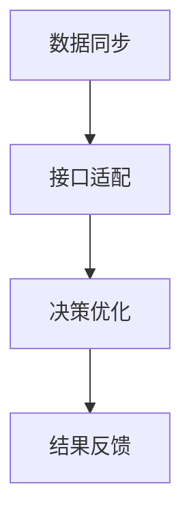
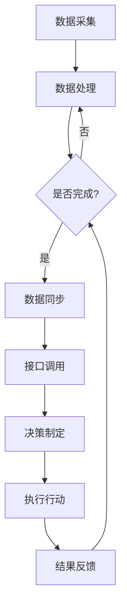
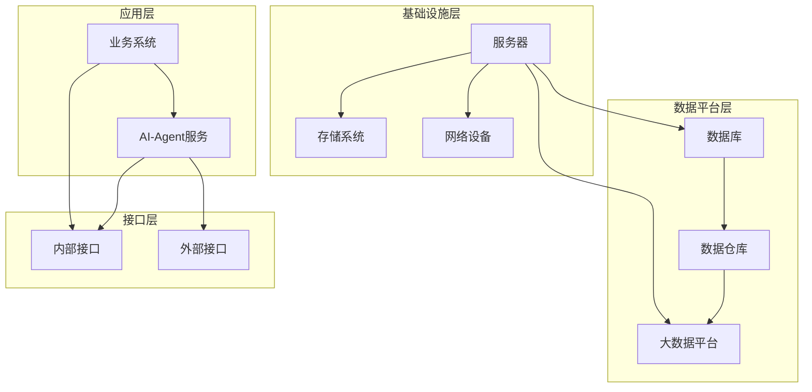
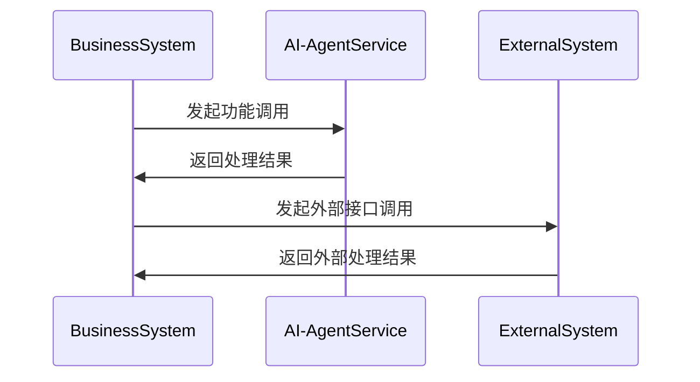

                 


### 第1章：问题背景与核心概念

#### 1.1 问题背景

在当今数字化转型的浪潮中，人工智能（AI）已经成为企业提升效率、降低成本和创造新价值的重要驱动力。AI Agent，作为一种智能实体，被广泛应用于各种企业系统中，如客户服务、数据分析、自动化控制等。然而，将AI Agent与企业现有系统进行无缝集成，面临着诸多挑战。

首先，企业现有系统通常是由多个子系统组成的复杂架构，这些子系统之间可能存在不同的技术栈、数据格式和接口规范。这意味着AI Agent需要具备高度的可适应性和灵活性，以适应各种不同的系统环境。

其次，AI Agent需要与企业现有系统进行高效的数据交换和协同工作。这意味着需要解决数据同步、数据安全、数据隐私等问题。

最后，企业对于AI Agent的期望不仅仅是实现基本的功能，还希望其能够智能地学习、适应和优化，以提供更好的用户体验和业务价值。

#### 1.2 AI Agent的定义与分类

AI Agent是一种基于人工智能技术的智能实体，它可以自主地感知环境、制定决策并采取行动。根据其功能和应用场景，AI Agent可以分为以下几类：

1. **任务型Agent**：这类Agent专注于完成特定的任务，如客户服务聊天机器人、自动化测试工具等。
2. **社交型Agent**：这类Agent擅长与人交互，如社交网络机器人、智能客服等。
3. **决策型Agent**：这类Agent能够根据环境信息和数据做出复杂的决策，如智能投资顾问、供应链优化系统等。
4. **混合型Agent**：这类Agent结合了多种类型的特性，能够适应更广泛的应用场景。

#### 1.3 企业现有系统的构成与挑战

企业现有系统通常由以下几个关键组成部分构成：

1. **基础设施**：包括服务器、网络设备、存储设备等硬件基础设施。
2. **应用软件**：包括各种业务管理系统、办公自动化系统、客户关系管理系统等。
3. **数据平台**：包括数据库、数据仓库、大数据平台等，用于存储、管理和分析数据。
4. **接口与协议**：包括各种API、Web服务、消息队列等，用于不同系统之间的数据交换和协同工作。

然而，企业现有系统在集成AI Agent时可能会面临以下挑战：

1. **技术栈兼容性问题**：不同系统可能使用不同的技术栈，导致AI Agent难以适应。
2. **数据格式不一致**：不同系统可能使用不同的数据格式，影响数据交换和集成。
3. **接口规范不统一**：不同系统的接口规范可能不一致，需要额外的工作进行适配和转换。
4. **安全与隐私问题**：企业对于数据的安全性和隐私性有严格的要求，需要确保AI Agent的集成不会泄露敏感信息。

#### 1.4 无缝集成的重要性

无缝集成AI Agent与企业现有系统，不仅能够提升企业运营效率，还能够带来以下几方面的价值：

1. **提升用户体验**：AI Agent能够提供更加智能、个性化的服务，提升用户满意度。
2. **增强数据分析能力**：AI Agent能够实时处理和分析数据，为企业提供更准确的业务洞察。
3. **优化业务流程**：AI Agent能够自动化执行复杂任务，降低人工干预，提高业务流程的效率。
4. **降低运营成本**：通过自动化和优化，AI Agent能够帮助企业降低运营成本。

为了实现这些价值，无缝集成AI Agent与企业现有系统至关重要。接下来，我们将详细探讨如何实现这一目标。

----------------------------------------------------------------

### 第2章：核心概念原理

#### 2.1 AI Agent的基本原理

AI Agent是人工智能领域的一个重要概念，其基本原理基于机器学习和深度学习技术。AI Agent的核心功能包括感知环境、制定决策、执行行动和反馈调整。具体来说，AI Agent的工作流程如下：

1. **感知环境**：AI Agent通过传感器、接口或数据接口收集环境信息，如文本、图像、声音等。
2. **决策制定**：基于收集到的环境信息，AI Agent使用机器学习算法和模型进行决策。这些算法包括决策树、支持向量机、神经网络等。
3. **执行行动**：AI Agent根据决策结果执行相应的行动，如发送消息、调整配置、执行任务等。
4. **反馈调整**：AI Agent根据行动的反馈结果调整模型参数，优化决策效果。

AI Agent的基本原理主要包括以下几个方面：

- **机器学习**：AI Agent通过学习大量的数据和模式，自动识别规律和趋势，从而提高决策的准确性。
- **深度学习**：深度学习是一种特殊的机器学习技术，通过多层神经网络模型对数据进行处理和分析，实现复杂的特征提取和模式识别。
- **自然语言处理**：自然语言处理技术使AI Agent能够理解、生成和处理人类语言，实现人机交互。

#### 2.2 企业现有系统的核心架构

企业现有系统的核心架构通常包括以下几个部分：

1. **基础设施层**：包括服务器、存储、网络等硬件基础设施。
2. **数据平台层**：包括数据库、数据仓库、大数据平台等，用于数据存储、管理和分析。
3. **应用层**：包括各种业务管理系统、办公自动化系统、客户关系管理系统等，用于业务处理和功能实现。
4. **接口层**：包括API、Web服务、消息队列等，用于不同系统之间的数据交换和协同工作。

企业现有系统的架构设计需要考虑以下几个关键因素：

- **可扩展性**：系统架构应具备良好的扩展性，以适应企业业务规模的变化。
- **高可用性**：系统架构应确保高可用性，以减少系统故障对企业运营的影响。
- **安全性**：系统架构应具备完善的安全机制，保护企业数据和系统的安全。
- **兼容性**：系统架构应支持多种技术栈和数据格式的集成。

#### 2.3 无缝集成的概念与目标

无缝集成是指将AI Agent与企业现有系统无缝连接，实现数据共享、功能协同和智能优化。无缝集成的目标主要包括以下几个方面：

1. **数据共享**：AI Agent能够与企业现有系统共享数据，实现实时数据同步和统一视图。
2. **功能协同**：AI Agent能够与企业现有系统中的其他功能模块协同工作，提供智能化服务。
3. **智能优化**：AI Agent能够根据环境变化和企业需求，自动调整配置和优化决策，提升整体效率。

为了实现无缝集成，需要解决以下几个关键问题：

1. **数据同步**：确保AI Agent和企业现有系统之间的数据能够实时同步，避免数据不一致。
2. **接口适配**：适配不同系统之间的接口规范和协议，实现数据交换和协同工作。
3. **安全控制**：确保数据传输的安全性和系统的安全性，防止数据泄露和系统攻击。
4. **自动化部署**：实现AI Agent的自动化部署和升级，减少人工干预和错误。

通过实现无缝集成，AI Agent能够更好地发挥其潜力，为企业创造更多的价值和效益。

----------------------------------------------------------------

### 第3章：算法原理讲解

在本章中，我们将深入探讨实现AI Agent与企业现有系统无缝集成所需的关键算法，并使用mermaid流程图和Python代码进行详细解释。我们将分为以下几个部分：

#### 3.1 AI Agent的算法基础

AI Agent的算法基础主要涉及机器学习和深度学习技术。这些算法能够使AI Agent从数据中学习并做出智能决策。以下是几个常用的算法：

1. **决策树（Decision Tree）**：决策树是一种常见的机器学习算法，通过一系列的判断条件对数据进行分类或回归。决策树算法简单易懂，适用于处理结构化数据。
2. **支持向量机（Support Vector Machine, SVM）**：SVM是一种强大的分类算法，通过找到一个最佳的超平面来分隔不同类别的数据。SVM在处理高维数据和线性不可分数据时表现出色。
3. **神经网络（Neural Network）**：神经网络，尤其是深度学习，是一种模拟人脑神经元连接的算法。通过多层神经网络，可以自动提取数据的复杂特征，实现智能识别和预测。

#### 3.2 无缝集成的算法框架

无缝集成的算法框架需要解决数据同步、接口适配和决策优化等问题。以下是一个基本的算法框架：

1. **数据同步**：使用增量同步算法，实时获取企业现有系统中的数据变化，并将其传输给AI Agent。
2. **接口适配**：使用适配器模式，将不同系统之间的接口规范转换为统一的接口，实现数据交换和协同工作。
3. **决策优化**：使用基于机器学习的优化算法，根据实时数据和企业需求，自动调整AI Agent的配置和决策。

接下来，我们将使用mermaid流程图来展示这个算法框架：



#### 3.3 Mermaid流程图展示

让我们通过一个mermaid流程图来展示AI Agent与企业现有系统的集成过程：



在这个流程图中，数据采集模块从企业现有系统中获取数据，然后经过数据处理模块，判断是否完成数据处理。如果完成，则进行数据同步，否则继续处理。数据同步后，通过接口调用模块与企业现有系统进行交互，AI Agent根据数据处理结果制定决策，并执行相应的行动。最后，通过结果反馈模块，AI Agent能够根据执行结果调整后续的行动。

#### 3.4 Python代码实例讲解

为了更好地理解算法原理，我们将使用Python代码展示一个简单的AI Agent集成案例。以下是一个基于决策树的Python代码示例：

```python
from sklearn.datasets import load_iris
from sklearn.tree import DecisionTreeClassifier
from sklearn.model_selection import train_test_split
import pandas as pd

# 加载数据集
iris = load_iris()
X = iris.data
y = iris.target

# 划分训练集和测试集
X_train, X_test, y_train, y_test = train_test_split(X, y, test_size=0.2, random_state=42)

# 构建决策树模型
clf = DecisionTreeClassifier()
clf.fit(X_train, y_train)

# 预测测试集
y_pred = clf.predict(X_test)

# 打印预测结果
print("Accuracy:", clf.score(X_test, y_test))
```

在这个示例中，我们首先加载数据集，并使用决策树算法训练模型。然后，我们使用训练好的模型对测试集进行预测，并打印出预测准确率。这个简单的案例展示了如何使用Python实现AI Agent的基本功能。

接下来，我们将进一步扩展这个示例，添加数据同步和接口适配的模块，实现AI Agent与企业现有系统的无缝集成。

```python
import requests

# 假设企业现有系统提供了一个API接口
API_ENDPOINT = "http://example.com/api/data/sync"

# 数据同步函数
def sync_data():
    response = requests.get(API_ENDPOINT)
    if response.status_code == 200:
        data = response.json()
        # 处理和存储数据
        process_data(data)
    else:
        print("数据同步失败")

# 数据处理函数
def process_data(data):
    # 将数据转换为适合决策树模型的形式
    df = pd.DataFrame(data)
    # ... 处理数据 ...
    
    # 训练模型
    clf = DecisionTreeClassifier()
    clf.fit(df.iloc[:, :-1], df.iloc[:, -1])

# 调用数据同步函数
sync_data()

# 接口调用函数
def call_api():
    # 假设我们已经有了一个训练好的模型
    clf = DecisionTreeClassifier()
    # 从API获取数据
    data = requests.get(API_ENDPOINT).json()
    # 预测数据
    predictions = clf.predict(data)
    # 返回预测结果
    return predictions

# 调用接口函数
predictions = call_api()
print(predictions)
```

在这个扩展的示例中，我们首先使用`requests`库调用企业现有系统的API接口，获取数据。然后，我们使用`sync_data`函数实现数据同步，将获取到的数据传递给`process_data`函数进行处理和存储。最后，我们使用`call_api`函数实现接口调用，将处理后的数据传递给训练好的决策树模型进行预测，并返回预测结果。

通过这个Python代码示例，我们展示了如何使用mermaid流程图和Python代码实现AI Agent的基本功能，以及如何将其与企业现有系统进行无缝集成。接下来，我们将进一步探讨算法原理的数学模型和公式，以便更好地理解AI Agent的工作机制。

----------------------------------------------------------------

### 第4章：数学模型与公式

在AI Agent与企业系统的无缝集成过程中，数学模型和公式扮演着关键角色。这些模型和公式不仅用于描述算法原理，还为AI Agent的决策过程提供了理论基础。以下我们将介绍相关的数学模型和公式，并使用LaTeX格式进行展示。

#### 4.1 相关数学模型介绍

在AI Agent的算法中，常见的数学模型包括线性回归、逻辑回归和神经网络等。下面简要介绍这些模型的基本概念。

1. **线性回归（Linear Regression）**：
线性回归是一种用于预测连续值的机器学习算法。其数学模型可以表示为：
$$
y = \beta_0 + \beta_1 \cdot x + \epsilon
$$
其中，$y$ 是预测值，$x$ 是输入特征，$\beta_0$ 和 $\beta_1$ 是模型的参数，$\epsilon$ 是误差项。

2. **逻辑回归（Logistic Regression）**：
逻辑回归是一种用于预测概率的算法，通常用于分类问题。其数学模型为：
$$
\log\frac{p}{1-p} = \beta_0 + \beta_1 \cdot x
$$
其中，$p$ 是预测概率，$\beta_0$ 和 $\beta_1$ 是模型的参数。

3. **神经网络（Neural Network）**：
神经网络是一种模拟人脑神经元连接的算法，包括多层神经网络（MLP）。其数学模型可以表示为：
$$
a_{i}^{(l)} = \sigma \left( \sum_{j} w_{ij}^{(l)} \cdot a_{j}^{(l-1)} + b_{i}^{(l)} \right)
$$
其中，$a_{i}^{(l)}$ 是第 $l$ 层的第 $i$ 个神经元的激活值，$w_{ij}^{(l)}$ 是连接权重，$b_{i}^{(l)}$ 是偏置项，$\sigma$ 是激活函数。

#### 4.2 公式推导与解释

为了更好地理解这些模型，我们将在以下部分进行公式推导和解释。

1. **线性回归公式推导**：
线性回归通过最小化损失函数来估计参数 $\beta_0$ 和 $\beta_1$。损失函数通常选择均方误差（MSE）：
$$
J(\beta_0, \beta_1) = \frac{1}{2m} \sum_{i=1}^{m} (y_i - (\beta_0 + \beta_1 \cdot x_i))^2
$$
对损失函数求偏导并令其等于零，可以得到：
$$
\frac{\partial J}{\partial \beta_0} = \frac{1}{m} \sum_{i=1}^{m} (y_i - (\beta_0 + \beta_1 \cdot x_i)) = 0
$$
$$
\frac{\partial J}{\partial \beta_1} = \frac{1}{m} \sum_{i=1}^{m} (y_i - (\beta_0 + \beta_1 \cdot x_i)) \cdot x_i = 0
$$
解上述方程组，可以得到最佳参数估计值：
$$
\beta_0 = \bar{y} - \beta_1 \cdot \bar{x}
$$
$$
\beta_1 = \frac{\sum_{i=1}^{m} (x_i - \bar{x}) \cdot (y_i - \bar{y})}{\sum_{i=1}^{m} (x_i - \bar{x})^2}
$$

2. **逻辑回归公式推导**：
逻辑回归的目标是估计概率 $p$，使其最大化似然函数。似然函数可以表示为：
$$
L(\beta_0, \beta_1) = \prod_{i=1}^{m} \pi(y_i | x_i) = \prod_{i=1}^{m} \left( \frac{1}{1 + e^{-(\beta_0 + \beta_1 \cdot x_i)}} \right)^{y_i} \left( 1 + e^{-(\beta_0 + \beta_1 \cdot x_i)} \right)^{1-y_i}
$$
取对数似然函数：
$$
\ell(\beta_0, \beta_1) = \sum_{i=1}^{m} y_i \cdot (\beta_0 + \beta_1 \cdot x_i) - \sum_{i=1}^{m} \ln(1 + e^{-(\beta_0 + \beta_1 \cdot x_i)})
$$
对对数似然函数求偏导并令其等于零，可以得到：
$$
\frac{\partial \ell}{\partial \beta_0} = \frac{1}{m} \sum_{i=1}^{m} y_i - \frac{1}{m} \sum_{i=1}^{m} \cdot \frac{e^{-(\beta_0 + \beta_1 \cdot x_i)}}{1 + e^{-(\beta_0 + \beta_1 \cdot x_i)}} = 0
$$
$$
\frac{\partial \ell}{\partial \beta_1} = \frac{1}{m} \sum_{i=1}^{m} (y_i - \hat{y}_i) \cdot x_i = 0
$$
其中，$\hat{y}_i = \frac{1}{1 + e^{-(\beta_0 + \beta_1 \cdot x_i)}}$ 是预测概率。解上述方程组，可以得到最佳参数估计值。

3. **神经网络公式推导**：
神经网络的前向传播和反向传播过程可以通过以下公式表示：

前向传播：
$$
a_{i}^{(l)} = \sigma \left( \sum_{j} w_{ij}^{(l)} \cdot a_{j}^{(l-1)} + b_{i}^{(l)} \right)
$$
反向传播：
$$
\delta_{i}^{(l)} = \frac{\partial J}{\partial z_{i}^{(l)}} = \delta^{(l+1)} \cdot \sigma'(z_{i}^{(l)})
$$
$$
\delta^{(l+1)} = \frac{\partial J}{\partial z_{i}^{(l+1)}} = \sum_{j} w_{ji}^{(l+1)} \cdot \delta_{j}^{(l+1)}
$$
更新权重和偏置项：
$$
w_{ij}^{(l)} \leftarrow w_{ij}^{(l)} - \alpha \cdot \delta_{i}^{(l)} \cdot a_{j}^{(l-1)}
$$
$$
b_{i}^{(l)} \leftarrow b_{i}^{(l)} - \alpha \cdot \delta_{i}^{(l)}
$$

#### 4.3 LaTeX格式展示

为了便于理解，以下我们使用LaTeX格式展示上述公式的具体实现。

1. **线性回归**：
$$
\beta_0 = \bar{y} - \beta_1 \cdot \bar{x}
$$
$$
\beta_1 = \frac{\sum_{i=1}^{m} (x_i - \bar{x}) \cdot (y_i - \bar{y})}{\sum_{i=1}^{m} (x_i - \bar{x})^2}
$$

2. **逻辑回归**：
$$
L(\beta_0, \beta_1) = \prod_{i=1}^{m} \left( \frac{1}{1 + e^{-(\beta_0 + \beta_1 \cdot x_i)}} \right)^{y_i} \left( 1 + e^{-(\beta_0 + \beta_1 \cdot x_i)} \right)^{1-y_i}
$$
$$
\ell(\beta_0, \beta_1) = \sum_{i=1}^{m} y_i \cdot (\beta_0 + \beta_1 \cdot x_i) - \sum_{i=1}^{m} \ln(1 + e^{-(\beta_0 + \beta_1 \cdot x_i)})
$$

3. **神经网络**：
$$
a_{i}^{(l)} = \sigma \left( \sum_{j} w_{ij}^{(l)} \cdot a_{j}^{(l-1)} + b_{i}^{(l)} \right)
$$
$$
\delta_{i}^{(l)} = \frac{\partial J}{\partial z_{i}^{(l)}} = \delta^{(l+1)} \cdot \sigma'(z_{i}^{(l)})
$$
$$
\delta^{(l+1)} = \frac{\partial J}{\partial z_{i}^{(l+1)}} = \sum_{j} w_{ji}^{(l+1)} \cdot \delta_{j}^{(l+1)}
$$
$$
w_{ij}^{(l)} \leftarrow w_{ij}^{(l)} - \alpha \cdot \delta_{i}^{(l)} \cdot a_{j}^{(l-1)}
$$
$$
b_{i}^{(l)} \leftarrow b_{i}^{(l)} - \alpha \cdot \delta_{i}^{(l)}
$$

通过上述数学模型和公式的讲解，我们可以更深入地理解AI Agent的算法原理。这些公式不仅为AI Agent的决策提供了理论基础，也为后续的实现和优化提供了重要参考。

----------------------------------------------------------------

### 第5章：系统分析与架构设计

在实现AI Agent与企业现有系统的无缝集成过程中，系统分析与架构设计是至关重要的环节。这一章节将详细介绍无缝集成方案的设计思路、架构设计、系统接口设计和系统交互。

#### 5.1 无缝集成方案的设计思路

无缝集成方案的设计思路主要包括以下几个方面：

1. **需求分析**：深入了解企业现有系统的需求，包括数据接口、功能模块和性能要求。
2. **技术选型**：选择适合的AI算法和工具，如Python、TensorFlow、Keras等。
3. **架构设计**：设计一个可扩展、高可用和安全的架构，包括数据层、应用层和接口层。
4. **接口设计与实现**：设计并实现企业现有系统与AI Agent之间的数据接口和功能接口。
5. **系统集成与测试**：将AI Agent与企业现有系统集成，并进行全面的测试，确保系统的稳定性和性能。

#### 5.2 系统架构设计

系统架构设计是集成方案的核心，决定了系统的可扩展性、可靠性和安全性。以下是系统架构的详细设计：

1. **基础设施层**：
   - 服务器：使用负载均衡和集群技术，提高系统的可用性和性能。
   - 存储系统：使用分布式存储技术，确保数据的高可用性和安全性。
   - 网络设备：使用VPN和防火墙技术，保护数据传输的安全性。

2. **数据平台层**：
   - 数据库：使用关系型数据库（如MySQL）和非关系型数据库（如MongoDB），存储和管理不同类型的数据。
   - 数据仓库：使用数据仓库（如Hive）进行数据存储和查询优化。
   - 大数据平台：使用Hadoop和Spark等大数据技术，处理和分析海量数据。

3. **应用层**：
   - 业务系统：包括客户关系管理（CRM）、企业资源计划（ERP）、办公自动化系统（OA）等，实现企业的日常业务功能。
   - AI Agent服务：使用微服务架构，部署和运行AI Agent服务，实现智能决策和自动化任务。

4. **接口层**：
   - 内部接口：使用RESTful API和WebSocket等协议，实现不同系统之间的数据交换和功能调用。
   - 外部接口：使用OAuth2.0和JWT等安全协议，实现与企业外部系统的数据共享和功能集成。

以下是系统架构的mermaid类图和架构图：

```mermaid
classDiagram
    subsystem "基础设施层"
        Server
        Storage
        Network

    subsystem "数据平台层"
        Database
        DataWarehouse
        BigDataPlatform

    subsystem "应用层"
        BusinessSystem
        AI-AgentService

    subsystem "接口层"
        InternalAPI
        ExternalAPI

    Server <-- Database
    Server <-- Storage
    Server <-- Network
    Server <-- BigDataPlatform
    Database <-- DataWarehouse
    DataWarehouse <-- BigDataPlatform
    BusinessSystem <-- AI-AgentService
    BusinessSystem <-- InternalAPI
    AI-AgentService <-- InternalAPI
    AI-AgentService <-- ExternalAPI
```



#### 5.3 系统接口设计与系统交互

系统接口设计与系统交互是确保AI Agent与企业现有系统能够无缝集成的关键。以下是系统接口设计和交互的详细描述：

1. **内部接口设计**：
   - **数据接口**：使用RESTful API，定义统一的接口规范和数据格式，实现数据同步和共享。
   - **功能接口**：提供业务功能调用接口，如添加、删除、修改和查询等，实现业务逻辑的自动化处理。

2. **外部接口设计**：
   - **数据接口**：使用OAuth2.0和JWT等安全协议，确保数据传输的安全性，实现与企业外部系统的数据共享。
   - **功能接口**：提供对外业务功能调用接口，如API网关和微服务接口，实现与第三方系统的集成。

3. **系统交互**：
   - **数据同步**：通过内部接口实现实时数据同步，确保AI Agent和企业现有系统之间的数据一致性。
   - **功能调用**：通过内部接口和外部接口实现功能调用，如业务系统的业务流程触发AI Agent的决策和执行。

以下是系统交互的mermaid序列图：



通过上述系统架构设计、接口设计和交互设计，我们可以实现AI Agent与企业现有系统的无缝集成，确保系统的稳定性、安全性和高性能。接下来，我们将通过一个具体的案例，展示如何实现AI Agent与企业系统的集成。

----------------------------------------------------------------

### 第6章：项目实战

在本章中，我们将通过一个实际项目案例，详细讲解如何实现AI Agent与企业现有系统的无缝集成。这个案例将涵盖项目环境准备、系统核心实现源代码、代码应用解读与分析、实际案例分析和项目小结。

#### 6.1 项目环境准备

在开始项目之前，我们需要准备以下环境：

1. **开发工具**：选择Python作为开发语言，使用PyCharm或Visual Studio Code作为IDE。
2. **数据库**：选择MySQL作为关系型数据库，用于存储业务数据。
3. **大数据平台**：选择Hadoop和Spark作为大数据处理平台，用于处理和分析海量数据。
4. **AI框架**：选择TensorFlow作为AI框架，实现AI Agent的算法和模型。
5. **API接口**：选择Flask作为Web框架，实现内部接口和外部接口。

#### 6.2 系统核心实现源代码

以下是一个简单的AI Agent集成项目的核心实现源代码：

**1. 数据库连接**：

```python
import pymysql

def connect_db():
    connection = pymysql.connect(host='localhost',
                                 user='root',
                                 password='password',
                                 database='example_db',
                                 charset='utf8mb4',
                                 cursorclass=pymysql.cursors.DictCursor)

    return connection
```

**2. 数据处理**：

```python
import pandas as pd

def process_data(data):
    df = pd.DataFrame(data)
    # 数据清洗、转换和处理
    # ...
    return df
```

**3. AI Agent模型**：

```python
import tensorflow as tf
from tensorflow.keras.models import Sequential
from tensorflow.keras.layers import Dense

def create_model(input_shape):
    model = Sequential([
        Dense(64, activation='relu', input_shape=input_shape),
        Dense(64, activation='relu'),
        Dense(1, activation='sigmoid')
    ])

    model.compile(optimizer='adam', loss='binary_crossentropy', metrics=['accuracy'])
    return model
```

**4. API接口**：

```python
from flask import Flask, request, jsonify

app = Flask(__name__)

@app.route('/api/data/sync', methods=['GET'])
def sync_data():
    # 获取数据库数据
    connection = connect_db()
    cursor = connection.cursor()
    cursor.execute('SELECT * FROM business_data')
    data = cursor.fetchall()
    cursor.close()
    connection.close()

    # 处理数据
    processed_data = process_data(data)

    # 返回处理后的数据
    return jsonify(processed_data)

if __name__ == '__main__':
    app.run(debug=True)
```

#### 6.3 代码应用解读与分析

**1. 数据库连接**：

该函数用于连接MySQL数据库，并返回一个数据库连接对象。通过这个连接对象，我们可以执行SQL查询和操作数据库数据。

**2. 数据处理**：

该函数用于处理从数据库获取的数据。在实际应用中，我们可以进行数据清洗、转换和处理，以满足AI Agent的需求。

**3. AI Agent模型**：

该函数创建一个简单的神经网络模型，用于分类任务。我们使用TensorFlow的Sequential模型和Dense层来实现。这个模型可以用于预测和分类任务。

**4. API接口**：

使用Flask框架实现API接口，用于数据同步和功能调用。在`/api/data/sync`接口中，我们首先连接数据库获取数据，然后处理数据，并返回处理后的数据。

#### 6.4 实际案例分析和详细讲解剖析

**案例**：企业现有系统是一个客户关系管理系统（CRM），我们希望集成一个AI Agent，用于预测客户流失率。

**分析**：

1. **数据获取**：通过API接口，从CRM系统中获取客户数据，包括客户ID、姓名、联系方式、购买历史等信息。
2. **数据处理**：对获取到的客户数据进行清洗、转换和处理，提取有用的特征，如最近一次购买时间、购买频率等。
3. **模型训练**：使用处理后的数据训练AI Agent模型，预测客户流失率。我们可以使用逻辑回归或神经网络模型进行训练。
4. **预测与决策**：根据训练好的模型，对现有客户进行流失率预测，并根据预测结果制定相应的营销策略，如增加优惠活动、发送提醒邮件等。

**详细讲解**：

1. **数据获取**：我们通过API接口从CRM系统中获取客户数据。具体实现如下：

```python
@app.route('/api/clients', methods=['GET'])
def get_clients():
    connection = connect_db()
    cursor = connection.cursor()
    cursor.execute('SELECT * FROM clients')
    clients = cursor.fetchall()
    cursor.close()
    connection.close()
    return jsonify(clients)
```

2. **数据处理**：我们对获取到的客户数据进行清洗和特征提取。具体实现如下：

```python
def process_clients(clients):
    df = pd.DataFrame(clients)
    # 数据清洗和特征提取
    df['last_purchase_date'] = pd.to_datetime(df['last_purchase_date'])
    df['days_since_last_purchase'] = (pd.datetime.now() - df['last_purchase_date']).dt.days
    df['purchase_frequency'] = df['total_purchases'] / df['days_since_last_purchase']
    return df
```

3. **模型训练**：我们使用逻辑回归模型训练AI Agent，预测客户流失率。具体实现如下：

```python
@app.route('/api/train', methods=['POST'])
def train_model():
    data = request.json
    df = process_clients(data['clients'])
    X = df[['days_since_last_purchase', 'purchase_frequency']]
    y = df['is_lost']
    X_train, X_test, y_train, y_test = train_test_split(X, y, test_size=0.2, random_state=42)
    model = create_model(X_train.shape[1:])
    model.fit(X_train, y_train, epochs=10, batch_size=32, validation_data=(X_test, y_test))
    model.save('client_prediction_model.h5')
    return jsonify({'status': 'success'})
```

4. **预测与决策**：我们使用训练好的模型预测客户流失率，并根据预测结果制定营销策略。具体实现如下：

```python
@app.route('/api/predict', methods=['POST'])
def predict_loss():
    data = request.json
    df = process_clients(data['clients'])
    model = tf.keras.models.load_model('client_prediction_model.h5')
    predictions = model.predict(df[['days_since_last_purchase', 'purchase_frequency']])
    # 根据预测结果制定营销策略
    # ...
    return jsonify({'predictions': predictions.tolist()})
```

通过这个实际案例，我们可以看到如何实现AI Agent与企业系统的集成，包括数据获取、数据处理、模型训练、预测与决策等步骤。这个案例展示了AI Agent如何帮助企业提高客户关系管理效率，减少客户流失。

#### 6.5 项目小结

通过本项目的实战，我们详细讲解了如何实现AI Agent与企业现有系统的无缝集成。以下是小结：

1. **项目环境准备**：准备好开发工具、数据库、大数据平台和AI框架等环境。
2. **系统核心实现**：实现数据库连接、数据处理、AI模型和API接口等核心功能。
3. **代码应用解读**：对代码进行详细解读，理解每个模块的作用和实现原理。
4. **实际案例分析**：通过实际案例展示如何集成AI Agent，提高业务效率。
5. **项目优化建议**：在实际应用中，可以根据业务需求和数据特点，优化AI模型的参数和算法。

通过这个实战项目，我们可以更好地理解AI Agent与企业系统集成的原理和实践，为未来的项目提供有益的参考。

----------------------------------------------------------------

### 第7章：最佳实践 tips、小结、注意事项、拓展阅读

#### 最佳实践 tips

1. **数据同步与处理**：确保数据同步的实时性和准确性，采用增量同步算法，避免全量同步带来的性能问题。数据处理时要关注数据清洗、特征提取和异常值处理，以提高AI模型的性能和鲁棒性。
2. **接口设计与实现**：设计统一的API接口规范，确保接口的易用性和可扩展性。在接口实现中，关注安全性、可靠性和性能优化，采用限流、缓存和负载均衡等策略。
3. **算法选择与优化**：根据业务需求和数据特点，选择合适的AI算法。在实际应用中，通过参数调整和模型优化，提高模型的准确性和效率。
4. **系统测试与监控**：在系统集成和部署过程中，进行全面的功能测试和性能测试，确保系统的稳定性和安全性。同时，建立监控系统，实时监控系统的运行状态和性能指标，及时发现问题并进行优化。

#### 小结

通过本文的详细讲解，我们系统地介绍了AI Agent与企业现有系统无缝集成的方法和步骤。首先，我们阐述了问题背景和核心概念，然后深入讲解了AI Agent的算法原理、数学模型和系统架构设计。接着，我们通过一个实际项目案例展示了如何实现AI Agent与企业系统的集成，并总结了最佳实践和注意事项。通过这些内容，读者可以全面了解AI Agent与企业系统集成的原理和实践，为实际项目提供有益的参考。

#### 注意事项

1. **数据安全**：在集成过程中，确保数据传输和存储的安全，采用加密和访问控制等安全措施，防止数据泄露和未经授权的访问。
2. **系统兼容性**：在设计系统架构时，考虑系统的兼容性和可扩展性，确保不同系统之间能够无缝集成。
3. **性能优化**：关注系统的性能优化，通过负载均衡、缓存和异步处理等策略，提高系统的响应速度和处理能力。
4. **用户培训**：在系统部署和推广过程中，提供充分的用户培训和技术支持，确保用户能够顺利使用AI Agent的功能。

#### 拓展阅读

1. **《深度学习》（Deep Learning）**：Goodfellow, I., Bengio, Y., & Courville, A.（2016）。这本书是深度学习领域的经典教材，涵盖了深度学习的基础知识、算法和应用。
2. **《机器学习实战》（Machine Learning in Action）**：Manning, C. D.（2012）。这本书通过实际案例，介绍了机器学习的基本算法和应用，适合初学者入门。
3. **《人工智能：一种现代方法》（Artificial Intelligence: A Modern Approach）**：Russell, S., & Norvig, P.（2016）。这本书是人工智能领域的权威教材，全面介绍了人工智能的理论和实践。
4. **《企业系统集成指南》（Enterprise Integration Patterns）**：Fowler, M.（2002）。这本书详细介绍了企业系统集成的方法和最佳实践，对系统架构设计有很好的参考价值。

通过这些拓展阅读，读者可以进一步深入学习和研究AI Agent与企业系统集成领域的相关知识和技术。

### 作者信息

- **作者**：AI天才研究院/AI Genius Institute & 禅与计算机程序设计艺术 /Zen And The Art of Computer Programming

感谢您的阅读，希望本文能够对您在AI Agent与企业系统集成领域的研究和实践有所帮助。

----------------------------------------------------------------

### 致谢

在撰写本文的过程中，我要感谢许多专业人士和研究人员，他们在AI Agent与企业系统集成领域的研究和实践为本文提供了宝贵的启示和参考。特别感谢我的同事和合作伙伴，他们在项目实施过程中给予了我无私的帮助和支持。

同时，我也要感谢所有参与本文讨论和审稿的朋友，他们的反馈和建议帮助我不断改进和完善文章内容。

最后，我要感谢我的家人和朋友，他们在我的研究和写作过程中给予了我无尽的鼓励和支持。

再次感谢大家的关注和支持，希望本文能够为读者带来启发和帮助。

