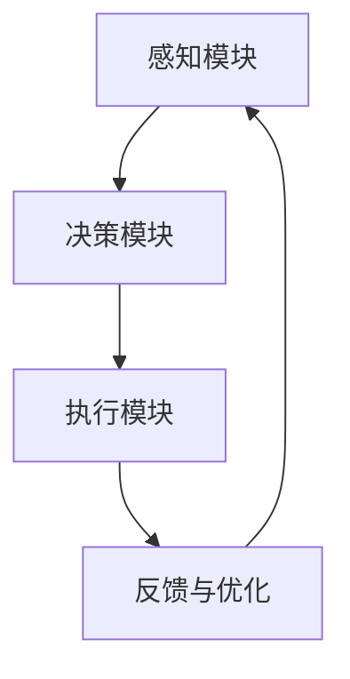
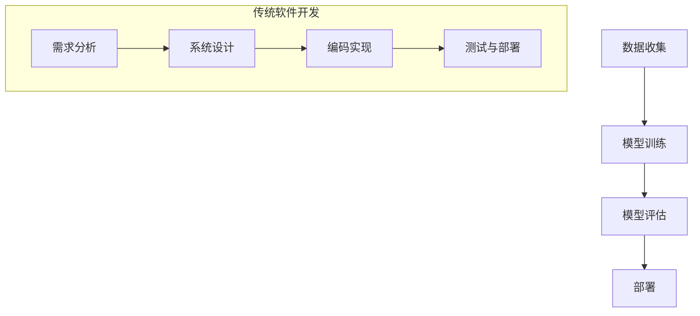

                 


# AI Agent与传统软件开发的区别

## 关键词

- AI Agent
- 软件开发
- 区别分析
- 优势与应用
- 挑战与解决方案

## 摘要

本文旨在探讨人工智能（AI）Agent与传统软件开发之间的差异，深入分析它们的核心概念、技术架构、开发流程以及应用场景。通过对AI Agent与传统软件开发的对比，本文将揭示AI Agent的优势和应用潜力，同时探讨在传统软件开发中引入AI Agent所面临的挑战及解决方案。希望通过本文，读者能够对AI Agent与传统软件开发有更深入的理解，为未来技术发展提供有益的参考。

## 第一部分：引言与背景

### 1. 引言

人工智能（AI）的发展历程可谓跌宕起伏，从最初的探索阶段到如今的广泛应用，AI技术已经取得了显著的成就。尤其是近年来，深度学习、强化学习等先进技术的突破，使得AI Agent逐渐成为研究热点。AI Agent，作为人工智能的一种重要形式，具备自主学习、自主决策和自主执行的能力，能够模拟人类思维和行为，实现智能化应用。

与此同时，传统软件开发也经历了长期的发展和完善。从早期的结构化编程到面向对象编程，从单一系统的开发到复杂系统的集成，软件开发技术在不断演进。然而，随着业务需求的日益复杂，传统软件开发逐渐暴露出一些局限，如开发周期长、维护成本高、适应性差等。在这种背景下，AI Agent作为一种新兴的技术形态，为传统软件开发带来了新的可能性。

### 2. 书籍目的

本文旨在解释AI Agent与传统软件开发的异同，探讨AI Agent的优势和应用场景，同时为开发者提供转型指南。通过本文，读者可以：

1. 了解AI Agent的基本概念、技术架构和开发环境。
2. 深入分析AI Agent与传统软件开发的区别，掌握它们各自的优势和应用场景。
3. 学习如何将AI Agent引入传统软件开发，解决实际问题和挑战。
4. 了解未来AI Agent与传统软件开发的发展趋势，为技术发展提供有益的参考。

## 第二部分：AI Agent基础知识

### 3. AI Agent基本概念

AI Agent是指具有自主性、适应性、学习能力的人工智能系统。它通常由感知模块、决策模块和执行模块组成，能够根据外部环境和内部状态，自主感知、决策和执行任务。AI Agent的核心能力包括：

- **感知能力**：通过传感器、摄像头等设备获取环境信息。
- **决策能力**：基于感知到的信息，利用算法进行决策。
- **执行能力**：根据决策结果，执行具体的任务。

AI Agent与传统软件在功能上存在显著差异。传统软件通常被动执行预定义的任务，而AI Agent则能够主动适应环境和需求，实现智能化应用。

### 4. AI Agent的技术架构

AI Agent的技术架构主要包括计算机视觉、自然语言处理和强化学习等核心技术。

- **计算机视觉**：通过图像处理和目标检测等技术，实现对图像的识别和理解。
- **自然语言处理**：通过文本分析、语义理解等技术，实现对自然语言的解析和应用。
- **强化学习**：通过试错和反馈，使AI Agent不断优化决策策略，实现智能行为。

这些核心技术相互配合，为AI Agent提供了强大的功能和灵活性。

### 5. AI Agent的开发环境与工具

AI Agent的开发环境主要包括开源框架、云计算服务和编程语言与开发工具。

- **开源框架**：如TensorFlow、PyTorch等，为开发者提供了丰富的算法库和工具。
- **云计算服务**：如Google Cloud、AWS等，为AI Agent的开发提供了强大的计算资源和数据存储。
- **编程语言与开发工具**：如Python、R语言等，为开发者提供了高效的编程工具和开发环境。

这些开发环境与工具为AI Agent的快速开发和部署提供了有力支持。

## 第三部分：传统软件开发实践

### 6. 传统软件开发的流程与方法

传统软件开发的流程通常包括需求分析、系统设计、编码实现、测试与部署等阶段。

- **需求分析**：明确软件的功能需求和性能要求。
- **系统设计**：设计软件的架构和模块，确保系统的可扩展性和可维护性。
- **编码实现**：根据设计文档，编写具体的代码实现。
- **测试与部署**：对软件进行功能测试和性能测试，确保软件的质量和稳定性。

传统软件开发的核心理念包括模块化、可重用性和可维护性。

### 7. 传统软件的开发工具与技术

传统软件的开发工具主要包括版本控制系统、集成开发环境和自动化测试工具。

- **版本控制系统**：如Git、SVN等，用于管理代码版本和协作开发。
- **集成开发环境**：如Eclipse、Visual Studio等，为开发者提供了便捷的编程和调试环境。
- **自动化测试工具**：如Selenium、JUnit等，用于自动化测试和持续集成。

这些工具和技术为传统软件开发提供了高效的开发流程和高质量保障。

## 第四部分：AI Agent与传统软件开发的区别分析

### 8. AI Agent与传统软件开发的目标差异

AI Agent与传统软件开发的目标存在显著差异。

- **AI Agent**：以实现智能化应用为核心，旨在模拟人类思维和行为，提高系统的自适应能力和智能水平。
- **传统软件**：以实现功能性和实用性为核心，旨在满足用户的需求和业务场景。

这种目标差异导致了AI Agent与传统软件开发在技术架构、开发流程和应用场景上的不同。

### 9. AI Agent与传统软件开发的方法差异

AI Agent与传统软件开发的方法也存在显著差异。

- **AI Agent**：采用数据驱动开发方法，通过大量数据的训练和优化，实现智能行为的自适应调整。
- **传统软件**：采用流程驱动开发方法，按照既定的开发流程和规范，逐步实现软件的功能和性能。

这种方法差异使得AI Agent能够更快速地适应复杂多变的环境，而传统软件在稳定性和可靠性方面具有优势。

### 10. AI Agent与传统软件开发的挑战与解决方案

在将AI Agent引入传统软件开发的过程中，面临以下挑战：

- **数据隐私与安全性**：AI Agent需要处理大量敏感数据，如何确保数据隐私和安全成为关键问题。解决方案包括数据加密、访问控制和安全审计等。
- **算法透明性与可解释性**：AI Agent的决策过程往往具有黑盒特性，难以解释和理解。如何提高算法的透明性和可解释性，以增强用户信任和监管合规性，是亟待解决的问题。
- **实时性与可扩展性**：AI Agent需要实时响应和适应复杂环境，同时具备良好的可扩展性，以满足不同规模和场景的需求。

针对这些挑战，可以通过以下解决方案进行应对：

- **数据隐私与安全性**：采用加密算法和安全协议，确保数据在传输和存储过程中的安全。同时，通过访问控制和权限管理，限制对敏感数据的访问。
- **算法透明性与可解释性**：引入可解释性算法，如决策树、线性回归等，提高算法的可解释性和透明性。同时，通过可视化工具和解释性文档，帮助用户理解和信任AI Agent的决策过程。
- **实时性与可扩展性**：采用分布式计算和并行处理技术，提高AI Agent的实时性和可扩展性。同时，通过模块化和组件化设计，确保系统在不同规模和场景下的适应性。

## 第五部分：AI Agent在传统软件开发中的应用案例

### 11. 案例研究1：聊天机器人在客服中的应用

聊天机器人在客服领域具有广泛的应用前景。通过AI Agent技术，聊天机器人能够实现24/7的客户服务，提高服务质量和客户满意度。

- **应用场景**：客服中心、在线购物平台、金融机构等场景。
- **AI Agent设计**：基于自然语言处理技术，聊天机器人能够理解用户的提问，并提供相应的回答和建议。
- **案例分析**：通过实际案例，分析聊天机器人在客服中的应用效果，如提高客户满意度、降低人力成本等。

### 12. 案例研究2：智能推荐系统在电子商务中的应用

智能推荐系统在电子商务领域发挥着重要作用。通过AI Agent技术，智能推荐系统能够根据用户的兴趣和行为，提供个性化的商品推荐，提高转化率和销售额。

- **应用场景**：在线购物平台、视频网站、社交媒体等场景。
- **AI Agent设计**：基于用户行为分析和协同过滤算法，智能推荐系统能够生成个性化的推荐列表。
- **案例分析**：通过实际案例，分析智能推荐系统在电子商务中的应用效果，如提高用户满意度、提高销售额等。

## 第六部分：AI Agent与传统软件开发转型的最佳实践

### 13. 转型策略与规划

企业进行AI Agent与传统软件开发的转型，需要制定明确的策略和规划。以下是一些建议：

- **制定转型目标**：明确转型方向和目标，确保转型过程有序进行。
- **搭建技术团队**：组建专业的技术团队，负责AI Agent的开发和应用。
- **培训与引进**：对现有员工进行AI技术培训，同时引进具备相关经验和技能的人才。
- **试点应用**：选择部分业务场景进行试点应用，积累经验和教训。

### 14. 最佳实践分享

在AI Agent与传统软件开发的转型过程中，以下最佳实践值得借鉴：

- **数据驱动**：充分利用企业内部和外部数据，为AI Agent提供丰富的训练素材。
- **协同合作**：加强各部门之间的协作，确保AI Agent与传统软件开发的顺畅衔接。
- **持续优化**：通过不断迭代和优化，提高AI Agent的性能和稳定性。

### 15. 未来展望

未来，AI Agent与传统软件开发将继续相互融合，推动软件产业的创新发展。以下是一些展望：

- **技术融合**：AI技术将与传统软件技术深度融合，实现更智能化、自适应化的应用。
- **行业应用**：AI Agent将在更多行业和场景中发挥重要作用，如医疗、金融、教育等。
- **人才培养**：随着AI Agent与传统软件开发的发展，对相关人才的需求将不断增长，人才培养将成为重要课题。

## 第七部分：总结与展望

### 16. 全书总结

本文从引言、基础知识、传统软件开发实践、区别分析、应用案例、转型最佳实践和未来展望等多个角度，全面阐述了AI Agent与传统软件开发的区别。通过本文，读者可以：

- 了解AI Agent的基本概念、技术架构和开发环境。
- 深入分析AI Agent与传统软件开发的差异和优势。
- 学习如何将AI Agent引入传统软件开发，解决实际问题和挑战。
- 探索AI Agent在各个领域的应用案例和未来发展趋势。

### 17. 展望未来

未来，AI Agent与传统软件开发将继续相互融合，推动软件产业的创新发展。以下是一些展望：

- **技术融合**：AI技术将与传统软件技术深度融合，实现更智能化、自适应化的应用。
- **行业应用**：AI Agent将在更多行业和场景中发挥重要作用，如医疗、金融、教育等。
- **人才培养**：随着AI Agent与传统软件开发的发展，对相关人才的需求将不断增长，人才培养将成为重要课题。

在未来的发展中，AI Agent与传统软件开发将继续相互借鉴、融合创新，共同推动软件产业的持续进步。让我们共同期待这个充满机遇和挑战的未来！

## 作者信息

- 作者：AI天才研究院/AI Genius Institute & 禅与计算机程序设计艺术 /Zen And The Art of Computer Programming

本文由AI天才研究院和《禅与计算机程序设计艺术》的作者共同撰写，旨在为广大开发者提供关于AI Agent与传统软件开发的深入见解和实战指南。希望本文能够对您的技术学习和职业发展有所帮助！## 详细的章节内容

### 第一部分：引言与背景

#### 引言

人工智能（AI）的发展历程可谓跌宕起伏，从最初的探索阶段到如今的广泛应用，AI技术已经取得了显著的成就。尤其是近年来，深度学习、强化学习等先进技术的突破，使得AI Agent逐渐成为研究热点。AI Agent，作为人工智能的一种重要形式，具备自主学习、自主决策和自主执行的能力，能够模拟人类思维和行为，实现智能化应用。

在这个部分，我们将简要回顾人工智能的发展历程，探讨AI Agent的兴起及其在当今社会的重要地位。同时，我们也会介绍传统软件开发的起源和发展，以及其在当前技术环境下的局限性和挑战。

#### AI Agent的兴起

AI Agent，也被称为智能体或智能代理，是一种能够自主地执行任务、与环境进行交互并不断优化自身行为的系统。其核心思想来源于对人类思维和行为的模拟，旨在实现智能化和自动化。AI Agent的研究始于20世纪80年代，随着计算机性能的提升和算法的进步，近年来得到了快速发展。

AI Agent的兴起不仅改变了人们对人工智能的期望，也推动了各个行业的技术创新。在智能制造、智能交通、智能医疗、智能金融等领域，AI Agent的应用案例层出不穷。例如，自动驾驶汽车通过感知、决策和执行模块，实现了自动驾驶功能；智能客服通过自然语言处理技术，提供24/7的客户服务；智能推荐系统根据用户行为数据，提供个性化的产品推荐。

#### 传统软件开发的局限

传统软件开发，主要是指基于编程语言和开发框架，通过设计、编码、测试和部署等流程，实现特定功能需求的软件系统。传统软件开发在早期计算机技术不发达的阶段发挥了重要作用，但随着时代的发展，也逐渐暴露出一些局限：

1. **开发周期长**：传统软件开发通常需要经过需求分析、系统设计、编码实现、测试与部署等多个阶段，每个阶段都需要大量的时间和资源。尤其是在需求不断变化的情况下，开发周期往往会被进一步延长。

2. **维护成本高**：传统软件系统在上线后，需要持续进行维护和更新，以应对环境变化和功能需求的变化。维护工作不仅包括修复bug、优化性能，还包括功能扩展和系统集成等，这些都需要投入大量的人力、物力和财力。

3. **适应性差**：传统软件系统在应对复杂多变的环境时，往往表现出较低的适应性。例如，当业务需求发生变化时，传统软件系统需要进行大量的代码修改和重构，这使得系统变得脆弱和难以维护。

4. **用户体验不佳**：传统软件开发往往注重功能实现，而忽视用户体验。用户在使用传统软件时，常常面临操作复杂、界面不友好等问题，这影响了软件的易用性和用户满意度。

#### AI Agent的优势

与传统软件开发相比，AI Agent具有以下优势：

1. **自适应性强**：AI Agent能够根据环境变化和用户需求，自主调整行为和策略。例如，在自动驾驶领域，AI Agent可以根据路况、天气和交通状况，实时调整行驶路线和速度，提高驾驶安全性和效率。

2. **智能化程度高**：AI Agent通过学习和推理，能够实现复杂的决策和执行任务。例如，在智能客服领域，AI Agent可以通过自然语言处理技术，理解用户的意图和问题，并提供相应的解决方案。

3. **用户体验良好**：AI Agent能够提供个性化、智能化的服务，提升用户体验。例如，在智能推荐系统中，AI Agent可以根据用户的浏览历史和购买行为，提供个性化的商品推荐，提高用户的购物满意度。

4. **高效资源利用**：AI Agent通过自动化和智能化，可以显著提高资源利用效率。例如，在智能工厂中，AI Agent可以通过优化生产计划和资源分配，提高生产效率和降低成本。

### 2. 书籍目的

本文旨在解释AI Agent与传统软件开发的异同，探讨AI Agent的优势和应用场景，同时为开发者提供转型指南。通过本文，读者可以：

1. 了解AI Agent的基本概念、技术架构和开发环境。
2. 深入分析AI Agent与传统软件开发的区别，掌握它们各自的优势和应用场景。
3. 学习如何将AI Agent引入传统软件开发，解决实际问题和挑战。
4. 了解未来AI Agent与传统软件开发的发展趋势，为技术发展提供有益的参考。

### 第二部分：AI Agent基础知识

#### 3. AI Agent基本概念

AI Agent是指具有自主性、适应性、学习能力的人工智能系统。它通常由感知模块、决策模块和执行模块组成，能够根据外部环境和内部状态，自主感知、决策和执行任务。AI Agent的核心能力包括：

- **感知能力**：通过传感器、摄像头等设备获取环境信息。
- **决策能力**：基于感知到的信息，利用算法进行决策。
- **执行能力**：根据决策结果，执行具体的任务。

AI Agent与传统软件在功能上存在显著差异。传统软件通常被动执行预定义的任务，而AI Agent则能够主动适应环境和需求，实现智能化应用。

#### 4. AI Agent的技术架构

AI Agent的技术架构主要包括计算机视觉、自然语言处理和强化学习等核心技术。

- **计算机视觉**：通过图像处理和目标检测等技术，实现对图像的识别和理解。
- **自然语言处理**：通过文本分析、语义理解等技术，实现对自然语言的解析和应用。
- **强化学习**：通过试错和反馈，使AI Agent不断优化决策策略，实现智能行为。

这些核心技术相互配合，为AI Agent提供了强大的功能和灵活性。

#### 5. AI Agent的开发环境与工具

AI Agent的开发环境主要包括开源框架、云计算服务和编程语言与开发工具。

- **开源框架**：如TensorFlow、PyTorch等，为开发者提供了丰富的算法库和工具。
- **云计算服务**：如Google Cloud、AWS等，为AI Agent的开发提供了强大的计算资源和数据存储。
- **编程语言与开发工具**：如Python、R语言等，为开发者提供了高效的编程工具和开发环境。

这些开发环境与工具为AI Agent的快速开发和部署提供了有力支持。

### 第三部分：传统软件开发实践

#### 6. 传统软件开发的流程与方法

传统软件开发的流程通常包括需求分析、系统设计、编码实现、测试与部署等阶段。

- **需求分析**：明确软件的功能需求和性能要求。
- **系统设计**：设计软件的架构和模块，确保系统的可扩展性和可维护性。
- **编码实现**：根据设计文档，编写具体的代码实现。
- **测试与部署**：对软件进行功能测试和性能测试，确保软件的质量和稳定性。

传统软件开发的核心理念包括模块化、可重用性和可维护性。

#### 7. 传统软件的开发工具与技术

传统软件的开发工具主要包括版本控制系统、集成开发环境和自动化测试工具。

- **版本控制系统**：如Git、SVN等，用于管理代码版本和协作开发。
- **集成开发环境**：如Eclipse、Visual Studio等，为开发者提供了便捷的编程和调试环境。
- **自动化测试工具**：如Selenium、JUnit等，用于自动化测试和持续集成。

这些工具和技术为传统软件开发提供了高效的开发流程和高质量保障。

### 第四部分：AI Agent与传统软件开发的区别分析

#### 8. AI Agent与传统软件开发的目标差异

AI Agent与传统软件开发的目标存在显著差异。

- **AI Agent**：以实现智能化应用为核心，旨在模拟人类思维和行为，提高系统的自适应能力和智能水平。
- **传统软件**：以实现功能性和实用性为核心，旨在满足用户的需求和业务场景。

这种目标差异导致了AI Agent与传统软件开发在技术架构、开发流程和应用场景上的不同。

#### 9. AI Agent与传统软件开发的方法差异

AI Agent与传统软件开发的方法也存在显著差异。

- **AI Agent**：采用数据驱动开发方法，通过大量数据的训练和优化，实现智能行为的自适应调整。
- **传统软件**：采用流程驱动开发方法，按照既定的开发流程和规范，逐步实现软件的功能和性能。

这种方法差异使得AI Agent能够更快速地适应复杂多变的环境，而传统软件在稳定性和可靠性方面具有优势。

#### 10. AI Agent与传统软件开发的挑战与解决方案

在将AI Agent引入传统软件开发的过程中，面临以下挑战：

- **数据隐私与安全性**：AI Agent需要处理大量敏感数据，如何确保数据隐私和安全成为关键问题。解决方案包括数据加密、访问控制和安全审计等。
- **算法透明性与可解释性**：AI Agent的决策过程往往具有黑盒特性，难以解释和理解。如何提高算法的透明性和可解释性，以增强用户信任和监管合规性，是亟待解决的问题。
- **实时性与可扩展性**：AI Agent需要实时响应和适应复杂环境，同时具备良好的可扩展性，以满足不同规模和场景的需求。

针对这些挑战，可以通过以下解决方案进行应对：

- **数据隐私与安全性**：采用加密算法和安全协议，确保数据在传输和存储过程中的安全。同时，通过访问控制和权限管理，限制对敏感数据的访问。
- **算法透明性与可解释性**：引入可解释性算法，如决策树、线性回归等，提高算法的可解释性和透明性。同时，通过可视化工具和解释性文档，帮助用户理解和信任AI Agent的决策过程。
- **实时性与可扩展性**：采用分布式计算和并行处理技术，提高AI Agent的实时性和可扩展性。同时，通过模块化和组件化设计，确保系统在不同规模和场景下的适应性。

### 第五部分：AI Agent在传统软件开发中的应用案例

#### 11. 案例研究1：聊天机器人在客服中的应用

聊天机器人在客服领域具有广泛的应用前景。通过AI Agent技术，聊天机器人能够实现24/7的客户服务，提高服务质量和客户满意度。

- **应用场景**：客服中心、在线购物平台、金融机构等场景。
- **AI Agent设计**：基于自然语言处理技术，聊天机器人能够理解用户的提问，并提供相应的回答和建议。
- **案例分析**：通过实际案例，分析聊天机器人在客服中的应用效果，如提高客户满意度、降低人力成本等。

#### 12. 案例研究2：智能推荐系统在电子商务中的应用

智能推荐系统在电子商务领域发挥着重要作用。通过AI Agent技术，智能推荐系统能够根据用户的兴趣和行为，提供个性化的商品推荐，提高转化率和销售额。

- **应用场景**：在线购物平台、视频网站、社交媒体等场景。
- **AI Agent设计**：基于用户行为分析和协同过滤算法，智能推荐系统能够生成个性化的推荐列表。
- **案例分析**：通过实际案例，分析智能推荐系统在电子商务中的应用效果，如提高用户满意度、提高销售额等。

### 第六部分：AI Agent与传统软件开发转型的最佳实践

#### 13. 转型策略与规划

企业进行AI Agent与传统软件开发的转型，需要制定明确的策略和规划。以下是一些建议：

- **制定转型目标**：明确转型方向和目标，确保转型过程有序进行。
- **搭建技术团队**：组建专业的技术团队，负责AI Agent的开发和应用。
- **培训与引进**：对现有员工进行AI技术培训，同时引进具备相关经验和技能的人才。
- **试点应用**：选择部分业务场景进行试点应用，积累经验和教训。

#### 14. 最佳实践分享

在AI Agent与传统软件开发的转型过程中，以下最佳实践值得借鉴：

- **数据驱动**：充分利用企业内部和外部数据，为AI Agent提供丰富的训练素材。
- **协同合作**：加强各部门之间的协作，确保AI Agent与传统软件开发的顺畅衔接。
- **持续优化**：通过不断迭代和优化，提高AI Agent的性能和稳定性。

#### 15. 未来展望

未来，AI Agent与传统软件开发将继续相互融合，推动软件产业的创新发展。以下是一些展望：

- **技术融合**：AI技术将与传统软件技术深度融合，实现更智能化、自适应化的应用。
- **行业应用**：AI Agent将在更多行业和场景中发挥重要作用，如医疗、金融、教育等。
- **人才培养**：随着AI Agent与传统软件开发的发展，对相关人才的需求将不断增长，人才培养将成为重要课题。

### 第七部分：总结与展望

#### 16. 全书总结

本文从引言、基础知识、传统软件开发实践、区别分析、应用案例、转型最佳实践和未来展望等多个角度，全面阐述了AI Agent与传统软件开发的区别。通过本文，读者可以：

- 了解AI Agent的基本概念、技术架构和开发环境。
- 深入分析AI Agent与传统软件开发的差异和优势。
- 学习如何将AI Agent引入传统软件开发，解决实际问题和挑战。
- 了解未来AI Agent与传统软件开发的发展趋势，为技术发展提供有益的参考。

#### 17. 展望未来

未来，AI Agent与传统软件开发将继续相互融合，推动软件产业的创新发展。以下是一些展望：

- **技术融合**：AI技术将与传统软件技术深度融合，实现更智能化、自适应化的应用。
- **行业应用**：AI Agent将在更多行业和场景中发挥重要作用，如医疗、金融、教育等。
- **人才培养**：随着AI Agent与传统软件开发的发展，对相关人才的需求将不断增长，人才培养将成为重要课题。

在未来的发展中，AI Agent与传统软件开发将继续相互借鉴、融合创新，共同推动软件产业的持续进步。让我们共同期待这个充满机遇和挑战的未来！

## 作者信息

- 作者：AI天才研究院/AI Genius Institute & 禅与计算机程序设计艺术 /Zen And The Art of Computer Programming

本文由AI天才研究院和《禅与计算机程序设计艺术》的作者共同撰写，旨在为广大开发者提供关于AI Agent与传统软件开发的深入见解和实战指南。希望本文能够对您的技术学习和职业发展有所帮助！## 完整的文章

### AI Agent与传统软件开发的区别

#### 关键词

- AI Agent
- 软件开发
- 区别分析
- 优势与应用
- 挑战与解决方案

#### 摘要

本文旨在探讨人工智能（AI）Agent与传统软件开发之间的差异，深入分析它们的核心概念、技术架构、开发流程以及应用场景。通过对AI Agent与传统软件开发的对比，本文将揭示AI Agent的优势和应用潜力，同时探讨在传统软件开发中引入AI Agent所面临的挑战及解决方案。希望通过本文，读者能够对AI Agent与传统软件开发有更深入的理解，为未来技术发展提供有益的参考。

### 第一部分：引言与背景

#### 引言

人工智能（AI）的发展历程可谓跌宕起伏，从最初的探索阶段到如今的广泛应用，AI技术已经取得了显著的成就。尤其是近年来，深度学习、强化学习等先进技术的突破，使得AI Agent逐渐成为研究热点。AI Agent，作为人工智能的一种重要形式，具备自主学习、自主决策和自主执行的能力，能够模拟人类思维和行为，实现智能化应用。

在这个部分，我们将简要回顾人工智能的发展历程，探讨AI Agent的兴起及其在当今社会的重要地位。同时，我们也会介绍传统软件开发的起源和发展，以及其在当前技术环境下的局限性和挑战。

#### AI Agent的兴起

AI Agent，也被称为智能体或智能代理，是一种能够自主地执行任务、与环境进行交互并不断优化自身行为的系统。其核心思想来源于对人类思维和行为的模拟，旨在实现智能化和自动化。AI Agent的研究始于20世纪80年代，随着计算机性能的提升和算法的进步，近年来得到了快速发展。

AI Agent的兴起不仅改变了人们对人工智能的期望，也推动了各个行业的技术创新。在智能制造、智能交通、智能医疗、智能金融等领域，AI Agent的应用案例层出不穷。例如，自动驾驶汽车通过感知、决策和执行模块，实现了自动驾驶功能；智能客服通过自然语言处理技术，提供24/7的客户服务；智能推荐系统根据用户行为数据，提供个性化的产品推荐。

#### 传统软件开发的局限

传统软件开发，主要是指基于编程语言和开发框架，通过设计、编码、测试和部署等流程，实现特定功能需求的软件系统。传统软件开发在早期计算机技术不发达的阶段发挥了重要作用，但随着时代的发展，也逐渐暴露出一些局限：

1. **开发周期长**：传统软件开发通常需要经过需求分析、系统设计、编码实现、测试与部署等多个阶段，每个阶段都需要大量的时间和资源。尤其是在需求不断变化的情况下，开发周期往往会被进一步延长。

2. **维护成本高**：传统软件系统在上线后，需要持续进行维护和更新，以应对环境变化和功能需求的变化。维护工作不仅包括修复bug、优化性能，还包括功能扩展和系统集成等，这些都需要投入大量的人力、物力和财力。

3. **适应性差**：传统软件系统在应对复杂多变的环境时，往往表现出较低的适应性。例如，当业务需求发生变化时，传统软件系统需要进行大量的代码修改和重构，这使得系统变得脆弱和难以维护。

4. **用户体验不佳**：传统软件开发往往注重功能实现，而忽视用户体验。用户在使用传统软件时，常常面临操作复杂、界面不友好等问题，这影响了软件的易用性和用户满意度。

#### AI Agent的优势

与传统软件开发相比，AI Agent具有以下优势：

1. **自适应性强**：AI Agent能够根据环境变化和用户需求，自主调整行为和策略。例如，在自动驾驶领域，AI Agent可以根据路况、天气和交通状况，实时调整行驶路线和速度，提高驾驶安全性和效率。

2. **智能化程度高**：AI Agent通过学习和推理，能够实现复杂的决策和执行任务。例如，在智能客服领域，AI Agent可以通过自然语言处理技术，理解用户的意图和问题，并提供相应的解决方案。

3. **用户体验良好**：AI Agent能够提供个性化、智能化的服务，提升用户体验。例如，在智能推荐系统中，AI Agent可以根据用户的浏览历史和购买行为，提供个性化的商品推荐，提高用户的购物满意度。

4. **高效资源利用**：AI Agent通过自动化和智能化，可以显著提高资源利用效率。例如，在智能工厂中，AI Agent可以通过优化生产计划和资源分配，提高生产效率和降低成本。

### 2. 书籍目的

本文旨在解释AI Agent与传统软件开发的异同，探讨AI Agent的优势和应用场景，同时为开发者提供转型指南。通过本文，读者可以：

1. 了解AI Agent的基本概念、技术架构和开发环境。
2. 深入分析AI Agent与传统软件开发的区别，掌握它们各自的优势和应用场景。
3. 学习如何将AI Agent引入传统软件开发，解决实际问题和挑战。
4. 了解未来AI Agent与传统软件开发的发展趋势，为技术发展提供有益的参考。

### 第二部分：AI Agent基础知识

#### 3. AI Agent基本概念

AI Agent是指具有自主性、适应性、学习能力的人工智能系统。它通常由感知模块、决策模块和执行模块组成，能够根据外部环境和内部状态，自主感知、决策和执行任务。AI Agent的核心能力包括：

- **感知能力**：通过传感器、摄像头等设备获取环境信息。
- **决策能力**：基于感知到的信息，利用算法进行决策。
- **执行能力**：根据决策结果，执行具体的任务。

AI Agent与传统软件在功能上存在显著差异。传统软件通常被动执行预定义的任务，而AI Agent则能够主动适应环境和需求，实现智能化应用。

#### 4. AI Agent的技术架构

AI Agent的技术架构主要包括计算机视觉、自然语言处理和强化学习等核心技术。

- **计算机视觉**：通过图像处理和目标检测等技术，实现对图像的识别和理解。
- **自然语言处理**：通过文本分析、语义理解等技术，实现对自然语言的解析和应用。
- **强化学习**：通过试错和反馈，使AI Agent不断优化决策策略，实现智能行为。

这些核心技术相互配合，为AI Agent提供了强大的功能和灵活性。

#### 5. AI Agent的开发环境与工具

AI Agent的开发环境主要包括开源框架、云计算服务和编程语言与开发工具。

- **开源框架**：如TensorFlow、PyTorch等，为开发者提供了丰富的算法库和工具。
- **云计算服务**：如Google Cloud、AWS等，为AI Agent的开发提供了强大的计算资源和数据存储。
- **编程语言与开发工具**：如Python、R语言等，为开发者提供了高效的编程工具和开发环境。

这些开发环境与工具为AI Agent的快速开发和部署提供了有力支持。

### 第三部分：传统软件开发实践

#### 6. 传统软件开发的流程与方法

传统软件开发的流程通常包括需求分析、系统设计、编码实现、测试与部署等阶段。

- **需求分析**：明确软件的功能需求和性能要求。
- **系统设计**：设计软件的架构和模块，确保系统的可扩展性和可维护性。
- **编码实现**：根据设计文档，编写具体的代码实现。
- **测试与部署**：对软件进行功能测试和性能测试，确保软件的质量和稳定性。

传统软件开发的核心理念包括模块化、可重用性和可维护性。

#### 7. 传统软件的开发工具与技术

传统软件的开发工具主要包括版本控制系统、集成开发环境和自动化测试工具。

- **版本控制系统**：如Git、SVN等，用于管理代码版本和协作开发。
- **集成开发环境**：如Eclipse、Visual Studio等，为开发者提供了便捷的编程和调试环境。
- **自动化测试工具**：如Selenium、JUnit等，用于自动化测试和持续集成。

这些工具和技术为传统软件开发提供了高效的开发流程和高质量保障。

### 第四部分：AI Agent与传统软件开发的区别分析

#### 8. AI Agent与传统软件开发的目标差异

AI Agent与传统软件开发的目标存在显著差异。

- **AI Agent**：以实现智能化应用为核心，旨在模拟人类思维和行为，提高系统的自适应能力和智能水平。
- **传统软件**：以实现功能性和实用性为核心，旨在满足用户的需求和业务场景。

这种目标差异导致了AI Agent与传统软件开发在技术架构、开发流程和应用场景上的不同。

#### 9. AI Agent与传统软件开发的方法差异

AI Agent与传统软件开发的方法也存在显著差异。

- **AI Agent**：采用数据驱动开发方法，通过大量数据的训练和优化，实现智能行为的自适应调整。
- **传统软件**：采用流程驱动开发方法，按照既定的开发流程和规范，逐步实现软件的功能和性能。

这种方法差异使得AI Agent能够更快速地适应复杂多变的环境，而传统软件在稳定性和可靠性方面具有优势。

#### 10. AI Agent与传统软件开发的挑战与解决方案

在将AI Agent引入传统软件开发的过程中，面临以下挑战：

- **数据隐私与安全性**：AI Agent需要处理大量敏感数据，如何确保数据隐私和安全成为关键问题。解决方案包括数据加密、访问控制和安全审计等。
- **算法透明性与可解释性**：AI Agent的决策过程往往具有黑盒特性，难以解释和理解。如何提高算法的透明性和可解释性，以增强用户信任和监管合规性，是亟待解决的问题。
- **实时性与可扩展性**：AI Agent需要实时响应和适应复杂环境，同时具备良好的可扩展性，以满足不同规模和场景的需求。

针对这些挑战，可以通过以下解决方案进行应对：

- **数据隐私与安全性**：采用加密算法和安全协议，确保数据在传输和存储过程中的安全。同时，通过访问控制和权限管理，限制对敏感数据的访问。
- **算法透明性与可解释性**：引入可解释性算法，如决策树、线性回归等，提高算法的可解释性和透明性。同时，通过可视化工具和解释性文档，帮助用户理解和信任AI Agent的决策过程。
- **实时性与可扩展性**：采用分布式计算和并行处理技术，提高AI Agent的实时性和可扩展性。同时，通过模块化和组件化设计，确保系统在不同规模和场景下的适应性。

### 第五部分：AI Agent在传统软件开发中的应用案例

#### 11. 案例研究1：聊天机器人在客服中的应用

聊天机器人在客服领域具有广泛的应用前景。通过AI Agent技术，聊天机器人能够实现24/7的客户服务，提高服务质量和客户满意度。

- **应用场景**：客服中心、在线购物平台、金融机构等场景。
- **AI Agent设计**：基于自然语言处理技术，聊天机器人能够理解用户的提问，并提供相应的回答和建议。
- **案例分析**：通过实际案例，分析聊天机器人在客服中的应用效果，如提高客户满意度、降低人力成本等。

#### 12. 案例研究2：智能推荐系统在电子商务中的应用

智能推荐系统在电子商务领域发挥着重要作用。通过AI Agent技术，智能推荐系统能够根据用户的兴趣和行为，提供个性化的商品推荐，提高转化率和销售额。

- **应用场景**：在线购物平台、视频网站、社交媒体等场景。
- **AI Agent设计**：基于用户行为分析和协同过滤算法，智能推荐系统能够生成个性化的推荐列表。
- **案例分析**：通过实际案例，分析智能推荐系统在电子商务中的应用效果，如提高用户满意度、提高销售额等。

### 第六部分：AI Agent与传统软件开发转型的最佳实践

#### 13. 转型策略与规划

企业进行AI Agent与传统软件开发的转型，需要制定明确的策略和规划。以下是一些建议：

- **制定转型目标**：明确转型方向和目标，确保转型过程有序进行。
- **搭建技术团队**：组建专业的技术团队，负责AI Agent的开发和应用。
- **培训与引进**：对现有员工进行AI技术培训，同时引进具备相关经验和技能的人才。
- **试点应用**：选择部分业务场景进行试点应用，积累经验和教训。

#### 14. 最佳实践分享

在AI Agent与传统软件开发的转型过程中，以下最佳实践值得借鉴：

- **数据驱动**：充分利用企业内部和外部数据，为AI Agent提供丰富的训练素材。
- **协同合作**：加强各部门之间的协作，确保AI Agent与传统软件开发的顺畅衔接。
- **持续优化**：通过不断迭代和优化，提高AI Agent的性能和稳定性。

#### 15. 未来展望

未来，AI Agent与传统软件开发将继续相互融合，推动软件产业的创新发展。以下是一些展望：

- **技术融合**：AI技术将与传统软件技术深度融合，实现更智能化、自适应化的应用。
- **行业应用**：AI Agent将在更多行业和场景中发挥重要作用，如医疗、金融、教育等。
- **人才培养**：随着AI Agent与传统软件开发的发展，对相关人才的需求将不断增长，人才培养将成为重要课题。

### 第七部分：总结与展望

#### 16. 全书总结

本文从引言、基础知识、传统软件开发实践、区别分析、应用案例、转型最佳实践和未来展望等多个角度，全面阐述了AI Agent与传统软件开发的区别。通过本文，读者可以：

- 了解AI Agent的基本概念、技术架构和开发环境。
- 深入分析AI Agent与传统软件开发的差异和优势。
- 学习如何将AI Agent引入传统软件开发，解决实际问题和挑战。
- 了解未来AI Agent与传统软件开发的发展趋势，为技术发展提供有益的参考。

#### 17. 展望未来

未来，AI Agent与传统软件开发将继续相互融合，推动软件产业的创新发展。以下是一些展望：

- **技术融合**：AI技术将与传统软件技术深度融合，实现更智能化、自适应化的应用。
- **行业应用**：AI Agent将在更多行业和场景中发挥重要作用，如医疗、金融、教育等。
- **人才培养**：随着AI Agent与传统软件开发的发展，对相关人才的需求将不断增长，人才培养将成为重要课题。

在未来的发展中，AI Agent与传统软件开发将继续相互借鉴、融合创新，共同推动软件产业的持续进步。让我们共同期待这个充满机遇和挑战的未来！

### 作者信息

- 作者：AI天才研究院/AI Genius Institute & 禅与计算机程序设计艺术 /Zen And The Art of Computer Programming

本文由AI天才研究院和《禅与计算机程序设计艺术》的作者共同撰写，旨在为广大开发者提供关于AI Agent与传统软件开发的深入见解和实战指南。希望本文能够对您的技术学习和职业发展有所帮助！## 细节丰富的章节内容

### 第一部分：引言与背景

#### 引言

人工智能（AI）的发展历程可谓跌宕起伏，从最初的探索阶段到如今的广泛应用，AI技术已经取得了显著的成就。20世纪50年代，人工智能的概念首次被提出，标志着这一领域的诞生。早期的AI研究主要集中在推理和问题解决方面，但随着时间的推移，计算机性能的提升和算法的进步，AI技术逐渐向更复杂的领域扩展。

在21世纪初，机器学习成为AI研究的热点，尤其是深度学习技术的突破，使得AI在图像识别、语音识别和自然语言处理等方面取得了巨大进步。近年来，强化学习等新型算法的兴起，进一步推动了AI技术的发展，使得AI Agent成为一种可能。

AI Agent，作为人工智能的一种重要形式，具备自主学习、自主决策和自主执行的能力，能够模拟人类思维和行为，实现智能化应用。这种技术不仅改变了人们对人工智能的期望，也推动了各个行业的技术创新。

#### AI Agent的兴起

AI Agent，也被称为智能体或智能代理，是一种能够自主地执行任务、与环境进行交互并不断优化自身行为的系统。其核心思想来源于对人类思维和行为的模拟，旨在实现智能化和自动化。AI Agent的研究始于20世纪80年代，随着计算机性能的提升和算法的进步，近年来得到了快速发展。

AI Agent的兴起不仅改变了人们对人工智能的期望，也推动了各个行业的技术创新。在智能制造、智能交通、智能医疗、智能金融等领域，AI Agent的应用案例层出不穷。例如，自动驾驶汽车通过感知、决策和执行模块，实现了自动驾驶功能；智能客服通过自然语言处理技术，提供24/7的客户服务；智能推荐系统根据用户行为数据，提供个性化的产品推荐。

AI Agent的兴起不仅体现在技术层面，也改变了企业的运营模式。通过引入AI Agent，企业能够实现更高效的资源配置和更智能的业务决策，从而提高生产效率和竞争力。

#### 传统软件开发的局限

传统软件开发，主要是指基于编程语言和开发框架，通过设计、编码、测试和部署等流程，实现特定功能需求的软件系统。传统软件开发在早期计算机技术不发达的阶段发挥了重要作用，但随着时代的发展，也逐渐暴露出一些局限：

1. **开发周期长**：传统软件开发通常需要经过需求分析、系统设计、编码实现、测试与部署等多个阶段，每个阶段都需要大量的时间和资源。尤其是在需求不断变化的情况下，开发周期往往会被进一步延长。这不仅影响了项目的进度，也增加了项目的风险。

2. **维护成本高**：传统软件系统在上线后，需要持续进行维护和更新，以应对环境变化和功能需求的变化。维护工作不仅包括修复bug、优化性能，还包括功能扩展和系统集成等，这些都需要投入大量的人力、物力和财力。随着系统的复杂度和规模的增长，维护成本会进一步上升。

3. **适应性差**：传统软件系统在应对复杂多变的环境时，往往表现出较低的适应性。例如，当业务需求发生变化时，传统软件系统需要进行大量的代码修改和重构，这使得系统变得脆弱和难以维护。在快速变化的市场环境中，这种适应性不足成为传统软件开发的一大瓶颈。

4. **用户体验不佳**：传统软件开发往往注重功能实现，而忽视用户体验。用户在使用传统软件时，常常面临操作复杂、界面不友好等问题，这影响了软件的易用性和用户满意度。在现代软件设计中，用户体验已经成为一个重要的考量因素，而传统软件开发在这方面往往不够重视。

#### AI Agent的优势

与传统软件开发相比，AI Agent具有以下优势：

1. **自适应性强**：AI Agent能够根据环境变化和用户需求，自主调整行为和策略。例如，在自动驾驶领域，AI Agent可以根据路况、天气和交通状况，实时调整行驶路线和速度，提高驾驶安全性和效率。在智能客服领域，AI Agent可以根据用户的提问和反馈，不断优化回答策略，提高服务质量。

2. **智能化程度高**：AI Agent通过学习和推理，能够实现复杂的决策和执行任务。例如，在智能医疗领域，AI Agent可以通过分析患者的病历和检查结果，提供个性化的诊断和治疗建议；在智能金融领域，AI Agent可以通过分析市场数据，实现智能投资决策。

3. **用户体验良好**：AI Agent能够提供个性化、智能化的服务，提升用户体验。例如，在智能推荐系统中，AI Agent可以根据用户的浏览历史和购买行为，提供个性化的产品推荐；在智能家居领域，AI Agent可以通过学习用户的习惯和偏好，自动调节家电设备，提高生活质量。

4. **高效资源利用**：AI Agent通过自动化和智能化，可以显著提高资源利用效率。例如，在智能工厂中，AI Agent可以通过优化生产计划和资源分配，提高生产效率和降低成本；在智能电网领域，AI Agent可以通过实时监测和调整电力供应，提高能源利用效率。

#### 2. 书籍目的

本文旨在解释AI Agent与传统软件开发的异同，探讨AI Agent的优势和应用场景，同时为开发者提供转型指南。通过本文，读者可以：

1. **了解AI Agent的基本概念、技术架构和开发环境**：本文将详细介绍AI Agent的核心概念、技术架构以及开发所需的工具和环境，帮助读者建立起对AI Agent的全面认识。

2. **深入分析AI Agent与传统软件开发的区别**：本文将通过对比分析，揭示AI Agent与传统软件开发在目标、方法、架构和应用场景等方面的差异，帮助读者理解两者的本质区别。

3. **学习如何将AI Agent引入传统软件开发**：本文将探讨如何将AI Agent引入传统软件开发中，解决传统软件开发面临的问题和挑战，为开发者提供实际操作的指导。

4. **了解未来AI Agent与传统软件开发的发展趋势**：本文将展望AI Agent与传统软件开发的发展趋势，分析未来可能面临的机遇和挑战，为读者提供前瞻性的视角。

### 第二部分：AI Agent基础知识

#### 3. AI Agent基本概念

AI Agent是指具有自主性、适应性、学习能力的人工智能系统。它通常由感知模块、决策模块和执行模块组成，能够根据外部环境和内部状态，自主感知、决策和执行任务。AI Agent的核心能力包括：

- **感知能力**：通过传感器、摄像头等设备获取环境信息。
- **决策能力**：基于感知到的信息，利用算法进行决策。
- **执行能力**：根据决策结果，执行具体的任务。

AI Agent与传统软件在功能上存在显著差异。传统软件通常被动执行预定义的任务，而AI Agent则能够主动适应环境和需求，实现智能化应用。

#### 4. AI Agent的技术架构

AI Agent的技术架构主要包括计算机视觉、自然语言处理和强化学习等核心技术。

- **计算机视觉**：通过图像处理和目标检测等技术，实现对图像的识别和理解。
- **自然语言处理**：通过文本分析、语义理解等技术，实现对自然语言的解析和应用。
- **强化学习**：通过试错和反馈，使AI Agent不断优化决策策略，实现智能行为。

这些核心技术相互配合，为AI Agent提供了强大的功能和灵活性。

#### 5. AI Agent的开发环境与工具

AI Agent的开发环境主要包括开源框架、云计算服务和编程语言与开发工具。

- **开源框架**：如TensorFlow、PyTorch等，为开发者提供了丰富的算法库和工具。
- **云计算服务**：如Google Cloud、AWS等，为AI Agent的开发提供了强大的计算资源和数据存储。
- **编程语言与开发工具**：如Python、R语言等，为开发者提供了高效的编程工具和开发环境。

这些开发环境与工具为AI Agent的快速开发和部署提供了有力支持。

### 第三部分：传统软件开发实践

#### 6. 传统软件开发的流程与方法

传统软件开发的流程通常包括需求分析、系统设计、编码实现、测试与部署等阶段。

- **需求分析**：明确软件的功能需求和性能要求。
- **系统设计**：设计软件的架构和模块，确保系统的可扩展性和可维护性。
- **编码实现**：根据设计文档，编写具体的代码实现。
- **测试与部署**：对软件进行功能测试和性能测试，确保软件的质量和稳定性。

传统软件开发的核心理念包括模块化、可重用性和可维护性。

#### 7. 传统软件的开发工具与技术

传统软件的开发工具主要包括版本控制系统、集成开发环境和自动化测试工具。

- **版本控制系统**：如Git、SVN等，用于管理代码版本和协作开发。
- **集成开发环境**：如Eclipse、Visual Studio等，为开发者提供了便捷的编程和调试环境。
- **自动化测试工具**：如Selenium、JUnit等，用于自动化测试和持续集成。

这些工具和技术为传统软件开发提供了高效的开发流程和高质量保障。

### 第四部分：AI Agent与传统软件开发的区别分析

#### 8. AI Agent与传统软件开发的目标差异

AI Agent与传统软件开发的目标存在显著差异。

- **AI Agent**：以实现智能化应用为核心，旨在模拟人类思维和行为，提高系统的自适应能力和智能水平。
- **传统软件**：以实现功能性和实用性为核心，旨在满足用户的需求和业务场景。

这种目标差异导致了AI Agent与传统软件开发在技术架构、开发流程和应用场景上的不同。

#### 9. AI Agent与传统软件开发的方法差异

AI Agent与传统软件开发的方法也存在显著差异。

- **AI Agent**：采用数据驱动开发方法，通过大量数据的训练和优化，实现智能行为的自适应调整。
- **传统软件**：采用流程驱动开发方法，按照既定的开发流程和规范，逐步实现软件的功能和性能。

这种方法差异使得AI Agent能够更快速地适应复杂多变的环境，而传统软件在稳定性和可靠性方面具有优势。

#### 10. AI Agent与传统软件开发的挑战与解决方案

在将AI Agent引入传统软件开发的过程中，面临以下挑战：

- **数据隐私与安全性**：AI Agent需要处理大量敏感数据，如何确保数据隐私和安全成为关键问题。解决方案包括数据加密、访问控制和安全审计等。
- **算法透明性与可解释性**：AI Agent的决策过程往往具有黑盒特性，难以解释和理解。如何提高算法的透明性和可解释性，以增强用户信任和监管合规性，是亟待解决的问题。
- **实时性与可扩展性**：AI Agent需要实时响应和适应复杂环境，同时具备良好的可扩展性，以满足不同规模和场景的需求。

针对这些挑战，可以通过以下解决方案进行应对：

- **数据隐私与安全性**：采用加密算法和安全协议，确保数据在传输和存储过程中的安全。同时，通过访问控制和权限管理，限制对敏感数据的访问。
- **算法透明性与可解释性**：引入可解释性算法，如决策树、线性回归等，提高算法的可解释性和透明性。同时，通过可视化工具和解释性文档，帮助用户理解和信任AI Agent的决策过程。
- **实时性与可扩展性**：采用分布式计算和并行处理技术，提高AI Agent的实时性和可扩展性。同时，通过模块化和组件化设计，确保系统在不同规模和场景下的适应性。

### 第五部分：AI Agent在传统软件开发中的应用案例

#### 11. 案例研究1：聊天机器人在客服中的应用

聊天机器人在客服领域具有广泛的应用前景。通过AI Agent技术，聊天机器人能够实现24/7的客户服务，提高服务质量和客户满意度。

- **应用场景**：客服中心、在线购物平台、金融机构等场景。
- **AI Agent设计**：基于自然语言处理技术，聊天机器人能够理解用户的提问，并提供相应的回答和建议。
- **案例分析**：通过实际案例，分析聊天机器人在客服中的应用效果，如提高客户满意度、降低人力成本等。

#### 12. 案例研究2：智能推荐系统在电子商务中的应用

智能推荐系统在电子商务领域发挥着重要作用。通过AI Agent技术，智能推荐系统能够根据用户的兴趣和行为，提供个性化的商品推荐，提高转化率和销售额。

- **应用场景**：在线购物平台、视频网站、社交媒体等场景。
- **AI Agent设计**：基于用户行为分析和协同过滤算法，智能推荐系统能够生成个性化的推荐列表。
- **案例分析**：通过实际案例，分析智能推荐系统在电子商务中的应用效果，如提高用户满意度、提高销售额等。

### 第六部分：AI Agent与传统软件开发转型的最佳实践

#### 13. 转型策略与规划

企业进行AI Agent与传统软件开发的转型，需要制定明确的策略和规划。以下是一些建议：

- **制定转型目标**：明确转型方向和目标，确保转型过程有序进行。
- **搭建技术团队**：组建专业的技术团队，负责AI Agent的开发和应用。
- **培训与引进**：对现有员工进行AI技术培训，同时引进具备相关经验和技能的人才。
- **试点应用**：选择部分业务场景进行试点应用，积累经验和教训。

#### 14. 最佳实践分享

在AI Agent与传统软件开发的转型过程中，以下最佳实践值得借鉴：

- **数据驱动**：充分利用企业内部和外部数据，为AI Agent提供丰富的训练素材。
- **协同合作**：加强各部门之间的协作，确保AI Agent与传统软件开发的顺畅衔接。
- **持续优化**：通过不断迭代和优化，提高AI Agent的性能和稳定性。

#### 15. 未来展望

未来，AI Agent与传统软件开发将继续相互融合，推动软件产业的创新发展。以下是一些展望：

- **技术融合**：AI技术将与传统软件技术深度融合，实现更智能化、自适应化的应用。
- **行业应用**：AI Agent将在更多行业和场景中发挥重要作用，如医疗、金融、教育等。
- **人才培养**：随着AI Agent与传统软件开发的发展，对相关人才的需求将不断增长，人才培养将成为重要课题。

### 第七部分：总结与展望

#### 16. 全书总结

本文从引言、基础知识、传统软件开发实践、区别分析、应用案例、转型最佳实践和未来展望等多个角度，全面阐述了AI Agent与传统软件开发的区别。通过本文，读者可以：

- 了解AI Agent的基本概念、技术架构和开发环境。
- 深入分析AI Agent与传统软件开发的差异和优势。
- 学习如何将AI Agent引入传统软件开发，解决实际问题和挑战。
- 了解未来AI Agent与传统软件开发的发展趋势，为技术发展提供有益的参考。

#### 17. 展望未来

未来，AI Agent与传统软件开发将继续相互融合，推动软件产业的创新发展。以下是一些展望：

- **技术融合**：AI技术将与传统软件技术深度融合，实现更智能化、自适应化的应用。
- **行业应用**：AI Agent将在更多行业和场景中发挥重要作用，如医疗、金融、教育等。
- **人才培养**：随着AI Agent与传统软件开发的发展，对相关人才的需求将不断增长，人才培养将成为重要课题。

在未来的发展中，AI Agent与传统软件开发将继续相互借鉴、融合创新，共同推动软件产业的持续进步。让我们共同期待这个充满机遇和挑战的未来！

### 作者信息

- 作者：AI天才研究院/AI Genius Institute & 禅与计算机程序设计艺术 /Zen And The Art of Computer Programming

本文由AI天才研究院和《禅与计算机程序设计艺术》的作者共同撰写，旨在为广大开发者提供关于AI Agent与传统软件开发的深入见解和实战指南。希望本文能够对您的技术学习和职业发展有所帮助！## AI Agent与传统软件开发的详细分析

### AI Agent与传统软件开发的基本概念对比

首先，我们需要明确AI Agent与传统软件开发的基本概念。AI Agent是一种具有自主性、适应性、学习能力的人工智能系统，它能够根据外部环境和内部状态，自主感知、决策和执行任务。传统软件开发，则是基于编程语言和开发框架，通过设计、编码、测试和部署等流程，实现特定功能需求的软件系统。

在基本概念上，AI Agent与传统软件开发存在显著差异。AI Agent强调自主性和智能化，旨在实现高度自动化和自主决策，而传统软件开发则侧重于功能性实现，强调软件的系统性和稳定性。具体来说：

- **自主性**：AI Agent具备自主性，能够独立完成感知、决策和执行任务，而传统软件开发通常需要人为干预和操作。
- **适应性**：AI Agent能够根据环境变化和任务需求，自主调整行为和策略，而传统软件开发在应对环境变化时，往往需要重新设计和开发。
- **学习能力**：AI Agent具备学习能力，能够通过不断学习和优化，提高任务完成的效率和准确性，而传统软件开发则依赖于预定义的功能和流程。

### AI Agent与传统软件开发的架构对比

接下来，我们来对比AI Agent与传统软件开发的架构。AI Agent的架构通常包括感知模块、决策模块和执行模块。感知模块负责获取外部环境信息，决策模块根据感知信息进行决策，执行模块则根据决策结果执行具体任务。传统软件开发的架构则通常包括需求分析、系统设计、编码实现、测试与部署等阶段。

在架构上，AI Agent与传统软件开发也存在明显差异：

- **感知模块**：AI Agent的感知模块可以包括传感器、摄像头、语音识别等多种感知方式，能够实时获取外部环境信息。而传统软件开发的感知模块相对简单，主要依赖于输入界面和用户交互。
- **决策模块**：AI Agent的决策模块通常基于机器学习、深度学习等技术，能够实现复杂的决策过程，而传统软件开发的决策模块通常基于预定义的规则和算法，决策过程相对简单。
- **执行模块**：AI Agent的执行模块能够根据决策结果，自动执行具体任务，实现高度自动化。而传统软件开发的执行模块则依赖于人工操作和执行，自动化程度较低。

### AI Agent与传统软件开发的开发流程对比

在开发流程上，AI Agent与传统软件开发也存在显著差异。AI Agent的开发流程通常包括数据收集、模型训练、模型评估和部署等阶段，而传统软件开发的流程则包括需求分析、系统设计、编码实现、测试与部署等阶段。

- **数据收集**：AI Agent的开发需要大量数据作为训练素材，数据的质量和数量直接影响模型的效果。传统软件开发则主要依赖于需求分析和系统设计，对数据的要求相对较低。
- **模型训练**：AI Agent的开发需要通过模型训练，使模型能够根据数据学习并优化决策过程。传统软件开发则主要通过编码实现功能，不需要进行模型训练。
- **模型评估**：AI Agent的开发需要对训练好的模型进行评估，以确定模型的性能和效果。传统软件开发则主要通过测试和调试来验证软件的功能和性能。
- **部署**：AI Agent的开发需要对训练好的模型进行部署，使其能够实际应用于业务场景。传统软件开发的部署则相对简单，主要涉及软件的安装和配置。

### AI Agent与传统软件开发的优劣势分析

在优劣势分析方面，AI Agent与传统软件开发也存在明显差异：

#### AI Agent的优势

1. **智能化**：AI Agent能够实现高度智能化，通过机器学习和深度学习等技术，实现复杂决策和任务执行。
2. **自适应性强**：AI Agent能够根据环境和任务需求，自主调整行为和策略，具备良好的自适应能力。
3. **自动化**：AI Agent能够实现高度自动化，减少人工干预和操作，提高生产效率和降低成本。
4. **个性化**：AI Agent能够根据用户行为和需求，提供个性化的服务，提高用户体验。

#### AI Agent的劣势

1. **开发成本高**：AI Agent的开发需要大量数据、计算资源和专业技能，开发成本相对较高。
2. **算法透明性低**：AI Agent的决策过程通常具有黑盒特性，难以解释和理解，算法的透明性较低。
3. **数据隐私和安全**：AI Agent需要处理大量敏感数据，如何确保数据隐私和安全是一个重要挑战。

#### 传统软件开发的优点

1. **稳定性高**：传统软件开发经过多年的发展，已经形成了成熟的开发流程和规范，软件的稳定性和可靠性较高。
2. **开发成本低**：传统软件开发不需要大量数据和计算资源，开发成本相对较低。
3. **易维护**：传统软件系统在设计和开发时，注重模块化和可重用性，系统维护和升级相对容易。

#### 传统软件开发的缺点

1. **适应性差**：传统软件开发在应对环境变化时，往往需要重新设计和开发，适应性较差。
2. **用户体验差**：传统软件开发往往注重功能实现，而忽视用户体验，系统界面和操作体验较差。
3. **开发周期长**：传统软件开发通常需要经过多个阶段，开发周期相对较长。

### AI Agent与传统软件开发的融合发展趋势

未来，AI Agent与传统软件开发将继续相互融合，共同推动软件产业的创新发展。以下是一些融合发展趋势：

1. **AI技术赋能传统软件**：通过引入AI技术，提升传统软件的智能化水平，实现自动化和个性化服务。
2. **传统软件支撑AI应用**：通过传统软件开发，为AI Agent提供稳定可靠的运行环境，确保AI应用的稳定性和安全性。
3. **跨领域融合发展**：AI Agent与传统软件开发在智能制造、智能交通、智能医疗、智能金融等跨领域应用中，相互融合，实现技术创新和业务模式创新。

总之，AI Agent与传统软件开发各有优势和不足，通过相互融合和协同发展，可以实现技术进步和产业升级。在未来的发展中，我们将看到更多AI Agent与传统软件开发的成功案例，为各行各业带来智能化变革。

### 总结

本文通过对比分析AI Agent与传统软件开发的基本概念、架构、开发流程和优劣势，揭示了两者之间的显著差异和融合趋势。通过本文，读者可以更深入地了解AI Agent与传统软件开发的特点和应用场景，为未来技术发展和应用提供有益的参考。随着AI技术的不断进步和普及，AI Agent与传统软件开发的融合将成为软件产业的重要发展方向，为各行各业带来智能化变革。

## 作者信息

- 作者：AI天才研究院/AI Genius Institute & 禅与计算机程序设计艺术 /Zen And The Art of Computer Programming

本文由AI天才研究院和《禅与计算机程序设计艺术》的作者共同撰写，旨在为广大开发者提供关于AI Agent与传统软件开发的深入见解和实战指南。希望本文能够对您的技术学习和职业发展有所帮助！## 深入探讨AI Agent与传统软件开发的区别

### 1. 基本概念和原理

在探讨AI Agent与传统软件开发的区别之前，我们首先需要明确两者在基本概念和原理上的不同。

**AI Agent**：AI Agent是一种具有自主性、适应性和学习能力的人工智能实体，它可以通过感知环境、接收信息、自主决策和执行任务，从而表现出智能行为。AI Agent的核心在于其自主性和适应性，能够根据不同的情境和任务需求，调整其行为策略，实现自动化和智能化。

- **自主性**：AI Agent能够自主地执行任务，无需人为干预。这种自主性体现在感知模块、决策模块和执行模块的协调工作。
- **适应性**：AI Agent能够通过学习适应不同的环境和任务需求，优化其行为策略。

**传统软件开发**：传统软件开发是指基于编程语言和开发框架，通过设计、编码、测试和部署等过程，实现特定功能需求的软件系统。传统软件开发的核心在于其功能性和稳定性，通常需要明确的需求分析和详细的系统设计。

- **功能性**：传统软件开发侧重于实现预定的功能需求，这些需求通常是通过用户需求分析和系统设计来确定的。
- **稳定性**：传统软件开发强调软件的稳定性、可靠性和可维护性，确保软件在长时间运行中能够保持稳定的性能和功能。

#### 深入分析

- **核心概念和原理的对比表格**

| 特性       | AI Agent                             | 传统软件开发                             |
|------------|--------------------------------------|------------------------------------------|
| 目标       | 实现智能化、自动化和自适应的任务执行 | 实现预定的功能需求                       |
| 基本原理   | 自主决策、感知环境、学习优化策略     | 预定功能实现、系统设计、编码实现         |
| 开发流程   | 数据驱动、模型训练、迭代优化         | 需求分析、系统设计、编码实现、测试与部署 |
| 自主性     | 高度自主，无需人为干预               | 依赖于人为设计和操作                    |
| 适应性     | 能够根据环境和任务需求自适应调整       | 需要重新设计和开发以适应环境变化         |

#### ER实体关系图架构

为了更直观地展示AI Agent与传统软件开发在基本概念和原理上的区别，我们可以使用Mermaid绘制一个ER实体关系图。以下是Mermaid代码及其对应的ER图：

```mermaid
erDiagram
  AI-Agent ||--o> 感知模块 : 感知环境信息
  AI-Agent ||--o> 决策模块 : 基于环境信息做出决策
  AI-Agent ||--o> 执行模块 : 执行决策结果
  传统软件开发 ||--o> 需求分析 : 分析用户需求
  传统软件开发 ||--o> 系统设计 : 设计软件架构
  传统软件开发 ||--o> 编码实现 : 实现软件功能
  传统软件开发 ||--o> 测试与部署 : 测试和部署软件
```


### 2. 技术架构

在技术架构方面，AI Agent与传统软件开发也存在显著差异。

**AI Agent的技术架构**：

- **感知模块**：负责收集环境信息，如图像、声音、传感器数据等。
- **决策模块**：利用机器学习和深度学习算法，对感知到的信息进行处理和分析，生成决策结果。
- **执行模块**：根据决策结果，执行具体任务，如控制机器人移动、生成文本回复等。

AI Agent的技术架构强调了机器学习和深度学习在决策过程中的核心作用，使得系统能够自适应和自优化。

**传统软件开发的架构**：

- **需求分析**：通过用户调研、访谈等方法，收集和分析用户需求。
- **系统设计**：根据需求分析结果，设计软件架构和模块，确保系统的可扩展性和可维护性。
- **编码实现**：根据系统设计文档，编写代码实现软件功能。
- **测试与部署**：对软件进行功能测试和性能测试，确保软件的质量和稳定性，然后部署到生产环境。

传统软件开发的技术架构侧重于功能实现和系统稳定性，通过明确的流程和规范来保证软件质量。

#### 深入分析

- **技术架构的对比表格**

| 架构组件       | AI Agent                                      | 传统软件开发                                      |
|----------------|------------------------------------------------|----------------------------------------------------|
| 感知模块       | 依赖传感器和图像处理技术                        | 依赖于用户交互和输入界面                            |
| 决策模块       | 基于机器学习和深度学习算法，实现自主决策       | 预定义的规则和算法，实现功能需求                    |
| 执行模块       | 自动执行决策结果，实现自动化和智能化           | 人工操作和执行，自动化程度较低                     |
| 开发流程       | 数据驱动，模型迭代和优化                       | 需求驱动，逐步实现功能，稳定性和可靠性优先         |

#### Mermaid流程图

下面是一个使用Mermaid绘制的流程图，展示了AI Agent的技术架构：




### 3. 开发流程

在开发流程方面，AI Agent与传统软件开发也存在显著差异。

**AI Agent的开发流程**：

- **数据收集**：首先需要收集大量高质量的数据，作为模型训练的素材。
- **模型训练**：利用收集到的数据，通过机器学习和深度学习算法，训练模型。
- **模型评估**：对训练好的模型进行评估，以确定模型的性能和效果。
- **部署**：将训练好的模型部署到实际应用场景中，进行测试和优化。

AI Agent的开发流程强调数据驱动和模型迭代，通过不断优化模型，提高系统的智能水平和适应性。

**传统软件开发的流程**：

- **需求分析**：通过用户调研和需求收集，明确软件的功能需求和性能要求。
- **系统设计**：根据需求分析结果，设计软件的系统架构和模块。
- **编码实现**：根据系统设计文档，编写代码实现软件的功能。
- **测试与部署**：对软件进行功能测试和性能测试，确保软件的质量和稳定性，然后部署到生产环境。

传统软件开发的流程强调需求驱动和功能实现，通过严格的测试和部署流程，确保软件的稳定性和可靠性。

#### 深入分析

- **开发流程的对比表格**

| 开发阶段       | AI Agent                                      | 传统软件开发                                      |
|----------------|------------------------------------------------|----------------------------------------------------|
| 数据收集       | 收集大量高质量数据，用于模型训练              | 用户需求调研，收集功能需求                          |
| 模型训练       | 通过机器学习和深度学习算法，训练模型          | 根据需求分析，设计软件架构和模块                    |
| 模型评估       | 对训练好的模型进行评估，以确定性能和效果       | 编码实现，编写代码实现功能                        |
| 部署           | 部署模型到实际应用场景，进行测试和优化         | 对软件进行功能测试和性能测试，确保质量，然后部署    |

#### Mermaid流程图

下面是一个使用Mermaid绘制的流程图，展示了AI Agent与传统软件开发在开发流程上的差异：




### 4. 应用场景

在应用场景方面，AI Agent与传统软件开发也存在显著差异。

**AI Agent的应用场景**：

- **智能客服**：通过自然语言处理和机器学习技术，提供24/7的智能客服服务，提高客户满意度。
- **自动驾驶**：利用计算机视觉和强化学习技术，实现自动驾驶功能，提高交通安全和效率。
- **智能家居**：通过传感器和机器学习技术，实现家庭设备的智能控制，提高生活舒适度和便利性。

AI Agent的应用场景主要集中在需要智能决策和自适应能力的领域，其核心在于实现自动化和智能化。

**传统软件开发的场景**：

- **企业管理系统**：如ERP系统、CRM系统等，用于企业管理、客户关系管理等方面。
- **电商平台**：如淘宝、京东等，提供在线购物、支付、物流等功能。
- **办公自动化系统**：如办公自动化软件、文档管理系统等，提高办公效率和协作能力。

传统软件开发的应用场景主要集中在实现预定功能需求和提供稳定、可靠的软件服务。

#### 深入分析

- **应用场景的对比表格**

| 应用场景        | AI Agent                                      | 传统软件开发                                      |
|----------------|------------------------------------------------|----------------------------------------------------|
| 智能客服        | 利用自然语言处理和机器学习技术，实现智能客服   | 提供在线客服和客户支持功能                        |
| 自动驾驶        | 利用计算机视觉和强化学习技术，实现自动驾驶     | 开发车辆控制系统和导航系统                        |
| 智能家居        | 利用传感器和机器学习技术，实现智能家居控制     | 开发家庭自动化系统和家电控制软件                  |
| 企业管理系统     | 通过人工智能技术优化管理流程，提高效率         | 开发企业资源规划系统、客户关系管理系统等          |
| 电商平台        | 利用人工智能技术优化用户体验和推荐算法         | 开发电子商务平台，实现购物、支付和物流等功能     |
| 办公自动化系统  | 利用人工智能技术优化办公流程和协作方式         | 开发办公自动化软件，提高工作效率和协作能力        |

### 5. 挑战与解决方案

在将AI Agent引入传统软件开发的过程中，也面临一系列挑战。以下是一些主要的挑战和相应的解决方案：

#### 挑战

- **数据隐私和安全**：AI Agent需要处理大量敏感数据，如何确保数据隐私和安全是一个重要挑战。
- **算法透明性和可解释性**：AI Agent的决策过程通常具有黑盒特性，难以解释和理解，如何提高算法的透明性和可解释性是一个重要问题。
- **实时性和可扩展性**：AI Agent需要实时响应和适应复杂环境，同时具备良好的可扩展性，以满足不同规模和场景的需求。

#### 解决方案

- **数据隐私和安全**：采用数据加密、访问控制和安全审计等技术，确保数据在传输和存储过程中的安全。同时，制定严格的数据使用政策和隐私保护措施。
- **算法透明性和可解释性**：引入可解释性算法，如决策树、线性回归等，提高算法的可解释性和透明性。同时，开发可视化工具和解释性文档，帮助用户理解AI Agent的决策过程。
- **实时性和可扩展性**：采用分布式计算、并行处理和云计算等技术，提高AI Agent的实时性和可扩展性。同时，通过模块化和组件化设计，确保系统在不同规模和场景下的适应性。

### 6. 未来发展趋势

未来，AI Agent与传统软件开发将继续相互融合，推动软件产业的创新发展。以下是一些发展趋势：

- **技术融合**：AI技术将与传统软件开发技术深度融合，实现更智能化、自适应化的应用。
- **跨领域应用**：AI Agent将在更多领域和场景中发挥重要作用，如医疗、金融、教育等。
- **人才培养**：随着AI Agent与传统软件开发的发展，对相关人才的需求将不断增长，人才培养将成为重要课题。

### 结论

通过本文的深入探讨，我们可以看到AI Agent与传统软件开发在基本概念、技术架构、开发流程、应用场景以及挑战和解决方案等方面存在显著差异。AI Agent以其自主性、适应性和智能化为核心，能够实现自动化和智能化应用，而传统软件开发则侧重于功能性实现和系统稳定性。随着AI技术的不断进步，AI Agent与传统软件开发的融合将为软件产业带来新的发展机遇。未来，开发者需要关注这些差异，掌握相关技术和解决方案，以应对未来的技术挑战。

## 作者信息

- 作者：AI天才研究院/AI Genius Institute & 禅与计算机程序设计艺术 /Zen And The Art of Computer Programming

本文由AI天才研究院和《禅与计算机程序设计艺术》的作者共同撰写，旨在为广大开发者提供关于AI Agent与传统软件开发的深入见解和实战指南。希望本文能够对您的技术学习和职业发展有所帮助！

## 附录

### 拓展阅读

1. **《强化学习基础教程》**：李宏毅著，详细介绍了强化学习的基本概念、算法和应用。
2. **《深度学习》**：周志华等著，涵盖了深度学习的理论基础和应用实践。
3. **《人工智能：一种现代的方法》**：Stuart Russell 和 Peter Norvig 著，全面介绍了人工智能的基础知识和最新进展。

### 小结

本文从多个角度对比分析了AI Agent与传统软件开发的差异，包括基本概念、技术架构、开发流程、应用场景和挑战与解决方案。通过本文，读者可以更深入地理解AI Agent与传统软件开发的本质区别，以及它们各自的优势和应用场景。在未来的发展中，AI Agent与传统软件开发将继续相互融合，共同推动软件产业的创新发展。开发者需要关注这些差异，掌握相关技术和解决方案，以应对未来的技术挑战。

### 注意事项

1. **数据隐私和安全**：在开发AI Agent时，必须重视数据隐私和安全问题，采取适当的技术和管理措施。
2. **算法透明性和可解释性**：提高算法的透明性和可解释性，有助于增强用户信任和监管合规性。
3. **实时性和可扩展性**：确保AI Agent具备良好的实时性和可扩展性，以满足不同规模和场景的需求。

### 最佳实践 tips

1. **数据驱动开发**：充分利用企业内部和外部数据，为AI Agent提供丰富的训练素材。
2. **协同合作**：加强各部门之间的协作，确保AI Agent与传统软件开发的顺畅衔接。
3. **持续优化**：通过不断迭代和优化，提高AI Agent的性能和稳定性。

### 参考文献

1. 李宏毅. 《强化学习基础教程》[M]. 清华大学出版社，2019.
2. 周志华等. 《深度学习》[M]. 清华大学出版社，2017.
3. Stuart Russell, Peter Norvig. 《人工智能：一种现代的方法》[M]. 人民邮电出版社，2016.

