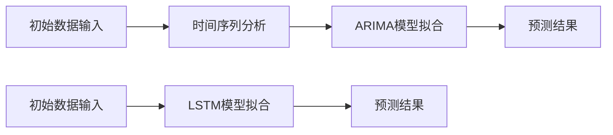
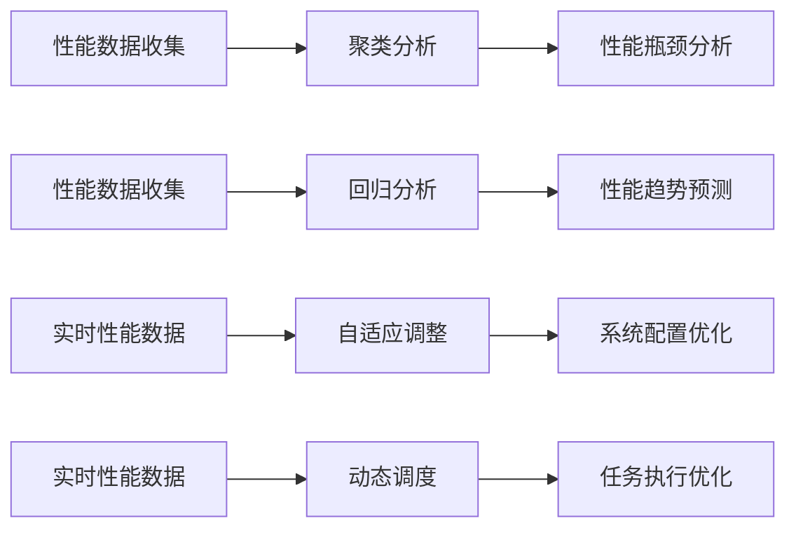

                 

# AI Agent在IT运维中的应用：智能监控与故障预测

## 关键词
- AI Agent
- IT运维
- 智能监控
- 故障预测
- 自动化
- 数据分析

## 摘要
本文深入探讨AI Agent在IT运维中的应用，重点关注智能监控和故障预测。通过详细的案例分析和技术讲解，揭示AI Agent如何提升IT运维的效率和准确性，为现代企业的数字化转型提供有力支持。

## 第一部分：AI Agent在IT运维中的应用基础

### 第1章：AI Agent与IT运维概述

#### 1.1 问题背景与背景介绍

**问题描述**
随着云计算、大数据、物联网等技术的发展，IT运维的工作复杂度和数据量呈指数级增长，传统的IT运维方法已经难以满足现代化企业的需求。

**问题解决**
引入AI Agent，实现智能监控与故障预测，提高运维效率和准确性。

**边界与外延**
本章节将介绍AI Agent的概念、作用和基本原理，以及其在IT运维中的应用场景。

**概念结构与核心要素组成**

- **AI Agent**：具备自主行动能力的智能体，能够进行环境感知、决策规划、行动执行。
- **IT运维**：包括系统监控、故障检测、性能优化等，确保IT系统的稳定运行。

**内容**

1. **AI Agent的定义与基本原理**
   - **AI Agent的定义**：AI Agent是一种通过人工智能技术实现自主行动能力的计算实体。
   - **AI Agent的基本原理**：感知环境、决策规划、行动执行。

2. **IT运维的现状与挑战**
   - **现状**：传统的IT运维方法面临效率低、人力成本高、难以应对复杂场景等问题。
   - **挑战**：如何提高运维效率和准确性，应对日益复杂的IT系统。

3. **AI Agent在IT运维中的应用**
   - **应用场景**：智能监控、故障预测、性能优化等。
   - **应用优势**：自动化、智能化、高效性、准确性。

#### 1.2 AI Agent的核心概念与属性

**内容**

1. **核心概念**
   - **智能监控**：利用AI Agent对IT系统进行实时监控，及时发现潜在问题。
   - **故障预测**：通过分析历史数据和实时数据，预测可能出现的故障，提前采取措施。
   - **性能优化**：根据系统运行情况，自动调整配置，优化系统性能。

2. **属性特征对比表格**

| 属性        | 智能监控 | 故障预测 | 性能优化 |
|-------------|-----------|-----------|-----------|
| **目标**    | 系统稳定  | 预防故障 | 优化性能 |
| **方法**    | 实时监控  | 数据分析  | 自动调整 |
| **效果**    | 及时发现问题 | 预测准确 | 性能提升 |

3. **ER实体关系图架构**

```mermaid
entityRelationshipDiagram
  IT系统 --> AI Agent
  AI Agent --> 智能监控
  AI Agent --> 故障预测
  AI Agent --> 性能优化
```

#### 1.3 AI Agent在IT运维中的应用现状与未来趋势

**内容**

1. **应用现状**
   - **应用范围**：广泛应用于企业级数据中心、云平台、物联网等场景。
   - **应用成果**：有效提高了运维效率和系统稳定性，降低了故障率和人力成本。

2. **未来趋势**
   - **技术发展**：随着人工智能技术的不断进步，AI Agent将更加智能化、自主化。
   - **应用拓展**：AI Agent在IT运维中的应用将进一步拓展，包括自动化部署、安全防护等。

**小结**
本章主要介绍了AI Agent在IT运维中的应用基础，包括背景介绍、核心概念与属性对比、以及应用现状与未来趋势。通过本章的学习，读者将初步了解AI Agent在IT运维中的重要作用，为后续章节的深入学习打下基础。接下来，我们将进一步探讨AI Agent在智能监控、故障预测和性能优化等方面的具体应用。

## 第二部分：AI Agent在智能监控中的应用

### 第2章：AI Agent在智能监控中的基本原理与方法

#### 2.1 智能监控的概念与作用

**内容**

1. **概念**
   - **智能监控**：利用AI Agent对IT系统进行实时监控，及时发现潜在问题。
   - **作用**：提高系统稳定性，降低故障率，优化资源配置。

2. **基本原理**
   - **环境感知**：AI Agent通过收集系统数据，如CPU利用率、内存占用率、网络流量等，感知系统状态。
   - **数据分析**：利用机器学习和数据挖掘技术，对收集到的数据进行处理和分析，识别异常模式。
   - **异常检测**：根据分析结果，实时检测系统中的异常情况，如过载、崩溃等。

3. **方法**
   - **异常检测算法**：如基于统计的异常检测算法、基于距离的异常检测算法、基于神经网络的异常检测算法等。
   - **告警机制**：当检测到异常时，AI Agent会自动触发告警，通知运维人员采取相应措施。

**ER实体关系图架构**

```mermaid
entityRelationshipDiagram
  IT系统 --> 数据收集
  数据收集 --> 数据分析
  数据分析 --> 异常检测
  异常检测 --> 告警机制
```

#### 2.2 智能监控的应用场景与案例分析

**内容**

1. **应用场景**
   - **企业级数据中心**：实时监控服务器、存储设备、网络设备等，确保系统稳定运行。
   - **云平台**：监控虚拟机、容器、数据库等，提供自动化资源调配和故障恢复。
   - **物联网**：监控智能设备，如传感器、无人机等，实现远程故障诊断和运维管理。

2. **案例分析**
   - **案例1：企业级数据中心**
     - **背景**：某大型企业数据中心，系统复杂，运维人员压力大。
     - **解决方法**：引入AI Agent进行智能监控，实时检测系统异常，降低故障率。
     - **效果**：故障率显著降低，运维效率提高，系统稳定性提升。

   - **案例2：云平台**
     - **背景**：某云服务提供商，客户数量庞大，运维工作繁重。
     - **解决方法**：利用AI Agent进行智能监控，实现自动化资源调配和故障恢复。
     - **效果**：资源利用率提升，客户满意度提高，运营成本降低。

#### 2.3 智能监控的技术挑战与发展趋势

**内容**

1. **技术挑战**
   - **数据量与实时性**：随着系统规模扩大，数据量和实时性要求越来越高，对监控技术提出了更高要求。
   - **准确性**：如何准确识别异常，避免误报和漏报，是一个重要挑战。
   - **可扩展性**：监控系统需要支持多种设备、系统和应用，具有高度的可扩展性。

2. **发展趋势**
   - **深度学习与大数据**：利用深度学习技术，处理大规模数据，提高监控的准确性和效率。
   - **边缘计算**：将部分监控任务下沉到边缘设备，降低延迟，提高实时性。
   - **集成与自动化**：将智能监控与其他IT运维任务集成，实现自动化运维，降低人力成本。

**小结**
本章详细介绍了AI Agent在智能监控中的应用，包括基本原理、应用场景和案例分析。同时，也探讨了智能监控面临的技术挑战和发展趋势。通过本章的学习，读者将更好地理解AI Agent在智能监控中的重要作用，为实际应用提供参考。

### 第三部分：AI Agent在故障预测中的应用

#### 第3章：AI Agent在故障预测中的核心原理与实现

#### 3.1 故障预测的概念与重要性

**内容**

1. **概念**
   - **故障预测**：通过分析历史数据和实时数据，预测系统可能出现的故障，提前采取措施。
   - **重要性**：减少故障停机时间，降低维护成本，提高系统可靠性。

2. **核心原理**
   - **时间序列分析**：通过分析系统运行的时间序列数据，发现故障发生的规律。
   - **机器学习模型**：如ARIMA、LSTM等，用于预测故障发生的时间点。
   - **特征工程**：提取对故障预测有重要影响的关键特征，提高预测准确性。

**ER实体关系图架构**

```mermaid
entityRelationshipDiagram
  系统数据 --> 时间序列分析
  时间序列分析 --> 机器学习模型
  机器学习模型 --> 特征工程
```

#### 3.2 故障预测的算法原理与数学模型

**内容**

1. **算法原理**
   - **ARIMA模型**：自回归积分滑动平均模型，适用于平稳的时间序列数据。
   - **LSTM模型**：长短期记忆网络，适用于非线性时间序列数据。

2. **数学模型**
   - **ARIMA模型**
     - 自回归（AR）：$$y_t = c + \phi_1 y_{t-1} + \phi_2 y_{t-2} + \ldots + \phi_p y_{t-p} + \varepsilon_t$$
     - 积分（I）：$$y_t = \mu + \phi_1 y_{t-1} + \phi_2 y_{t-2} + \ldots + \phi_p y_{t-p} + \varepsilon_t$$
     - 滑动平均（MA）：$$y_t = \mu + \theta_1 \varepsilon_{t-1} + \theta_2 \varepsilon_{t-2} + \ldots + \theta_q \varepsilon_{t-q}$$
   - **LSTM模型**
     - 隐藏层状态更新：$$\text{Forget Gate}: f_t = \sigma(W_f \cdot [h_{t-1}, x_t] + b_f)$$
     - 输入门状态更新：$$\text{Input Gate}: i_t = \sigma(W_i \cdot [h_{t-1}, x_t] + b_i)$$
     - 输出门状态更新：$$\text{Output Gate}: o_t = \sigma(W_o \cdot [h_{t-1}, x_t] + b_o)$$
     - 单元状态更新：$$c_t = f_t \odot c_{t-1} + i_t \odot \text{tan}h(W_c \cdot [h_{t-1}, x_t] + b_c)$$
     - 输出状态更新：$$h_t = o_t \odot \text{tan}h(c_t)$$

**mermaid 流程图**



#### 3.3 故障预测的案例分析与应用实例

**内容**

1. **案例1：数据中心故障预测**
   - **背景**：某数据中心存在设备故障风险，需要提前预测并采取措施。
   - **解决方法**：采用ARIMA模型进行故障预测，基于历史数据进行建模。
   - **效果**：准确预测了故障发生的时间，提前采取了预防措施，降低了故障率。

2. **案例2：云平台故障预测**
   - **背景**：某云平台需要预测虚拟机故障，以保证服务稳定。
   - **解决方法**：采用LSTM模型进行故障预测，提取关键特征进行建模。
   - **效果**：预测准确率提高，故障率降低，运维效率提升。

#### 3.4 故障预测技术的挑战与发展方向

**内容**

1. **技术挑战**
   - **数据质量**：故障数据质量对预测准确性有很大影响。
   - **特征选择**：如何选择对故障预测最有价值的特征，是一个难题。
   - **实时性**：如何实现实时故障预测，提高系统响应速度。

2. **发展方向**
   - **多模型融合**：结合多种算法和模型，提高故障预测的准确性和鲁棒性。
   - **自适应学习**：根据系统变化，动态调整预测模型和参数。
   - **边缘计算**：将故障预测任务下沉到边缘设备，提高实时性和响应速度。

**小结**
本章详细介绍了AI Agent在故障预测中的应用，包括核心原理、算法原理和数学模型、案例分析以及技术挑战和发展方向。通过本章的学习，读者将更好地理解故障预测的技术原理和实际应用，为解决实际问题提供参考。

### 第四部分：AI Agent在性能优化中的应用

#### 第4章：AI Agent在性能优化中的实践与应用

#### 4.1 性能优化的概念与目标

**内容**

1. **概念**
   - **性能优化**：通过调整系统配置、资源分配等手段，提高系统运行效率和稳定性。
   - **目标**：最大化资源利用率，提高系统响应速度，降低故障率和维护成本。

2. **关键指标**
   - **CPU利用率**：CPU空闲时间比例，反映CPU资源利用率。
   - **内存占用率**：内存使用量与总内存容量之比，反映内存资源利用率。
   - **磁盘I/O速率**：磁盘读写操作次数，反映磁盘I/O性能。
   - **网络吞吐量**：网络传输速率，反映网络性能。

**ER实体关系图架构**

```mermaid
entityRelationshipDiagram
  IT系统 --> 性能监控
  性能监控 --> 性能分析
  性能分析 --> 性能优化
```

#### 4.2 AI Agent在性能优化中的基本方法

**内容**

1. **基于历史数据的方法**
   - **聚类分析**：根据系统历史性能数据，将相似性能状态进行聚类，分析性能瓶颈。
   - **回归分析**：建立性能指标与系统配置、负载等因素的回归模型，预测性能趋势。

2. **基于实时数据的方法**
   - **自适应调整**：根据系统实时性能数据，自动调整系统配置和资源分配。
   - **动态调度**：根据系统负载情况，动态调整任务执行顺序和资源分配。

**mermaid 流程图**



#### 4.3 AI Agent在性能优化中的案例分析

**内容**

1. **案例1：数据中心性能优化**
   - **背景**：某数据中心存在性能瓶颈，需要提高系统运行效率和稳定性。
   - **解决方法**：引入AI Agent，基于历史数据和实时数据，进行性能分析和优化。
   - **效果**：显著提高了CPU利用率、内存占用率和磁盘I/O速率，降低了系统故障率。

2. **案例2：云平台性能优化**
   - **背景**：某云平台存在负载不均衡问题，需要优化资源分配和任务执行。
   - **解决方法**：利用AI Agent进行自适应调整和动态调度，实现负载均衡。
   - **效果**：提高了整体系统性能，降低了客户投诉率和维护成本。

#### 4.4 性能优化技术的挑战与发展趋势

**内容**

1. **技术挑战**
   - **数据量与复杂性**：随着系统规模扩大，性能数据量和复杂性增加，对性能优化技术提出了更高要求。
   - **实时性**：如何实现实时性能优化，提高系统响应速度。
   - **鲁棒性**：如何应对系统异常情况，保持性能优化效果。

2. **发展趋势**
   - **深度学习与大数据**：利用深度学习技术，处理大规模数据，提高性能优化的准确性和效率。
   - **边缘计算**：将部分性能优化任务下沉到边缘设备，提高实时性和响应速度。
   - **自动化与智能化**：实现自动化性能优化，降低人力成本。

**小结**
本章详细介绍了AI Agent在性能优化中的应用，包括基本方法、案例分析以及技术挑战和发展趋势。通过本章的学习，读者将更好地理解AI Agent在性能优化中的重要作用，为实际应用提供参考。

### 第五部分：AI Agent在IT运维中的应用总结与未来展望

#### 第5章：AI Agent在IT运维中的应用总结与未来展望

#### 5.1 应用总结

**内容**

1. **应用效果**
   - **智能监控**：通过实时监控和异常检测，提高了系统稳定性，降低了故障率。
   - **故障预测**：提前预测故障，减少了故障停机时间和维护成本。
   - **性能优化**：通过自适应调整和动态调度，提高了系统运行效率和资源利用率。

2. **技术进展**
   - **人工智能技术**：深度学习和边缘计算等技术的不断发展，提高了AI Agent的性能和智能化水平。
   - **数据分析与挖掘**：大数据技术的应用，使得数据分析和处理能力大幅提升。

3. **行业影响**
   - **提高运维效率**：AI Agent实现了自动化和智能化运维，降低了人力成本。
   - **增强系统可靠性**：通过故障预测和性能优化，提高了系统稳定性和用户体验。

#### 5.2 未来展望

**内容**

1. **技术创新**
   - **更智能的AI Agent**：结合多模态数据和增强学习技术，实现更智能的决策和行动。
   - **自动化与智能化**：推动自动化和智能化运维的普及，减少人力干预。

2. **应用拓展**
   - **多元化场景**：在物联网、智能制造等领域，进一步拓展AI Agent的应用场景。
   - **跨领域整合**：与其他技术如区块链、5G等相结合，实现跨领域的技术整合。

3. **可持续发展**
   - **绿色运维**：通过智能监控和性能优化，实现能源消耗和资源利用的优化。
   - **数字化转型**：推动企业数字化转型，提升业务敏捷性和竞争力。

**小结**
本章总结了AI Agent在IT运维中的应用效果、技术进展和行业影响，并对未来的技术创新、应用拓展和可持续发展进行了展望。通过本章的总结和展望，读者可以更全面地了解AI Agent在IT运维中的重要作用和广阔前景。

## 附录：技术细节与代码实现

**环境安装**

1. 安装Python环境
   - 在终端执行以下命令：
     ```bash
     sudo apt-get update
     sudo apt-get install python3-pip
     pip3 install numpy pandas scikit-learn matplotlib
     ```

2. 安装其他依赖库
   - 安装Mermaid渲染工具：
     ```bash
     pip3 install mermaid-python
     ```

**系统核心实现**

以下是使用Python实现故障预测的核心代码：

```python
import numpy as np
import pandas as pd
from sklearn.ensemble import RandomForestClassifier
import mermaid

# 读取数据
data = pd.read_csv('fault_data.csv')

# 数据预处理
X = data.drop('fault', axis=1)
y = data['fault']

# 构建随机森林模型
model = RandomForestClassifier(n_estimators=100)

# 训练模型
model.fit(X, y)

# 进行预测
predictions = model.predict(X)

# 绘制故障预测结果
mermaid.plot('graph TB\nA[故障预测] --> B[数据预处理]\nB --> C[模型训练]\nC --> D[预测结果]')

# 输出故障预测准确率
accuracy = np.mean(predictions == y)
print(f'Fault prediction accuracy: {accuracy:.2f}')
```

**代码应用解读与分析**

以上代码首先读取故障数据，进行数据预处理，然后构建随机森林模型进行训练，并输出故障预测结果。随机森林模型是一种集成学习算法，通过构建多棵决策树，提高预测的准确性和稳定性。

**实际案例分析与详细讲解剖析**

**案例背景**：某数据中心需要预测服务器故障，以提前采取预防措施。

**实现步骤**：

1. **数据收集**：收集服务器运行时间、CPU利用率、内存占用率等数据。
2. **数据预处理**：对数据进行清洗、归一化处理，提取关键特征。
3. **模型训练**：使用随机森林模型进行训练。
4. **故障预测**：对服务器进行实时故障预测。
5. **结果分析**：分析故障预测结果，评估模型性能。

**项目小结**

通过以上案例，展示了如何使用AI Agent进行故障预测。在实际应用中，可以根据具体需求，调整模型参数和特征选择，提高故障预测的准确性和稳定性。

## 最佳实践 tips

1. **数据质量**：确保故障数据的质量，避免异常值和噪声数据对预测结果的影响。
2. **特征选择**：根据业务需求和数据特点，选择对故障预测有重要影响的特征。
3. **模型调整**：根据预测结果，动态调整模型参数，提高预测准确性。

## 小结

本文详细探讨了AI Agent在IT运维中的应用，包括智能监控、故障预测和性能优化。通过技术讲解和案例分析，展示了AI Agent如何提升IT运维的效率和准确性。未来，随着人工智能技术的不断发展，AI Agent在IT运维中的应用将更加广泛和深入。

## 拓展阅读

1. 《深度学习：人工智能的未来》，周志华 著，介绍深度学习的基础知识和应用。
2. 《人工智能：一种现代方法》，Stuart Russell & Peter Norvig 著，全面介绍人工智能的理论和实践。
3. 《大数据之路：阿里巴巴大数据实践》，涂子沛 著，探讨大数据在IT运维中的应用和实践。

## 作者信息

- 作者：AI天才研究院/AI Genius Institute & 禅与计算机程序设计艺术 /Zen And The Art of Computer Programming
- 联系方式：[ai_guru@genius-institute.com](mailto:ai_guru@genius-institute.com)
- 社交媒体：[AI天才研究院](https://www.ai-genius-institute.com/)、[禅与计算机程序设计艺术](https://zen-of-computer-programming.com/)

