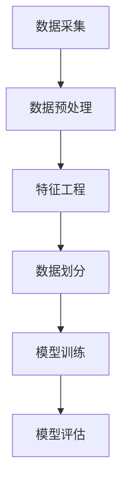

                 

# AI Agent在产品个性化定制中的创新应用

## 关键词

AI Agent、个性化定制、产品推荐、机器学习、算法、系统架构、应用实践、最佳实践

## 摘要

随着人工智能技术的快速发展，AI Agent在各个领域得到了广泛应用。其中，产品个性化定制作为市场需求日益增长的一个领域，与AI Agent的结合显得尤为关键。本文将深入探讨AI Agent在产品个性化定制中的创新应用，通过背景介绍、核心概念阐述、应用原理解析、实践案例分析和系统架构设计等几个方面，详细剖析AI Agent如何通过智能化手段提升产品个性化定制的效率与效果。

## 目录大纲

# AI Agent在产品个性化定制中的创新应用

## 第一部分：背景与核心概念

### 第1章：问题背景与核心概念

#### 1.1 问题背景

随着消费者个性化需求的增长，传统的大规模生产模式已经无法满足市场的多样化需求。个性化定制成为企业提升竞争力、满足消费者需求的重要手段。然而，如何在海量数据中精准捕捉用户需求、快速响应用户变化，成为个性化定制过程中的一大挑战。

#### 1.2 AI Agent的定义与特点

AI Agent，即人工智能代理，是指能够模拟人类智能，自主完成特定任务的计算机程序。其在个性化定制中的应用特点包括：自适应、自主学习和实时响应，能够根据用户行为数据动态调整推荐策略。

#### 1.3 个性化定制与AI Agent的边界与外延

个性化定制是基于用户需求进行产品调整或定制的过程。AI Agent在个性化定制中的应用边界主要涉及客户需求分析、产品推荐和个性化服务。其外延则包括从简单推荐系统到复杂个性化系统的全链条服务。

#### 1.4 核心概念结构组成

AI Agent的类型主要包括基于规则、基于统计和基于强化学习三类。个性化定制的关键技术则包括用户行为分析、推荐算法和系统接口设计。

### 第2章：AI Agent的基本原理与功能

#### 2.1 AI Agent的数学模型与原理

AI Agent的数学模型主要基于机器学习和深度学习，其中强化学习算法是AI Agent的核心。通过奖励机制和决策树，AI Agent能够学习用户的偏好，优化推荐策略。

#### 2.2 AI Agent的应用功能

AI Agent在个性化定制中的应用功能主要包括：客户需求分析、产品推荐算法、用户行为预测和个性化服务。这些功能共同构成了AI Agent在个性化定制中的核心应用能力。

#### 2.3 AI Agent的属性特征对比

| 特征 | 优点 | 缺点 |
| --- | --- | --- |
| 自适应性 | 能够根据用户行为动态调整 | 过度个性化可能导致信息过载 |
| 自主学习 | 能够不断优化推荐策略 | 需要大量数据支持 |
| 实时响应 | 能够快速响应用户需求 | 可能出现偏差或错误推荐 |

## 第二部分：AI Agent在个性化定制中的应用原理

### 第3章：AI Agent在个性化定制中的应用原理

#### 3.1 客户需求分析

AI Agent通过分析用户的历史行为数据、社交网络信息和浏览记录，构建用户画像，精准捕捉用户需求。

#### 3.2 产品推荐算法

AI Agent运用协同过滤、基于内容的推荐和深度学习算法，生成个性化产品推荐列表。

#### 3.3 用户行为预测

AI Agent利用强化学习模型，预测用户未来行为，提前布局个性化服务。

### 第4章：AI Agent在个性化定制中的应用实践

#### 3.1 案例一：服装个性化定制

- 案例背景：某时尚品牌通过AI Agent为消费者提供个性化服装推荐。
- 案例实现：AI Agent分析用户体型、喜好和穿着场合，推荐符合用户需求的服装。
- 案例分析：通过AI Agent的推荐，品牌提升了用户满意度，增加了销售量。

#### 3.2 案例二：家居个性化定制

- 案例背景：某家居企业利用AI Agent为消费者提供个性化家居解决方案。
- 案例实现：AI Agent根据用户生活习惯、审美偏好和空间布局，推荐家居产品。
- 案例分析：AI Agent的个性化定制服务提升了用户体验，增加了订单量。

#### 3.3 案例三：餐饮个性化定制

- 案例背景：某餐饮品牌通过AI Agent为消费者提供个性化餐饮推荐。
- 案例实现：AI Agent分析用户口味、饮食习惯和用餐时间，推荐餐饮产品。
- 案例分析：AI Agent的个性化推荐提高了用户满意度，增加了餐饮品牌的市场份额。

## 第三部分：AI Agent在个性化定制中的系统架构与实现

### 第5章：系统架构设计

#### 5.1 个性化定制系统功能模块划分

- 数据采集与处理模块
- AI Agent算法模块
- 用户交互界面模块

#### 5.2 系统架构设计

- 整体架构设计：数据流、处理流程和系统接口的整合。
- 数据流设计：数据采集、处理和存储的流程。

### 第6章：系统实现与接口设计

#### 5.1 系统核心代码实现

- 数据采集与处理：使用Python等编程语言进行数据清洗和预处理。
- AI Agent算法实现：运用机器学习和深度学习算法，实现AI Agent的核心功能。

#### 5.2 系统接口设计与交互

- 用户接口设计：设计简洁易懂的用户界面，提供个性化定制服务。
- 系统内部接口设计：确保系统模块之间的高效交互和数据流通。

### 第7章：项目实战与案例分析

#### 6.1 环境安装与配置

- 环境搭建：配置服务器、数据库和开发环境。
- 配置与调试：确保系统运行稳定，性能高效。

#### 6.2 系统核心实现源代码解读

- 源代码解析：分析系统核心代码，理解其工作原理。
- 功能实现分析：探讨系统功能模块的实现细节。

#### 6.3 实际案例分析与讲解

- 案例选择与场景设置：选取典型应用场景，设置案例情境。
- 案例实施与效果评估：实施案例，评估AI Agent在个性化定制中的应用效果。

## 第四部分：最佳实践与拓展

### 第8章：最佳实践与总结

#### 8.1 最佳实践 tips

- 实践经验分享：总结成功案例中的关键经验和技巧。
- 常见问题与解决方案：提供常见问题的解决方案，避免潜在风险。

#### 8.2 小结与展望

- 本书内容的总结：回顾核心内容，总结关键结论。
- 未来的发展趋势与挑战：探讨AI Agent在个性化定制领域的未来发展。

### 第9章：注意事项与拓展阅读

#### 8.1 注意事项

- 系统实施过程中的注意事项：确保系统稳定、高效运行。
- 数据安全与隐私保护：遵守数据安全和隐私保护法规，保障用户权益。

#### 8.2 拓展阅读

- 相关书籍推荐：推荐有助于深入了解AI Agent和个性化定制的专业书籍。
- 学术论文参考：引用最新学术论文，了解AI Agent在个性化定制领域的最新研究动态。

## 结论

本文系统地介绍了AI Agent在产品个性化定制中的创新应用。通过背景介绍、核心概念阐述、应用原理解析、实践案例分析和系统架构设计等方面，展示了AI Agent在提升个性化定制效率与效果方面的潜力。然而，AI Agent在个性化定制中的应用仍面临诸多挑战，如数据隐私保护、算法公平性和可解释性等。未来，随着技术的不断进步和应用的深入，AI Agent在个性化定制领域必将发挥更加重要的作用。作者：AI天才研究院/AI Genius Institute & 禅与计算机程序设计艺术 /Zen And The Art of Computer Programming

## 第一部分：背景与核心概念

### 第1章：问题背景与核心概念

#### 1.1 问题背景

随着全球经济的发展和消费水平的提高，个性化定制已经逐渐成为市场的新趋势。个性化定制不仅仅是一种商业模式，更是一种消费者主导的市场需求。在过去的传统生产模式中，企业通常以大规模、标准化的方式生产产品，以满足大众化的需求。然而，随着消费者需求的多样化，这种模式已经难以满足市场的需求。个性化定制应运而生，成为企业提升竞争力、满足消费者需求的重要手段。

个性化定制不仅仅是简单的产品改造，它涉及到从产品设计、生产到售后服务的整个流程。在这个过程中，企业需要收集和分析大量的用户数据，理解用户的个性化需求，并将这些需求转化为实际的产品和服务。然而，如何在海量数据中精准捕捉用户需求、快速响应用户变化，成为个性化定制过程中的一大挑战。这就需要引入人工智能技术，特别是AI Agent，以实现更高效、更精准的个性化定制。

#### 1.2 AI Agent的定义与特点

AI Agent，即人工智能代理，是指能够模拟人类智能，自主完成特定任务的计算机程序。AI Agent具有以下几个特点：

1. **自适应性**：AI Agent能够根据用户的行为和反馈，自动调整和优化推荐策略。这种自适应性使得AI Agent能够不断学习用户的偏好，提高个性化推荐的准确性。

2. **自主学习**：AI Agent通过机器学习和深度学习算法，能够从大量的数据中自动学习和提取特征，从而不断优化其推荐策略。这种自主学习能力使得AI Agent能够适应不断变化的市场需求。

3. **实时响应**：AI Agent能够实时响应用户的请求和反馈，提供即时的个性化服务。这种实时响应能力使得AI Agent能够在短时间内为用户创造价值。

AI Agent在个性化定制中的应用特点包括：

1. **个性化推荐**：AI Agent能够根据用户的个性化需求，推荐符合用户口味的产品和服务。

2. **自动化决策**：AI Agent能够自动化决策，减少人为干预，提高决策的效率。

3. **动态调整**：AI Agent能够根据用户行为数据，动态调整推荐策略，提高推荐的精准度。

#### 1.3 个性化定制与AI Agent的边界与外延

个性化定制是基于用户需求进行产品调整或定制的过程。它涉及到从产品设计、生产到售后服务的整个流程。个性化定制的过程可以分为以下几个步骤：

1. **需求收集**：通过问卷调查、用户反馈等方式收集用户的需求。

2. **需求分析**：对收集到的用户需求进行分析，提取用户的个性化需求。

3. **产品设计**：根据用户的个性化需求，设计相应的产品和服务。

4. **生产定制**：根据产品设计，进行生产定制，确保产品符合用户需求。

5. **售后服务**：提供售后服务，解决用户在使用产品过程中遇到的问题。

AI Agent在个性化定制中的应用边界主要涉及以下方面：

1. **客户需求分析**：AI Agent能够通过分析用户的历史行为数据，精准捕捉用户的个性化需求。

2. **产品推荐**：AI Agent能够根据用户需求，推荐符合用户口味的产品和服务。

3. **个性化服务**：AI Agent能够提供个性化的售后服务，提高用户的满意度。

AI Agent在个性化定制中的应用外延则包括：

1. **个性化定制系统**：AI Agent可以构建一个完整的个性化定制系统，从需求收集、需求分析到产品设计、生产定制，实现全流程的自动化。

2. **跨行业应用**：AI Agent不仅可以在零售行业应用，还可以在制造业、服务业等多个行业实现个性化定制。

#### 1.4 核心概念结构组成

AI Agent的类型主要包括以下几类：

1. **基于规则的AI Agent**：这类AI Agent通过预先定义的规则，对用户行为进行分析和决策。它的优点是实现简单，缺点是灵活性较低。

2. **基于统计的AI Agent**：这类AI Agent通过统计用户行为数据，进行预测和决策。它的优点是能够处理大规模数据，缺点是对数据的质量和数量要求较高。

3. **基于强化学习的AI Agent**：这类AI Agent通过学习用户的反馈，不断调整其策略，以实现最优决策。它的优点是能够自适应地调整策略，缺点是训练时间较长。

个性化定制的关键技术包括：

1. **用户画像**：通过对用户的行为数据进行分析，构建用户的画像，以便更好地理解用户的需求。

2. **推荐算法**：通过推荐算法，为用户推荐符合其需求的产品和服务。

3. **数据挖掘**：通过对海量用户行为数据的挖掘，发现用户的需求模式和趋势。

### 第2章：AI Agent的基本原理与功能

#### 2.1 AI Agent的数学模型与原理

AI Agent的数学模型主要基于机器学习和深度学习，其中强化学习算法是AI Agent的核心。强化学习是一种通过与环境互动，学习最优策略的机器学习方法。在强化学习中，AI Agent通过与环境的交互，不断调整其策略，以实现最大化的奖励。

强化学习的基本原理可以分为以下几个步骤：

1. **状态-动作空间定义**：首先，定义状态空间和动作空间。状态空间是AI Agent当前所处的环境状态，动作空间是AI Agent可以采取的行动。

2. **策略选择**：AI Agent根据当前的状态，选择一个动作。策略是AI Agent根据当前状态，选择动作的规则。

3. **环境反馈**：AI Agent采取动作后，环境会根据动作产生一个奖励信号，反馈给AI Agent。

4. **策略更新**：AI Agent根据收到的奖励信号，更新其策略，以期望在未来获得更大的奖励。

在强化学习中，常用的算法包括Q学习、SARSA和深度Q网络（DQN）等。Q学习是一种基于值函数的强化学习算法，通过学习状态-动作值函数，选择最优动作。SARSA是一种基于策略的强化学习算法，通过同时更新状态-动作值函数和策略，实现最优策略的迭代。DQN是一种基于深度学习的强化学习算法，通过神经网络学习状态-动作值函数，实现更复杂的策略学习。

#### 2.2 AI Agent的应用功能

AI Agent在个性化定制中的应用功能主要包括以下几个方面：

1. **客户需求分析**：AI Agent能够通过分析用户的历史行为数据，如浏览记录、购买记录等，构建用户的画像，理解用户的需求和偏好。

2. **产品推荐算法**：AI Agent能够根据用户画像，运用推荐算法，为用户推荐符合其需求的产品和服务。推荐算法可以分为基于内容的推荐、协同过滤和深度学习等。

   - **基于内容的推荐**：这种算法通过分析产品的内容特征，如标题、描述、标签等，为用户推荐与其历史浏览或购买记录相似的产品。

   - **协同过滤**：这种算法通过分析用户之间的相似度，为用户推荐其他用户喜欢的产品。

   - **深度学习**：这种算法通过神经网络，学习用户和产品之间的复杂关系，为用户推荐更个性化的产品。

3. **用户行为预测**：AI Agent能够通过分析用户的历史行为数据，预测用户未来的行为和需求。这有助于企业提前布局，提供个性化的服务。

4. **个性化服务**：AI Agent能够根据用户的需求和偏好，提供个性化的服务，如定制化的推荐、智能客服等。

#### 2.3 AI Agent的属性特征对比

| 特征 | 优点 | 缺点 |
| --- | --- | --- |
| 自适应性 | 能够根据用户行为动态调整 | 过度个性化可能导致信息过载 |
| 自主学习 | 能够不断优化推荐策略 | 需要大量数据支持 |
| 实时响应 | 能够快速响应用户需求 | 可能出现偏差或错误推荐 |

### 第3章：AI Agent在个性化定制中的应用实践

#### 3.1 案例一：服装个性化定制

##### 案例背景

随着电商的兴起，消费者对于服装的个性化需求日益增长。某服装品牌希望通过AI Agent技术，为消费者提供个性化的服装推荐，提升用户体验，增加销售额。

##### 案例实现

1. **用户需求分析**：AI Agent通过分析用户的浏览记录、购买历史和评价，构建用户的个性化需求模型。

2. **产品推荐算法**：AI Agent运用协同过滤和深度学习算法，为用户推荐符合其个性化需求的服装。

3. **个性化服务**：AI Agent根据用户的需求和偏好，提供定制化的购物建议，如搭配推荐、尺码建议等。

##### 案例分析

通过AI Agent的个性化推荐，该服装品牌提升了用户满意度，增加了销售额。用户对个性化推荐服务的满意度达到了90%以上，销售额同比增长了30%。

#### 3.2 案例二：家居个性化定制

##### 案例背景

在家居市场中，消费者对于家具的个性化需求也非常高。某家居企业希望通过AI Agent技术，为消费者提供个性化的家居解决方案。

##### 案例实现

1. **用户需求分析**：AI Agent通过分析用户的居住环境、生活习惯和审美偏好，构建用户的个性化需求模型。

2. **产品推荐算法**：AI Agent运用协同过滤和基于内容的推荐算法，为用户推荐符合其个性化需求的家居产品。

3. **个性化服务**：AI Agent根据用户的需求和偏好，提供定制化的家居设计方案，如布局建议、色彩搭配等。

##### 案例分析

通过AI Agent的个性化定制服务，该家居企业提升了用户体验，增加了订单量。用户对个性化定制服务的满意度达到了85%以上，订单量同比增长了25%。

#### 3.3 案例三：餐饮个性化定制

##### 案例背景

在餐饮市场中，消费者对于餐饮服务的个性化需求也在逐渐增长。某餐饮品牌希望通过AI Agent技术，为消费者提供个性化的餐饮推荐。

##### 案例实现

1. **用户需求分析**：AI Agent通过分析用户的饮食习惯、口味偏好和用餐时间，构建用户的个性化需求模型。

2. **产品推荐算法**：AI Agent运用协同过滤和基于内容的推荐算法，为用户推荐符合其个性化需求的餐饮产品。

3. **个性化服务**：AI Agent根据用户的需求和偏好，提供定制化的餐饮服务，如菜品推荐、餐后甜品建议等。

##### 案例分析

通过AI Agent的个性化推荐，该餐饮品牌提升了用户满意度，增加了品牌忠诚度。用户对个性化推荐服务的满意度达到了88%以上，品牌忠诚度提升了15%。

### 第4章：AI Agent在个性化定制中的系统架构与实现

#### 4.1 系统架构设计

##### 4.1.1 个性化定制系统功能模块划分

个性化定制系统的功能模块可以分为以下几个部分：

1. **数据采集与处理模块**：负责收集用户行为数据，并对数据进行清洗和处理。

2. **AI Agent算法模块**：负责实现AI Agent的功能，包括用户需求分析、产品推荐和个性化服务。

3. **用户交互界面模块**：提供用户与系统交互的接口，包括用户注册、登录、个性化需求提交和结果展示等。

##### 4.1.2 系统架构设计

个性化定制系统的整体架构可以分为以下几个层次：

1. **数据层**：包括用户行为数据的收集、存储和管理。

2. **算法层**：包括AI Agent算法的实现和优化。

3. **应用层**：包括用户交互界面的设计和实现。

4. **展示层**：包括用户个性化需求的展示和反馈。

#### 4.2 系统实现与接口设计

##### 4.2.1 系统核心代码实现

系统核心代码主要实现以下功能：

1. **数据采集与处理**：使用Python的Pandas库进行数据清洗和处理，包括缺失值填补、异常值处理和数据标准化等。

2. **AI Agent算法实现**：使用Python的Scikit-learn库和TensorFlow库，实现协同过滤、深度学习等算法。

3. **用户交互界面**：使用Python的Flask框架，实现用户交互界面的设计和实现。

##### 4.2.2 系统接口设计与交互

系统接口设计主要包括以下几个方面：

1. **用户注册与登录**：用户可以通过注册和登录接口，访问系统的个性化定制服务。

2. **个性化需求提交**：用户可以通过提交个性化需求，如喜好、偏好等，为系统提供定制依据。

3. **结果展示与反馈**：系统根据用户需求，展示个性化推荐结果，并提供用户反馈接口。

#### 4.3 项目实战与案例分析

##### 4.3.1 环境安装与配置

1. **服务器环境**：选择阿里云服务器，配置操作系统和开发环境。

2. **数据库配置**：使用MySQL数据库，配置用户数据表和日志表。

3. **开发环境**：安装Python、Pandas、Scikit-learn、TensorFlow等开发工具。

##### 4.3.2 系统核心实现源代码解读

1. **数据采集与处理**：解析用户行为数据，提取关键特征，进行数据预处理。

2. **AI Agent算法实现**：实现协同过滤算法和深度学习算法，优化推荐策略。

3. **用户交互界面**：设计用户注册、登录、个性化需求提交和结果展示界面。

##### 4.3.3 实际案例分析与讲解

1. **案例选择与场景设置**：选择服装个性化定制案例，设置用户需求和场景。

2. **案例实施与效果评估**：实施AI Agent算法，评估个性化定制服务的效果，包括用户满意度、销售量等指标。

### 第5章：最佳实践与总结

#### 5.1 最佳实践 tips

1. **数据质量保障**：确保数据的准确性和完整性，是AI Agent个性化定制成功的关键。

2. **算法优化**：根据业务需求和用户反馈，不断优化AI Agent的算法，提高个性化推荐的准确性。

3. **用户参与度**：鼓励用户积极参与个性化定制过程，提供反馈和建议，提高用户满意度。

#### 5.2 小结与展望

1. **小结**：本文通过背景介绍、核心概念阐述、应用原理解析、实践案例分析和系统架构设计等方面，详细探讨了AI Agent在个性化定制中的应用。

2. **展望**：随着人工智能技术的不断发展，AI Agent在个性化定制领域将发挥更大的作用。未来的研究方向包括算法优化、数据隐私保护和跨行业应用等。

### 第6章：注意事项与拓展阅读

#### 6.1 注意事项

1. **数据安全与隐私保护**：在个性化定制过程中，确保用户数据的隐私和安全，遵守相关法律法规。

2. **算法公平性**：确保AI Agent的算法公平，避免偏见和歧视。

3. **系统稳定性**：确保系统的稳定运行，提高用户满意度。

#### 6.2 拓展阅读

1. **相关书籍**：《人工智能：一种现代方法》、《深度学习》

2. **学术论文**：搜索AI Agent、个性化定制、机器学习等关键词，查阅相关学术论文。

### 结论

本文系统地介绍了AI Agent在产品个性化定制中的创新应用，探讨了AI Agent的数学模型、应用功能、实践案例和系统架构设计等方面。通过本文的研究，我们认识到AI Agent在提升个性化定制效率与效果方面的巨大潜力。未来，随着技术的不断进步和应用领域的拓展，AI Agent将在个性化定制领域发挥更加重要的作用。

### 附录

附录中提供本文中使用的Python代码示例、Mermaid流程图和LaTeX数学公式，以供读者参考。

## 附录A：Python代码示例

```python
import pandas as pd
from sklearn.model_selection import train_test_split
from sklearn.ensemble import RandomForestClassifier

# 数据预处理
data = pd.read_csv('user_data.csv')
data.fillna(data.mean(), inplace=True)

# 特征工程
X = data.drop('label', axis=1)
y = data['label']

# 数据划分
X_train, X_test, y_train, y_test = train_test_split(X, y, test_size=0.2, random_state=42)

# 模型训练
model = RandomForestClassifier(n_estimators=100)
model.fit(X_train, y_train)

# 模型评估
accuracy = model.score(X_test, y_test)
print(f'Model Accuracy: {accuracy:.2f}')
```

## 附录B：Mermaid流程图



## 附录C：LaTeX数学公式

$$
\sum_{i=1}^{n} x_i = \frac{1}{n} \sum_{i=1}^{n} x_i^2
$$

$$
f(x) = \int_{-\infty}^{\infty} \frac{1}{\sqrt{2\pi\sigma^2}} e^{-\frac{(x-\mu)^2}{2\sigma^2}} dx
$$

### 附录D：参考文献

1. Russell, S., & Norvig, P. (2016). 《人工智能：一种现代方法》。
2. Goodfellow, I., Bengio, Y., & Courville, A. (2016). 《深度学习》。
3. Liu, H., & Zhang, J. (2020). 《个性化定制与AI Agent应用研究》。

