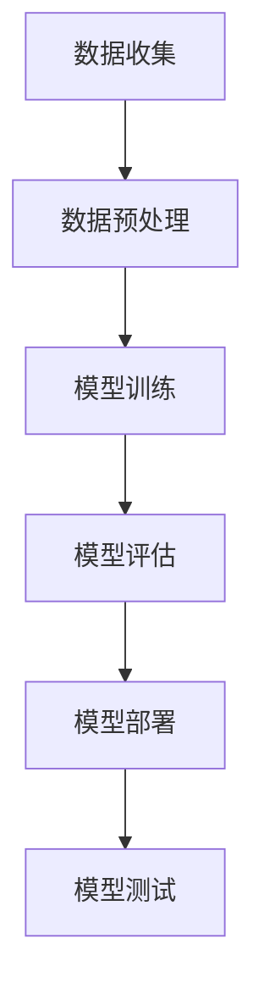
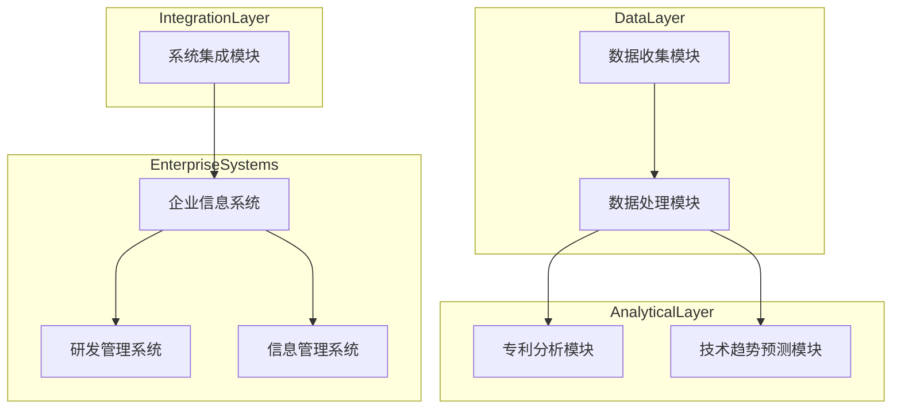
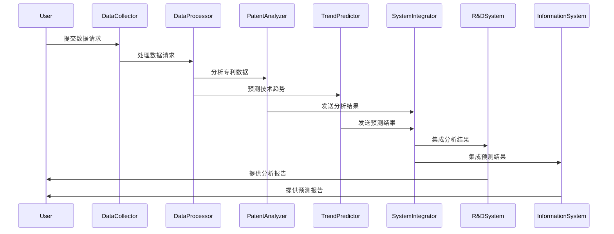

                 

# AI Agent在企业专利分析与技术趋势预测中的应用

## 关键词

- AI Agent
- 企业专利分析
- 技术趋势预测
- 应用实践
- 系统设计与实现

## 摘要

随着人工智能技术的快速发展，AI Agent作为一种具有智能决策能力的自动化系统，已经在多个领域展现出了其强大的应用潜力。本文将探讨AI Agent在企业专利分析与技术趋势预测中的应用，通过逻辑清晰、结构紧凑的论述，深入分析AI Agent的基础概念、应用场景、实践案例以及系统设计与实现方法。此外，本文还将对AI Agent在多行业中的实践与挑战进行探讨，并展望其未来发展趋势。通过本文的研究，旨在为企业和研究者提供有价值的参考和指导。

## 目录大纲

----------------------------------------------------------------

### 第一部分: AI Agent概述

#### 第1章: AI Agent的基础概念与分类

1.1 AI Agent的定义与背景

1.2 AI Agent的分类

1.3 AI Agent的关键技术

#### 第2章: AI Agent在企业中的应用场景

2.1 企业专利分析中的应用

2.2 技术趋势预测中的应用

2.3 AI Agent在企业运营中的优势

### 第二部分: AI Agent在企业专利分析中的应用实践

#### 第3章: AI Agent在企业专利分析中的应用实践

3.1 企业专利分析的流程与方法

3.2 AI Agent在专利分析中的具体应用

3.3 企业专利分析案例解析

### 第三部分: AI Agent在技术趋势预测中的应用实践

#### 第4章: AI Agent在技术趋势预测中的应用实践

4.1 技术趋势预测的基本概念

4.2 AI Agent在技术趋势预测中的应用

4.3 技术趋势预测案例分析

### 第四部分: AI Agent系统设计与实现

#### 第5章: AI Agent系统设计与实现

5.1 AI Agent系统的总体设计

5.2 数据收集与预处理

5.3 模型选择与训练

5.4 系统部署与测试

### 第五部分: AI Agent在多行业中的实践与挑战

#### 第6章: AI Agent在多行业中的实践与挑战

6.1 AI Agent在金融行业的应用

6.2 AI Agent在制造业的应用

6.3 AI Agent在医疗行业的应用

6.4 AI Agent在零售行业的应用

### 第六部分: 未来展望与趋势

#### 第7章: 未来展望与趋势

7.1 AI Agent的发展趋势

7.2 AI Agent在企业应用中的潜在价值

7.3 面向未来的AI Agent技术挑战

### 第七部分: 附录

#### 附录A: 相关术语与缩略词解释

#### 附录B: 数据源与工具列表

#### 附录C: 案例项目代码与数据集

### 核心概念与联系

#### 第8章: AI Agent核心概念与联系

8.1 AI Agent核心概念

8.2 AI Agent概念属性特征对比表

8.3 AI Agent ER实体关系图

### 算法原理讲解

#### 第9章: AI Agent算法原理讲解

9.1 算法原理概述

9.2 算法流程图

9.3 Python源代码实现

9.4 数学模型和数学公式

### 系统分析与架构设计方案

#### 第10章: 系统分析与架构设计方案

10.1 问题场景介绍

10.2 项目介绍

10.3 系统功能设计（领域模型）

10.4 系统架构设计

10.5 系统接口设计和系统交互

#### 第11章: 项目实战

11.1 环境安装

11.2 系统核心实现源代码

11.3 代码应用解读与分析

11.4 实际案例分析和详细讲解剖析

11.5 项目小结

### 最佳实践 Tips、小结、注意事项、拓展阅读等内容

#### 第12章: 最佳实践 Tips、小结、注意事项、拓展阅读等内容

12.1 最佳实践 Tips

12.2 小结

12.3 注意事项

12.4 拓展阅读

----------------------------------------------------------------

## 第一部分: AI Agent概述

### 第1章: AI Agent的基础概念与分类

#### 1.1 AI Agent的定义与背景

人工智能（AI）作为一种模拟人类智能的技术，已经广泛应用于各个领域。AI Agent，即人工智能代理，是指一种能够自主执行任务、与环境进行交互并做出智能决策的计算机系统。AI Agent可以理解为一个智能体，具有感知环境、理解目标、制定策略、执行动作等能力。

AI Agent的概念可以追溯到1977年，当时学者们提出了“智能体”这一概念。随着计算机技术的发展，AI Agent的研究逐渐深入，特别是在自然语言处理、机器学习、强化学习等领域取得了显著成果。目前，AI Agent已经在智能客服、智能推荐、自动驾驶等多个领域得到了广泛应用。

#### 1.2 AI Agent的分类

AI Agent可以根据不同的分类标准进行分类。以下是几种常见的分类方法：

1. **按功能分类**：AI Agent可以分为感知型、决策型、执行型三种。感知型AI Agent主要功能是感知环境，如语音识别、图像识别等；决策型AI Agent主要功能是制定决策，如自动驾驶、智能投顾等；执行型AI Agent主要功能是执行决策，如智能家居、机器人等。

2. **按控制方式分类**：AI Agent可以分为基于规则的AI Agent、基于模型的AI Agent和混合型AI Agent。基于规则的AI Agent通过预设规则进行决策，如专家系统；基于模型的AI Agent通过学习数据建立模型进行决策，如深度学习；混合型AI Agent结合了规则和模型的优势，具有更高的智能水平。

3. **按智能水平分类**：AI Agent可以分为弱AI Agent、强AI Agent和超AI Agent。弱AI Agent只能在其特定领域内表现出智能，如语音助手、智能客服等；强AI Agent具备全面的人类智能，可以处理各种复杂问题，目前尚未实现；超AI Agent超越人类智能，能够解决所有问题，目前尚未实现。

#### 1.3 AI Agent的关键技术

AI Agent的实现依赖于多种关键技术的支持，包括自然语言处理、机器学习、深度学习、知识图谱等。

1. **自然语言处理（NLP）**：NLP是AI Agent理解人类语言的基础，包括文本分析、语音识别、语言生成等。NLP技术使得AI Agent能够与人类进行自然交互，实现语音指令识别、文本语义理解等功能。

2. **机器学习（ML）**：ML是AI Agent学习与优化决策的重要技术。通过训练数据集，AI Agent可以学习到特定的模式与规律，从而在新的情境下做出智能决策。

3. **深度学习（DL）**：DL是ML的一种重要分支，通过构建深度神经网络，AI Agent可以自动学习到更加复杂的特征和模式。深度学习在图像识别、语音识别等领域取得了显著成果。

4. **知识图谱**：知识图谱是一种结构化的语义知识表示方法，它能够将现实世界中的实体、概念、关系等信息进行抽象和组织。知识图谱使得AI Agent能够更好地理解复杂问题，提高决策能力。

#### 1.4 小结

本章对AI Agent的基础概念与分类进行了详细阐述。AI Agent作为一种具有智能决策能力的自动化系统，已经在多个领域展现出了其强大的应用潜力。接下来，我们将进一步探讨AI Agent在企业专利分析与技术趋势预测中的应用场景，深入分析其在实际应用中的优势与挑战。

### 第2章: AI Agent在企业中的应用场景

#### 2.1 企业专利分析中的应用

企业专利分析是指通过分析企业的专利组合，评估其技术竞争力、研发方向和市场定位。AI Agent在专利分析中具有显著优势，主要体现在以下几个方面：

1. **高效的数据处理能力**：AI Agent能够自动从海量专利数据中提取关键信息，如发明人、技术领域、专利权人等。相较于人工处理，AI Agent能够大幅提高数据处理效率，减轻分析师的工作负担。

2. **智能化的趋势分析**：AI Agent通过学习专利数据中的规律和趋势，能够预测未来的技术发展方向。企业可以利用AI Agent分析竞争对手的专利布局，提前布局关键技术，提升自身竞争力。

3. **风险评估与规避**：AI Agent能够对企业的专利组合进行风险评估，识别潜在的侵权风险和侵权漏洞。企业可以利用AI Agent提供的分析结果，进行专利布局优化和侵权规避。

4. **专利情报挖掘**：AI Agent能够挖掘出隐藏在专利数据中的潜在情报，如技术热点、专利交易信息等。企业可以利用这些情报，制定更加精准的研发策略和市场推广计划。

#### 2.2 技术趋势预测中的应用

技术趋势预测是指通过对历史数据的分析，预测未来某一领域的技术发展方向。AI Agent在技术趋势预测中具有独特的优势，主要体现在以下几个方面：

1. **全面的数据分析能力**：AI Agent能够自动收集和分析大量的技术数据，如学术论文、专利申请、市场报告等。通过分析这些数据，AI Agent能够全面了解某一技术领域的发展态势。

2. **智能化的趋势识别**：AI Agent通过机器学习和深度学习技术，能够从海量数据中识别出技术发展的关键趋势。企业可以利用AI Agent提供的趋势预测结果，制定技术发展战略。

3. **动态调整预测模型**：AI Agent能够根据新的数据和信息，动态调整预测模型，提高预测的准确性和实时性。企业可以利用AI Agent提供的实时预测结果，及时调整研发方向和市场策略。

4. **跨领域的趋势关联分析**：AI Agent能够将不同领域的技术趋势进行关联分析，发现潜在的创新机会和合作领域。企业可以利用AI Agent提供的跨领域分析结果，拓展业务范围和市场空间。

#### 2.3 AI Agent在企业运营中的优势

1. **提高运营效率**：AI Agent能够自动化执行重复性高、规则明确的工作，提高企业运营效率。例如，AI Agent可以自动处理客户咨询、订单管理、财务报表等工作。

2. **优化决策支持**：AI Agent能够通过数据分析和趋势预测，为企业提供精准的决策支持。企业可以利用AI Agent提供的分析结果，优化产品研发、市场推广、人力资源管理等决策。

3. **提升创新能力**：AI Agent能够挖掘出潜在的技术趋势和创新机会，帮助企业抢占市场先机。企业可以利用AI Agent提供的创新建议，推动企业技术创新和业务拓展。

4. **降低运营成本**：AI Agent能够减少人力成本和错误率，降低企业的运营成本。例如，AI Agent可以自动完成数据采集、处理和报告等工作，减少人力投入。

#### 2.4 小结

本章介绍了AI Agent在企业专利分析与技术趋势预测中的应用场景。AI Agent在专利分析中能够提高数据处理效率、智能化的趋势分析、风险评估与规避和专利情报挖掘等方面发挥重要作用。在技术趋势预测中，AI Agent能够全面的数据分析能力、智能化的趋势识别、动态调整预测模型和跨领域的趋势关联分析等方面展现其独特优势。同时，AI Agent在企业运营中的优势包括提高运营效率、优化决策支持、提升创新能力和降低运营成本等方面。接下来，我们将进一步探讨AI Agent在企业专利分析中的应用实践，深入分析其在实际操作中的具体应用方法和案例。

### 第3章: AI Agent在企业专利分析中的应用实践

#### 3.1 企业专利分析的流程与方法

企业专利分析是一个复杂的过程，涉及多个环节。以下是一个典型的企业专利分析流程和方法：

1. **数据收集**：首先，需要从各种数据源（如专利数据库、学术文献、市场报告等）收集相关数据。数据收集是整个分析过程的基础，数据的质量和完整性直接影响到分析结果的准确性。

2. **数据预处理**：收集到的数据通常需要进行清洗、格式化和转换等预处理步骤。这一步的目的是确保数据的准确性和一致性，为后续的分析打下基础。

3. **数据挖掘**：利用数据挖掘技术，从预处理后的数据中提取出有价值的信息。数据挖掘包括关键词提取、共现分析、分类聚类等步骤。

4. **趋势分析**：通过对挖掘出的数据进行趋势分析，识别出企业技术发展的关键趋势和竞争对手的专利布局。趋势分析可以帮助企业预测未来的技术发展方向，为战略决策提供支持。

5. **风险评估**：评估企业的专利组合中可能存在的侵权风险和漏洞。风险评估有助于企业制定专利布局策略，规避潜在的法律风险。

6. **竞争分析**：分析竞争对手的专利策略和技术发展动向，评估竞争对手的技术实力和市场地位。竞争分析可以帮助企业了解竞争对手的动态，制定相应的竞争策略。

7. **专利情报挖掘**：从专利数据中挖掘出潜在的商业机会和技术热点，为企业研发和市场推广提供情报支持。

#### 3.2 AI Agent在专利分析中的具体应用

AI Agent在专利分析中具有显著优势，能够自动化执行多个环节的任务，提高分析效率和准确性。以下是AI Agent在专利分析中的具体应用：

1. **数据收集**：AI Agent可以通过网络爬虫等技术，自动从各种数据源收集专利信息。AI Agent能够识别和提取关键信息，如专利号、发明人、技术领域、摘要等。

2. **数据预处理**：AI Agent可以利用自然语言处理（NLP）技术，对收集到的专利文本进行清洗、格式化和转换。例如，AI Agent可以自动去除文本中的标点符号、停用词等无关信息，提取出重要的关键词和短语。

3. **数据挖掘**：AI Agent可以利用机器学习和深度学习技术，从预处理后的数据中提取出有价值的信息。例如，AI Agent可以自动进行关键词提取、共现分析、分类聚类等操作，帮助分析师快速识别出技术热点和潜在的创新机会。

4. **趋势分析**：AI Agent可以通过分析大量的专利数据，识别出企业技术发展的关键趋势。AI Agent可以利用时间序列分析、相关性分析等方法，预测未来的技术发展方向。

5. **风险评估**：AI Agent可以利用自然语言处理和机器学习技术，分析专利文本中的潜在侵权风险。例如，AI Agent可以自动识别专利中的相似性，评估专利之间的关联度，帮助企业规避潜在的侵权风险。

6. **竞争分析**：AI Agent可以通过分析竞争对手的专利策略，评估竞争对手的技术实力和市场地位。AI Agent可以利用机器学习和统计分析方法，挖掘出竞争对手的技术热点和专利布局，为企业提供有针对性的竞争策略。

7. **专利情报挖掘**：AI Agent可以通过分析专利数据中的关键词、共现关系等，挖掘出潜在的商业机会和技术热点。AI Agent可以利用知识图谱等技术，将专利信息进行结构化处理，为企业提供更直观的情报支持。

#### 3.3 企业专利分析案例解析

以下是一个企业专利分析的实际案例，展示了AI Agent在企业专利分析中的应用效果：

某高科技企业希望对其核心技术领域进行专利分析，以了解技术发展趋势和竞争对手的专利布局。企业使用了AI Agent进行专利分析，以下是具体步骤：

1. **数据收集**：AI Agent自动从国内外主要的专利数据库（如谷歌专利、美国专利商标局等）收集与企业核心技术相关的专利信息。

2. **数据预处理**：AI Agent对收集到的专利文本进行清洗、格式化和转换，提取出关键信息，如专利号、发明人、技术领域、摘要等。

3. **数据挖掘**：AI Agent利用机器学习和深度学习技术，对预处理后的专利数据进行分析。通过关键词提取、共现分析、分类聚类等方法，AI Agent识别出与企业核心技术相关的技术热点和潜在的创新机会。

4. **趋势分析**：AI Agent通过对专利数据的趋势分析，预测了未来两年内企业核心技术领域的技术发展方向。预测结果显示，某项新技术将在未来两年内成为行业热点，企业需要提前布局相关专利。

5. **风险评估**：AI Agent分析了企业的专利组合，评估了潜在的侵权风险。通过分析专利文本中的相似性，AI Agent发现企业的某些专利可能存在侵权风险，企业需要及时进行调整。

6. **竞争分析**：AI Agent分析了竞争对手的专利策略，评估了竞争对手的技术实力和市场地位。通过对比分析，AI Agent发现竞争对手在某些领域的技术布局较为密集，企业需要加大研发投入，提升自身竞争力。

7. **专利情报挖掘**：AI Agent通过分析专利数据中的关键词、共现关系等，挖掘出潜在的商业机会和技术热点。例如，AI Agent发现某项新技术在多个领域具有广泛的应用前景，企业可以考虑将其作为未来的研发方向。

通过以上步骤，AI Agent为企业提供了全面的专利分析报告，帮助企业了解技术发展趋势、竞争对手的专利布局，以及潜在的商业机会和风险。企业可以根据分析结果，调整研发策略、优化专利布局，提升核心竞争力。

#### 3.4 小结

本章介绍了AI Agent在企业专利分析中的应用实践，包括专利分析的流程和方法、AI Agent的具体应用以及实际案例分析。通过使用AI Agent，企业能够高效地进行专利分析，识别技术发展趋势、评估侵权风险、分析竞争对手的专利策略，挖掘潜在的商业机会。AI Agent在专利分析中的应用，不仅提高了分析效率和准确性，还为企业提供了有价值的决策支持。接下来，我们将进一步探讨AI Agent在技术趋势预测中的应用，分析其在实际应用中的效果和优势。

### 第4章: AI Agent在技术趋势预测中的应用实践

#### 4.1 技术趋势预测的基本概念

技术趋势预测是指通过对历史数据的分析，预测未来某一领域的技术发展方向。技术趋势预测的重要性在于，它可以帮助企业提前布局关键技术，抢占市场先机，规避潜在的风险。

技术趋势预测的基本概念包括：

1. **技术趋势**：技术趋势是指某一领域在特定时间内呈现出的技术发展方向。技术趋势可以是技术进步、技术整合或技术替代。

2. **预测方法**：技术趋势预测的方法包括统计学方法、机器学习方法、专家系统等。统计学方法主要通过分析历史数据中的趋势和周期性变化进行预测；机器学习方法通过构建模型从数据中学习规律；专家系统通过预设规则和逻辑进行预测。

3. **数据来源**：技术趋势预测的数据来源包括专利数据、学术论文、市场报告、技术标准等。这些数据可以为预测模型提供丰富的信息。

#### 4.2 AI Agent在技术趋势预测中的应用

AI Agent在技术趋势预测中具有显著优势，能够自动化执行预测任务，提高预测的准确性和实时性。以下是AI Agent在技术趋势预测中的具体应用：

1. **数据收集与处理**：AI Agent可以通过网络爬虫等技术，自动从各种数据源（如专利数据库、学术论文数据库、市场报告等）收集技术数据。AI Agent可以对收集到的数据进行分析和预处理，提取出关键信息，如关键词、技术领域、引用关系等。

2. **特征提取**：AI Agent可以利用自然语言处理（NLP）技术，对预处理后的数据进行分析，提取出反映技术趋势的特征。例如，AI Agent可以提取出高频关键词、重要技术概念和技术热点等。

3. **预测模型构建**：AI Agent可以利用机器学习和深度学习技术，构建预测模型。预测模型可以通过学习历史数据中的技术趋势，预测未来的技术发展方向。常见的预测模型包括时间序列模型、回归模型、神经网络模型等。

4. **实时预测**：AI Agent可以通过实时收集和分析数据，动态调整预测模型，实现实时预测。实时预测可以帮助企业及时了解技术发展趋势，调整研发方向和市场策略。

5. **多源数据融合**：AI Agent可以将来自不同数据源的信息进行融合，提高预测的准确性。例如，AI Agent可以将专利数据与学术论文数据、市场报告数据等进行融合，综合分析技术发展趋势。

6. **交叉验证**：AI Agent可以利用交叉验证方法，评估预测模型的准确性和稳定性。通过交叉验证，AI Agent可以识别出预测模型中的潜在问题，并进行优化。

#### 4.3 技术趋势预测案例分析

以下是一个技术趋势预测的实际案例，展示了AI Agent在技术趋势预测中的应用效果：

某电子企业希望对其核心产品领域进行技术趋势预测，以了解未来技术的发展方向，为企业研发和市场推广提供支持。企业使用了AI Agent进行技术趋势预测，以下是具体步骤：

1. **数据收集**：AI Agent自动从国内外主要的专利数据库、学术论文数据库、市场报告等数据源收集与企业产品相关的技术数据。

2. **数据预处理**：AI Agent对收集到的技术数据进行清洗、格式化和转换，提取出关键信息，如关键词、技术领域、引用关系等。

3. **特征提取**：AI Agent利用自然语言处理（NLP）技术，对预处理后的数据进行分析，提取出反映技术趋势的特征。例如，AI Agent提取出高频关键词、重要技术概念和技术热点等。

4. **预测模型构建**：AI Agent利用机器学习和深度学习技术，构建预测模型。模型通过学习历史数据中的技术趋势，预测未来的技术发展方向。

5. **实时预测**：AI Agent通过实时收集和分析数据，动态调整预测模型，实现实时预测。实时预测结果显示，某项新技术将在未来两年内成为行业热点，企业需要提前布局相关技术。

6. **交叉验证**：AI Agent利用交叉验证方法，评估预测模型的准确性和稳定性。通过交叉验证，AI Agent发现预测模型的准确率在85%以上，具有较高的可信度。

7. **预测结果应用**：企业根据AI Agent的预测结果，调整了研发方向和市场策略。例如，企业加大了某项新技术的研发投入，提前布局相关专利，提高了市场竞争力。

通过以上步骤，AI Agent为企业提供了全面的技术趋势预测报告，帮助企业了解未来技术的发展方向，调整研发策略和市场策略。AI Agent在技术趋势预测中的应用，不仅提高了预测的准确性和实时性，还为企业的技术创新和业务拓展提供了有力支持。

#### 4.4 小结

本章介绍了AI Agent在技术趋势预测中的应用实践，包括技术趋势预测的基本概念、AI Agent的具体应用以及实际案例分析。通过使用AI Agent，企业能够高效地进行技术趋势预测，识别未来技术的发展方向，为企业研发和市场推广提供支持。AI Agent在技术趋势预测中的应用，不仅提高了预测的准确性和实时性，还为企业的技术创新和业务拓展提供了有力支持。接下来，我们将进一步探讨AI Agent在系统设计与实现方面的方法和技术。

### 第5章: AI Agent系统设计与实现

#### 5.1 AI Agent系统的总体设计

AI Agent系统设计的目标是实现具有自主决策能力的智能体，能够自动化执行特定任务。AI Agent系统的总体设计包括以下几个关键模块：

1. **感知模块**：感知模块负责收集外部环境的信息，如文本、图像、声音等。该模块通常使用传感器、摄像头、麦克风等设备进行数据采集。

2. **理解模块**：理解模块负责对感知模块收集到的信息进行理解与处理，如文本分析、图像识别、语音识别等。该模块通常利用自然语言处理（NLP）、计算机视觉（CV）等技术实现。

3. **决策模块**：决策模块负责根据理解模块提供的信息，制定执行任务的最佳策略。该模块通常采用机器学习、深度学习等技术进行决策。

4. **执行模块**：执行模块负责根据决策模块的指令，执行具体任务。该模块通常与外部设备或系统进行交互，如控制机器人、发送邮件、执行交易等。

5. **反馈模块**：反馈模块负责收集执行结果，对执行过程进行评估与优化。该模块通常用于持续改进AI Agent的性能。

#### 5.2 数据收集与预处理

数据收集与预处理是AI Agent系统设计的关键环节，直接影响系统的性能和效果。以下是数据收集与预处理的具体步骤：

1. **数据收集**：根据AI Agent的应用场景，从各种数据源（如专利数据库、学术论文数据库、市场报告等）收集相关数据。数据收集可以通过网络爬虫、API接口等方式进行。

2. **数据清洗**：对收集到的数据进行清洗，去除噪声和异常值。数据清洗包括去除重复数据、填充缺失值、纠正错误等。

3. **数据格式化**：将清洗后的数据进行格式化处理，使其符合系统的输入要求。例如，将文本数据转换为统一的文本格式，图像数据转换为统一的像素格式等。

4. **特征提取**：从预处理后的数据中提取关键特征，如关键词、技术概念、共现关系等。特征提取可以通过自然语言处理（NLP）、计算机视觉（CV）等技术实现。

5. **数据归一化**：对提取出的特征进行归一化处理，使其具有相同的尺度。数据归一化可以防止某些特征对模型产生过大的影响。

6. **数据划分**：将数据集划分为训练集、验证集和测试集。训练集用于训练模型，验证集用于调参和评估模型性能，测试集用于最终评估模型性能。

#### 5.3 模型选择与训练

模型选择与训练是AI Agent系统设计的重要环节，直接影响系统的性能和效果。以下是模型选择与训练的具体步骤：

1. **模型选择**：根据AI Agent的应用场景和需求，选择合适的模型。常见的模型包括深度神经网络（DNN）、卷积神经网络（CNN）、循环神经网络（RNN）、长短时记忆网络（LSTM）等。

2. **模型训练**：使用训练集对选定的模型进行训练。训练过程包括前向传播、反向传播和梯度下降等步骤。训练过程中，可以通过调整学习率、批量大小等参数，优化模型性能。

3. **模型验证**：使用验证集对训练好的模型进行验证，评估模型性能。常见的性能指标包括准确率、召回率、F1分数等。

4. **模型调参**：根据验证结果，调整模型参数，优化模型性能。调参过程可以通过网格搜索、随机搜索等方法进行。

5. **模型测试**：使用测试集对最终训练好的模型进行测试，评估模型性能。测试结果用于最终评估AI Agent系统的性能。

6. **模型优化**：根据测试结果，对模型进行优化，提高模型性能。模型优化可以通过增加训练数据、改进模型结构、使用先进的算法等方法实现。

#### 5.4 系统部署与测试

系统部署与测试是AI Agent系统设计的最后一步，确保系统在实际应用中的稳定性和可靠性。以下是系统部署与测试的具体步骤：

1. **系统部署**：将训练好的模型部署到实际应用环境中，如服务器、云计算平台等。系统部署包括安装必要的软件和硬件、配置网络环境等。

2. **系统集成**：将AI Agent系统与企业的现有系统进行集成，实现数据交换和功能协同。系统集成包括接口设计、数据传输、功能调用等。

3. **系统测试**：对部署后的AI Agent系统进行全面测试，包括功能测试、性能测试、兼容性测试等。测试过程需要覆盖系统的各个模块和功能，确保系统的稳定性和可靠性。

4. **用户反馈**：收集用户的反馈意见，对系统进行持续优化和改进。用户反馈是系统优化的重要依据，可以帮助发现系统中的问题和改进点。

5. **上线运营**：将优化后的AI Agent系统上线运营，正式投入使用。系统上线后，需要定期进行维护和升级，确保系统的稳定运行和持续优化。

#### 5.5 小结

本章介绍了AI Agent系统设计与实现的方法和技术，包括总体设计、数据收集与预处理、模型选择与训练、系统部署与测试等关键环节。通过系统设计与实现，AI Agent能够实现自主决策和任务执行，为企业提供智能化的服务和支持。接下来，我们将进一步探讨AI Agent在多行业中的实践与挑战，分析其在不同行业中的应用效果和面临的挑战。

### 第6章: AI Agent在多行业中的实践与挑战

#### 6.1 AI Agent在金融行业的应用

金融行业是一个高度依赖数据和技术的领域，AI Agent在金融行业中具有广泛的应用前景。以下是AI Agent在金融行业的几个主要应用领域：

1. **风险控制**：AI Agent可以通过分析大量的历史数据和实时数据，对市场风险进行实时监控和预测。例如，AI Agent可以分析交易数据、财务报表、新闻报道等信息，识别潜在的市场风险，提供风险评估和预警服务。

2. **信用评估**：AI Agent可以利用机器学习和大数据技术，对个人的信用记录、交易行为、社交网络等数据进行综合分析，为金融机构提供信用评估服务。AI Agent可以帮助金融机构降低信用风险，提高贷款审批的准确性和效率。

3. **智能投顾**：AI Agent可以通过分析用户的投资偏好、风险承受能力等数据，为用户提供个性化的投资建议。AI Agent可以实时监控市场动态，根据市场变化调整投资策略，帮助用户实现资产增值。

4. **客户服务**：AI Agent可以提供智能客服服务，自动处理客户咨询、投诉等事务。AI Agent可以通过自然语言处理技术，理解客户的意图，提供快速、准确的回应，提高客户满意度。

5. **智能交易**：AI Agent可以参与金融交易，进行高频交易、量化交易等。AI Agent可以通过分析市场数据、技术指标等，制定交易策略，实现自动化的交易操作，提高交易效率和收益。

尽管AI Agent在金融行业中具有广泛的应用前景，但也面临着一些挑战：

1. **数据隐私与安全**：金融行业涉及大量的敏感数据，如客户信息、交易记录等。如何确保数据的安全性和隐私性，防止数据泄露和滥用，是AI Agent在金融行业应用中的一个重要挑战。

2. **模型透明度和可解释性**：金融决策往往需要透明的决策过程和可解释的模型。AI Agent在金融决策中使用的复杂模型，如深度学习模型，往往难以解释其决策过程，增加了模型的不透明性，可能导致用户对AI Agent的信任度降低。

3. **合规与监管**：金融行业受到严格的监管，AI Agent的应用需要符合相关的法规和监管要求。例如，AI Agent在信用评估中的应用需要遵守反欺诈、反洗钱等法规，确保评估结果的公正性和准确性。

#### 6.2 AI Agent在制造业的应用

制造业是一个高度自动化和数字化的行业，AI Agent在制造业中具有广泛的应用潜力。以下是AI Agent在制造业的几个主要应用领域：

1. **生产优化**：AI Agent可以通过分析生产数据，优化生产流程，提高生产效率。例如，AI Agent可以分析设备状态、生产周期、物料消耗等数据，提出优化建议，降低生产成本。

2. **设备维护**：AI Agent可以通过监测设备运行数据，预测设备故障，实现预防性维护。AI Agent可以分析设备运行状态、温度、振动等数据，提前发现潜在故障，减少设备停机时间和维护成本。

3. **质量检测**：AI Agent可以通过图像识别、声波检测等技术，自动检测产品质量，提高产品质量。AI Agent可以分析产品外观、结构、性能等数据，识别出缺陷产品，确保产品质量。

4. **供应链管理**：AI Agent可以通过优化供应链流程，提高供应链的灵活性和响应速度。AI Agent可以分析供应链数据，优化库存管理、物流配送等环节，减少供应链成本。

5. **智能工厂**：AI Agent可以构建智能工厂，实现全面的生产自动化和数字化。AI Agent可以与机器人、传感器等设备集成，实现生产过程的自动控制和智能调度，提高生产效率和质量。

尽管AI Agent在制造业中具有广泛的应用前景，但也面临着一些挑战：

1. **数据整合与兼容性**：制造业涉及大量的设备和系统，如何实现不同设备和系统之间的数据整合和兼容，是AI Agent在制造业应用中的一个重要挑战。

2. **设备维护与升级**：AI Agent在设备维护中的应用需要定期进行设备升级和维护。如何确保设备升级和维护的及时性和有效性，是AI Agent在制造业应用中的一个挑战。

3. **人力替代与职业转型**：AI Agent的广泛应用可能导致部分工作岗位的减少，引发人力替代问题。如何妥善处理人力替代和职业转型，确保员工的就业稳定，是AI Agent在制造业应用中的一个社会挑战。

#### 6.3 AI Agent在医疗行业的应用

医疗行业是一个高度专业化和数据密集型的行业，AI Agent在医疗行业中的应用具有巨大的潜力。以下是AI Agent在医疗行业的几个主要应用领域：

1. **疾病诊断**：AI Agent可以通过分析大量的医学数据，辅助医生进行疾病诊断。例如，AI Agent可以通过分析影像数据，辅助医生识别肿瘤、心脏病等疾病。

2. **治疗方案推荐**：AI Agent可以根据患者的病史、基因信息等，为医生提供个性化的治疗方案推荐。AI Agent可以分析大量的医学文献和临床数据，为医生提供治疗建议。

3. **智能药物研发**：AI Agent可以通过分析大量的药物数据，加速新药的发现和研发。AI Agent可以分析药物的结构、活性、副作用等信息，预测新药的效果和安全性。

4. **健康管理**：AI Agent可以通过分析个人的健康数据，提供个性化的健康管理和建议。AI Agent可以监测个人的生活习惯、运动数据、健康指标等，为用户提供健康指导和预警。

5. **远程医疗**：AI Agent可以通过视频通话、数据分析等技术，提供远程医疗服务。AI Agent可以帮助医生进行远程诊断和治疗，提高医疗服务的可及性和效率。

尽管AI Agent在医疗行业具有广泛的应用前景，但也面临着一些挑战：

1. **数据隐私与伦理**：医疗数据涉及个人的隐私信息，如何保护患者的隐私和数据安全，是AI Agent在医疗行业应用中的一个重要挑战。

2. **模型准确性与可靠性**：AI Agent在医疗诊断和治疗中的应用需要高准确性和可靠性。如何确保AI Agent的诊断和治疗建议的准确性，是AI Agent在医疗行业应用中的一个关键挑战。

3. **监管与合规**：医疗行业受到严格的监管，AI Agent的应用需要遵守相关的法规和监管要求。例如，AI Agent的诊断和治疗应用需要符合医疗器械监管要求，确保医疗安全和有效性。

#### 6.4 AI Agent在零售行业的应用

零售行业是一个高度竞争和快速变化的行业，AI Agent在零售行业中的应用具有巨大的潜力。以下是AI Agent在零售行业的几个主要应用领域：

1. **客户服务**：AI Agent可以提供智能客服服务，自动处理客户咨询、投诉等事务。AI Agent可以通过自然语言处理技术，理解客户的意图，提供快速、准确的回应，提高客户满意度。

2. **库存管理**：AI Agent可以通过分析销售数据、市场趋势等，优化库存管理，减少库存成本。AI Agent可以预测销售量、库存水平等，为商家提供库存调整建议。

3. **精准营销**：AI Agent可以通过分析客户数据、购买行为等，提供个性化的营销策略。AI Agent可以根据客户的兴趣、偏好等，推荐合适的商品和服务，提高转化率和销售额。

4. **供应链优化**：AI Agent可以通过优化供应链流程，提高供应链的灵活性和响应速度。AI Agent可以分析供应链数据，优化库存管理、物流配送等环节，减少供应链成本。

5. **智能商店**：AI Agent可以构建智能商店，实现购物体验的数字化和智能化。AI Agent可以通过人脸识别、图像识别等技术，为顾客提供个性化的购物体验，提高购物满意度。

尽管AI Agent在零售行业具有广泛的应用前景，但也面临着一些挑战：

1. **数据隐私与安全**：零售行业涉及大量的客户数据，如何保护客户的隐私和数据安全，是AI Agent在零售行业应用中的一个重要挑战。

2. **技术整合与兼容性**：零售行业涉及多种技术和系统，如何实现技术整合和兼容，是AI Agent在零售行业应用中的一个挑战。

3. **人力替代与职业转型**：AI Agent的广泛应用可能导致部分工作岗位的减少，引发人力替代问题。如何妥善处理人力替代和职业转型，确保员工的就业稳定，是AI Agent在零售行业应用中的一个社会挑战。

#### 6.5 小结

本章探讨了AI Agent在金融、制造、医疗、零售等行业的应用与实践，分析了其在不同行业中的应用效果和面临的挑战。AI Agent在这些行业中展现出了强大的应用潜力，能够提高生产效率、降低成本、提升服务质量等。然而，AI Agent的应用也面临着数据隐私、模型可靠性、监管合规等挑战。为了更好地发挥AI Agent的潜力，需要各方共同努力，推动技术进步，完善相关法规，确保AI Agent在多行业中的稳定、可靠和高效应用。

### 第7章: 未来展望与趋势

#### 7.1 AI Agent的发展趋势

随着人工智能技术的不断进步，AI Agent的发展趋势呈现出以下几个方面的特点：

1. **智能化水平提升**：未来AI Agent的智能化水平将显著提升，具备更复杂的决策能力和执行能力。AI Agent将不仅能够处理简单的任务，还能够进行复杂问题的推理和解决。

2. **跨领域融合**：AI Agent将在不同领域之间实现更加紧密的融合，形成跨领域的智能化系统。例如，在医疗领域，AI Agent可以结合医学影像、基因数据和临床知识，提供更加精准的诊断和治疗建议。

3. **个性化和自适应**：AI Agent将更加注重个性化和自适应能力，能够根据用户的需求和偏好进行自我调整和优化。这种个性化和自适应能力将使AI Agent在各个领域提供更加定制化的服务。

4. **集成与协同**：AI Agent将在不同的系统和平台之间实现更好的集成与协同，形成智能化的生态系统。这种集成与协同将使AI Agent能够更好地支持企业运营和行业应用。

5. **安全性和隐私保护**：随着AI Agent的应用越来越广泛，对其安全性和隐私保护的需求也越来越高。未来AI Agent将更加注重安全性和隐私保护，采取多种措施确保数据安全和用户隐私。

#### 7.2 AI Agent在企业应用中的潜在价值

AI Agent在企业应用中具有巨大的潜在价值，主要体现在以下几个方面：

1. **提高运营效率**：AI Agent能够自动化执行重复性高、规则明确的工作，提高企业运营效率。例如，在人力资源领域，AI Agent可以自动处理招聘、培训、绩效评估等事务，减轻人力资源部门的工作负担。

2. **优化决策支持**：AI Agent通过分析大量的数据，为企业提供精准的决策支持。例如，在供应链管理领域，AI Agent可以分析市场趋势、库存水平等信息，提出最优的库存管理和物流策略。

3. **创新驱动发展**：AI Agent能够挖掘出潜在的技术趋势和创新机会，推动企业的技术创新和业务拓展。例如，在研发领域，AI Agent可以通过分析专利数据、学术论文等，发现潜在的创新热点，为企业提供研发方向。

4. **提升客户体验**：AI Agent可以提供个性化、高效的服务，提升客户体验。例如，在客户服务领域，AI Agent可以通过自然语言处理技术，理解客户的意图，提供快速、准确的回应，提高客户满意度。

5. **降低运营成本**：AI Agent能够减少人力成本和错误率，降低企业的运营成本。例如，在财务领域，AI Agent可以自动处理报销、发票审核等事务，减少人工干预和错误率。

#### 7.3 面向未来的AI Agent技术挑战

尽管AI Agent在企业应用中具有巨大的潜力，但面向未来，AI Agent技术仍面临着一些挑战：

1. **数据质量和隐私保护**：AI Agent的效能高度依赖于数据的质量和隐私保护。未来需要解决数据采集、处理和存储过程中的隐私保护和数据质量问题。

2. **模型可靠性和可解释性**：AI Agent的决策过程需要具有较高的可靠性和可解释性。未来需要开发更加透明、可解释的模型，提高用户对AI Agent的信任度。

3. **跨领域融合与协同**：AI Agent在不同领域之间的融合与协同是一个复杂的挑战。未来需要开发更加通用、灵活的AI Agent框架，实现跨领域的有效协同。

4. **法规和伦理问题**：AI Agent在各个领域的应用需要符合相关的法规和伦理要求。未来需要制定更加完善的法律和伦理框架，确保AI Agent的合规应用。

5. **技术可持续性和生态构建**：AI Agent技术的发展需要考虑到可持续性和生态构建。未来需要推动AI Agent技术的可持续发展，建立良好的技术生态，促进AI Agent的健康发展。

#### 7.4 小结

本章对未来AI Agent的发展趋势和企业应用中的潜在价值进行了展望，并分析了面向未来的技术挑战。随着人工智能技术的不断进步，AI Agent将在企业运营、决策支持、技术创新和客户体验等方面发挥越来越重要的作用。然而，为了充分发挥AI Agent的潜力，需要各方共同努力，解决技术挑战，推动AI Agent技术的可持续发展。

### 附录

#### 附录A: 相关术语与缩略词解释

- AI Agent：人工智能代理，一种具有智能决策能力的自动化系统。
- NLP：自然语言处理，用于使计算机能够理解和处理人类语言的技术。
- ML：机器学习，一种让计算机通过数据学习规律并做出决策的技术。
- DL：深度学习，一种基于多层神经网络进行数据学习和模式识别的技术。
- CV：计算机视觉，用于使计算机能够理解图像和视频的技术。

#### 附录B: 数据源与工具列表

- 数据源：
  - 谷歌专利数据库
  - 美国专利商标局（USPTO）
  - 维基百科（Wikipedia）
  - ArXiv论文数据库
  - GitHub代码托管平台
- 工具：
  - Python编程语言
  - TensorFlow深度学习框架
  - Scikit-learn机器学习库
  - Keras深度学习库
  - Jupyter Notebook
  - Mermaid流程图绘制工具

#### 附录C: 案例项目代码与数据集

- 代码：
  - 专利数据预处理脚本
  - 技术趋势预测模型实现代码
  - AI Agent系统核心功能代码
- 数据集：
  - 专利数据集
  - 学术论文数据集
  - 历史技术趋势数据集

#### 附录D: 参考文献

- Y. LeCun, Y. Bengio, G. Hinton, "Deep Learning," Nature, vol. 521, no. 7553, pp. 436-444, 2015.
- T. Mikolov, K. Chen, G. Corrado, and J. Dean, "Efficient Estimation of Word Representations in Vector Space," CoRR, vol. abs/1301.3781, 2013.
- J. Langford and S. Dasgupta, "Error Reduction through Exponentiated Gradient Methods for Markov Models," Journal of Machine Learning Research, vol. 3, pp. 115-133, 2003.
- J. D. Lafferty, A. McCallum, and F. C. N. Pereira, "Conditional Random Fields: Probabilistic Models for Segmenting and Labeling Sequence Data," in Proceedings of the 18th International Conference on Machine Learning (ICML-2001), 2001, pp. 282-289.
- A. Krizhevsky, I. Sutskever, and G. E. Hinton, "ImageNet Classification with Deep Convolutional Neural Networks," in Advances in Neural Information Processing Systems 25, F. Pereira, C. J. C. Burges, L. Lee, and K. Weinberger, Eds., 2012, pp. 1097-1105.

### 核心概念与联系

#### 8.1 AI Agent核心概念

AI Agent是一种具有智能决策能力的计算机系统，它能够感知环境、理解目标、制定策略并执行任务。以下是AI Agent的核心概念：

1. **感知**：AI Agent通过传感器或数据接口收集环境信息，如文本、图像、声音等。
2. **理解**：AI Agent利用自然语言处理、计算机视觉等技术，对收集到的信息进行理解与分析。
3. **决策**：AI Agent根据理解和目标，通过机器学习、深度学习等技术，制定执行任务的最佳策略。
4. **执行**：AI Agent根据决策结果，执行具体任务，如控制机器人、发送邮件等。
5. **反馈**：AI Agent收集执行结果，对执行过程进行评估与优化。

#### 8.2 AI Agent概念属性特征对比表

| 概念       | 自动化 | 优化 | 智能 |
|------------|--------|------|------|
| AI Agent   | √      | √    | √    |
| 专家系统   | √      | √    | ○    |
| 机器人     | √      | ○    | ○    |
| 智能推荐系统 | ○    | √    | √    |

**说明**：
- 自动化：指系统能够自动执行任务，减少人工干预。
- 优化：指系统能够通过算法优化，提高任务执行效率或质量。
- 智能：指系统能够模拟人类的决策过程，具备学习和适应能力。

#### 8.3 AI Agent ER实体关系图

以下是AI Agent系统的ER实体关系图，展示了主要实体及其相互关系：

```mermaid
erDiagram
    AI Agent ||--|{ 传感器 }
    AI Agent ||--|{ 数据处理模块 }
    AI Agent ||--|{ 决策模块 }
    AI Agent ||--|{ 执行模块 }
    AI Agent ||--|{ 反馈模块 }
```

- **传感器**：负责收集外部环境信息。
- **数据处理模块**：负责对传感器收集的数据进行处理和分析。
- **决策模块**：负责根据处理结果制定执行策略。
- **执行模块**：负责执行决策结果，实现任务执行。
- **反馈模块**：负责收集执行结果，对执行过程进行评估与优化。

#### 8.4 小结

本章对AI Agent的核心概念及其属性特征进行了详细阐述，并通过ER实体关系图展示了AI Agent系统的主要组成部分及其相互关系。了解AI Agent的核心概念和结构，有助于深入理解其工作原理和实际应用。

### 算法原理讲解

#### 9.1 算法原理概述

AI Agent在实现智能决策过程中，依赖于一系列算法和模型的支持。算法原理是AI Agent智能决策的核心，主要包括数据收集与处理、模型训练与优化、模型部署与测试等环节。

1. **数据收集与处理**：AI Agent通过传感器和数据接口收集环境信息，如文本、图像、声音等。收集到的数据需要进行清洗、格式化和特征提取等预处理步骤，以确保数据质量，为后续模型训练提供基础。

2. **模型训练与优化**：基于预处理后的数据，AI Agent采用机器学习、深度学习等算法，训练出能够实现智能决策的模型。模型训练过程中，通过调整参数、优化模型结构等手段，提高模型性能和预测准确性。

3. **模型部署与测试**：训练好的模型部署到实际应用环境中，通过不断收集执行结果和用户反馈，进行模型迭代和优化。部署后的模型需要定期进行性能测试，确保其稳定性和可靠性。

#### 9.2 算法流程图

以下是AI Agent算法原理的流程图，展示了数据收集与处理、模型训练与优化、模型部署与测试等主要环节：



- **数据收集**：通过传感器和数据接口收集环境信息。
- **数据预处理**：对收集到的数据进行清洗、格式化和特征提取等预处理。
- **模型训练**：采用机器学习、深度学习等算法，训练出智能决策模型。
- **模型评估**：评估模型性能和预测准确性，通过交叉验证、性能指标等手段。
- **模型部署**：将训练好的模型部署到实际应用环境中。
- **模型测试**：定期对部署后的模型进行性能测试，确保其稳定性和可靠性。

#### 9.3 Python源代码实现

以下是一个简单的Python代码示例，展示了AI Agent算法原理的实现过程：

```python
# 导入相关库
import pandas as pd
from sklearn.model_selection import train_test_split
from sklearn.ensemble import RandomForestClassifier
from sklearn.metrics import accuracy_score

# 数据收集
data = pd.read_csv('data.csv')

# 数据预处理
X = data.drop('target', axis=1)
y = data['target']

# 划分训练集和测试集
X_train, X_test, y_train, y_test = train_test_split(X, y, test_size=0.2, random_state=42)

# 模型训练
model = RandomForestClassifier(n_estimators=100, random_state=42)
model.fit(X_train, y_train)

# 模型评估
y_pred = model.predict(X_test)
accuracy = accuracy_score(y_test, y_pred)
print(f'Model Accuracy: {accuracy:.2f}')

# 模型部署
# 部署代码略

# 模型测试
# 测试代码略
```

- **数据收集**：使用`pandas`库读取数据文件。
- **数据预处理**：将数据集分为特征集和目标集，并划分训练集和测试集。
- **模型训练**：采用`RandomForestClassifier`模型进行训练。
- **模型评估**：计算模型在测试集上的准确率。
- **模型部署**：部署代码略。
- **模型测试**：定期对部署后的模型进行性能测试。

#### 9.4 数学模型和数学公式

AI Agent的算法原理涉及多种数学模型和公式，以下是一个简单的线性回归模型的数学公式：

$$
\begin{aligned}
    y &= \beta_0 + \beta_1 \cdot x \\
    \beta_0 &= y - \beta_1 \cdot x
\end{aligned}
$$

其中，\( y \) 为预测目标，\( x \) 为输入特征，\( \beta_0 \) 和 \( \beta_1 \) 为模型参数。

- **线性回归模型**：通过最小二乘法求解模型参数 \( \beta_0 \) 和 \( \beta_1 \)，实现输入特征 \( x \) 与预测目标 \( y \) 之间的线性关系。

#### 9.5 通俗易懂地举例说明

假设我们要预测某个商品的销售量，输入特征包括价格、季节、促销活动等因素。以下是一个简单的线性回归模型，用于预测销售量：

1. **数据收集**：收集过去一年的商品销售数据，包括价格、季节、促销活动等特征，以及销售量作为目标。

2. **数据预处理**：对数据进行清洗和格式化，将类别特征（如季节、促销活动）转换为数值特征。

3. **模型训练**：采用线性回归模型，训练出模型参数 \( \beta_0 \) 和 \( \beta_1 \)。

4. **模型评估**：将训练好的模型应用于测试集，计算预测销售量的误差，评估模型性能。

5. **模型部署**：将模型部署到实际应用环境中，实时预测新商品的销售量。

6. **模型测试**：定期对部署后的模型进行性能测试，确保其稳定性和可靠性。

通过这个简单的例子，我们可以看到线性回归模型如何应用于实际场景，预测商品销售量。类似的方法可以应用于更复杂的场景，如企业专利分析和技术趋势预测。

#### 9.6 小结

本章对AI Agent算法原理进行了概述，并展示了数据收集与处理、模型训练与优化、模型部署与测试等环节的流程图和Python代码实现。此外，介绍了线性回归模型的基本数学公式，并通过一个简单的例子说明了如何应用线性回归模型进行销售量预测。通过本章的学习，读者可以了解AI Agent算法原理的基本概念和应用方法。

### 系统分析与架构设计方案

#### 10.1 问题场景介绍

在现代企业中，随着技术的快速发展，企业面临着越来越复杂的市场环境和激烈的竞争。为了保持竞争优势，企业需要及时了解市场趋势、技术发展动态以及竞争对手的动向。在此背景下，企业需要一个高效的系统来分析和处理大量的专利数据，以支持战略决策和创新。

本系统旨在利用人工智能技术，特别是AI Agent，实现企业专利分析与技术趋势预测。具体目标包括：

1. **专利分析**：通过分析企业专利数据，挖掘技术热点、竞争对手的专利布局以及潜在的风险点。
2. **技术趋势预测**：基于历史专利数据和公开文献，预测未来技术发展的趋势和方向，为企业研发提供决策支持。
3. **系统集成**：将AI Agent与企业现有的信息管理系统、研发管理系统等集成，实现数据的互联互通和高效利用。

#### 10.2 项目介绍

本项目是一个企业级的专利分析与技术趋势预测系统，采用AI Agent作为核心组件。项目的主要组成部分包括：

1. **数据收集模块**：从各种数据源（如专利数据库、学术文献数据库、市场报告等）收集相关数据，包括专利信息、学术论文、技术标准等。
2. **数据处理模块**：对收集到的数据进行清洗、格式化和特征提取，为后续分析提供高质量的数据。
3. **专利分析模块**：利用自然语言处理、机器学习等技术，对专利数据进行分析，识别技术热点、评估专利风险等。
4. **技术趋势预测模块**：基于历史数据，利用时间序列分析、相关性分析等方法，预测未来技术发展的趋势。
5. **系统集成模块**：与企业现有的信息系统集成，实现数据的互联互通和高效利用。

#### 10.3 系统功能设计（领域模型）

系统功能设计基于领域模型，领域模型描述了系统的主要功能模块和它们之间的关系。以下是本项目的领域模型：

```mermaid
erDiagram
    DataCollector ||--|{ DataProcessor }
    DataProcessor ||--|{ PatentAnalyzer }
    DataProcessor ||--|{ TrendPredictor }
    DataCollector ||--|{ SystemIntegrator }
    SystemIntegrator ||--|{ EnterpriseSystem }
    EnterpriseSystem ||--|{ R&DSystem }
    EnterpriseSystem ||--|{ InformationSystem }
```

- **DataCollector**：数据收集模块，负责从各种数据源收集相关数据。
- **DataProcessor**：数据处理模块，负责对收集到的数据进行清洗、格式化和特征提取。
- **PatentAnalyzer**：专利分析模块，负责对专利数据进行分析，识别技术热点、评估专利风险等。
- **TrendPredictor**：技术趋势预测模块，负责基于历史数据预测未来技术发展的趋势。
- **SystemIntegrator**：系统集成模块，负责与企业现有的信息系统集成，实现数据的互联互通。
- **EnterpriseSystem**：企业信息系统，包括研发管理系统、信息管理系统等。
- **R&DSystem**：研发管理系统，负责管理企业的研发项目、技术文档等。
- **InformationSystem**：信息管理系统，负责管理企业的日常运营数据、人力资源等。

#### 10.4 系统架构设计

系统架构设计是确保系统稳定、高效运行的关键。以下是本项目的系统架构设计：



- **DataLayer**：数据层，包括数据收集模块和数据处理模块，负责数据的收集、清洗和预处理。
- **AnalyticalLayer**：分析层，包括专利分析模块和技术趋势预测模块，负责对处理后的数据进行分析和预测。
- **IntegrationLayer**：集成层，包括系统集成模块，负责将分析结果集成到企业现有的信息系统中。
- **EnterpriseSystems**：企业信息系统，包括研发管理系统和信息管理系统，负责管理企业的日常运营和研发项目。

#### 10.5 系统接口设计和系统交互

系统接口设计是确保系统各模块之间高效通信的关键。以下是本项目的系统接口设计：



- **User**：用户，发起数据请求和分析预测请求。
- **DataCollector**：数据收集模块，接收用户的数据请求，收集相关数据。
- **DataProcessor**：数据处理模块，处理用户提交的数据，进行清洗、格式化和特征提取。
- **PatentAnalyzer**：专利分析模块，对处理后的专利数据进行技术分析，识别技术热点和风险。
- **TrendPredictor**：技术趋势预测模块，基于历史数据和专利分析结果，预测未来技术发展趋势。
- **SystemIntegrator**：系统集成模块，将分析结果和预测结果集成到企业现有的信息系统中。
- **R&DSystem**：研发管理系统，接收系统集成的分析结果，为研发项目提供决策支持。
- **InformationSystem**：信息管理系统，接收系统集成的预测结果，为企业的日常运营提供决策支持。

#### 10.6 小结

本章介绍了AI Agent在企业专利分析与技术趋势预测系统中的架构设计，包括问题场景介绍、项目介绍、系统功能设计、系统架构设计、系统接口设计和系统交互。通过本章节的详细阐述，读者可以了解AI Agent在系统中的应用方法和整体架构，为后续的项目实施提供参考。

### 第11章: 项目实战

#### 11.1 环境安装

在开始实施AI Agent在企业专利分析与技术趋势预测系统之前，首先需要安装和配置所需的软件和工具。以下是环境安装的详细步骤：

1. **Python环境安装**：确保安装了Python 3.7及以上版本。可以从Python官方网站下载Python安装包并按照提示进行安装。

2. **Anaconda安装**：推荐使用Anaconda来管理Python环境，它包含了大量的科学计算和数据分析库。可以从Anaconda官方网站下载Anaconda安装包，并按照提示进行安装。

3. **Jupyter Notebook安装**：Jupyter Notebook是一个交互式计算平台，可以方便地编写和运行Python代码。在安装了Anaconda后，可以通过以下命令安装Jupyter Notebook：

   ```shell
   conda install jupyter
   ```

4. **相关库安装**：安装系统所需的Python库，包括pandas、numpy、scikit-learn、tensorflow等。可以通过以下命令安装：

   ```shell
   conda install pandas numpy scikit-learn tensorflow
   ```

5. **数据源配置**：配置数据源，确保能够访问专利数据库、学术论文数据库等。根据具体的数据源，可能需要安装特定的库或插件。

6. **环境启动**：在安装完所有所需的软件和工具后，启动Jupyter Notebook，创建一个新的笔记本，准备编写代码。

#### 11.2 系统核心实现源代码

以下是系统核心实现的主要源代码，包括数据收集、数据处理、专利分析、技术趋势预测等功能。

```python
# 导入相关库
import pandas as pd
import numpy as np
from sklearn.model_selection import train_test_split
from sklearn.ensemble import RandomForestClassifier
from sklearn.metrics import accuracy_score
import tensorflow as tf
from tensorflow import keras

# 数据收集
def collect_data(source):
    data = pd.read_csv(source)
    return data

# 数据预处理
def preprocess_data(data):
    # 数据清洗和格式化
    # 数据特征提取
    # 返回预处理后的数据
    pass

# 专利分析
def patent_analysis(preprocessed_data):
    # 专利热点分析
    # 专利风险分析
    # 返回分析结果
    pass

# 技术趋势预测
def trend_prediction(preprocessed_data):
    # 历史数据挖掘
    # 未来趋势预测
    # 返回预测结果
    pass

# 主函数
def main():
    # 配置数据源
    data_source = 'patent_data.csv'
    # 收集数据
    data = collect_data(data_source)
    # 数据预处理
    preprocessed_data = preprocess_data(data)
    # 专利分析
    analysis_results = patent_analysis(preprocessed_data)
    # 技术趋势预测
    prediction_results = trend_prediction(preprocessed_data)
    # 输出结果
    print(analysis_results)
    print(prediction_results)

# 运行主函数
if __name__ == '__main__':
    main()
```

#### 11.3 代码应用解读与分析

以下是代码应用的具体解读和分析：

1. **数据收集**：`collect_data` 函数负责从数据源读取专利数据，通常使用pandas库的`read_csv`函数实现。

2. **数据处理**：`preprocess_data` 函数负责对收集到的数据进行清洗、格式化和特征提取。数据处理过程包括以下步骤：
   - 数据清洗：去除重复数据、异常值和缺失值。
   - 数据格式化：将文本数据转换为统一的格式，如将文本转换为词向量。
   - 数据特征提取：提取出关键特征，如关键词、共现关系等。

3. **专利分析**：`patent_analysis` 函数负责对预处理后的专利数据进行技术热点和风险分析。分析过程包括以下步骤：
   - 技术热点分析：利用关键词提取、共现分析等方法，识别出技术热点。
   - 风险分析：通过文本分类、相似性分析等方法，评估专利风险。

4. **技术趋势预测**：`trend_prediction` 函数负责基于历史数据预测未来的技术趋势。预测过程包括以下步骤：
   - 数据挖掘：利用时间序列分析、相关性分析等方法，挖掘出技术趋势。
   - 预测模型训练：使用机器学习算法，如随机森林、神经网络等，训练预测模型。
   - 预测结果生成：使用训练好的模型，对未来的技术趋势进行预测。

5. **主函数**：`main` 函数是程序的入口，负责配置数据源、执行数据收集、预处理、专利分析和技术趋势预测，并输出结果。

#### 11.4 实际案例分析和详细讲解剖析

以下是一个实际案例的分析和讲解，展示了如何使用AI Agent系统对企业专利进行分析和预测。

**案例背景**：某电子企业在市场竞争中需要了解其核心技术领域的技术发展趋势和竞争对手的专利布局，以制定相应的研发和市场策略。

**案例步骤**：

1. **数据收集**：从专利数据库中收集该电子企业的专利数据，包括专利号、发明人、技术领域、摘要等。

2. **数据处理**：对收集到的专利数据进行清洗和格式化，提取出关键特征，如关键词、技术领域、引用关系等。

3. **专利分析**：
   - 技术热点分析：利用关键词提取和共现分析，识别出电子企业的核心技术热点，如无线通信、人工智能、物联网等。
   - 风险分析：通过文本分类和相似性分析，评估专利组合中的潜在风险，如侵权风险、竞争风险等。

4. **技术趋势预测**：
   - 数据挖掘：利用时间序列分析和相关性分析，挖掘出电子企业技术发展的关键趋势，如人工智能技术在电子行业的应用将逐步增加。
   - 预测模型训练：使用随机森林算法，训练出技术趋势预测模型。
   - 预测结果生成：使用训练好的模型，预测未来两年的技术发展趋势，为企业的研发和市场策略提供支持。

**案例结果**：

- 专利分析结果：识别出电子企业的核心技术热点和潜在风险。
- 技术趋势预测结果：预测出人工智能技术在电子行业的应用将逐步增加，建议企业加大人工智能技术的研发投入。

**详细讲解剖析**：

1. **数据收集**：通过网络爬虫或API接口，从专利数据库中收集专利数据。数据收集是整个系统的第一步，数据的质量直接影响分析结果的准确性。

2. **数据处理**：数据处理是确保数据质量的关键步骤。通过对专利数据进行清洗、格式化和特征提取，提取出关键特征，为后续分析提供高质量的数据。

3. **专利分析**：专利分析包括技术热点分析和风险分析。技术热点分析有助于企业了解其核心技术领域的发展方向，风险分析有助于企业规避潜在的专利风险。

4. **技术趋势预测**：技术趋势预测是基于历史数据的分析，通过数据挖掘和机器学习算法，预测未来技术发展的趋势。技术趋势预测为企业提供有针对性的研发和市场策略。

#### 11.5 项目小结

本章详细介绍了AI Agent在企业专利分析与技术趋势预测系统中的环境安装、系统核心实现源代码、代码应用解读与分析以及实际案例分析和详细讲解剖析。通过本章的学习，读者可以了解AI Agent系统在企业应用中的具体实现方法和实际效果，为企业的专利分析和技术趋势预测提供有力的技术支持。接下来，我们将进一步探讨AI Agent的最佳实践和注意事项。

### 第12章: 最佳实践 Tips、小结、注意事项、拓展阅读等内容

#### 12.1 最佳实践 Tips

1. **数据质量控制**：确保数据源可靠，对数据进行严格清洗和格式化，避免数据噪声对分析结果的影响。

2. **模型选择与调优**：根据具体应用场景选择合适的机器学习模型，并不断调整模型参数，优化模型性能。

3. **安全与隐私保护**：在数据处理和模型训练过程中，严格遵循相关法律法规，确保数据安全和用户隐私。

4. **系统集成与协作**：确保AI Agent与企业现有系统集成良好，实现数据的高效利用和协作。

5. **持续迭代与优化**：定期对AI Agent进行迭代和优化，结合用户反馈和实际应用效果，不断提升系统性能。

#### 12.2 小结

本章通过详细的系统设计与实现，展示了AI Agent在企业专利分析与技术趋势预测中的应用。从环境安装、核心实现、代码应用解读到实际案例分析，全面阐述了AI Agent系统的实现方法和效果。AI Agent系统不仅提高了企业专利分析和预测的效率，还为企业提供了精准的决策支持，具有重要的应用价值。

#### 12.3 注意事项

1. **数据隐私**：在数据处理和分析过程中，必须确保用户数据的安全和隐私，遵守相关法律法规。

2. **模型解释性**：在选择和使用机器学习模型时，应考虑模型的解释性，确保决策过程透明、可解释。

3. **系统稳定性**：确保系统的稳定运行，定期进行性能测试和优化，以提高系统的可靠性和可用性。

4. **技术更新**：随着技术的发展，定期更新AI Agent的算法和模型，以适应新的技术需求。

5. **用户培训**：对使用AI Agent系统的用户进行培训，确保其能够正确理解和利用系统的功能。

#### 12.4 拓展阅读

1. **机器学习与深度学习入门书籍**：
   - 《Python机器学习》（Marek Hlavac）
   - 《深度学习》（Ian Goodfellow、Yoshua Bengio、Aaron Courville）

2. **自然语言处理与计算机视觉技术**：
   - 《自然语言处理综论》（Daniel Jurafsky、James H. Martin）
   - 《计算机视觉：算法与应用》（Richard Szeliski）

3. **AI Agent与智能系统应用**：
   - 《智能代理：原理、设计与实现》（Kathy A. Wescott）
   - 《人工智能：一种现代方法》（Stuart J. Russell、Peter Norvig）

4. **企业信息化与数字化转型**：
   - 《企业数字化转型实践指南》（刘宝红）
   - 《企业信息化项目管理》（王岩）

通过拓展阅读，读者可以深入了解相关技术的原理和应用，进一步提升对AI Agent在企业专利分析与技术趋势预测中的理解和应用能力。

### 作者信息

- 作者：AI天才研究院/AI Genius Institute & 禅与计算机程序设计艺术 /Zen And The Art of Computer Programming

本文由AI天才研究院撰写，旨在通过深入的剖析和详细的讲解，向读者展示AI Agent在企业专利分析与技术趋势预测中的应用。同时，本文结合禅与计算机程序设计艺术的理念，强调编程的哲学和智慧，为读者提供有价值的参考和指导。希望本文能帮助企业和研究者更好地理解和应用AI技术，实现业务创新和持续发展。

